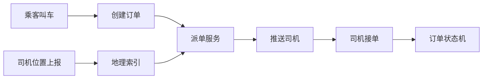

# 打车派单系统设计

> 打车派单考察实时位置、供需匹配、地理索引、派单策略、超时重试、司机状态和一致性。

## 一、需求澄清

核心功能：

- 乘客发起叫车。
- 司机上报位置。
- 系统匹配附近司机。
- 司机抢单或系统派单。
- 订单状态流转。
- 超时重试和取消。

非功能：

- 低延迟。
- 高可用。
- 防重复派单。
- 供需高峰削峰。
- 司机位置实时但可近似。

## 二、核心链路



## 三、数据模型

订单：

```text
order_id
rider_id
start_location
end_location
status
driver_id
created_at
updated_at
```

司机状态：

```text
driver_id
status: ONLINE / BUSY / OFFLINE
location
last_active_time
service_area
```

地理索引：

- Redis GEO。
- Geohash。
- S2 / H3 网格。

## 四、派单策略

### 1. 附近优先

按距离筛选附近司机。

问题：

- 最近司机不一定最合适。
- 高峰期容易局部热点。

### 2. 综合评分

评分维度：

- 距离。
- ETA。
- 司机空闲时长。
- 司机服务分。
- 取消率。
- 车型匹配。
- 顺路程度。

```text
score = distance_weight + eta_weight + idle_weight + quality_weight
```

### 3. 批量派单

不是一次只找一个司机，而是：

```text
候选司机 Top N
  -> 分批推送
  -> 超时后扩大半径
```

## 五、一致性问题

### 防重复接单

司机接单时必须做条件更新：

```sql
UPDATE orders
SET status = 'ACCEPTED', driver_id = ?
WHERE order_id = ? AND status = 'DISPATCHING';
```

只有一行更新成功才算接单成功。

### 司机状态

接单成功后：

- 订单状态变为 `ACCEPTED`。
- 司机状态变为 `BUSY`。
- 其他派单任务停止。

需要本地事务或最终一致补偿。

## 六、超时和重试

派单流程：

```text
派给一批司机
  -> 等待 10s
  -> 无人接单
  -> 扩大半径
  -> 再派下一批
  -> 超过次数进入人工/加价/失败
```

注意：

- 不能无限重试。
- 司机响应晚了要校验订单状态。
- 乘客取消后派单要停止。

## 七、高峰治理

- 分区域限流。
- 动态加价。
- 预约排队。
- 热点区域扩容。
- 司机端位置上报降频。
- 派单任务异步化。

## 八、常见坑

- 只按最近距离派单，忽略 ETA 和司机状态。
- 司机位置上报过频，打爆写入链路。
- 接单没有条件更新，导致重复接单。
- 派单任务没有取消，乘客取消后还在推送。
- 地理索引精度过细或过粗。
- 高峰期没有分区域限流。

## 九、面试表达

```text
打车派单我会拆成位置上报、地理索引、候选司机召回、派单策略、订单状态机和超时重试。
附近司机可以用 Redis GEO、Geohash 或 S2/H3 网格召回，再按距离、ETA、司机状态和服务质量打分。
一致性上，司机接单必须用订单状态条件更新保证只有一个司机成功，司机状态和订单状态要有事务或补偿。
高峰期要做分区域限流、扩大半径、动态加价和派单异步化。
```

