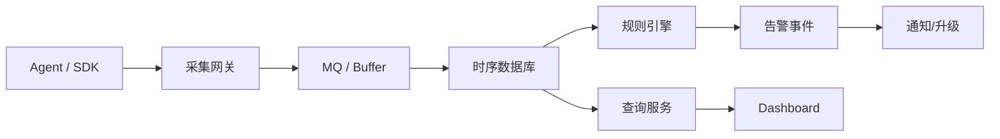

# 监控告警系统设计

> 监控告警考察指标采集、时序存储、规则计算、告警收敛、通知升级和事故闭环。

## 一、需求澄清

核心功能：

- 采集指标。
- 存储时序数据。
- 查询和展示。
- 告警规则。
- 通知和值班。
- 告警收敛和恢复。

非功能：

- 高吞吐写入。
- 低延迟告警。
- 高可用。
- 可扩展。
- 防告警风暴。

## 二、整体架构



## 三、指标模型

```text
metric_name
labels: service, instance, region, env
timestamp
value
```

例子：

```text
http_request_duration_ms{service="order", api="/pay", region="hz"}
```

注意：

- label 不能无限增长。
- user_id、order_id 不适合作为指标 label。
- 高基数会打爆存储和查询。

## 四、采集链路

方式：

- Pull：Prometheus 拉取。
- Push：Agent 主动上报。
- SDK 埋点。
- 日志转指标。

取舍：

| 方式 | 优点 | 缺点 |
| --- | --- | --- |
| Pull | 服务发现简单，控制采集频率 | 跨网络复杂 |
| Push | 适合短任务和多网络环境 | 网关压力大 |
| SDK | 业务语义强 | 侵入代码 |

## 五、告警规则

常见规则：

- 错误率超过阈值。
- P99 延迟升高。
- QPS 突降。
- CPU/内存/磁盘水位。
- MQ lag。
- DB 连接池等待。

不要只盯资源，要盯用户影响：

```text
错误率 / P99 / 核心业务量
  > CPU / 内存
```

## 六、告警收敛

问题：

```text
一个机房故障
  -> 上千个实例告警
  -> 通知爆炸
  -> 值班无法判断根因
```

收敛方式：

- 按服务聚合。
- 按机房聚合。
- 父子告警抑制。
- 相同告警合并。
- 恢复通知。
- 告警静默。

## 七、高可用和扩展

- 采集网关水平扩展。
- MQ 缓冲削峰。
- TSDB 分片和副本。
- 规则引擎分组计算。
- 通知服务重试和降级。
- 跨机房部署。

## 八、常见坑

- 指标 label 高基数。
- 告警太多，没人看。
- 只报机器资源，不报业务影响。
- 没有恢复通知。
- 告警没有 owner。
- 规则变更没有审计。
- Dashboard 好看但排障没用。

## 九、面试表达

```text
监控告警系统我会分采集、传输、存储、查询、规则计算和通知闭环。
指标模型要控制 label 基数，避免 user_id/order_id 这种高基数字段打爆 TSDB。
告警设计优先关注用户影响，比如错误率、P99、核心业务量和 MQ lag，再看 CPU、内存等资源。
为了避免告警风暴，需要按服务、机房和根因做聚合、抑制、静默和升级。
```

