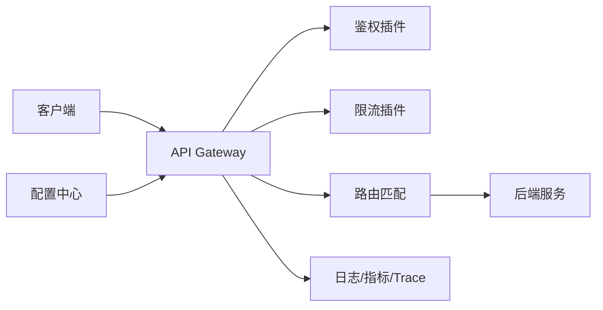

# API 网关系统设计

> API 网关考察统一入口、路由、鉴权、限流、熔断、灰度、观测和插件化能力。

## 一、核心职责

- 路由转发。
- 鉴权认证。
- 限流。
- 熔断降级。
- 请求改写。
- 灰度发布。
- 观测埋点。
- 协议转换。

网关不是业务系统，核心是通用治理能力。

## 二、整体架构



## 三、请求链路

```text
接收请求
  -> 解析路由
  -> 鉴权
  -> 限流
  -> 灰度匹配
  -> 转发后端
  -> 超时/重试/熔断
  -> 记录日志指标
```

顺序很重要：

- 鉴权尽量早，拒绝非法请求。
- 限流在转发前保护后端。
- 重试只对幂等请求。

## 四、路由设计

路由维度：

- Host。
- Path。
- Method。
- Header。
- Query。
- 权重。
- 服务版本。

支持：

- 精确匹配。
- 前缀匹配。
- 正则匹配。
- 权重路由。
- 灰度路由。

## 五、限流设计

维度：

- IP。
- 用户。
- App。
- API。
- 服务。
- 租户。

算法：

- 令牌桶。
- 漏桶。
- 滑动窗口。

分布式限流：

- 本地限流：性能高，但不全局精确。
- Redis 限流：全局一致，但有网络开销。
- 网关集群按权重分配额度。

## 六、熔断和降级

熔断依据：

- 错误率。
- 超时率。
- P99。
- 并发数。

降级方式：

- 返回默认值。
- 拒绝非核心请求。
- 走缓存。
- 只读模式。

## 七、灰度发布

灰度维度：

- 用户 ID。
- 地域。
- App 版本。
- Header。
- 百分比。

注意：

- 灰度规则要可审计。
- 支持快速回滚。
- 要有命中统计。
- 规则冲突要有优先级。

## 八、高可用

- 网关无状态。
- 多实例部署。
- 配置本地缓存。
- 配置变更增量推送。
- 后端健康检查。
- 超时控制。
- 过载保护。

## 九、常见坑

- 网关逻辑塞入业务规则，变成大单体。
- 重试非幂等请求，导致重复下单。
- 配置中心故障导致网关不可用。
- 限流只看 IP，误伤 NAT 用户。
- 没有分层超时。
- 日志过大拖慢网关。
- 插件顺序混乱。

## 十、面试表达

```text
API 网关我会定位为统一入口和服务治理层，核心能力是路由、鉴权、限流、熔断、灰度和可观测性。
网关要尽量无状态，配置本地缓存，避免配置中心故障影响已有流量。
限流可以按 IP、用户、App、API 多维度做，本地限流性能高，Redis 限流更全局但有开销。
重试必须只对幂等请求，业务逻辑不要放太多到网关，避免网关变成新的单体。
```

