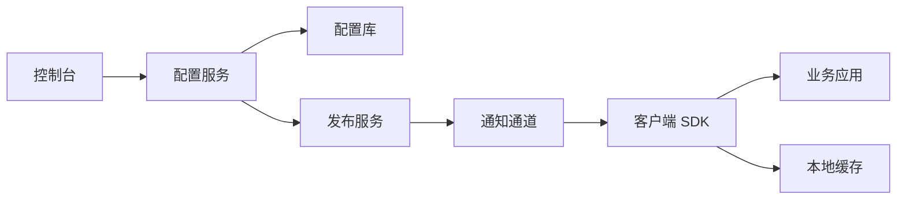

# 配置中心系统设计

> 配置中心考察配置模型、发布流程、灰度、回滚、推拉机制、版本管理和高可用。

## 一、核心功能

- 配置创建和编辑。
- 环境隔离。
- 版本管理。
- 灰度发布。
- 回滚。
- 客户端订阅。
- 权限和审计。

## 二、整体架构



## 三、配置模型

```text
namespace
app_id
env
cluster
key
value
version
status
operator
created_at
updated_at
```

关键设计：

- 按应用隔离。
- 按环境隔离。
- 支持集群/机房维度。
- 支持版本。
- 支持回滚。

## 四、推还是拉

| 方式 | 优点 | 缺点 |
| --- | --- | --- |
| 客户端轮询 | 简单可靠 | 延迟和请求量 |
| 长轮询 | 实时性较好 | 服务端连接压力 |
| WebSocket/gRPC stream | 实时 | 连接管理复杂 |
| MQ 推送 | 解耦 | 客户端依赖消息链路 |

常见方案：

```text
长轮询 + 本地缓存 + 定期全量校验
```

## 五、发布流程

```text
编辑配置
  -> 保存草稿
  -> 审批
  -> 灰度发布
  -> 观察指标
  -> 全量发布
  -> 可回滚
```

配置发布是高风险操作，要和代码发布一样严肃。

## 六、灰度和回滚

灰度维度：

- 实例。
- 机房。
- 用户。
- 百分比。
- 标签。

回滚：

- 保存历史版本。
- 一键回滚到指定版本。
- 回滚也要通知客户端。
- 记录操作审计。

## 七、客户端 SDK

能力：

- 拉取配置。
- 本地缓存。
- 监听变更。
- 解析类型。
- 默认值。
- 失败降级。

关键：

```text
配置中心不可用时，业务应用应该继续使用本地最后一次可用配置。
```

## 八、高可用

- 配置服务多实例。
- DB 主从。
- 客户端本地缓存。
- 通知失败后轮询兜底。
- 发布限流。
- 配置变更审计。

## 九、常见坑

- 配置没有版本，无法回滚。
- 配置变更没有审批和审计。
- 客户端启动强依赖配置中心。
- 配置中心故障导致业务不可用。
- 灰度规则混乱。
- 配置格式错误没有校验。
- 敏感配置明文存储。

## 十、面试表达

```text
配置中心我会重点讲配置模型、发布流程、客户端订阅和高可用。
配置要按应用、环境、集群隔离，并且有版本、审批、灰度、回滚和审计。
客户端不能强依赖配置中心，必须有本地缓存和默认值，通知失败时通过定期拉取兜底。
配置发布本质也是生产变更，要做校验、灰度和快速回滚。
```

