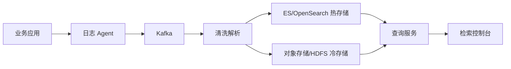

# 日志检索平台设计

> 日志检索平台考察日志采集、清洗、索引、冷热存储、查询、权限、多租户和成本控制。

## 一、核心需求

- 应用日志采集。
- 日志清洗和结构化。
- 全文检索。
- 按 trace_id、服务、时间查询。
- 告警联动。
- 冷热存储。
- 权限控制。

## 二、整体架构



## 三、日志模型

```text
timestamp
service
instance
level
trace_id
span_id
message
fields
env
region
```

建议：

- 日志结构化。
- 统一 trace_id。
- level 规范。
- 避免打印敏感信息。
- 高频日志采样。

## 四、采集链路

常见方案：

- Filebeat / Fluent Bit / Vector。
- Agent 读取本地文件。
- 写入 Kafka 缓冲。
- 清洗后写 ES。

为什么要 Kafka：

- 削峰。
- 解耦采集和索引。
- 防 ES 抖动丢日志。
- 支持多消费者。

## 五、索引设计

ES 索引按时间拆：

```text
logs-{service}-{yyyy.MM.dd}
```

注意：

- 控制字段数量。
- 控制高基数字段。
- message 全文索引。
- trace_id / service / level 做 keyword。
- 设置生命周期 ILM。

## 六、冷热分层

热数据：

- 最近 3~7 天。
- ES/OpenSearch。
- 快速查询。

冷数据：

- 30~180 天。
- 对象存储 / HDFS。
- 查询慢但成本低。

查询策略：

```text
短时间范围查 ES
长时间范围查冷存储或异步任务
```

## 七、查询和权限

查询能力：

- 按时间范围。
- 按服务。
- 按 trace_id。
- 按关键词。
- 按字段过滤。

权限：

- 按团队/应用授权。
- 敏感字段脱敏。
- 查询审计。
- 下载限制。

## 八、稳定性和成本

常见风险：

- 日志量突增打爆 ES。
- 单条日志过大。
- 字段爆炸。
- 查询大时间范围拖垮集群。
- debug 日志长期打开。

治理：

- 日志限速。
- 采样。
- 字段白名单。
- 索引生命周期。
- 查询时间范围限制。
- 大查询异步化。

## 九、常见坑

- 业务直接写 ES，没有 Kafka 缓冲。
- 所有字段都建索引。
- trace_id 没有统一。
- 日志里有敏感信息。
- 查询无限时间范围。
- ES 既做检索又长期保存冷数据，成本爆炸。
- 日志平台没有多租户权限。

## 十、面试表达

```text
日志检索平台我会分采集、缓冲、清洗、索引、查询和冷热存储。
采集侧用 Agent，Kafka 做削峰和解耦，热数据写 ES/OpenSearch，冷数据落对象存储。
索引要控制字段和高基数，trace_id、service、level 用 keyword，message 做全文检索。
稳定性上要做日志限速、采样、索引生命周期、查询范围限制和权限审计。
```

