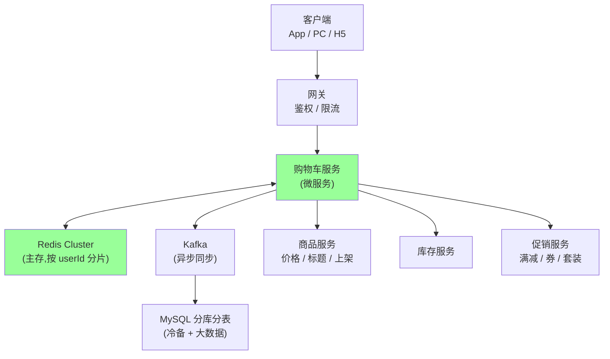
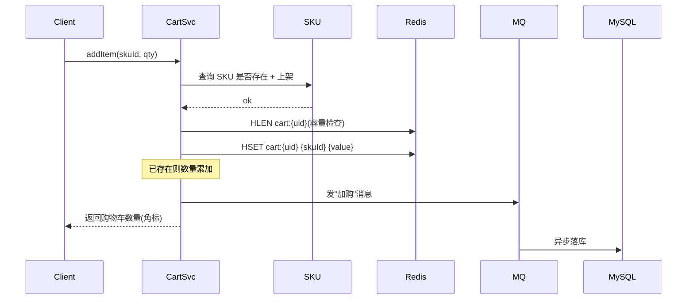
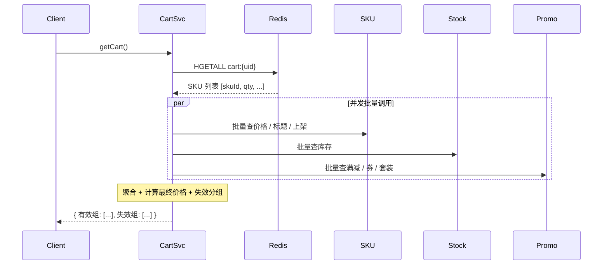

# 购物车系统(京东 / 淘宝)

> 购物车看着简单,实际是**高 QPS + 多端同步 + 实时聚合(价格/库存/促销)**的复合场景。
> 一句话:**Redis Hash 主存(按 userId 分片) + MQ 异步落 MySQL + 价格/库存/促销实时聚合**;只存用户选择,不存价格库存,失效商品标记不删。

## 一、需求澄清

核心功能:

- 加入购物车(增 / 合并)
- 修改数量 / 选中状态
- 删除商品 / 一键清空
- 全选 / 反选 / 按店铺选
- 跨端同步(App / PC / H5)
- 失效商品展示(下架 / 售罄 / 区域不送达)
- 未登录购物车 + 登录后合并

关键约束:

- 一个用户购物车容量 100~200 SKU
- 加购 QPS 极高(商详页加购按钮、大促前夜)
- 价格 / 库存 / 促销变化频繁,购物车展示要"看上去实时"
- 加购**不锁库存**,只在提交订单时预占
- 跨自营 / POP 第三方:展示按店铺分组,提交按店铺拆单

非功能:

- P99 < 100ms(查询)
- 大促容灾:商品 / 库存服务挂了购物车要能降级展示

## 二、整体架构



未登录链路:浏览器 LocalStorage / Cookie 本地存储,登录时与云端 merge。

## 三、数据模型

### 3.1 Redis Hash 结构(主存)

```text
key:    cart:{userId}                ← 按 userId 分片
field:  {skuId}                      ← 商品 SKU
value:  JSON{qty, addTime, checked, channel, promoId}
```

**为什么用 Hash 不是 String / List**:

- 单 SKU 增删改 O(1)(`HSET` / `HDEL`),不用反序列化整个购物车
- `HLEN` 直接拿 SKU 数,容量校验 O(1)
- field 数量天然限制容量(配合业务侧)

**为什么不用 MySQL 主存**:

- 加购 QPS 极高,Redis 顶住
- 购物车数据"重要但可重建"(还有 MySQL 异步备份兜底)

### 3.2 购物车项字段

```go
type CartItem struct {
    SkuID    int64  // 商品 SKU
    Quantity int32  // 数量
    AddTime  int64  // 加购时间(用于排序、清理)
    Checked  bool   // 选中状态
    Channel  string // 加购渠道(App/PC/H5,数据分析用)
    PromoID  int64  // 加购时绑的促销(套装、赠品)
    Invalid  uint8  // 失效原因:0 有效 / 1 下架 / 2 售罄 / 3 不送达
}
```

**关键决策:不存价格快照**

- 价格随时变,缓存了反而不一致
- 每次查询从商品服务实时拉
- 例外:加购时绑了"满减组合 / 套装",存 PromoID 锁定优惠

### 3.3 MySQL 表(冷备)

```sql
CREATE TABLE t_cart (
    id          BIGINT PRIMARY KEY,
    user_id     BIGINT NOT NULL,
    sku_id      BIGINT NOT NULL,
    quantity    INT NOT NULL,
    checked     TINYINT,
    add_time    BIGINT,
    update_time BIGINT,
    UNIQUE KEY uk_user_sku (user_id, sku_id),
    KEY idx_user (user_id)
) -- 按 user_id 分库分表
```

## 四、核心流程

### 4.1 加购



要点:

- **不查库存**:加购不锁库存,等下单再校验
- **容量超限**:返回"购物车已满,请清理"(JD 会员卡可放宽到 200)
- **MQ 异步**:解耦下游(数据分析、推荐、营销)

### 4.2 查询(最复杂)



要点:

- **批量并发**:三个下游并发调用(`errgroup`),省 RTT
- **失效分组**:下架 / 售罄 / 区域不送达单独一组,前端置灰展示
- **降级**:任一下游挂了,降级显示"加载中"而非整页报错

### 4.3 修改 / 删除

```text
修改数量:  HSET cart:{uid} {skuId} {newValue}  (覆盖)
删除单个:  HDEL cart:{uid} {skuId}
清空购物车: DEL cart:{uid}
全选:      遍历 HGETALL → MULTI HSET(checked=1)
```

修改 / 删除都要发 MQ 同步到 MySQL。

## 五、关键设计点(资深视角)

### 5.1 未登录购物车 + 登录合并

未登录:

- **LocalStorage**(>4KB,优先) → 降级到 **Cookie**(<4KB)
- 数据格式同 Redis(便于合并)

登录后合并:

```text
1. 取本地购物车(数组)
2. 取云端购物车 HGETALL cart:{uid}
3. 同 SKU:数量"求和"(JD/淘宝主流策略)
   - 不取 max:用户在不同端加的应该都算
   - 不取本地:用户期望"我的"购物车数量
4. 容量超限:按加购时间倒序保留
5. 写入云端,清空本地
```

**为什么求和**:产品决策。用户在 PC 加 1 个、手机加 2 个,合并后期望看到 3 个。

### 5.2 价格 / 库存的实时性

**不在购物车冷藏,每次查询走商品 / 库存服务**。

- 优点:用户看到的永远是当前价 / 当前库存
- 代价:购物车查询要打三个下游
- 大促时:商品 / 库存服务可能被打挂 → 购物车降级显示"库存查询中"

**坑**:用户加购时 100 元,半小时后涨到 120 元。结算页**二次确认价格**,用户点确认才下单(避免下单后扯皮)。

### 5.3 失效商品

下架 / 售罄 / 区域不送达 → **标记 invalid 不删**。

- **为什么不删**:用户可能在等补货 / 等返货
- 前端弱提醒 + 一键清理按钮
- 不自动删(产品决策)

```text
HSET cart:{uid} {skuId} {value with invalid=2}
```

### 5.4 跨端同步

App / PC / H5 都读同一个 `cart:{uid}`,数据同源。

实时性策略:

- **主动刷新**(主流):进入购物车页拉一次
- **被动推送**:WebSocket / 长轮询(用得少,购物车不是 IM)
- **角标数量**:进入 App 拉一次 `HLEN`

### 5.5 大促容量与热点

大促囤货 → 容量上限收紧到 100~200。

热点用户(主播 / 黄牛):

- 单用户购物车 500+ SKU → 大 Key
- `HGETALL` 卡 Redis 单分片
- 监控 + 限制 + 必要时 hash 二级分片(`cart:{uid}:0` / `cart:{uid}:1`)

### 5.6 自营 vs POP 拆单

JD 同时有自营(京东)和 POP(第三方店铺):

- 购物车展示**按店铺分组**
- 提交订单时**按店铺拆单**(每店一笔订单 → 各自走自己的发货 / 售后)
- 优惠券绑店铺,不能跨店用
- 满减按店铺独立计算

### 5.7 加购不锁库存

**加购 ≠ 下单**,不预占库存,理由:

- 防恶意占库存(把热销商品全加购物车不下单)
- 真实成单率 < 30%,预占无意义
- 库存压力小

预占只发生在**提交订单**时:`库存预占 → 待支付 → 支付成功扣减 / 取消释放`。

## 六、性能与容量估算

| 指标 | 估算 |
| --- | --- |
| 用户量 | 5 亿(JD 注册) |
| 活跃日 DAU | 1 亿 |
| 单用户购物车 | 平均 30 SKU,P99 100 |
| Redis 内存 | 每 SKU ~100B,1 亿活跃 × 30 = 300GB(分片) |
| 加购 QPS | 平峰 5w / 大促峰值 50w+ |
| 查询 QPS | 平峰 20w / 大促峰值 200w+(每次查购物车要打商品/库存/促销) |

Redis Cluster:**按 userId 分 32 / 64 个分片**,每片 5~10GB。

## 七、典型坑

| 坑 | 现象 | 修复 |
| --- | --- | --- |
| **价格预占歧义** | 用户以为加购锁价 | 明确文案"加购不锁价";结算页二次确认 |
| **库存预占歧义** | 加购就少库存 | 明确"加购不锁库存,下单才预占" |
| **大 Key** | 黄牛购物车 500 SKU,HGETALL 卡死 | 容量限制 + 监控大 Key + hash 二级分片 |
| **缓存击穿** | 用户清空购物车 → 缓存空 → DB 被狂查 | 空值缓存(短 TTL)/ 直接信任 Redis 不回 DB |
| **合并冲突** | 登录时本地 SKU 与云端冲突 | 求和(JD/淘宝)/ 取大(部分电商)/ 让用户选 |
| **失效商品堆积** | 50% 是失效商品 | 弱提醒 + 一键清理,不自动删 |
| **三下游级联挂** | 商品服务挂 → 购物车整页报错 | 单独降级:商品挂显示骨架屏,库存挂显示"库存查询中" |
| **MQ 丢消息导致 MySQL 不一致** | Redis 有 MySQL 没有 | 定期对账任务(扫 Redis vs MySQL diff) |
| **多端推送延迟** | PC 加购,手机不刷新 | 主动刷新策略 + 进入购物车页强制拉一次 |
| **促销失效未感知** | 加购时有满减,结算时活动结束 | 结算页重新计算促销,按当前规则展示 |

## 八、和淘宝 / 拼多多对比

| | 京东 | 淘宝 | 拼多多 |
| --- | --- | --- | --- |
| 容量 | ~100(会员 200) | 200+ | ~120 |
| 失效商品 | 标记不删 | 标记不删 | 标记不删 |
| 套装 / 赠品 | 加购绑 PromoID | 类似 | 弱化(主推拼团) |
| 拆单逻辑 | 按店铺(自营 / POP) | 按店铺 | 按团 / 店铺 |
| 价格预占 | 不预占 | 不预占 | 不预占 |
| 主存 | Redis Hash | Tair(阿里自研) | Redis |

## 九、Go 代码示例

### 9.1 加购

```go
func (s *CartService) AddItem(ctx context.Context, uid, skuId int64, qty int32) error {
    // 1. 校验 SKU
    sku, err := s.skuClient.GetSKU(ctx, skuId)
    if err != nil || !sku.OnShelf {
        return ErrSKUNotAvailable
    }

    // 2. 容量检查
    key := fmt.Sprintf("cart:%d", uid)
    cnt, _ := s.redis.HLen(ctx, key).Result()
    if cnt >= maxCartSize && !s.redis.HExists(ctx, key, fmt.Sprint(skuId)).Val() {
        return ErrCartFull
    }

    // 3. HSET(已存在累加 qty)
    item, _ := s.getOrNew(ctx, key, skuId)
    item.Quantity += qty
    item.AddTime = time.Now().Unix()
    if err := s.redis.HSet(ctx, key, fmt.Sprint(skuId), item.Encode()).Err(); err != nil {
        return err
    }

    // 4. 异步 MQ
    s.mq.Publish(ctx, "cart.add", &CartEvent{UID: uid, SkuID: skuId, Qty: qty})
    return nil
}
```

### 9.2 查询(并发聚合)

```go
func (s *CartService) GetCart(ctx context.Context, uid int64) (*CartView, error) {
    key := fmt.Sprintf("cart:%d", uid)
    raw, err := s.redis.HGetAll(ctx, key).Result()
    if err != nil {
        return nil, err
    }
    items := decodeItems(raw)
    skuIds := extractSkuIds(items)

    // 并发查三个下游
    var skus map[int64]*SKU
    var stocks map[int64]int32
    var promos map[int64]*Promo
    g, gctx := errgroup.WithContext(ctx)
    g.Go(func() (err error) { skus, err = s.skuClient.BatchGet(gctx, skuIds); return })
    g.Go(func() (err error) { stocks, err = s.stockClient.BatchGet(gctx, skuIds); return })
    g.Go(func() (err error) { promos, err = s.promoClient.BatchGet(gctx, skuIds); return })
    if err := g.Wait(); err != nil {
        // 单个下游失败,降级展示(打 metric)
        log.Warn("partial fail", "err", err)
    }

    return aggregate(items, skus, stocks, promos), nil
}
```

## 十、一句话总结

> **购物车 = Redis Hash(`cart:{uid}` field=skuId)主存 + MQ 异步落 MySQL + 商品/促销/库存服务实时聚合**;
>
> 核心设计:
> - **只存用户选择**(skuId / 数量 / 选中),**不存价格库存**(实时拉)
> - **失效商品标记不删**(用户可能等补货)
> - **加购不锁库存**(下单时才预占,防恶意占库)
> - **未登录本地存 + 登录后求和合并**
> - **按店铺分组展示 + 拆单**(自营 vs POP)
>
> 难点不在 CRUD,而在**多端同步、价格库存的实时性兜底、大促容量与降级**。
