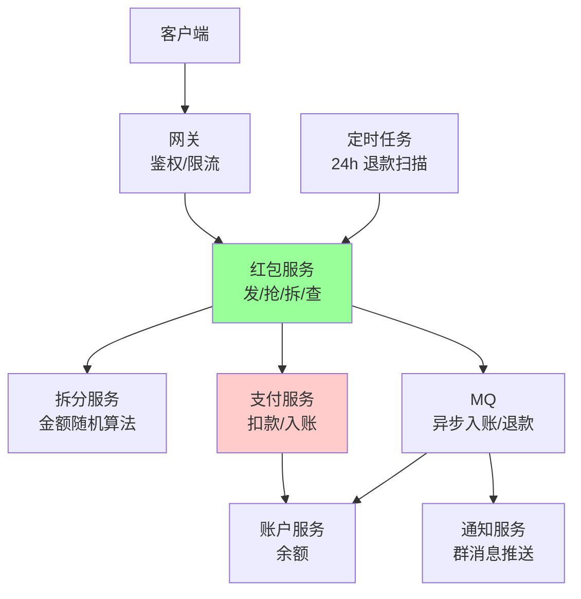
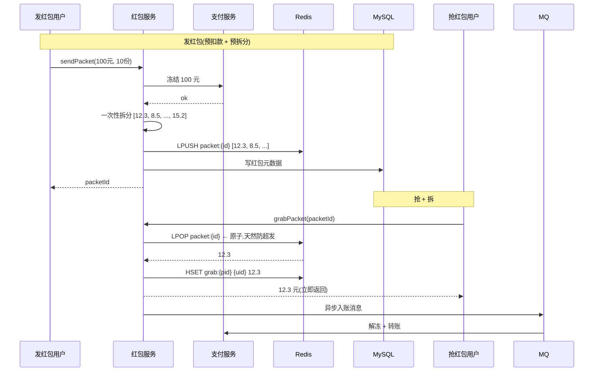

# 抢红包系统(微信 / 支付宝)

> 本篇用 **4S 法**(Scenario / Service / Storage / Scale)完整推导一次,作为 4S 框架的样板。
> 抢红包是经典考题:**钱 + 高并发 + 不能超发 + 不能丢 + 还要"拆得有趣"**,几乎踩遍系统设计所有考点。

---

## S1 · Scenario · 场景分析

> 目标:**问清楚业务边界 + 估算量级**,不要一上来画架构。

### 1.1 澄清问题

资深做法是先反问而不是直接答:

| 反问 | 决策影响 |
| --- | --- |
| 红包类型?(普通 / 拼手气 / 专属) | 拆分算法 / 是否预拆 |
| 单个红包最大金额 / 最多人数? | 单红包存储结构 / 锁粒度 |
| 是否要"超时退回"? | 异步任务 / 退款链路 |
| 必须强一致?(钱不能错) | 存储选型 / 事务方案 |
| 是否要"看谁抢了 / 手气最佳"? | 是否存抢红包明细 |
| 是否要"延迟到账 / T+1"? | 资金链路复杂度 |

**本篇假设**(明确边界,免得设计跑偏):
- 微信群拼手气红包:发 100 元拆 10 份,金额随机
- 24 小时未抢完自动退回
- 展示抢红包列表 + 手气最佳

### 1.2 核心动作(列动作,不列模块)

```text
发红包 sendPacket(amount, count, groupId)
抢红包 grabPacket(packetId, userId)
拆红包 openPacket(packetId, userId)    ← 真正扣钱时机
查红包 queryPacket(packetId)
退红包 refundPacket(packetId)          ← 24h 兜底
```

> "抢"和"拆"是两步:抢只是锁名额,拆才扣金额。这是微信公开的设计,大幅降低写竞争。

### 1.3 量化估算

| 指标 | 估算 | 推导 |
| --- | --- | --- |
| DAU | 10 亿(微信级)| - |
| 春节峰值发红包 QPS | **50 万** | 历史公开数据 |
| 春节峰值抢红包 QPS | **500 万** | 1 红包平均 10 人抢 |
| 单红包大小 | ~200B | id + amount + 状态 |
| 日红包总量 | 10 亿 | 春节单日 |
| 存储增量 | 200GB/日(明细另算)| - |

> **关键发现**:抢 >> 发(10:1),且抢操作是**写竞争**,这决定了后面 Storage 必须避开行锁。

---

## S2 · Service · 服务拆分

> 目标:**按动作识别模块 + 画出核心链路时序图**。

### 2.1 模块划分



**为什么这么拆**:
- **红包服务**和**支付服务**分开 → 红包逻辑变化频繁,支付链路需要稳定(合规审计)
- **拆分服务**独立 → 算法可独立演进(二倍均值法 → 改其他都不影响主链路)
- **MQ 异步入账** → 抢到红包的人不需要等扣款链路同步完成

### 2.2 核心链路:发 + 抢 + 拆



**关键决策(资深信号)**:

| 设计 | 为什么 |
| --- | --- |
| **发红包时一次性预拆**,不是抢时实时拆 | 抢操作变成 LPOP O(1),零计算 + 天然防超发 |
| **抢和扣钱解耦**(MQ 异步) | 抢的体验"立即到账"(其实是显示);真实资金 T 秒内对账 |
| **预扣款 + 异步真实扣** | 防超发的核心:钱先冻结,后慢慢动 |
| **24h 退款** | 没抢完的金额从冻结池退回 |

### 2.3 一致性 / 失败模型(隐含 C 维度)

| 链路 | 一致性级别 | 失败兜底 |
| --- | --- | --- |
| 发红包扣款 | **强一致**(支付事务)| 失败回滚整个红包 |
| 抢红包 | **强一致**(Redis 原子) | LPOP 失败客户端重试 |
| 入账(抢到的钱到账户) | **最终一致**(MQ + 对账)| 对账任务每小时扫 diff |
| 24h 退款 | **最终一致**(定时扫描)| 定时任务幂等重跑 |

> "钱"必须强一致,"展示"可以最终一致。把这两层拆开是关键。

---

## S3 · Storage · 存储设计

> 目标:**选型 + 表结构 + 缓存策略**,直接对齐 Scenario 估算的量级。

### 3.1 存储选型

| 数据 | 存储 | 理由 |
| --- | --- | --- |
| 红包待抢金额列表 | **Redis List** `packet:{id}` | LPOP 原子,QPS 500w 顶得住 |
| 红包元数据 | MySQL `t_packet` | 持久 + 审计 |
| 抢红包明细 | **Redis Hash** `grab:{id}` + 异步落 MySQL | 写竞争靠 Redis,落库异步 |
| 用户余额 | MySQL(分库分表)+ 账户服务 | 强一致,走支付链路 |
| 红包详情页(谁抢了) | MySQL `t_grab_detail` | 历史可查 |

**为什么用 Redis List 不是 Redis 计数器**:
- 计数器方案需要"拆金额"算法在线运行,有计算 + 写竞争
- List 方案"发红包时一次性算完",抢操作纯 LPOP,**写竞争降到 0**

### 3.2 关键表

```sql
-- 红包主表(分库分表,按 packet_id hash)
CREATE TABLE t_packet (
    packet_id    BIGINT PRIMARY KEY,
    sender_id    BIGINT,
    group_id     BIGINT,
    total_amount DECIMAL(10,2),
    total_count  INT,
    grabbed_count INT,
    status       TINYINT,   -- 0 进行中 / 1 抢完 / 2 已退款
    create_time  BIGINT,
    expire_time  BIGINT,
    KEY idx_expire (status, expire_time)  -- 退款扫描
);

-- 抢红包明细(分库分表,按 packet_id hash → 同一红包数据在一片)
CREATE TABLE t_grab_detail (
    id          BIGINT PRIMARY KEY,
    packet_id   BIGINT,
    user_id     BIGINT,
    amount      DECIMAL(10,2),
    grab_time   BIGINT,
    UNIQUE KEY uk_packet_user (packet_id, user_id)  -- 防重抢
);
```

### 3.3 金额随机算法(二倍均值法)

```go
// 剩余 N 份,剩余 M 元,本次随机区间 [0.01, 2*M/N]
func split(remain float64, count int) float64 {
    if count == 1 { return remain }
    max := remain / float64(count) * 2
    return rand.Float64() * (max - 0.01) + 0.01
}
```

**为什么不平均分**:运营要的是"拼手气"的趣味性。
**为什么二倍均值不是纯随机**:保证期望均匀 + 不会出现"前面拿完后面没钱"。

### 3.4 缓存一致性

- 红包元数据:**Cache-Aside**,TTL 24h(和退款时间对齐)
- 抢红包明细:**先写 Redis,再异步落 MySQL**(写后读一致用 Redis)
- 退款后:**Redis + MySQL 双写删除**

---

## S4 · Scale · 扩展设计

> 目标:**列痛点 → 给方案 → 讲代价**。不是"加缓存加 MQ"三板斧。

### 4.1 痛点 1:春节峰值 500w QPS 抢红包

| 方案 | 代价 |
| --- | --- |
| **Redis Cluster 分片** | 按 packetId hash,32~64 分片,单片扛 10w QPS |
| **本地预热**(发红包时把 List 写到对应分片) | 跨分片不可能,接受单红包定向到一片 |
| **客户端限流**(同一红包 1s 内只发一次请求) | 防用户疯狂点 |
| **网关层限流**(令牌桶,按 packetId) | 兜底,挡住异常流量 |

### 4.2 痛点 2:超级群红包(1 万人抢 1 个红包)

- **单 List 热点**:1 万人 LPOP 同一 key,单 Redis 分片打挂
- 方案:**红包分桶**(`packet:{id}:0` ~ `packet:{id}:7`),客户端 hash 到桶
- 代价:跨桶可能不均,需要预拆时按桶配比

### 4.3 痛点 3:钱不能错

| 风险 | 防护 |
| --- | --- |
| 重复抢 | UNIQUE KEY (packet_id, user_id) + Redis SET NX 双重防 |
| 超发(发 100 抢出 101)| 预拆 + LPOP 原子,天然不可能超发 |
| MQ 丢消息 → 钱没入账 | 对账任务:Redis 抢记录 vs MySQL 入账记录 diff |
| MQ 重复消费 → 多入账 | 入账幂等(account_log 唯一键: packet_id + user_id) |
| Redis 主从切换丢数据 | 关键操作走 MySQL 兜底 + 对账兜底 |

> **核心信条**:Redis 是性能层,MySQL 是真相层。任何分歧以 MySQL + 对账为准。

### 4.4 痛点 4:24h 退款

- 定时任务每分钟扫 `status=0 AND expire_time < now`
- **分片扫描**:任务节点按 packet_id mod N 各扫一片
- 退款幂等:`UPDATE t_packet SET status=2 WHERE status=0 AND ...`(乐观锁)
- 大量集中过期(凌晨 0 点):**打散过期时间 ± 5min 抖动**

### 4.5 痛点 5:容灾 / 降级

| 故障 | 降级 |
| --- | --- |
| Redis 集群整体挂 | 红包功能停服(钱不能错),只展示历史 |
| MQ 挂 | 同步入账(慢但不丢)+ 报警 |
| 支付服务挂 | 发红包接口熔断,已发红包正常抢(钱已冻结)|
| 单分片热点 | 二级分桶 + 客户端限流 |

### 4.6 反问:如果场景变化呢?(资深信号)

| 变化 | 设计如何演进 |
| --- | --- |
| QPS × 10(从 500w → 5000w)| Redis 分片 ×10;考虑端上预生成红包 token |
| 跨地域(出海)| 单红包定向到一个地域,不做跨地域同步 |
| 合规要求(实名 / 反洗钱)| 加 KYC 链路 + 大额红包人工审核 |
| 需要"红包封面 / 动画" | CDN 分发素材,与核心链路解耦 |

---

## 一句话总结

> **场景**:春节 500w QPS 抢红包,钱不能错、不能丢、不能超发。
> **服务**:发(预扣 + 预拆)→ 抢(LPOP)→ 异步入账,把"抢"和"扣钱"解耦。
> **存储**:Redis List 扛抢,MySQL 当真相,MQ 串异步入账。
> **扩展**:分片 + 分桶治热点,对账兜底一致性,降级保钱不保功能。
>
> 4S 的价值不是"四个字"本身,而是逼着你**先讲清边界和量级,再决定架构**——避免一上来就画"网关 + 服务 + Redis + MySQL"的空架子图。

---

## 4S 法回顾(本篇示范的写法)

| 阶段 | 关键动作 | 避免的反模式 |
| --- | --- | --- |
| **Scenario** | 反问澄清 + 列动作 + 量化估算 | 一上来画架构图 |
| **Service** | 按动作识别模块 + 画核心链路时序 | 堆 N 个微服务 |
| **Storage** | 选型对齐量级 + 一致性分层 | 默认 MySQL + Redis 不解释 |
| **Scale** | 列痛点 + 给方案 + 讲代价 + 反问演进 | 只说"加机器加缓存" |

> 参考方法论:[01-design-framework.md](01-design-framework.md) / [07-interview-answer-playbook.md](07-interview-answer-playbook.md)
