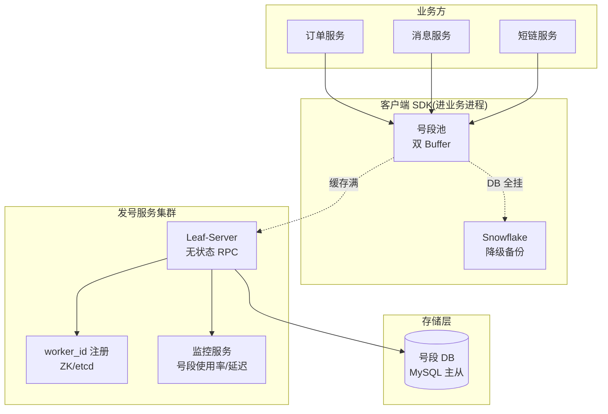
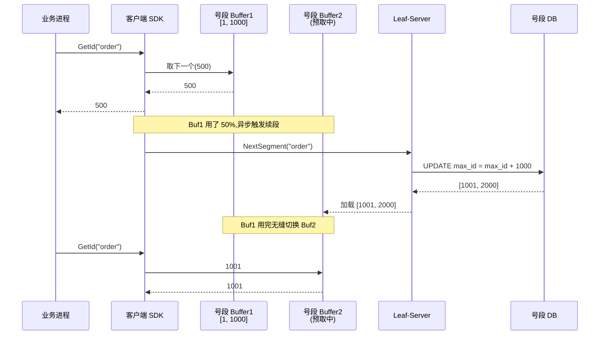
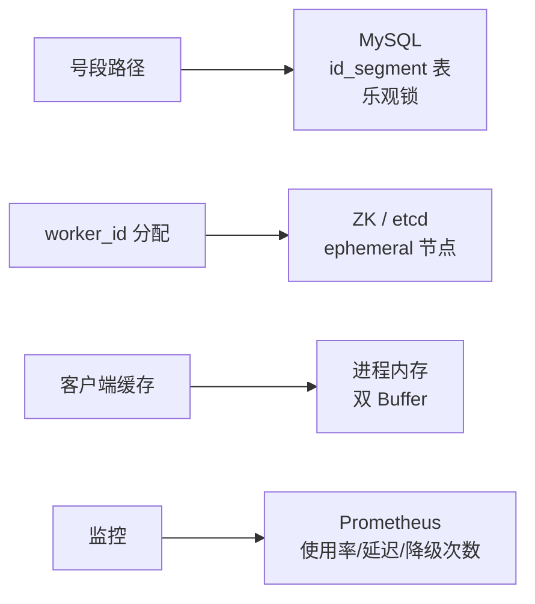
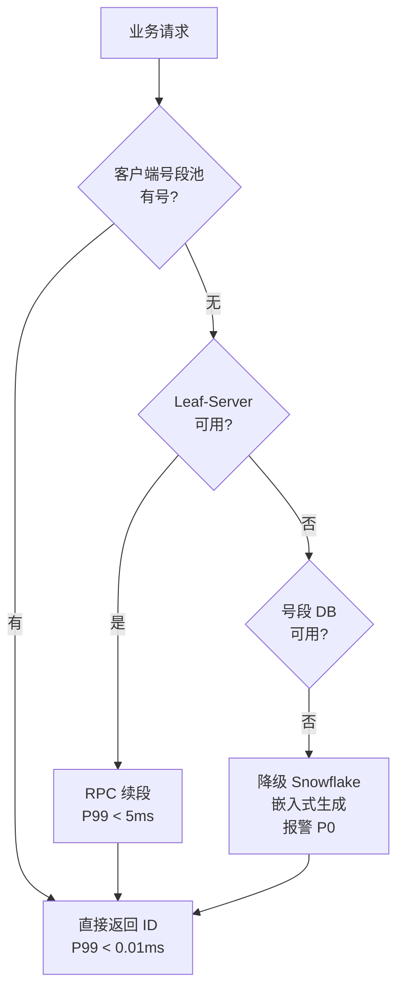

# 发号器系统(4S 版)

> 用 [01b-4s-method.md](01b-4s-method.md) 的 **4S 分析法**(Scenario / Service / Storage / Scale)推一遍**分布式 ID 发号器系统**。
>
> **目标**:把"分布式 ID"从"知识点"升级到"系统设计题"——美团 Leaf / 滴滴 TinyID / 百度 UidGenerator 都是面试常考的**真实工业系统**,本文按系统设计视角推一遍。
>
> **与 [06-distributed/05-id-generation.md](../06-distributed/05-id-generation.md) 的分工**:
> - 旧文 = **原理深度**:UUID/Snowflake/号段/Leaf 五方案对比 + 时钟回拨 + 源码级细节
> - 本文 = **系统设计视角**:容量 SLA / 服务拆分 / 存储选型 / 高可用演进
> - **两份都看**:写代码看旧文,白板答题用本文

---

## 一、为什么把发号器单独写一篇系统设计

发号器看起来"很小"——一个 `nextId()` 函数,实际上是**基础设施级别的服务**:

| 特点 | 影响 |
| --- | --- |
| **谁都依赖** | 订单/消息/短链/支付/IM 全用,挂了 = 全公司业务停摆 |
| **QPS 天花板高** | 大厂日均亿级 → 峰值百万 QPS |
| **SLA 苛刻** | P99 < 1ms,99.99% 可用 |
| **隐藏陷阱多** | 时钟回拨 / worker_id 分配 / 号段浪费 / 业务量泄露 |
| **架构决策权重大** | 嵌入式 vs RPC、推 vs 拉、双 Buffer 这些不是细节,是架构主线 |

所以它**完全够格当一道系统设计题**——而且常考(美团、字节、快手都问过)。

---

## 二、Scenario(场景分析,5 分钟)

**核心目标**:先问清楚谁用、规模多大、对延迟和可用性多苛刻——发号器是**基础设施**,SLA 比业务系统严一个量级。

### 2.1 功能分级

| 等级 | 功能 |
| --- | --- |
| **Must** | 全局唯一 / 高性能 / 高可用 / 趋势递增(InnoDB 友好) |
| **Nice** | 批量获取 / 多业务隔离(bizTag) / 监控可观测 / 安全(防枚举) |
| **Out** | 复杂业务编码(订单号格式、校验位)→ 业务方自己拼;ID → URL 映射(归短链) |

**反模式**:面试官说"设计发号器",你直接讲 Snowflake 64bit 拆分 → **错**。先问**谁用、QPS 多少、是否能容忍重启/时钟回拨**——嵌入式 SDK / 独立 RPC / 双 Buffer 三种部署模式完全不同。

### 2.2 容量估算

```text
公司级发号器使用方:
  订单系统:    日 1000 万单,峰值 1 万 QPS
  消息 ID:     日 100 亿条(IM + 推送),峰值 50 万 QPS
  支付/交易:   日 1000 万笔,峰值 1 万 QPS
  短链/Feed:   日 1 亿,峰值 5 万 QPS
  内部 trace:  日 100 亿,峰值 100 万 QPS

合计 QPS:    峰值 ≈ 150 万 QPS
日生成量:    数百亿

存储估算(号段方案):
  号段表 = (biz_tag, max_id, step, version) 几十行
  本身存储忽略不计
  关键是 DB 写入 QPS:每 step=1000 个 ID 写一次 → 150 万 QPS / 1000 = 1500 QPS 写库
  step=10000 → 150 QPS 写库 ← 完全可承受

部署规模:
  独立 RPC 服务:8-16 实例,无状态可水平扩
  嵌入式 SDK:每个业务进程自带号段池,DB 是唯一中心
```

**关键认知**:发号器的**写 QPS 不高**(批量取号),但**读 QPS 极高**(每条业务都要发号)——所以**批量预取 + 客户端缓存**是核心架构。

### 2.3 非功能要求(资深扣分点,发号器**最严**)

| 维度 | 要求 | 与业务系统对比 |
| --- | --- | --- |
| **唯一性** | **绝对唯一,任何场景不允许重复** | 比支付还严(支付允许重试,ID 重复=数据腐败) |
| **延迟** | P99 < 1ms,P999 < 5ms | 业务系统通常 P99 < 100ms |
| **可用性** | 99.99%~99.999%(挂了全公司停摆) | 比业务系统高一个量级 |
| **持久性** | 已发出的 ID 不能再发 | 重启/宕机/主从切换都不能回退 |
| **趋势递增** | DB B+ 树友好(订单号场景必须) | InnoDB 主键聚簇,随机 ID 性能差 10× |
| **安全性** | **不能从 ID 反推业务量** | 暴露业务量 = 商业机密泄露 |

### 2.4 设计定调(发号器的灵魂)

> "发号器是**基础设施**,核心矛盾是'**唯一性 + 高可用 + 高性能**三难'。我会让 **99% 的请求走客户端缓存**(零网络往返),让**号段服务做唯一性兜底**(预取号段),让**双 Buffer 异步续段**避免抖动,让 **Snowflake 模式做嵌入式备份**(DB 挂了也能发号)。**宁可浪费号段,绝不重复发号**。"

**这句话定下了整个系统的设计原则**——后面 Service / Storage / Scale 都围绕"**批量预取 + 双 Buffer + 多模兜底**"展开,**和秒杀的"防超卖"、支付的"防丢钱"、短链的"读优化"完全不同**——发号器是**纯基础设施**。

### 2.5 与其他 4S 系统的根本差异

| 维度 | 秒杀 | 支付 | 短链 | **发号器** |
| --- | --- | --- | --- | --- |
| QPS 瓶颈 | 写热点 | 不在性能 | 读热点 | **读极高(150 万)+ 写极低(几千)** |
| 核心矛盾 | 防超卖 | 资金安全 | 缓存命中 | **唯一性 + 永不停摆** |
| 一致性 | 强一致(单 sku) | 强一致(钱) | 最终一致 | **绝对唯一(任何时空)** |
| 客户端职责 | 薄(只发请求) | 薄 | 薄 | **厚(号段池 + 续段逻辑)** |
| 设计重心 | 防热点削峰 | 状态机+对账 | 多层缓存 | **批量 + 双 Buffer + 多模兜底** |

---

## 三、Service(服务拆分,10 分钟)

**核心目标**:按 SRP 拆服务,**讲清三种部署模式的选型**,**写出核心 API**。发号器的服务拆分核心是**"嵌入式 SDK vs 独立 RPC vs 客户端号段池"三选一**。

### 3.1 三种部署模式对比(架构决策)

| 模式 | 谁生成 | 优点 | 缺点 | 适用 |
| --- | --- | --- | --- | --- |
| **A. 嵌入式 SDK**(Snowflake)| 业务进程内 | 零网络往返、不依赖外部 | worker_id 分配难、时钟回拨 | 对 ID 长度不敏感、想极致性能 |
| **B. 独立 RPC 服务**(Leaf-server)| 集中服务发号 | 集中治理、易监控 | 网络往返、服务挂全停 | 中小流量、强一致优先 |
| **C. 双 Buffer 号段池**(主流 ⭐)| 客户端预取 + 服务端兜底 | 性能高、容忍服务短暂挂 | 实现复杂、重启浪费号段 | 大厂主流(美团 Leaf-segment) |

**推荐 C(双 Buffer)+ A(Snowflake 嵌入式备份)双模**:
- 默认走号段池(趋势递增、可读)
- DB 挂了自动降级到 Snowflake(嵌入式不依赖外部)
- 业务方按 bizTag 选

### 3.2 架构图



### 3.3 服务职责

| 角色 | 职责 | 不做 |
| --- | --- | --- |
| **客户端 SDK** | 维护号段池 / 双 Buffer 异步续段 / Snowflake 降级 | 不直接读 DB(走 Leaf-Server) |
| **Leaf-Server** | 接收 RPC / 号段表乐观锁更新 / 返回号段 | 不缓存号段(无状态) |
| **号段 DB** | 持久化 max_id / 唯一性兜底 | 不参与高频读 |
| **worker_id 注册中心** | Snowflake 模式下分配 worker_id | 不参与号段路径 |
| **监控服务** | 号段使用率告警 / 续段延迟 / 服务可用率 | - |

**关键决策**:
- **客户端"厚"** —— 把号段池放在客户端,99% 请求不走网络,P99 < 0.01ms。Leaf-Server 只在续段时被调用。
- **Leaf-Server 无状态** —— 任何实例都可处理任何 bizTag,水平扩展无瓶颈。
- **双模兜底** —— 号段路径挂了降级到 Snowflake,**牺牲连续性保可用性**。

### 3.4 核心 API

```text
# 单个发号
RPC GetId(bizTag string) -> int64
  - 客户端 SDK 先查本地号段池
  - 池空 → 调 Leaf-Server 续段
  - Leaf-Server 全挂 → 降级 Snowflake

# 批量发号(高效场景)
RPC GetBatch(bizTag string, size int) -> []int64
  - 一次返回多个,适合批量插入

# 续段(SDK 内部调用)
RPC NextSegment(bizTag string) -> Segment{Start, End, Step}
  - Leaf-Server 调 DB 乐观锁:
    UPDATE id_segment SET max_id = max_id + step, version = version + 1
    WHERE biz_tag = ? AND version = ?
  - 返回 [old_max_id, new_max_id)

# worker_id 申请(Snowflake 模式)
RPC RegisterWorker() -> int64  // 10 bit,0~1023
  - 启动时从 ZK/etcd 申请
  - 心跳续约,断开自动回收
```

**资深加分点**(必讲):

| 点 | 说明 |
| --- | --- |
| **bizTag 隔离** | 不同业务 step 不同(订单 1000 / 消息 10000),互不影响 |
| **乐观锁版本号** | 防多实例并发取段冲突,version 兜底 |
| **降级日志告警** | Snowflake 降级一次就告警(P0 事件) |
| **批量接口** | 大批量场景(导数据)走 GetBatch,减少 RPC 次数 |
| **客户端心跳** | Snowflake 模式 worker_id 心跳续约,30s 内重启 ID 不变 |

### 3.5 双 Buffer 异步续段(核心骨架)



**为什么必须双 Buffer**:
- 单 Buffer:号段用完才去续段 → 续段那一刻所有请求阻塞 → P999 飙升
- 双 Buffer:**用到 50% 就异步预取下一段** → 永远有"备用号段",续段完全异步,不阻塞业务

**资深点**:
> "双 Buffer 是发号器的'**预读**'优化——和操作系统页面预读、CPU 分支预测同一思路。**用空间换时间,把性能毛刺从同步阻塞变成异步无感**。"

---

## 四、Storage(存储设计,10 分钟)

**核心目标**:发号器的存储**很轻**——核心就是**号段表**,但乐观锁、step 选择、降级路径都是考点。

### 4.1 号段表(id_segment)——MySQL

```sql
CREATE TABLE id_segment (
  biz_tag       VARCHAR(64)  NOT NULL,         -- 业务标识(order/msg/short_url)
  max_id        BIGINT       NOT NULL,         -- 当前已分配的最大 ID
  step          INT          NOT NULL,         -- 每次取段大小(1000/10000)
  version       BIGINT       NOT NULL,         -- 乐观锁版本
  description   VARCHAR(255) DEFAULT NULL,     -- 业务描述
  updated_at    DATETIME     NOT NULL,
  created_at    DATETIME     NOT NULL,

  PRIMARY KEY (biz_tag)
) ENGINE=InnoDB;

-- 示例数据:
-- biz_tag='order',    max_id=10000000,  step=1000,  version=...
-- biz_tag='msg',      max_id=500000000, step=10000, version=...
-- biz_tag='short',    max_id=100000000, step=1000,  version=...
```

**核心 SQL(取段必带乐观锁)**:

```sql
-- 1. 读当前状态
SELECT max_id, step, version FROM id_segment WHERE biz_tag = ?;

-- 2. 乐观锁更新(防并发取段冲突)
UPDATE id_segment
SET max_id = max_id + step,
    version = version + 1,
    updated_at = NOW()
WHERE biz_tag = ?
  AND version = ?;  -- 前置 version 必须匹配

-- 影响行数 = 0:有其他实例抢先,重试整个流程
-- 影响行数 = 1:取段成功,返回 [old_max_id, old_max_id + step)
```

**为什么用乐观锁不用悲观锁**:
> "乐观锁性能更好——多实例并发取段时,**只有冲突的那个实例需要重试**,其他都正常返回。悲观锁(`SELECT ... FOR UPDATE`)会让所有实例串行,**吞吐降一个数量级**。续段是低频操作(每秒几次),乐观锁冲突极低。"

### 4.2 step 选型(资深考点)

| step | 优点 | 缺点 | 适用 |
| --- | --- | --- | --- |
| **100** | 浪费少(重启最多浪费 100) | DB 续段频繁 | 低流量、ID 敏感 |
| **1000** ⭐ | 平衡点 | - | **大多数业务** |
| **10000** | DB 续段次数低 10× | 重启浪费 10000 个 | 超高频(消息 ID) |
| **动态 step** | 按 QPS 自适应(Leaf-segment 思路)| 实现复杂 | 大厂 |

**Leaf 的动态 step**:
```text
每次续段算"上次续段的耗时":
  - 续段 < 15min:step × 2(扩容)
  - 续段 > 30min:step / 2(缩容)
  - 上界 100 万,下界 100

效果:高峰自动扩 step,低峰自动缩,**重启浪费可控**
```

### 4.3 Snowflake 模式存储(降级备份)

```text
Snowflake 是嵌入式算法,不依赖中心 DB,但 worker_id 必须唯一。

worker_id 分配方案:
  方案 A:配置文件硬编码        → 易冲突,运维痛
  方案 B:启动时 ZK/etcd 申请   → 主流 ⭐
  方案 C:DB 表分配(Leaf-Snowflake) → 备选

ZK 路径设计:
  /id-gen/workers/{ip:port} → ephemeral 节点,心跳续约
  服务启动:抢 0-1023 中第一个未占用的 worker_id
  服务下线:ephemeral 自动释放
```

**为什么 worker_id 必须唯一**:
> "Snowflake 的唯一性 = 时间戳(41bit)+ worker_id(10bit)+ 序列号(12bit)。两个进程拿到同一 worker_id + 同时间戳 + 同序列号 = **ID 冲突**。所以 worker_id 必须中心化分配 + 强一致,这是 Snowflake 的'隐藏依赖'。"

### 4.4 时钟回拨处理(Snowflake 必踩坑)

```text
问题:服务器时钟被 NTP 校准回拨 → 新生成的 ID 时间戳 < 上次 → ID 倒退甚至重复

5 种应对(逐级处理):

1. 拒绝服务(最严格)
   - if (now < lastTs) panic("clock backward")
   - 适合:金融场景,宁可挂不能错

2. 等待追上
   - if (now < lastTs) sleep(lastTs - now); now = lastTs
   - 适合:回拨幅度小(< 5s)

3. 借用扩展位
   - 保留 1-2 bit 作为"回拨次数",每次回拨 +1
   - 适合:回拨频繁但幅度小

4. 切换 worker_id
   - 时钟回拨时换一个未用过的 worker_id 重新生成
   - 适合:有 worker_id 池

5. Leaf-Snowflake:启动时和 ZK 对账
   - 启动时取 ZK 上的"上次最大时间戳",当前时间 < 它就报警
   - 运行中:每 3s 写一次时间戳到 ZK,防止单机时钟跳变
```

### 4.5 存储选型一图



**为什么不用 Redis 做主存**:
> "Redis INCR 看起来很合适(原子、快),但**异步复制有丢数据风险**——主挂切换可能让 ID 倒退,违反唯一性。号段方案用 MySQL,**牺牲一点性能换强持久**。Redis 在发号器里只用来做**短期号段池缓存**,不做主存。"

---

## 五、Scale(扩展设计,10 分钟)

按 4S 第六板斧逐条:

| 板斧 | 发号器场景具体动作 |
| --- | --- |
| **缓存** | 客户端号段池(99% 请求命中);Leaf-Server 无本地缓存(无状态);DB 走 InnoDB Buffer Pool |
| **分片** | bizTag 维度天然分片(每业务独立行);超大业务可按 hash(bizTag) 分库 |
| **异步** | 双 Buffer 异步续段;监控异步上报;降级日志异步落 |
| **限流降级** | 客户端缓存挂 → 直接 RPC;Leaf-Server 挂 → Snowflake 嵌入式;DB 挂 → 报警 + Snowflake |
| **容灾** | Leaf-Server 多实例 + 多 AZ;DB 同城三 AZ + 异地灾备;ZK 集群 |
| **监控** | 号段使用率(> 80% 续段)/ 续段延迟 / 降级次数 / DB QPS / 客户端缓存命中率 |

### 5.1 高可用三级降级(发号器的灵魂)



**资深动作**:讲清楚"**永不停摆**是发号器的 SLA 核心——只要还有一台机器在跑,就能发出 ID。代价是**牺牲连续性**(降级后 ID 不再趋势递增)和**牺牲业务可读性**(Snowflake 不能反推业务量)。"

### 5.2 防业务量泄露(安全维度,资深必讲)

**威胁场景**:
```text
竞争对手:
  1. 注册账号 → 拿到一个订单号(假设 1000000)
  2. 第二天再下单 → 订单号 1100000
  3. 推算:一天 10 万单 → 商业机密暴露!

类似案例:
  - GitHub PR ID 暴露团队活跃度
  - Twitter ID 暴露发推频率
  - 某电商订单号被爬,精确推算 GMV
```

**防御手段**(从轻到重):

| 手段 | 做什么 | 代价 |
| --- | --- | --- |
| **Step 跳跃** | 每次给业务返回的不是 `n, n+1`,而是按某种规则跳跃 | 浪费号段空间 |
| **多业务交叉** | 订单/支付/退款共用一个号段池 → 单一业务的"跨度"被稀释 | 难追溯业务归属 |
| **加密 ID**(Feistel)| 对外暴露的 ID 是加密后的,内部存原始 | 性能损耗 + 复杂度 |
| **完全随机段**(UUID/雪花 + 散列) | 牺牲趋势递增 | InnoDB 索引性能差 |

**推荐组合**:
> "**内部用号段(趋势递增,DB 友好)+ 对外用 Feistel 加密**——业务方拿到的 `order_id = "X9K2M7"`,但 DB 里存原始 ID。两个 ID 一一映射,既保 DB 性能又防泄露。"

### 5.3 性能极限

```text
单实例性能(实测参考):
  - 嵌入式 Snowflake:  400 万 QPS / 单核
  - 客户端号段池命中:  500 万 QPS / 单核(纯内存自增)
  - Leaf-Server RPC:   单机 5 万 QPS(走网络)
  - 续段 DB QPS:       150 QPS(step=10000 时)

集群规模(支撑全公司 150 万 QPS):
  - Leaf-Server:        8 实例(留余量)
  - 号段 DB:            1 主 2 从(读极少,写也少)
  - ZK(worker_id):     3 实例
```

**资深动作**:
> "发号器最容易**过度设计**——150 万 QPS 听着大,实际客户端缓存命中后,真正打到 Leaf-Server 的只有几千 QPS(续段)。8 实例完全够用。**不要看到大流量就上 1000 实例**,这是面试常见反例。"

### 5.4 演进路线

```text
阶段 1(初创,日 100 万 ID):
  - 嵌入式 Snowflake 直接用
  - worker_id 配置文件硬编码(实例少)
  - 无中心服务,极简

阶段 2(成长期,日亿级):
  - Leaf-Server + 号段 DB
  - 客户端 SDK + 单 Buffer
  - worker_id 走 ZK

阶段 3(大型,日百亿级):
  - 双 Buffer + 动态 step
  - 多 AZ 部署 + 同城灾备
  - Snowflake 降级备份
  - 监控大盘 + 告警分级

阶段 4(超大型 + 跨境):
  - 多 region 部署 + bizTag 按 region 隔离
  - 异地多活(每 region 独立号段池,bizTag 加 region 前缀防冲突)
  - 高级安全:Feistel 加密 ID 对外暴露
```

---

## 六、新版(本文)vs 旧文 [06-distributed/05-id-generation.md](../06-distributed/05-id-generation.md)

> 旧文是 **612 行的原理深度**,本文是 **系统设计视角**——两者分工不同,不替代。

### 6.1 结构对比表

| 维度 | **旧文**(原理深度) | **本文**(4S 系统设计) |
| --- | --- | --- |
| **组织方式** | 按"方案"切——UUID / Snowflake / 号段 / Redis / Leaf 五大方案 + 横向对比 | 按"4S 顺序"切——Scenario / Service / Storage / Scale |
| **核心问题** | "**每种方案的原理是什么、优缺点、坑在哪里**" | "**怎么设计一个发号器系统、SLA 怎么定、服务怎么拆、怎么演进**" |
| **覆盖深度** | Snowflake 64bit 拆分 / 时钟回拨 5 种方案 / Leaf 双 Buffer 源码 | 三种部署模式选型 / 双 Buffer 异步续段 / 三级降级 / 防业务量泄露 |
| **适合场景** | **写代码 / 排查问题 / 应付原理追问** | **白板答题 / 设计文档 / 架构评审** |
| **资深信号** | 强(深度)| **强(广度 + 取舍)** |

### 6.2 哪个更适合什么场景

| 场景 | 推荐 |
| --- | --- |
| **学发号原理** | 旧文——方案对比最清楚 |
| **面试"设计一个发号器"** | **本文**——4S 节奏 + SLA 主线 |
| **排查时钟回拨问题** | 旧文——5 种应对最详细 |
| **架构评审 / 选型决策** | **本文**——三种部署模式 + 演进路线 |
| **写发号器 SDK 代码** | 旧文——号段表 + 双 Buffer 源码思路 |

### 6.3 两份的交叉引用

- 本文 §3.5 双 Buffer 时序图 → 详细源码看 [05-id-generation.md §5.5](../06-distributed/05-id-generation.md)
- 本文 §4.4 时钟回拨 5 种应对 → 详细分析看 [05-id-generation.md §4.5](../06-distributed/05-id-generation.md)
- 本文 §5.2 防业务量泄露 → 旧文 §坑 6 也提到,本文给出 Feistel 完整方案

---

## 七、面试现场表达模板

> 套用 [01b-4s-method.md](01b-4s-method.md) 的全套 4S 开场白,代入发号器场景。**注意:开场白第一句就要点出"基础设施"特性**——发号器和业务系统不同,SLA 严一个量级。

```text
"我用 4S 来组织这道发号器系统的设计——先说一句定调:
 发号器是基础设施,核心矛盾是'唯一性 + 高可用 + 高性能'三难,
 所以我所有设计都围绕'批量预取 + 双 Buffer + 多模兜底'。

第一步 Scenario(5 分钟):
  公司级使用方:订单/消息/短链/支付/IM/trace,合计峰值 150 万 QPS。
  非功能严:绝对唯一、P99 < 1ms、99.99% 可用、趋势递增、防业务量泄露。
  这和秒杀'防超卖'、支付'防丢钱'、短链'读优化'都不同——
  发号器是纯基础设施,挂了全公司停摆。

第二步 Service(10 分钟):
  三种部署模式选型——
    A. 嵌入式 SDK(Snowflake):零网络,但 worker_id 难分配;
    B. 独立 RPC(Leaf-server):集中治理,但服务挂全停;
    C. 双 Buffer 号段池(推荐):客户端预取 + 服务端兜底。
  推荐 C + A 双模:默认号段,DB 挂降级 Snowflake。
  服务拆分:客户端 SDK(厚)+ Leaf-Server(无状态)+ 号段 DB + ZK(worker_id)+ 监控。
  双 Buffer 异步续段:用到 50% 触发预取,永远有备用号段。

第三步 Storage(10 分钟):
  号段表 id_segment(biz_tag/max_id/step/version),乐观锁取段;
  step 选型 1000(平衡浪费和续段频率)或动态 step(Leaf 思路);
  Snowflake 降级:worker_id 走 ZK ephemeral 节点;
  时钟回拨 5 种应对:拒绝/等待/扩展位/换 worker/对账。
  设计哲学:MySQL 主存(强持久)+ Redis 不做主存(异步复制不可靠)。

第四步 Scale(10 分钟):
  缓存——客户端号段池命中 99%(P99 < 0.01ms);
  分片——bizTag 天然分片,超大业务 hash 分库;
  异步——双 Buffer 续段全异步;
  限流降级——三级降级:号段池 → Leaf-Server → Snowflake;
  容灾——Leaf 多 AZ,DB 同城三 AZ,ZK 集群;
  监控——号段使用率、续段延迟、降级次数(P0 告警)。
  发号器特色:防业务量泄露(Feistel 加密对外 ID)、
            不要过度设计(150 万 QPS 用 8 实例就够)。

最后讲演进:嵌入式 Snowflake → Leaf 号段 → 双 Buffer + 动态 step → 多 region 异地多活。"
```

---

## 八、一句话总结

> **发号器系统按 4S 推**:**Scenario 定调基础设施 SLA**(唯一+高可用+高性能三难)→ **Service 选双 Buffer 号段池 + Snowflake 双模**(客户端厚,服务端无状态)→ **Storage 用 MySQL 号段表 + 乐观锁**(动态 step + ZK 分配 worker_id)→ **Scale 走三级降级 + 防业务量泄露**(基础设施 6 板斧);
>
> - 旧文 [05-id-generation.md](../06-distributed/05-id-generation.md) 按方案展开,**原理深度强**——适合排查、写代码
> - 本文按 4S 递进,**系统设计视角强**——适合面试、架构评审
> - **发号器 vs 秒杀/支付/短链/Feed**(对比 [03b](03b-seckill-system-4s.md) / [13b](13b-payment-system-4s.md) / [02b](02b-short-code-platform-4s.md) / [06b](06b-feed-system-4s.md)):4S 框架一样,**但发号器的 SLA 严一个量级**——它是基础设施,挂了全停摆
> - 两份共存,各有侧重
