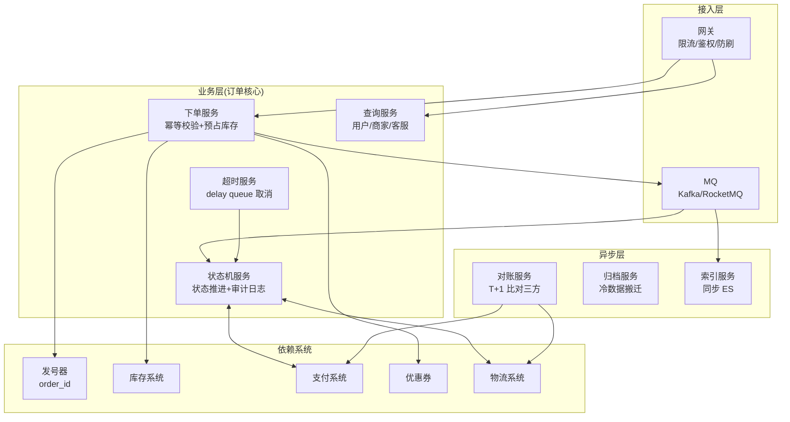
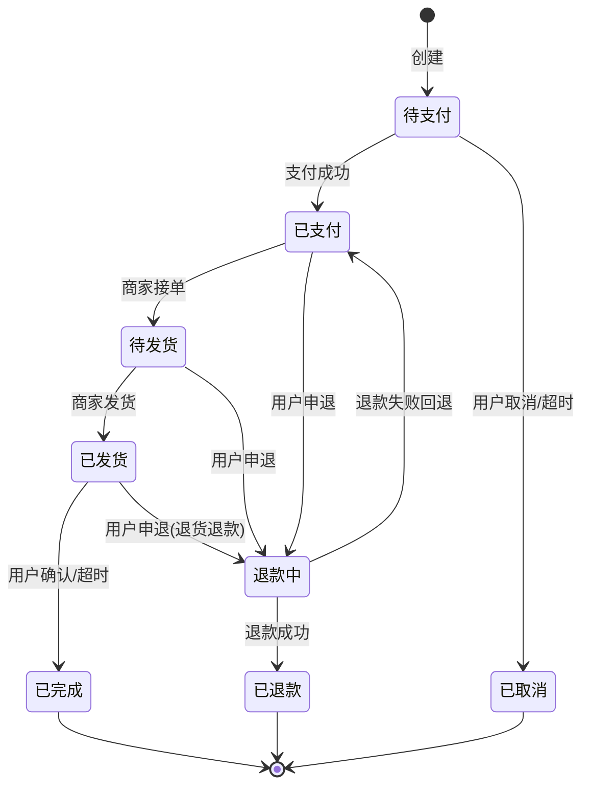
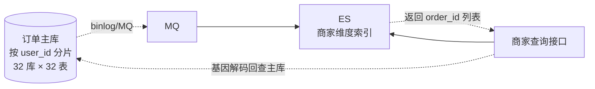
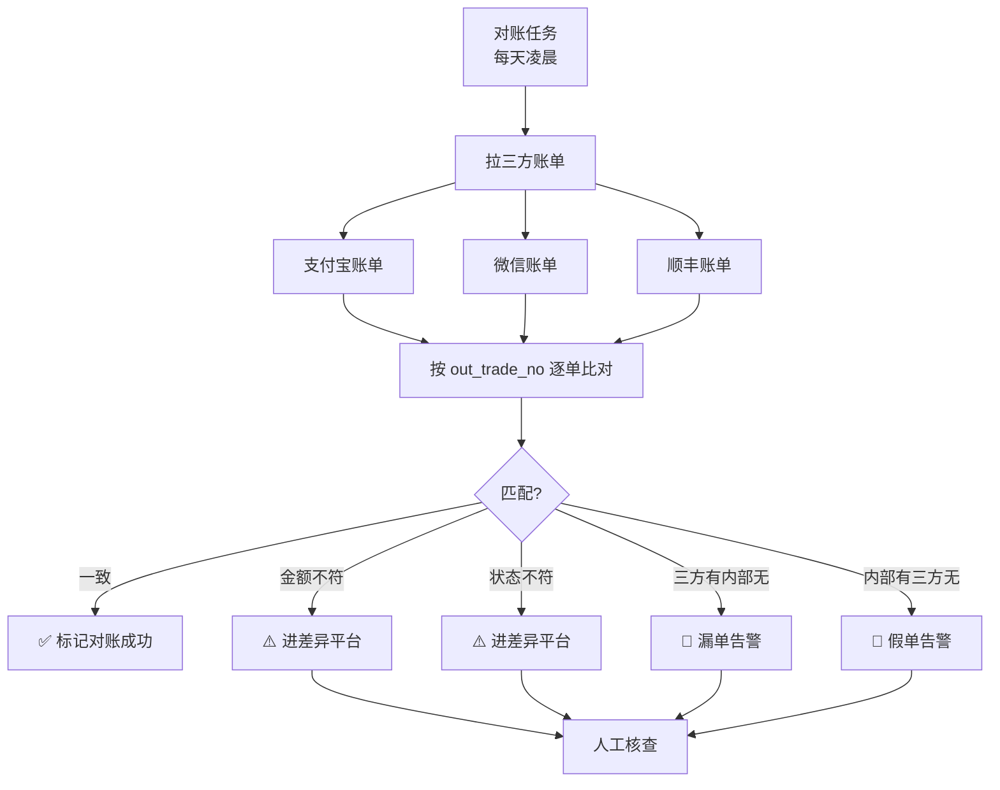
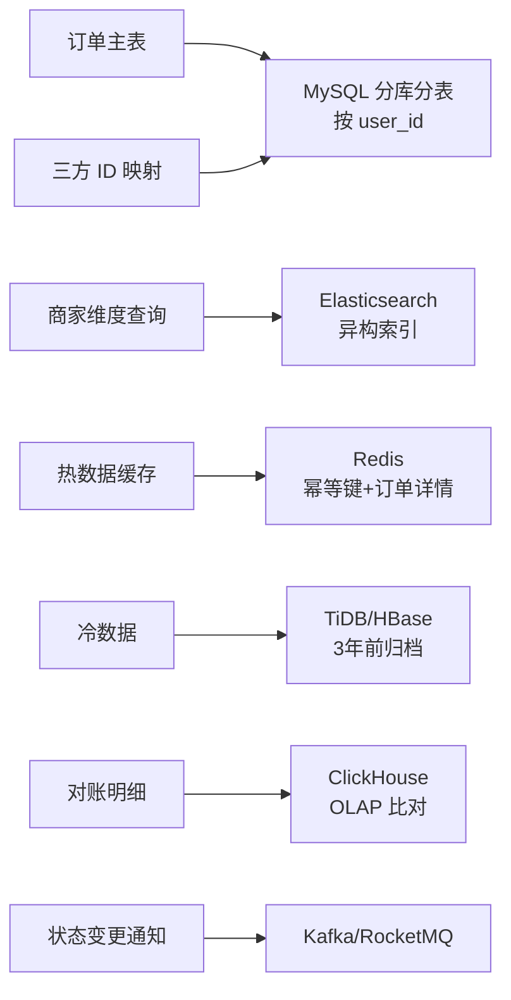
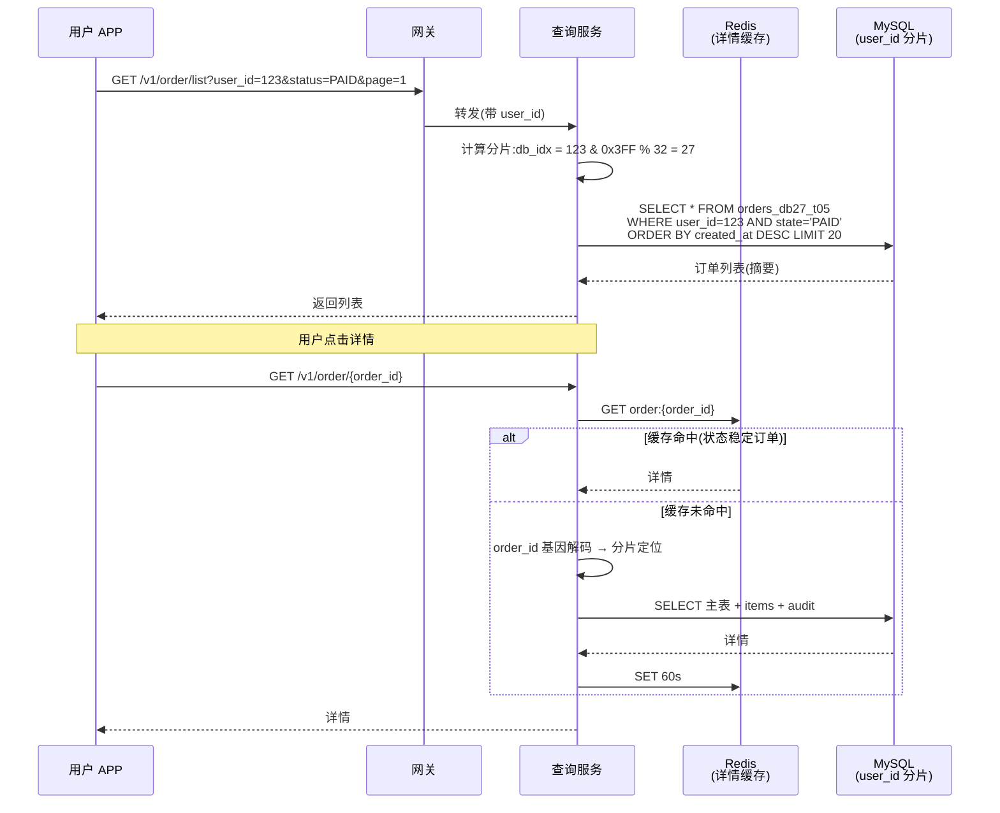
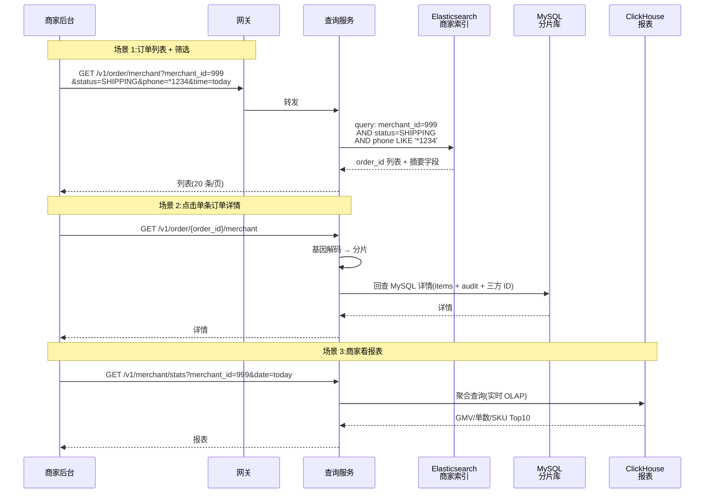

# 订单系统(4S 版)

> 用 [01b-4s-method.md](01b-4s-method.md) 的 **4S 分析法**(Scenario / Service / Storage / Scale)推一遍**电商订单系统**。
>
> **样板规模**:抖音电商日 2000 万单,大促峰值 50 万 QPS。
>
> **三大核心考点**(本文重点):
> 1. **分片策略**——按 user_id / order_id / merchant_id 怎么选?为什么是"user_id 分片 + 基因法 + 异构索引"
> 2. **order_id 设计**——bit 怎么分?基因位怎么塞?为什么不直接用发号器原始 ID
> 3. **三方订单 ID 处理**——支付/物流/平台多方 ID 怎么对齐?幂等 + 对账怎么做
>
> **关联文档**:
> - [13b-payment-system-4s.md](13b-payment-system-4s.md) — 支付系统(订单的下游)
> - [15-inventory-system.md](15-inventory-system.md) — 库存系统(订单的上游)
> - [21-shopping-cart.md](21-shopping-cart.md) — 购物车(订单的入口)
> - [23-id-generator-system-4s.md](23-id-generator-system-4s.md) — 发号器(订单 ID 的源头)
> - [03b-seckill-system-4s.md](03b-seckill-system-4s.md) — 秒杀(订单的极端流量场景)

---

## 一、为什么把订单系统单独写一篇

订单是电商的**中枢神经**——上游对接购物车/秒杀,下游驱动支付/库存/物流/售后,跨多个领域和子系统:

| 特点 | 影响 |
| --- | --- |
| **多角色多视角** | C 端用户查"我的订单"、商家查"店铺订单"、客服查"单笔订单"、对账查"渠道订单"——分片策略无法满足所有人 |
| **强一致 + 强幂等** | 涉及钱和库存,**重复创建 / 状态错乱 / 丢单**任何一种都是 P0 事故 |
| **数据量大保留久** | 2000 万/天 × 365 天 = 73 亿/年,**热数据 + 冷数据**必须分层 |
| **跨系统对账** | 支付/物流/平台都有自己的订单号,**对账成本 = 业务正确性** |
| **状态机复杂** | 十几种状态 + 时效逻辑(超时取消)+ 异常补偿,**状态转换不可逆** |
| **峰值差距大** | 平时 230 QPS 平均,大促瞬时 50 万 QPS,**削峰能力是设计核心** |

订单几乎承载了"分布式系统所有难题":分片、幂等、对账、状态机、削峰、冷热——所以它是面试**几乎必考**的高分场景题。

---

## 二、Scenario(场景分析,5 分钟)

**核心目标**:先问清楚下单链路、谁查询、查什么、规模多大,**关键是定下"读远多于写 + 强一致 + 多视角"的基调**。

### 2.1 功能分级

| 等级 | 功能 |
| --- | --- |
| **Must** | 下单 / 支付回调 / 取消 / 查询(用户+商家+客服)/ 状态推进 / 超时自动取消 / 幂等 |
| **Nice** | 拆单合单 / 部分退款 / 修改地址 / 订单备注 / 优惠券抵扣 / 多收件人 |
| **Out** | 物流详情(物流系统)/ 售后维权(售后系统)/ 推荐(推荐系统)/ 风控(风控系统) |

**反模式**:面试官说"设计订单系统",你直接画"用户→订单→支付→库存"的链路图 → **错**。**先问清楚谁是核心用户、查询场景占比、是否考虑大促**——抖音电商日 2000 万单和某创业公司日 1 万单,架构差 100 倍。

### 2.2 容量估算

```text
日订单量:    2000 万单
日活买家:    500 万(假设人均 4 单)
商家数:      100 万(平均每商家 20 单/天)

写 QPS:
  平均:    2000 万 / 86400 ≈ 230 QPS
  日常峰值: 2000 QPS(晚上 8-10 点高峰)
  大促峰值: 5 万 - 50 万 QPS(双 11/618 开抢瞬时)

读 QPS(关键定调):
  用户查"我的订单"(C 端):      日访问 5000 万 → 平均 580 QPS,峰值 1 万
  商家查"店铺订单"(B 端):      日访问 1000 万 → 平均 120 QPS,峰值 5000
  客服查"单笔订单":             日 100 万      → 平均 10 QPS
  对账拉取 + 内部系统调用:      日 500 万      → 平均 60 QPS

读写比 ≈ 30 : 1   ←  C 端查询是大头

存储估算:
  单订单主表(含商品快照):  约 2 KB
  日新增主表:              2000 万 × 2 KB = 40 GB
  保留 3 年热数据:         40 GB × 1095 ≈ 44 TB
  → 单库扛不住,必须分库分表

订单明细(item 行,每单平均 1.5 件):
  日新增:                  3000 万行 × 500 B = 15 GB
  保留 3 年:               约 16 TB

冷数据(3 年以上,归档):    几百 TB → 走 TiDB / HBase / OSS

第三方 ID 映射表:
  每单 1-3 个三方 ID(支付+物流+可能平台)
  日新增:                  4000 万行 × 200 B = 8 GB/天
```

**关键认知**:订单**写 QPS 不算特别高**(平均 230),但**大促峰值跳 200 倍**(5 万-50 万),所以**削峰 + 异步 + 分库**三件套缺一不可。

### 2.3 非功能要求(资深扣分点)

| 维度 | 要求 |
| --- | --- |
| **一致性** | **强一致**(状态机不可逆、不可重复创建)——比 Feed 严,与支付同级 |
| **幂等性** | 创建/支付/取消/退款**全链路幂等**,网络抖动重试不能造假单 |
| **延迟** | 下单 P99 < 500ms(用户感知)、查询 P99 < 100ms |
| **可用性** | 99.99%(下单失败 = 直接损失 GMV) |
| **可追溯** | 任何状态变更**全程留痕**(audit log),客诉/对账兜底 |
| **可对账** | T+1 与支付/物流/平台**逐单核对**,差异单进对账平台人工处理 |
| **数据保留** | 热数据 3 年(查询/客诉)、冷数据 5-7 年(法务/税务) |

### 2.4 设计定调(订单的灵魂)

> "订单系统的核心矛盾是**'多视角分片需求互相冲突'+'强一致与高并发并存'**——所以我会让**用户视角走主分片(user_id),商家视角走异构索引(ES),客服视角走基因解码(从 order_id 反推分片)**;**下单走异步削峰 + 状态机不可逆 + 全链路幂等**,**三方对账兜底**。"

**这句话定下了整个系统的设计原则**——后面 Service / Storage / Scale 都围绕"**分片基因法 + 状态机 + 削峰 + 对账**"展开。

### 2.5 与其他 4S 系统的根本差异

| 维度 | 秒杀 | 支付 | 短链 | 发号器 | **订单** |
| --- | --- | --- | --- | --- | --- |
| 核心矛盾 | 防超卖 | 资金安全 | 缓存命中 | 唯一性 | **多视角分片 + 全链路幂等** |
| 写主体 | 库存(单 sku 热点) | 流水 | URL→Code | ID 表 | **订单 + 多角色明细 + 三方 ID** |
| 一致性 | 强(单 sku) | 强(钱) | 最终 | 绝对唯一 | **强(状态机)+ 跨表事务** |
| 分片维度 | sku_id(库存) / user_id(订单) | 商户 | code | bizTag | **user_id 为主 + 异构索引** |
| 设计重心 | 削峰防热点 | 状态机+对账 | 多层缓存 | 双 Buffer | **基因法 + 状态机 + 对账 + 冷热分离** |

订单是"**集大成者**"——分片借秒杀、对账借支付、缓存借短链、ID 借发号器,但**多视角分片这块没有别的系统能借**,是订单独有的难题。

---

## 三、Service(服务拆分,10 分钟)

**核心目标**:按 SRP 拆服务,讲清楚**下单 / 状态机 / 超时 / 对账**四条主线,**写出核心 API**。

### 3.1 三层架构



### 3.2 服务职责

| 服务 | 职责 | 不做 |
| --- | --- | --- |
| **下单服务** | 幂等校验 / 价格库存校验 / 生成 order_id / 落库 / 投 MQ | 不直接扣库存(调库存系统)、不直接收款(调支付) |
| **查询服务** | 用户查(走主库 user_id 分片)/ 商家查(走 ES)/ 客服查(走 order_id 基因解码) | 不参与写流程 |
| **状态机服务** | 接收支付/物流/退款回调 → 推进状态 → 写审计日志 | 不做业务校验(在调用方校验) |
| **超时服务** | delay queue 监听超时事件 → 触发取消 → 释放库存 | 不主动扫表(扫表性能差) |
| **对账服务** | T+1 拉三方账单 / 按 channel_order_id 比对 / 差异入对账平台 | 不参与实时链路 |
| **归档服务** | 3 年前订单从 MySQL → TiDB/HBase / 删除原表数据 | 不删 audit log |
| **索引服务** | 消费 MQ → 同步订单到 ES(商家维度查询) | 不做实时索引(异步即可) |

**关键决策**:
- **下单服务幂等键 = (user_id, requestId)**——前端生成 requestId,服务端 SETNX 防重复
- **状态机服务集中管理状态转换**——所有状态变更都走这一个服务,**审计日志统一**
- **超时用 delay queue 不扫表**——MQ 自带 delay(RocketMQ) 或 Redis ZSet,**永远 O(1)**
- **对账异步 + 兜底**——实时链路出错不依赖对账,对账只是"最后一道防线"

### 3.3 下单链路时序图(主流程)

```mermaid
sequenceDiagram
    participant U as 用户
    participant GW as 网关
    participant Create as 下单服务
    participant Idem as 幂等缓存<br/>Redis
    participant ID as 发号器
    participant Inv as 库存
    participant DB as 订单 DB<br/>(user_id 分片)
    participant MQ as MQ
    participant Pay as 支付

    U->>GW: 下单(requestId, items)
    GW->>Create: 限流通过转发
    Create->>Idem: SETNX requestId NX EX 30s
    alt 已存在(重复请求)
        Idem-->>Create: 已存在
        Create-->>U: 返回上次的 order_id
    else 新请求
        Idem-->>Create: OK
        Create->>ID: 申请 order_id(含基因)
        ID-->>Create: order_id
        Create->>Inv: 预占库存(deductLock)
        Inv-->>Create: OK
        Create->>DB: INSERT order(主表+明细)<br/>本地事务
        DB-->>Create: OK
        Create->>MQ: 投 order_created 事件
        Create-->>U: 返回 order_id + 支付链接
        Note over MQ,Pay: 异步消费<br/>触发支付预创建
    end
```

**资深加分点**:

| 点 | 说明 |
| --- | --- |
| **幂等键 = (user_id, requestId)** | 前端生成 requestId,服务端 SETNX,**不依赖订单查重**(查重要查 DB 慢) |
| **预占库存而非扣减** | 创建订单时**预占** + 支付成功后**真扣**,**不付款超时自动释放** |
| **本地事务写订单主表+明细** | 同库同事务,**不引入分布式事务**(分片键相同) |
| **MQ 触发下游** | 状态推进、索引同步、积分、消息通知全走异步,**主链路最短** |
| **返回 order_id 不等支付完成** | 用户体验:下单 < 500ms,支付独立链路 |

### 3.4 状态机(订单的灵魂)



**核心规则**(必须强调):
- **状态推进单向不可逆**——已完成的订单不能回到"已发货",任何回退都是**新状态**(如"已退款")
- **每次状态变更必须有 audit log**——`(order_id, from_state, to_state, operator, reason, ts)`
- **状态推进必须幂等**——同一回调多次到达,**状态不会跳跃**(用 CAS:`UPDATE ... WHERE state = expected_state`)
- **超时取消走 delay queue**——下单时投递 30 分钟后的 cancel 事件,而不是扫表

### 3.5 核心 API

```text
# 下单(幂等)
POST /v1/order/create
  Header: X-Request-Id: <client_uuid>
  Body:   { user_id, items[], address_id, coupon_id?, ... }
  Resp:   { order_id, total_amount, pay_url, expire_at }
  错误码: 400 参数错 / 409 库存不足 / 429 限流 / 200(幂等命中)

# 用户查"我的订单"(主分片)
GET /v1/order/list?user_id=xxx&status=xxx
  → 直接路由到 user_id 所在分片,**不跨库**

# 商家查"店铺订单"(异构索引)
GET /v1/order/merchant?merchant_id=xxx&status=xxx
  → 查 ES,返回 order_id 列表,再回查 MySQL 详情

# 客服查"单笔订单"(基因解码)
GET /v1/order/{order_id}
  → 从 order_id 解出基因位 → 定位分片 → 查 MySQL

# 状态推进(内部接口,支付/物流回调)
POST /internal/order/transition
  Body: { order_id, from_state, to_state, reason, external_ref }
  → CAS 更新 + 写 audit log + 投 MQ

# 取消(用户/超时)
POST /v1/order/cancel
  Body: { order_id, cancel_reason }
  → 状态机服务统一处理
```

---

## 四、Storage(存储设计,15 分钟)

**核心目标**:这是订单系统**最复杂、最考验功力**的部分,**集中讲三大核心**——**分片策略、order_id 设计、三方 ID 处理**。

### 4.1 分片策略(核心考点 1)⭐

#### 4.1.1 三种分片维度对比

| 分片键 | C 端用户查(80% 流量) | B 端商家查(15% 流量) | 客服/对账(5% 流量) | 评价 |
| --- | --- | --- | --- | --- |
| **按 user_id** | ✅ **不跨库** | ❌ 全库扫描(灾难) | ❌ 全库扫描 | ✅ **推荐主键** |
| **按 order_id** | ❌ 全库扫描 | ❌ 全库扫描 | ✅ 直接命中 | ❌ 牺牲主流量 |
| **按 merchant_id** | ❌ 全库扫描 | ✅ 不跨库 | ❌ 全库扫描 | ❌ 牺牲 C 端 |
| **按时间(按月分表)** | ❌ 跨表(用户老订单要跨多月) | ❌ 跨表 | ✅ 按时间快 | ❌ 大促单月爆 |

**结论:按 user_id 分片是唯一合理选择**——因为**C 端用户查询占 80% 流量**,这条路必须最优化。

#### 4.1.2 为什么 user_id 是首选(资深论证)

> "电商订单的流量结构是**'C 端是主流、B 端是次流、客服是边角'**——80% 查询来自用户'我的订单',如果让主流量跨库,**所有库都被 fan-out 查询打爆**。按 user_id 分片后,用户查询永远命中**1 个分片**,响应稳定 < 50ms。B/C 视角不一致用**异构索引**补,而不是反过来。"

**这与短链(按 code 分片)、秒杀(按 user_id 分片)、发号器(按 bizTag 分片)对照**——分片键永远跟着主流量走。

#### 4.1.3 商家查询怎么办?——异构索引方案



**两阶段查询**:
1. **商家请求** → ES 按 `merchant_id` 查 → 拿到 order_id 列表(只含摘要字段:order_id、status、amount、create_at)
2. **如需详情** → 用 order_id 的**基因位解码**回查 MySQL 主库(单点查询,毫秒级)

**为什么不用 MySQL 二级索引表**:
- 二级索引表(`merchant_order_index`)需要**双写一致性**(订单 + 索引表),复杂且易出错
- ES **天然异步 + 全文检索**(商家还要按订单号/收件人模糊搜),一次解决
- ES 延迟 1-3 秒可接受(商家不要求秒级)

#### 4.1.4 分库分表规模

```text
单订单 2KB,日 2000 万 → 40 GB/天 → 3 年 44 TB

分库分表方案:
  逻辑分片:  32 库 × 32 表 = 1024 张物理表
  单表数据:  3 年 44 TB / 1024 ≈ 43 GB,2200 万行 ← MySQL 友好
  
  分片函数:  shard_db   = user_id % 32
            shard_table = (user_id / 32) % 32

实例数:
  写主库:    8 个 MySQL 实例(每个实例 4 库)
  从库:      每主 2 从(读写分离)
```

### 4.2 order_id 设计(核心考点 2)⭐

#### 4.2.1 设计目标(优先级排序)

| 目标 | 必要性 | 含义 |
| --- | --- | --- |
| **全局唯一** | Must | 永远不冲突 |
| **趋势递增** | Must | InnoDB B+ 树插入友好(主键友好) |
| **内含分片基因** | Must | **拿到 order_id 不查 DB 就能定位分片**(基因法,核心) |
| **可追溯时间** | Nice | 看到 order_id 大致知道下单时间 |
| **防业务量泄露** | Nice | 不能让竞争对手通过订单号增量推断 GMV |
| **长度合理** | Nice | 18-20 位字符串/数字,便于客服报单 |

#### 4.2.2 64 bit 设计(推荐 - 类 Snowflake + 基因法)

```text
| 1 bit | 39 bit            | 4 bit  | 10 bit         | 10 bit       |
| 符号  | 秒级时间戳         | 机房+服务 | user_id 基因位 | 同秒内序列号  |
| 0     | 自定义起点 ≈ 17 年 | 16 机房   | 1024 分片定位  | 1024 / 秒    |

总:64 bit,BIGINT 存储
对外展示:转 Base36 或 hashids → 12-14 位字符串
```

**关键字段拆解**:

| 段 | bit | 设计意图 |
| --- | --- | --- |
| **符号位** | 1 | 固定 0,保证正数 |
| **秒级时间戳** | 39 | 39 bit 秒 ≈ 17000 年,**毫秒太精细浪费**,秒级足够 |
| **机房+服务标识** | 4 | 16 个值,标识生成实例(防多机房冲突) |
| **user_id 基因位** ⭐ | 10 | **= user_id % 1024,内嵌分片定位**(核心) |
| **同秒序列号** | 10 | 单实例每秒 1024 单,大促可调整 bit 分配 |

**为什么基因位是核心**:
> "客服/对账/退款回调拿到 `order_id` 时,**不需要查表就能算出它属于哪个分片**——`shard_db = gene_bits % 32`,直接定位。如果没有基因位,**所有非用户视角的查询都要广播全库**,32 库 × 32 表 = 1024 表全扫,**性能差 1000 倍**。"

#### 4.2.3 基因法的核心实现

```go
// 下单时生成 order_id
func GenOrderID(userID int64) int64 {
    timestamp := time.Now().Unix() - EPOCH  // 39 bit
    nodeID    := getNodeID()                // 4 bit
    gene      := userID & 0x3FF             // 10 bit (低 10 位 = user_id % 1024)
    seq       := atomic.AddInt64(&counter, 1) & 0x3FF  // 10 bit

    return (timestamp << 24) | (int64(nodeID) << 20) | (gene << 10) | seq
}

// 根据 order_id 反推分片
func ShardOfOrder(orderID int64) (db, table int) {
    gene := (orderID >> 10) & 0x3FF  // 取出基因位
    db    = int(gene) % 32
    table = (int(gene) / 32) % 32
    return
}
```

**核心约束**:**分片函数也必须基于 user_id 的低 10 位**——`shard_db = (user_id & 0x3FF) % 32`,**这样基因和分片函数对齐**,根据 order_id 算出的分片 = 根据 user_id 算出的分片。

#### 4.2.4 对外展示(防业务量泄露)

```text
内部 BIGINT:  17283746529384757
对外字符串:   转换层
  方案 A:Base36 编码(短)       → "4LMQRX6KP91"(11 字符)
  方案 B:hashids(可定制字母表)  → "Yz9aB2cD3eF4"(可定长)
  方案 C:对称加密(AES + 短)     → 加密后再转 Base36
```

**为什么不直接展示原始 BIGINT**:
> "原始 ID 趋势递增,**竞争对手通过两次下单的差值能推算日订单量**——双 11 早上下一单 1000000,晚上再下一单 21000000,差值 2000 万 = 日订单。**加密/编码后**,差值不可逆推,GMV 不外泄。"

**业界做法**:
- 美团订单号:**18 位数字**(时间+机房+用户 hash+序列)
- 京东订单号:**11 位数字**(短)
- 抖音订单号:**19 位数字**

### 4.3 三方订单 ID 处理(核心考点 3)⭐

#### 4.3.1 业务场景

订单系统需要对接**多个外部系统**,每个系统都有自己的"订单号":

| 外部系统 | 它的"订单号" | 关系 | 频率 |
| --- | --- | --- | --- |
| **支付宝/微信支付** | 支付订单号(`out_trade_no` ↔ 三方 `trade_no`) | 通常 1:1 | 极高(主路径必经) |
| **顺丰/京东物流** | 运单号 | 1:N(拆单/重发) | 高 |
| **退款流水** | 退款单号 | 1:N(部分退/多次退) | 中 |
| **天猫/淘宝(跨平台)** | 平台原单号 | 1:1 | 中 |
| **菜鸟/电子面单** | 面单号 | 1:1 | 中 |
| **客服工单** | 工单号 | 1:N | 低 |

**核心三问**:**怎么存(主表 vs 独立表)?怎么分片?怎么反查(三方回调没有 order_id)?**

#### 4.3.2 设计权衡:主表冗余 vs 独立映射表 ⭐

最容易犯的错——**把所有三方 ID 都塞进一张映射表**。实战正确做法是**按"关系基数"拆分**:

| 三方 ID 类型 | 关系 | 推荐方案 | 原因 |
| --- | --- | --- | --- |
| **支付单号**(最高频) | 1:1 | **冗余订单主表** | 主流量场景,每次查订单必带,**避免 JOIN** |
| **物流运单号** | 1:N | 独立映射表 | 拆单/重发产生多行 |
| **退款流水号** | 1:N | 独立映射表 | 部分退/多次退产生多行 |
| **平台关联号** | 1:1 | 主表冗余(可选) | 看是否高频查询 |
| **客服工单** | 1:N | 独立映射表 | 售后多工单 |

**资深点**:
> "把支付单号塞进映射表是常见反模式——支付是主路径,每个订单都有,**每查一次订单都要 JOIN 一次映射表**,白白增加 IO 和事务复杂度。**一对一关系冗余主表,只把一对多关系放映射表**。"

#### 4.3.3 表结构(主表冗余 + 独立映射)

**订单主表冗余支付字段**(1:1):

```sql
ALTER TABLE orders ADD COLUMN (
    pay_channel           VARCHAR(32)  DEFAULT NULL,    -- 'alipay'/'wxpay'
    pay_out_trade_no      VARCHAR(64)  DEFAULT NULL,    -- 我们传给三方的(= order_id 衍生)⭐
    pay_channel_trade_no  VARCHAR(64)  DEFAULT NULL,    -- 三方回传的内部单号
    pay_amount            DECIMAL(12,2) DEFAULT NULL,
    paid_at               DATETIME     DEFAULT NULL
);
-- 索引
ALTER TABLE orders ADD UNIQUE KEY uk_pay_out (pay_out_trade_no);
ALTER TABLE orders ADD UNIQUE KEY uk_pay_channel_trade (pay_channel, pay_channel_trade_no);
```

**独立映射表(只放 1:N 关系)**:

```sql
CREATE TABLE order_external_ref (
    id              BIGINT      NOT NULL AUTO_INCREMENT,
    order_id        BIGINT      NOT NULL,
    user_id         BIGINT      NOT NULL,            -- 冗余分片键 ⭐
    ref_type        VARCHAR(16) NOT NULL,            -- 'refund'/'logistics'/'platform'/'workorder'
    channel_type    VARCHAR(32) NOT NULL,            -- 'alipay'/'sf_express'/'taobao'
    channel_no      VARCHAR(64) NOT NULL,            -- 三方单号
    channel_status  VARCHAR(32) DEFAULT NULL,        -- 三方侧状态
    extra           JSON        DEFAULT NULL,        -- 渠道独有字段
    created_at      DATETIME    NOT NULL,
    updated_at      DATETIME    NOT NULL,

    PRIMARY KEY (id),
    UNIQUE KEY uk_channel_no (channel_type, channel_no),  -- 防重复回调
    KEY idx_order (order_id, ref_type)
) ENGINE=InnoDB;
```

#### 4.3.4 分片策略 ⭐

**必须分片,且与订单主表同分片键**:

| 表 | 分片键 | 原因 |
| --- | --- | --- |
| `orders` | `user_id` | C 端主流量(见 §4.1) |
| `order_external_ref` | `user_id`(**冗余字段**) | 与主表同库 → **本地事务** |

**为什么必须冗余 `user_id` 到映射表**:

```text
错误设计:order_external_ref 只有 order_id,不冗余 user_id
  问题链:
    写订单(分片键 user_id)+ 写映射(分片键 order_id)
    → ORM/分库中间件按各自分片键路由
    → 两个不同的物理库连接
    → 触发分布式事务(XA / TCC / 本地消息表),慢且复杂

正确设计:冗余 user_id 到映射表
  写入路径:
    user_id → 路由到分片 N
    在分片 N 内:INSERT orders + INSERT order_external_ref
    → 同库本地事务,毫秒完成
```

**资深点**:
> "**分片键冗余**是分库分表的核心套路——任何子表都要冗余主表的分片键字段,**保证子表和主表永远同库**,避免分布式事务。订单系统的 order_items / order_audit / order_external_ref **全部都要冗余 user_id**。"

#### 4.3.5 三方回调反查难题:out_trade_no 自带基因 ⭐

**问题**:支付宝回调只带 `out_trade_no` 和 `trade_no`,**没有 user_id**——怎么从 1024 张表里定位到具体那一张?

**三种方案对比**:

| 方案 | 实现 | 性能 | 评价 |
| --- | --- | --- | --- |
| **A. 全库扫描** | 1024 张表逐个 `SELECT WHERE channel_no=?` | 单次回调几百次 SQL | ❌ 不可行 |
| **B. 全局路由表** | 单独维护 `channel_no → order_id` 路由表 | 多一次查询 + 路由表自己要分片要扩容 | ⚠️ 备选 |
| **C. out_trade_no 自带基因** ⭐ | `out_trade_no = order_id`(或衍生) | 直接基因解码,O(1) | ✅ **主流** |

**方案 C 的核心思想**:

```text
下单时(我们的服务):
  生成 order_id = 17283746529384757   ← 含 user_id 基因位(见 §4.2)
  
  调支付宝预下单接口:
    POST alipay.trade.precreate
    Body: { 
      out_trade_no: "17283746529384757",   ← 直接用我们的 order_id
      total_amount: 100,
      ...
    }

支付宝回调(异步通知):
  POST https://our-server/api/pay/callback
  Body: { 
    out_trade_no: "17283746529384757",     ← 我们传过去的 = order_id
    trade_no:     "2026052900000000001234",← 支付宝内部号(只存不查)
    status:       "TRADE_SUCCESS",
    ...
  }

我们的处理:
  1. 取 out_trade_no → 解析为 int64 order_id
  2. order_id 解基因 → ShardOfOrder() 算出 (db, table)
  3. SELECT FROM orders_dbN_tM WHERE order_id = ?
  4. 状态机推进 + 写 pay_channel_trade_no 入主表
  
全程零路由表,O(1) 定位分片。
```

**out_trade_no 的几种变体**(基因必须保留):

| 形式 | 例子 | 适用 |
| --- | --- | --- |
| **直接用 order_id** | `17283746529384757` | 内部不介意暴露 ID 数值 |
| **加业务前缀** | `ORD17283746529384757` | 多业务共用渠道时区分(主站/海外/B 端) |
| **Base36 编码** | `4LMQRX6KP91A` | 短一些,但要可逆解码 |
| **加签名后缀** | `ORD17283746529384757_a3f9` | 防伪造回调(配合验签) |

**关键约束**:**无论怎么变换,基因位必须保留 + 必须可逆解出 order_id**——回调时纯算法(不查 DB)从 `out_trade_no` 算出分片定位。

**支付宝的 `trade_no` 我们怎么用**:
- **实时链路**:**只存,不查**(写入 `pay_channel_trade_no` 字段)
- **对账链路**:T+1 拉账单时按 `trade_no` 逐单匹配
- **退款链路**:发起退款时把 `trade_no` 传给支付宝

> "**out_trade_no 是我们设计的,trade_no 是三方设计的**——前者承担实时反查所以必须带基因,后者只承担对账匹配所以不需要任何特殊设计。**职责分离**就是设计的根本。"

#### 4.3.6 幂等处理(三方回调防重复)

**典型场景**:支付宝回调可能重发 N 次(网络抖动、平台重试)。

```go
func OnPaymentCallback(outTradeNo, channelTradeNo string, amount decimal.Decimal) error {
    // 1. out_trade_no 自带基因 → 解出 order_id 和分片
    orderID, err := parseOutTradeNo(outTradeNo)  // 去前缀/解码
    if err != nil {
        return ErrInvalidOutTradeNo
    }
    db, table := ShardOfOrder(orderID)            // 基因解码

    // 2. CAS 推状态机(同一事务写支付字段)
    sql := fmt.Sprintf(`
        UPDATE orders_%d
        SET state='PAID',
            pay_channel_trade_no=?,
            paid_at=NOW()
        WHERE order_id=? AND state='PENDING'`, table)

    n, _ := dbConn(db).Exec(sql, channelTradeNo, orderID)

    if n == 0 {
        // affected_rows=0 → 状态不是 PENDING
        cur, _ := queryOrder(db, table, orderID)
        if cur.State == "PAID" && cur.PayChannelTradeNo == channelTradeNo {
            return nil  // 重复回调 → 幂等命中
        }
        return ErrInvalidState  // 真的异常,告警
    }
    return nil
}
```

**幂等保障**:
- **应用层**:CAS `WHERE state='PENDING'` —— 重复回调时 affected_rows=0,直接返回成功
- **DB 层**:`UNIQUE(pay_channel, pay_channel_trade_no)` —— 防止脏并发
- **out_trade_no 天然唯一**:它就是 order_id,**全局不冲突**

#### 4.3.7 三方对账(T+1 兜底)



**对账规则**:

| 差异类型 | 含义 | 处理 |
| --- | --- | --- |
| **金额不符** | 内部 100 元、三方 99.9 元 | 进差异表,人工核查(可能是优惠券处理差异) |
| **状态不符** | 内部"已支付"、三方"已退款" | **P0 告警**,可能丢回调 |
| **三方有内部无** | 三方收到钱,内部没单 | **漏单!** 紧急补救 |
| **内部有三方无** | 内部"已支付"、三方查不到 | **假单!** 风控介入 |

**为什么对账用 out_trade_no 而不是 trade_no**:
- 内部主表索引是 `pay_out_trade_no` 唯一键,**O(1) 反查**
- 三方账单一定包含 out_trade_no(他们也用这个标识业务方订单)
- trade_no 用于**异常分支**(如某条记录我们查不到 out_trade_no 但三方有 trade_no 时,作为辅助匹配)

**为什么对账是兜底**:
> "实时链路可能因网络/重启/MQ 丢消息导致状态不一致,**对账是最后一道防线**——T+1 拉三方账单按 out_trade_no 逐单比对,差异 100% 进人工。一个成熟的订单系统对账差异率应 < 0.01%。"

### 4.4 订单主表设计(完整)

```sql
CREATE TABLE orders (
    order_id        BIGINT      NOT NULL,           -- 主键,含基因位
    user_id         BIGINT      NOT NULL,           -- 分片键
    merchant_id     BIGINT      NOT NULL,
    total_amount    DECIMAL(12,2) NOT NULL,
    discount_amount DECIMAL(12,2) DEFAULT 0,
    pay_amount      DECIMAL(12,2) NOT NULL,
    state           VARCHAR(16) NOT NULL,           -- 状态机
    address_snapshot JSON       NOT NULL,           -- 收件人快照
    expire_at       DATETIME    NOT NULL,           -- 超时时间
    paid_at         DATETIME    DEFAULT NULL,
    -- 支付三方 ID 字段(1:1 关系,冗余主表,见 §4.3.2)
    pay_channel             VARCHAR(32) DEFAULT NULL,  -- 'alipay'/'wxpay'
    pay_out_trade_no        VARCHAR(64) DEFAULT NULL,  -- 我们传给三方的(= order_id 衍生)
    pay_channel_trade_no    VARCHAR(64) DEFAULT NULL,  -- 三方回传的内部单号
    created_at      DATETIME    NOT NULL,
    updated_at      DATETIME    NOT NULL,

    PRIMARY KEY (order_id),
    KEY idx_user_created (user_id, created_at DESC),         -- 用户查询主路径
    KEY idx_state_expire (state, expire_at),                 -- 超时扫描(理论上不用,delay queue)
    UNIQUE KEY uk_pay_out (pay_out_trade_no),                -- 三方回调反查(out_trade_no 自带基因)
    UNIQUE KEY uk_pay_channel_trade (pay_channel, pay_channel_trade_no)
) ENGINE=InnoDB;

CREATE TABLE order_items (
    id              BIGINT AUTO_INCREMENT PRIMARY KEY,
    order_id        BIGINT      NOT NULL,
    user_id         BIGINT      NOT NULL,           -- 冗余分片键(同库)
    sku_id          BIGINT      NOT NULL,
    sku_snapshot    JSON        NOT NULL,           -- 商品快照(标题/图片/规格/单价)
    quantity        INT         NOT NULL,
    price           DECIMAL(12,2) NOT NULL,
    created_at      DATETIME    NOT NULL,

    KEY idx_order (order_id)
) ENGINE=InnoDB;
-- 分片键:user_id(与 orders 同库 → 本地事务)

CREATE TABLE order_audit (
    id              BIGINT AUTO_INCREMENT PRIMARY KEY,
    order_id        BIGINT      NOT NULL,
    user_id         BIGINT      NOT NULL,
    from_state      VARCHAR(16) DEFAULT NULL,
    to_state        VARCHAR(16) NOT NULL,
    operator        VARCHAR(64) NOT NULL,            -- 'user' / 'system' / 'merchant' / 'cs'
    reason          VARCHAR(255) DEFAULT NULL,
    external_ref    VARCHAR(64) DEFAULT NULL,        -- 关联三方单号
    created_at      DATETIME    NOT NULL,

    KEY idx_order_time (order_id, created_at)
) ENGINE=InnoDB;
-- 分片键:user_id
```

**核心设计点**:
- **快照字段(JSON)**——商品信息/收件人地址都**冗余存快照**,**业务变更不影响历史订单**
- **冗余 user_id 到子表**——order_items 也有 user_id,**保证同库分片**
- **audit 表独立**——状态变更全记录,**永不删除**(法务/客诉)

### 4.5 存储选型一图



### 4.6 三大角色查询路径(贯穿全局,验证存储设计)⭐

> 上面 §4.1-§4.5 设计完存储后,**必须验证它真的能撑住三种角色的查询**——这是面试官追问的高频点,也是订单系统的"使用面"。

#### 4.6.1 角色对比

| 角色 | 查询场景 | 流量占比 | 延迟要求 | 查询路径 |
| --- | --- | --- | --- | --- |
| **用户 C 端** | 我的订单列表/详情 | 80% | P99 < 100ms | MySQL 主分片(user_id) |
| **商家 B 端** | 店铺订单管理/多条件搜索 | 15% | P99 < 300ms | ES 异构索引 + MySQL 回查 |
| **运营/客服内部** | 全平台监控/报表/单订单深查 | 5% | < 5s 可接受 | ClickHouse / 数仓 / 基因解码 |

**核心原则:三条物理隔离的查询路径,绝不混用**——任何一条挂了不影响其他角色。

#### 4.6.2 用户查询(C 端,主流量)



**设计要点**:

| 点 | 说明 |
| --- | --- |
| **入参强制带 user_id** | 所有 C 端接口必须有 user_id(从登录态拿),**永远不跨库** |
| **列表用 (user_id, created_at) 联合索引** | 不需要 ES,主库自己扛 |
| **详情走基因解码** | 拿到 order_id 不需要再传 user_id,**基因位反推分片** |
| **缓存详情 60s** | 已完成/已取消的订单状态稳定,**长 TTL** 进一步降库压力 |
| **状态变更主动失效** | 状态机服务推进状态时 → MQ → 删缓存 |

**资深加分**:
> "用户'我的订单'查询是订单系统**唯一不能降级**的链路——大促 50 万 QPS 下单时,用户立刻去看'订单是否成功',如果列表查不出来,**所有人都以为下单失败,会重复点击造成更大流量**。所以这条路必须最稳定:**单分片 + 主库优先 + 短 TTL 缓存**。"

#### 4.6.3 商家查询(B 端,多条件搜索 + 报表)

商家需求复杂度远高于 C 端:
- **基础筛选**:状态(待发货/已发货/退款中)、时间区间(今日/本周)
- **模糊搜索**:收件人手机尾号、姓名、商品标题
- **精确查找**:订单号/快递单号
- **统计报表**:日 GMV、单数、SKU 销量 Top10



**设计要点**:

| 点 | 说明 |
| --- | --- |
| **筛选走 ES** | merchant_id 不是分片键,**主库会扫 1024 张表,ES 一次完成** |
| **ES 字段精简** | 只存检索字段 + 摘要(不存大字段如商品图片 URL) |
| **ES 同步延迟 1-3 秒可接受** | 商家不要求秒级一致,binlog → MQ → ES 异步 |
| **详情回查主库** | ES 不存全字段,**基因解码回 MySQL 单分片查询** |
| **报表走 ClickHouse** | 实时聚合,**不打 ES**(ES 对聚合不友好,数据量大时慢) |
| **商家维度限流** | 单个商家恶意刷查询时,**按 merchant_id 限流** |

**为什么不用 MySQL 二级索引表** `merchant_order_index(merchant_id, order_id)`:
- 需要**双写一致性**(订单主表 + 索引表),引入分布式事务或最终一致补偿
- 商家还要"按收件人模糊搜""按商品标题搜",**MySQL 没法做全文检索**
- ES 一次解决"二级路由 + 模糊搜 + 聚合",**架构简单**

#### 4.6.4 运营/客服查询(内部,离线+实时混合)

运营/客服场景差异大,需要**多套查询路径并存**:

```mermaid
flowchart TB
    subgraph "客服:单订单深查"
        Cs["客服后台"] --> Decode["order_id 基因解码"]
        Decode --> DB1[("MySQL 主分片<br/>订单主表+明细")]
        Decode --> Audit[("audit ES<br/>状态变更全程")]
        Decode --> Ref[("三方 ID 映射表<br/>支付/物流单号")]
    end
    subgraph "运营:实时监控/风控"
        Op1["运营平台"] --> CH[("ClickHouse<br/>实时 OLAP")]
        CDC["订单 DB binlog"] -.->|CDC 同步.->| CH
    end
    subgraph "运营:离线报表/导出"
        Op2["BI/数据平台"] --> DW[("Hive 数仓")]
        Sync["T+1 批量同步"] -.->|nightly.-> DW
        DW --> Spark["Spark/Flink"]
        Spark --> Report["报表平台"]
    end
```

**三条路径职责**:

| 路径 | 用途 | 数据延迟 | 例子 |
| --- | --- | --- | --- |
| **基因解码 + 主库** | 客服查单订单全链路 | 实时 | 用户投诉某订单状态异常,**查 audit log + 三方 ID + 物流回单** |
| **ClickHouse(CDC 实时同步)** | 风控/实时监控 | < 5 秒 | 检测"近 5 分钟同 IP 下单 > 100 单的可疑用户" |
| **Hive 数仓(T+1)** | 报表/批量导出 | T+1 | 月度 GMV 报表 / 税务批量导出 / 算法训练数据 |

**易错点(资深加分)**:很多人会想"**给运营开个 MySQL 只读从库就行**"——**错!**

```text
错误方案: 运营 SQL → MySQL 只读从库
问题链:
  ① 运营 SQL 经常 JOIN 5-7 张表、扫全表 → 单 SQL 几秒到几分钟
  ② 慢查询拖垮从库 → 主从同步延迟飙升 → 读流量回退到主库
  ③ 主库压力陡增 → C 端下单/查询变慢 → GMV 损失
  
真实事故案例:某电商一次"运营导日活商家清单"的 SQL 跑了 15 分钟,
拖垮所有从库,主库 CPU 飙到 95%,直接影响 30 分钟 GMV。

正确方案: 运营查询 → ClickHouse / 数仓
  - 物理隔离,运营慢查询不影响 C 端
  - OLAP 引擎本来就是为大查询优化的(秒级聚合千亿行)
  - 大字段(商品图片/快照 JSON)不进数仓,体积可控
```

#### 4.6.5 三角色性能要求与失败影响

| 角色 | P99 延迟 | 数据延迟容忍 | 查询路径 | 失败影响 |
| --- | --- | --- | --- | --- |
| **用户 C 端** | < 100ms | 实时(主库) | MySQL 单分片 | **GMV 直接损失**(P0)|
| **商家 B 端** | < 300ms | 3 秒(ES 异步) | ES + MySQL 回查 | **B 端管理体验差**(P1) |
| **运营/客服** | < 5s | 5 秒-T+1 | ClickHouse / 数仓 / 主库 | **内部使用,可重试**(P2) |

**核心资深信号**:
> "**查询面分层 + 物理隔离**是订单系统的灵魂——让 C 端走 MySQL 主分片(最稳定),B 端走 ES 异构(扛复杂搜索),运营走 OLAP / 数仓(扛大查询)。**三条路径互不影响**,任何一条挂了不会拖垮其他角色。这与'写面用基因法分片 + 异构索引'是配套的——**写面只优化主流量,读面按角色分流**。"

#### 4.6.6 查询路径与存储设计的对应关系(收束)

```text
基因法 + user_id 分片  → 撑住 C 端 80% 查询(单分片,P99 < 100ms)
ES 异构索引            → 撑住 B 端复杂搜索(merchant_id + 模糊查 + 时间区间)
基因解码               → 撑住客服单订单深查(不依赖 user_id)
CDC + ClickHouse       → 撑住运营实时风控/监控
T+1 数仓               → 撑住报表/批量导出

→ §4.1-§4.5 的存储设计,完整支撑了三种角色的查询需求,且物理隔离。
```

---

## 五、Scale(扩展设计,10 分钟)

按 4S 第六板斧逐条:

| 板斧 | 订单场景具体动作 |
| --- | --- |
| **缓存** | 幂等键(Redis SETNX)/ 订单详情(短 TTL)/ 用户最近订单列表(短 TTL) |
| **分片** | MySQL 按 user_id 分库分表 32×32;ES 按 merchant_id 路由 |
| **异步** | 下单后状态推进、积分、消息、索引同步全走 MQ;归档/对账离线 |
| **削峰** | 大促前预热令牌桶 / MQ 削峰 / 排队下单(令牌+预约) |
| **限流降级** | 网关按 user_id 限流 / 商家维度限流 / 大促期降级非核心查询 |
| **容灾** | MySQL 同城三 AZ + 异地灾备;MQ 集群多副本;ES 跨机房复制 |
| **监控** | 下单成功率 / 状态流转延迟 / 对账差异率 / 三方回调延迟 / 慢查询 |

### 5.1 冷热分离(订单特色)

```mermaid
flowchart LR
    Hot["热数据<br/>MySQL<br/>3 个月内"] -->|查询占比 95%| Hot
    Hot -.>|按月归档.| Warm["温数据<br/>MySQL<br/>3 月 - 3 年"]
    Warm -.>|按年归档.| Cold["冷数据<br/>TiDB / HBase<br/>3 年以上"]
    Cold -.>|10 年+| OSS["对象存储<br/>OSS / S3"]
```

**为什么三层**:
- **热数据**:用户日常查"我的订单"几乎都在 3 个月内,**单表小**查询快
- **温数据**:偶尔查老订单(售后/客诉),走 MySQL 慢库
- **冷数据**:法务/税务要求保留 5-7 年,**走 TiDB/HBase 大容量**便宜
- **归档不删**:audit log 永远保留

### 5.2 大促削峰(订单的极限挑战)

```text
日常 2000 QPS → 大促 50 万 QPS,200 倍跳变。

削峰组合拳:
  1. 客户端排队        前端排队页 + 验证码 → 平滑流量(去掉 50% 重复点击)
  2. 网关令牌桶        按 user_id 限流(单用户 1 单/秒) + 全局令牌桶
  3. 预占库存放 Redis  下单先 Redis Lua 扣预占,**减少 MySQL 压力**
  4. 异步写 DB         主链路 Redis 扣 + MQ 投递,**MQ 缓冲后 DB 慢慢写**
  5. 状态机异步        下单返回 order_id 即可,**支付/库存等异步推进**
  6. 商家维度异步索引  ES 同步延迟 3-5 秒可接受
```

**资深动作**:讲清楚"**大促核心是把同步写库变成异步**——同步 Redis(微秒)+ MQ(毫秒)+ DB(几十毫秒慢写),用户感知永远是 < 500ms。"

### 5.3 演进路线

```text
阶段 1(初创,日 1 万单):
  - 单 MySQL + 简单 order_id(auto_increment + 时间前缀)
  - 同步下单 + 同步扣库存
  - 状态机简单(待支付/已支付/已发货/已完成)

阶段 2(成长期,日 100 万单):
  - 分库分表 4×4(按 user_id)
  - 引入 MQ 异步状态推进
  - Redis 幂等键
  - 引入对账平台

阶段 3(中大型,日 1000 万单):
  - 分库分表 32×32
  - 引入 ES 商家索引
  - order_id 升级 Snowflake + 基因位
  - 冷热数据分离

阶段 4(大型,日亿级):
  - 多机房部署 + 同城多活
  - 异地灾备(订单数据双写)
  - 削峰能力升级(令牌桶 + 排队 + 异步链路)
  - 风控/反作弊深度集成
```

---

## 六、面试现场表达模板

> 套用 4S 节奏,代入订单场景。**开场第一句突出"多视角分片"是订单系统独有难题**。

```text
"我用 4S 来组织这道订单系统的设计——先说一句定调:
 订单是电商中枢,核心矛盾是'多视角分片需求互相冲突 + 强一致与高并发并存',
 所以我所有设计都围绕'基因法分片 + 状态机 + 削峰 + 对账'。

第一步 Scenario(5 分钟):
  抖音电商规模日 2000 万单,大促峰值 50 万 QPS,200 倍跳变。
  读写比 30:1,C 端用户查询占 80%、B 端商家 15%、客服对账 5%。
  非功能严:强一致、全链路幂等、可追溯、可对账。

第二步 Service(10 分钟):
  按 SRP 拆下单/查询/状态机/超时/对账/归档/索引服务。
  下单链路最短:幂等校验 → 申请 order_id → 预占库存 → 落库 → MQ 异步。
  状态机不可逆 + CAS 推进 + audit log 全记录。
  超时走 delay queue 不扫表。

第三步 Storage(15 分钟,本题重头戏):
  三大核心——
  
  ① 分片策略:按 user_id 分 32×32,因为 C 端流量 80% 都按 user_id 查;
              商家维度用 ES 异构索引,客服维度走 order_id 基因解码。
              这与短链按 code、秒杀按 user_id 的'分片跟着主流量走'是同一原则。
  
  ② order_id 设计:64 bit Snowflake + 10 bit 基因位(= user_id % 1024),
                  拿到 order_id 不查 DB 就能定位分片,客服/对账/退款回调全无跨库;
                  对外用 hashids 编码防业务量泄露。
  
  ③ 三方 ID 处理:**按关系基数拆**——支付单号(1:1)冗余主表避免 JOIN,
                  物流/退款(1:N)走独立映射表;
                  映射表必须**冗余 user_id 作为分片键**,与主表同库 → 本地事务;
                  **关键技巧**:out_trade_no = order_id 衍生(自带基因),
                  三方回调直接解码定位分片,**零路由表 O(1) 反查**;
                  T+1 对账按 out_trade_no 逐单比对,差异进人工核查平台。

  补充——三大角色查询路径(验证存储设计):
  ④ 用户 C 端走 MySQL 主分片(user_id 强制入参,P99 < 100ms);
  ⑤ 商家 B 端走 ES 异构 + 基因解码回查主库(支持模糊搜/状态筛选);
  ⑥ 运营/客服走 ClickHouse + 数仓,**物理隔离,绝不直连主库**——
     避免慢查询拖垮 C 端(真实事故案例)。

第四步 Scale(10 分钟):
  缓存——Redis 幂等键 + 详情短 TTL;
  分片——32×32 MySQL + ES 异构;
  异步——下单后状态推进/索引/积分全 MQ;
  削峰——大促客户端排队 + 令牌桶 + Redis 预占 + 异步写 DB;
  冷热分离——3 月/3 年/5 年三层(MySQL/MySQL/TiDB);
  容灾——同城三 AZ + 异地灾备;
  对账——T+1 三方账单,差异率监控告警。

最后讲演进:单库 → 分库分表 → ES 异构 → 多机房多活。"
```

---

## 七、与相关文档的关系

| 文档 | 关系 |
| --- | --- |
| [13b-payment-system-4s.md](13b-payment-system-4s.md) | **下游**——订单状态推进依赖支付回调,本文 §4.3 三方 ID 与支付重叠 |
| [15-inventory-system.md](15-inventory-system.md) | **上游**——下单预占库存、取消释放,本文 §3.3 下单时序图调库存系统 |
| [21-shopping-cart.md](21-shopping-cart.md) | **入口**——购物车提交即下单,商品快照来自购物车 |
| [23-id-generator-system-4s.md](23-id-generator-system-4s.md) | **依赖**——order_id 由发号器生成,但本文加了"基因位"扩展 |
| [03b-seckill-system-4s.md](03b-seckill-system-4s.md) | **极端流量场景**——秒杀链路本质是订单的削峰极致版 |
| [13-payment-system.md](13-payment-system.md) | 支付原理深度版,理解订单与支付的状态机协同 |

---

## 八、一句话总结

> **订单系统按 4S 推**:**Scenario 定多视角分片需求 + 强一致 + 200 倍峰值** → **Service 拆下单/查询/状态机/超时/对账**(下单最短链 + 状态机不可逆) → **Storage 三大核心**(**user_id 分片 + order_id 基因法 + 三方 ID 映射表**) → **Scale 走异步削峰 + 冷热分离 + 对账兜底**;
>
> - **核心资深信号**:
>   - **分片跟主流量走**——C 端 80% 按 user_id,商家走 ES 异构索引,客服走基因解码
>   - **基因法 order_id**——拿到订单号不查 DB 就能定位分片,**1000 倍查询性能差异**
>   - **三方 ID 处理**——按关系基数拆(1:1 冗余主表 / 1:N 独立映射)+ 冗余 user_id 同库 + **out_trade_no 自带基因 O(1) 反查**(无需全局路由表)+ T+1 对账兜底
>   - **三角色查询路径物理隔离**——C 端 MySQL 主分片 / B 端 ES 异构 / 运营 ClickHouse,**绝不让运营 SQL 拖垮 C 端**
>   - **大促削峰**——同步写库变 Redis 预占 + MQ 异步,**200 倍峰值不雪崩**
> - **与其他 4S 系统的关系**:订单是"集大成者",借鉴秒杀(削峰)/支付(对账)/短链(分片基因思路)/发号器(ID 生成),但**多视角分片是订单独有难题**
