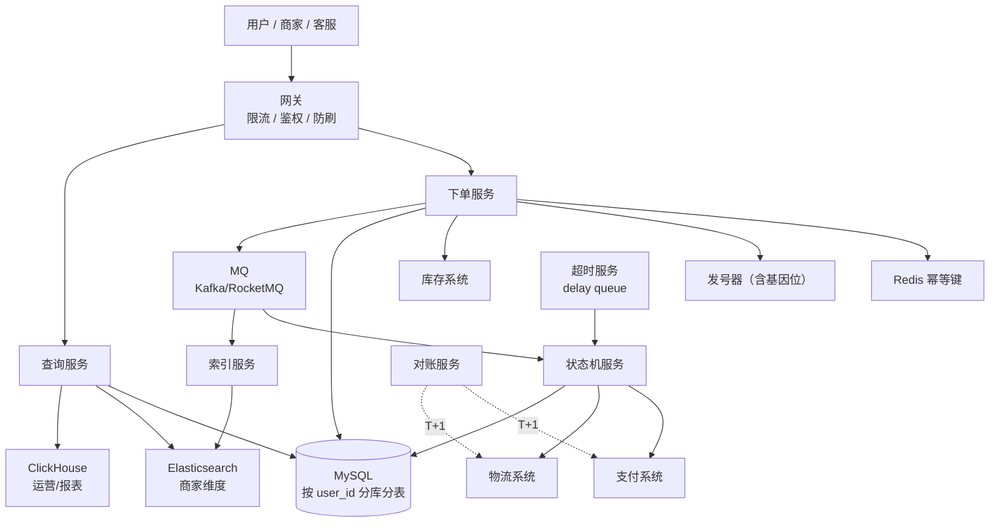
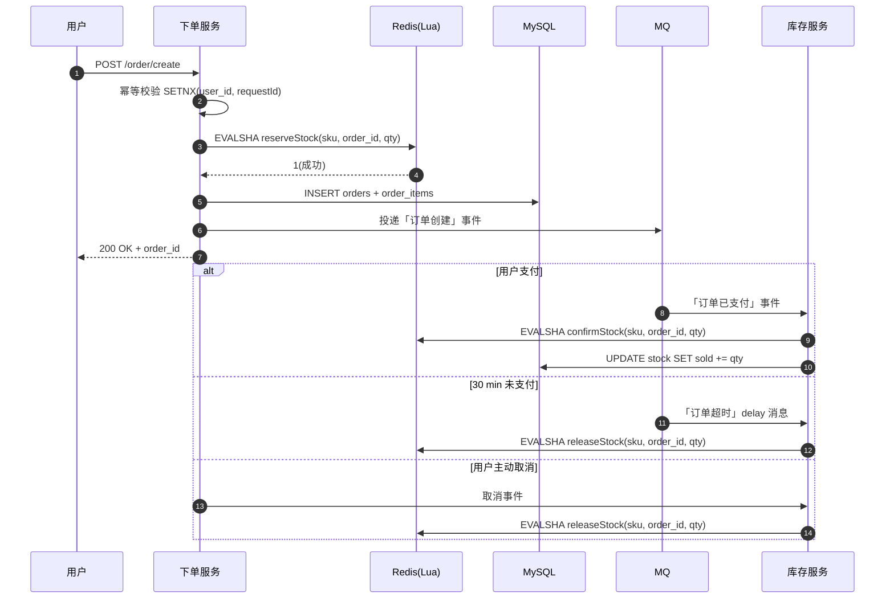
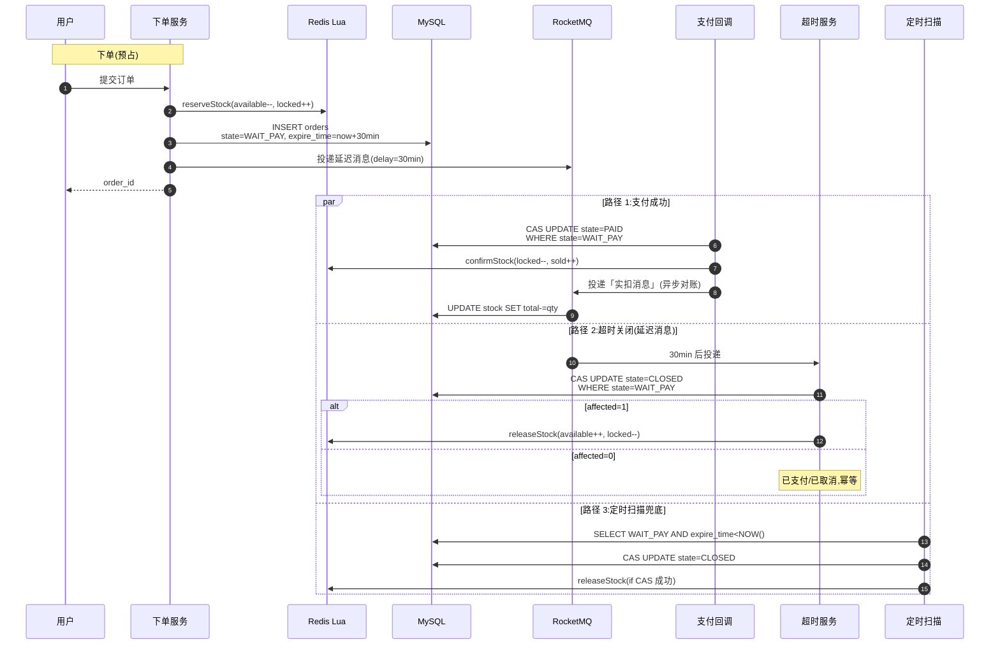

# 订单系统

> 电商订单系统是分布式系统的"集大成者"：分片、幂等、状态机、对账、削峰、冷热分层几乎全占。
>
> 本文按 [01-design-framework.md](01-design-framework.md) 的 10 步通用流程展开，**侧重原理推导和工程讲解**；面试白板答题模板见 [24b-order-system-4s.md](24b-order-system-4s.md)（4S 节奏版）。
>
> **样板规模**：抖音电商日 2000 万单，大促峰值 50 万 QPS。
>
> **三大核心考点**：
> 1. 分片策略（按 user_id 分库分表 + 基因法 + 异构索引）
> 2. order_id 设计（64 bit Snowflake + 基因位）
> 3. 三方订单 ID 处理（主表冗余 vs 独立映射表 + out_trade_no 自带基因）

## 一、需求澄清

订单系统的核心功能：

- 下单：用户提交订单，校验商品/库存/价格/优惠/收件人。
- 支付推进：接收支付回调，更新订单状态。
- 查询：用户查"我的订单"、商家查"店铺订单"、客服查"单笔订单"。
- 状态推进：发货、签收、退款、取消的状态机。
- 超时取消：未支付订单超时自动释放库存。
- 对账：T+1 与支付/物流/平台对账。

非目标，先简化：

- 物流详情（物流系统负责）。
- 售后维权流程（售后系统）。
- 推荐和风控（独立系统）。

**最关键澄清问题**：

- 是 C 端电商还是 B2B？流量结构差异巨大。
- 是否考虑大促？平均 QPS 和峰值差几十倍以上。
- 历史订单保留多久？影响冷热分层方案。
- 是否多商家入驻？影响商家维度查询设计。

## 二、容量估算

假设场景：抖音电商日 2000 万单。

```text
日订单量：     2000 万
日活买家：     500 万（人均 4 单）
商家数：       100 万（平均每商家 20 单/天）

写 QPS：
  平均：       2000 万 / 86400 ≈ 230 QPS
  日常峰值：   2000 QPS（晚 8-10 点高峰）
  大促峰值：   5 万 - 50 万 QPS（开抢瞬时）

读 QPS：
  用户查"我的订单"：    5000 万/天 → 平均 580 QPS，峰值 1 万
  商家查"店铺订单"：    1000 万/天 → 平均 120 QPS，峰值 5000
  客服查"单笔订单"：    100 万/天  → 平均 10 QPS
  对账/内部系统：       500 万/天  → 平均 60 QPS

读写比：约 30:1

存储：
  单订单约 2 KB
  日新增 40 GB
  保留 3 年热数据 ≈ 44 TB → 必须分库分表

订单明细（item 行）：
  日新增 3000 万行 × 500 B = 15 GB
  保留 3 年 ≈ 16 TB

冷数据（3 年以上归档）：几百 TB → TiDB / HBase / OSS
```

结论：

- 写 QPS 平均不高（230），但**大促峰值跳 200 倍** → 削峰是核心。
- 读 QPS 总量大且角色多样化 → 分片策略要服务主流量。
- 数据量 3 年 44 TB → 必须分库分表。
- 三种角色查询场景差异巨大 → 不能用同一条路径满足。

## 三、核心对象和接口

### 核心对象

| 对象 | 含义 |
| --- | --- |
| Order | 订单主体（状态、金额、地址、时间） |
| OrderItem | 订单商品行（SKU 快照、数量、单价） |
| OrderAudit | 状态变更审计日志 |
| OrderExternalRef | 三方 ID 映射（物流单号、退款单号、平台关联号） |

### 核心接口

```text
POST /v1/order/create        下单（需带 user_id + requestId 幂等键）
POST /v1/order/cancel        用户取消
POST /v1/order/pay/callback  支付回调（三方异步通知）
POST /v1/order/ship          商家发货
POST /v1/order/confirm       用户确认收货

GET  /v1/order/list          用户订单列表（C 端，强制带 user_id）
GET  /v1/order/{id}          订单详情
GET  /v1/order/merchant      商家订单列表（B 端，走 ES）
GET  /v1/order/cs            客服查单（走 order_id 基因解码）
```

资深要点：

- 创建接口的幂等键 = `(user_id, requestId)`，前端生成 requestId，服务端用 Redis SETNX 防重复。
- 所有 C 端接口必须带 user_id（从登录态），永远不跨库。
- 客服接口走 order_id 基因解码反推分片，不需要 user_id。

## 四、高层架构



服务职责：

- **下单服务**：幂等校验、价格/库存校验、生成 order_id、落库、投 MQ。
- **查询服务**：按角色路由——C 端走 MySQL 主分片，B 端走 ES，运营走 OLAP。
- **状态机服务**：集中管理状态推进，所有变更走这里，写 audit log。
- **超时服务**：delay queue 监听超时事件，触发取消并释放库存。
- **对账服务**：T+1 拉三方账单按 out_trade_no 逐单比对。
- **归档服务**：3 年前订单归档到 TiDB/HBase。
- **索引服务**：消费 MQ 同步订单到 ES（商家维度查询）。

## 五、关键链路

### 5.1 下单写链路（同步路径要短）

```text
1. 网关层：限流（按 user_id 单用户 1 单/秒） + 鉴权
2. 幂等校验：Redis SETNX (user_id, requestId)，重复请求返回缓存的 order_id
3. 价格/库存预校验：调商品和库存系统
4. 申请 order_id：发号器返回含基因位的 64 bit BIGINT
5. 预占库存：Redis Lua 扣减（原子，毫秒级）
6. 落库：本地事务写 orders + order_items（同库，本地事务）
7. 投 MQ：发布"订单创建"事件
8. 返回 order_id

异步链路（MQ 触发）：
  - 状态机服务订阅，调用支付预下单
  - 索引服务订阅，同步到 ES
  - 积分/营销/通知等下游订阅
```

**资深点**：同步链路只做"必须立刻完成"的事——幂等、库存预占、落库；其他全部异步。下单 P99 必须 < 500ms。

### 5.2 支付回调链路（关键考点：三方 ID 反查）

```text
三方支付回调（支付宝/微信）：
  POST /api/pay/callback
  Body: { out_trade_no, channel_trade_no, status, amount }

我们的处理：
  1. 解析 out_trade_no（= order_id 衍生，自带基因）
  2. 基因解码 → (db, table) 直接定位分片
  3. CAS 推状态机：
       UPDATE orders_dbN_tM
       SET state='PAID', pay_channel_trade_no=?, paid_at=NOW()
       WHERE order_id=? AND state='PENDING'
  4. 若 affected_rows=0：
       - 查当前状态，是 PAID 且 channel_trade_no 一致 → 幂等命中
       - 否则告警
  5. 投 MQ：发布"订单已支付"事件
  6. 返回三方 ACK
```

**资深点**：out_trade_no 是我们自己设计的，必须自带 user_id 基因位，这样三方回调时无需任何路由表就能定位分片。详见 [24b §4.3.5](24b-order-system-4s.md)。

### 5.3 超时取消链路（delay queue）

```text
下单时：
  投递一条 delay 消息到 MQ（RocketMQ 自带 / Redis ZSet 自实现）
  delay = 30 分钟

30 分钟后 MQ 投递：
  超时服务接收 → CAS 推状态机
    UPDATE orders_dbN_tM
    SET state='TIMEOUT'
    WHERE order_id=? AND state='PENDING'
  affected_rows=1 → 释放库存
  affected_rows=0 → 已支付/已取消，忽略
```

**为什么不扫表**：

- 扫表性能差：1024 张表 × 每分钟扫一次 = 资源浪费
- 延迟不稳定：扫描间隔决定取消延迟
- delay queue 是 O(1) 投递，毫秒级精度

### 5.4 查询读链路（按角色分流）

| 角色 | 路径 | 关键 |
| --- | --- | --- |
| 用户 C 端 | MySQL 主分片 | user_id 强制入参，单分片命中 |
| 商家 B 端 | ES 异构索引 → MySQL 回查 | 复杂搜索/模糊匹配 |
| 客服 | order_id 基因解码 → MySQL | 不需要 user_id |
| 运营报表 | ClickHouse / Hive | 离线/实时 OLAP |

**资深点**：三条物理隔离的查询路径，**绝不让运营 SQL 拖垮 C 端**。详见 [24b §4.6](24b-order-system-4s.md)。

## 六、数据模型

### 6.1 订单主表（按 user_id 分库分表）

```sql
CREATE TABLE orders (
    order_id        BIGINT      NOT NULL,        -- 含基因位
    user_id         BIGINT      NOT NULL,        -- 分片键
    merchant_id     BIGINT      NOT NULL,
    total_amount    DECIMAL(12,2) NOT NULL,
    discount_amount DECIMAL(12,2) DEFAULT 0,
    pay_amount      DECIMAL(12,2) NOT NULL,
    state           VARCHAR(16) NOT NULL,        -- PENDING/PAID/SHIPPED/...
    address_snapshot JSON       NOT NULL,        -- 收件人快照
    expire_at       DATETIME    NOT NULL,
    paid_at         DATETIME    DEFAULT NULL,
    -- 1:1 三方 ID 冗余主表（支付，最高频）
    pay_channel             VARCHAR(32) DEFAULT NULL,
    pay_out_trade_no        VARCHAR(64) DEFAULT NULL,  -- = order_id 衍生
    pay_channel_trade_no    VARCHAR(64) DEFAULT NULL,  -- 三方回传
    created_at      DATETIME    NOT NULL,
    updated_at      DATETIME    NOT NULL,

    PRIMARY KEY (order_id),
    KEY idx_user_created (user_id, created_at DESC),
    UNIQUE KEY uk_pay_out (pay_out_trade_no),
    UNIQUE KEY uk_pay_channel_trade (pay_channel, pay_channel_trade_no)
) ENGINE=InnoDB;

-- 逻辑分片：32 库 × 32 表 = 1024 物理表
-- shard_db   = user_id % 32
-- shard_table = (user_id / 32) % 32
```

### 6.2 订单明细（子表冗余分片键）

```sql
CREATE TABLE order_items (
    id              BIGINT AUTO_INCREMENT PRIMARY KEY,
    order_id        BIGINT      NOT NULL,
    user_id         BIGINT      NOT NULL,        -- 冗余分片键
    sku_id          BIGINT      NOT NULL,
    sku_snapshot    JSON        NOT NULL,        -- 商品快照
    quantity        INT         NOT NULL,
    price           DECIMAL(12,2) NOT NULL,
    created_at      DATETIME    NOT NULL,

    KEY idx_order (order_id)
) ENGINE=InnoDB;
-- 分片键：user_id（与 orders 同库）
```

### 6.3 状态审计日志

```sql
CREATE TABLE order_audit (
    id              BIGINT AUTO_INCREMENT PRIMARY KEY,
    order_id        BIGINT      NOT NULL,
    user_id         BIGINT      NOT NULL,        -- 冗余分片键
    from_state      VARCHAR(16) DEFAULT NULL,
    to_state        VARCHAR(16) NOT NULL,
    operator        VARCHAR(64) NOT NULL,        -- user/system/merchant/cs
    reason          VARCHAR(255) DEFAULT NULL,
    external_ref    VARCHAR(64) DEFAULT NULL,
    created_at      DATETIME    NOT NULL,

    KEY idx_order_time (order_id, created_at)
) ENGINE=InnoDB;
-- 永不删除（法务/客诉兜底）
```

### 6.4 三方 ID 映射表（只放 1:N 关系）

```sql
CREATE TABLE order_external_ref (
    id              BIGINT AUTO_INCREMENT PRIMARY KEY,
    order_id        BIGINT      NOT NULL,
    user_id         BIGINT      NOT NULL,        -- 冗余分片键
    ref_type        VARCHAR(16) NOT NULL,        -- refund/logistics/workorder
    channel_type    VARCHAR(32) NOT NULL,        -- alipay/sf_express/...
    channel_no      VARCHAR(64) NOT NULL,
    channel_status  VARCHAR(32) DEFAULT NULL,
    extra           JSON        DEFAULT NULL,
    created_at      DATETIME    NOT NULL,
    updated_at      DATETIME    NOT NULL,

    UNIQUE KEY uk_channel_no (channel_type, channel_no),  -- 防重复回调
    KEY idx_order (order_id, ref_type)
) ENGINE=InnoDB;
-- 分片键：user_id（与主表同库）
```

**核心设计点**：

- 快照字段（JSON）：商品/地址都冗余存快照，业务变更不影响历史订单。
- 子表冗余 user_id：保证同库分片，避免分布式事务。
- 支付字段冗余主表（1:1 关系），物流/退款走映射表（1:N 关系）。
- audit 表永不删除。

### 6.5 order_id 设计（64 bit + 基因位）

```text
| 1 bit | 39 bit       | 4 bit    | 10 bit         | 10 bit       |
| 符号  | 秒级时间戳    | 机房+服务 | user_id 基因位 | 同秒内序列号  |
| 0     | ~17 年容量   | 16 实例   | 1024 分片定位  | 1024 单/秒   |
```

生成与解码：

```go
// 下单时生成
func GenOrderID(userID int64) int64 {
    timestamp := time.Now().Unix() - EPOCH
    nodeID    := getNodeID()
    gene      := userID & 0x3FF   // user_id 低 10 位
    seq       := atomic.AddInt64(&counter, 1) & 0x3FF
    return (timestamp << 24) | (int64(nodeID) << 20) | (gene << 10) | seq
}

// 反推分片
func ShardOfOrder(orderID int64) (db, table int) {
    gene := (orderID >> 10) & 0x3FF
    db    = int(gene) % 32
    table = (int(gene) / 32) % 32
    return
}
```

**关键约束**：分片函数也必须基于 user_id 的低 10 位，保证基因和分片函数对齐——order_id 算出的分片 = user_id 算出的分片。

## 七、一致性与幂等

### 7.1 状态机不可逆

```text
PENDING ──支付─→ PAID ──发货─→ SHIPPED ──收货─→ FINISHED
   │                │              │
   ↓超时             ↓退款           ↓退货
TIMEOUT          REFUNDING       RETURNING
                    │              │
                    ↓              ↓
                 REFUNDED        RETURNED
```

资深点：

- 用 CAS 推进：`WHERE state = 'PENDING'`，affected_rows 决定是否成功。
- 永不删订单：取消的订单只改 state，不删行。
- 所有状态变更写 audit log。

### 7.2 全链路幂等

| 接口 | 幂等键 | 实现 |
| --- | --- | --- |
| 下单 | (user_id, requestId) | Redis SETNX |
| 支付回调 | out_trade_no | CAS WHERE state='PENDING' |
| 取消 | order_id | CAS WHERE state IN ('PENDING') |
| 退款 | (order_id, refund_no) | UNIQUE 约束 |
| 发货 | order_id | CAS WHERE state='PAID' |

### 7.3 三方对账（T+1 兜底）

```text
每天凌晨：
  1. 拉支付宝/微信账单
  2. 按 out_trade_no 逐单比对
  3. 差异分类：
       金额不符 → 进差异平台人工核查
       状态不符 → P0 告警（可能丢回调）
       三方有内部无 → 漏单告警
       内部有三方无 → 假单告警
```

资深点：

> 实时链路可能因网络/重启/MQ 丢消息导致状态不一致，对账是最后一道防线。一个成熟订单系统对账差异率应 < 0.01%。

## 八、可用性与瓶颈

### 8.1 瓶颈分析

| 瓶颈 | 表现 | 解决 |
| --- | --- | --- |
| 下单峰值 | 大促瞬时 50 万 QPS | Redis 预占 + MQ 削峰 + 异步落库 |
| 单 SKU 热点 | 爆款商品所有库存集中 | 库存分桶 / Redis 热点 Key 拆分 |
| 商家维度查询 | merchant_id 不是分片键 | ES 异构索引 |
| 历史数据查询 | 3 年订单查不动 | 冷热分层 |
| 运营慢 SQL | 拖垮主从 | 物理隔离到 ClickHouse |
| 三方回调反查 | 1024 表全扫 | out_trade_no 自带基因 |

### 8.2 大促削峰组合拳

```text
1. 客户端排队页 + 验证码         平滑流量（去掉 50% 重复点击）
2. 网关令牌桶                    按 user_id + 全局限流
3. Redis Lua 预占库存            微秒级原子扣减
4. MQ 缓冲 → DB 异步写            DB 跟不上时 MQ 慢慢消
5. 状态机异步推进                下单返回 order_id 即可
6. 商家维度异步索引              ES 同步延迟 3-5 秒可接受
```

**资深动作**：大促核心是把同步写库变成异步——同步 Redis（微秒）+ MQ（毫秒）+ DB（几十毫秒慢写），用户感知永远 < 500ms。

### 8.3 容灾

- MySQL 同城三 AZ + 异地灾备。
- MQ 集群多副本。
- ES 跨机房复制。
- 关键链路降级预案：商家查询挂了 → 降级到 MySQL 慢查询；运营 OLAP 挂了 → T+1 报表延后。

### 8.4 监控

- 下单成功率（核心）
- 状态流转延迟（PENDING → PAID 的 P99）
- 对账差异率（每日 < 0.01%）
- 三方回调延迟
- 慢查询告警
- MQ 堆积告警

## 九、取舍与边界

### 9.1 分片键的取舍

**为什么按 user_id 不按 order_id**：

- C 端用户查"我的订单"占 80% 流量，必须最优化。
- order_id 分片虽然客服查直接命中，但牺牲了主流量。
- 商家维度通过 ES 异构索引补足，代价小于让主流量跨库。

**为什么不按 merchant_id**：

- 商家分布严重不均（头部商家占 80% 订单），分片热点严重。
- C 端查询全部跨库。

**核心原则**：分片键永远跟着主流量走，其他视角用异构索引补。这与短链按 code、秒杀按 user_id 是同一原则。

### 9.2 基因法的代价

| 代价 | 说明 |
| --- | --- |
| order_id 不可重命名 | 基因位写死，迁移分片函数要重新算 |
| 分片数受基因位限制 | 10 bit = 1024，扩容需提前规划 |
| 不能复用纯发号器 | 必须在发号器之外包一层基因合成 |

但收益巨大——客服/对账/退款回调**全部零跨库**，1000 倍查询性能差异。

### 9.3 三方 ID 设计的取舍

**为什么 1:1 冗余主表**：

- 支付是主路径，每查订单必带支付字段。
- 放映射表会让每次查订单都 JOIN，IO 翻倍。

**为什么 1:N 走映射表**：

- 物流/退款一对多，硬塞主表会让主表字段爆炸。
- 频率较低，多查一次表可接受。

**为什么映射表也要冗余 user_id**：

- 与主表同库，写入是本地事务而不是分布式事务。
- "分片键冗余"是分库分表的核心套路。

### 9.4 ES 同步的取舍

- 延迟 1-3 秒可接受（商家不要求秒级）。
- binlog → MQ → ES，异步同步。
- ES 字段精简，不存大字段（商品图片 URL 等），只存检索字段 + 摘要。

### 9.5 库存扣减时机的取舍（高频追问）

**业界三种方案,核心差异是库存扣减的时机**：

| 方案 | 流程 | 业务场景 | 代价 |
| --- | --- | --- | --- |
| **A. 下单减库存(预占)** | 下单时 Redis Lua 预占,30 min 未付款释放 | 淘宝/京东标品、秒杀、抢购(主流 80%) | 恶意占库存(靠限购 + 风控对冲) |
| **B. 付款减库存** | 下单不扣,支付成功才扣 | 几乎没人用,**用户付完款发现没货**体验崩 | 仅虚拟/无限库存可用 |
| **C. 三阶段(预占 → 实扣 → 释放)** | Redis 预占 → 支付完 MySQL 实扣 → 超时释放 | 12306、票务、奢侈品、医药等严格场景 | 链路最长,但最安全 |

**本文采用方案 A**：[5.1 下单写链路](#51-下单写链路同步路径要短)中,第 5 步 Redis Lua 预占在第 6 步落库**之前**——所以严格说是"**先扣库存再落订单**"。库存扣不成功直接失败,不会产生订单。

**为什么不是"先落订单后扣库存"**：

- 会**超卖**：订单已落,扣库存才发现没货,只能取消订单 → 体验崩溃 + 退款链路
- 大促瞬时 50 万 QPS,DB 慢写本来就堆,再补退款链路撑不住

**为什么 Redis 预占而不是 MySQL 直接扣**：

| 维度 | Redis Lua 预占 | MySQL `UPDATE WHERE stock > 0` |
| --- | --- | --- |
| 延迟 | 微秒级 | 几十毫秒 |
| 并发 | 单线程原子,无锁 | 行锁竞争,热点 SKU 排队 |
| 大促 50 万 QPS | 扛得住 | 直接挂 |
| 一致性 | 异步同步 MySQL | 强一致 |

**取舍**：Redis 预占 + MySQL 异步对账兜底,牺牲强一致换吞吐——大促核心套路。

**业界差异化做法**：

- **抖音电商(本文样板)**：方案 A,Redis Lua + delay queue 30 min 释放
- **12306**：方案 C,铁路票一票多卖会上社会新闻,严格 → 慢 → 高峰排队
- **携程酒店**：方案 A + 与酒店 PMS 上游联动(对方可能撤库)
- **拼多多团购**：方案 A 变种,组团未满**全员退库存**

**追问预案**（面试高频）：

| 追问 | 回答要点 |
| --- | --- |
| 预占了但用户不付款怎么办? | delay queue 30 min 后 CAS 推 TIMEOUT,释放 Redis 库存(详见 [5.3](#53-超时取消链路delay-queue)) |
| Redis 挂了怎么办? | 主从切换 + MySQL 兜底脚本对账修复(允许少量超卖,事后赔付) |
| 用户取消订单库存怎么释放? | 状态机推 CANCELED 时同步释放 Redis + 写 audit log |
| 加入购物车要扣库存吗? | 不扣,只展示;真正扣减发生在下单瞬间(详见 [21-shopping-cart.md](21-shopping-cart.md)) |
| 库存详细设计? | 见 [15-inventory-system.md](15-inventory-system.md)——分桶 / 热点拆分 / 预占释放完整链路 |

### 9.6 冷热分层的取舍

```text
热数据  MySQL  3 个月内    占查询 95%
温数据  MySQL  3 月-3 年    偶尔查（售后/客诉）
冷数据  TiDB/HBase  3 年以上  法务/税务保留 5-7 年
归档    OSS  10 年+       极少访问
```

audit log 永不删除（法务追溯）。

## 十、演进路线

```text
阶段 1（初创，日 1 万单）：
  - 单 MySQL + 简单 order_id（auto_increment + 时间前缀）
  - 同步下单 + 同步扣库存
  - 状态机简单（待支付/已支付/已发货/已完成）

阶段 2（成长期，日 100 万单）：
  - 分库分表 4×4（按 user_id）
  - 引入 MQ 异步状态推进
  - Redis 幂等键
  - 引入对账平台

阶段 3（中大型，日 1000 万单）：
  - 分库分表 32×32
  - 引入 ES 商家索引
  - order_id 升级 Snowflake + 基因位
  - 冷热数据分层

阶段 4（大型，日亿级 + 大促）：
  - 多机房同城多活
  - 异地灾备（订单数据双写）
  - 削峰链路全异步化
  - 风控/反作弊深度集成
```

## 十一、常见追问与回答要点

**Q1：为什么按 user_id 分片而不是 order_id？**

C 端用户查询占 80% 流量，必须服务主流量。按 order_id 分片会让所有用户查询全库 fan-out。

**Q2：商家查"店铺订单"怎么办？**

异构索引——binlog → MQ → ES，按 merchant_id 路由。商家不要求秒级一致，延迟 3 秒可接受。

**Q3：客服只有 order_id 怎么查？**

order_id 含 user_id 基因位（低 10 位），基因解码反推分片，O(1) 定位。

**Q4：支付回调没有 user_id 怎么定位订单？**

out_trade_no = order_id 衍生，自带基因。三方回调时基因解码直接定位分片，零路由表。

**Q5：为什么支付字段冗余主表，物流单号走映射表？**

按"关系基数"拆——1:1 冗余主表避免 JOIN，1:N 走映射表避免主表字段爆炸。

**Q6：怎么保证下单幂等？**

(user_id, requestId) 做 Redis SETNX，前端生成 requestId。重复请求返回缓存的 order_id。

**Q7：超时取消怎么实现？**

delay queue（RocketMQ delay / Redis ZSet），永远 O(1)。不扫表——扫表性能差且延迟不稳定。

**Q8：大促 50 万 QPS 怎么扛？**

客户端排队 + 网关令牌桶 + Redis Lua 预占 + MQ 异步落库 + 状态机异步推进。同步链路只保 Redis 扣减，DB 慢慢写。

**Q9：怎么对账？**

T+1 拉三方账单，按 out_trade_no 逐单比对。金额不符进差异平台人工核查；状态不符 P0 告警。

**Q10：运营要导数据怎么办？**

走 ClickHouse / Hive，物理隔离。绝不让运营 SQL 直连主库——慢查询会拖垮 C 端。

## 十二、与相关文档的关系

| 文档 | 关系 |
| --- | --- |
| [24b-order-system-4s.md](24b-order-system-4s.md) | **4S 节奏版**——同场景，按 Scenario/Service/Storage/Scale 推，适合面试白板复述 |
| [13-payment-system.md](13-payment-system.md) / [13b-payment-system-4s.md](13b-payment-system-4s.md) | 下游支付系统 |
| [15-inventory-system.md](15-inventory-system.md) | 上游库存系统 |
| [21-shopping-cart.md](21-shopping-cart.md) | 入口购物车 |
| [23-id-generator-system-4s.md](23-id-generator-system-4s.md) | order_id 来源 |
| [03-seckill-system.md](03-seckill-system.md) | 秒杀是订单的极端流量场景 |

## 十三、新版（24b 4S）vs 本文（24 10 步）对比

| 维度 | 本文（10 步框架） | 4S 版 [24b](24b-order-system-4s.md) |
| --- | --- | --- |
| **组织方式** | 主题平铺（10 步）：需求/容量/对象/架构/链路/数据/一致性/瓶颈/取舍/演进 | 4S 递进：Scenario → Service → Storage → Scale |
| **节奏** | 舒缓，每节简表+正文 | 紧凑，每段 5-15 分钟时长标签 |
| **风格** | 教学口吻，讲解原理 | 答题口吻，模拟白板复述 |
| **适合场景** | 写工程文档 / 第一次学订单系统 | 面试白板答题 / 资深面试快速复述 |
| **资深信号** | 通过"取舍"章节集中展示 | 通过"定调句 + 与其他系统对比"展示 |
| **重点深度** | 数据模型 + 链路并重 | Storage 占 50% 篇幅（三大核心考点 + 三角色查询路径） |

**怎么用**：
- **第一次理解订单系统** → 看本文（10 步框架，节奏舒缓）
- **面试前快速复述** → 看 4S 版（紧凑、有时间标签、有"定调句"）
- **两份都看**：本文打基础，4S 版练答题——这是系统设计的"理解 vs 表达"两面

> 这与短链平台 [02-short-code-platform.md](02-short-code-platform.md) / [02b-short-code-platform-4s.md](02b-short-code-platform-4s.md) 的双版本关系一致——后续系统设计可按此双版本模式扩展。

## 十四、一句话总结

> 订单系统 = **多视角分片 + 强一致幂等 + 大促削峰 + 跨系统对账**。
>
> 核心三招：**user_id 分片**服务主流量（C 端 80%）+ **基因法 order_id** 让其他视角零跨库（1000× 性能差异）+ **三方 ID 按关系基数拆**（1:1 冗余主表 / 1:N 独立映射 + out_trade_no 自带基因 O(1) 反查）。
>
> 配套：状态机不可逆 + 全链路幂等 + delay queue 超时 + T+1 对账兜底 + 三角色查询路径物理隔离 + 大促削峰组合拳。

## 附录 A：Redis Lua 库存扣减完整实现

> [5.1 下单写链路](#51-下单写链路同步路径要短) 第 5 步「Redis Lua 预占库存」的展开。本附录给出**完整的预占 / 释放 / 实扣三态机 + 五层兜底**,资深面试可深入到这一层。
>
> 库存系统自身的完整设计见 [15-inventory-system.md](15-inventory-system.md),本附录只覆盖**订单链路侧的库存调用**。

### A.1 为什么必须 Lua

Redis 单线程,但**两个命令之间会被其他客户端插队**：

```text
错误做法(有超卖风险):
  GET stock:sku_123          → 返回 1
  ⚠️ 此时另一个客户端也 GET 到 1
  DECR stock:sku_123         → 两个客户端都"扣成功"

正确做法(Lua 原子):
  Lua 脚本内部 GET + DECR 整体执行,中间不会被插入其他命令
```

**Lua 的本质**：把多步操作打包成一个**原子单元**,Redis 单线程执行期间锁住所有其他请求。

### A.2 数据结构选择

```text
方案 1: String(简单库存)
  SET stock:sku_123 1000
  ❌ 无法记录"哪些用户已预占",防重复占用要另开 Set

方案 2: Hash(本文采用)
  HSET stock:sku_123 total 1000 remaining 1000 reserved 0
  ✅ 一次操作多字段,total 不变,remaining/reserved 联动
```

### A.3 预占 Lua 脚本（核心）

```lua
-- KEYS[1] = stock:sku_{sku_id}        商品库存 Hash
-- KEYS[2] = reserve:sku_{sku_id}      预占记录 Set(防重复占用)
-- ARGV[1] = order_id                  幂等键
-- ARGV[2] = quantity                  扣减数量
-- ARGV[3] = expire_seconds            预占过期时间(兜底)

-- 1. 幂等检查:同一订单不能重复扣
if redis.call('SISMEMBER', KEYS[2], ARGV[1]) == 1 then
    return 0  -- 已预占,幂等返回成功
end

-- 2. 读剩余库存
local remaining = tonumber(redis.call('HGET', KEYS[1], 'remaining'))
if remaining == nil then
    return -1  -- 商品不存在(冷启动未加载)
end

-- 3. 库存判断
local qty = tonumber(ARGV[2])
if remaining < qty then
    return -2  -- 库存不足
end

-- 4. 原子扣减 + 记录预占
redis.call('HINCRBY', KEYS[1], 'remaining', -qty)
redis.call('HINCRBY', KEYS[1], 'reserved', qty)
redis.call('SADD', KEYS[2], ARGV[1])
redis.call('EXPIRE', KEYS[2], ARGV[3])  -- 兜底过期

return 1  -- 成功
```

**返回值约定**:

| 值 | 含义 | 业务处理 |
| --- | --- | --- |
| `1` | 预占成功 | 继续落库 |
| `0` | 幂等命中(已预占过) | 返回缓存的 order_id |
| `-1` | 商品不存在 | 报错,触发冷启动加载 |
| `-2` | 库存不足 | 告知用户,返回前端 |

### A.4 Go 调用代码

```go
const reserveStockScript = `... A.3 的 Lua ...`

type StockClient struct {
    rdb    *redis.Client
    script *redis.Script  // 自动 EVALSHA 优化
}

func NewStockClient(rdb *redis.Client) *StockClient {
    return &StockClient{
        rdb:    rdb,
        script: redis.NewScript(reserveStockScript),
    }
}

// ReserveStock 预占库存
func (c *StockClient) ReserveStock(ctx context.Context, skuID, orderID int64, qty int) error {
    keys := []string{
        fmt.Sprintf("stock:sku_%d", skuID),
        fmt.Sprintf("reserve:sku_%d", skuID),
    }
    args := []interface{}{orderID, qty, 1800}  // 30 min 兜底过期

    result, err := c.script.Run(ctx, c.rdb, keys, args...).Int()
    if err != nil {
        return fmt.Errorf("redis lua failed: %w", err)
    }

    switch result {
    case 1, 0:
        return nil  // 1 = 新预占,0 = 幂等命中
    case -1:
        return ErrSkuNotFound
    case -2:
        return ErrInsufficientStock
    default:
        return fmt.Errorf("unexpected result: %d", result)
    }
}
```

**关键点**:

- 用 `redis.NewScript` 而不是直接 `EVAL`,SDK 会自动缓存 SHA,第二次起走 `EVALSHA`,减小网络包大小
- `context` 必传,大促时配 100 ms timeout,避免雪崩
- 错误分类返回,业务层按 `errors.Is` 判断

### A.5 释放库存（取消 / 超时）

```lua
-- KEYS[1] = stock:sku_{sku_id}
-- KEYS[2] = reserve:sku_{sku_id}
-- ARGV[1] = order_id
-- ARGV[2] = quantity

-- 1. 必须先确认确实预占过(防重复释放)
if redis.call('SISMEMBER', KEYS[2], ARGV[1]) == 0 then
    return 0  -- 没预占过或已释放,幂等
end

-- 2. 原子释放
local qty = tonumber(ARGV[2])
redis.call('HINCRBY', KEYS[1], 'remaining', qty)
redis.call('HINCRBY', KEYS[1], 'reserved', -qty)
redis.call('SREM', KEYS[2], ARGV[1])

return 1
```

**触发释放的场景**:

- 用户主动取消订单 → 状态机推 `CANCELED` 时调用
- delay queue 触发超时 → 推 `TIMEOUT` 时调用(详见 [5.3](#53-超时取消链路delay-queue))
- 支付失败 → 状态回滚时调用

### A.6 实扣库存（支付成功后）

```text
支付成功 MQ 事件 → 库存服务消费:
  1. Lua 把 reserved 减 qty,total 减 qty(库存真正消耗)
  2. SREM 移除预占记录
  3. binlog → MQ → MySQL stock 表异步更新(对账兜底)
```

### A.7 完整三态时序图



### A.8 防超卖五层兜底

| 层 | 防御点 | 作用 |
| --- | --- | --- |
| 1 | Redis Lua 原子扣减 | 99.99% 拦截 |
| 2 | reserve Set 幂等记录 | 防重复预占 |
| 3 | MySQL `UPDATE WHERE stock >= qty` | Redis 挂了的兜底 |
| 4 | binlog → ES 异步对账 | 发现 Redis/MySQL 不一致告警 |
| 5 | T+1 库存盘点 | 终极兜底,赔付 + 修数据 |

**核心信念**: 不存在 100% 防超卖,只能把超卖率压到 < 0.001%,剩下用赔付兜住。

### A.9 常见坑（资深加分）

| 坑 | 解决 |
| --- | --- |
| **冷启动**: Redis 重启 stock 没了 | 服务启动时从 MySQL 加载到 Redis,加载期间拒绝下单 |
| **热点 SKU**: 爆款集中扣同一个 key | 库存分桶,把 1000 库存拆 10 个 Bucket 各 100,Lua 随机选桶 |
| **大 Key**: reserve Set 暴涨 | 用过期 + 定时清理(预占成功后落 MySQL,Redis Set 用作短期幂等) |
| **集群 Lua**: KEYS 必须同 slot | 用 hash tag `stock:{sku_123}` 让 KEYS[1]/KEYS[2] 落同槽 |
| **Lua 阻塞**: 复杂脚本卡住 Redis | 脚本要短,禁止循环大集合,禁止外部网络调用 |

### A.10 与其他系统的库存模型对比

| 系统 | 库存模型 | Lua 复杂度 |
| --- | --- | --- |
| **订单系统(本文)** | 预占 + 释放 + 实扣三态 | 中(本附录样板) |
| **秒杀** [03-seckill-system.md](03-seckill-system.md) | 直接扣,不预占(秒杀就是不付款也不放回) | 低 |
| **优惠券** [14b-coupon-system-4s.md](14b-coupon-system-4s.md) | 领券 = 直接占,核销才真正消费 | 中 |
| **库存系统** [15-inventory-system.md](15-inventory-system.md) | 完整三态机 + 分桶 + 异步对账 | 高(库存领域专家) |

## 附录 B：库存三态机 + 超时释放完整实现

> [5.1 下单写链路](#51-下单写链路同步路径要短) / [5.2 支付回调](#52-支付回调链路关键考点三方-id-反查) / [5.3 超时取消](#53-超时取消链路delay-queue) 三条链路的库存视角整合,完整讲清「预占 → 实扣 / 释放」三态机如何在生产环境落地。
>
> 区别于附录 A 单一脚本的细节,本附录从**业务状态机**视角串起整个链路。

### B.1 生产稳态架构(业界主流共识)

```text
1. 延迟消息为主           ─→ RocketMQ delay / 自实现 ZSet,O(1) 投递
2. 定时扫描补偿           ─→ 兜底未触发的延时消息(MQ 丢消息 / 重启丢失)
3. Redis 只做高性能库存状态 ─→ 实时扣减、毫秒响应,大促主链路
4. MySQL 订单状态作为最终判断依据 ─→ 真相之源,所有 CAS 走 MySQL
```

**信念**：Redis 是"事务台账"快但易失,MySQL 是"会计账本"慢但权威——任何状态分歧以 MySQL 为准。

### B.2 库存三态字段定义

```text
Redis Hash: stock:sku_{id}
  total       总库存(初始化值,会随实扣递减)
  available   可下单库存(下单时扣减,等价于 remaining)
  locked      已预占未实扣(下单 +,实扣/释放 -)
  sold        已售出(实扣 +,统计用)
  
  恒等式: total = available + locked + sold(若 total 不递减则用此式)
  本附录采用: total 实扣时递减,sold 单独累计
```

**两套字段命名约定都可接受**:

| 命名 A(附录 A) | 命名 B(本附录) | 含义 |
| --- | --- | --- |
| `remaining` | `available` | 可下单库存 |
| `reserved` | `locked` | 已预占未支付 |
| `total - reserved` | `total - locked - sold` | 实际剩余 |

资深视角:**字段命名跟着团队约定走,不强求统一。重要的是状态机语义清晰**。

### B.3 下单链路(预占)

```text
1. Redis Lua 预占库存(available --, locked ++)
2. MySQL 创建订单,state='WAIT_PAY',写 expire_time
3. 发送延迟关闭消息(30 min 后投递)
4. 返回 order_id
```

**关键点**:`expire_time` 是数据库字段,延迟消息只是"提醒",**真正的判断依据是 MySQL 的 expire_time + state**。这样即使延迟消息丢失,定时扫描也能补偿。

### B.4 支付成功链路(实扣)

```text
1. 三方支付回调到达
2. 基因解码 out_trade_no → 定位订单分片
3. MySQL CAS: UPDATE state='PAID' WHERE state='WAIT_PAY'
   - affected_rows=0 → 幂等返回(已支付 / 已关闭)
   - affected_rows=1 → 继续
4. 发送「确认库存」MQ 消息(异步,不阻塞回调)
5. 库存服务消费:
   Lua 幂等确认 locked -> sold(reserved -=qty, sold +=qty)
   MySQL UPDATE stock 表(异步对账)
6. 三方 ACK
```

**为什么实扣走 MQ 异步**:

- 支付回调要快(三方有超时,超过会重投)
- Redis 实扣是必须的(防止用户取消时错误释放已支付的库存)
- 但 MQ 投递 + Redis 操作 < 5 ms,可接受同步——**这里有个细节**:

| 方案 | Redis 实扣时机 | 一致性 | 性能 |
| --- | --- | --- | --- |
| **方案 1**(同步) | 支付回调内同步调 Lua | 强一致 | 回调 + 5 ms |
| **方案 2**(异步) | MQ 消费时调 Lua | 秒级最终一致 | 回调 < 10 ms |
| **混合**(推荐) | Lua 同步(快),MySQL 异步 MQ | Redis 强一致 + MySQL 最终 | 最优 |

**推荐混合方案**:Redis 是库存真相,必须同步;MySQL 是统计兜底,可异步。

### B.5 超时关闭链路(释放)

```text
1. 延迟消息到达(30 min 后)
2. MySQL CAS: UPDATE state='CLOSED' WHERE state='WAIT_PAY'
3. 若 affected_rows=1:
   Lua 释放库存(available ++, locked --)
   写 audit log
4. 若 affected_rows=0:
   用户已支付或主动取消,幂等返回
```

### B.6 定时扫描补偿(关键!)

延迟消息**会丢**(MQ 故障 / 消费失败 / 投递时机偏差),所以必须有定时扫描兜底:

```sql
-- 每 5 分钟扫一次,捞已超时但仍在 WAIT_PAY 的订单
-- 注意:1024 张表要分库分表轮询,不能全局扫
SELECT order_id FROM orders_dbN_tM 
WHERE state = 'WAIT_PAY' 
  AND expire_time < NOW() 
  AND expire_time > NOW() - INTERVAL 1 HOUR  -- 限定范围避免全表
LIMIT 1000;
```

**对每条订单**:

```go
func ScanAndClose(ctx context.Context, orderID int64) {
    // 复用超时关闭逻辑(走 CAS 兜底)
    affected, _ := db.UpdateState(ctx, orderID, "WAIT_PAY", "CLOSED")
    if affected == 1 {
        stock.ReleaseStock(ctx, skuID, orderID, qty)
        log.Warn("timeout msg lost, fallback by scanner", "orderID", orderID)
    }
}
```

**资深细节**:

- 扫描频率:5-10 min(主链路是延迟消息,扫描只是兜底,不需要太频繁)
- 限定 `expire_time` 范围:防止扫到上古订单
- 触发告警:如果扫到的数量 > 阈值,说明 MQ 出问题了
- 分片轮询:1024 张表,每次扫一批分片,避免雪崩

### B.7 完整三态时序图



### B.8 五道防线(为什么生产稳)

| 防线 | 触发 | 作用 |
| --- | --- | --- |
| **L1 延迟消息** | 主链路,30 min 后投递 | 99% 场景触发关闭 |
| **L2 定时扫描** | 每 5 min 扫 WAIT_PAY+expire_time<NOW | MQ 丢消息时兜底 |
| **L3 MySQL CAS** | 所有状态推进 | 防并发竞争,affected=0 即幂等 |
| **L4 Redis Lua 幂等** | reserve Set 防重复操作 | 重复释放/实扣自动忽略 |
| **L5 T+1 对账** | 凌晨扫所有订单 vs Redis | 终极兜底,差异告警 |

**三个核心信念**(资深面试可直接背):

1. **MySQL state + expire_time 是最终判断依据,Redis 只是缓存**
2. **延迟消息 + 定时扫描双保险**,缺一不可
3. **所有状态变更走 CAS**,affected_rows 决定后续动作

### B.9 资深追问预案

| 追问 | 回答 |
| --- | --- |
| 延迟消息丢了怎么办? | 定时扫描兜底(L2),5 min 内触发关闭 |
| Redis 挂了影响什么? | 下单失败(Lua 不可用),但已存在订单不影响——MySQL state 还在,扫描补偿仍工作 |
| 支付回调和超时消息同时到达? | MySQL CAS 串行执行,只有一个 affected=1,另一个 affected=0 自动放弃 |
| MySQL 已 PAID 但 Redis 还在 locked? | T+1 对账发现,人工修复(Redis 是缓存,修就是) |
| MySQL 已 CLOSED 但 Redis 没释放? | 同上,T+1 修复,或下次同 SKU 库存查询时触发对账 |
| MQ 重复投递延迟消息? | CAS WHERE state='WAIT_PAY',第二次 affected=0,自动幂等 |
| 用户主动取消和超时同时发生? | 同上,CAS 串行,谁先谁赢,另一个幂等 |
| 为什么不用 MySQL 行锁? | 行锁影响并发,CAS 是乐观锁,更适合高并发场景 |

### B.10 与其他时机决策的横向对比

| 维度 | 扫表方案 | 延迟消息单独 | **延迟消息+扫描(本附录)** |
| --- | --- | --- | --- |
| 延迟精度 | 分钟级(扫描间隔) | 秒级 | 秒级 |
| DB 压力 | 高(频繁扫) | 0 | 低(扫描频率低) |
| MQ 依赖 | 无 | 强 | 中(只是主链路) |
| 丢消息容错 | 天然容错 | ❌ | ✓(扫描兜底) |
| 实现复杂度 | 低 | 低 | 中 |
| 业界采用 | 中小项目 | 早期方案 | **生产稳态** |

**结论**:延迟消息主导 + 定时扫描兜底,是各大电商生产环境的事实标准——抖音电商、淘宝、京东、拼多多基本都是这个套路。
