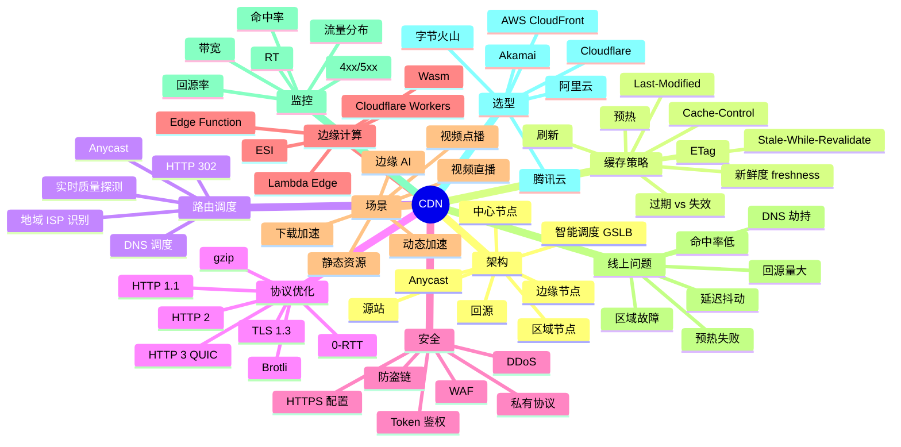
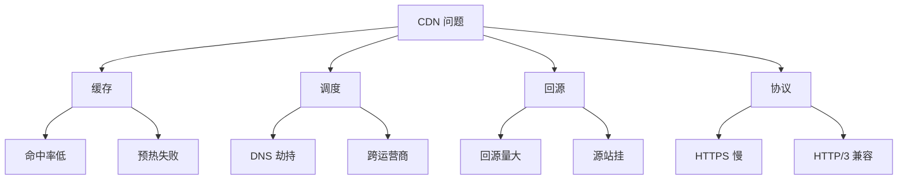
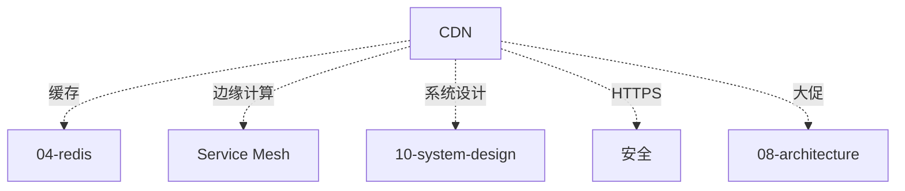

# CDN 知识地图

> CDN 是后端**面向用户的最后一公里**。从架构、缓存策略、回源、协议优化、安全到边缘计算，资深面试常深挖。
>
> 这份地图是 11-cdn 目录的总览：知识树 / 题型分类 / 学习路径 / 系统设计角色 / 排查地图 / 答题方式

---

## 一、整体知识树



---

## 二、后端视角的 CDN

| CDN 能力 | 后端解决的问题 |
| --- | --- |
| 边缘缓存 | 用户就近访问 / 减源站压力 90% |
| 全球加速 | 跨地域用户体验一致 |
| 抗 DDoS | 边缘吸收攻击流量 |
| HTTPS 加速 | TLS 终止下沉边缘 |
| 大文件分发 | 视频 / 软件下载 |
| 直播加速 | 边缘推流 + 拉流 |
| 动态加速 | TCP / 路由优化 |
| 边缘计算 | 业务逻辑下沉边缘 |
| 防盗链 | Token / Referer 校验 |

---

## 三、能力分层（资深 Go 后端）

```text
L1 概念
  CDN 是什么、为什么、节点拓扑

L2 缓存策略
  Cache-Control / ETag / 协商缓存 / 失效

L3 路由调度
  DNS / HTTP / Anycast / 智能调度

L4 协议优化
  HTTP/2 / HTTP/3 / TLS 1.3 / 压缩

L5 安全
  DDoS / WAF / 防盗链 / HTTPS

L6 边缘计算
  Edge Functions / Workers / Wasm

L7 线上问题
  命中率 / 回源 / 延迟 / 区域故障

L8 系统设计
  视频 / 直播 / 大文件 / 动态加速
```


---

## 四、题型分类

### 4.1 基础题（P5）

```
□ CDN 是什么？怎么工作？
□ 缓存命中率
□ 回源是什么
□ DNS 调度原理
```

对应：[01](01-architecture.md) / [02](02-cache-strategy.md) / [03](03-routing-dispatch.md)

### 4.2 中级题（P6）

```
□ Cache-Control 和 ETag
□ Last-Modified vs ETag
□ HTTP/2 vs HTTP/3
□ Anycast 怎么工作
□ DDoS 怎么防
□ 预热 vs 刷新
□ 命中率怎么提升
```

对应：[02](02-cache-strategy.md) / [03](03-routing-dispatch.md) / [04](04-protocol-optimization.md) / [05](05-security.md)

### 4.3 资深题（P7+）

```
□ HTTP/3 QUIC 完整流程
□ TLS 1.3 0-RTT 安全风险
□ 边缘计算落地（Workers / Lambda）
□ 视频自适应码率（HLS / DASH）
□ 直播 RTMP / SRT / WebRTC
□ 动态加速 TCP 优化
□ Anycast vs DNS 调度对比
□ CDN 自研 vs 商用
```

对应：[04](04-protocol-optimization.md) / [06](06-edge-computing.md) / [07](07-scenarios.md)

### 4.4 综合系统设计（P7-P8）

```
□ 设计视频点播系统（CDN 怎么用）
□ 设计直播系统
□ 大文件下载加速
□ 设计电商首页加速
□ CDN 容灾设计
```

对应：[07](07-scenarios.md) + [../10-system-design](../10-system-design/README.md)

### 4.5 线上排查题

```
□ CDN 命中率从 90% 降到 50%
□ 回源量突增
□ 区域延迟突增
□ 预热失败
□ DNS 劫持
□ 跨运营商访问慢
```

对应：[08](08-troubleshooting-cases.md)

---

## 五、目录文件全览

| # | 文件 | 重点 |
| --- | --- | --- |
| 01 | [架构](01-architecture.md) | 节点拓扑 / GSLB / 回源 |
| 02 | [缓存策略](02-cache-strategy.md) | Cache-Control / ETag / 预热刷新 |
| 03 | [路由调度](03-routing-dispatch.md) | DNS / HTTP / Anycast / 智能调度 |
| 04 | [协议优化](04-protocol-optimization.md) | HTTP/2/3 / TLS 1.3 / 压缩 |
| 05 | [安全](05-security.md) | DDoS / WAF / 防盗链 / HTTPS |
| 06 | [边缘计算](06-edge-computing.md) | Workers / Wasm / ESI |
| 07 | [场景](07-scenarios.md) | 视频 / 直播 / 下载 / 动态 |
| 08 | [排查案例](08-troubleshooting-cases.md) | 命中率 / 回源 / 延迟 / 故障 |

---

## 六、在系统设计中的角色

### 6.1 静态资源加速

```
HTML / JS / CSS / 图片 → CDN 边缘
命中率 95%+ / 回源 5%
```

### 6.2 视频点播

```
转码 → 切片（HLS）→ CDN 分发
预热热门视频
冷热分层（热在边缘 / 冷在中心）
```

### 6.3 直播

```
推流 → 中心 → 区域 → 边缘
拉流就近
RTMP / SRT / WebRTC 协议
```

### 6.4 动态加速

```
路由优化 + TCP 优化
TLS 边缘终止
连接池复用
```

### 6.5 边缘计算

```
Workers / Functions
鉴权 / 限流 / A/B 实验
个性化下沉边缘
```

---

## 七、线上问题分类地图



---

## 八、学习路径推荐

### 8.1 入门 → 资深（5 周）

```
Week 1: 架构 + 缓存
  01 + 02

Week 2: 调度 + 协议
  03 + 04

Week 3: 安全 + 边缘
  05 + 06

Week 4: 场景
  07

Week 5: 排查
  08
```

---

## 九、答题模板

### 9.1 概念题（"CDN 怎么工作"）

```
4 步:
1. 用户访问 → DNS / Anycast 调度到最近边缘
2. 边缘有缓存 → 直接返回
3. 边缘无缓存 → 回源（可能区域 → 中心 → 源站）
4. 缓存到边缘 + 返回用户
```

### 9.2 设计题（"视频点播 CDN 设计"）

```
4 步:
1. 上传 + 转码 + 切片
2. 推送热门到边缘（预热）
3. 用户访问 → 边缘命中 95%
4. 冷视频回源 / 长 TTL
```

### 9.3 排查题（"命中率从 95% 降到 50%"）

```
4 步:
1. 时间点（发版？配置变化？）
2. 工具: CDN 控制台 + 日志分析
3. 可能原因:
   - 缓存键变了（含随机参数）
   - TTL 变短
   - 回源 Header 错
4. 解决:
   - 归一化缓存键
   - 调整 TTL
   - 重新预热
```

---

## 十、面试表达

```text
CDN 8 层：
- L1 概念（节点 / 回源）
- L2 缓存（Cache-Control / ETag）
- L3 调度（DNS / Anycast）
- L4 协议（HTTP/2/3 / TLS 1.3）
- L5 安全（DDoS / WAF / 防盗链）
- L6 边缘（Workers / Wasm）
- L7 排查
- L8 系统设计

CDN 是"用户体验"的最后一公里。
```

---

## 十一、常见误区

### 误区 1：CDN 只缓存静态

错。**动态加速**（路由 + TCP 优化）也是 CDN 重要能力。

### 误区 2：HTTPS 拖慢 CDN

错。**边缘 TLS 终止**反而更快。

### 误区 3：HTTP/3 一定更好

部分错。**弱网更好**，强网无明显优势。

### 误区 4：自建 CDN 更划算

错。**自建成本高**（带宽 / 运维）。商用 CDN 综合性价比高。

### 误区 5：DDoS 完全靠 CDN

部分错。**应用层 DDoS** 还需要 WAF + 业务限流。

---

## 十二、与其他模块的关系



---

## 十三、面试加分点

- **GSLB 智能调度** + 实时质量探测
- **Anycast** 单 IP 全球路由
- **HTTP/3 QUIC** 0-RTT
- **TLS 1.3 + 0-RTT 安全风险**（重放攻击）
- **边缘计算**（Cloudflare Workers / Wasm）
- **视频自适应码率**（HLS / DASH）
- **直播协议**（RTMP / SRT / WebRTC）
- **动态加速 TCP 优化**（BBR / TFO）
- **回源连接池 + Keep-Alive**
- **预热 + 刷新策略**
- **命中率 + 回源率监控**
- **DDoS 防护**（清洗 + 黑洞）

---

## 十四、推荐阅读路径

```
入门:
  □ 《CDN 技术架构》
  □ 11-cdn/01-04

进阶:
  □ HTTP/3 RFC
  □ Cloudflare 博客
  □ 11-cdn/05-08

资深:
  □ Akamai 技术白皮书
  □ Edge Computing 论文
```

---

## 十五、与 99-meta 的关联

```
综合实战: 10-system-design/16-high-concurrency-scenarios.md
缓存专题: 99-meta/01-cross-topic-index.md
```
