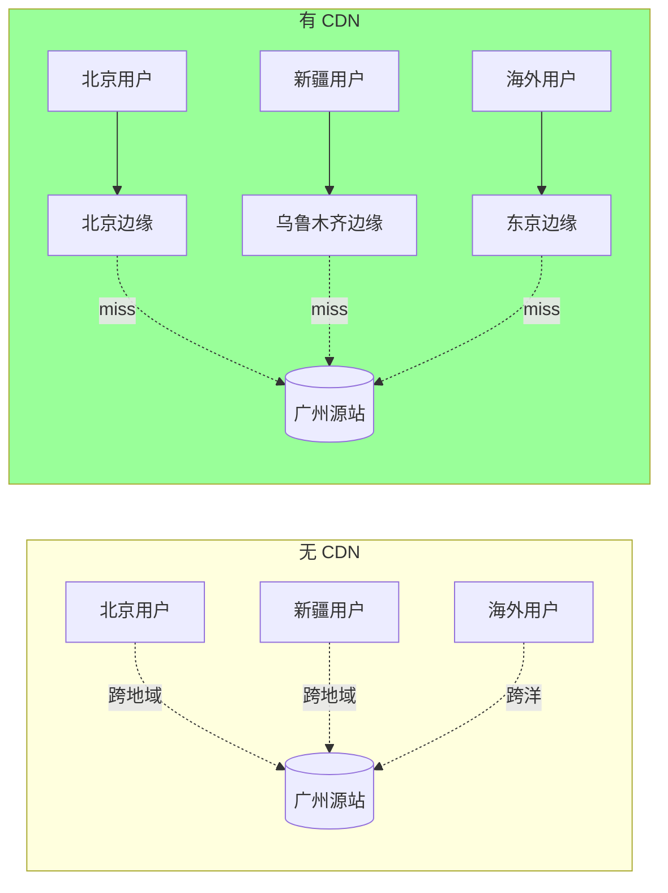
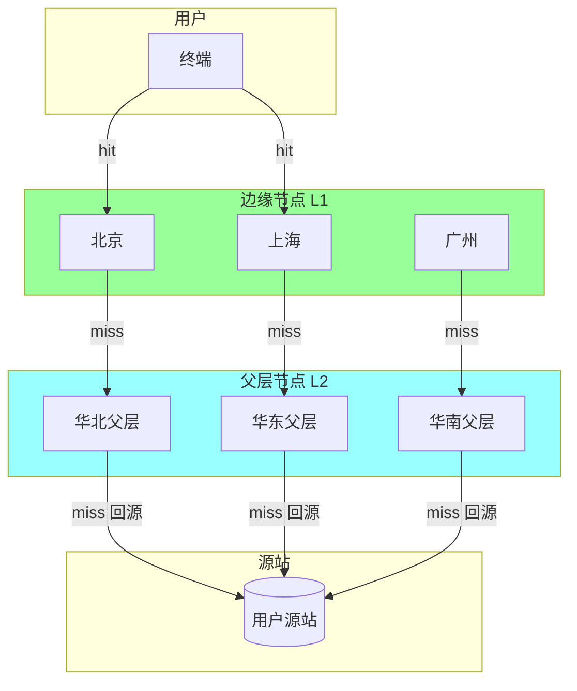
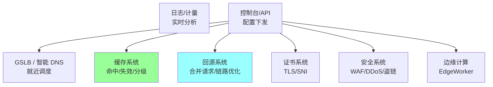
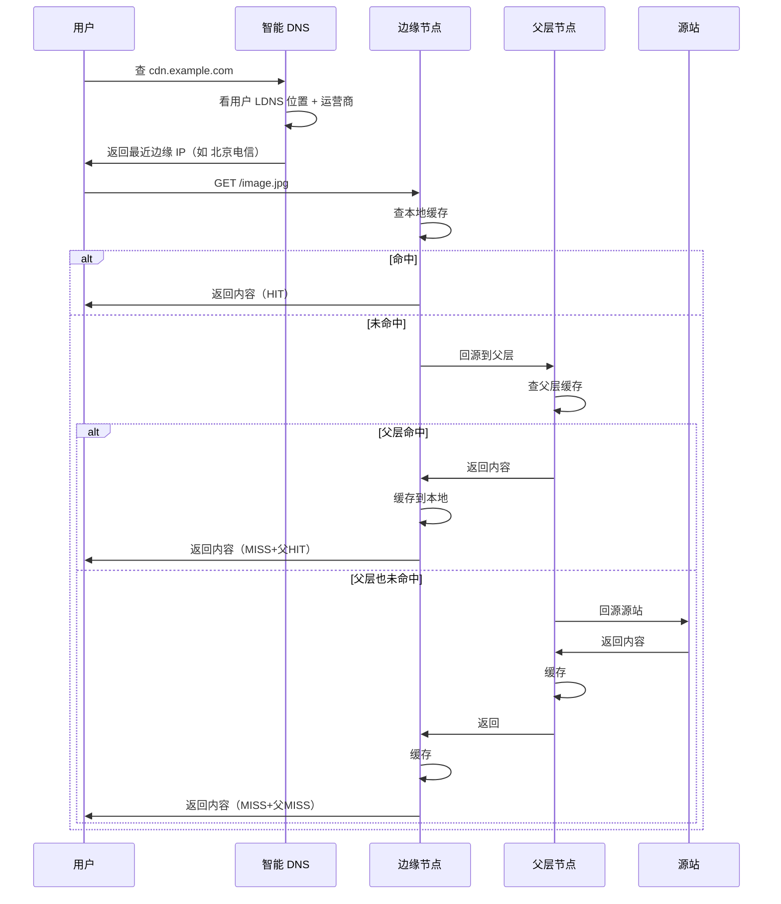
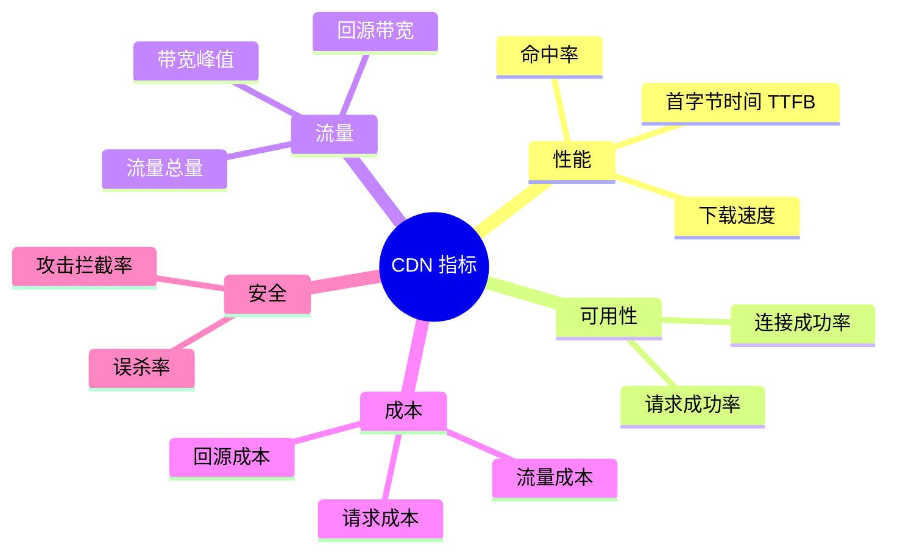
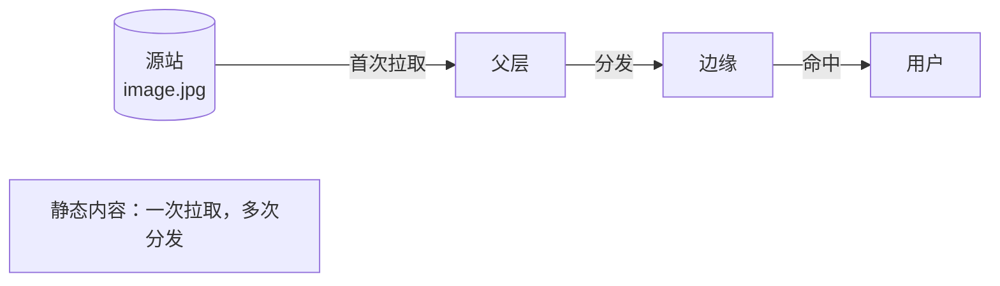
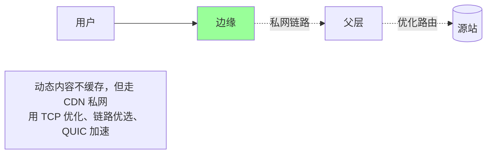
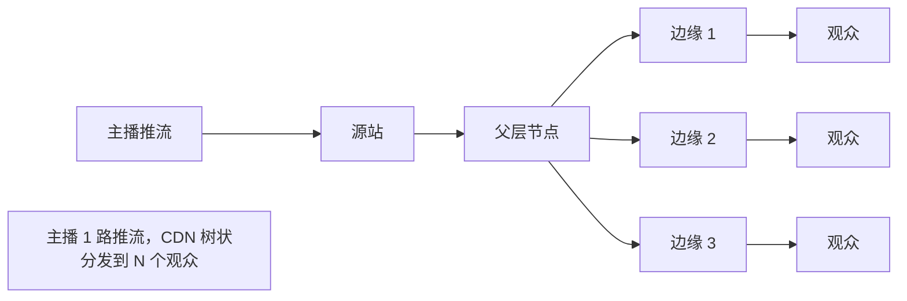

# CDN · 架构与原理

> CDN 是什么 / 核心组件 / 数据流 / 关键指标 / 大厂方案对比

## 一、CDN 是什么

### 1.1 一句话定义

> **CDN（Content Delivery Network）= 把内容缓存到离用户最近的边缘节点，用就近访问替代回源**



### 1.2 解决什么问题

| 痛点 | CDN 怎么解 |
| --- | --- |
| **跨地域延迟高** | 边缘节点就近响应（RTT 从几百 ms → 几十 ms） |
| **源站带宽爆** | 边缘命中分担流量，源站只回源一份 |
| **跨网慢**（电信→联通） | 多线 BGP 节点 + 智能调度 |
| **DDoS 攻击** | 流量在边缘清洗 |
| **跨境慢/丢** | 海外节点 + 优化协议（QUIC） |
| **抖动/丢包** | 私有网络回源 + 链路优化 |

### 1.3 不解决什么问题

- **动态、个性化**内容（购物车、用户首页）— 需要"动态加速"或不上 CDN
- **写请求**（POST 提交订单）— 直接回源，CDN 只能加速链路
- **强一致**（金融账本）— CDN 是缓存，天然滞后
- **小流量**冷启动（边缘也要回源拉一次，用户少时优势小）

## 二、整体架构

### 2.1 三层结构



| 层 | 角色 | 部署 |
| --- | --- | --- |
| **边缘节点 L1** | 直接服务用户 | 上千节点，覆盖城市/运营商 |
| **父层 L2** | 边缘 miss 后的二级缓存，收敛回源 | 几十个，按大区部署 |
| **源站** | 原始内容 | 用户自建/对象存储 |

**为什么要父层？**
- 边缘节点上千，全部直接回源 → 源站打爆
- 父层把 N 个边缘 miss 收敛成一次回源（**源站盾**）
- 父层命中率 60-80%，再 miss 才到源站

### 2.2 核心组件



每个都是独立子系统，CDN 厂商技术深度都在这里。

### 2.3 一次请求的完整路径



**关键节点**：
- 用户体验差异：HIT < 父HIT < 全 MISS
- 命中率优化目标：**边缘命中率 > 90%**，**回源率 < 10%**

## 三、关键指标

### 3.1 核心指标



### 3.2 必须监控的 7 个指标

| 指标 | 含义 | 健康值 |
| --- | --- | --- |
| **边缘命中率** | 边缘命中数 / 总请求数 | > 90% |
| **整体命中率** | (边缘+父层) 命中 / 总请求 | > 95% |
| **回源率** | 回源请求 / 总请求 | < 10% |
| **回源成功率** | 成功回源 / 总回源 | > 99.9% |
| **TTFB** | 首字节时间 | < 100 ms |
| **请求成功率** | 2xx+3xx / 总请求 | > 99.9% |
| **带宽峰值** | 容量规划依据 | 不超签约 |

### 3.3 命中率公式

```
边缘命中率 = HIT / (HIT + MISS + EXPIRED)
回源率 = 回源请求数 / 总请求数 = 1 - 整体命中率（近似）
```

### 3.4 命中率为什么重要

- 命中率 90% → 回源 10%，源站轻松
- 命中率 50% → 回源 50%，源站打爆
- 命中率每提升 10%，回源带宽降一半左右（具体看流量分布）

**优化命中率是 CDN 运维的核心 KPI**。

## 四、数据流详解

### 4.1 静态内容数据流



适合：图片、CSS、JS、视频、下载文件。

### 4.2 动态内容数据流（动态加速 / DSA）



适合：API、登录、个性化页面。

**核心**：**TCP 直连源站慢**，CDN 私网用持久连接、智能选路、协议升级把动态请求加速 2-5 倍。

### 4.3 直播流数据流



低延迟直播 + 边缘转码（HLS / DASH / RTMP / FLV）。

## 五、CDN 类型

### 5.1 按内容类型

```mermaid
flowchart TB
    CDN[CDN]
    CDN --> S[静态加速]
    CDN --> D[动态加速 DSA]
    CDN --> V[视频点播 VOD]
    CDN --> L[直播 LIVE]
    CDN --> Down[下载加速]
    CDN --> API[API 加速]
    CDN --> Edge[边缘计算]

    S --> S1[图片/CSS/JS]
    V --> V1[HLS/DASH 切片]
    L --> L1[RTMP/FLV/HLS]
    Down --> D1[大文件 + Range]
    Edge --> E1[Serverless@Edge]
```

### 5.2 按部署方式

| 类型 | 说明 | 代表 |
| --- | --- | --- |
| **公共 CDN** | 多租户共享 | 阿里云 / 腾讯云 / Cloudflare |
| **专用 CDN** | 单租户独享 | Netflix / Apple 自建 |
| **私有 CDN** | 企业内部使用 | 大厂内网 |
| **混合 CDN** | 公共 + 私有混合 | 视频网站常用 |

## 六、大厂方案对比

### 6.1 公开 CDN 厂商

| 厂商 | 特点 | 强项 |
| --- | --- | --- |
| **Cloudflare** | 全球最大，免费档丰富 | 安全 + Anycast + Workers |
| **Akamai** | 老牌之王，企业级 | 节点最多 + 复杂调度 |
| **Fastly** | 实时边缘配置（< 1s 生效） | API 加速 + VCL 编程 |
| **AWS CloudFront** | 与 AWS 深度集成 | Lambda@Edge + S3 |
| **阿里云 CDN** | 国内龙头 | 全站加速 + 视频生态 |
| **腾讯云 CDN** | 视频强 | 直播 / 点播 + 海外节点 |
| **网宿** | 国内老牌 | 大客户运维 |
| **百度智能云** | 后起 | AI 边缘 |

### 6.2 自建 vs 用云厂商

| | 自建 | 用云厂商 |
| --- | --- | --- |
| 启动成本 | 高（节点+人力） | 低（按量付费） |
| 灵活度 | 完全自主 | 受厂商限制 |
| 成本 | 流量越大越省 | 流量越大越贵 |
| 适合 | 流量超 10Gbps、视频/电商等核心业务 | 中小流量 / 通用场景 |

**典型案例**：
- 字节、腾讯视频、快手、B 站 → 大量自建 + 部分云厂商兜底
- 中小厂 → 全用云厂商
- Netflix → 全自建（Open Connect）

### 6.3 自研 CDN 的核心模块

```
1. 节点采购与建设（机房 / 带宽 / 服务器）
2. 调度系统（GSLB + 智能 DNS）
3. 缓存软件（基于 Nginx / Varnish / 自研）
4. 回源系统（合并 / 限速 / 安全）
5. 监控与配置（实时指标 + 配置下发）
6. 边缘计算平台（V8 / WASM）
```

## 七、典型坑

### 坑 1：以为 CDN 万能

误区：动态接口也用 CDN 加速结果命中率为 0。

**修复**：
- 静态走缓存 CDN
- 动态走动态加速（不缓存，仅链路优化）
- 区分清楚静态 / 动态资源

### 坑 2：缓存键设计糟糕

URL 带 query string 全部缓存 → 命中率极低（每个用户不同）。

**修复**：缓存键去掉无关参数（详见 [02-cache-strategy.md](02-cache-strategy.md)）。

### 坑 3：源站设计没考虑回源

CDN 上线，源站突然被打爆 → 没考虑过回源风暴。

**修复**：
- 父层做请求合并
- 源站加 LB + 限流
- 预热热点内容

### 坑 4：HTTPS 配置错

证书不更新过期 → 全网用户访问失败。

**修复**：自动续签 + 监控。

### 坑 5：埋点 / 计量错误

按命中率算钱 vs 按回源率算钱差几倍 → 财务不一致。

**修复**：明确 SLA + 自己也埋点对账。

### 坑 6：调度策略激进

DNS 把所有用户调到同一节点 → 节点崩。

**修复**：负载均衡考虑节点容量、健康度。

### 坑 7：缓存预热不到位

促销开抢，热点资源没预热 → 短时间高回源 → 雪崩。

**修复**：活动前预热（详见 [08-troubleshooting-cases.md](08-troubleshooting-cases.md)）。

## 八、面试高频题

**Q1：CDN 是什么？解决什么问题？**

把内容缓存到离用户最近的边缘节点，用就近访问替代回源。

解决：跨地域延迟、源站带宽、跨网慢、DDoS、跨境差。

**Q2：CDN 三层架构是什么？**

边缘 L1（直接服务用户）→ 父层 L2（收敛回源）→ 源站。

父层的作用：减少回源次数，做"源站盾"。

**Q3：CDN 命中率怎么算？多少算正常？**

边缘命中率 = HIT / (HIT + MISS + EXPIRED)

健康值 > 90%。整体命中率（含父层） > 95%。

**Q4：什么内容不适合上 CDN？**

- 动态/个性化内容
- 写请求
- 强一致内容
- 频繁变更（命中率上不去）

动态可以用"动态加速"（仅优化链路，不缓存）。

**Q5：CDN 和反向代理的区别？**

| | 反向代理 | CDN |
| --- | --- | --- |
| 部署 | 单个数据中心 | 全国/全球边缘 |
| 距离 | 离源近 | 离用户近 |
| 调度 | 静态配置 | 智能 DNS + GSLB |
| 规模 | 几台-几十台 | 上千节点 |

CDN 本质是**全球化 + 智能调度的反向代理网络**。

**Q6：CDN 怎么把用户路由到最近节点？**

智能 DNS（GSLB）：
- 看用户 LDNS IP 推断地理位置 + 运营商
- 选最近、负载最低的节点 IP 返回
- 详见 [03-routing-dispatch.md](03-routing-dispatch.md)

**Q7：动态加速的原理？**

不缓存，但走 CDN 私网：
- TCP 持久连接（避免握手）
- 智能选路（避开拥塞）
- 协议升级（HTTP/2 / QUIC）
- 压缩 / 头部优化

加速比 2-5 倍。

**Q8：CDN 关键指标有哪些？**

7 个：边缘命中率、整体命中率、回源率、回源成功率、TTFB、请求成功率、带宽峰值。

**Q9：自建 CDN vs 用云厂商怎么选？**

| | 自建 | 云厂商 |
| --- | --- | --- |
| 适合 | 大流量核心业务 | 中小流量 |
| 成本 | 流量越大越省 | 流量越大越贵 |
| 阈值 | 10 Gbps+ | 看业务 |

**Q10：CDN 怎么处理 HTTPS？**

- 用户证书托管在 CDN
- 用户 → 边缘节点 TLS（边缘存证书）
- 边缘 → 源站可以走 HTTP 或 HTTPS
- SNI 用于多证书共享 IP

## 九、面试加分点

- 强调 CDN 是 **缓存 + 调度 + 网络优化** 三位一体
- 三层架构：**边缘 / 父层 / 源站**，父层是源站盾
- 命中率优化是 **CDN 运维核心 KPI**
- 静态走缓存，**动态走动态加速**（仅链路）
- 大厂自建 CDN（Netflix Open Connect / 字节自研）+ 云厂商兜底
- 自研核心：**调度 + 缓存软件 + 回源 + 边缘计算**
- 关键指标 7 个，TTFB / 命中率 / 回源率最重要
- 跨网用 BGP / 多线 / Anycast 解决
- 新协议红利：**HTTP/2 → HTTP/3 QUIC**（详见 [04-protocol-optimization.md](04-protocol-optimization.md)）
- 永远要测**回源风暴** + **预热**（详见 [08-troubleshooting-cases.md](08-troubleshooting-cases.md)）
