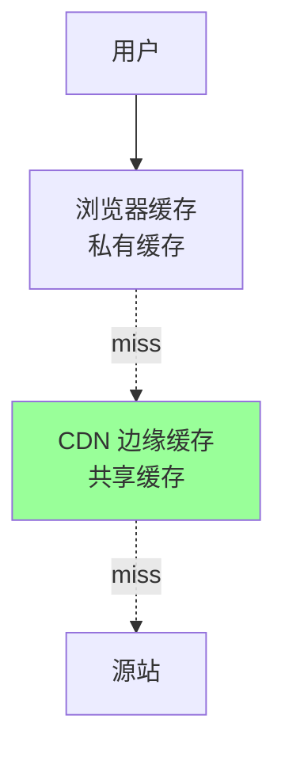
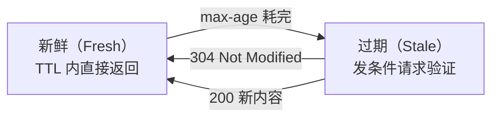
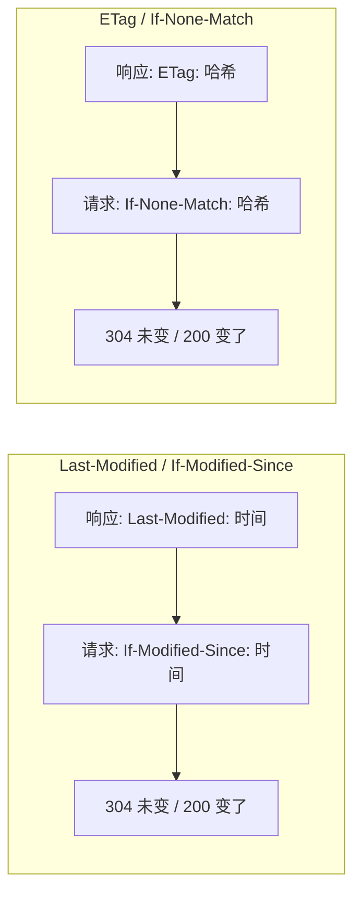
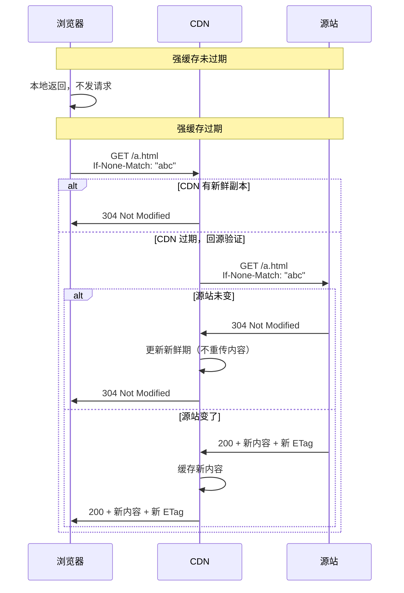
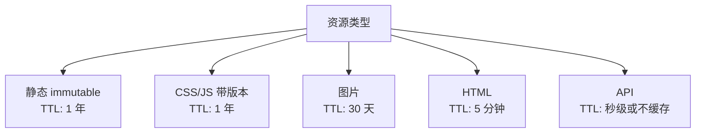
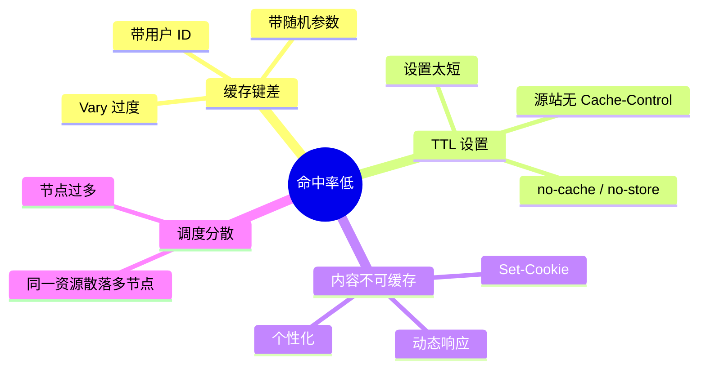
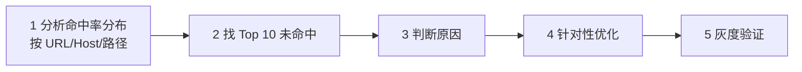
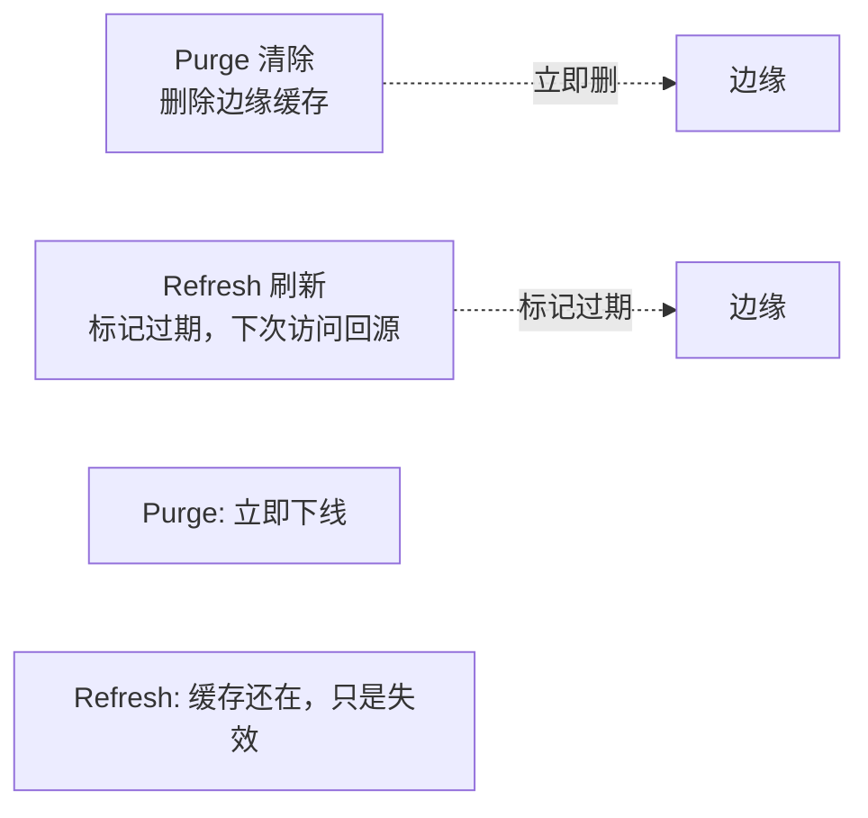

# CDN · 缓存策略

> Cache-Control / 协商缓存 / 缓存分层 / 缓存键 / 命中率优化 / 缓存刷新

## 一、HTTP 缓存基础

### 1.1 两类缓存



- **浏览器缓存**（private）：只服务单用户
- **CDN 缓存**（public shared）：服务所有用户

### 1.2 缓存的两个阶段



- **强缓存**：新鲜期内直接本地返回，不发请求
- **协商缓存**：过期后发条件请求问源站"内容还一样吗？"

## 二、强缓存：Cache-Control

### 2.1 核心指令

```
Cache-Control: public, max-age=3600, s-maxage=7200
```

| 指令 | 含义 |
| --- | --- |
| `public` | 允许浏览器 + CDN 缓存 |
| `private` | 只允许浏览器缓存（CDN 不缓存） |
| `max-age=N` | 新鲜时间（秒），浏览器看这个 |
| `s-maxage=N` | 共享缓存（CDN）看这个，优先级高于 max-age |
| `no-cache` | 必须每次问源站（走协商缓存） |
| `no-store` | 完全不缓存（敏感数据） |
| `must-revalidate` | 过期必须重新验证，不许用 stale |
| `immutable` | 内容永不变，浏览器刷新也不发请求 |

### 2.2 典型配置

```
# 图片、视频、静态资源（长期不变）
Cache-Control: public, max-age=31536000, immutable

# HTML（要及时更新）
Cache-Control: public, max-age=300, s-maxage=600

# API 接口（敏感、动态）
Cache-Control: private, no-cache

# 登录态 / 订单详情（绝不缓存）
Cache-Control: no-store
```

### 2.3 max-age vs s-maxage

```
Cache-Control: max-age=60, s-maxage=3600
```

- 浏览器缓存 60 秒（避免用户看到老内容过久）
- CDN 缓存 3600 秒（大幅降低回源）

**CDN 缓存可以比浏览器更久**，因为 CDN 能统一刷新，浏览器不行。

### 2.4 Expires（旧）vs Cache-Control（新）

```
Expires: Wed, 21 Oct 2026 07:28:00 GMT
Cache-Control: max-age=3600
```

- Expires 是 HTTP/1.0，绝对时间（客户端时钟不准就出问题）
- Cache-Control 是 HTTP/1.1，相对时间（推荐）
- **两者并存时 Cache-Control 优先**

## 三、协商缓存

### 3.1 两套机制



### 3.2 Last-Modified

```
# 首次
> GET /a.html
< 200 OK
< Last-Modified: Wed, 21 Oct 2026 07:00:00 GMT

# 后续（过期后验证）
> GET /a.html
> If-Modified-Since: Wed, 21 Oct 2026 07:00:00 GMT
< 304 Not Modified
```

**问题**：
- 只精确到**秒**，1 秒内多次修改判不出
- 内容没变但 mtime 变了（如部署） → 误判为变了
- CDN 集群时间不同步 → 异常

### 3.3 ETag（推荐）

```
# 首次
> GET /a.html
< 200 OK
< ETag: "abc123"  (通常是内容哈希)

# 后续
> GET /a.html
> If-None-Match: "abc123"
< 304 Not Modified
```

**优势**：
- 基于内容，精确
- 无时钟问题
- 支持强弱 ETag（`W/` 前缀为弱 ETag）

### 3.4 强 vs 弱 ETag

```
ETag: "abc123"       # 强：字节完全相同
ETag: W/"abc123"     # 弱：语义相同（允许压缩/gzip 差异）
```

CDN 一般用**弱 ETag**，避免因压缩变体判不同。

### 3.5 协商缓存的流程图



**304 的收益**：只回 header，不回 body，节省带宽。

## 四、缓存键设计（CDN 核心）

### 4.1 默认缓存键

```
Cache Key = host + path + query_string
```

```
https://cdn.example.com/img/a.jpg?v=1&uid=123
↓
key = cdn.example.com/img/a.jpg?v=1&uid=123
```

**问题**：`uid=123` 每个用户不同 → 缓存键无穷多 → 命中率为 0。

### 4.2 缓存键优化

**原则**：**无关参数不进缓存键**。

```
# 配置 CDN 忽略参数
ignore_query: [uid, utm_source, utm_medium, _t, __rnd]

# 或：完全忽略 query
ignore_all_query: true

# 或：只保留指定参数
keep_query: [v, size]
```

示例：
```
https://cdn.example.com/img/a.jpg?v=1&uid=123&_t=1700000000
↓
key = cdn.example.com/img/a.jpg?v=1   # 只保留 v
```

### 4.3 按 Header 变化缓存（Vary）

```
Vary: Accept-Encoding, User-Agent
```

CDN 会为每个 Vary 头的不同值存一份缓存。

| Vary 值 | 场景 | 风险 |
| --- | --- | --- |
| Accept-Encoding | gzip/br 分开缓存 | 低 |
| Accept-Language | 多语言 | 中 |
| User-Agent | PC/Mobile 分版本 | 高（UA 上千种） |
| Cookie | 个性化 | 极高（每用户一份） |

**慎用 Vary: Cookie / User-Agent**，否则命中率爆炸。

### 4.4 按设备分缓存

不要用 Vary: User-Agent，而是：

```
# CDN 识别设备 → 归一化
User-Agent: iPhone xxx → device=mobile
User-Agent: Chrome Windows → device=desktop

# 缓存键加上 device
key = host + path + ?device=mobile
```

只两个 key（mobile / desktop），命中率高。

### 4.5 缓存键最佳实践

```
□ 过滤掉营销参数（utm_*、_t、__rnd）
□ 用户 ID / 会话 ID 绝不进缓存键
□ 慎用 Vary，优先归一化
□ 静态资源用版本号 query（a.jpg?v=2）
□ 动态页面按设备、地域归一化
□ 统计参数走客户端上报而非 URL
```

## 五、缓存分层与 TTL 策略

### 5.1 分层 TTL



| 资源 | TTL 推荐 | 更新方式 |
| --- | --- | --- |
| JS/CSS（带 hash） | 1 年 | 文件名带 hash，变更即新 URL |
| 图片/视频 | 30 天 | 改文件名或刷新 |
| HTML | 5 分钟 | 依赖频率 |
| RSS/Feed | 10 分钟 | 定时刷新 |
| API | 0-60 秒 | 按需 |

### 5.2 边缘 vs 父层 TTL

```
Edge TTL: 1 hour     # 边缘节点过期
Parent TTL: 24 hours # 父层保留更久

边缘过期 → 问父层 → 父层还新鲜 → 不回源
```

**分层 TTL 可以大幅降低回源**。

### 5.3 Stale-While-Revalidate

```
Cache-Control: max-age=60, stale-while-revalidate=300
```

- 60 秒内新鲜
- 60-360 秒：返回旧的给用户（快），后台异步更新
- 360 秒后：等新内容

**效果**：用户永远不等，命中率保持高位。大厂视频/新闻网站常用。

## 六、命中率优化实战

### 6.1 命中率低的常见原因



### 6.2 优化步骤



### 6.3 常见优化手段

**手段 1：缓存键归一化**
```
/api/list?page=1&uid=123&_t=xxx
→ 去 uid / _t
→ /api/list?page=1
命中率从 0 → 80%
```

**手段 2：延长 TTL**
```
图片: max-age=3600 → max-age=2592000 (30 天)
命中率从 60% → 95%
```

**手段 3：开启 Stale-While-Revalidate**
```
防止过期瞬间全部回源
命中率波动从 ±15% → ±2%
```

**手段 4：预热**
```
新内容上线前推送到所有边缘节点
避免首次访问 MISS
```

**手段 5：合并请求（Request Coalescing）**
```
同一资源并发 100 个请求 MISS
CDN 合并成 1 次回源
回源带宽降 100 倍
```

## 七、缓存刷新

### 7.1 为什么要刷新

- 内容更新（但 URL 不变）
- 误缓存了错误内容
- 合规要求立即下线

### 7.2 两种方式



| | Purge | Refresh |
| --- | --- | --- |
| 操作 | 立即删除 | 标记为过期 |
| 适合 | 下线 / 错内容 | 版本更新 |
| 生效 | 1-30 秒 | 1-5 分钟 |
| 成本 | 高（全网广播） | 中 |

### 7.3 刷新粒度

```
- URL 级：/img/a.jpg                 # 精确
- 目录级：/img/                      # 批量
- 匹配规则：/img/*.jpg               # 通配
- 整站：/*                           # 慎用
```

整站刷新 = **回源风暴**，要谨慎。

### 7.4 最佳实践

**带版本号的 URL**（推荐）：
```
a.v1.jpg → 改动 → a.v2.jpg（新 URL，自动 MISS）
```

**优点**：不用刷新，浏览器和 CDN 都天然获取新内容。

**缺点**：需要业务改 URL 引用。

## 八、预热

### 8.1 为什么要预热

```
活动开始前 → 新资源上线 → 用户蜂拥 → 全部 MISS → 源站打爆
```

### 8.2 预热方式

**被动预热**（用户访问触发，不推荐活动场景）：
```
用户请求 → 边缘 MISS → 回源 → 缓存
```

**主动预热**（推荐）：
```
运营提供 URL 列表 → CDN API 批量预热 → 
各边缘节点主动回源拉取 → 缓存就绪
```

### 8.3 预热的注意

- 预热自己也是回源请求，会打源站
- 大量 URL 要限速、分批
- 预热到**所有边缘节点** vs **热点节点**
- 视频等大文件预热耗时长，提前 N 小时准备

### 8.4 预热 API 示例（阿里云）

```
POST /api/cdn/preload
{
  "urls": [
    "https://cdn.example.com/a.jpg",
    "https://cdn.example.com/b.jpg"
  ],
  "area": "all"
}
```

## 九、大厂缓存策略对比

| 场景 | Cloudflare | 阿里云 | Fastly |
| --- | --- | --- | --- |
| 缓存键自定义 | Page Rules | 缓存配置 | VCL 编程 |
| Stale-While-Revalidate | ✅ | ✅ | ✅ |
| 预热 | API | API + 控制台 | API |
| 刷新粒度 | URL / 整站 | URL / 目录 / 整站 | URL / 正则 |
| 实时配置生效 | 秒级 | 分钟级 | < 1 秒 |
| 标签（Surrogate-Key） | ✅ | 部分 | ✅（强项） |

**Surrogate-Key**（Fastly 特色）：给响应打标签，刷新时按标签批量清除。
```
响应头: Surrogate-Key: article-123 user-456

PURGE key=article-123 → 所有相关缓存清空
```

## 十、典型坑

### 坑 1：带 Cookie 的响应不缓存

源站返回 `Set-Cookie`，CDN 默认不缓存（怕泄漏其他用户）。

**修复**：静态资源源站不要返 Cookie，或 CDN 配置"忽略 Set-Cookie"。

### 坑 2：HTML 缓存太久

改了内容 1 小时后用户还看老的。

**修复**：HTML `max-age=300`，依赖静态资源带 hash。

### 坑 3：刷新生效慢

Purge 10 分钟后还没生效。

**修复**：
- 边缘节点多，全网广播要时间
- 用 API 查刷新状态
- 紧急场景配合 Surrogate-Key

### 坑 4：API 忘记配 Cache-Control

源站没返回 Cache-Control，CDN 用默认 TTL 缓存了 API → 用户看到老数据。

**修复**：API 必须显式 `Cache-Control: no-store` 或 `private, max-age=0`。

### 坑 5：304 写错 ETag

每次响应 ETag 变（比如带时间戳），协商缓存失效。

**修复**：ETag 基于内容哈希，不是时间。

### 坑 6：Vary 头污染

配 `Vary: User-Agent` 后命中率从 90% → 20%。

**修复**：用设备归一化替代 Vary。

### 坑 7：源站缓存击穿

热点资源过期瞬间 100 个边缘同时回源。

**修复**：
- 开启请求合并（CDN 功能）
- 源站加本地缓存（Redis）
- 开 Stale-While-Revalidate

## 十一、面试高频题

**Q1：强缓存 vs 协商缓存？**

| | 强缓存 | 协商缓存 |
| --- | --- | --- |
| 指令 | Cache-Control: max-age / Expires | ETag / Last-Modified |
| 流程 | 不发请求 | 发请求问源站 |
| 状态码 | 200 (from cache) | 304 / 200 |
| 优先级 | 强缓存优先 | 强缓存过期后走协商 |

**Q2：max-age 和 s-maxage 区别？**

- max-age 给浏览器看
- s-maxage 给 CDN/代理看
- CDN 上 s-maxage 覆盖 max-age

**Q3：ETag vs Last-Modified 哪个好？**

**ETag 好**：
- 基于内容，精确
- 无时钟问题
- 1 秒内多次改也能区分

Last-Modified 只精确到秒。

**Q4：CDN 缓存键怎么设计？**

`host + path + query_string` 默认，但要：
- 过滤无关参数（uid / utm / 随机数）
- 慎用 Vary（改用归一化）
- 设备归一化到 mobile/desktop

**Q5：Stale-While-Revalidate 解决什么？**

缓存过期瞬间全部回源的问题。返回旧的给用户（快），后台异步更新。

**Q6：怎么优化 CDN 命中率？**

- 缓存键归一化
- 延长 TTL
- 开启 SWR
- 预热热点
- 请求合并

**Q7：Purge vs Refresh？**

- Purge：立即删
- Refresh：标记过期，下次回源

**Q8：预热怎么做？**

运营提供 URL 列表 → CDN API 批量预热 → 边缘主动拉取缓存。

注意限速 + 分批，避免预热自己打源站。

**Q9：为什么响应带 Set-Cookie 的 CDN 默认不缓存？**

怕把 A 用户的 Cookie 发给 B 用户。

**修复**：静态资源源站别返 Cookie，或配置 CDN 忽略。

**Q10：缓存击穿怎么防？**

热点过期瞬间 N 个请求回源 → 源站崩。

- CDN 开启请求合并
- 源站本地缓存
- Stale-While-Revalidate

## 十二、面试加分点

- 区分**强缓存**（不发请求）vs **协商缓存**（发请求验证）
- **CDN s-maxage 可以比浏览器 max-age 久**，CDN 刷新统一可控
- **ETag 优于 Last-Modified**（精确 + 无时钟问题）
- 缓存键**默认含 query_string**，必须归一化
- 用**设备归一化**替代 `Vary: User-Agent`
- **Stale-While-Revalidate** 是命中率稳定的关键
- **带 hash 的 URL**（a.hash.jpg）避免刷新
- **请求合并**防缓存击穿
- 静态资源**TTL 长 + 带版本**，HTML **TTL 短**
- Fastly 的 **Surrogate-Key** 标签刷新是业界最佳实践
