# CDN · 调度与回源

> 智能 DNS / GSLB / HTTP DNS / 302 调度 / Anycast / 回源策略 / 跨网优化

## 一、调度的目标

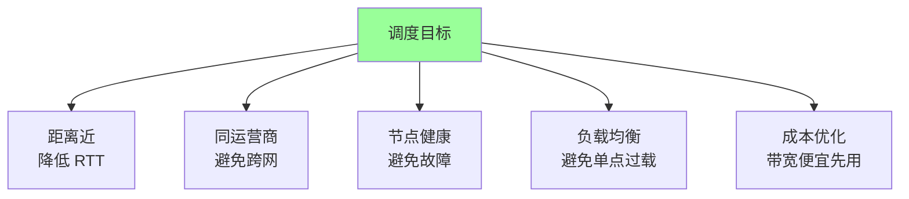

理想情况：把每个用户精准导向**距离最近、同运营商、健康、负载低**的边缘节点。

## 二、智能 DNS（GSLB）

### 2.1 标准 DNS 流程

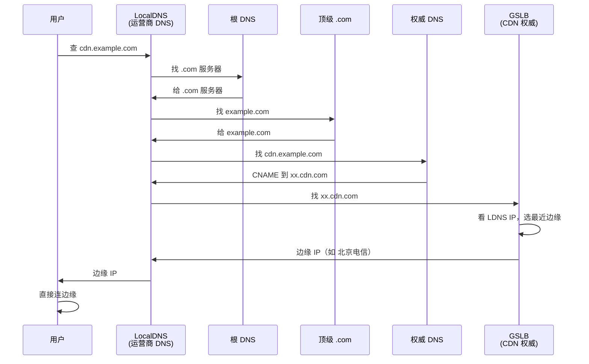

**关键**：CDN GSLB 看 **LDNS 的 IP**（不是用户 IP）来推断位置。

### 2.2 CNAME 接入

```
用户配置:
  cdn.example.com  CNAME  example.com.cdn.aliyun.com.

CDN 配置（GSLB 控制）:
  example.com.cdn.aliyun.com  → 动态返回边缘 IP
```

**为什么用 CNAME 不用 A 记录？**
- A 记录指定 IP，运维改不了
- CNAME 让 CDN 厂商完全控制返回结果（可动态切换）

### 2.3 GSLB 的判断维度

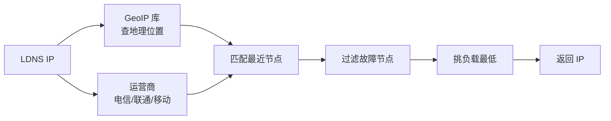

| 维度 | 数据来源 |
| --- | --- |
| 地理位置 | GeoIP 库（IP2Location / 自建） |
| 运营商 | IP 段映射 |
| 节点容量 | 实时心跳 |
| 节点健康 | 探测 + 业务上报 |
| 链路质量 | 拨测系统 |

### 2.4 LDNS 推断不准的问题

```
[场景] 上海用户用了 8.8.8.8（Google DNS）
         CDN 看到 LDNS = 8.8.8.8（美国）
         给用户返回美国节点 → 极慢
```

**解决方案**：
1. **EDNS Client Subnet (ECS)**：LDNS 查询时带上用户子网信息（RFC 7871）
2. **HTTP DNS**（手机 App 主流方案）
3. 用本地运营商 DNS（不要用 8.8.8.8 / 1.1.1.1）

### 2.5 EDNS Client Subnet (ECS)

```
传统 DNS 查询: cdn.example.com?
ECS 查询:    cdn.example.com? client_subnet=180.156.0.0/24

CDN 看到真实用户网段，调度更精准
```

**支持情况**：
- 支持：Google DNS、阿里 DNS、CDN 大厂
- 不支持：部分老旧 LDNS、隐私优先 DNS

### 2.6 DNS TTL 设置

```
查询: cdn.example.com
返回: 1.2.3.4   TTL=60
```

| TTL | 优劣 |
| --- | --- |
| 短（60-300s） | 故障切换快，但 DNS 压力大 |
| 长（3600s+） | DNS 压力小，但故障切换慢 |

**CDN 通常用 60-300s**，权衡灵活性和性能。

## 三、HTTP DNS（移动场景必备）

### 3.1 为什么 LocalDNS 不够用

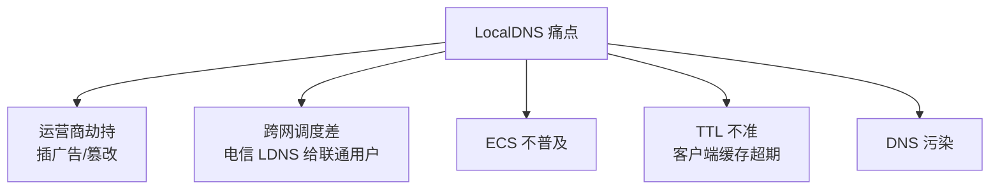

### 3.2 HTTP DNS 工作原理

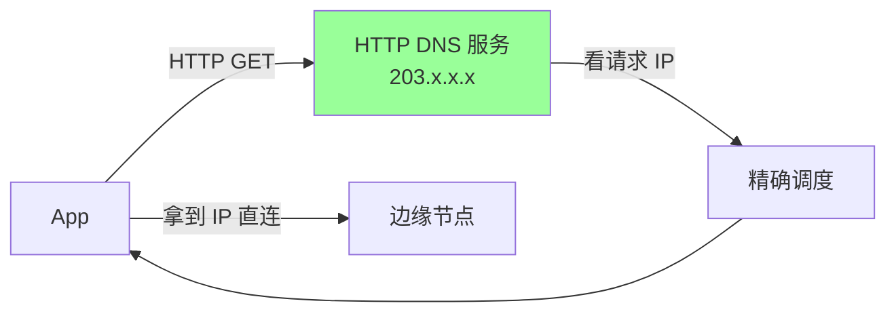

```
GET https://203.107.1.1/d?host=cdn.example.com
返回: {"ips": ["1.2.3.4", "5.6.7.8"], "ttl": 60}
```

**关键差异**：
- 看的是**用户的真实出口 IP**（不是 LDNS）
- 走 HTTP/HTTPS，不被劫持
- 客户端控制缓存 TTL
- 支持 IP 多选 + 故障切换

### 3.3 HTTP DNS 的部署

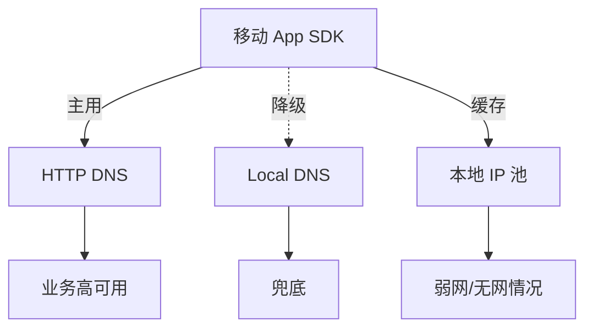

**多级降级**：
1. 优先 HTTP DNS
2. 失败 → 用 Local DNS
3. 都失败 → 用本地缓存的旧 IP

### 3.4 HTTP DNS 大厂方案

| 厂商 | 服务 | 特点 |
| --- | --- | --- |
| 阿里云 | HTTPDNS | 免费 + 灵活 |
| 腾讯云 | HTTPDNS | App 集成方便 |
| Cloudflare | 1.1.1.1 | 全球 Anycast |
| 自建 | 大厂自研 | 完全控制 |

阿里、字节、腾讯、美团 App 内部都自建 HTTP DNS。

## 四、302 调度

### 4.1 原理

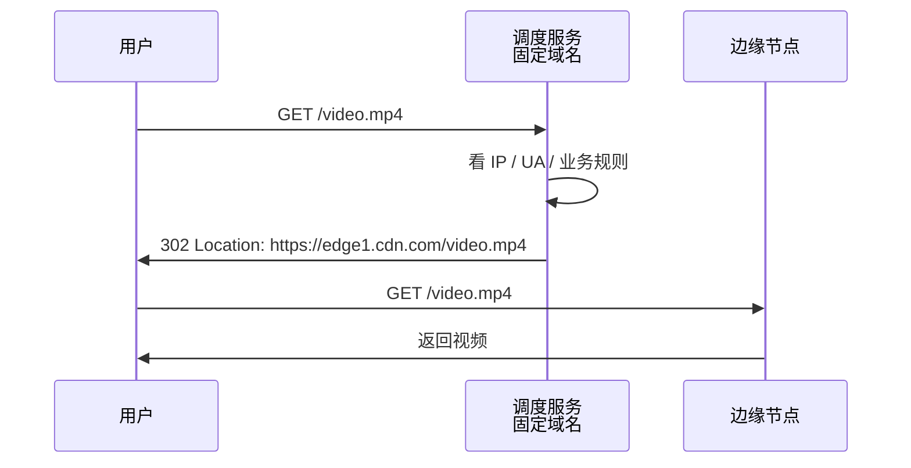

### 4.2 适用场景

- **视频点播 / 直播**：每个用户调度到不同边缘（按地理 + 负载）
- **大文件下载**：动态选最快线路
- **A/B 测试**：按用户灰度

### 4.3 优劣

| 优 | 缺 |
| --- | --- |
| 调度精准（看到用户真实 IP） | 多一次请求 |
| 灵活（运行时决策） | 增加 RTT |
| 容易做灰度 | 不适合小文件 |

短资源用 DNS 调度，**大资源用 302 调度**。

## 五、Anycast 调度

### 5.1 原理

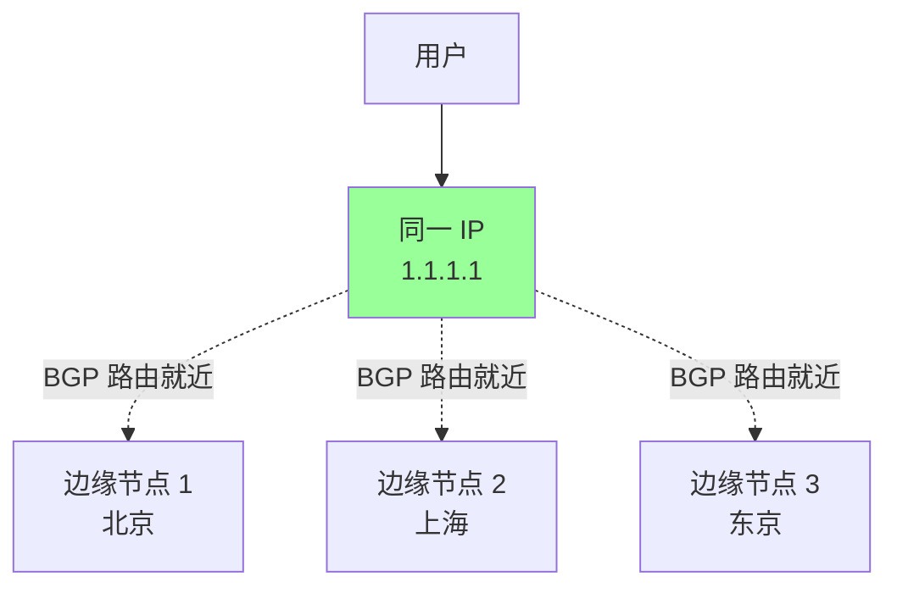

**核心**：多个节点广播**同一个 IP**，BGP 路由把用户导向最近节点。

### 5.2 与 DNS 调度对比

| | DNS | Anycast |
| --- | --- | --- |
| 调度依据 | LDNS IP | BGP 路由 |
| 精度 | 中（LDNS 不准） | 高（按物理路由） |
| 切换速度 | 慢（DNS 缓存） | 秒级（BGP 收敛） |
| 适合 | 大多数场景 | 全球高性能 |
| 代表 | 阿里/腾讯 | Cloudflare、Google |

### 5.3 Cloudflare 的 Anycast

Cloudflare 全球 300+ 节点共享同一组 IP，用户请求自动路由到最近节点：
- 攻击流量也分散到全球（自带 DDoS 防护）
- 节点故障 BGP 自动切换
- 但需要自有 IP + 跨多家运营商签约（成本高）

国内厂商多用 DNS 调度，Anycast 较少（国内 BGP 复杂）。

## 六、回源策略

### 6.1 回源场景

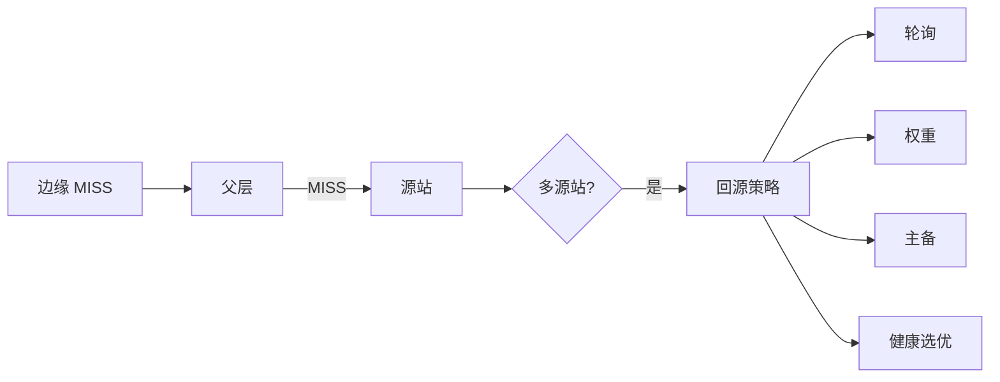

### 6.2 多源站策略

| 策略 | 说明 | 适合 |
| --- | --- | --- |
| **轮询** | 依次回源每个源 | 多源等价 |
| **权重** | 按权重分配 | 主源强备源弱 |
| **主备** | 主源失败才用备 | 容灾 |
| **健康优先** | 自动剔除不健康源 | 通用 |
| **就近回源** | 父层选最近源 | 多地源站 |

### 6.3 回源协议

```
回源支持: HTTP / HTTPS
HTTPS 回源: 安全但慢（多次握手）
HTTP 回源: 快但不安全
```

**最佳实践**：
- 边缘 → 用户：HTTPS
- 边缘 → 父层：CDN 私网（快）
- 父层 → 源站：HTTPS（公网）或 HTTP（VPC 直连）

### 6.4 跨地域回源

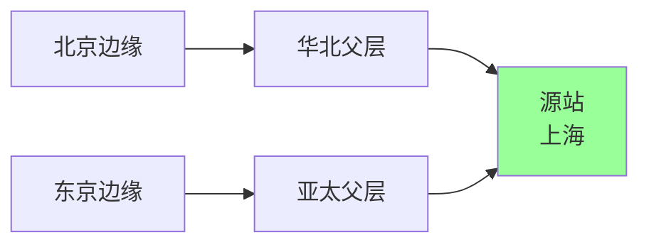

跨洋回源走 CDN 私网，比公网快 3-10 倍。

### 6.5 回源 Host

```
用户访问: cdn.example.com
回源时:   Host: 改成什么？
```

| 选项 | 用途 |
| --- | --- |
| 保持 cdn.example.com | 源站按 CDN 域名分流 |
| 改成 origin.example.com | 源站只识别原始域名 |
| 自定义 | 多业务共享源站 |

### 6.6 回源 Range（分片回源）

大文件用户只看一段（如视频拖动）：

```
用户请求 Range: bytes=0-1048575       (前 1MB)
CDN 回源 Range: bytes=0-1048575       (只拉 1MB)
```

**好处**：节省源站带宽，加快首次响应。

## 七、回源风暴

### 7.1 什么是回源风暴

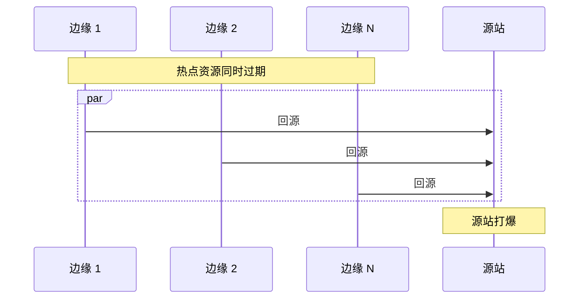

### 7.2 防护手段

#### 1. 父层收敛

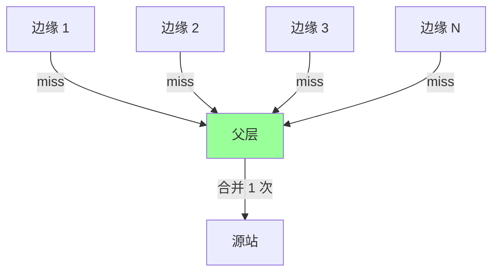

**N 个边缘 miss → 1 次回源**，源站压力降 N 倍。

#### 2. 请求合并（Request Coalescing）

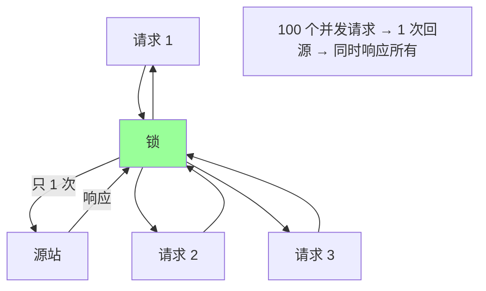

边缘节点开启请求合并：同 URL 的并发请求只回源一次。

#### 3. Stale-While-Revalidate

```
缓存过期 → 立即返回旧的 → 后台异步回源
```

用户不等，回源压力错峰。

#### 4. 限速回源

```
对源站每秒最多 100 次回源
超过 → 用旧的 / 排队
```

#### 5. 主动预热

```
活动开始前推送热点 URL 到边缘
活动开始 → 全 HIT → 0 回源
```

## 八、跨网与多线 BGP

### 8.1 跨网慢的本质

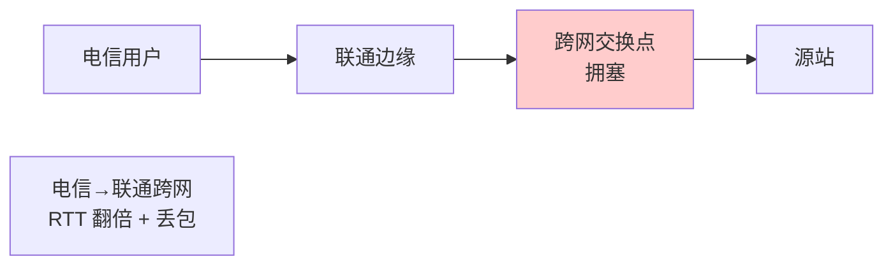

国内电信、联通、移动三大运营商互联点拥塞 → 跨网慢。

### 8.2 多线 BGP 节点

```
节点同时接入 电信 + 联通 + 移动 → 任何用户都同网
```

成本：BGP IP + 多运营商带宽（贵）。

### 8.3 多线 vs 单线

| | 单线节点 | 多线 BGP |
| --- | --- | --- |
| 成本 | 低 | 高 |
| 性能 | 跨网慢 | 全部直连 |
| 调度 | 必须按运营商 | 任何用户都好 |
| 适合 | 边缘小节点 | 核心节点 |

CDN 边缘**多线节点比例**是核心竞争力。

## 九、健康检查

### 9.1 探测方式

```
- TCP 探测：端口连通
- HTTP 探测：返回 200
- 业务探测：特定 URL 返回正确
- 拨测：第三方拨测工具
```

### 9.2 摘除策略

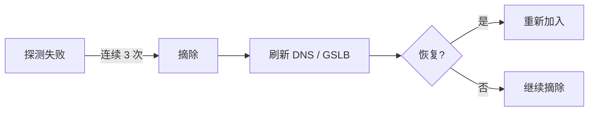

### 9.3 探测维度

- 节点存活
- 节点容量水位
- 链路质量（延迟 / 丢包）
- 业务异常率

## 十、调度的灰度发布

### 10.1 业务灰度

```
新功能上线 → 先调度 1% 用户到新版本节点
→ 监控指标 → 逐步扩大
```

### 10.2 节点灰度

```
新节点上线 → 先承担 5% 流量
→ 跑 24 小时 → 没问题 → 扩到 50% → 100%
```

### 10.3 跨地域故障切换

```
上海机房故障 → 调度切到杭州 → 主动 Purge 上海缓存
```

## 十一、典型坑

### 坑 1：迷信 DNS 调度

LDNS 不准导致跨地域返回 → 用 ECS / HTTP DNS 修复。

### 坑 2：DNS TTL 太长

故障切换 1 小时还有用户访问坏节点 → TTL 改 60s。

### 坑 3：GSLB 配置有问题

误把美国节点配成北京 → 调度灾难。

**修复**：自动化测试 + 拨测。

### 坑 4：回源没防风暴

热点过期源站秒崩 → 开请求合并 + SWR + 父层收敛。

### 坑 5：多源站无健康检查

主源挂了流量没切走 → 用户大面积 5xx。

**修复**：CDN 配主备 + 自动健康检查。

### 坑 6：跨地域回源不优化

每次都走公网 → 慢 → 用 CDN 私网。

### 坑 7：HTTP DNS 没降级

HTTP DNS 故障 App 全挂 → 必须有 LocalDNS 兜底。

## 十二、面试高频题

**Q1：CDN 怎么把用户调度到最近节点？**

智能 DNS（GSLB）：
- 看 LDNS IP 推断位置
- 选最近、负载低的节点 IP

精度问题用 ECS / HTTP DNS 改善。

**Q2：HTTP DNS 解决什么问题？**

LocalDNS 痛点：劫持、跨网调度差、ECS 不普及。

HTTP DNS 走 HTTP，看用户真实 IP，不被劫持，App 主流方案。

**Q3：DNS 调度 vs 302 调度？**

| | DNS | 302 |
| --- | --- | --- |
| 时机 | 域名解析 | 请求时 |
| 精度 | 中 | 高 |
| 开销 | 低 | 多一次 RTT |
| 适合 | 通用 | 视频/大文件 |

**Q4：Anycast 是什么？**

多个节点广播同一 IP，BGP 路由把用户导向最近节点。

代表：Cloudflare（全球 300+ 节点共享 IP）。

**Q5：CDN 的 LDNS 推断不准怎么办？**

- ECS（EDNS Client Subnet）：DNS 查询带用户子网
- HTTP DNS：直接看用户出口 IP
- 推用户用本地运营商 DNS

**Q6：什么是回源风暴？怎么防？**

热点资源过期瞬间 N 个边缘同时回源 → 源站打爆。

防护：
- 父层收敛
- 请求合并
- SWR
- 限速回源
- 主动预热

**Q7：父层节点的作用？**

收敛回源，把 N 个边缘的 miss 收敛成 1 次回源，做"源站盾"。

**Q8：多线 BGP 节点为什么贵？**

需要 BGP IP + 多运营商带宽 + 复杂路由配置。

但能解决跨网慢的痛点，CDN 核心节点必备。

**Q9：CDN 调度的灰度怎么做？**

- 业务灰度：新版本 1% → 5% → 50% → 100%
- 节点灰度：新节点 5% → 50% → 100%
- 故障切换：自动 + 拨测验证

**Q10：CNAME 接入相比 A 记录的好处？**

A 记录指定 IP，固定。

CNAME 让 CDN 控制返回结果，可动态调度（这是 CDN 接入的标准做法）。

## 十三、面试加分点

- 调度 = **GeoIP + 运营商 + 健康 + 负载** 多维度综合
- LDNS IP 不等于用户 IP，用 **ECS / HTTP DNS** 解决
- **HTTP DNS** 是移动 App 标配（避免劫持 + 精确调度）
- **Anycast** 是 Cloudflare 的杀手锏，国内厂商少用（BGP 复杂）
- **DNS 调度小资源 + 302 调度大资源** 组合拳
- 父层是**源站盾**，N → 1 收敛回源
- **请求合并 + SWR + 父层** 三板斧防回源风暴
- 跨网用**多线 BGP**，跨地域用**CDN 私网回源**
- DNS TTL **60-300s** 平衡灵活性和性能
- HTTP DNS 必须有 **LocalDNS 降级** 兜底
- 健康检查 + 灰度发布 + 自动故障切换是 CDN 高可用基础
