# CDN · 协议优化

> HTTP/1.1 → HTTP/2 → HTTP/3 / TLS 优化 / Brotli 压缩 / 分片并发 / Range / 连接复用

## 一、HTTP 协议演进总览

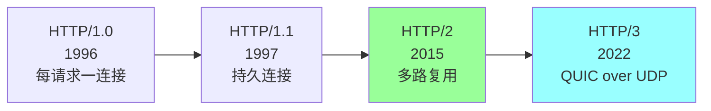

| 版本 | 传输 | 复用 | 头压缩 | 关键改进 |
| --- | --- | --- | --- | --- |
| HTTP/1.0 | TCP | 无 | 无 | 基础协议 |
| HTTP/1.1 | TCP | Pipeline（实质失败） | 无 | Keep-Alive |
| HTTP/2 | TCP + TLS | 多路复用 | HPACK | 二进制分帧 |
| HTTP/3 | QUIC + UDP | 多路复用 | QPACK | 0-RTT，无队头阻塞 |

## 二、HTTP/1.1 痛点

### 2.1 队头阻塞（HOL Blocking）

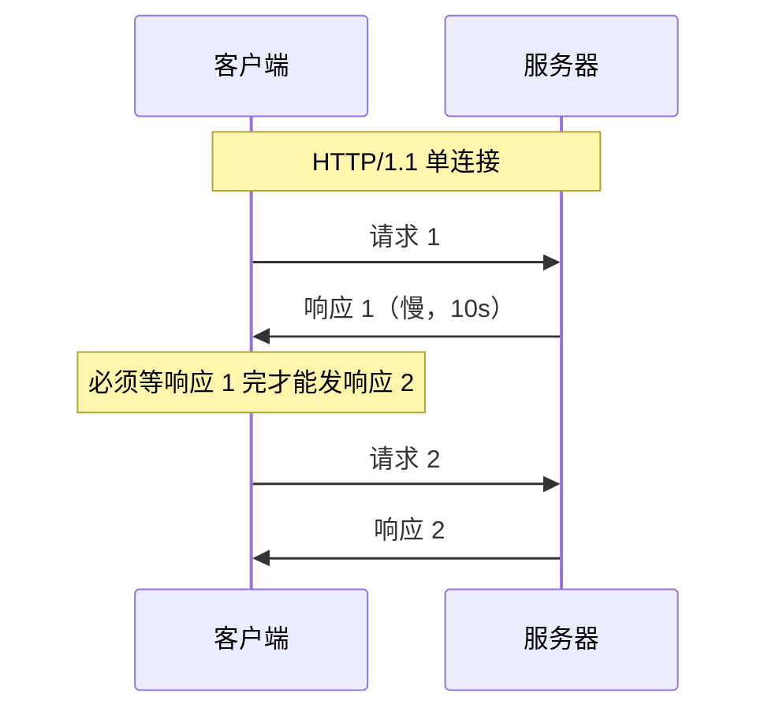

**问题**：单连接串行，慢请求堵后面。

### 2.2 浏览器解决方案：多连接

```
浏览器对同一域名最多开 6 个 TCP 连接
6 个并发 → 但仍是各自串行
```

每个连接还有 TCP 慢启动 + 三次握手 + TLS 握手开销。

### 2.3 域名分片（Domain Sharding）

```
img1.example.com  → 6 连接
img2.example.com  → 6 连接
img3.example.com  → 6 连接
合计 18 连接
```

**HTTP/1.1 时代的常见优化**，HTTP/2 后**反而是反模式**（破坏多路复用）。

## 三、HTTP/2

### 3.1 核心特性

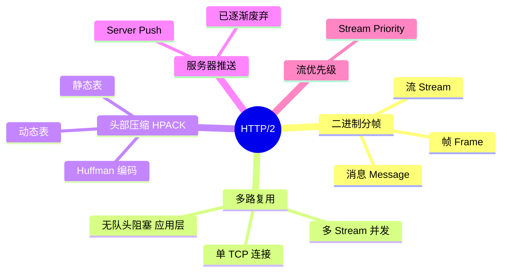

### 3.2 多路复用

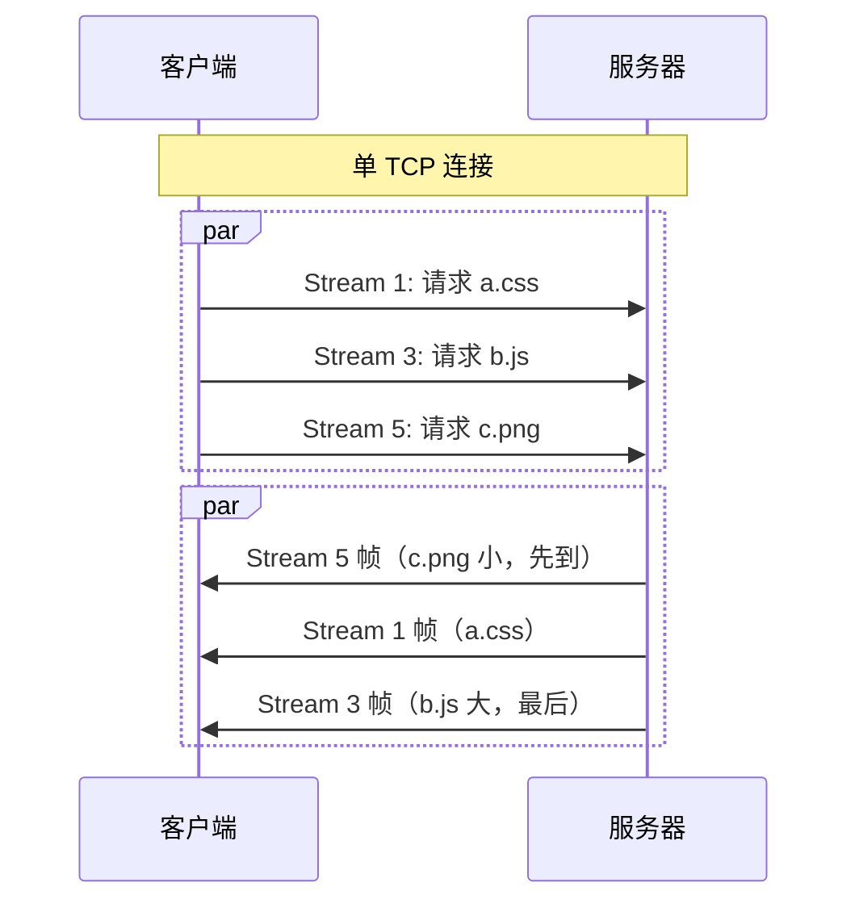

**核心**：多个流共享一个 TCP 连接，帧交错传输。

### 3.3 收益

| 指标 | HTTP/1.1 | HTTP/2 |
| --- | --- | --- |
| 连接数 | 6/域名 | 1/域名 |
| 并发请求 | 6 | 100+ |
| 头部开销 | 每次重复 | HPACK 压缩 |
| 首屏时间 | 慢 | 快 30-50% |

### 3.4 HPACK 头部压缩

```
首次请求:
  :method: GET
  :path: /index.html
  user-agent: Mozilla/5.0...
  cookie: sessionid=xxx
（约 500 字节）

后续请求（大部分头部走索引）:
  61 (索引到 :method: GET)
  62 (索引到 :path: /index.html)
  63 (索引到 user-agent)
  64 (索引到 cookie)
（约 30 字节）

压缩比 90%+
```

### 3.5 HTTP/2 的"假"队头阻塞

**应用层无队头阻塞**（多 Stream 并发）

**但 TCP 层仍有队头阻塞**：
```
TCP 包丢失 → TCP 层等重传 → 所有 Stream 都阻塞
```

弱网下 HTTP/2 反而比 HTTP/1.1 慢（多连接还能容忍丢包）。

**这是 HTTP/3 要解决的核心问题**。

### 3.6 启用 HTTP/2 的前提

```
1. 必须 HTTPS（Chrome/Firefox 强制）
2. 服务器/CDN 支持
3. 浏览器支持（>= 2015 年的都支持）
```

CDN 默认开 HTTP/2。

## 四、HTTP/3 与 QUIC

### 4.1 为什么需要 HTTP/3

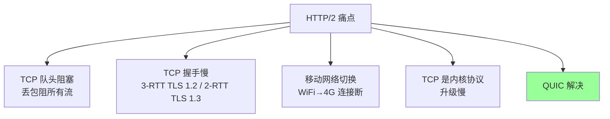

### 4.2 QUIC 是什么

```
QUIC = Quick UDP Internet Connections
基于 UDP + 在用户态实现可靠传输 + 内置 TLS 1.3
```

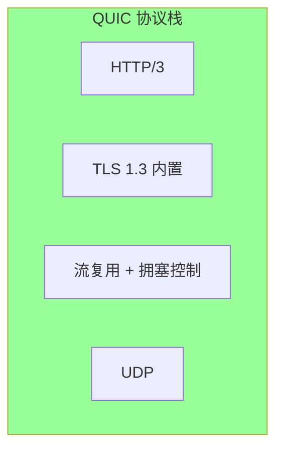

### 4.3 QUIC 三大优势

#### 优势 1：无队头阻塞

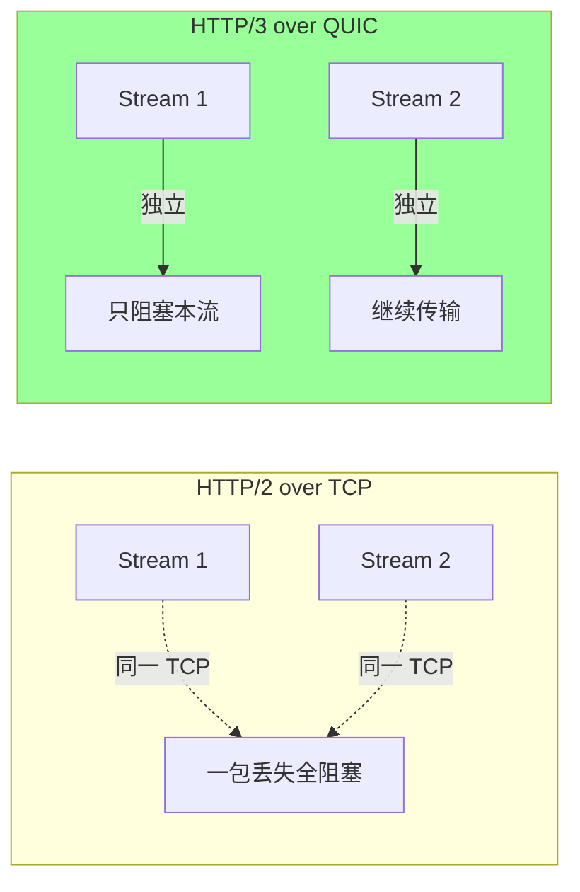

QUIC 每个 Stream 独立可靠，单包丢失只阻塞自己。

#### 优势 2：0-RTT / 1-RTT 握手

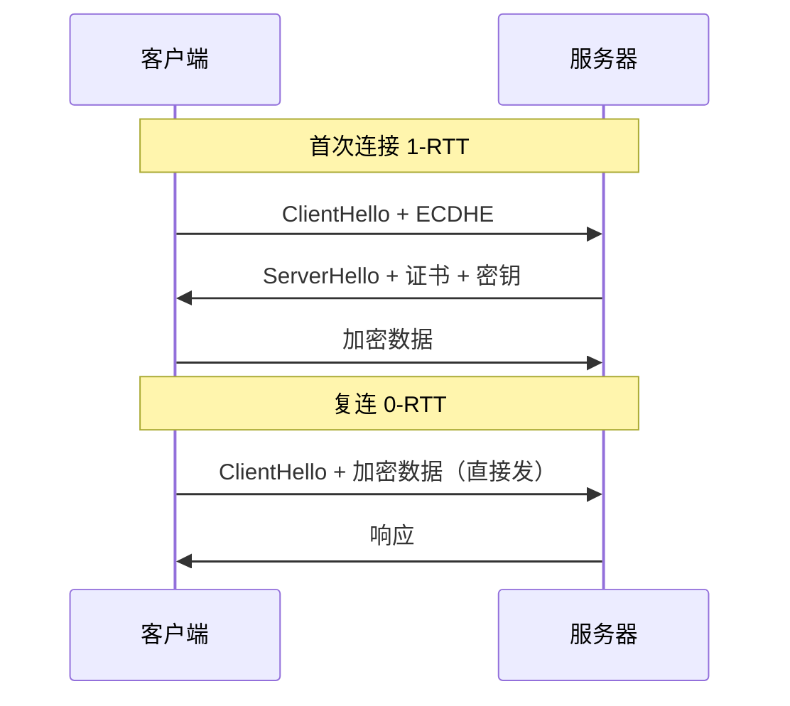

对比：TLS 1.2 over TCP 要 3-RTT（TCP 握手 1-RTT + TLS 握手 2-RTT）。

#### 优势 3：连接迁移（Connection Migration）

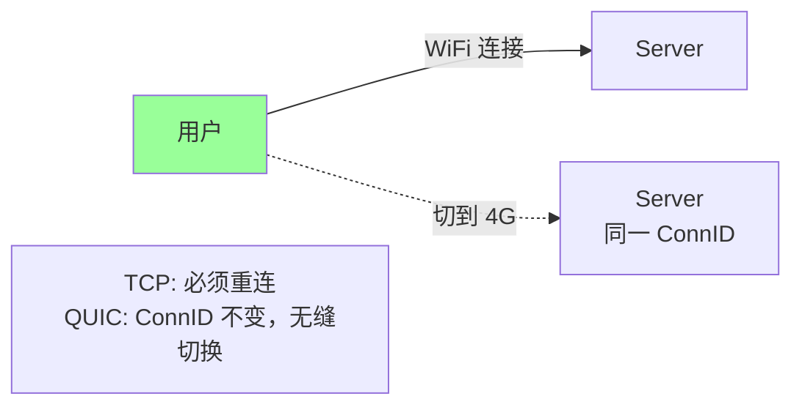

QUIC 用 **ConnectionID 标识连接**，IP 变了连接不断 → 移动场景体验飞跃。

### 4.4 QUIC 性能对比

| 场景 | HTTP/2 | HTTP/3 |
| --- | --- | --- |
| 弱网（5% 丢包） | 慢 50% | 快 30% |
| 移动切网 | 重连 | 无缝 |
| 首屏 | 1-RTT TLS 1.3 | 0-RTT |
| 跨国 | 慢 | 显著快 |

### 4.5 QUIC 的代价

```
- UDP 在很多防火墙被限速 / 丢弃
- 用户态实现 → CPU 开销高
- 协议升级慢（部分中间设备不识别）
- 调试工具少
```

### 4.6 部署现状（2026）

| 环境 | 部署 |
| --- | --- |
| 浏览器 | Chrome / Firefox / Safari 默认开 |
| Cloudflare | 100% 节点支持 |
| Google / YouTube | 全量上 |
| Facebook / Meta | 全量上 |
| Cloudflare / Fastly | 默认开 |
| 阿里云 / 腾讯云 CDN | 大部分支持 |
| 国内 CDN | 视频厂商主推 |

## 五、TLS 优化

### 5.1 TLS 握手开销

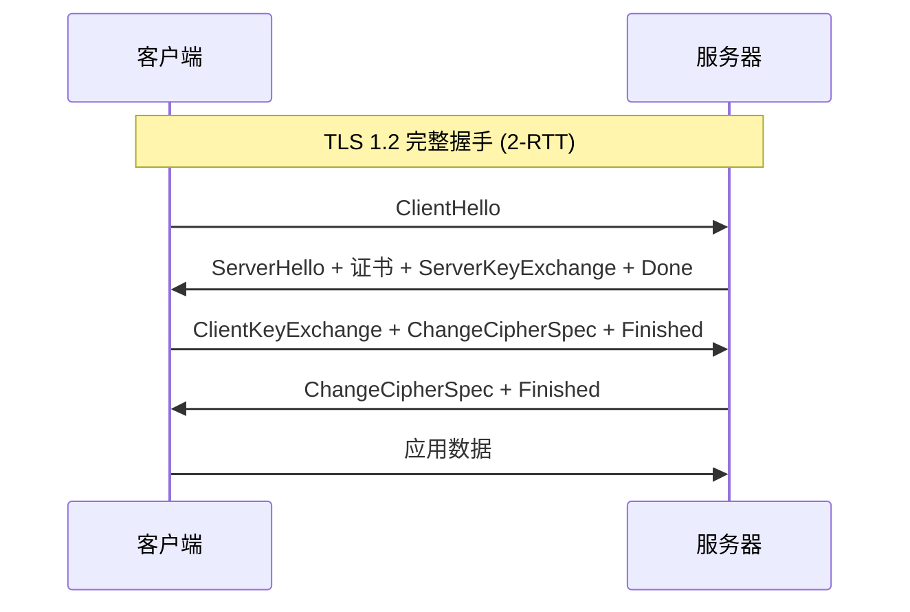

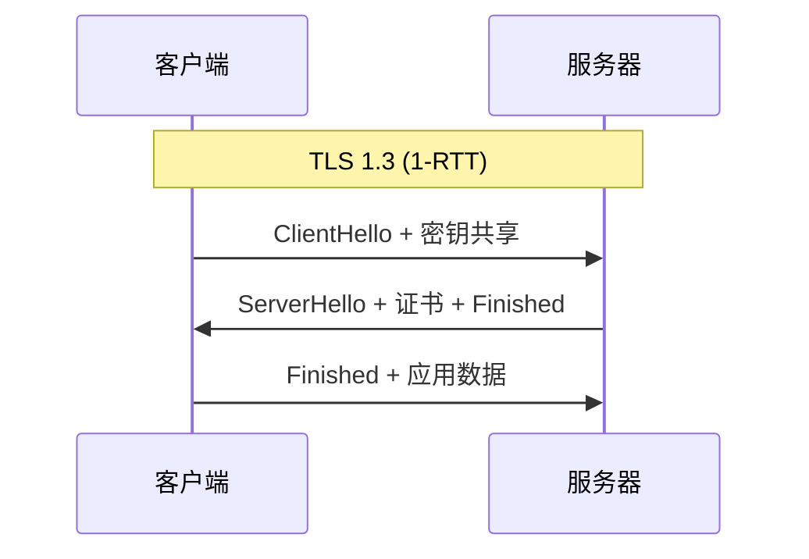

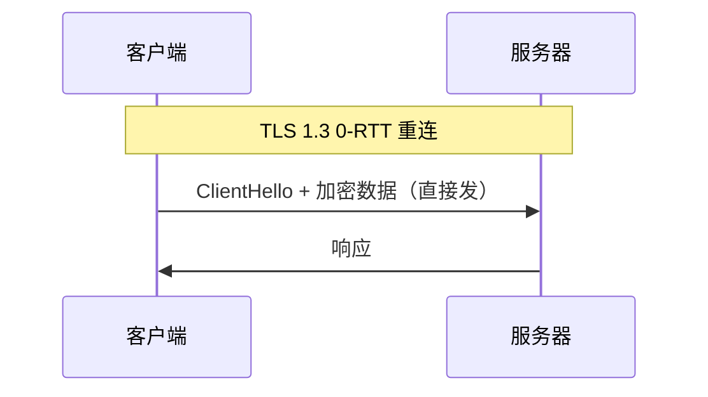

### 5.2 TLS 1.2 vs TLS 1.3

| | TLS 1.2 | TLS 1.3 |
| --- | --- | --- |
| 完整握手 | 2-RTT | 1-RTT |
| 重连 | Session Resumption 1-RTT | 0-RTT |
| 加密套件 | 复杂、有弱算法 | 精简、强制前向安全 |
| 性能 | 慢 | 快 50%+ |

**强烈推荐 TLS 1.3**，CDN 默认开。

### 5.3 OCSP Stapling

```
传统 OCSP: 浏览器单独查证书吊销状态 → 慢 + 隐私泄漏
OCSP Stapling: 服务器替浏览器查好，握手时一起发
```

CDN 默认开，节省 100-300ms。

### 5.4 Session Resumption

```
首次握手 → 服务器给 Session ID / Session Ticket
重连时 → 客户端发 ID/Ticket → 跳过完整握手
```

CDN 节点共享 Session 池，提高重连命中率。

### 5.5 SNI（Server Name Indication）

```
单 IP 多证书共享：
  https://a.com → SNI: a.com → 用 a.com 证书
  https://b.com → SNI: b.com → 用 b.com 证书
```

CDN 节点必备，否则要每个域名一个 IP。

### 5.6 TLS 性能优化清单

```
□ 升级 TLS 1.3
□ 开 OCSP Stapling
□ 开 Session Resumption
□ 选高性能加密套件（AES-GCM / ChaCha20）
□ 证书链精简（不含中间证书冗余）
□ ECDSA 证书替代 RSA（更快、密钥更短）
□ HSTS 强制 HTTPS
```

## 六、压缩

### 6.1 压缩算法对比

| 算法 | 压缩比 | 压缩速度 | 解压速度 | 浏览器支持 |
| --- | --- | --- | --- | --- |
| **gzip** | 中 | 快 | 快 | 全部 |
| **Brotli** | 高（比 gzip 高 15-25%） | 慢 | 快 | 现代浏览器 |
| **zstd** | 中-高 | 极快 | 极快 | Cloudflare 实验 |

### 6.2 Brotli 优势

```
HTML/CSS/JS:
  原始 100KB → gzip 30KB → Brotli 22KB
节省 25% 带宽

文本类压缩比 Brotli > gzip
```

### 6.3 启用 Brotli

```
# CDN 配置
content_encoding: brotli   # 优先 Brotli
fallback: gzip              # 不支持时降级
```

```
请求头: Accept-Encoding: br, gzip
响应头: Content-Encoding: br
```

### 6.4 不要压缩的内容

- 已压缩文件（图片 JPG/PNG/WebP / 视频 MP4 / 压缩包 zip）→ 越压越大
- 小文件 < 1KB（开销 > 收益）
- 二进制流

CDN 默认按 MIME 类型决定。

### 6.5 图片优化

```
原始 JPG → CDN 自动转 WebP (节省 25-35%) → AVIF (节省 50%)
按 Accept 头返回不同格式
```

CDN 厂商提供"图片处理"产品（阿里云 IMG / Cloudflare Image Resizing）。

## 七、连接复用

### 7.1 Keep-Alive

```
HTTP/1.1 默认开 Keep-Alive
连接复用，避免重复建连
```

```
Connection: keep-alive
Keep-Alive: timeout=60, max=100
```

### 7.2 边缘 ↔ 父层 ↔ 源站 长连接

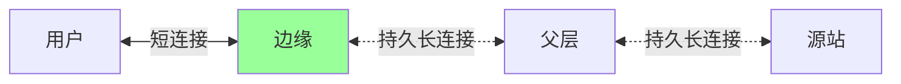

CDN 内部全部用长连接，避免每次回源都握手。

### 7.3 连接池管理

```
- 节点维护到上游的连接池
- 池大小: 按 QPS 估算
- 空闲超时: 60s
- 最大复用次数: 1000
```

## 八、其他协议优化

### 8.1 Range 请求

```
请求: Range: bytes=0-1048575     (前 1MB)
响应: 206 Partial Content
       Content-Range: bytes 0-1048575/10485760
```

**适用**：
- 视频拖动（按需加载）
- 断点续传
- 大文件分片下载

CDN 必须支持 Range 才能做视频。

### 8.2 分片并发下载

```
大文件 100MB
客户端分 4 片并发下载:
  线程 1: bytes=0-25MB
  线程 2: bytes=25-50MB
  线程 3: bytes=50-75MB
  线程 4: bytes=75-100MB
速度提升 3-4 倍
```

迅雷 / aria2 / 视频播放器都用这招。

### 8.3 预连接 / 预拉取

```html
<!-- DNS 预解析 -->
<link rel="dns-prefetch" href="https://cdn.example.com">

<!-- 预建连（含 TLS） -->
<link rel="preconnect" href="https://cdn.example.com">

<!-- 预加载关键资源 -->
<link rel="preload" href="/main.js" as="script">

<!-- 预拉取下个页面 -->
<link rel="prefetch" href="/next-page.html">
```

减少首屏白屏时间 100-300ms。

### 8.4 HTTP/2 Server Push（已废弃）

```
原意: 服务器主动推送资源给浏览器
实际: 浏览器缓存已有的也推 → 浪费带宽
状态: Chrome 已移除支持，逐渐废弃
替代: <link rel="preload">
```

## 九、大厂方案对比

### 9.1 协议支持

| 厂商 | HTTP/2 | HTTP/3 | TLS 1.3 | Brotli | 0-RTT |
| --- | --- | --- | --- | --- | --- |
| Cloudflare | ✅ | ✅ 全量 | ✅ | ✅ | ✅ |
| Fastly | ✅ | ✅ | ✅ | ✅ | ✅ |
| AWS CloudFront | ✅ | ✅ | ✅ | ✅ | 部分 |
| 阿里云 | ✅ | ✅ | ✅ | ✅ | ✅ |
| 腾讯云 | ✅ | ✅ | ✅ | ✅ | ✅ |

### 9.2 优化默认开关

| 优化 | Cloudflare | 阿里云 |
| --- | --- | --- |
| HTTP/2 | 默认 | 默认 |
| HTTP/3 | 默认 | 需要开 |
| Brotli | 默认 | 需要开 |
| 0-RTT | 默认 | 需要开 |
| OCSP Stapling | 默认 | 默认 |
| Image WebP | 需付费 | 需付费 |

CDN 选型时关注**默认开关 + 升级速度**。

## 十、典型坑

### 坑 1：以为 HTTP/2 一定快

弱网下 HTTP/2 反而慢（TCP 队头阻塞）。

**修复**：弱网场景升级 HTTP/3。

### 坑 2：HTTP/2 还在做域名分片

`img1.cdn.com` `img2.cdn.com` 反而破坏多路复用 → 用单域名。

### 坑 3：HTTP/3 没回退

UDP 被 ISP 限速 → 全挂。

**修复**：必须保留 HTTP/2 over TCP 作为回退。

### 坑 4：TLS 1.3 0-RTT 重放攻击

0-RTT 数据可被重放 → 不能用于非幂等操作（POST 订单）。

**修复**：0-RTT 只允许 GET 等幂等请求。

### 坑 5：Brotli 压缩了图片

CSS 压缩好，图片压完更大。

**修复**：按 MIME 类型决定。

### 坑 6：证书链冗余

证书链含多余中间证书 → 握手包大 → 慢。

**修复**：精简证书链。

### 坑 7：长连接没复用

连接池太小 / 超时太短 → 每次都新建。

**修复**：调大连接池 + 延长 idle 超时。

## 十一、面试高频题

**Q1：HTTP/2 vs HTTP/1.1 的核心区别？**

| | HTTP/1.1 | HTTP/2 |
| --- | --- | --- |
| 传输 | 文本 | 二进制 |
| 复用 | 无（pipeline 失败） | 多路复用 |
| 头部 | 重复发送 | HPACK 压缩 |
| 连接 | 每域名 6 个 | 1 个 |

**Q2：HTTP/2 的多路复用怎么实现？**

二进制分帧：
- 多个 Stream 共享一个 TCP 连接
- 帧带 Stream ID，可交错传输
- 应用层无队头阻塞（但 TCP 层仍有）

**Q3：HTTP/3 解决了什么？**

HTTP/2 的痛点：
- TCP 队头阻塞 → QUIC 每流独立
- TCP+TLS 多次握手 → QUIC 1-RTT/0-RTT
- 移动切网重连 → QUIC ConnID 不变

**Q4：QUIC 为什么基于 UDP？**

- TCP 是内核协议，升级慢
- UDP 在用户态可灵活实现可靠传输
- 跳出 TCP 队头阻塞

代价：UDP 被 ISP 限速、CPU 开销高。

**Q5：TLS 1.3 vs TLS 1.2？**

- 1.3 完整握手 1-RTT（1.2 是 2-RTT）
- 1.3 重连 0-RTT
- 1.3 加密套件精简、强制前向安全

**Q6：0-RTT 的安全风险？**

可被重放攻击 → 不能用于非幂等操作（POST）。

CDN 一般只对幂等 GET 启用。

**Q7：Brotli vs gzip？**

Brotli 压缩比比 gzip 高 15-25%（文本场景），解压速度相当。

CDN 现在标配 Brotli + gzip 双方案。

**Q8：CDN 怎么优化首屏？**

- HTTP/2 / HTTP/3 多路复用
- TLS 1.3 + 0-RTT
- Brotli 压缩
- 长连接复用
- 预连接 / 预拉取
- 图片转 WebP / AVIF

**Q9：移动场景 CDN 优化重点？**

- HTTP DNS（避免 DNS 劫持）
- HTTP/3（弱网友好 + 切网无缝）
- TLS 1.3 0-RTT
- Brotli

**Q10：域名分片在 HTTP/2 时代是好是坏？**

**坏**。HTTP/1.1 时代用来突破 6 连接限制；HTTP/2 单连接多路复用，分片反而：
- 多次 TLS 握手
- 破坏多路复用
- 浪费连接

## 十二、面试加分点

- HTTP/2 应用层无队头阻塞，**TCP 层仍有**
- HTTP/3 = **QUIC + UDP**，每流独立 + 0-RTT + 连接迁移
- **TLS 1.3 0-RTT 不能用于非幂等**（重放攻击）
- **Brotli 比 gzip 强 15-25%**（文本场景）
- HTTP/2 **域名分片是反模式**
- CDN 内部全部**长连接复用**（边缘 ↔ 父层 ↔ 源站）
- 移动 App 必上 **HTTP DNS + HTTP/3**
- **Server Push 已废弃**，用 `<link rel="preload">` 替代
- **图片转 WebP/AVIF** 节省 25-50% 带宽
- **HTTP/3 必须保留 HTTP/2 回退**（UDP 不通时）
- 大厂默认开关比堆砌功能更重要（看 CDN 文档）
