# CDN · 安全与防护

> DDoS / WAF / 防盗链（Referer/签名 URL/Token）/ 证书管理 / HTTPS / 边缘鉴权

## 一、CDN 安全的整体视图

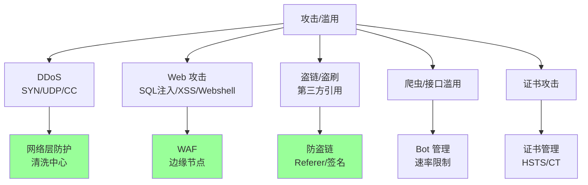

CDN 是**第一道防线**：流量先到 CDN，攻击在边缘清洗后才到源站。

## 二、DDoS 防护

### 2.1 DDoS 类型

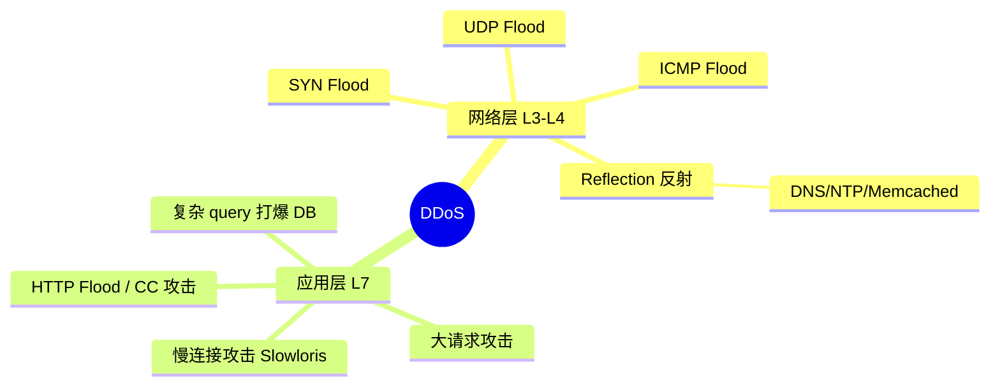

### 2.2 网络层 DDoS（L3/L4）

#### SYN Flood

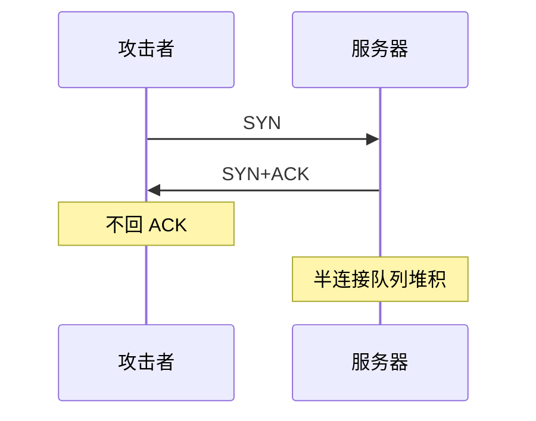

**防护**：
- SYN Cookie（不存半连接，靠 cookie 校验）
- SYN Proxy（CDN 代理握手，源站不感知）
- 增大半连接队列

#### UDP Flood

```
攻击者发大量 UDP 包到目标 → 服务器响应 ICMP unreachable 耗资源
```

**防护**：
- 流量清洗（异常 UDP 直接丢）
- BGP 黑洞路由（极端情况）

#### 反射放大攻击

```
攻击者 ─伪造源 IP=受害者─→ DNS/NTP/Memcached 服务器
                                    ↓ 响应（流量放大 50-50000 倍）
                                    受害者
```

**典型**：
- DNS 反射：50 倍放大
- NTP 反射：500 倍
- Memcached 反射：50000 倍（2018 年 GitHub 1.35Tbps 攻击）

**防护**：
- 流量清洗中心
- 关闭/限制开放的 UDP 服务

### 2.3 应用层 DDoS（L7）— CC 攻击

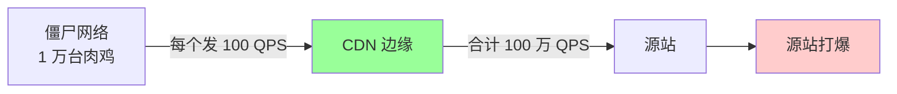

**特点**：
- 每个肉鸡看起来正常（HTTP 请求合法）
- 难以用 IP 黑名单（IP 太多）
- 集中打慢接口、打打开数据库的 URL

### 2.4 CC 攻击防护

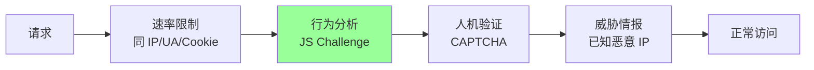

**多层防御**：
1. **速率限制**：单 IP 每秒最多 N 请求
2. **JS Challenge**：返回 JS，浏览器执行后才放行（爬虫不会执行）
3. **人机验证**：reCAPTCHA / hCaptcha
4. **威胁情报**：已知恶意 IP 库
5. **行为指纹**：浏览器指纹 + 鼠标轨迹

### 2.5 大厂 DDoS 防护

| 厂商 | 方案 | 防护能力 |
| --- | --- | --- |
| Cloudflare | Anycast + 边缘清洗 | T 级 |
| AWS Shield | 集成 CloudFront | T 级 |
| 阿里云 | DDoS 高防 IP + CDN | T 级 |
| 腾讯云 | 大禹 + CDN | T 级 |

### 2.6 防护层级

```
基础防护：CDN 自带，免费，几十 G
高级防护：DDoS 高防 IP，按峰值收费，T 级
最强防护：自建清洗中心，互联网公司级
```

中小公司用 CDN + DDoS 高防 IP 即可，自建成本极高。

## 三、WAF（Web 应用防火墙）

### 3.1 WAF 防护范围

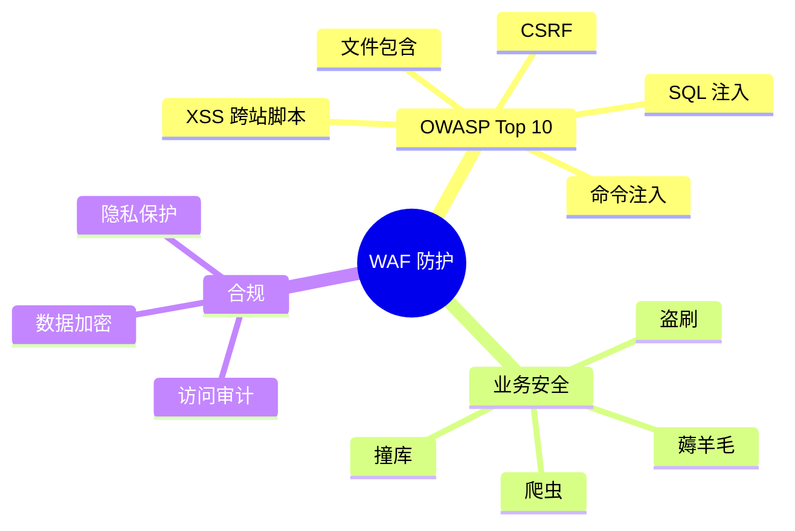

### 3.2 工作原理

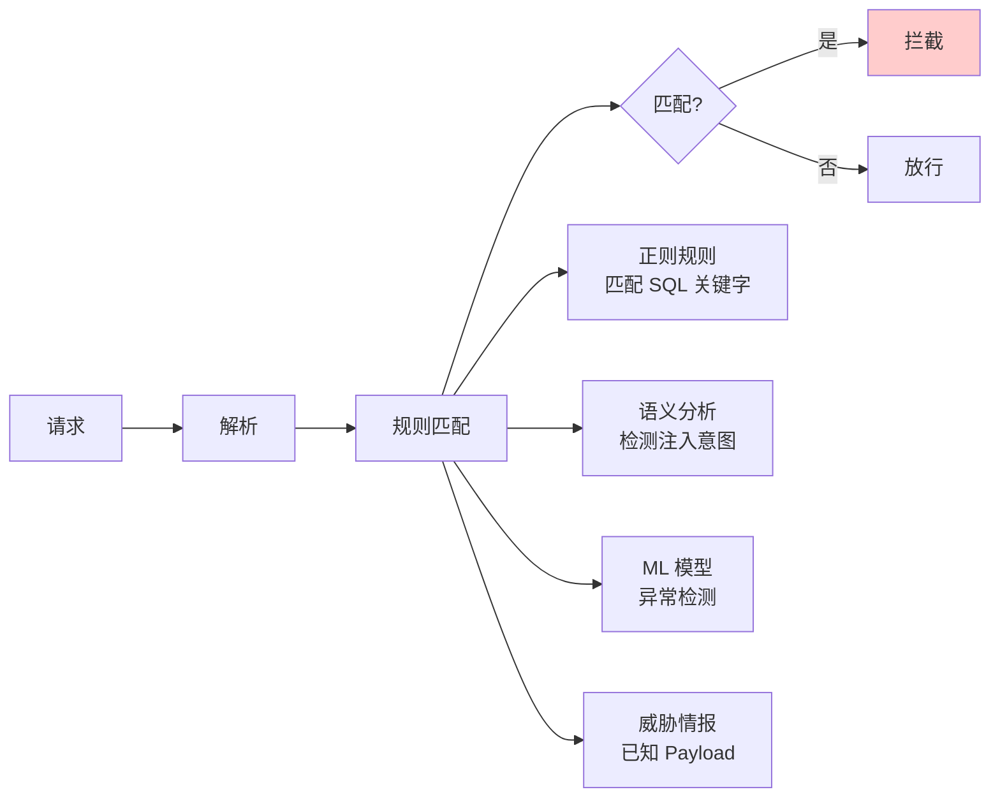

### 3.3 SQL 注入防护

```
正常请求: GET /user?id=123
攻击请求: GET /user?id=1 OR 1=1

WAF 规则:
  匹配 "OR 1=1" / "UNION SELECT" / "DROP TABLE" 等
  → 拦截
```

### 3.4 XSS 防护

```
攻击请求: GET /search?q=<script>alert(1)</script>

WAF 规则:
  匹配 <script>, javascript:, on*= 等
  → 拦截 / 转义
```

### 3.5 WAF 部署位置

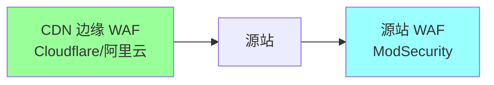

| | 边缘 WAF | 源站 WAF |
| --- | --- | --- |
| 部署 | CDN 厂商提供 | 自建 |
| 拦截位置 | 边缘节点 | 源站前 |
| 性能 | 不影响源站 | 占源站资源 |
| 灵活度 | 受厂商限制 | 完全自主 |
| 适合 | 通用 | 复杂规则 |

**双层 WAF**是大厂常见做法：边缘拦通用攻击，源站做业务层规则。

### 3.6 WAF 调优

```
□ 误报率 < 0.1%（误拦正常用户）
□ 漏报率 < 5%
□ 规则定期更新（OWASP / 厂商更新）
□ 白名单内部 IP（避免开发被拦）
□ 日志审计 + 灰度规则
```

## 四、防盗链

### 4.1 盗链是什么

```
[场景] 你的图片 https://cdn.example.com/img.jpg
       第三方网站直接 
       你付带宽费，他赚流量
```

### 4.2 Referer 防盗链

```
请求头: Referer: https://attacker.com/page

CDN 配置:
  allow_referers: ["example.com", "*.example.com"]
  deny_others: true

不在白名单 → 403
```

**优点**：简单、CDN 默认支持
**缺点**：
- Referer 可伪造
- 用户隐私设置可能屏蔽 Referer
- 部分浏览器 https → http 跳转不发 Referer

### 4.3 签名 URL（推荐）

```
原始 URL: https://cdn.example.com/video.mp4

签名 URL:
https://cdn.example.com/video.mp4?
  expires=1700000000&
  sign=abc123hash

CDN 验证:
  1. 当前时间 < expires
  2. sign == HMAC(secret, path + expires)
不通过 → 403
```

### 4.4 Go 实现签名

```go
import (
    "crypto/hmac"
    "crypto/sha256"
    "encoding/hex"
    "fmt"
    "time"
)

func GenSignedURL(baseURL, path, secret string, ttl time.Duration) string {
    expires := time.Now().Add(ttl).Unix()
    rawSign := fmt.Sprintf("%s%d%s", path, expires, secret)
    h := hmac.New(sha256.New, []byte(secret))
    h.Write([]byte(rawSign))
    sign := hex.EncodeToString(h.Sum(nil))
    return fmt.Sprintf("%s%s?expires=%d&sign=%s", baseURL, path, expires, sign)
}

func VerifySign(path, expires, sign, secret string) bool {
    rawSign := path + expires + secret
    h := hmac.New(sha256.New, []byte(secret))
    h.Write([]byte(rawSign))
    expected := hex.EncodeToString(h.Sum(nil))
    return hmac.Equal([]byte(expected), []byte(sign)) &&
           time.Now().Unix() < parseInt(expires)
}
```

### 4.5 Token 鉴权（适合 API）

```
1. 用户登录 → 服务端发 Token
2. 请求带 Token: Authorization: Bearer xxx
3. CDN 边缘验证 Token（解 JWT 或调鉴权服务）
4. 通过 → 转发；不通过 → 401
```

### 4.6 大厂方案

| | Cloudflare | 阿里云 |
| --- | --- | --- |
| Referer | ✅ 默认 | ✅ |
| 签名 URL | ✅ Workers 实现 | ✅ 鉴权 A/B/C 三种 |
| Token | ✅ Workers + JWT | ✅ |
| IP 白名单 | ✅ | ✅ |
| 时段限制 | ✅ | ✅ |

阿里云 CDN 三种鉴权（A/B/C）：
- **A 类**：URL 带 timestamp + sign
- **B 类**：路径前缀加 sign（适合视频流）
- **C 类**：路径中嵌入 sign（最隐蔽）

## 五、HTTPS 与证书

### 5.1 为什么必须 HTTPS

- 隐私（防嗅探）
- 完整性（防篡改）
- 身份（防中间人）
- 合规（GDPR / 网安法）
- HTTP/2 强制 HTTPS

### 5.2 CDN 的证书托管

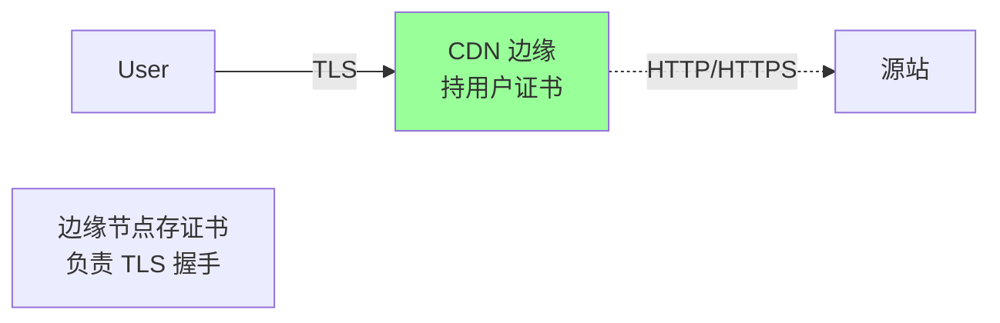

| 选项 | 适合 |
| --- | --- |
| 用户上传证书 | 自有证书 |
| CDN 免费证书 | Let's Encrypt 集成（90 天自动续） |
| 用户购买 + 托管 | 商业证书 |

### 5.3 边缘到源站的协议

```
用户 → 边缘: 必 HTTPS
边缘 → 源站:
  - HTTP（VPC 内网，最快）
  - HTTPS（公网回源，最安全）
  - 跟随客户端协议
```

**推荐**：源站在 VPC 内时用 HTTP 回源（省 CPU）。

### 5.4 SNI

```
单 IP 多证书：
  https://a.com → SNI: a.com → 证书 A
  https://b.com → SNI: b.com → 证书 B
```

CDN 边缘节点必备，否则要多 IP。

### 5.5 HSTS（强制 HTTPS）

```
响应头: Strict-Transport-Security: max-age=31536000; includeSubDomains; preload
```

**效果**：浏览器 1 年内强制对此域名走 HTTPS（防降级攻击）。

**preload**：加入浏览器 HSTS 预加载列表，**永久 HTTPS**。

### 5.6 证书自动续签

```
- Let's Encrypt 90 天有效期
- CDN 集成 ACME 协议自动续
- 监控告警 30 天内到期
```

### 5.7 Certificate Transparency (CT)

```
所有证书必须公开到 CT 日志（防恶意签发）
浏览器验证证书时检查 CT
```

CDN 颁发证书自动上传 CT。

## 六、边缘鉴权

### 6.1 为什么在边缘做

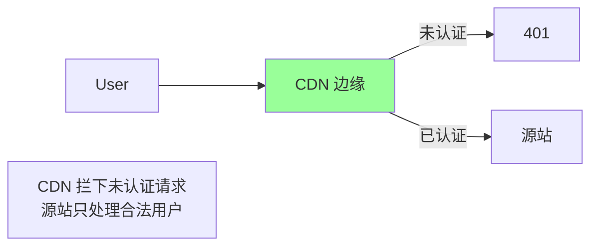

**收益**：
- 减轻源站压力
- 减少回源带宽
- 攻击拦在边缘

### 6.2 边缘鉴权方案

```
1. 简单：签名 URL 边缘验证
2. 中等：JWT 边缘解码验证签名
3. 复杂：边缘函数（EdgeWorker）调用鉴权服务
```

### 6.3 边缘 JWT 验证（伪代码）

```javascript
// Cloudflare Workers
addEventListener('fetch', event => {
  event.respondWith(handle(event.request))
})

async function handle(req) {
  const token = req.headers.get('Authorization')?.replace('Bearer ', '')
  if (!token) return new Response('Unauthorized', {status: 401})

  try {
    const payload = await verifyJWT(token, PUBLIC_KEY)
    if (payload.exp < Date.now()/1000) {
      return new Response('Expired', {status: 401})
    }
  } catch (e) {
    return new Response('Invalid', {status: 401})
  }

  return fetch(req)  // 转发到源站
}
```

详见 06-edge-computing。

## 七、爬虫与 Bot 管理

### 7.1 Bot 类型

| Bot | 行为 | 处理 |
| --- | --- | --- |
| **搜索引擎** | Googlebot / Bingbot | 放行 + 区分对待 |
| **业务爬虫** | 数据采集 / 监控 | 限速 |
| **恶意爬虫** | 撞库 / 薅羊毛 | 拦截 |
| **自动化工具** | curl / Postman | 视情况 |

### 7.2 Bot 检测手段

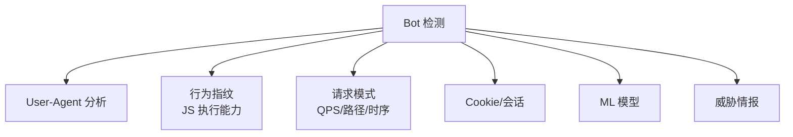

### 7.3 反爬手段递进

```
1. UA 检测 → 简单爬虫
2. JS Challenge → 无头浏览器
3. CAPTCHA → 人工识别困难
4. 行为指纹 → 自动化工具难伪造
5. 设备指纹 → 设备级追踪
```

### 7.4 Cloudflare Bot Management

```
- Bot 评分 0-99
- 0-30: 人类
- 30-60: 不确定
- 60+: Bot

按评分自由处置: 放行/挑战/拦截
```

## 八、合规与隐私

### 8.1 数据合规

- **GDPR**（欧盟）：用户数据本地化、删除权
- **CCPA**（加州）：用户隐私
- **网络安全法**（中国）：数据出境、个人信息保护
- **PCI-DSS**：支付卡数据

CDN 厂商提供合规节点（中国大陆 / 欧盟独立等）。

### 8.2 数据传输加密

- 用户 → 边缘：TLS 1.3
- 边缘 → 源站：TLS / VPC
- 配置传输：mTLS

### 8.3 日志脱敏

```
原始: GET /user/12345/profile?token=xxx
脱敏: GET /user/***/profile?token=***
```

CDN 厂商支持配置脱敏规则。

## 九、典型坑

### 坑 1：只用 Referer 防盗链

Referer 可伪造，攻击者写脚本带假 Referer。

**修复**：用签名 URL + 时效。

### 坑 2：源站直接暴露公网

CDN 防 DDoS 失败 → 攻击直接打源站 IP。

**修复**：源站只允许 CDN 回源 IP 段访问，不允许公网。

### 坑 3：WAF 误杀业务

新接口 POST 大数据被 WAF 拦 → 业务挂。

**修复**：白名单 + 灰度规则 + 监控告警。

### 坑 4：HTTPS 证书过期

证书过期 → 全网用户访问失败。

**修复**：自动续签 + 30 天到期告警。

### 坑 5：HSTS 配置错

`includeSubDomains` 之后某子域用 HTTP → 永久无法访问。

**修复**：测试好再开 preload。

### 坑 6：DDoS 防护没分级

基础防护被 50G 攻击打穿 → 升级 T 级高防延迟。

**修复**：评估业务峰值 + 提前签购防护额度。

### 坑 7：忽略应用层 DDoS

只防 SYN Flood 不防 CC → CC 打爆数据库。

**修复**：双层防御（网络层 + 应用层）。

## 十、面试高频题

**Q1：DDoS 攻击有哪些类型？怎么防？**

| 类型 | 防护 |
| --- | --- |
| SYN Flood | SYN Cookie / SYN Proxy |
| UDP Flood | 流量清洗 |
| 反射放大 | 关 UDP / 清洗中心 |
| CC 攻击 | 限速 + JS Challenge + CAPTCHA |

CDN 边缘清洗 + DDoS 高防 IP 多层防御。

**Q2：CC 攻击怎么识别和拦截？**

特点：合法 HTTP，量大、集中打慢接口。

防护：
- 速率限制（IP/UA/Cookie）
- JS Challenge
- 行为指纹
- 威胁情报库

**Q3：WAF 工作原理？**

解析请求 → 规则匹配（正则 / 语义 / ML） → 拦截或放行。

防 OWASP Top 10：SQL 注入、XSS、CSRF 等。

**Q4：防盗链有哪些方案？**

- Referer 防盗链（弱）
- 签名 URL（推荐）
- Token 鉴权（API）
- IP 白名单
- 时段限制

**Q5：签名 URL 怎么实现？**

```
sign = HMAC(secret, path + expires)
URL = original?expires=...&sign=...
```

CDN 边缘验证 sign + 检查未过期。

**Q6：HTTPS 证书 CDN 怎么管？**

- 用户上传 / CDN 免费 Let's Encrypt
- 边缘节点持证书
- SNI 多证书共享 IP
- 自动续签 + 监控告警

**Q7：HSTS 是什么？**

`Strict-Transport-Security` 头强制浏览器 N 年内对此域名走 HTTPS，防降级攻击。

`preload` 加入浏览器预加载列表，永久 HTTPS。

**Q8：源站怎么防止被绕过 CDN 直接攻击？**

- 源站只允许 CDN 回源 IP 段
- 用 mTLS 验证回源是 CDN
- 私网 / VPC 内部部署
- 不公开源站域名

**Q9：边缘鉴权的好处？**

- 减少源站压力
- 减少回源带宽
- 攻击拦在边缘
- 全球快速验证

实现：签名 URL / JWT / EdgeWorker。

**Q10：Bot 怎么管理？**

- 多维检测（UA / 行为 / 指纹 / ML）
- 评分制处置
- 区分搜索引擎 vs 恶意爬虫
- Cloudflare Bot Management 是业界标杆

## 十一、面试加分点

- DDoS 分**网络层 L3/L4** 和**应用层 L7（CC）**，防护手段不同
- **反射放大攻击**最危险（Memcached 5 万倍放大）
- **CDN 边缘是第一道防线**，源站只允许 CDN IP 访问
- WAF 防 **OWASP Top 10**，必须监控误报率 < 0.1%
- 防盗链优先级：**签名 URL > Token > Referer**
- **HSTS preload** 永久 HTTPS，配置错灾难性
- **TLS 1.3 + ECDSA 证书 + OCSP Stapling** 是 HTTPS 性能黄金组合
- **边缘 JWT 验证** 减轻源站压力
- **双层 WAF**（边缘 + 源站）平衡通用和定制
- 移动 App **HTTP DNS + 签名 URL** 双保险
- **DDoS 防护要分级**：基础免费 + 高级付费 + 自建（大厂）
