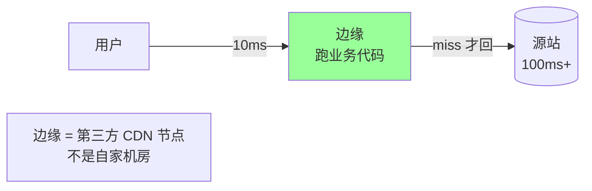
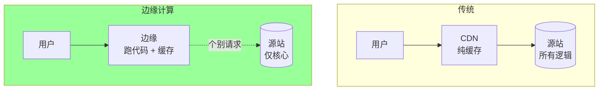
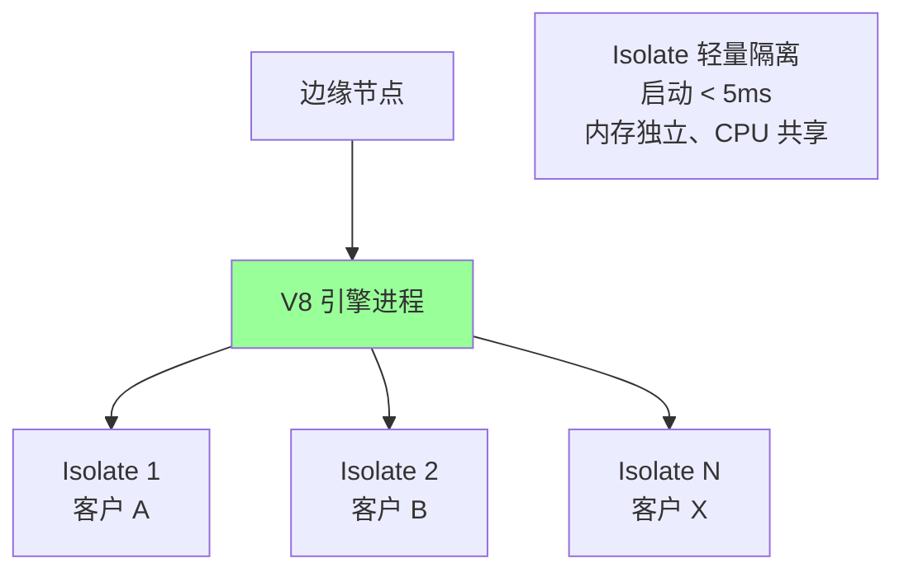
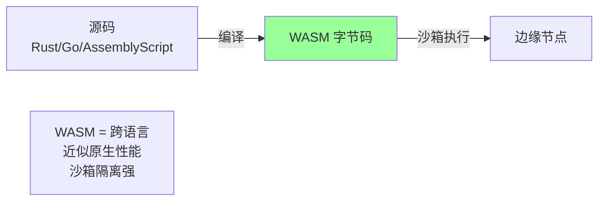
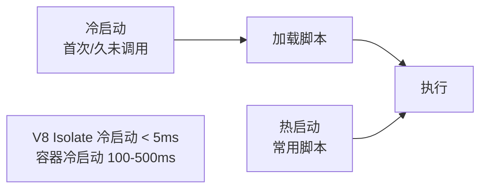

# CDN · 边缘计算

> EdgeWorker / Serverless@Edge / V8 隔离 / WASM / 典型场景 / 大厂方案对比

## 一、什么是边缘计算

### 1.1 一句话定义

> **边缘计算 = 把代码跑在 CDN 边缘节点上，离用户最近**



### 1.2 与传统架构对比



**核心收益**：
- **延迟**：边缘 10ms vs 源站 100ms+
- **源站负载**：业务前置到边缘
- **个性化**：边缘可以做每用户不同的响应（CDN 静态做不到）
- **A/B 测试**：边缘按用户分流

### 1.3 适合什么场景

✅ 适合：
- 简单逻辑（认证 / 鉴权 / 路由）
- 个性化响应（A/B、地区差异）
- 低延迟要求（实时游戏 / 金融行情）
- 流量过滤 / 改写
- 静态站点动态化

❌ 不适合：
- 复杂业务（订单、支付）
- 强一致 DB 操作
- 大计算（视频转码）
- 需要全局状态

## 二、边缘计算的运行时

### 2.1 V8 Isolate（Cloudflare Workers）



**原理**：每个用户的 Worker 跑在独立 V8 Isolate（沙箱），共享 V8 引擎，启动极快。

**优势**：
- 冷启动 < 5ms（vs Lambda 几百 ms）
- 一台节点跑数千 Worker
- 资源消耗低

### 2.2 容器（AWS Lambda@Edge）

```
- 完整 Linux 环境
- 启动慢（几百 ms 冷启动）
- 资源开销大
- 但能力强（任意语言、库）
```

### 2.3 WebAssembly（Fastly Compute@Edge）



**优势**：
- 多语言（Rust / Go / TinyGo / AssemblyScript）
- 性能接近原生
- 沙箱安全
- 启动快

**Fastly** 主推 Compute@Edge（基于 Wasmtime），强类型场景适合。

### 2.4 三种运行时对比

| | V8 Isolate | 容器 | WASM |
| --- | --- | --- | --- |
| 启动 | < 5ms | 100-500ms | < 10ms |
| 内存 | 几 MB | 几十-几百 MB | 几 MB |
| 语言 | JS/TS | 任意 | 多语言（编译到 WASM） |
| 隔离 | V8 沙箱 | 容器隔离 | WASM 沙箱 |
| 代表 | Cloudflare Workers | Lambda@Edge | Fastly Compute |

## 三、典型场景

### 3.1 鉴权 / Token 校验

```javascript
// Cloudflare Workers
addEventListener('fetch', event => {
  event.respondWith(handle(event.request))
})

async function handle(req) {
  const token = req.headers.get('Authorization')
  if (!token || !verifyJWT(token)) {
    return new Response('Unauthorized', {status: 401})
  }
  return fetch(req)  // 转发到源站
}
```

**收益**：未鉴权请求直接边缘拦截，源站只处理合法请求。

### 3.2 A/B 测试

```javascript
async function handle(req) {
  const userID = getUserID(req)
  const variant = hash(userID) % 2 === 0 ? 'A' : 'B'

  const url = new URL(req.url)
  if (variant === 'B') {
    url.host = 'experiment.example.com'
  }
  return fetch(url, req)
}
```

**收益**：无需源站参与，边缘按用户路由。

### 3.3 个性化响应

```javascript
async function handle(req) {
  const country = req.cf.country  // Cloudflare 提供
  const lang = country === 'CN' ? 'zh' : 'en'

  let response = await fetch(req)
  response = await rewrite(response, {lang, country})
  return response
}
```

**收益**：同一份缓存内容，边缘按用户改写（语言/币种/广告）。

### 3.4 请求改写 / 路由

```javascript
async function handle(req) {
  const url = new URL(req.url)

  // /old → /new
  if (url.pathname.startsWith('/old/')) {
    url.pathname = url.pathname.replace('/old/', '/new/')
    return Response.redirect(url, 301)
  }

  // 按地域分流
  if (req.cf.country === 'CN') {
    url.host = 'cn.example.com'
  }
  return fetch(url)
}
```

### 3.5 防盗链 / 签名验证

```javascript
async function handle(req) {
  const url = new URL(req.url)
  const sign = url.searchParams.get('sign')
  const expires = url.searchParams.get('expires')

  if (Date.now()/1000 > parseInt(expires)) {
    return new Response('Expired', {status: 403})
  }

  const expected = await hmac(SECRET, url.pathname + expires)
  if (sign !== expected) {
    return new Response('Invalid', {status: 403})
  }

  return fetch(req)
}
```

### 3.6 限流

```javascript
async function handle(req) {
  const ip = req.headers.get('CF-Connecting-IP')
  const key = `rate:${ip}`
  const count = await KV.get(key) || 0

  if (count > 100) {
    return new Response('Too Many Requests', {status: 429})
  }

  await KV.put(key, count + 1, {expirationTtl: 60})
  return fetch(req)
}
```

### 3.7 HTML 边缘渲染

```javascript
async function handle(req) {
  let html = await fetch('https://template.example.com/page.html')
  html = await html.text()

  // 边缘填充用户数据
  const user = await getUserData(req)
  html = html.replace('{{user.name}}', user.name)

  return new Response(html, {
    headers: {'Content-Type': 'text/html'}
  })
}
```

**收益**：模板可缓存，个性化数据边缘填充，源站零负载。

### 3.8 静态站点 + 动态扩展

```
GitHub Pages 静态 → Cloudflare Workers 加动态能力
- 评论、点赞 → Workers + KV
- 搜索 → Workers + 边缘索引
- 用户认证 → Workers + JWT
```

业内称 **JAMstack + Edge**。

## 四、边缘存储

### 4.1 KV（键值）

```javascript
// Cloudflare Workers KV
await KV.put('user:123', JSON.stringify({name: 'Alice'}))
const data = await KV.get('user:123')
```

**特点**：
- 全球分发（最终一致，秒-分钟级）
- 读优化（边缘命中极快）
- 写慢（要全球同步）

**适合**：配置、用户偏好、缓存热数据。

### 4.2 持久存储（D1 / R2）

| | Cloudflare D1 | Cloudflare R2 |
| --- | --- | --- |
| 类型 | SQLite SQL | 对象存储 |
| 适合 | 关系型数据 | 文件 / 大对象 |
| 一致性 | 强（单点） | 最终 |
| 价格 | 按请求 | 按存储 + 流量 |

### 4.3 Durable Objects（强一致）

```javascript
class Counter {
  async fetch(req) {
    let count = (await this.state.storage.get('count')) || 0
    count++
    await this.state.storage.put('count', count)
    return new Response(count)
  }
}
```

**特点**：单实例 + 强一致，适合需要全局状态的场景（计数器、聊天室）。

## 五、大厂方案对比

### 5.1 Cloudflare Workers

| 维度 | 详情 |
| --- | --- |
| 运行时 | V8 Isolate（JS/TS/WASM） |
| 启动 | < 5ms |
| 内存限制 | 128MB |
| CPU 时间 | 10-50ms（按套餐） |
| 存储 | KV / D1 / R2 / Durable Objects |
| 价格 | 100K/天免费，超过按请求计费 |
| 特色 | **生态最完整**、文档好 |

### 5.2 Fastly Compute@Edge

| 维度 | 详情 |
| --- | --- |
| 运行时 | WASM (Wasmtime) |
| 启动 | < 35μs（工业最快） |
| 语言 | Rust / JS / Go / AssemblyScript |
| 特色 | **企业级 + 性能极致** |

### 5.3 AWS Lambda@Edge

| 维度 | 详情 |
| --- | --- |
| 运行时 | 容器 (Lambda) |
| 启动 | 100-500ms 冷启动 |
| 语言 | Node.js / Python |
| 集成 | AWS 生态深度集成 |
| 特色 | **能力强但慢、贵** |

替代品：**CloudFront Functions**（轻量、JS、< 1ms 启动）。

### 5.4 阿里云 EdgeRoutine / DCDN

```
- JavaScript V8 运行时
- 部分支持 WASM
- 国内部署，合规友好
```

### 5.5 选型建议

```mermaid
flowchart TB
    Q1{需要什么?}
    Q1 -->|JS 简单逻辑| CF[Cloudflare Workers]
    Q1 -->|高性能 + 多语言| Fastly[Fastly Compute]
    Q1 -->|AWS 集成| Lambda[Lambda@Edge]
    Q1 -->|国内合规| Ali[阿里云 ER]

    style CF fill:#9f9
```

## 六、性能与限制

### 6.1 资源限制（Cloudflare 为例）

| 限制 | 免费 | 付费 |
| --- | --- | --- |
| CPU 时间 | 10ms | 50ms+ |
| 内存 | 128MB | 128MB |
| 子请求 | 50 | 1000 |
| 脚本大小 | 1MB | 10MB |
| 日请求 | 100K | 无限 |

### 6.2 冷启动 vs 热启动



V8 Isolate 冷启动几乎可忽略，是其核心优势。

### 6.3 性能优化

```
□ 减少子请求（CDN 调外部 API 慢）
□ 用 KV / Cache API 缓存中间结果
□ 流式响应（边接收边发送）
□ 避免大对象内存拷贝
□ WASM 重计算场景比 JS 快
```

## 七、调试与开发

### 7.1 本地开发

```
Cloudflare Workers: wrangler dev (本地模拟边缘)
Fastly Compute: fastly compute serve
AWS Lambda@Edge: SAM Local
```

### 7.2 部署

```bash
# Cloudflare
wrangler deploy

# Fastly
fastly compute publish

# AWS
sam deploy
```

### 7.3 监控

```
- 请求量 / 错误率 / P50/P95/P99 延迟
- CPU 时间 / 内存使用
- 子请求成功率
- 日志聚合（边缘日志收集到中心）
```

CDN 厂商都自带监控面板。

## 八、典型坑

### 坑 1：把边缘当源站用

复杂业务硬塞到边缘 → 资源不够 → 频繁报错。

**修复**：边缘只做轻量逻辑，重活回源站。

### 坑 2：滥用同步 fetch

边缘函数里串行调 5 个 API → 累计延迟爆炸。

**修复**：并行 `Promise.all`，或缓存结果。

### 坑 3：忽略冷启动

低频脚本每次都冷启动 → 用户体验差（容器型）。

**修复**：选 V8 Isolate 运行时（启动快）；或保活脚本。

### 坑 4：在边缘存大状态

用 KV 存 GB 级数据 → 同步慢、读慢。

**修复**：边缘存热数据，冷数据回源站。

### 坑 5：调用源站时不加缓存

每次都调 → 源站打爆。

**修复**：用 Cache API 缓存子请求结果。

### 坑 6：边缘代码 vendor lock-in

写得太依赖某厂商 API → 迁移困难。

**修复**：抽象一层适配，主体逻辑通用。

### 坑 7：KV 强一致期望

写完立即读拿到旧值 → bug。

**修复**：KV 是最终一致，强一致用 Durable Objects。

## 九、面试高频题

**Q1：边缘计算解决什么问题？**

把代码跑在离用户最近的边缘节点：
- 降低延迟（10ms vs 100ms+）
- 减轻源站负载
- 个性化响应（CDN 静态做不到）
- 流量过滤 / 鉴权前置

**Q2：边缘计算的运行时有哪些？**

| | V8 Isolate | 容器 | WASM |
| --- | --- | --- | --- |
| 启动 | < 5ms | 几百 ms | < 10ms |
| 代表 | Cloudflare | Lambda@Edge | Fastly |

**Q3：V8 Isolate 为什么启动快？**

V8 引擎共享，每个 Worker 跑在独立 Isolate（沙箱），启动只需创建上下文，不用启动整个进程/容器。

**Q4：什么场景适合边缘计算？**

✅ 鉴权、A/B 测试、个性化、限流、改写、轻量计算
❌ 复杂业务、强一致 DB、大计算、需要全局状态

**Q5：Cloudflare Workers vs Lambda@Edge？**

| | Workers | Lambda@Edge |
| --- | --- | --- |
| 运行时 | V8 Isolate | 容器 |
| 启动 | < 5ms | 100-500ms |
| 语言 | JS/TS/WASM | Node.js/Python |
| 价格 | 便宜 | 贵 |

**Q6：边缘怎么实现限流？**

KV / Cache 存 IP 计数，每秒过期，超阈值返回 429。

**Q7：边缘 KV vs Durable Objects？**

| | KV | Durable Objects |
| --- | --- | --- |
| 一致性 | 最终 | 强 |
| 适合 | 配置 / 缓存 | 计数器 / 聊天 |

**Q8：边缘函数能做支付吗？**

**不行**。
- 强一致写入边缘做不到
- 资源限制（CPU 10-50ms）
- 监管/合规需要

只能做支付前置（鉴权、风控前置）。

**Q9：怎么避免冷启动？**

- 选 V8 Isolate 运行时
- 高频访问保持热
- 减小脚本体积
- 容器型可用预留实例（Lambda）

**Q10：边缘计算和 Serverless 的区别？**

边缘计算 = Serverless@CDN，跑在 CDN 边缘节点。

普通 Serverless（AWS Lambda）跑在中心化机房。

边缘计算 = **Serverless 全球分布版**。

## 十、面试加分点

- 边缘计算 = **代码 + CDN 节点**，离用户最近
- **V8 Isolate** 启动 < 5ms，是 Cloudflare Workers 杀手锏
- **WASM** 是边缘计算未来（多语言 + 接近原生性能）
- 适合：**鉴权 / A/B / 个性化 / 限流 / 改写**，不适合复杂业务
- **边缘 KV 是最终一致**，强一致用 Durable Objects
- **缓存子请求**避免边缘函数变源站杀手
- 选型按运行时：**JS 简单 → CF、性能极致 → Fastly、AWS 集成 → Lambda@Edge**
- 业界趋势：**JAMstack + Edge** 让静态站点动态化
- 注意 **vendor lock-in**，业务逻辑抽象一层
- 边缘函数**冷启动**和资源限制是常见坑
- Edge 收益最大化在**全球用户 + 低延迟要求**场景
