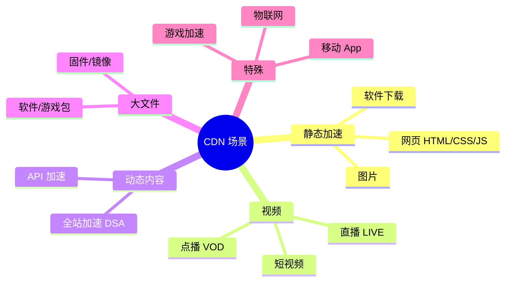
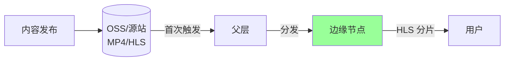
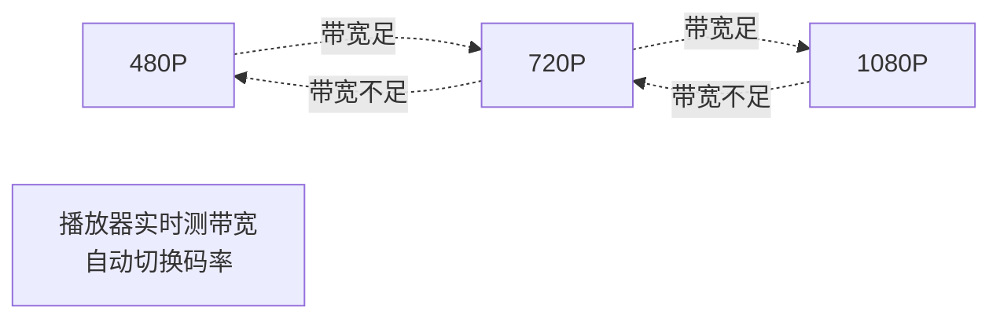
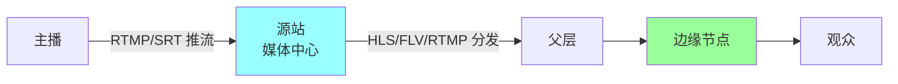
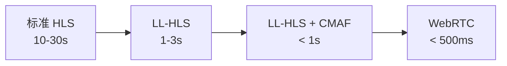
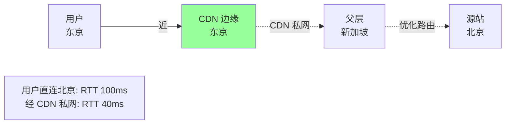
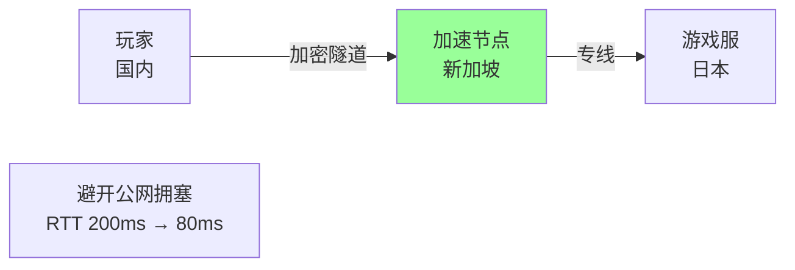
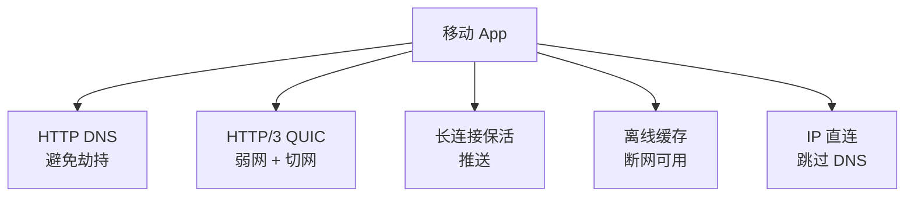

# CDN · 典型场景

> 点播 VOD / 直播 / 大文件下载 / API 加速 / 动态加速 / 图片 / 游戏

## 一、场景分类



## 二、点播（VOD）

### 2.1 典型架构



### 2.2 切片格式

| 格式 | 协议 | 延迟 | 兼容性 |
| --- | --- | --- | --- |
| **MP4** | HTTP | 无 | 所有浏览器 |
| **HLS** | HTTP + m3u8 | 6-30s | iOS/Android 原生 |
| **DASH** | HTTP + mpd | 2-10s | Android/Web |
| **FLV** | HTTP-FLV | 秒级 | 已衰退 |

HLS 最通用，DASH 性能更好。

### 2.3 HLS 结构

```
/video/abc/
  index.m3u8                  # 主索引（多码率）
  low/
    index.m3u8                # 低码率索引
    segment-0.ts              # 切片（2-10秒）
    segment-1.ts
  high/
    index.m3u8                # 高码率索引
    segment-0.ts
    ...
```

**关键**：m3u8 + ts 都走 CDN 缓存。

### 2.4 码率自适应（ABR）



**核心**：主 m3u8 列出多码率，播放器按网络情况切换。

### 2.5 VOD 优化

**预热热门内容**：
```
新剧上线 → API 批量预热到全网边缘
开播时 0% 回源
```

**切片 TTL**：
```
m3u8: max-age=10         # 短（防老索引）
ts:   max-age=86400      # 长（切片不变）
```

**Range 请求支持**：
```
拖动进度条 → Range: bytes=10485760-11534336
CDN 回源也用 Range → 只拉 1MB
```

**大文件秒开**：
```
开播前预拉前几秒 → 用户点击立即播放
```

### 2.6 VOD 成本优化

- 冷门视频不预热（被动 MISS）
- 分层存储：热在 CDN，温在对象存储，冷归档
- 按带宽 95 计费 vs 按流量计费选择

## 三、直播

### 3.1 架构



### 3.2 协议选择

| 协议 | 延迟 | 场景 |
| --- | --- | --- |
| **RTMP** | 2-5s | 推流常用，播放衰退 |
| **HLS** | 6-30s | 兼容性最佳，秀场直播 |
| **HTTP-FLV** | 2-5s | PC 播放常用 |
| **LL-HLS** | 1-3s | Apple 推的低延迟 |
| **WebRTC** | < 500ms | 连麦 / 互动 / 电商直播 |
| **SRT** | 100ms | 推流替代 RTMP，抗丢包 |

### 3.3 低延迟直播演进



电商/游戏直播场景 WebRTC 成为主流。

### 3.4 直播加速要点

**大 Fan-out**：
```
1 主播推流 → CDN 树状分发到 100 万观众
```

**边缘转码**：
```
主播推 1 路 → 边缘转多个码率（4K/1080P/720P/480P）
节省源站 CPU + 跨地域转发带宽
```

**首屏秒开**：
```
播放器请求 m3u8 → CDN 边缘已有缓存 → 秒开
关键：边缘提前拉取 GOP 帧
```

**延迟控制**：
```
- 减小 GOP（关键帧间隔）
- 切片更小（LL-HLS 每切片 0.3s）
- CDN 链路优化（减少中转）
```

### 3.5 直播常见问题

- **延迟高**：切片大 / 切片多 / 链路长 → 换协议 / 优化链路
- **卡顿**：带宽不足 → 降码率 + ABR
- **不同步**：主备流切换导致 → 同步时间戳
- **黑屏/花屏**：编码错误 / 丢帧 → 回退码率

## 四、短视频

### 4.1 典型特征

- 海量小文件（每个几 MB）
- 强热点（少数视频吃大部分流量）
- 用户按推荐流消费

### 4.2 加速手段

**预热 Top 热门**：
```
推荐系统识别热门 → 提前推送到边缘
```

**预加载下一个**：
```
播当前视频时预拉下 3-5 个
```

**切片 + Range**：
```
短视频分 1MB 小块，按需拉取（滑动快跳过不浪费）
```

**视频分辨率自适应**：
```
弱网用低码率，强网用高码率
```

### 4.3 抖音/快手级别

- 自建 CDN + 商业 CDN 混合
- 视频上传自动转多码率 + 切片
- 推荐 + 预热联动（个性化预加载）
- 端到端优化（QUIC + 自研播放器）

## 五、大文件下载

### 5.1 特点

- GB 级文件（游戏、操作系统、软件）
- 用户希望并发下载
- 断点续传必备

### 5.2 核心手段

**Range + 分片并发**：
```
100MB 文件分 4 片并发
线程 1: bytes=0-25MB
线程 2: bytes=25-50MB
...
速度 3-4 倍提升
```

**P2P 加速**：
```
CDN + P2P 混合:
  80% 流量来自 CDN
  20% 流量来自邻近用户 P2P
节省 CDN 带宽，成本降 50%
```

典型产品：**腾讯游戏 P2P**、**Windows 更新 P2P**。

**磁盘缓存优化**：
```
边缘节点用 SSD 缓存大文件热片段
冷片段才回源
```

### 5.3 大文件回源

```
源站建议:
  - 支持 Range
  - 长连接
  - 限速回源（避免单客户吃光源站）
  - 支持并发回源（父层一次拉多片）
```

## 六、API 加速 / 动态加速（DSA）

### 6.1 静态 CDN 失效场景

```
API 返回:
  - 每个用户不同（个人资料）
  - 实时变化（商品库存）
  - 强一致（订单状态）

静态 CDN 命中率 = 0
```

### 6.2 动态加速的本质

**不缓存，但加速链路**。



### 6.3 三大优化

**1. TCP 长连接**：
```
边缘 ↔ 父层 ↔ 源站 全程长连接
避免每次 TCP + TLS 握手
```

**2. 智能选路**：
```
实时测量公网链路质量
避开拥塞段，选最快路径
```

**3. 协议升级**：
```
源站: HTTP/1.1
CDN 内部: HTTP/2 / QUIC
用户看不出
```

### 6.4 效果

| 场景 | 直连 | DSA |
| --- | --- | --- |
| 跨国 API | 500ms | 150ms |
| 跨地域 | 200ms | 80ms |
| 同地域 | 50ms | 45ms |

加速倍数通常 **2-5 倍**。

### 6.5 部分可缓存 API

```
# 用户列表（可缓存 1 分钟）
GET /api/users?status=active
Cache-Control: public, s-maxage=60

# 商品详情（可缓存 5 分钟）
GET /api/product/123
Cache-Control: public, s-maxage=300

# 用户订单（不缓存）
GET /api/my/orders
Cache-Control: private, no-cache
```

细粒度控制，能缓存的缓存，不能的走 DSA。

### 6.6 大厂全站加速

| 厂商 | 产品 |
| --- | --- |
| 阿里云 | 全站加速 DCDN |
| 腾讯云 | 全站加速网络 ECDN |
| Cloudflare | Argo Smart Routing |
| AWS | CloudFront + Global Accelerator |

## 七、图片处理

### 7.1 常见需求

```
原图 5000x3000 JPG 2MB
页面需要 500x300 缩略图 → 90KB
```

### 7.2 边缘图片处理

```
https://cdn.example.com/img.jpg?w=500&h=300&fmt=webp

CDN 边缘:
  1. 回源拿原图
  2. 按参数缩放/裁剪
  3. 按 Accept 返回 WebP/AVIF
  4. 缓存结果
```

### 7.3 格式自适应

```
Accept: image/webp,image/avif,image/*
CDN 按支持度返回最优格式

AVIF > WebP > JPG (压缩比)
Safari 老版本不支持 AVIF → 返回 WebP
```

### 7.4 响应式图片

```html
<picture>
  <source media="(min-width: 800px)" srcset="img.jpg?w=1200">
  <source media="(min-width: 400px)" srcset="img.jpg?w=600">
  
</picture>
```

CDN 按 URL 参数动态返回不同尺寸。

### 7.5 大厂图片处理

| 厂商 | 产品 |
| --- | --- |
| 阿里云 | IMG 图片处理 |
| 腾讯云 | 万象 CI |
| 七牛云 | Dora |
| Cloudflare | Image Resizing / Polish |
| Imgix | 专业图片 CDN |

## 八、游戏加速

### 8.1 场景分两类

**游戏包下载**：
```
客户端安装包、版本更新、资源包
→ 静态 CDN + P2P + 分片并发
```

**游戏实时加速**：
```
玩家 ↔ 游戏服务器 的实时交互
→ UDP 加速 / 专线 / 智能路由
```

### 8.2 游戏加速器原理



典型：**UU 加速器 / 迅游加速器 / 网易 UU**。

### 8.3 技术要点

- UDP 协议加速（游戏多用 UDP）
- 抗丢包（FEC + 重传）
- 智能路由（实时选路）
- 就近节点（手游跨地域）

## 九、移动 App 加速

### 9.1 移动网络痛点

- 弱网（地铁、电梯）
- 切网（WiFi ↔ 4G）
- 运营商 DNS 劫持
- 跨地域连接不稳定

### 9.2 移动优化套件



### 9.3 典型集成方案

**阿里云 EMAS / 腾讯云 移动解决方案**：
- HTTPDNS SDK
- 网络加速 SDK
- 离线包管理
- 性能分析

字节、阿里、腾讯、美团 App 都自建这套。

## 十、IoT / 物联网

### 10.1 特点

- 设备数量多（百万-亿级）
- 流量小但频繁
- 长连接需求

### 10.2 CDN 作用

- 固件 OTA 更新（大文件下载）
- 设备配置下发（低延迟）
- 上行日志聚合

## 十一、大厂场景案例

### 11.1 Netflix Open Connect

```
自建 CDN，所有视频内容缓存到 ISP 机房
用户 → ISP 机房（极近）→ 秒开
```

### 11.2 字节跳动自研 CDN

```
抖音 + TikTok 日均 PB 级流量
商业 CDN + 自建节点混合
端 + 云 + 网络全栈优化
```

### 11.3 B 站双栈 CDN

```
稳定期：用多家商业 CDN 分流
高峰期：自建节点扛
大会员优先调度高质量节点
```

### 11.4 GitHub 下载加速

```
早期: CDN 静态 + 对象存储
后期: 配合 P2P（部分开源方案）
大 git clone：走特定镜像站
```

## 十二、典型坑

### 坑 1：直播延迟不达标

标准 HLS 延迟 10-30s，做电商不行。

**修复**：升级 WebRTC / LL-HLS。

### 坑 2：VOD 热门没预热

新剧上线首小时回源率 50% → 源站挂。

**修复**：提前预热 + 加父层收敛。

### 坑 3：API 想缓存但有用户身份

`/api/my/profile?token=xxx` 带 token 每个不同 → 命中率 0。

**修复**：用户专属不缓存，公共数据缓存。

### 坑 4：图片不转 WebP

带宽浪费 25-50%。

**修复**：CDN 开图片处理 + 按 Accept 返回。

### 坑 5：大文件没开 Range

客户端不支持分片下载 → 单线程慢。

**修复**：源站支持 Range，客户端分片。

### 坑 6：短视频首帧慢

CDN 未预热 + 视频大 → 首屏 5s+。

**修复**：预热 + 关键帧优化 + HTTP/3。

### 坑 7：动态加速期望过高

API 链路从 500ms 降到 200ms 觉得不够。

**修复**：DSA 加速上限通常 2-5 倍，要业务端也优化（减少依赖调用、拆分长接口）。

## 十三、面试高频题

**Q1：HLS / DASH / FLV 怎么选？**

- HLS：兼容最好（iOS/Android 原生）
- DASH：性能最好（Google/YouTube 主力）
- FLV：PC 低延迟，衰退中
- LL-HLS / WebRTC：低延迟直播

**Q2：直播延迟怎么优化？**

- 协议：标准 HLS → LL-HLS / WebRTC
- 切片：大切片 → 小切片（0.3-1s）
- GOP：减小关键帧间隔
- 链路：减少中转，边缘直连

**Q3：短视频怎么秒开？**

- 预热 Top 热门
- 预加载下一个
- 首片小（前几秒独立切片）
- HTTP/3 + CDN 边缘直连

**Q4：动态加速为什么能快？**

不缓存，但优化链路：
- CDN 私网长连接
- 智能选路
- 协议升级（HTTP/2 QUIC）

加速 2-5 倍。

**Q5：大文件下载怎么加速？**

- Range + 并发分片
- P2P 补充
- CDN 边缘 SSD 缓存

**Q6：P2P 和 CDN 关系？**

混合：CDN 保底（80%）+ P2P 分担（20%）。

P2P 节省 CDN 带宽成本。

**Q7：图片 CDN 怎么优化？**

- 格式转换（WebP / AVIF）
- 响应式尺寸
- 按 Accept 返回最优格式
- 边缘实时处理

**Q8：API 能上 CDN 吗？**

- **可缓存 API**：上（列表、详情、公共数据）
- **个性化/写入**：上动态加速（DSA）
- **强一致**：不上

**Q9：游戏加速器怎么工作的？**

UDP 隧道 + 专线 + 智能路由，避开公网拥塞。

加速节点到游戏服走专线，玩家到加速节点就近。

**Q10：移动 App 必备的 CDN 能力？**

- HTTP DNS（避免劫持）
- HTTP/3（弱网 + 切网）
- 长连接
- 离线缓存

## 十四、面试加分点

- **HLS 通用 / DASH 性能 / WebRTC 低延迟** 要知道怎么选
- **直播延迟**从 30s → 1s 演进（标准 HLS → LL-HLS → WebRTC）
- **短视频首帧**：预热 + 预加载 + HTTP/3
- **P2P + CDN 混合**是大文件最佳方案（成本降 50%）
- **动态加速（DSA）** 不缓存但加速链路，2-5 倍
- **API 缓存要细粒度**（Cache-Control 每接口单独）
- **图片边缘处理**（阿里 IMG / 腾讯万象）节省带宽 25-50%
- **移动 App HTTP DNS + HTTP/3** 必备
- **Netflix Open Connect** 是自建 CDN 的极致（ISP 机房内置）
- **字节/抖音**是端+云+网络全栈优化代表
- **自建 vs 商业 CDN** 大厂都混用（稳定性 + 成本）
