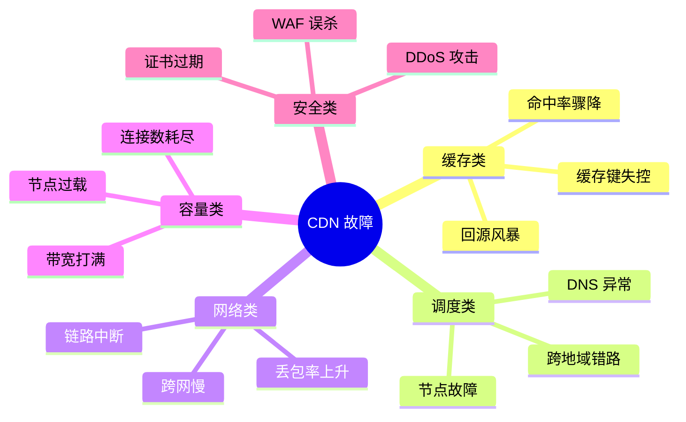
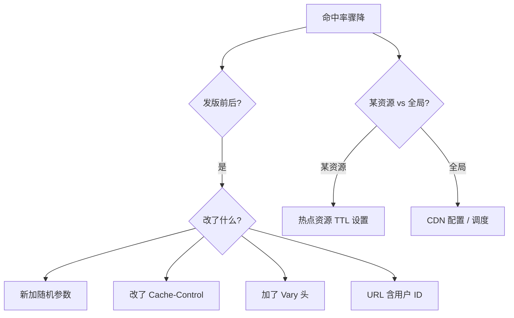
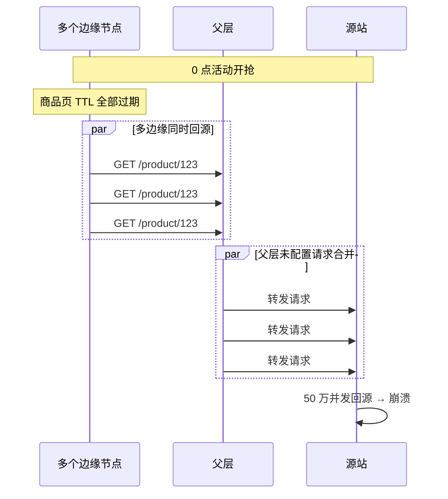
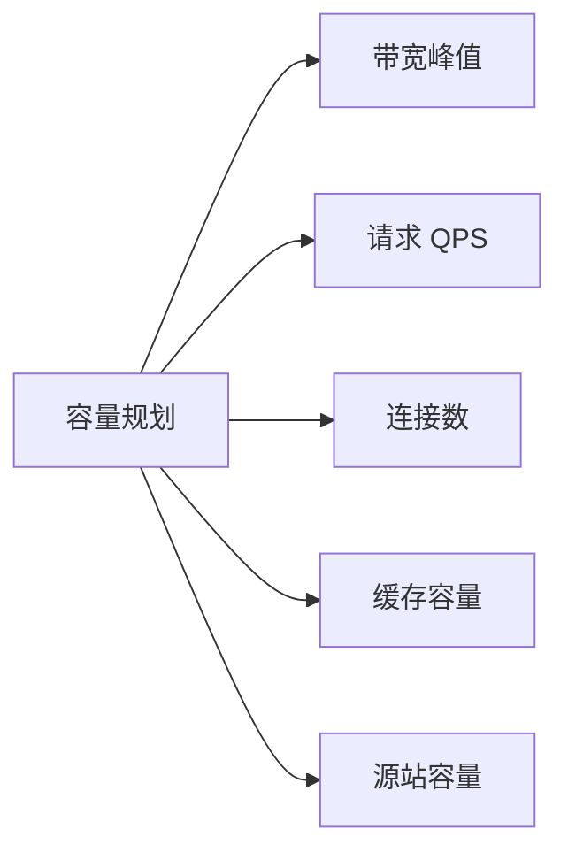
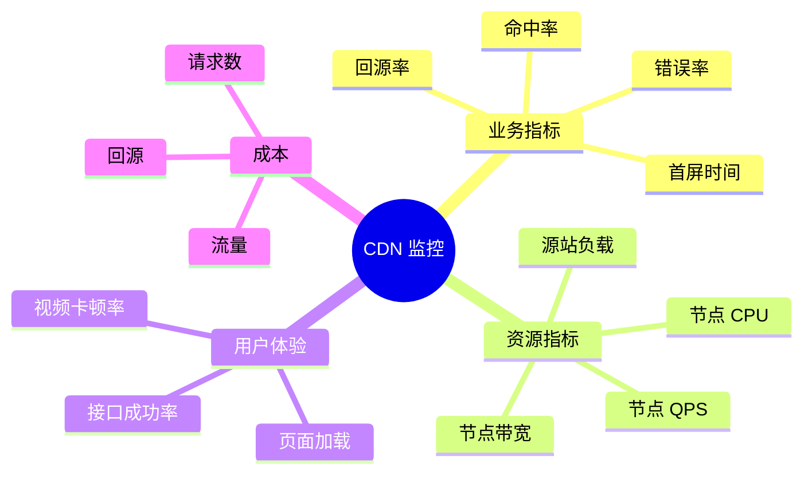

# CDN · 故障案例与运维

> 命中率骤降 / 回源风暴 / 热点调度 / 容量规划 / 预热与刷新 / 真实事故复盘

> 本篇汇总 CDN 高频故障的根因、排查路径、修复手段和预防措施

## 一、故障分类



## 二、案例 1：命中率骤降

### 2.1 故障场景

```
[现象] 命中率从 95% 骤降到 40%，源站带宽暴涨 5 倍
[影响] 源站 CPU 90%+，部分用户报错
[发生] 某次发版后
```

### 2.2 排查路径



### 2.3 根因（真实案例）

发版时新加了**统计参数 `_t=timestamp`** 用于 SDK 上报：

```
原 URL: /api/list?page=1
新 URL: /api/list?page=1&_t=1700000123
        每个用户每次请求 _t 都不同
        缓存键全不一样 → 命中率为 0
```

### 2.4 修复

```
方案 1（紧急）: CDN 配置 ignore_query: [_t]
方案 2（治本）: SDK 不要带在 URL 上，改 POST body 或 header
```

### 2.5 预防

```
□ 上线前检查命中率影响
□ CDN 配置审核流程
□ 监控命中率分布（按 URL/Host）
□ 设置告警（命中率 < 90% 立即通知）
```

## 三、案例 2：回源风暴

### 3.1 故障场景

```
[现象] 双 11 0 点开抢，源站秒间收 50 万 QPS，立即崩溃
[影响] 用户 50% 5xx，活动效果损失
[发生] 整点流量集中到达
```

### 3.2 根因分析



### 3.3 修复（多管齐下）

**手段 1：父层请求合并**
```
配置: request_coalescing: true
N 个并发回源 → 1 次回源
```

**手段 2：Stale-While-Revalidate**
```
Cache-Control: max-age=60, stale-while-revalidate=300
缓存过期 → 立即返回旧的 → 后台异步更新
```

**手段 3：错峰刷新**
```
不要让 1000 个 URL 同一秒过期
TTL 加随机偏移: max-age=3600 + random(0, 600)
```

**手段 4：主动预热**
```
活动开始前 30 分钟 → 全网预热
开始时全 HIT → 0 回源
```

**手段 5：源站防御**
```
- 限流（单 CDN 回源 IP 限 1000 QPS）
- 本地 Redis 缓存
- 降级方案（返回兜底数据）
```

### 3.4 复盘要点

- 回源风暴是 **CDN 运维 #1 杀手**
- 防护要**多层叠加**（CDN + 源站）
- 必须做**容量演练**（提前模拟峰值）

## 四、案例 3：热点资源过载

### 4.1 故障场景

```
[现象] 某热门视频开播，单个边缘节点带宽打满
[影响] 该地区用户卡顿
[发生] 主播突然爆火，集中观看
```

### 4.2 根因

```
GSLB 调度按地理位置 → 某地区用户全部到 1 个边缘节点
→ 节点带宽打满
→ 调度算法没考虑节点容量
```

### 4.3 修复

```
1. 紧急扩容: 启用备用节点
2. 调度算法升级: 加入节点容量水位
3. Anycast / 多节点分担同地区
```

### 4.4 预防

```
□ 实时监控节点带宽水位
□ 超 80% 自动告警
□ 调度算法考虑节点剩余容量
□ 大型活动提前扩容
```

## 五、案例 4：跨网慢 / 错路

### 5.1 故障场景

```
[现象] 联通用户访问慢，电信用户正常
[影响] 联通用户首屏 5s+
```

### 5.2 排查

```bash
# 用户在联通
$ ping cdn.example.com
PING cdn.example.com (1.2.3.4) 56(84) bytes
64 bytes from 1.2.3.4: time=120ms      # ← 太慢

$ traceroute cdn.example.com
1  联通网关
2  联通骨干
3  电信交换点    ← 跨网了！
4  电信骨干
5  CDN 节点（电信单线）

# 看 CDN GSLB 给联通用户返回了电信节点
```

### 5.3 根因

```
节点 1.2.3.4 是电信单线节点
GSLB 错调度（GeoIP 库不准 / ECS 未生效）
→ 联通用户经过跨网 → 慢
```

### 5.4 修复

```
方案 1: GSLB 强制按运营商分流
  联通用户 → 联通线节点 / 多线 BGP 节点
方案 2: 升级节点为多线 BGP
方案 3: 用户用 HTTP DNS（看真实出口 IP）
```

## 六、案例 5：DNS TTL 过长导致故障切换慢

### 6.1 故障场景

```
[现象] 北京机房断电，调度切换 1 小时后还有大量用户访问失败
[影响] 1 小时业务损失
```

### 6.2 根因

```
DNS TTL 配 3600s（1 小时）
全国 LDNS 都缓存了北京 IP
故障切换 → DNS 改了 → 但 LDNS 不刷新
用户继续访问坏节点
```

### 6.3 修复

```
紧急: 通过 GSLB API 把节点 IP 改为 0（拒绝服务）→ 用户客户端报错重试
治本: TTL 改为 60s
```

### 6.4 预防

```
□ TTL 设置 60-300s（权衡灵活性 + DNS 压力）
□ 重要域名用 HTTP DNS 备份
□ 自动化故障切换演练
```

## 七、案例 6：HTTPS 证书过期

### 7.1 故障场景

```
[现象] 凌晨 3 点全网用户访问失败：NET::ERR_CERT_DATE_INVALID
[影响] 业务中断 2 小时
```

### 7.2 根因

```
证书过期日期: 2026-01-15
系统未配置自动续签
监控只到期前 7 天告警，但运维忘了
凌晨过期 → 全网挂
```

### 7.3 修复

```
紧急: 用临时证书替换 + 全网刷新
治本: 配置 Let's Encrypt 自动续签
```

### 7.4 预防

```
□ 证书 60 天前开始尝试续签
□ 30 天 / 14 天 / 7 天 / 1 天分级告警
□ 自动化测试证书有效性
□ 多通道告警（短信 + 电话 + 邮件）
```

## 八、案例 7：CC 攻击

### 8.1 故障场景

```
[现象] 某新闻发布后，源站突然 100 万 QPS
[影响] 业务全挂
```

### 8.2 排查

```bash
# 查 Top 攻击 IP
$ tail -f access.log | awk '{print $1}' | sort | uniq -c | sort -rn | head
  50000  1.2.3.4
  48000  5.6.7.8
  ...

# 查请求模式
$ tail -f access.log | grep "POST /api/like" | wc -l
  500000  # 集中打点赞接口
```

### 8.3 根因

```
对手买了 100 万僵尸网络
集中打"评论点赞"接口（写 DB）
→ DB 打爆
```

### 8.4 修复

**紧急**：
```
1. CDN 边缘开 JS Challenge
2. 限制 POST /api/like 速率（单 IP 10 QPS）
3. WAF 拦截已知恶意 UA
4. 临时关闭点赞功能（降级）
```

**治本**：
```
1. CDN 升级 DDoS 高防 + Bot Management
2. 业务侧加幂等 + Redis 计数
3. 用户级速率限制
4. 接入威胁情报库
```

### 8.5 预防

```
□ 默认开启 WAF + Bot Management
□ 重点接口限速（点赞、评论、注册）
□ 业务幂等 + 防刷
□ 监控异常流量模式
□ 应急预案（一键降级、关功能）
```

## 九、案例 8：WAF 误杀业务

### 9.1 故障场景

```
[现象] 用户提交富文本评论失败，返回 403
[影响] 评论功能挂，发版后才发现
```

### 9.2 根因

```
WAF 规则: 拦截 <script> 关键字
用户评论: "我喜欢用 <script> 标签" (合法富文本)
→ 误杀
```

### 9.3 修复

```
1. 紧急: WAF 把 /api/comment 加白名单
2. 富文本接口走专门规则（不拦 <script>，但严格转义）
3. 业务侧做更严的输入校验和输出转义
```

### 9.4 预防

```
□ 新接口上线前 WAF 测试
□ 灰度规则（先观察日志，不拦截）
□ 误报率监控
□ 白名单内部 IP（开发/测试可绕过）
```

## 十、案例 9：缓存键设计错误

### 10.1 故障场景

```
[现象] 用户 A 看到了用户 B 的购物车
[影响] 严重信息泄露！
```

### 10.2 根因

```
购物车接口:
  GET /api/cart
  Cookie: sessionid=abc

CDN 配置错误:
  cache: true
  cache_key: host + path  ← 没考虑 Cookie/Token

→ 第一个用户请求被缓存
→ 第二个用户拿到第一个用户的购物车
```

### 10.3 修复

```
紧急: 购物车接口立即关闭 CDN 缓存
治本: 个性化接口必须 Cache-Control: private 或 no-store
```

### 10.4 预防

```
□ 用户身份相关接口绝不缓存
□ CDN 配置 review 流程
□ 自动化测试: 模拟两个用户访问，验证不串
□ 安全扫描定期跑
```

## 十一、容量规划

### 11.1 容量评估维度



### 11.2 业务峰值预估

```
日常 QPS: 1万
活动峰值: 10万 (10 倍)
开播首屏: 50万 (50 倍)

按峰值 1.5-2 倍买容量
```

### 11.3 带宽计算

```
日均流量: 100TB
峰值/日均比: 5 倍
峰值带宽 = 100TB / 86400 * 5 / 1000 ≈ 47Gbps

按 95 计费 vs 流量计费选最经济
```

### 11.4 边缘节点容量

```
每节点能力:
  - 网卡: 10/25/100Gbps
  - 连接: 10万-100万
  - QPS: 5万-50万
  - 缓存盘: 几 TB

部署密度: 关键城市多节点冗余
```

### 11.5 大促容量准备

```
T-30 天: 评估业务峰值
T-14 天: 提前扩容 / 签 burst 额度
T-7 天: 联调演练
T-1 天: 预热 + 监控就位
T-0: 实时盯盘
T+1 天: 复盘 + 退订
```

## 十二、运维监控

### 12.1 必看指标



### 12.2 告警阈值

| 指标 | 告警 | 严重 |
| --- | --- | --- |
| 命中率 | < 90% | < 70% |
| 错误率 | > 1% | > 5% |
| 首屏时间 | > 1s | > 3s |
| 节点带宽 | > 70% | > 90% |
| 源站 5xx | > 0.1% | > 1% |

### 12.3 拨测系统

```
每 1 分钟:
  - 全国 100+ 拨测点访问关键 URL
  - 验证返回码、内容、延迟
  - 异常立即告警

工具: 自建 / 阿里云拨测 / Pingdom
```

### 12.4 实时仪表盘

```
- 全国流量热力图（找异常区域）
- TopN URL 命中率（找问题资源）
- 节点状态（红绿灯）
- 攻击拦截统计
- 成本曲线（防超预算）
```

## 十三、故障演练（混沌工程）

### 13.1 演练项目

```
□ 单个边缘节点故障 → 调度切换
□ 整个机房故障 → 跨区切换
□ 源站故障 → 兜底方案
□ DDoS 攻击 → 防护启动
□ 证书即将过期 → 续签流程
□ 缓存全部失效 → 防风暴启动
□ DNS 解析失败 → HTTP DNS 降级
```

### 13.2 演练频率

```
- 每周: 节点级
- 每月: 机房级
- 每季: 全链路
- 每半年: 极端场景
```

## 十四、运维 Checklist

### 14.1 日常巡检

```
□ 命中率 / 回源率
□ 错误率 / 5xx
□ 节点带宽 / CPU
□ 证书有效期
□ DDoS 攻击拦截
□ WAF 误杀监控
□ 成本曲线
```

### 14.2 上线前

```
□ 缓存策略合理（Cache-Control / 缓存键）
□ TTL 设置合理
□ 回源 host / 协议正确
□ 监控告警就位
□ 预热脚本准备
□ 回滚方案
```

### 14.3 应急预案

```
□ 节点摘除 SOP
□ 紧急刷新 SOP
□ 调度切换 SOP
□ DDoS 升级 SOP
□ 源站降级 SOP
□ 证书替换 SOP
```

## 十五、面试高频题

**Q1：命中率骤降怎么排查？**

1. 看时间点（发版前后？）
2. 看影响范围（全局 vs 局部）
3. 查最近的配置变更
4. 看缓存键变化（query / Vary）
5. 监控分布（按 URL / Host）

常见原因：随机参数、Vary 头、TTL 改动。

**Q2：回源风暴怎么防？**

多层叠加：
- 父层请求合并
- Stale-While-Revalidate
- TTL 加随机偏移
- 主动预热
- 源站限流

**Q3：CC 攻击怎么应急？**

紧急：
- JS Challenge / CAPTCHA
- 速率限制
- WAF 拦截
- 业务降级（关闭次要功能）

治本：
- DDoS 高防
- Bot Management
- 业务幂等
- 威胁情报

**Q4：CDN 容量怎么规划？**

- 业务峰值估算（峰值/日均比）
- 按峰值 1.5-2 倍买容量
- 大促 T-30 天提前评估
- 关注 95 计费 vs 流量计费

**Q5：DNS 故障切换慢怎么办？**

- TTL 短（60-300s）
- HTTP DNS 备份
- GSLB API 直接修改
- 客户端 SDK 多 IP 兜底

**Q6：证书管理最佳实践？**

- Let's Encrypt 自动续签
- 30/14/7/1 天分级告警
- 多通道告警
- 灰度替换 + 测试

**Q7：怎么发现缓存键设计错误？**

- 上线前流程审核
- 自动化测试（多用户访问验证不串）
- 安全扫描
- 监控异常命中率

**Q8：CDN 故障演练做哪些？**

- 节点故障 / 机房故障
- 源站故障
- DDoS 攻击
- DNS 异常
- 证书过期
- 缓存失效

**Q9：CDN 监控关键指标？**

业务：命中率、回源率、首屏、错误率
资源：节点带宽、QPS、源站负载
用户：页面加载、卡顿率、成功率
成本：流量、回源、请求数

**Q10：大促怎么准备 CDN？**

- T-30：容量评估
- T-14：提前扩容
- T-7：联调演练
- T-1：预热 + 监控
- T-0：实时盯盘
- T+1：复盘退订

## 十六、面试加分点

- **回源风暴是 CDN #1 杀手**，多层防御必须做
- **DNS TTL 60-300s** 平衡故障切换速度
- **证书自动续签 + 多级告警**，凌晨过期是经典事故
- **CC 攻击应急三板斧**：JS Challenge + 限速 + 业务降级
- **缓存键设计**: 个性化接口绝不缓存，必须 review
- 大促容量按 **峰值 1.5-2 倍**，T-30 天就开始准备
- **拨测 + 实时监控** 是发现问题的眼睛
- **混沌工程**定期演练故障场景
- 故障复盘 STAR：**现象 / 影响 / 根因 / 修复 / 预防**
- 最佳实践：**事前预防 + 事中应急 + 事后复盘** 三位一体
- CDN 运维不是被动救火，是**主动建设可观测性 + 演练 + 预案**
