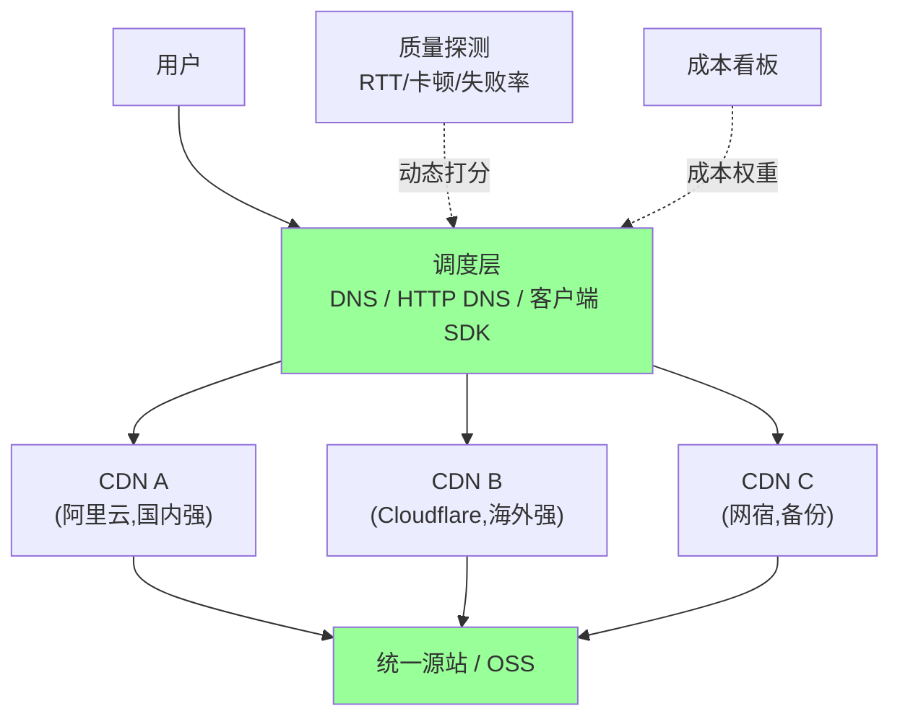
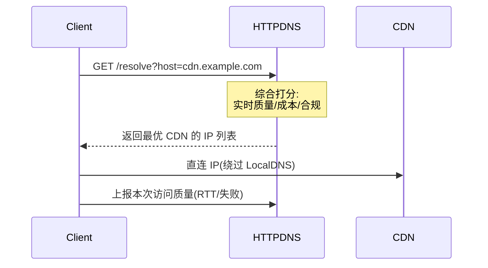

# 融合 CDN(Multi-CDN)

> 一句话:**同时接多家 CDN 厂商,通过调度系统按"质量 / 成本 / 容灾"动态分配流量**,不绑死单一供应商。
> 视频 / 直播 / 出海业务必备,B 站、字节、快手、Netflix 都在用。

## 一、为什么要融合

### 1.1 单 CDN 的痛点

| 痛点 | 典型场景 |
| --- | --- |
| **单点故障** | Cloudflare / Akamai 历史上多次全球宕机 |
| **覆盖盲区** | 某 CDN 在东南亚强,但拉美 / 中东差 |
| **成本绑架** | 单一供应商议价权弱,涨价没办法 |
| **性能波动** | CDN 节点本身也抖动,某厂商区域性掉速 |
| **合规** | 海外 CDN 不能进中国,中国 CDN 海外节点少 |
| **容量瓶颈** | 大促 / 春晚单家扛不住 |

### 1.2 融合 CDN 的价值

- **容灾**:一家挂了立刻切走
- **质量**:不同区域选最快的
- **成本**:同质量下选最便宜的
- **议价**:多家竞争,议价空间大
- **合规**:国内+海外组合分流

## 二、典型架构



## 三、调度方式

| 调度方式 | 原理 | 切换速度 | 优缺点 |
| --- | --- | --- | --- |
| **DNS 调度**(CNAME 链) | 域名解析时返回选定 CDN 的 CNAME | 分钟级 | 简单 / 受 LocalDNS 缓存影响 |
| **HTTP DNS** | 客户端 SDK 直接 HTTP 调度服务拿 IP | 秒级 | 切换快 / 需 SDK 改造 |
| **客户端 302** | 用户访问统一域名,服务端 302 到具体 CDN | 即时 | 多一次 RTT / 简单灵活 |
| **客户端 SDK 实时打分** | App 内同时探测多家,选最快 | 实时 | 最优 / SDK 复杂度高 |

主流大厂(B 站 / 抖音 / 快手)用 **HTTP DNS + 客户端实时打分** 组合。

详见 [03-routing-dispatch.md](03-routing-dispatch.md)。

### 3.1 DNS 调度示例

```
www.example.com  CNAME  sched.multicdn.com
sched.multicdn.com → 调度逻辑 →
   ├─ 国内用户  → cdn-aliyun.example.com (阿里云 CNAME)
   ├─ 海外用户  → cdn-cf.example.com    (Cloudflare CNAME)
   └─ 故障切换  → cdn-wangsu.example.com (网宿 CNAME)
```

### 3.2 HTTP DNS 流程



## 四、核心技术

### 4.1 实时质量探测

每家 CDN 持续探测,动态打分:

```text
score = w1*(1/RTT) + w2*(1-失败率) + w3*(1-卡顿率) + w4*(1/成本)
```

**探测来源**:

- **客户端上报**(最准):App 拨测各家 CDN,上报真实质量
- **服务端拨测**:多地探测点定时打 CDN
- **第三方监测**(Catchpoint / Bonree):独立第三方数据

### 4.2 调度策略

```
1. 容灾优先:某 CDN 故障率 > 阈值 → 立刻切走
2. 质量优先:同价位选 P95 最低的
3. 成本优先:质量达标范围内选最便宜的
            (国内带宽 0.1~0.3 元/GB,差异大)
4. 合规优先:内地用户必须走国内 CDN
5. 灰度优先:新接入的 CDN 先 5% 流量观察
6. 黏性:同一会话尽量不切(避免缓存 miss)
```

### 4.3 统一回源

多家 CDN 都回源到**统一源站 / OSS**,避免源站多份数据:

- 源站要扛住所有 CDN 的回源 QPS(尤其大文件冷启动)
- 配父层收敛(Tier-2 CDN)减小回源压力
- 加速回源用专线 / 专用回源网络

### 4.4 统一日志 / 监控

各家 CDN 日志格式不同 → **统一 schema 入仓**:

```
各家原始日志 → Kafka(规范化) → ClickHouse → Grafana
                                   │
                                   └─► 实时质量大盘 + 调度反馈
```

只有日志格式统一,才能跨 CDN 对比质量、做 A/B 调度。

## 五、典型业务场景

| 场景 | 用法 |
| --- | --- |
| **视频 / 直播**(B 站、抖音) | 多 CDN 实时切换,卡顿率高就换家 |
| **大文件下载**(Steam、应用商店) | 按区域选最便宜的 CDN |
| **出海业务**(TikTok、SHEIN) | 国内+海外多 CDN,合规分流 |
| **关键活动**(双 11、跨年) | 容灾备份,主 CDN 挂了立刻切 |
| **图片 / 静态资源** | 多家轮询,平均成本 |
| **API 加速** | 动态加速,挑延迟最低 |

## 六、和"主备 CDN"的区别

| | 主备 CDN | 融合 CDN |
| --- | --- | --- |
| 流量分配 | 100% 在主 CDN | 按策略分配多家 |
| 切换 | 主挂才切备 | 实时动态切 |
| 调度复杂度 | 低(健康检查 + DNS 切换) | 高(质量打分 + 调度引擎) |
| 成本 | 主 CDN 包年,备 CDN 按量 | 多家按量计费 |
| 适用规模 | 中小业务 | 视频 / 直播 / 大流量 |

## 七、自建 vs 商业融合 CDN

| | 自建 | 商业融合(MultiCDN SaaS) |
| --- | --- | --- |
| 代表 | B 站 / 字节 / Netflix | CDN77 / StackPath / NS1 / 帝联 |
| 调度引擎 | 自研 | SaaS 提供 |
| 接入成本 | 高(自研 + 探测网络) | 低(SDK 接入) |
| 灵活性 | 完全自主 | 受 SaaS 限制 |
| 适合 | 流量 > 100Gbps,有团队 | 中型业务,流量 < 50Gbps |

## 八、典型坑

| 坑 | 原因 | 修复 |
| --- | --- | --- |
| **DNS 切换慢** | LocalDNS 缓存住老 IP | 改 HTTP DNS / 客户端 SDK |
| **回源风暴** | 切换时新 CDN 缓存 miss,源站被打挂 | 切换前**预热**新 CDN |
| **缓存不一致** | A CDN 缓存旧版,B 缓存新版 | 统一 cache key + 主动刷新所有 CDN |
| **日志对不齐** | 各家字段 / 时区 / 状态码语义不同 | 统一 schema + 字段映射表 |
| **成本核算难** | 多家账单合并复杂 | 自建计费看板,按 Host / Path 拆分 |
| **签名 URL 不通用** | 各家防盗链算法不同 | 边缘脚本 / Workers 做适配 |
| **Header 透传不一致** | 各家保留 / 覆盖的 header 不同 | 关键 header 强制 cache key |
| **HTTPS 证书管理** | 多家都要传证书 | 用 ACME 自动化或证书管理 SaaS |
| **质量探测假阳性** | 探测点本地网络问题 → 误判 CDN 差 | 多探测点交叉验证 |
| **黏性丢失** | 用户被频繁切换,体验抖 | 同会话保持 5~10 分钟黏性 |

## 九、大厂案例

### 9.1 B 站

- **稳定期**:多家商业 CDN(阿里 / 腾讯 / 网宿)按区域分流
- **高峰期**:自建节点扛尖峰
- **大会员**:优先调度高质量 CDN
- 自研调度系统 + 客户端实时打分

### 9.2 字节(抖音 / TikTok)

- 商业 CDN + 自建节点混合
- 国内主用阿里 / 腾讯,海外用 Akamai / Cloudflare / 自建
- 端 + 云 + 网络全栈优化

### 9.3 Netflix Open Connect

- 完全自建 CDN,内容缓存到 ISP 机房
- 不属于"融合 CDN",但思路类似:**质量第一、成本第二**

### 9.4 中小 SaaS(典型架构)

```
单源站 + 接入 Cloudflare + 阿里云 CDN
     调度用 NS1 / DNSPod 智能解析
     国内走阿里云,海外走 Cloudflare
     成本 + 合规 + 容灾全覆盖
```

## 十、面试高频

**Q1:为什么需要融合 CDN?**

单 CDN 三大问题:**故障 / 覆盖 / 成本**。融合 CDN 通过多家组合解决,典型业务用 HTTP DNS + 客户端实时打分。

**Q2:融合 CDN 怎么调度?**

DNS 调度(分钟级)/ HTTP DNS(秒级)/ 客户端 SDK 实时打分(实时)。大厂用 SDK + HTTP DNS 组合。

**Q3:多 CDN 切换的最大风险?**

**回源风暴**:切到新 CDN 后缓存全 miss,源站被打挂。修复:切换前预热新 CDN。

**Q4:多 CDN 怎么保证缓存一致?**

- 统一 cache key 设计(query 参数白名单 / 排序)
- 主动刷新时**广播到所有 CDN**(每家 API 都要调)
- 用版本号 / 内容指纹做 cache busting

**Q5:融合 CDN vs 主备 CDN?**

主备:100% 在主,挂了切备(被动)。
融合:实时按策略分流(主动),容灾 + 质量 + 成本三合一。

## 十一、一句话总结

> **融合 CDN = 多 CDN 厂商 + 实时调度系统**;
>
> 解决"**单 CDN 故障 / 覆盖 / 成本**"三大痛点;
>
> 核心:**HTTP DNS 调度 + 实时质量打分 + 统一回源 + 统一日志**;
>
> 视频 / 直播 / 出海业务必备,中小业务用主备就够;
>
> 切换最大风险是**回源风暴**,必须**预热**;多 CDN 缓存一致性靠**统一 cache key + 主动刷新广播**。
