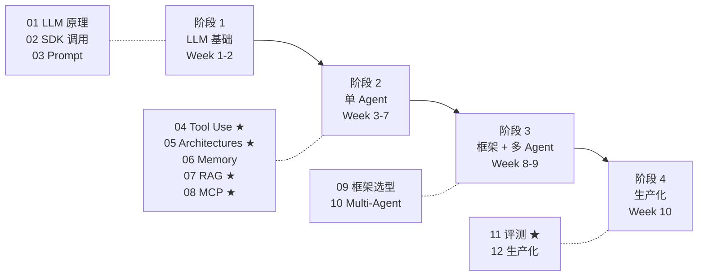

# Agent 开发 0→1 学习路线图

> **8 年后端工程师视角**,Go 主战场,补 AI / Agent 工程能力,目标是 8 周内能独立做出生产级 multi-agent。
>
> 本文是 [`12-ai/`](README.md) 的入口和导航,每章学完都给"能不能"验收清单。

## 〇、写在最前面:Agent 开发的本质是什么

> **Agent = LLM + Tool + Memory + Loop**

```
传统软件:    输入 → 确定性函数 → 输出
LLM 应用:    输入 → LLM → 输出(一次性)
Agent:       输入 → LLM → Tool → 观察 → LLM → ... → 输出(循环 + 决策)
```

**4 大支柱**:

| 支柱 | 是什么 | 决定什么 |
| --- | --- | --- |
| **LLM** | 大脑(reasoning + planning) | Agent 智商上限 |
| **Tool** | 手脚(action / 调用世界) | Agent 能做什么事 |
| **Memory** | 上下文管理(短期 + 长期) | Agent 能处理多复杂任务 |
| **Loop** | 控制流(ReAct / Plan / Reflexion) | Agent 能不能自主完成任务 |

**搞清楚这四件事,你就懂了 90% 的 agent 开发**。

---

## 一、4 阶段全景图



## 二、8 周详细计划(8 年后端节奏)

> 假设每周可投入 10-15 小时(下班 + 周末),边学边写代码。

### Week 1-2:LLM 基础

**学**:
- [ ] LLM 工作机制:token / context window / 温度 / top-p
- [ ] 模型选型:Claude(Opus/Sonnet/Haiku) vs GPT(4o/4o-mini) vs Gemini vs 开源(Llama/Qwen)
- [ ] 计费 + 成本:input/output token / cache / 批量 API
- [ ] Anthropic SDK(Go + Python)/ OpenAI SDK / Vertex AI / Bedrock
- [ ] 流式响应 / 多模态(image / pdf)/ 结构化输出
- [ ] Prompt 进阶:Zero-shot / Few-shot / CoT / Self-Consistency / ReAct
- [ ] XML 标签 / JSON Schema / 结构化输出强约束
- [ ] Constitutional AI / 安全 prompt

**做**:
- ✓ Go 调通 `anthropic-sdk-go` 流式输出
- ✓ Python 调通 `langchain-anthropic` 结构化输出
- ✓ 比较同一 prompt 在 Opus / Sonnet / Haiku 的成本+质量差异
- ✓ 写一个翻译/总结脚本,用 few-shot + CoT 优化输出

**验收**:
- [ ] 能讲清楚 token / context window / 温度对输出的影响
- [ ] 能给业务场景选合适的模型(给依据,不是拍脑袋)
- [ ] 能用 XML/JSON Schema 强约束 LLM 输出格式
- [ ] 看到一个 prompt 能说出它用了哪些技巧

**对应文档**:01-llm-fundamentals / 02-api-basics / 03-prompt-engineering

---

### Week 3-4:Tool Use(Agent 的"手脚")

**学**:
- [ ] Tool / Function Calling 机制:Claude vs OpenAI 协议差异
- [ ] Tool Schema 设计:JSON Schema / 参数描述 / 错误返回
- [ ] 并行调用(parallel tool use)/ 串行依赖
- [ ] 工具失败重试 + LLM 自我纠错
- [ ] Tool security:权限边界 / sandbox / 危险操作确认
- [ ] Computer Use(Claude 3.5 + 后)/ 视觉 Tool

**做**:
- ✓ 写 3 个工具:`get_weather` / `query_db` / `send_email`
- ✓ 让 LLM 自主决定调用顺序(并行+串行)
- ✓ 模拟 tool 失败,看 LLM 怎么重试
- ✓ 完成"查天气 + 根据天气推荐穿搭 + 发邮件"完整链路

**验收**:
- [ ] 能写一个新工具并让 LLM 正确调用
- [ ] 能讲清并行 tool use 的应用场景
- [ ] 知道哪些操作必须人工确认(写文件 / 发消息 / 删数据)

**对应文档**:04-tool-use-function-calling

---

### Week 5:Agent 架构(Agent 的"大脑回路")

**学**:
- [ ] **ReAct**(Reasoning + Acting)— 最基础也最重要
- [ ] **Plan-and-Execute** — 先规划再执行,适合长任务
- [ ] **Reflexion** — 自我反思 + 改进
- [ ] **Tree of Thoughts**(ToT)— 分支探索 + 投票
- [ ] **Self-Refine** / **Chain-of-Verification**(CoVe)
- [ ] 经典 agent 项目读源码:AutoGPT / BabyAGI / Voyager / SWE-agent

**做**:
- ✓ 手写一个 ReAct loop(不用框架,纯 SDK)
- ✓ 改造成 Plan-and-Execute 版本,对比效果
- ✓ 加 Reflexion:失败时让 LLM 总结教训写进 prompt

**验收**:
- [ ] 能在白板上画出 ReAct 循环
- [ ] 知道什么任务适合 ReAct,什么适合 Plan-and-Execute
- [ ] 读完 ReAct 论文(Yao et al. 2022)能讲清核心思想

**对应文档**:05-agent-architectures

---

### Week 6:Memory + RAG(Agent 的"知识")

**学**:
- [ ] 短期记忆:messages 窗口 / sliding window / summary buffer
- [ ] 长期记忆:向量库(Chroma/Weaviate/pgvector/Milvus)+ KV
- [ ] **RAG 4 件套**:Chunking / Embedding / Retrieval / Rerank
- [ ] Chunking 策略:fixed / semantic / parent-child / hierarchical
- [ ] Embedding 选型:text-embedding-3 / bge-m3 / Cohere
- [ ] 检索:向量 / BM25 / 混合 / metadata 过滤
- [ ] Rerank:cross-encoder / Cohere Rerank
- [ ] **GraphRAG**(Microsoft)/ **Self-RAG**(自评估)
- [ ] 评测:Hit@K / MRR / RAGAS

**做**:
- ✓ 用 pgvector 建一个文档库(把你的 interview_note 整库灌进去)
- ✓ 写一个"问 interview_note 的 agent",支持引用源
- ✓ 加上 Rerank,对比检索质量
- ✓ 用 RAGAS 跑一遍评测

**验收**:
- [ ] 能讲清楚 chunking 不同策略的优劣
- [ ] 知道为啥要 Rerank(向量召回的局限)
- [ ] 能给业务选合适的向量库
- [ ] 能跑出 RAG 的检索准确率数据

**对应文档**:06-memory-and-context / 07-rag-engineering

---

### Week 7:MCP 协议(2025 业界标准)

**学**:
- [ ] **MCP**(Model Context Protocol)是什么 / Anthropic 主推
- [ ] MCP 架构:Server / Client / Resources / Tools / Prompts
- [ ] MCP 传输:stdio / HTTP+SSE / streamable HTTP
- [ ] MCP 生态:官方 server(GitHub/Slack/Postgres)/ 社区
- [ ] MCP vs LangChain Tool / OpenAI Plugin 对比

**做**:
- ✓ 在 Claude Desktop 连 GitHub MCP server,操作一个 repo
- ✓ 写一个自己的 MCP server(Go 或 Python),暴露 interview_note 查询能力
- ✓ 让 Claude Code 通过你的 MCP server 查知识库

**验收**:
- [ ] 能讲清 MCP 解决什么问题(为啥不是又一个 LangChain)
- [ ] 能从零写一个 MCP server
- [ ] 知道 MCP 在 agent 生态的位置

**对应文档**:08-mcp-protocol

---

### Week 8:Agent 框架(挑一个深用)

**学**(全部对比 + 至少精通一个):

| 框架 | 语言 | 定位 | 推荐 |
| --- | --- | --- | --- |
| **LangChain** | Python | 全家桶老牌 | 知道但少用(过度抽象) |
| **LangGraph** | Python | 状态机 / DAG | ⭐ Python 首选 |
| **LlamaIndex** | Python | RAG 之王 | RAG 场景用 |
| **AutoGen** | Python | Microsoft / Multi-agent | 多 agent 场景 |
| **CrewAI** | Python | 角色化多 agent | demo 友好 |
| **Dify / Coze** | 平台 | 低代码 agent 平台 | 业务原型 |
| **Eino**(字节)| **Go** | LangChain Go 版 | ⭐ **Go 首选** |
| **anthropic-sdk-go** | Go | 原生 SDK | 轻量场景 |

**做**:
- ✓ 用 LangGraph 重写 Week 3-7 的 agent
- ✓ 用 Eino 重写一遍(Go 版本)
- ✓ 对比两个版本的代码量、可维护性、性能

**验收**:
- [ ] 能讲清 LangGraph 状态机的优势(vs LangChain Chain)
- [ ] 知道选框架要看什么(团队语言 / 多 agent / 可观测性 / 部署)

**对应文档**:09-agent-frameworks

---

### Week 9:Multi-Agent(高阶)

**学**:
- [ ] **Supervisor / Orchestrator 模式**(LangGraph 主推)
- [ ] **Hierarchical**(团队 + 子团队)
- [ ] **Swarm**(OpenAI Swarm / 同级协作)
- [ ] **GroupChat**(AutoGen 风格)
- [ ] Agent 通信协议:消息总线 / 共享 state / channel
- [ ] 任务分配:Router / Voting / Auction
- [ ] 冲突解决 + 死锁检测
- [ ] Generative Agents(Stanford 小镇)论文

**做**:
- ✓ 用 LangGraph 实现 Supervisor 模式:planner + coder + tester + reviewer 4 agent 写代码
- ✓ 模拟一次 agent 之间观点冲突的场景,看怎么仲裁

**验收**:
- [ ] 能讲清 4 种 multi-agent 模式的适用场景
- [ ] 知道为啥 multi-agent 容易死循环 / 烧 token
- [ ] 知道什么场景**不该**用 multi-agent(很多场景一个 agent 就够)

**对应文档**:10-multi-agent-orchestration

---

### Week 10:评测 + 生产化(决定能不能上)

**学**:
- [ ] **Golden Set**(人工标注的标准集)— 评测基石
- [ ] **LLM-as-Judge**(GPT-4 当裁判)+ 偏见 + 校准
- [ ] **Trajectory 评测**(agent 走的路径对不对)
- [ ] Promptfoo / DeepEval / LangSmith / LangFuse
- [ ] A/B 测试 + 回归测试
- [ ] **Guardrails**:输入过滤 / 输出过滤 / NVIDIA NeMo Guardrails
- [ ] **可观测**:LangSmith / LangFuse / Helicone / OpenTelemetry
- [ ] **成本控制**:cache / batch / 模型路由(简单走 Haiku)
- [ ] **安全**:prompt injection / jailbreak / 数据泄漏
- [ ] 失败重试 / 限流 / 熔断

**做**:
- ✓ 给 Week 6 的 RAG agent 建一套 Golden Set
- ✓ 接入 LangFuse / LangSmith,看 trajectory 和成本
- ✓ 加 Guardrails:拒答涉及 PII / 不在知识库的问题
- ✓ 跑一次 prompt injection 攻击 + 防御

**验收**:
- [ ] 能跑出 agent 的准确率、平均成本、P99 延迟
- [ ] 能讲清 prompt injection 的常见攻击 + 防御
- [ ] 能用 LangSmith 找出 agent 走错路径的 case

**对应文档**:11-evaluation-and-testing / 12-production-engineering

---

## 三、3 个实战项目(必须做)

```
项目 1 (Week 4 完成):
  Single Agent + Tool
  例:一个能查天气、订机票、发邮件的旅行助手 agent
  价值:吃透 Tool Use + ReAct

项目 2 (Week 6 完成):
  RAG Agent
  例:把你的 interview_note 灌进去,做"问我面试题"的 agent,带引用
  价值:吃透 chunking / embedding / 检索 / 评测

项目 3 (Week 10 完成):
  Multi-Agent 自动化
  例:接到一个 GitHub Issue → planner 拆任务 → coder 写代码
       → tester 跑测试 → reviewer 评审 → 提 PR
  价值:吃透 Multi-agent 编排 + 生产化(成本/失败/可观测)
```

> 这 3 个项目做完,你已经超过 90% 简历写"做过 agent"的工程师。

## 四、推荐学习资料(精选)

### 必读

- **Anthropic Cookbook**:[github.com/anthropics/anthropic-cookbook](https://github.com/anthropics/anthropic-cookbook) — 官方最佳实践
- **Anthropic Build with Claude 教程**:[docs.anthropic.com](https://docs.anthropic.com)
- **DeepLearning.ai 短课**:
  - Functions, Tools and Agents with LangChain
  - LangGraph
  - Building Agentic RAG with LlamaIndex
  - Multi-AI Agent Systems with crewAI

### 经典论文(P2,看完能吹牛)

| 论文 | 年份 | 核心 |
| --- | --- | --- |
| **ReAct: Synergizing Reasoning and Acting** | 2022 | Reasoning + Acting 交替 |
| **Reflexion** | 2023 | 自我反思 + 改进 |
| **Tree of Thoughts** | 2023 | 树形探索 |
| **Voyager**(Minecraft agent)| 2023 | 终身学习 + 技能库 |
| **Generative Agents**(Stanford 小镇) | 2023 | 多 agent 模拟 |
| **MemGPT** | 2023 | 操作系统视角的 memory |
| **SWE-agent** | 2024 | 自动修 GitHub Issue |

### 优质博客

- **Anthropic Engineering Blog**:tool use / agent / context
- **Lilian Weng**(OpenAI):[lilianweng.github.io](https://lilianweng.github.io) — Agent 综述神文
- **Simon Willison**:[simonwillison.net](https://simonwillison.net) — 每周 AI 动态
- **LangChain Blog**:LangGraph / 框架进展

### 中文资源

- **Eino 官方文档**(字节):github.com/cloudwego/eino
- **Datawhale Agent 课程**
- **MCP 中文社区**

## 五、关键对照表(背下来)

### Single vs Multi-agent 选择

```
单 agent 能搞定 → 别上多 agent
任务能并行 / 角色明确 / 需要多视角辩论 → multi-agent
```

### 框架选择

| 你的情况 | 推荐 |
| --- | --- |
| Go 后端 + 公司没历史包袱 | **Eino** + anthropic-sdk-go |
| Python 团队 + 需要状态机 | **LangGraph** |
| 重 RAG | **LlamaIndex** |
| Multi-agent 优先 | **AutoGen** 或 LangGraph Supervisor |
| 业务 PM 也参与 / 低代码 | **Dify** |

### 何时**不要**用 agent

```
× 任务确定性强 + 不需要工具 → 直接调 LLM
× 一次完成不需要循环 → workflow 比 agent 简单
× 高频低成本场景 → agent 烧 token 烧不起
× 强一致性要求 → agent 不稳定
```

## 六、衡量"你学到家了"的标准

```
P0 标准(2 个月达标):
  □ 能用 SDK 从 0 写一个 ReAct agent(不用框架)
  □ 能讲清 Tool Use 的协议细节
  □ 能给 RAG 加 Rerank 并跑出准确率提升数据
  □ 能写一个 MCP server
  □ 能给 agent 建评测集 + 看 trajectory

P1 标准(3-4 个月):
  □ 能精通至少一个框架(LangGraph 或 Eino)
  □ 能设计 multi-agent 协作 + 处理冲突
  □ 能接 LangSmith / LangFuse 做可观测
  □ 能讲清 prompt injection 防御
  □ 能跑出 agent 的成本 / 延迟 / 准确率三件套

P2 标准(资深):
  □ 读过 ReAct/Reflexion/Voyager 论文能讲
  □ 能给业务做"用不用 agent"的决策(知道边界)
  □ 能优化 agent 的 token 成本到 1/10
  □ 能给团队做 agent 开发规范
```

---

> **写在最后**:Agent 开发本质是 **prompt + tool + loop + 工程化**——
> LLM 不是炼丹(那是模型团队的事),你的核心竞争力是**把 LLM 能力工程化、可评测、可上线**。
> 8 年后端的工程思维(可观测 / 容灾 / 限流 / 成本)在这里是大杀器,**别丢**。
