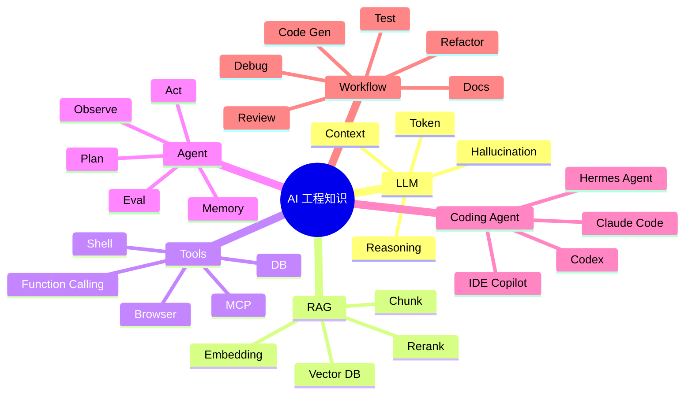
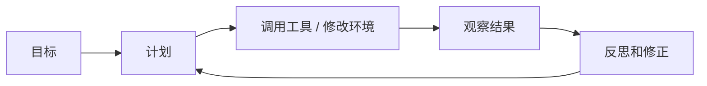

# AI / LLM / Agent 知识地图

> 程序员理解 AI，不需要先钻数学细节；更重要的是知道模型、上下文、工具、数据、评估和工程边界如何协作。

## 一、整体地图



## 二、几个核心概念

### 1. LLM

LLM 是大语言模型，输入文本 token，输出下一个 token 的概率分布。对程序员来说，重点不是背公式，而是理解：

- 它依赖上下文。
- 它不天然知道你的仓库。
- 它可能幻觉。
- 它需要工具来观察真实世界。
- 它需要测试和反馈来纠偏。

### 2. RAG

RAG 是 Retrieval-Augmented Generation，检索增强生成。

```text
用户问题
  -> 检索相关文档
  -> 把文档片段放进上下文
  -> 模型基于上下文回答
```

适合：

- 企业知识库。
- 文档问答。
- 代码库问答。
- 规章制度查询。

不适合：

- 复杂事务操作。
- 需要多步执行的任务。
- 源文档本身质量差的场景。

### 3. Tool Calling

Tool Calling 是让模型调用外部工具。

常见工具：

- 搜索。
- 读写文件。
- 执行命令。
- 查数据库。
- 调 API。
- 调浏览器。

本质：

> 模型负责判断和组织，工具负责获取事实或执行动作。

### 4. Agent

Agent 比普通聊天机器人多了循环：



Agent 的能力取决于：

- 模型能力。
- 工具能力。
- 上下文质量。
- 记忆和知识沉淀。
- 评估和反馈。
- 权限和安全边界。

## 三、程序员视角的 AI 分层

| 层次 | 代表 | 解决什么 |
| --- | --- | --- |
| Chat | ChatGPT、Claude 对话 | 问答、解释、生成片段 |
| IDE Copilot | 补全、inline edit | 局部代码生成 |
| CLI Agent | Claude Code、Codex CLI | 读仓库、改文件、跑测试 |
| Cloud Agent | Codex Cloud 等 | 后台任务、并行 PR |
| Workflow Agent | 自定义 Skills / MCP | 固化团队流程 |

## 四、常见误区

- 以为模型越强就不需要上下文。
- 以为 prompt 写长就一定好。
- 以为 Agent 能自动完成所有任务。
- 以为 AI 写的代码不需要 review。
- 以为 RAG 能解决所有幻觉。
- 以为把工具权限全打开就更高效。

## 五、面试表达

```text
我理解 AI 工程可以分成模型、上下文、工具和反馈四层。
模型负责生成和推理，上下文决定它看到什么，工具让它能观察和执行真实系统，反馈和评估负责纠错。
普通 ChatBot 主要是问答，Agent 则会围绕目标进行计划、调用工具、观察结果并迭代。
程序员使用 Coding Agent 时，关键不是让它自由发挥，而是给清晰任务、边界、测试和验收标准。
```
