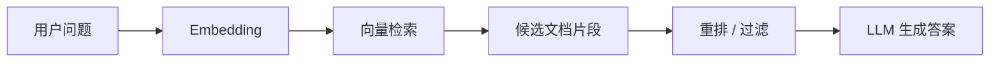
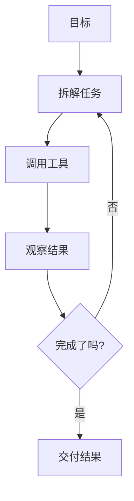

# LLM 与 Agent 核心原理

> 理解 LLM 和 Agent 的边界，才能知道什么时候该相信、什么时候该验证、什么时候该给工具和上下文。

## 一、LLM 基础

### 1. Token

模型处理的不是字符，而是 token。

```text
文本 -> tokenizer -> token 序列 -> 模型预测下一个 token
```

影响：

- 上下文窗口按 token 计算。
- 中文、代码、符号的 token 数不等于字符数。
- 长上下文会增加成本和延迟。

### 2. 上下文窗口

上下文窗口是模型一次能看到的信息范围。

包括：

- 系统指令。
- 用户问题。
- 历史对话。
- 工具结果。
- 文档片段。
- 代码内容。

关键点：

> 模型只能基于当前上下文和参数中的知识回答。仓库文件没放进上下文，模型就不知道。

### 3. 幻觉

幻觉来自：

- 训练知识不完整。
- 上下文不足。
- 问题本身有歧义。
- 模型倾向生成流畅答案。
- 没有工具验证事实。

减少幻觉：

- 提供来源。
- 使用检索。
- 让模型调用工具。
- 要求引用文件和行号。
- 用测试和执行结果验证。

## 二、RAG 原理



关键环节：

- 文档切块。
- Embedding。
- 向量检索。
- 重排。
- 引用和回答。

RAG 的瓶颈：

- 切块不合理。
- 检索召回差。
- 检索结果过多或噪声大。
- 文档过时。
- 模型没有遵循来源。

## 三、Tool Calling 原理

Tool Calling 让模型输出结构化工具调用：

```text
模型判断需要查文件
  -> 调用 read_file
  -> 获得结果
  -> 继续推理
```

工具调用解决：

- 最新信息。
- 私有数据。
- 文件系统。
- 命令执行。
- 数据库查询。
- API 操作。

风险：

- 工具权限过大。
- 错误命令。
- 数据泄漏。
- 对工具结果误读。

## 四、Agent 循环

Agent 是目标驱动的多步循环：



Agent 成功的关键：

- 明确目标。
- 可执行工具。
- 可观察反馈。
- 可验证完成条件。
- 错误恢复能力。

## 五、Coding Agent 为什么特殊

Coding Agent 不只是生成代码，它还要：

- 读项目结构。
- 理解已有模式。
- 修改多个文件。
- 运行测试。
- 处理失败。
- 生成提交或 PR。

所以它需要：

- 文件读写权限。
- 命令执行权限。
- Git 上下文。
- 项目说明文档。
- 测试和 lint。

## 六、常见坑

- 只让 AI 写代码，不让它读上下文。
- 不给验收标准。
- 不让它跑测试。
- 大任务一次性扔给模型。
- 让 Agent 改安全敏感代码但不给边界。
- 工具权限过大，没有审批。

## 七、面试表达

```text
LLM 本质上基于上下文生成 token，所以它不是数据库，也不是天然可靠的事实源。
RAG 是把外部文档检索出来放进上下文，Tool Calling 是让模型能调用外部系统获取事实或执行动作。
Agent 则是在目标驱动下反复计划、调用工具、观察结果并修正。
Coding Agent 的关键能力是读仓库、改文件、跑测试和处理反馈。
所以工程使用 AI 时，核心是上下文、工具、约束和验证，而不是只写一个 prompt。
```
