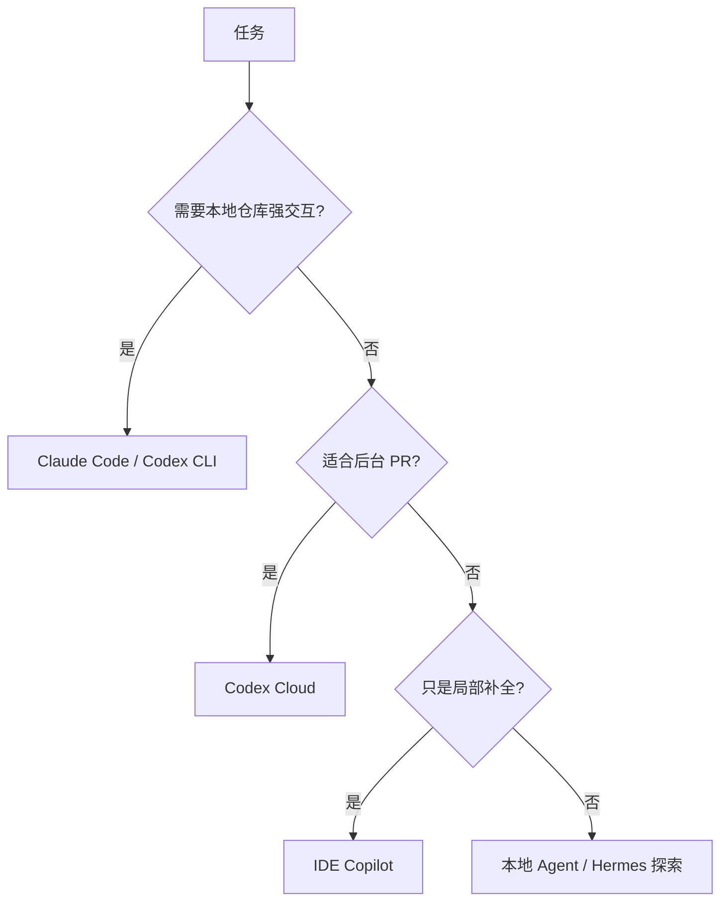

# Coding Agent 对比：Claude Code、Codex、Hermes Agent

> Coding Agent 的差异不只是“哪个模型更聪明”，还包括运行位置、工具权限、项目上下文、长期记忆、团队协作和安全边界。

## 一、对比总览

| 工具 | 主要定位 | 适合场景 | 风险点 |
| --- | --- | --- | --- |
| Claude Code | Anthropic 的 agentic coding 工具，覆盖终端、IDE、桌面和浏览器 | 读仓库、改文件、跑命令、日常开发任务 | 权限控制、上下文管理、验证成本 |
| OpenAI Codex | OpenAI 的 coding agent，支持本地 CLI/IDE 和云端任务 | 编码、理解代码、重构、review、后台并行任务 | 任务边界、沙箱权限、PR review |
| Hermes Agent | Nous Research 的开源自改进 Agent | 本地/服务器持久 Agent、长期记忆、技能自演化 | 新生态、稳定性、权限与安全 |
| IDE Copilot | 编辑器内补全和局部改写 | 小范围代码补全、样板代码 | 不适合复杂跨文件任务 |

## 二、Claude Code

Claude Code 的重点：

- 理解代码库。
- 编辑文件。
- 运行命令。
- 集成开发工具。
- 支持 skills 扩展能力。

适合：

- 修 bug。
- 跨文件重构。
- 写测试。
- 解释陌生代码。
- 自动化重复开发流程。

使用建议：

- 先让它阅读相关文件。
- 给明确任务范围。
- 要求列出改动文件。
- 要求运行测试。
- 对安全敏感操作保留人工审批。

## 三、OpenAI Codex

Codex 的重点：

- 可作为本地 coding agent。
- 可在云端后台执行任务。
- 支持并行任务和 PR 工作流。
- 支持 AGENTS.md 项目说明和 skills。

适合：

- 多任务并行开发。
- 代码审查。
- 重构迁移。
- 写文档和测试。
- 理解大型仓库。

使用建议：

- 用 AGENTS.md 固化项目规范。
- 用 skills 固化重复流程。
- 给明确完成标准。
- 要求验证命令。
- 云端任务适合独立 PR，不适合需要即时交互的模糊任务。

## 四、Hermes Agent

Hermes Agent 更偏开源、自托管、长期运行 Agent。

关键词：

- 开源。
- 持久记忆。
- 自改进。
- 技能学习。
- 多工具和消息入口。

适合探索：

- 个人长期助手。
- 自托管 Agent。
- 持续积累项目知识。
- 自动整理技能和工作流。

注意：

- 生态变化很快。
- 企业使用要重点评估权限、安全、数据边界。
- 自改进能力听起来很强，但生产使用必须有审计和回滚。

## 五、怎么选



选择原则：

- 小改动：IDE Copilot。
- 中等跨文件任务：Claude Code / Codex CLI。
- 独立任务并行推进：Codex Cloud。
- 自托管和长期记忆探索：Hermes Agent。
- 团队工程化：AGENTS.md + Skills + MCP + CI 验证。

## 六、面试表达

```text
我不会只按模型强弱比较 Coding Agent，而会看运行环境、工具权限、项目上下文和验证闭环。
IDE Copilot 适合局部补全；Claude Code 和 Codex CLI 更适合读仓库、跨文件修改和跑测试；
Codex Cloud 适合后台并行任务和 PR；Hermes Agent 更像自托管、长期记忆和自改进方向的探索。
真正落地时，关键是项目说明、任务边界、测试验证、权限审批和代码 review。
```

## 七、参考资料

- OpenAI Codex 官方文档。
- OpenAI Codex Skills 官方文档。
- Anthropic Claude Code 官方文档。
- Anthropic Claude Code Skills 官方文档。
- Nous Research Hermes Agent / Hermes 3 技术资料。
