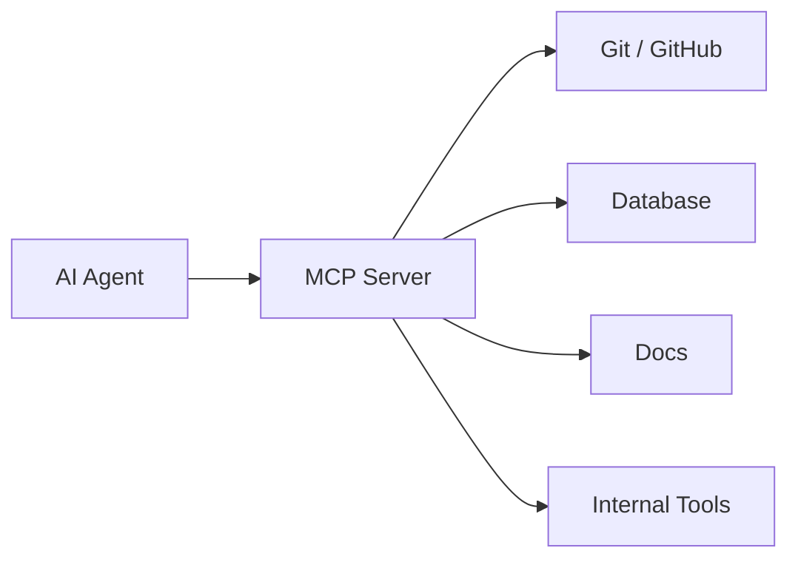

# Skills、MCP、AGENTS.md

> AI 更好用的关键不是每次写更长 prompt，而是把项目规范、工具接口和重复流程沉淀成可复用上下文。

## 一、三者分别解决什么

| 机制 | 解决问题 | 类比 |
| --- | --- | --- |
| AGENTS.md / CLAUDE.md | 项目级长期说明 | 新人入职手册 |
| Skills | 特定任务的可复用流程 | 专家操作手册 |
| MCP | 让模型连接外部工具和数据 | 标准化工具接口 |

## 二、AGENTS.md 怎么写

适合写：

- 项目结构。
- 编码规范。
- 测试命令。
- 提交流程。
- 禁止事项。
- 安全边界。
- 常见排障命令。

不适合写：

- 巨量业务文档。
- 过期命令。
- 模糊口号。
- 与实际代码不一致的规范。

推荐结构：

```markdown
# 项目说明

## 架构
## 常用命令
## 编码规范
## 测试要求
## 安全边界
## 完成标准
```

## 三、Skill 是什么

Skill 是一个可被 Agent 按需加载的能力包。

通常包含：

```text
skill-name/
  SKILL.md
  scripts/
  references/
  assets/
```

适合沉淀：

- 代码评审流程。
- 发布流程。
- 数据分析流程。
- 事故复盘模板。
- 特定框架脚手架。
- 团队 API 使用规范。

Skill 比 prompt 更好，因为：

- 可版本化。
- 可复用。
- 可共享。
- 可包含脚本和模板。
- 可以按任务自动触发。

## 四、MCP 是什么

MCP 可以理解为 Agent 连接外部系统的标准接口。



适合：

- 连接内部文档。
- 查询数据库。
- 调用公司工具。
- 操作 issue / PR。
- 接入搜索、监控、工单。

风险：

- 权限过大。
- 数据泄漏。
- 工具误操作。
- 审计缺失。

## 五、程序员如何用好 Skills

### 1. 把重复流程沉淀成 Skill

例如：

- “写一个 Go HTTP 接口”。
- “给服务补 Prometheus 指标”。
- “排查 MySQL 慢 SQL”。
- “写系统设计文档”。
- “做代码 review”。

### 2. Skill 要短而明确

好的 Skill：

- 触发条件清楚。
- 步骤明确。
- 文件边界明确。
- 有完成标准。
- 引用必要脚本和模板。

差的 Skill：

- 什么都管。
- 大量抽象口号。
- 和项目事实不一致。
- 没有验收标准。

## 六、一个实用 Skill 模板

```markdown
---
name: code-review
description: Use when reviewing backend code changes for bugs, regressions, missing tests, and production risks.
---

# Code Review

## Focus
- Correctness
- Data consistency
- Error handling
- Observability
- Tests

## Process
1. Inspect diff.
2. Identify behavior changes.
3. Check failure paths.
4. Check tests.
5. Report findings by severity.

## Output
- Findings first.
- File and line references.
- No praise-only review.
```

## 七、常见坑

- AGENTS.md 写得太长，模型抓不住重点。
- Skill 触发描述太模糊。
- MCP 工具权限过大。
- 没有审计和审批。
- Skill 过期但没人维护。
- 把业务秘密直接塞进通用 Skill。

## 八、面试表达

```text
我会把 AI 使用分成三层：AGENTS.md 放项目长期规范，Skills 放可复用任务流程，MCP 连接真实工具和数据。
这样 Agent 不需要每次重新解释团队规范，也能在受控权限下执行任务。
但这些机制都要有边界：说明要简洁，Skill 要可维护，MCP 要做权限、审计和审批。
```
