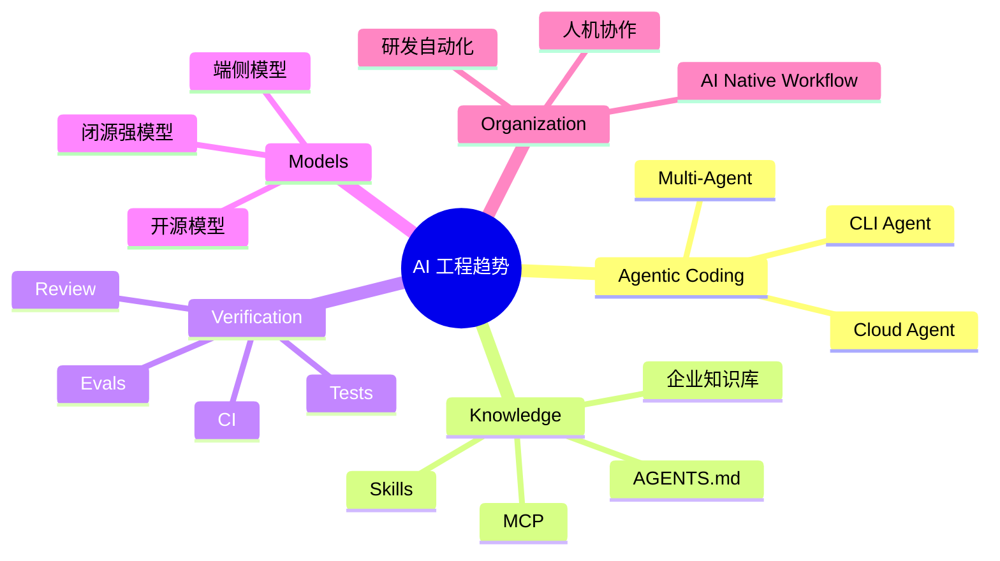

# AI 工程未来展望

> AI 对程序员的影响，不是简单替代编码，而是把软件工程从“手写代码”推向“定义目标、约束、验证和组织知识”。

## 一、趋势总览



## 二、Agentic Coding

未来编码会从：

```text
人逐行写代码
```

变成：

```text
人定义目标、边界和验收
Agent 读仓库、改代码、跑测试、提交 PR
人 review 和做关键判断
```

开发者价值会更多体现在：

- 拆任务。
- 定边界。
- 设计架构。
- 识别风险。
- 建验证体系。
- 沉淀团队知识。

## 三、CLI、IDE、Cloud Agent 分工

| 形态 | 适合 |
| --- | --- |
| IDE Copilot | 局部补全、快速改一小段 |
| CLI Agent | 读仓库、跨文件修改、运行命令 |
| Cloud Agent | 后台任务、并行 PR、批量修复 |
| Persistent Agent | 长期记忆、持续项目助手 |

未来不会只有一个入口，而是多形态协作。

## 四、Skills 会越来越重要

团队真正的壁垒不是 prompt，而是：

- 业务知识。
- 代码规范。
- 排障经验。
- 发布流程。
- Review 标准。
- 系统设计模板。

这些都可以沉淀成：

- AGENTS.md。
- Skills。
- MCP 工具。
- 内部知识库。

未来优秀团队会维护自己的 AI 工程资产。

## 五、评估会变成核心能力

AI 生成越多，验证越重要。

需要：

- 单元测试。
- 集成测试。
- 回归测试。
- 静态检查。
- 安全扫描。
- AI eval。
- 人工 review。

一句话：

> 没有验证体系，AI 只会更快地产生不确定性。

## 六、开源模型与闭源模型共存

闭源强模型：

- 推理和代码能力强。
- 工具链成熟。
- 成本和数据边界要评估。

开源 / 本地模型：

- 可私有化。
- 可定制。
- 成本可控。
- 能力和运维成本要评估。

可能格局：

- 核心复杂任务用强闭源模型。
- 私有数据、端侧、批量低成本任务用开源模型。
- 企业通过路由层按任务选择模型。

## 七、程序员该提升什么

更重要的能力：

- 系统设计。
- 需求澄清。
- 代码审查。
- 测试设计。
- 数据一致性。
- 安全意识。
- 工程自动化。
- 用 AI 沉淀知识。

会被放大的短板：

- 需求不清。
- 不会验证。
- 不懂架构。
- 不懂线上风险。
- 不会拆任务。

## 八、面试表达

```text
我认为 AI 对程序员的改变不是简单替代写代码，而是把工程重心前移到目标定义、约束设计和验证体系。
未来 IDE 补全、CLI Agent、Cloud Agent 和长期记忆 Agent 会分工协作。
团队会把编码规范、发布流程、排障经验沉淀成 AGENTS.md、Skills 和 MCP 工具。
程序员更应该提升系统设计、测试验证、代码审查和风险控制能力，因为 AI 会放大这些能力，也会放大这些短板。
```
