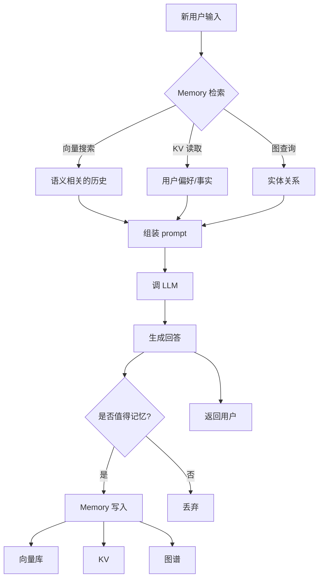

# Memory 和上下文管理(Agent 的"记忆")

> Agent 的核心难题之一:**LLM 只有上下文窗口这个"当下记忆",没有跨会话的持久记忆**——所以所有 agent memory 方案都在解决"如何在有限窗口 + 无天生长期记忆"下让 agent 表现得像有记忆。
>
> 本章讲透 **短期记忆(messages 管理)/ 长期记忆(向量+KV+图)/ 摘要压缩 / Memory 类型学 / 生产级方案**——每一条都直接影响 agent 的连续对话质量、任务连贯性、个性化能力。
>
> 前置:[01-llm-fundamentals](01-llm-fundamentals.md)(context window 概念)/ [05-agent-architectures](05-agent-architectures.md)(ReAct 循环上下文)

## 〇、核心提炼(5 段式)

### 核心机制(6 条必背)

1. **LLM 天生无长期记忆**——每次调用只看到 messages 数组,窗口外的都"失忆"
2. **两大 Memory 层**:**短期(会话内 / 上下文窗口)** + **长期(跨会话 / 外部存储)**
3. **短期 Memory 的三种压缩策略**:**滑窗 / 摘要 / 重要性评分保留**
4. **长期 Memory 的四种存储**:**向量库(语义)/ KV(结构化)/ 知识图谱(关系)/ 全文索引(BM25)**
5. **Memory 是"写 + 读 + 更新"三位一体**——不只是 "存",还要在合适时机检索、合并、遗忘
6. **上下文膨胀是 agent 头号杀手**——20 轮 ReAct 后 messages 几万 token,又贵又慢又忘目标,必须压缩

### 核心本质(必懂)

> Memory 的本质是 **"用外部状态弥补 LLM 无状态的本质"**——
> LLM 每次调用是**无状态函数**(纯函数,同 input 同 output),没有内部记忆;
> 所有"看起来有记忆"的 agent,都是靠**在下一次调用的 prompt 里塞入历史信息**实现的。
>
> 这决定了几个铁律:
> - **Memory = 主动的 prompt 注入**——不是 LLM 自己"记住",是应用把它塞进 prompt
> - **有限窗口是硬约束**——不是 memory 越多越好,塞不进就要压缩
> - **和 RAG 是同一件事的两面**——RAG 是"从知识库检索",Memory 是"从对话历史检索",技术栈几乎一样
> - **Memory 也会幻觉**——从长期 memory 检索出来的可能是过时/错误信息,LLM 照单全收
>
> **Memory 不是 magic,是精心设计的 prompt 工程**。

### 完整流程(以 ReAct 长任务为例)

```
Agent 循环 20 轮后 messages 已经 30K tokens:
  ↓
【Memory 管理触发条件】
  条件 1: messages token 数超阈值(如 20K)
  条件 2: 每 N 轮固定检查
  条件 3: 用户显式请求"清理记忆"
  ↓
【短期 Memory 压缩】
  ├─ 保留:最近 5 轮完整 messages(细节)
  ├─ 摘要:更早的 15 轮 → LLM 摘要成 500 tokens
  └─ 关键事实抽取:重要决策/结论 → 结构化存 KV
  ↓
【长期 Memory 写入】(可选,跨会话有价值的)
  ├─ 用户偏好("用户喜欢简洁回答")→ KV
  ├─ 事实类("北京在中国")→ 向量库(去重)
  └─ 关系类("A 是 B 的经理")→ 知识图谱
  ↓
【下次对话】
  ├─ 从长期 memory 检索相关(top-k 向量搜索 + KV 读取)
  ├─ 组装到 system prompt / 单独 message
  └─ 调 LLM
```



### 6 条核心机制 - 逐点讲透(见下面各节)

### 一句话总结

> Memory = **在 LLM 无状态的本质上,用外部存储 + 主动 prompt 注入实现"看起来有记忆"**;
> 短期(滑窗/摘要/重要性)+ 长期(向量/KV/图/全文)+ 写读更新三位一体;
> **上下文膨胀是 agent 头号杀手**——20 轮后不压缩必翻车,压缩策略是生产 agent 的核心工程。

---

## 一、为什么需要 Memory(问题 → 解法)

### 1.1 LLM 的"无状态"本质

```
每次 LLM API 调用都是独立的:
  第 1 次:client.messages.create(messages=[user1, ...]) → 返回 A
  第 2 次:client.messages.create(messages=[user2, ...]) → 返回 B(不知道第 1 次)

没有跨调用的"session state" —— 完全靠应用把历史 messages 一起传。
```

### 1.2 上下文窗口是硬约束

```
Claude Sonnet 4.6:  200K tokens
GPT-4o:             128K tokens

一次调用:
  system prompt:    2K
  tools schema:     3K
  完整对话历史:      100K tokens 后就爆了
  用户新输入:        输不进去 → 报错
```

### 1.3 现实场景

**场景 1:客服 agent 连续对话**
- 用户跟 agent 聊了 30 轮,每轮 500 tokens → 15K token 历史
- 每次调用都传完整历史 → 越到后面越慢越贵

**场景 2:Coding agent 长任务**
- ReAct 循环 50 轮,每轮 tool_result 2000 tokens
- 累计 100K → 快爆窗口 + LLM 忘了最初的任务目标

**场景 3:个性化助手**
- 用户上周说"我不吃辣"
- 今天问"周末聚餐推荐" → agent 需要"记得"用户偏好

### 1.4 Memory 的两大层

| 层 | 生命周期 | 存储 | 目的 |
| --- | --- | --- | --- |
| **短期 Memory** | 单个会话 / 单次任务 | 在 messages 数组里管理 | 支持连续对话 / 长任务 |
| **长期 Memory** | 跨会话 / 永久 | 外部存储(向量库/KV/图) | 个性化 / 事实沉淀 / 学习经验 |

> **一句话**:LLM 是无状态的,Memory 就是**用外部存储 + prompt 注入让它"看起来有记忆"**——短期解决"当前会话不失忆",长期解决"跨会话有个性"。

---

## 二、短期 Memory(会话内)

### 2.1 最简方案:全量传递

```python
# 每次调用把所有历史都传
messages = [
    {"role": "user", "content": "你好"},
    {"role": "assistant", "content": "你好!"},
    {"role": "user", "content": "北京天气?"},
    {"role": "assistant", "content": "..."},
    ...  # 30 轮
    {"role": "user", "content": "刚才你推荐的餐厅在哪?"}
]

response = client.messages.create(messages=messages, ...)
```

**问题**:
- 长对话后 messages 巨大,慢 + 贵
- 超窗口直接报错
- 中间信息容易被 LLM 忽略(Lost in the Middle)

### 2.2 策略 1:滑窗(Sliding Window)

**只保留最近 N 轮**:

```python
def sliding_window(messages, max_turns=10):
    # 保留 system + 最后 N 轮对话
    system = messages[0] if messages[0]["role"] == "system" else None
    non_system = [m for m in messages if m["role"] != "system"]
    kept = non_system[-max_turns * 2:]  # 一轮 = user + assistant
    return ([system] + kept) if system else kept
```

**优点**:简单、高效
**缺点**:早期信息完全丢失(用户 5 轮前提的"我叫张三"就忘了)

**适用**:
- ✓ 短会话客服
- ✓ 无长期依赖的问答
- ✗ 长任务 / 个性化对话

### 2.3 策略 2:摘要(Summary Buffer)

**把老对话让 LLM 摘要**:

```python
def summary_buffer(messages, keep_recent=5, summary_model="claude-haiku-4-5"):
    if len(messages) <= keep_recent * 2:
        return messages
    
    # 保留最近 5 轮
    recent = messages[-keep_recent * 2:]
    old = messages[:-keep_recent * 2]
    
    # 用 LLM 摘要老对话
    summary_prompt = f"""
    请把下面的对话历史摘要成 200 字以内,保留:
    - 关键事实(用户信息/决策/结论)
    - 未完成的任务
    忽略:客套话/重复内容/无关细节
    
    对话:
    {format_messages(old)}
    """
    summary = client.messages.create(
        model=summary_model,
        messages=[{"role": "user", "content": summary_prompt}],
        max_tokens=500,
    ).content[0].text
    
    return [
        {"role": "system", "content": f"[对话历史摘要]\n{summary}"},
        *recent
    ]
```

**优点**:老信息不彻底丢,只是压缩
**缺点**:
- 摘要有信息损失(细节丢)
- 每次摘要多一次 LLM 调用(用 Haiku 便宜)
- 摘要本身可能幻觉

**适用**:长任务 / 长对话 agent。

### 2.4 策略 3:重要性评分保留

**给每条 message 打分,保留高分的**:

```python
def score_message(message, context):
    """
    LLM 打分或规则打分:
    - 用户明确的偏好/事实 → 高分(9-10)
    - 关键决策点 → 高分(8-9)
    - 执行步骤 / tool call → 中(5-7)
    - 客套话 → 低(1-3)
    """
    ...

def importance_filter(messages, threshold=6):
    scored = [(m, score_message(m, ...)) for m in messages]
    return [m for m, s in scored if s >= threshold]
```

**优点**:精准保留有价值信息
**缺点**:实现复杂,打分本身要用 LLM

**适用**:资源充足 + 长期记忆价值高的场景。

### 2.5 策略 4:结构化事实抽取(推荐组合)

**从对话中主动抽取"事实" + 独立存储**:

```python
FACTS_SCHEMA = {
    "user_info": {"name": None, "location": None, "preferences": []},
    "decisions": [],  # 已做的决策
    "todo": [],       # 未完成的任务
}

def extract_facts(new_messages, existing_facts):
    prompt = f"""
    从新对话中抽取事实,更新 facts 结构:
    
    现有 facts: {json.dumps(existing_facts)}
    新对话: {format_messages(new_messages)}
    
    输出更新后的 facts(JSON)。
    """
    updated = call_llm_json(prompt)
    return updated
```

用户下次对话,把 facts 塞到 system prompt:

```
system:
你是一个助手。
[已知信息]
- 用户名: 张三
- 用户偏好: 简洁回答, 不吃辣
- 未完成任务: 找周末聚餐地点
```

**优点**:结构化易用 / 精准 / 可读
**缺点**:抽取本身有一定成本

**适用**:个性化 agent / 客服 / 长期助手。

### 2.6 生产实践:组合策略

```
最近 5 轮:      完整保留(细节)
第 6-15 轮:    LLM 摘要成 300 字
第 16 轮之前:  抽取的 facts 结构化保留
每次 LLM 调用: system(facts) + summary + recent
```

```python
def compose_context(session):
    return [
        {"role": "system", "content": build_system_prompt(session.facts)},
        {"role": "system", "content": f"[早期对话摘要]\n{session.summary}"},
        *session.recent_messages
    ]
```

> **一句话**:短期 Memory 三大策略——**滑窗**(简单,丢老)、**摘要**(压缩,细节损)、**结构化事实抽取**(精准,复杂);生产实践组合用:最近 5 轮完整 + 中间摘要 + 结构化 facts。

---

## 三、长期 Memory(跨会话)

### 3.1 长期 Memory 的四种存储

| 存储 | 适合什么 | 检索方式 | 例子 |
| --- | --- | --- | --- |
| **向量库** | 语义相似的历史 | 余弦相似度 top-k | "用户之前问过类似的问题" |
| **KV 存储** | 结构化事实 / 用户偏好 | 精确 key 查询 | user:preferences, user:name |
| **知识图谱** | 实体和关系 | 图查询(Cypher/GQL) | "谁是 X 的经理" |
| **全文索引** | 关键词精确匹配 | BM25 / ES | "找出提到 'Kubernetes' 的对话" |

### 3.2 向量库(最主流)

**思路**:把每条历史(或摘要后)embedding,存向量库,按语义相似度检索。

**存储**:

```python
from openai import OpenAI
import chromadb

client = OpenAI()
db = chromadb.Client()
collection = db.create_collection("memory")

def remember(text, metadata):
    emb = client.embeddings.create(
        input=text, model="text-embedding-3-small"
    ).data[0].embedding
    collection.add(
        ids=[str(uuid.uuid4())],
        embeddings=[emb],
        documents=[text],
        metadatas=[metadata]
    )

remember(
    "用户名叫张三,住北京,不吃辣",
    {"user_id": "u123", "type": "user_info", "timestamp": "2026-06-28"}
)
```

**检索**:

```python
def recall(query, top_k=5):
    emb = client.embeddings.create(input=query, model="text-embedding-3-small").data[0].embedding
    results = collection.query(
        query_embeddings=[emb],
        n_results=top_k,
        where={"user_id": "u123"}   # 按用户过滤
    )
    return results["documents"][0]

# 用户下次问"周末去哪吃?"
memories = recall("聚餐 餐厅推荐")
# → ["用户不吃辣", "用户住北京"]
```

**关键工程点**:
- Embedding 模型:`text-embedding-3-small`(便宜)/ `bge-m3`(中文)/ `Cohere embed-v3`
- 向量库:`Chroma`(开发)/ `pgvector`(通用)/ `Qdrant`(高性能)/ `Pinecone`(SaaS)/ `Milvus`(大规模)
- 去重:相同事实反复存 → 检索退化 → 存前先查有无相似

### 3.3 KV 存储(结构化 facts)

```python
# Redis / Postgres / DynamoDB / SQLite
memory = {
    "user:u123:name": "张三",
    "user:u123:preferences": ["简洁回答", "不吃辣"],
    "user:u123:todos": ["周末聚餐"],
    "session:s456:last_action": "查询天气",
}
```

**优点**:
- 精确查询,无幻觉风险
- 存储便宜
- 易 debug

**限制**:只能查你 key 得到的,做不了语义搜索。

### 3.4 知识图谱(关系型)

**MemGPT / Zep / Graphiti 等 memory 系统的路子**:抽取对话中的实体和关系,存图谱。

```
User 张三 --[work_at]--> 公司 A
公司 A --[located_in]--> 北京
张三 --[reports_to]--> 李经理
李经理 --[manage]--> 团队 X
```

**检索**:图查询("李经理管理的团队里有谁?")能做到 KV 和向量搜索都做不了的关系推理。

**代表**:
- **Zep**:开源 memory server,基于图 + 向量混合
- **Graphiti**(Zep 的 core):时序知识图谱
- **Neo4j / Memgraph** 直接建图

**代价**:实现复杂 / 维护成本高。

### 3.5 全文索引(BM25 / ES)

**适合关键词精确匹配**:
- "找我们讨论过 'MCP 协议' 的对话"
- 补足向量搜索的短板(短查询、专有名词)

**混合检索**(实战主流):**BM25 + 向量 + Rerank**——见 [07-rag-engineering](07-rag-engineering.md)。

### 3.6 主流 Memory 框架

| 框架 | 特点 |
| --- | --- |
| **Mem0** | 抽取事实 + 向量存储 + 冲突消解 |
| **Zep** | 图 + 向量混合,自动抽取实体关系 |
| **LangChain Memory** | 内置多种(Buffer / Summary / VectorStore) |
| **LlamaIndex** | Chat Store + Memory 抽象 |
| **MemGPT / Letta** | 类操作系统的 memory 分层 |

### 3.7 Memory 类型学(Anthropic / Cognitive Science 视角)

借鉴心理学的记忆分类:

| 类型 | 对应 | 存储建议 |
| --- | --- | --- |
| **Working Memory**(工作记忆) | 当前 messages 数组 | messages 直接管 |
| **Episodic Memory**(事件记忆) | 过去发生的具体事件 | 向量库 + 时间戳 |
| **Semantic Memory**(语义记忆) | 抽象事实 / 用户偏好 | KV / 图 |
| **Procedural Memory**(程序记忆) | 学到的技能 / 流程 | Prompt 模板 / few-shot 示例 |

**Voyager 的 skill library** 就是 procedural memory——学到的 Minecraft 动作永久保存。

> **一句话**:长期 Memory 四种存储各司其职——**向量库(语义)/ KV(结构化)/ 图(关系)/ 全文(关键词)**;主流框架 Mem0 / Zep / LangChain Memory;和 RAG 是同一件事的两面(RAG 从知识库,Memory 从对话历史)。

---

## 四、Memory 的写-读-更新(生命周期)

### 4.1 写:什么值得记?

**不是所有对话都值得存**:

```
✓ 值得记:
  - 用户明确的信息(名字/位置/偏好)
  - 关键决策("已经决定用方案 A")
  - 未完成任务
  - 从错误中学到的教训(Reflexion)
  - 新学到的领域知识

✗ 不必记:
  - 客套话("你好""谢谢")
  - 已完成且不复用的具体动作
  - 临时性 tool 调用结果
  - 明显无价值的 chit-chat
```

**判断方法**:
- 规则:关键词过滤(名字、时间、地点等命名实体)
- LLM:让 LLM 判断"是否值得记住"(可用 Haiku 便宜)

### 4.2 读:什么时候检索?

```
方法 1:每次对话开头都检索
  简单粗暴,总能拿到相关记忆
  代价:每次多一次向量查询

方法 2:LLM 决定是否需要检索
  给 LLM 一个 recall_memory tool
  由 LLM 决策"这个问题需要查记忆吗?"

方法 3:关键词触发
  用户说"上次我们聊过...""我记得...""对了"→ 检索
  简单启发式,快
```

生产实践:方法 1 + 方法 3 组合。

### 4.3 更新:如何合并新旧信息?

**问题**:用户说"我以前住北京,现在搬深圳了"——记忆里旧的"住北京"要更新。

**冲突消解**:

```python
def update_memory(new_fact, existing_memories):
    # 检索是否有冲突
    similar = vector_search(new_fact, top_k=3)
    
    # LLM 判断是否冲突
    prompt = f"""
    新事实: {new_fact}
    已有事实: {similar}
    
    判断:
    - 完全新的信息 → CREATE
    - 更新已有(冲突)→ UPDATE(标记老的过时)
    - 重复 → SKIP
    """
    action = call_llm(prompt)
    
    if action == "CREATE":
        remember(new_fact)
    elif action == "UPDATE":
        # 标记老的 stale,存新的
        mark_stale(similar)
        remember(new_fact)
```

**Mem0 就是这个思路**——自动做冲突消解。

### 4.4 遗忘(重要但常被忽略)

```
不遗忘的问题:
  - 存储无限增长
  - 老信息干扰新决策
  - 隐私合规(GDPR "被遗忘权")

遗忘策略:
  1. TTL 过期(临时事实 30 天,永久事实不过期)
  2. 重要性衰减(时间越久权重越低)
  3. 显式删除(用户请求 / 定期清理)
  4. 事件驱动(比如订单完成后删相关临时 memory)
```

> **一句话**:Memory 是**写-读-更新-遗忘**四步循环——不是所有对话都值得记(过滤)、不是每次都要检索(触发条件)、冲突要消解(不能只增)、还得会遗忘(TTL + 重要性衰减 + 隐私合规)。

---

## 五、上下文膨胀 (agent 头号杀手)

### 5.1 症状

```
ReAct 循环 20 轮后:
  ✗ messages 达到 40-80K tokens
  ✗ 每次调用要 5-10 秒
  ✗ 成本翻 20-40 倍(相比第 1 轮)
  ✗ LLM 忘了最初任务目标
  ✗ Lost in the Middle:早期关键指令被忽略
  ✗ 快爆窗口
```

### 5.2 定量

以 Claude Sonnet 4.6($3/M input)为例:

```
第 1 轮:  1K tokens → $0.003
第 10 轮: 15K tokens → $0.045
第 20 轮: 40K tokens → $0.12
第 30 轮: 80K tokens → $0.24
第 50 轮: 200K tokens (爆窗口) → 报错

50 轮总成本 ≈ $2 / 任务(单个用户)
如果不压缩 → 大规模场景成本失控
```

### 5.3 应对(必做)

```
1. 每 N 轮触发压缩(N=10 常见)
2. 保留最近 5 轮完整
3. 更早的做摘要(用 Haiku 省钱)
4. 关键 facts 结构化抽出(单独 system prompt 段)
5. Tool result 大的先摘要再入 context
6. 定期复述任务目标(每 10 轮插一句)
```

### 5.4 Tool Result 的特殊处理

**大 tool result 是上下文膨胀的最大来源**:

```
❌ 坏: 
  tool_call: query_db("SELECT * FROM orders")
  tool_result: 500 行 JSON, 20K tokens
  → 直接塞进 context

✓ 好:
  应用层先摘要:
  "查询到 500 条订单,总金额 X 元,status 分布..."
  → 只塞 500 tokens
  
  完整数据存旁路(S3 / DB),LLM 需要具体行时再查
```

### 5.5 长任务的目标追踪

```python
class TaskTracker:
    original_goal: str
    completed_steps: list
    remaining_todo: list
    
    def to_prompt(self):
        return f"""
        [原始任务]: {self.original_goal}
        [已完成]: {self.completed_steps}
        [待完成]: {self.remaining_todo}
        请继续下一步。
        """
```

每 5-10 轮把这个 tracker 塞进 system prompt,防目标漂移。

> **一句话**:上下文膨胀是 agent 头号杀手——**20 轮后不压缩必翻车**;应对 = **滑窗保最近 5 + 摘要中段 + facts 结构化 + 大 tool result 摘要 + 定期复述目标**。

---

## 六、生产级方案:分层 Memory 架构

### 6.1 Anthropic Building Effective Agents 的 memory 建议

```
Level 1: 会话内 messages(最近 K 轮)
Level 2: 会话摘要(压缩后)
Level 3: 用户 profile(结构化 facts)
Level 4: 语义记忆(向量库)
Level 5: 学到的技能(prompt 模板 / few-shot)

按需加载,不是每层都塞进 prompt
```

### 6.2 组装 prompt 的模板

```
system:
[核心指令]
你是一个助手...

[用户档案] (Level 3)
- 名字: 张三
- 偏好: 简洁 / 不吃辣
- 未完成任务: [周末聚餐]

[相关历史记忆] (Level 4,向量检索出的 top 3)
- 上周讨论过湘菜馆
- 用户之前说过预算 300 内

[会话摘要] (Level 2)
早期讨论: ...

messages:
[最近 5 轮完整] (Level 1)
```

### 6.3 参考架构(生产 agent)

```
┌────────────────────────────────────┐
│  Agent Runtime                     │
└──────┬─────────────────────────────┘
       │ 每次对话
       ├── Memory Manager
       │   ├── Working Memory(messages 数组)
       │   ├── Session Summary(摘要缓存)
       │   ├── User Profile Store(KV)
       │   ├── Vector Memory(Chroma/Qdrant)
       │   └── Skill Library(prompt 模板)
       │
       ├── LLM Client
       └── Tool Executor
       
写入触发:每轮对话结束
更新触发:检测到新事实
遗忘触发:定时任务 + 用户请求
```

### 6.4 Memory 系统的常见开源方案

| 方案 | 适合 |
| --- | --- |
| **Mem0** | 通用,自动事实抽取 + 冲突消解 |
| **Zep / Graphiti** | 需要实体关系(客服 / CRM) |
| **LangChain Memory** | LangChain 生态内 |
| **Letta / MemGPT** | OS 级分层 memory |
| **自建(Chroma + Redis)** | 小项目,可控 |

---

## 七、常见坑

```
坑 1:所有对话全量传给 LLM,不做压缩
  → 20 轮后成本爆炸 + 快爆窗口

坑 2:用滑窗但保留太少(3 轮)
  → 用户说"你刚才提的 X" agent 已经忘了

坑 3:摘要用 Opus 或 Sonnet
  → 摘要是简单任务,Haiku 足够,成本 1/15

坑 4:向量记忆只存不去重
  → 相同事实反复存 → 检索都是重复内容

坑 5:向量记忆不加时间戳
  → 检索出来的过时信息覆盖新的
  → 所有 memory 存 timestamp,LLM 提示"以最新为准"

坑 6:检索太多 memory 塞进 prompt
  → top-k 太大反而稀释相关信息
  → 3-5 个足够,配合 rerank

坑 7:不遗忘,存储无限增长
  → 加 TTL / 重要性衰减 / 定期清理

坑 8:Memory 里存敏感信息
  → GDPR/隐私合规风险
  → 存前脱敏,支持"被遗忘权"删除

坑 9:Tool Result 直接进 context
  → 大 tool result 撑爆上下文
  → 应用层先摘要

坑 10:忘了目标追踪
  → 20 轮后 agent 完全走偏
  → 每 N 轮复述原始任务
```

## 八、面试题速答

### Q1:LLM 为什么需要 Memory?

```text
LLM 是无状态函数,每次调用只看 messages 数组,没有跨调用的记忆。
上下文窗口是硬约束(Claude 200K, GPT 128K),塞不下就爆窗口。

Memory 就是用外部存储 + 主动 prompt 注入,
让 LLM"看起来有记忆"——本质是 prompt 工程,不是 magic。
```

### Q2:短期 Memory 怎么设计?

```text
三大策略:
  1. 滑窗:只保留最近 N 轮(简单粗暴)
  2. 摘要:老对话让 LLM 摘要(用 Haiku 省钱)
  3. 结构化事实抽取:抽取用户偏好/关键决策/未完成任务,单独 KV 存

生产实践组合用:
  最近 5 轮完整 + 中间 15 轮摘要 + 更早的抽 facts
  system prompt 里包含 facts 段
```

### Q3:长期 Memory 怎么存?

```text
四种存储各司其职:
  向量库:  语义相似的历史(Chroma/Qdrant/pgvector)
  KV:     结构化 facts(用户偏好/名字)
  图谱:    实体关系(Zep/Graphiti/Neo4j)
  全文:    关键词精确匹配(BM25/ES)

主流方案:
  Mem0:自动事实抽取 + 冲突消解
  Zep:图 + 向量混合
  自建:Chroma + Redis 组合
```

### Q4:Memory 的生命周期?

```text
写-读-更新-遗忘四步:
  写:  过滤有价值的(用户明确信息/决策/未完成任务)
  读:  按需检索(每次开头 / LLM 主动 / 关键词触发)
  更新:冲突消解(用户信息变了要 update 老的)
  遗忘:TTL / 重要性衰减 / 隐私合规删除

不是简单的"存-取",是精心设计的生命周期管理。
```

### Q5:上下文膨胀怎么解?

```text
Agent 头号杀手,20 轮 ReAct 后 messages 几万 token,又贵又慢又忘目标。

应对(必做):
  1. 每 N 轮触发压缩(N=10)
  2. 最近 5 轮完整,更早摘要
  3. 关键 facts 结构化抽出到 system prompt
  4. Tool result 大的先摘要再入 context(经常忽略)
  5. 每 5-10 轮复述原始任务防目标漂移

工程点:tool result 是最大的膨胀源,必须摘要或旁路。
```

## 九、关联阅读

```
本目录:
- 01-llm-fundamentals             上下文窗口的本质
- 04-tool-use-function-calling    Tool Result 处理
- 05-agent-architectures          ReAct 循环的上下文管理
- 07-rag-engineering              RAG 检索(和 Memory 是同一件事的两面)
- 09-agent-frameworks             LangGraph 的 State / Memory 抽象

外部:
- Mem0: github.com/mem0ai/mem0
- Zep / Graphiti: github.com/getzep/graphiti
- MemGPT / Letta: github.com/letta-ai/letta
- Anthropic Building Effective Agents
- Lost in the Middle 论文
```

> **一句话核心(全篇精炼)**:
> Memory = **在 LLM 无状态本质上,用外部存储 + 主动 prompt 注入实现"看起来有记忆"**;
> 短期(滑窗/摘要/结构化 facts 组合)+ 长期(向量/KV/图/全文)+ 生命周期(写-读-更新-遗忘);
> **上下文膨胀是 agent 头号杀手**——20 轮后不压缩必翻车,大 tool result 是最大膨胀源;
> Memory 不是 magic,是精心设计的 prompt 工程,和 RAG 技术栈几乎一样。
