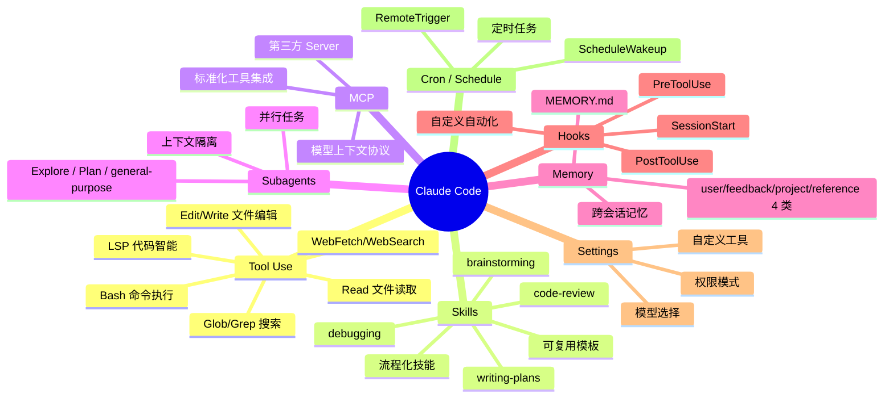
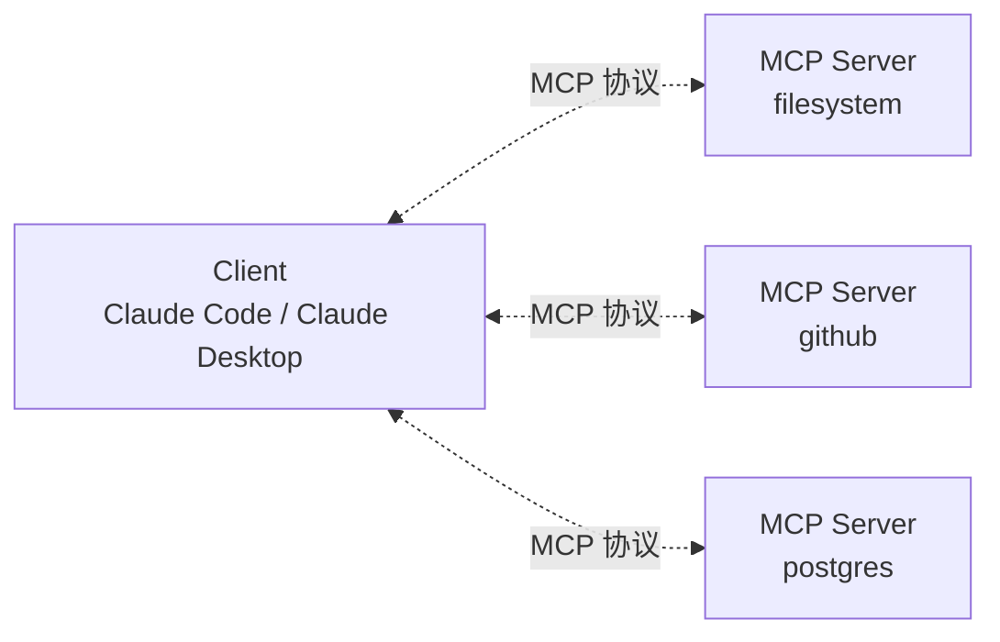

# Claude Code 实战手册

> Anthropic 的 agentic coding 工具完整能力图：CLI / IDE / Hooks / Skills / MCP / Subagents / Settings / Output Styles / Memory / 权限 / 调度
>
> 当下最火的 Coding Agent，**8 年工程师必须掌握**

---

## 一、Claude Code 是什么

### 1.1 定位

```
Claude Code = Anthropic 的 agentic coding 工具
  ↓
形态: CLI / IDE 插件 / Web (claude.ai/code) / Desktop (Mac/Windows)
模型: Claude 系列（Opus / Sonnet / Haiku）
特点: 真正的 Agent，能自主调用工具完成多步任务
```

**与传统 AI 编码工具区别**：
| | Copilot | Cursor | Aider | **Claude Code** |
| --- | --- | --- | --- | --- |
| 形态 | IDE 插件 | IDE | CLI | **CLI + IDE + Web 全形态** |
| 模型 | OpenAI | 多模型 | 多模型 | Claude |
| 任务复杂度 | 补全为主 | 单文件改写 | 多文件改写 | **多步骤 Agent 任务** |
| 工具调用 | 弱 | 中 | 中 | **强（Bash/Read/Edit/Write/MCP/Skills）** |
| 项目理解 | 局部 | 中 | 全仓库 | **全仓库 + Memory** |

### 1.2 核心能力



### 1.3 与其他 Agent 对比

```
Claude Code:
  ✅ 多步骤复杂任务（如：让它实现一个完整功能 + 测试 + 文档）
  ✅ 全仓库代码理解
  ✅ MCP 标准化扩展
  ✅ Skills 流程化
  ✅ 跨会话记忆

Cursor:
  ✅ IDE 体验流畅
  ✅ 实时建议
  ❌ Agent 能力弱于 Claude Code

Copilot:
  ✅ 补全速度快
  ❌ 不是真 Agent

Aider:
  ✅ CLI 简单
  ✅ 支持多模型
  ❌ 没有 Skills / MCP 标准化扩展
```

**实战建议**：
- 复杂工程任务 / 探索代码库 → **Claude Code**
- 日常 IDE 编码 → Cursor
- 简单补全 → Copilot
- 终端控 → Claude Code 或 Aider

---

## 二、安装与基础使用

### 2.1 安装

```bash
# macOS / Linux
curl -fsSL https://claude.ai/install.sh | sh

# 或 npm
npm install -g @anthropic-ai/claude-code

# 启动
claude
```

### 2.2 基础交互

```
启动后:
  $ claude

  > 帮我看下这个项目结构
  Claude 会自动 ls / 读 README / 给出概要

  > 给 user_service.go 加单元测试
  Claude 会读文件 → 写测试 → 跑测试 → 修问题
```

### 2.3 关键文件

```
项目根目录/
├── CLAUDE.md              # 项目级指令（Claude 自动读取）
├── .claude/
│   ├── settings.json      # 项目配置
│   ├── settings.local.json # 个人本地配置（不提交）
│   ├── skills/            # 项目级 Skills
│   ├── hooks/             # 项目级 Hooks
│   └── memory/            # 项目级 Memory
└── ...

用户全局/
~/.claude/
├── CLAUDE.md              # 全局指令（所有项目共享）
├── settings.json          # 全局配置
├── skills/                # 全局 Skills
├── plugins/               # 插件
└── projects/              # 各项目对话历史 + memory
```

**优先级**（高 → 低）：
- 项目 settings.local.json（个人）
- 项目 settings.json（团队共享）
- 全局 settings.json
- 默认配置

---

## 三、Tool Use（工具调用）

### 3.1 内置工具

| 工具 | 用途 |
| --- | --- |
| **Bash** | 执行 shell 命令（git / npm / go test） |
| **Read** | 读文件（支持图片 / PDF / Notebook） |
| **Edit** | 精确字符串替换 |
| **Write** | 写新文件 / 完整重写 |
| **Glob** | 文件名模式匹配 |
| **Grep** | 内容搜索（基于 ripgrep） |
| **WebFetch** | 抓 URL 内容 |
| **WebSearch** | 搜索（仅限美国） |
| **LSP** | 代码智能（goToDefinition / findReferences / hover 等） |
| **Agent** | 启动 subagent |
| **Skill** | 调用 skill |
| **TodoWrite** | 任务列表 |

### 3.2 LSP 工具（重要）

很多人不知道 Claude Code 内置 LSP，可以做精准代码导航：

```
LSP 操作:
- goToDefinition        # 跳转定义
- findReferences        # 找所有引用
- hover                 # 类型/文档
- documentSymbol        # 文件结构
- workspaceSymbol       # 全局符号
- goToImplementation    # 接口实现
- prepareCallHierarchy
- incomingCalls         # 谁调了它
- outgoingCalls         # 它调了谁
```

**实战**：
```
> "OrderService.PayOrder 有哪些调用方？"
Claude 用 LSP findReferences 精准找到，比 grep 准
```

### 3.3 Bash 高级用法

#### 后台运行（run_in_background）

```
> "启动 dev server"
Claude 用 run_in_background=true，得到任务 ID 后继续干别的事，
完成时收到通知。
```

#### Monitor（流式监控）

```
> "盯着 deploy.log 看是否有 ERROR"
Claude 用 Monitor 工具，每条匹配行作为一次通知。
```

### 3.4 工具最佳实践

```
□ 用 Read 而不是 cat
□ 用 Edit 而不是 sed/awk
□ 用 Write 而不是 echo > file
□ 用 Grep / Glob 而不是 find/grep
□ 用 LSP 而不是 grep 找定义
□ 长任务用 run_in_background
□ 多任务并行用 Agent (subagent)
```

---

## 四、Skills（流程化技能）

### 4.1 什么是 Skill

**Skill = 把常见工作流封装成可复用模板**（prompt + 工具组合）。

类比：
- Prompt = 一次性指令
- Skill = 标准化工作流

### 4.2 内置经典 Skills

```
brainstorming        把模糊想法转为完整设计
writing-plans        把设计转为实现计划
debugging            系统化调试
code-review          代码审查
remember             保存记忆
plan-mode            进入计划模式
```

### 4.3 调用 Skill

```
方式 1: 用户显式调用
  > /brainstorming
  > /debugging

方式 2: Agent 自动判断
  根据用户需求自动 invoke 相关 skill
```

### 4.4 Skill 文件结构

```
.claude/skills/my-skill/
├── SKILL.md           # 主指令（必需）
├── reference/         # 参考资料
│   └── *.md
├── helpers/           # 辅助脚本
│   └── *.sh / *.py
└── templates/         # 模板文件
```

### 4.5 SKILL.md 格式

```markdown
---
name: my-skill
description: Use when [触发场景]. 一句话说明
---

# My Skill

## When to Use
触发场景描述

## Process
1. Step 1: ...
2. Step 2: ...
3. Step 3: ...

## Reference
更多详情见 reference/...
```

### 4.6 自定义 Skill 实战

**场景**：把团队代码规范沉淀为 Skill。

```
.claude/skills/team-go-style/
├── SKILL.md
└── reference/
    ├── naming.md
    ├── error-handling.md
    └── testing.md
```

```markdown
# .claude/skills/team-go-style/SKILL.md
---
name: team-go-style
description: 团队 Go 代码规范：命名 / 错误处理 / 测试。Use when writing or reviewing Go code.
---

# 团队 Go 代码规范

## When to Use
- 写新代码前
- Code Review 时
- 用户问"我们的规范"时

## Quick Reference
- 命名: 见 reference/naming.md
- 错误处理: 见 reference/error-handling.md
- 测试: 见 reference/testing.md

## Top 5 Rules
1. 包名小写单数
2. 接收者 1-2 字母
3. 错误用 %w 包装
4. 接口在使用方
5. ...
```

调用：
```
> "review user_service.go"
Claude 自动加载 team-go-style 规范进行 review
```

### 4.7 Skill 反模式

```
❌ 把每个小任务都做成 Skill（杀鸡用牛刀）
❌ Skill 内容太长（< 200 行最佳）
❌ Skill 名字模糊（应该明确触发场景）
❌ 没写 description（Agent 不知道何时用）
```

---

## 五、MCP（Model Context Protocol）

### 5.1 是什么

**MCP = AI 工具集成的开放标准**（类比 USB 之于硬件）。

**解决问题**：N×M 集成 → N+M：
- N 个 LLM 应用
- M 个工具/数据源
- 没 MCP：每个 LLM 都要集成每个工具
- 有 MCP：每方实现一次 MCP，全部互通

### 5.2 架构



### 5.3 MCP Server 提供 3 类能力

```
Tools       可调用函数（github_create_pr / db_query）
Resources   可读数据（文件 / API / DB）
Prompts     模板化 prompt
```

### 5.4 主流 MCP Server

```
官方:
  - filesystem
  - github / gitlab
  - postgres / sqlite / mongodb
  - slack / google-drive
  - puppeteer / playwright
  - brave-search / fetch

社区:
  - linear / notion / jira
  - kubernetes / docker
  - aws / gcp / azure
  - 各种 SaaS 集成
```

完整列表：[modelcontextprotocol.io](https://modelcontextprotocol.io)

### 5.5 安装 MCP Server

```bash
# .claude/settings.json 或全局
{
  "mcp": {
    "servers": {
      "filesystem": {
        "command": "npx",
        "args": ["-y", "@modelcontextprotocol/server-filesystem", "/Users/me/projects"]
      },
      "github": {
        "command": "npx",
        "args": ["-y", "@modelcontextprotocol/server-github"],
        "env": {
          "GITHUB_TOKEN": "ghp_xxx"
        }
      },
      "postgres": {
        "command": "npx",
        "args": ["-y", "@modelcontextprotocol/server-postgres", "postgresql://..."]
      }
    }
  }
}
```

### 5.6 自己写 MCP Server

```typescript
// my-mcp-server.ts
import { Server } from "@modelcontextprotocol/sdk/server/index.js"
import { StdioServerTransport } from "@modelcontextprotocol/sdk/server/stdio.js"

const server = new Server(
  { name: "my-server", version: "1.0.0" },
  { capabilities: { tools: {} } }
)

server.setRequestHandler(ListToolsRequestSchema, async () => ({
  tools: [{
    name: "search_code",
    description: "搜索代码库",
    inputSchema: {
      type: "object",
      properties: {
        query: { type: "string" }
      }
    }
  }]
}))

server.setRequestHandler(CallToolRequestSchema, async (req) => {
  if (req.params.name === "search_code") {
    const results = await mySearch(req.params.arguments.query)
    return { content: [{ type: "text", text: JSON.stringify(results) }] }
  }
})

const transport = new StdioServerTransport()
server.connect(transport)
```

### 5.7 MCP vs Function Calling

| | Function Calling | MCP |
| --- | --- | --- |
| 定义 | LLM 内置能力 | 标准协议 |
| 范围 | 单 LLM 内 | 跨 LLM / 工具 |
| 集成 | 每个 LLM 自定义 | 统一标准 |
| 类比 | 私有 API | USB |

**实战**：本地工具 → 函数调用；跨应用集成 → MCP。

---

## 六、Subagents（子 Agent）

### 6.1 是什么

**Subagent = 主 Agent 派生的并行 Agent**，有独立的上下文窗口。

**为什么需要**：
- 主 Agent 上下文有限（200K token）
- 大型任务（搜索 / 分析）会爆上下文
- 派 subagent 处理 → 只回报结论 → 节省主 context

### 6.2 内置 Subagent 类型

| 类型 | 用途 |
| --- | --- |
| **Explore** | 快速搜索代码（找文件 / grep 符号） |
| **Plan** | 软件架构设计 / 实现规划 |
| **general-purpose** | 通用研究 / 多步任务 |
| **statusline-setup** | 配置状态栏 |
| **claude-code-guide** | Claude Code 使用问题 |
| **superpowers:code-reviewer** | 代码审查 |

### 6.3 调用 Subagent

```
主 Agent 用 Agent 工具:

description: "Branch ship-readiness audit"
prompt: "Audit this branch ..."
subagent_type: "general-purpose"

→ Subagent 独立运行
→ 完成后只把结论返回主 Agent
```

### 6.4 何时用 Subagent

```
✅ 适合:
  - 大型代码搜索（多文件 / 多模式）
  - 跨域研究（不影响主任务上下文）
  - 并行独立子任务（同时几个）
  - 保护主 context（不被搜索结果占满）

❌ 不适合:
  - 简单已知任务（直接做更快）
  - 需要主 context 信息的任务（subagent 看不到）
  - 超快任务（subagent 启动开销大）
```

### 6.5 并行 Subagents

```
主 Agent 一次调用多个 Agent:

[
  {description: "Audit branch", subagent_type: "general-purpose", prompt: "..."},
  {description: "Find tests", subagent_type: "Explore", prompt: "..."},
]

→ 两个 subagent 并行运行
→ 主 Agent 同时拿两个结论
```

### 6.6 自定义 Subagent

`.claude/agents/my-agent.md`：

```markdown
---
name: my-agent
description: Specialized agent for X
tools: Read, Grep, Bash
---

You are a specialized agent that does X.

When invoked:
1. Step 1
2. Step 2
3. Return concise result
```

---

## 七、Settings（配置）

### 7.1 配置层级

```
~/.claude/settings.json              # 全局
project/.claude/settings.json        # 项目（提交到 git）
project/.claude/settings.local.json  # 个人（gitignore）
```

### 7.2 关键配置项

```json
{
  // 模型选择
  "model": "claude-opus-4-7",  // claude-sonnet-4-6, claude-haiku-4-5

  // 权限模式
  "permissions": {
    "allow": [
      "Bash(git status)",
      "Bash(git log:*)",
      "Read",
      "Edit",
      "Write"
    ],
    "deny": [
      "Bash(rm -rf:*)",
      "Bash(git push --force:*)"
    ],
    "additionalDirectories": [
      "/Users/me/notes"
    ]
  },

  // MCP 配置
  "mcp": {
    "servers": {
      "github": { ... }
    }
  },

  // Hooks
  "hooks": {
    "SessionStart": [{
      "command": "echo 'Session started'"
    }]
  },

  // 自定义工具
  "tools": {
    "custom_tool": { ... }
  },

  // Output Style
  "outputStyle": "concise",  // verbose / concise / explanatory

  // 自动 Compact
  "autoCompact": true,

  // 状态栏
  "statusLine": "/path/to/script"
}
```

### 7.3 权限模式

```
默认（plan）:     破坏性操作需确认
auto-accept:    自动通过常见操作
manual:         所有工具调用需确认
bypass:         全自动（危险，仅可信项目）
```

### 7.4 自定义 Bash 工具

`.claude/settings.json`：
```json
{
  "tools": {
    "DBQuery": {
      "type": "bash",
      "command": "psql -c \"$(cat)\"",
      "description": "Execute SQL on local DB"
    }
  }
}
```

---

## 八、Hooks（钩子）

### 8.1 是什么

**Hooks = 在特定事件触发时执行的 shell 命令**。

### 8.2 Hook 类型

| Hook | 触发时机 |
| --- | --- |
| **SessionStart** | 启动会话时 |
| **PreToolUse** | 工具调用前 |
| **PostToolUse** | 工具调用后 |
| **UserPromptSubmit** | 用户提交 prompt 时 |
| **CompactBoundary** | 上下文压缩时 |

### 8.3 配置示例

```json
{
  "hooks": {
    "SessionStart": [{
      "matcher": "compact",
      "hooks": [{
        "type": "command",
        "command": "/path/to/load-memory.sh"
      }]
    }],
    "PreToolUse": [{
      "matcher": "Bash",
      "hooks": [{
        "type": "command",
        "command": "/path/to/check-bash-safety.sh"
      }]
    }],
    "PostToolUse": [{
      "matcher": "Edit|Write",
      "hooks": [{
        "type": "command",
        "command": "/path/to/format-code.sh"
      }]
    }]
  }
}
```

### 8.4 实战场景

#### 场景 1：自动格式化

```bash
#!/bin/bash
# .claude/hooks/format-on-save.sh
# PostToolUse on Edit|Write
file=$(echo "$1" | jq -r '.file_path')
case "$file" in
  *.go) gofmt -w "$file" ;;
  *.ts|*.tsx) npx prettier --write "$file" ;;
  *.py) black "$file" ;;
esac
```

#### 场景 2：自动跑测试

```bash
#!/bin/bash
# PostToolUse on Edit|Write
# 检测改了 _test.go 就自动跑测试
if [[ "$1" == *_test.go ]]; then
  go test ./... -run "$(basename $1 .go)"
fi
```

#### 场景 3：阻止危险命令

```bash
#!/bin/bash
# PreToolUse on Bash
cmd=$(echo "$1" | jq -r '.command')
if [[ "$cmd" == *"rm -rf /"* ]] || [[ "$cmd" == *"force"* ]]; then
  echo '{"continue": false, "stopReason": "危险命令被拦截"}' >&2
  exit 1
fi
exit 0
```

#### 场景 4：会话开始加载上下文

```bash
#!/bin/bash
# SessionStart
echo "## Recent Activity"
git log --oneline -10
echo
echo "## Current Branch"
git branch --show-current
echo
echo "## Uncommitted Changes"
git status -s
```

### 8.5 Hook 反模式

```
❌ 在 Hook 里跑慢命令（阻塞会话）
❌ Hook 失败但不退出（卡死）
❌ 没做幂等（重复触发出错）
❌ 修改文件不告知（用户困惑）
```

---

## 九、Memory（跨会话记忆）

### 9.1 内置 Auto Memory

Claude Code 有自动记忆系统，存储在 `~/.claude/projects/<project>/memory/`：

```
memory/
├── MEMORY.md                # 索引（200 行内）
├── user_xxx.md              # 用户偏好
├── feedback_xxx.md          # 用户反馈
├── project_xxx.md           # 项目背景
└── reference_xxx.md         # 外部资源指针
```

### 9.2 4 类记忆

| 类型 | 用途 | 例子 |
| --- | --- | --- |
| **user** | 用户角色/偏好/知识 | "用户是 Go 后端 8 年" |
| **feedback** | 用户反馈/纠正 | "不要在每次回复后总结" |
| **project** | 项目背景 | "这个项目下周冻结" |
| **reference** | 外部资源指针 | "bug 在 Linear 项目 INGEST" |

### 9.3 触发记忆保存

```
方式 1: 用户显式
  > "记住我用 zsh 不用 bash"

方式 2: Claude 自动判断
  当用户提到偏好/反馈/项目背景时自动保存

方式 3: 用 /remember 命令
  > /remember 我每天 9 点站会
```

### 9.4 检查 Memory

```bash
ls ~/.claude/projects/-Users-nikki-go-src-interview-note/memory/
```

```
MEMORY.md
feedback_cohesion_over_dry.md
feedback_per_topic_commit.md
feedback_granularity_by_domain.md
```

### 9.5 CLAUDE.md（项目级指令）

每个项目的 `CLAUDE.md` 会自动加载：

```markdown
# Project Name

## 技术栈
Go 1.23 + MySQL + Redis + Kafka

## 项目约定
- 错误码全公司唯一
- 接口在使用方定义
- 测试覆盖率 > 70%

## 常用命令
```bash
make test
make lint
make build
```

## 注意事项
- 不要直接连生产 DB
- 提交前必跑 lint
```

### 9.6 全局 CLAUDE.md

`~/.claude/CLAUDE.md`：所有项目共享的个人偏好。

---

## 十、Output Styles（输出风格）

### 10.1 内置风格

```
default        平衡详略
concise        极简
verbose        详细
explanatory    教学式
```

### 10.2 配置

`settings.json`：
```json
{
  "outputStyle": "concise"
}
```

或运行时：
```
> /output-style concise
```

### 10.3 自定义风格

`.claude/output-styles/my-style.md`：
```markdown
---
name: My Style
description: 中文 + 简洁 + 包含命令
---

回复风格：
- 中文优先
- 直奔主题
- 命令带反引号
- 不写多余说明
```

---

## 十一、调度与触发器

### 11.1 ScheduleWakeup（动态唤醒）

`/loop` 模式下，Agent 自己决定何时再来：

```
ScheduleWakeup({
  delaySeconds: 1200,
  reason: "wait for build",
  prompt: "<<autonomous-loop-dynamic>>"
})
```

### 11.2 Cron（定时任务）

```
CronCreate({
  cron: "0 9 * * 1-5",         # 工作日 9 点
  prompt: "review my emails",
  recurring: true
})

CronList()                     # 列出
CronDelete({id: "xxx"})        # 删除
```

**实战**：
- 每天 9 点 review 昨天 PR
- 每小时检查 CI 状态
- 每周整理待办

### 11.3 RemoteTrigger（远程触发）

通过 claude.ai 平台触发：
- 在网页 / 移动端创建触发器
- 满足条件时自动启动 Claude Code 任务

---

## 十二、Skills 进阶

### 12.1 Skills + MCP 组合

```
Skill 定义流程
  ↓
流程内调用 MCP Server 工具
  ↓
完成完整工作流

例: 发布流程 Skill
  1. 调 MCP github.create_pr
  2. 等 CI 通过（Bash 监控）
  3. 调 MCP github.merge_pr
  4. 调 MCP slack.send_message 通知
```

### 12.2 Plugins

社区/官方插件：
```
~/.claude/plugins/
├── superpowers/        # 官方 superpowers 插件（含 brainstorming/coding-with-tdd 等）
├── claude-mem/         # 记忆插件
└── my-plugin/          # 自定义
```

`/plugin` 命令管理。

### 12.3 团队级 Skills

```
公司内部 git repo:
  team-skills/
    ├── deploy-flow/
    ├── on-call-handover/
    └── incident-response/

成员 git clone 到 .claude/skills/
团队统一工作流
```

---

## 十三、实战场景

### 13.1 完整功能开发

```
> 帮我实现订单退款功能

Claude:
1. 用 Glob 找相关文件
2. 用 Read 读关键代码
3. 用 brainstorming Skill 设计方案
4. 用 writing-plans Skill 拆解步骤
5. 用 Edit/Write 实现
6. 用 Bash 跑测试
7. 用 Edit 修 bug
8. 输出最终结果 + 改动总结
```

### 13.2 大型代码搜索

```
> 这个项目的认证流程是怎样的？

Claude 派 Explore subagent:
- subagent 用 Grep / Glob 找认证相关
- 读关键文件
- 理解链路
- 返回简洁链路图给主 Agent

主 Agent 不被搜索结果占满 context
```

### 13.3 Code Review

```
> review 这个 PR

Claude:
1. git diff main...HEAD
2. 用 superpowers:code-reviewer subagent
3. 按团队规范（CLAUDE.md）逐文件 review
4. 输出 Must / Should / Could / Nit 分级反馈
```

### 13.4 长期项目跟踪

```
设置 Cron:
  每天 9 点 → "list yesterday's PRs and summarize"

每天会自动启动一次任务，发通知。
```

### 13.5 调试线上问题

```
> /debugging
进入 debugging skill 工作流

Claude:
1. 收集症状（错误日志 / 时间 / 影响范围）
2. 假设可能原因
3. 用 Bash + Grep 验证假设
4. 找到根因
5. 给出修复方案
6. 写复盘
```

### 13.6 持续学习

```
全局 CLAUDE.md 设置:
  "用 zsh / Go 8 年 / 偏好简洁回复 / commit 用中文"

每次新项目自动应用。
```

---

## 十四、最佳实践 Checklist

### 14.1 项目接入

```
□ 写 CLAUDE.md（项目背景 + 技术栈 + 约定 + 常用命令）
□ 配 .claude/settings.json（权限 / 模型）
□ 配 .gitignore 加 .claude/settings.local.json
□ 接需要的 MCP（github / postgres / 等）
□ 写 1-2 个项目专用 Skill（如团队规范）
□ 配关键 Hook（如 PostToolUse 格式化）
```

### 14.2 个人配置

```
□ ~/.claude/CLAUDE.md（个人偏好）
□ ~/.claude/settings.json（全局）
□ 装常用 MCP 全局
□ 写常用 Skill
□ 配 Hook（如 SessionStart 加载 git status）
```

### 14.3 协作

```
□ 团队共享 .claude/skills/（git）
□ 团队共享 CLAUDE.md
□ 个人 settings.local.json 不提交
□ Hook 脚本要幂等
□ MCP token / 密钥用环境变量
```

### 14.4 安全

```
□ 权限模式不用 bypass（除非完全可信项目）
□ deny 危险命令（rm -rf / force push）
□ 敏感目录不让访问（默认 cwd 内）
□ MCP token 用环境变量（不写 settings.json）
□ Hook 脚本审查（可执行任意命令）
```

---

## 十五、性能与成本

### 15.1 模型选择

```
Opus 4.7      最强，最贵      复杂多步任务
Sonnet 4.6    平衡，主流      日常使用
Haiku 4.5     最快，便宜      简单任务 / 自动化

策略:
- 默认 Sonnet
- 复杂任务切 Opus（/model）
- Subagent 用 Haiku 省钱
```

### 15.2 上下文管理

```
□ 用 subagent 隔离搜索（不爆主 context）
□ 让 Claude /compact 主动压缩
□ 不要塞超大文件（用 Read 部分读）
□ Skill 内容简洁（< 200 行）
□ Memory 索引精简（< 200 行）
```

### 15.3 成本优化

```
□ Prompt Caching（Anthropic 90% 折扣）
□ 简单任务用小模型
□ Subagent 默认 Haiku
□ 长上下文项目用 /compact
□ 关掉不必要 MCP server（启动慢 + 消耗 token）
```

---

## 十六、常见坑

### 坑 1：上下文爆炸

```
❌ 让 Claude 把 100 个文件全读进来
→ 上下文耗尽 → 后续任务报错
```

**修复**：用 subagent 隔离 / 用 Glob+Grep 先定位再 Read。

### 坑 2：Hook 慢

```
❌ PreToolUse 跑 5 秒命令
→ 每次工具调用 +5 秒
```

**修复**：Hook 必须 < 100ms / 异步处理 / 选对 matcher。

### 坑 3：权限太松

```
❌ 用 bypass 模式 + 不可信项目
→ Claude 删了文件
```

**修复**：分项目配置 / 用 deny / 重要操作要确认。

### 坑 4：Skill 太宽

```
❌ Skill description 写 "for everything"
→ Agent 不知何时用 / 总是错用
```

**修复**：description 明确触发场景。

### 坑 5：MCP 太多

```
❌ 装 20 个 MCP server
→ 每个都启动一个进程 → 启动慢 / 内存耗
```

**修复**：只装常用 / 项目级 MCP（不全局）。

### 坑 6：Memory 不更新

```
❌ 用户偏好变了，但旧 memory 还在
→ Agent 用过时偏好
```

**修复**：定期 review ~/.claude/projects/*/memory/ / 主动 forget 旧的。

### 坑 7：CLAUDE.md 过期

```
❌ CLAUDE.md 写了 6 个月不更新
→ 项目演化但 Claude 还按老规则做
```

**修复**：把 CLAUDE.md 当代码维护 / Code Review 时检查。

---

## 十七、面试 / 实战高频问

### Q1: Claude Code 比 Cursor / Copilot 强在哪？

**答**：
- 真正的 Agent（多步骤任务）
- Skills 流程化（团队工作流沉淀）
- MCP 标准化扩展
- Subagent 上下文隔离
- 跨会话 Memory
- CLI / IDE / Web 全形态

### Q2: Skill 和 Prompt 区别？

**答**：
- Prompt 一次性指令
- Skill = 标准化工作流（含工具组合 + 流程）
- Skill 可被团队共享 / Agent 自动调用

### Q3: MCP 解决什么问题？

**答**：
- N×M → N+M 集成成本下降
- 标准化（USB 类比）
- 跨 LLM 应用复用工具

### Q4: 什么时候用 Subagent？

**答**：
- 大型搜索（不爆主 context）
- 跨域研究
- 并行子任务
- 不需要主 context 信息

### Q5: 怎么把团队规范沉淀给 Claude？

**答**：
- CLAUDE.md（项目级 / 全局）
- Skills（流程 + 工具）
- Hooks（自动化检查）
- MCP（团队工具集成）

### Q6: 如何控制 Claude 不乱动文件？

**答**：
- permissions.deny 危险操作
- 不用 bypass 模式
- 关键操作要确认
- Hook 拦截危险命令

### Q7: Hook 适合做什么？

**答**：
- 格式化（PostToolUse Edit）
- 安全检查（PreToolUse Bash）
- 上下文加载（SessionStart）
- 自动测试（PostToolUse Edit）

### Q8: 怎么省 token？

**答**：
- Subagent 用 Haiku
- 简单任务切小模型
- /compact 压缩历史
- Prompt Caching（90% 折扣）
- Skill / CLAUDE.md 精简

### Q9: 团队怎么协作用 Claude Code？

**答**：
- 项目 .claude/ 进 git（除 settings.local.json）
- CLAUDE.md 写团队约定
- Skills 写团队工作流
- MCP 写团队工具集成
- Hooks 自动化检查

### Q10: 你日常怎么用 Claude Code？

**答**（结构化 STAR）：
- 复杂任务（实现功能 / 重构）→ Claude Code 主导
- 探索代码库 → /brainstorming + Explore subagent
- Code Review → code-reviewer subagent
- 调试 → /debugging skill
- 长期跟踪 → Cron 定时任务
- 团队规范 → CLAUDE.md + Skills
- 工具集成 → MCP
- 安全 → 权限模式 + Hooks

---

## 十八、推荐阅读

```
官方:
  □ docs.claude.com/claude-code
  □ Anthropic Cookbook
  □ MCP 规范: modelcontextprotocol.io

社区:
  □ awesome-claude-code (GitHub)
  □ awesome-mcp-servers (GitHub)

实战:
  □ Anthropic Engineering blog
  □ 自己折腾（最好的学习方式）
```

---

## 十九、面试 / 答辩加分点

- 能说出 **Claude Code 的 8 大能力**（Tools / Skills / MCP / Subagents / Settings / Hooks / Memory / Output Styles）
- 知道 **MCP** 是标准协议（不是 Anthropic 专有）
- 能区分 **Skill / Prompt / MCP**
- 懂 **Subagent 用于上下文隔离**
- 能写 **CLAUDE.md / Skill / Hook**
- 懂 **权限模式 + 安全考量**
- **团队级使用**：项目 .claude/ 进 git
- **成本优化**：Subagent 用 Haiku / Prompt Caching / /compact
- 实战经验：日常工作流接入 Claude Code 的具体场景
- **MCP 生态**：知道有哪些主流 MCP Server
