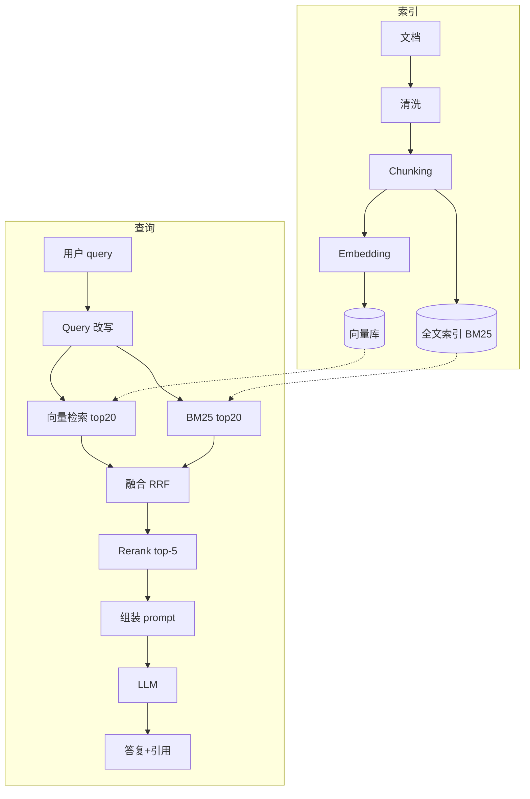

# RAG 工程化(检索增强生成)

> **RAG(Retrieval-Augmented Generation)= 检索 + 生成**——把外部知识库检索出来的相关内容塞进 LLM 上下文,让 LLM 基于事实回答,是**压制幻觉、注入私有知识、绕开训练截止日期**的第一利器。
>
> 本章讲透 **RAG 4 件套(Chunking / Embedding / Retrieval / Rerank)+ 高阶(GraphRAG / Self-RAG / HyDE)+ 评测 + 生产实践**——每一环都直接决定 RAG 效果。
>
> 前置:[01-llm-fundamentals](01-llm-fundamentals.md) / [06-memory-and-context](06-memory-and-context.md)(RAG 和 Memory 技术栈几乎一样)

## 〇、核心提炼(5 段式)

### 核心机制(6 条必背)

1. **RAG 4 件套**:**Chunking(切文档)+ Embedding(向量化)+ Retrieval(检索)+ Rerank(重排)** —— 缺一个效果差一大截
2. **Chunking 决定信息粒度**——切太小丢上下文,切太大稀释相关性;推荐 **300-800 token / chunk**
3. **Embedding 决定语义能力**——`text-embedding-3-small`(通用便宜)/ `bge-m3`(中文首选)/ `Cohere embed-v3`(多语言)
4. **单纯向量检索会漏关键词**——生产必用**混合检索(向量 + BM25)+ Rerank**,准确率提升 20-40 个百分点
5. **RAG 效果差的根因 90% 在检索层**——不是 LLM 不行,是 chunking / embedding / retrieval 没做好
6. **必须评测**——RAGAS / Hit@K / MRR / 人工评测,**没数据不知道优化方向**

### 核心本质(必懂)

> RAG 的本质是 **"用检索绕过 LLM 的知识边界 + 用生成保留 LLM 的语言能力"**——
>
> LLM 有两大知识边界问题:
> - **训练截止日期**:GPT-4o 不知道 2024 年之后的事
> - **私有知识**:LLM 不知道你公司的内部文档、客户资料、产品手册
> - **幻觉**:即使训练时见过,也可能记错编造
>
> RAG 的解决思路:
> - **不训模型**(fine-tune 贵、慢、僵)
> - **每次调用前检索相关文档,塞进 prompt**
> - LLM 基于给定文档回答 → 不需要"记住"知识,只需要"读理解"
>
> **RAG 不做的事**:
> - ❌ 不改模型权重(那是 fine-tuning)
> - ❌ 不能让 LLM 学会新技能(RAG 只补事实,不补能力)
> - ❌ 不能替代好的 prompt 工程(RAG 结果还得 LLM 会用)
>
> **RAG vs Fine-tuning 边界**:
> - **RAG**:补事实(文档 / 数据 / 知识),更新快,可解释(能引用)
> - **Fine-tune**:补能力(风格 / 格式 / 领域推理),训练贵,不可解释
> - 生产系统一般 **RAG 优先,fine-tune 兜底**

### 完整流程(索引 + 查询)

```
【索引阶段】(离线,一次性 or 定期)
  文档 → 清洗 → Chunking → Embedding → 存向量库
  同时:文档 → 全文索引(BM25)+ metadata 索引

【查询阶段】(在线,每次用户提问)
  1. 用户 query
  2. Query 改写(HyDE / query expansion,可选)
  3. 混合检索:
     ├── 向量检索: query embedding → top-K1(如 20)
     └── BM25:    query 关键词 → top-K2(如 20)
  4. 融合(RRF / weighted)→ top-K3(如 20-30)
  5. Rerank:cross-encoder 精排 → top-K(如 3-5)
  6. 组装 prompt:system + [top-K docs] + user query
  7. 调 LLM 生成
  8. 输出(带引用)
```



### 6 条核心机制 - 逐点讲透(见下面各节)

### 一句话总结

> RAG = **检索(Chunking/Embedding/Retrieval/Rerank 四件套)+ 生成(基于文档回答)**;
> 效果差 90% 是检索层的锅——**必须混合检索 + Rerank + 评测**;
> 补事实用 RAG,补能力用 fine-tune,**RAG 优先 fine-tune 兜底**;
> RAG 是压制幻觉、注入私有知识的第一利器。

---

## 一、什么是 RAG(为什么需要)

### 1.1 无 RAG 的 LLM 局限

```
用户: "我们公司的年假政策是什么?"
GPT-4o: "根据一般公司常规,年假一般是 5-15 天..."
       (胡编)

用户: "帮我查一下客户 X 最近 3 个月的订单"
GPT-4o: "我无法访问你们的数据库..."
       (无法回答)

用户: "Kubernetes 1.32 有什么新特性?"
GPT-4o: "根据我的知识,截止 X 月..."
       (可能过时)
```

### 1.2 有 RAG 的 LLM

```
用户: "我们公司的年假政策是什么?"
应用:
  1. 检索公司文档库,找到"员工手册-年假章节"
  2. 塞进 prompt: [context: 年假章节全文]
LLM: "根据员工手册,我们公司的年假政策是..."
     (基于真实文档,可以引用页码)
```

### 1.3 RAG 的三大用途

```
1. 私有知识注入
   公司内部文档、客户数据、产品手册、业务规则

2. 时效性数据
   最新新闻、股价、天气、库存、订单
   (虽然这些也可以用 tool use)

3. 精准事实回答
   减少幻觉,给引用来源,提升可信度
```

### 1.4 RAG vs Fine-tune vs Long Context

```
知识注入的三种手段:

1. Long Context(直接塞)
   把所有文档一次性塞 200K 窗口
   优:简单
   劣:贵(每次调用都塞)、Lost in the Middle、超窗口

2. RAG(动态检索)
   按需检索相关片段塞
   优:成本可控、支持更新、可引用
   劣:检索质量决定一切

3. Fine-tune(改权重)
   把知识"学"进模型
   优:一次训练永久受益、无检索延迟
   劣:训练贵、更新慢、不可解释、需要训练数据

选择:
  文档量大 + 频繁更新 → RAG
  文档量小 + 一次性问 → Long Context
  改风格 / 格式 / 领域推理 → Fine-tune
  最终事实注入首选 RAG
```

> **一句话**:RAG 用**检索绕过 LLM 知识边界**——补私有知识 / 补时效数据 / 压幻觉;和 Fine-tune 分工:**RAG 补事实,Fine-tune 补能力**。

---

## 二、Chunking(切文档,信息粒度决定检索)

### 2.1 为什么要 Chunking

```
文档一整篇 (100K tokens):
  → 塞进 context 太贵 + Lost in the Middle
  → embedding 一整篇稀释了每部分特征

必须切成小段(chunks),每段独立 embedding + 检索。
```

### 2.2 Chunking 5 大策略

**策略 1:固定长度切分**

```python
def fixed_chunking(text, chunk_size=500, overlap=50):
    chunks = []
    for i in range(0, len(text), chunk_size - overlap):
        chunks.append(text[i:i+chunk_size])
    return chunks
```

**优点**:简单
**缺点**:可能切断句子,语义碎裂

**策略 2:句子/段落边界**

```python
# 用 nltk / spacy / 中文按句号切
sentences = split_by_sentence(text)
chunks = []
buffer = ""
for s in sentences:
    if len(buffer) + len(s) < 500:
        buffer += s
    else:
        chunks.append(buffer)
        buffer = s
```

**优点**:不断句
**缺点**:仍可能拆开语义单元

**策略 3:语义切分(Semantic Chunking)** ⭐推荐

**思路**:相邻句子 embedding 相似度低 → 切分点。

```python
# LangChain SemanticChunker / 自实现
def semantic_chunking(text, threshold=0.7):
    sentences = split_by_sentence(text)
    embeddings = embed(sentences)
    chunks = [[sentences[0]]]
    for i in range(1, len(sentences)):
        sim = cosine(embeddings[i], embeddings[i-1])
        if sim < threshold:
            chunks.append([sentences[i]])   # 新 chunk
        else:
            chunks[-1].append(sentences[i]) # 加入当前
    return [" ".join(c) for c in chunks]
```

**优点**:语义完整
**缺点**:多一次 embedding 成本

**策略 4:递归切分(Markdown / 代码结构感知)**

```python
# LangChain RecursiveCharacterTextSplitter
# 优先按大段落分,如果超长再按小结构分
splitter = RecursiveCharacterTextSplitter(
    separators=["\n## ", "\n### ", "\n\n", "\n", "。", "!"],
    chunk_size=500,
    chunk_overlap=50
)
```

**优点**:保留 markdown / 代码结构
**缺点**:需要根据文档格式调整分隔符

**策略 5:Parent-Child(分层)** ⭐生产常用

**思路**:
- 检索用**小 chunk**(200 token,精准匹配)
- 塞给 LLM 用**父 chunk**(1000 token,足够上下文)

```
文档
  ├── Parent 1(1000 tokens)
  │   ├── Child 1.1(200 tokens) ← 索引
  │   ├── Child 1.2(200 tokens) ← 索引
  │   └── Child 1.3(200 tokens) ← 索引
  ├── Parent 2 ...

查询命中 Child 1.2 → 返回 Parent 1 给 LLM
```

**优点**:检索精准 + LLM 上下文足
**缺点**:实现复杂

### 2.3 Chunk Size 的黄金区间

| 场景 | 推荐 |
| --- | --- |
| **通用问答** | 300-800 token / chunk |
| **代码检索** | 按函数/类切,不硬切 |
| **法律/合规文档** | 500-1000(条款完整性) |
| **对话记录** | 一轮对话一 chunk |
| **精准事实** | 100-300(短 fact) |

**Overlap** 通常 10-20%(50-100 tokens),防止边界信息丢。

### 2.4 Metadata(chunk 附加信息)

**每个 chunk 除了 embedding,还要存 metadata**:

```python
{
  "id": "doc123_chunk_5",
  "text": "...",
  "embedding": [...],
  "metadata": {
    "source": "employee_handbook.pdf",
    "page": 12,
    "section": "年假章节",
    "author": "HR",
    "created_at": "2026-01-15",
    "language": "zh",
    "doc_type": "policy",
    "tags": ["hr", "leave"]
  }
}
```

**用途**:
- 过滤检索(只查特定 doc_type / 时间范围)
- 生成引用(回答带来源)
- 权限控制(用户只能看有权限的 doc)

> **一句话**:Chunking 决定信息粒度——**推荐 300-800 token,10-20% overlap**;策略选择:**通用用递归切,长文档用 Parent-Child,精准场景用 Semantic Chunking**;每个 chunk 必须带 metadata。

---

## 三、Embedding(把文本变向量)

### 3.1 什么是 Embedding

**把一段文本映射到高维向量(如 1536 维),语义相近的文本向量距离近**。

```python
embed("北京今天天气")     → [0.12, -0.45, 0.83, ...]  # 1536 维
embed("北京气温")         → [0.15, -0.42, 0.85, ...]  # 相似
embed("上海地铁线路")     → [0.51, 0.23, -0.11, ...]  # 差远了

余弦相似度 ≈ 语义相似
```

### 3.2 主流 Embedding 模型(2026)

| 模型 | 维度 | 语言 | 价格(1M tokens)| 特点 |
| --- | --- | --- | --- | --- |
| **text-embedding-3-small** (OpenAI) | 1536 | 多语言 | $0.02 | 通用便宜,主流 |
| **text-embedding-3-large** | 3072 | 多语言 | $0.13 | 质量更高 |
| **Cohere embed-v3** | 1024 | 多语言 | $0.10 | 多语言强,支持不同类型输入 |
| **BGE-M3** (BAAI) | 1024 | 中文强 | 免费(开源) | **中文首选**,可自部署 |
| **BGE-large-zh** | 1024 | 中文 | 免费 | 中文专用 |
| **Voyage-3** | 1024 | 多语言 | $0.06 | Anthropic 推荐 |
| **jina-embeddings-v3** | 1024 | 多语言 + 长上下文 | $0.02 | 支持 8K token 输入 |

### 3.3 选型指南

```
纯中文:              BGE-M3(免费自部署)/ Voyage / OpenAI 3-small
多语言中英混:         BGE-M3 / Cohere embed-v3
预算优先:            OpenAI 3-small(便宜)/ BGE-M3(免费)
质量优先:            OpenAI 3-large / Cohere embed-v3
超长文本(> 512 tok): jina v3 / BGE-M3
自部署(数据不出域):  BGE-M3 / BGE-large-zh
```

### 3.4 Embedding 的关键工程点

**工程点 1:Query 和 Doc 用同一模型**

```
❌ 错:doc 用 OpenAI,query 用 BGE
   → 向量空间不同,检索必翻车

✓ 对:同一模型
```

**工程点 2:Embedding 缓存**

```python
# 相同文本 embedding 是确定的,可以缓存
@lru_cache(maxsize=10000)
def cached_embed(text: str) -> list[float]:
    return client.embeddings.create(input=text).data[0].embedding
```

**工程点 3:Batch API**

```python
# 单次一条 vs 一次 100 条:批量便宜且快
embeddings = client.embeddings.create(
    input=texts,          # list of 100 texts
    model="text-embedding-3-small"
).data
```

**工程点 4:归一化(部分场景)**

```python
# 有些向量库需要 L2 归一化(向量长度=1)
import numpy as np
def normalize(v):
    return v / np.linalg.norm(v)
```

### 3.5 Embedding 模型的评测

**MTEB 榜单**(Massive Text Embedding Benchmark):
- 中文:C-MTEB 榜(BGE 系列常年靠前)
- 多语言:MTEB Multilingual

**面试加分**:知道 MTEB 存在,能说出你选型时怎么参考的。

> **一句话**:Embedding 是把文本变向量,语义相似度检索的基础;**中文选 BGE-M3(免费自部署)或 Voyage,多语言选 Cohere/OpenAI**;必须 query 和 doc 用同一模型,善用 batch + cache。

---

## 四、Retrieval(检索)

### 4.1 单纯向量检索的问题

```
Query: "K8s 1.32 新特性"
向量库检索 top-5:
  1. "Kubernetes 使用指南"(相关但泛)
  2. "K8s 部署手册"           (相关但泛)
  3. "1.32 版本发布说明"      (最相关但排在后面!)
  ...

问题: 向量搜索抓语义相似,对精确关键词(数字/术语/代号)不敏感
```

### 4.2 混合检索(生产必备)

**向量 + BM25 结合**:

```
向量: 抓语义
BM25: 抓关键词
两者互补,各取 top-K,融合排序
```

**BM25 简介**:
- 基于 TF-IDF 的经典全文检索算法
- 精确关键词匹配 + 词频权重
- Elasticsearch / Meilisearch / Typesense 都用它
- 在专有名词、代号、数字上比向量强

### 4.3 融合方法:RRF(Reciprocal Rank Fusion)

**最简单也最有效**:

```python
def rrf(rankings, k=60):
    """
    rankings: [向量结果, BM25 结果]
    每个都是 [doc_id1, doc_id2, ...]
    """
    scores = {}
    for ranking in rankings:
        for rank, doc_id in enumerate(ranking):
            scores.setdefault(doc_id, 0)
            scores[doc_id] += 1 / (k + rank + 1)
    return sorted(scores.items(), key=lambda x: -x[1])

# 使用
vec_results = vector_search(query, top_k=20)
bm25_results = bm25_search(query, top_k=20)
merged = rrf([vec_results, bm25_results])[:10]
```

**优点**:无需调参,不同 score 尺度不冲突。

### 4.4 Metadata Filtering(精准过滤)

```python
# 结合 metadata 过滤
results = collection.query(
    query_embeddings=[query_emb],
    n_results=20,
    where={
        "$and": [
            {"user_id": "u123"},
            {"created_at": {"$gte": "2026-01-01"}},
            {"doc_type": "policy"}
        ]
    }
)
```

**关键场景**:
- 权限控制(只查用户有权限的文档)
- 时间过滤(最近 30 天)
- 分类过滤(只查产品文档)

### 4.5 Query 改写(可选,提升召回)

**问题**:用户 query 简短 / 口语化,直接检索召回差。

**解法 1:Query Expansion(扩展)**

```
原 query: "K8s 咋 debug"
LLM 扩展:
  - "Kubernetes 调试"
  - "K8s 排查故障"
  - "kubectl 常用调试命令"
用扩展后的多个 query 分别检索,合并结果
```

**解法 2:HyDE(Hypothetical Document Embedding)** ⭐

```
思路:让 LLM 生成一个假答案,用假答案的 embedding 去检索
理由:假答案和真实文档在语义空间更近,比原 query 检索效果好

原 query: "K8s 1.32 新特性"
LLM 生成假答案: "Kubernetes 1.32 引入了 X, Y, Z 等特性..."
用假答案 embedding 检索
```

**代价**:多一次 LLM 调用(用 Haiku 便宜)。

**适用**:
- ✓ 学术文献 / 技术文档(query 短 doc 长的场景)
- ✗ 简单 QA(收益不大)

### 4.6 检索的常见 Top-K 值

```
初步检索: top-K1 = 20-50(向量)+ 20-50(BM25)
融合后:   K2 = 20-30
Rerank 后:K3 = 3-8(塞进 LLM 的最终数量)

塞多少给 LLM:
  质量 > 数量, 3-5 精准的比 20 掺水的强
```

> **一句话**:检索层生产必备**混合检索(向量 + BM25)+ RRF 融合 + metadata 过滤**;query 短的场景加 HyDE 用 LLM 假答案检索;top-K 精不在多,3-5 精准的比 20 稀释的强。

---

## 五、Rerank(重排,准确率杀手锏)

### 5.1 为什么需要 Rerank

```
初步检索(向量 / BM25): top-20 里往往有噪音
  ✓ 相关文档
  ✗ 语义相似但不精准
  ✗ 关键词命中但话题偏

Rerank: 用更强的模型(cross-encoder)重新打分,精挑 top-3-5
```

### 5.2 Bi-encoder vs Cross-encoder

```
Bi-encoder(初步检索):
  分别 embed query 和 doc,再算相似度
  快(可预计算 doc embedding),但精度有限

Cross-encoder(Rerank):
  query 和 doc 拼在一起 fed to model,直接输出相关性分数
  精度高但慢(每对都要过一遍模型)
```

**分工**:
- 初检索用 Bi-encoder(20-50 快)
- Rerank 用 Cross-encoder(20 变 5,精)

### 5.3 主流 Rerank 模型

| 模型 | 特点 | 语言 |
| --- | --- | --- |
| **Cohere Rerank v3** | 商用主流,SaaS,准 | 多语言 |
| **BGE-Reranker** | 开源,自部署 | 多语言,中文强 |
| **Voyage Rerank** | Anthropic 生态 | 多语言 |
| **Jina Reranker v2** | 长上下文 rerank | 多语言 |

### 5.4 Rerank 效果(实测数据)

```
纯向量检索:              Recall@5 = 65%
向量 + BM25 混合:         Recall@5 = 78% (+13pp)
+ Cohere Rerank:         Recall@5 = 91% (+13pp)

准确率提升 20-30 个百分点,是 RAG 效果最大的杠杆之一
```

### 5.5 Rerank 代码

```python
import cohere

co = cohere.Client(...)

def rerank(query, docs, top_n=5):
    results = co.rerank(
        query=query,
        documents=[d["text"] for d in docs],
        top_n=top_n,
        model="rerank-v3.5"
    )
    return [docs[r.index] for r in results.results]

# 使用
merged_docs = hybrid_search(query, top_k=30)
final_docs = rerank(query, merged_docs, top_n=5)
```

### 5.6 Rerank 的代价

```
延迟: +100-300ms
成本: Cohere Rerank $2/1000 queries
    自部署 BGE-Reranker: 免费但要 GPU

大部分生产 RAG 都值得开 Rerank
```

> **一句话**:Rerank = **cross-encoder 精排 20 → 5**,准确率提升 20-30 个百分点;主流 Cohere Rerank / BGE-Reranker;是 RAG 效果最大的杠杆之一,大部分生产 RAG 值得开。

---

## 六、生成阶段(把检索结果给 LLM)

### 6.1 Prompt 组装模板

```python
prompt = f"""
你是一个基于文档的助手。请仅根据下面提供的文档回答用户问题。
如果文档中找不到答案,回答"根据现有文档,我无法回答这个问题",不要编造。

回答时:
1. 直接使用文档中的信息,不要凭常识补充
2. 引用来源(用 [文档 X] 标注)
3. 简洁准确

<documents>
[文档 1] {doc1.text}(来源: {doc1.metadata.source})
[文档 2] {doc2.text}
[文档 3] {doc3.text}
</documents>

用户问题: {query}
"""
```

### 6.2 关键 prompt 技巧

**技巧 1:强制引用**

```
"请标注每个事实的来源"
→ LLM 输出: "根据 [文档 1],..."
```

**技巧 2:承认不知道**

```
"如果文档没提到,直接说不知道"
→ 大幅降低幻觉
```

**技巧 3:文档相关性提示**

```
"文档按相关性排序,越靠前越相关"
→ LLM 更关注前面
```

**技巧 4:Lost in the Middle 应对**

```
关键文档放最前 or 最后,不要放中间
```

### 6.3 输出结构化(可选)

```json
{
  "answer": "...",
  "sources": [
    {"doc_id": "d1", "quote": "..."},
    {"doc_id": "d3", "quote": "..."}
  ],
  "confidence": "high|medium|low"
}
```

用 JSON Schema 强约束,方便前端展示引用。

---

## 七、高阶 RAG 技术

### 7.1 Self-RAG(自评估检索)

**思路**:LLM 自己判断"这个 query 需不需要检索""检索到的相关不相关"。

```
Query: "1+1=?"
Self-RAG: 不需要检索(LLM 自己知道)

Query: "K8s 1.32 新特性?"
Self-RAG: 需要检索
Retrieved: [doc1, doc2, doc3]
Self-RAG: doc1 相关,doc2 不相关跳过,doc3 相关
Generate: 基于 doc1, doc3 回答
```

**优点**:减少不必要检索,过滤无关文档
**代价**:多次 LLM 调用

### 7.2 Corrective RAG(CRAG)

**思路**:检索质量差 → 自动 fallback 到网络搜索。

```
Retrieved 打分: 高质量 → 直接用
              中等 → 网页搜索补充
              低 → 完全用网络搜索
```

### 7.3 GraphRAG(Microsoft)

**思路**:把文档抽取成**知识图谱**(实体 + 关系),检索走图查询。

**适合**:
- 复杂关系推理("和 X 相关的所有 Y 里,哪些 Z 是 W 的?")
- 全局主题(总结 / 概览)

**代价**:构建图很贵(每篇文档要 LLM 抽实体和关系)。

### 7.4 Multi-hop RAG(多跳推理)

**思路**:一次检索答不了,分多步。

```
Query: "写 SWE-agent 的公司在哪?"
Hop 1: 检索"SWE-agent" → 是 Princeton 的项目
Hop 2: 检索"Princeton" → 位于新泽西
Answer: 新泽西
```

### 7.5 Contextual Retrieval(Anthropic 2024)

**思路**:每个 chunk 前面加**上下文说明**再 embedding,提升检索精度。

```
原 chunk: "净利润 3 亿元"
带上下文: "苹果公司 2024 Q3 财报,净利润 3 亿元"
     ↑ 用 LLM 生成 chunk 的上下文
```

**Anthropic 实测**:结合 BM25 + Contextual Chunking + Rerank,**检索错误率降低 67%**。

**代价**:每个 chunk 都要 LLM 生成上下文(Prompt Cache 后成本可控)。

### 7.6 Agentic RAG

**思路**:让 agent 自主决策 RAG 流程——什么时候检索、检索什么、检索多次、评估结果。

**本质**:RAG 是 tool,agent(如 ReAct)决定怎么用。

> **一句话**:高阶 RAG 都是在解决基础 RAG 的痛点——**Self-RAG(过滤无关)/ CRAG(fallback 兜底)/ GraphRAG(关系推理)/ Multi-hop(多跳)/ Contextual Retrieval(上下文增强)/ Agentic RAG(自主流程)**;不是每个都要用,按需引入。

---

## 八、评测(必须做)

### 8.1 为什么必须评测

```
"我改了 chunking 策略,效果变好了"
→ 好多少?哪种 query 变好?哪种变差?
→ 没数据 = 拍脑袋 = 优化方向瞎猜

评测是 RAG 的必修课,不是可选项
```

### 8.2 评测指标

**检索层**:
- **Recall@K**:top-K 里包含正确答案的比例
- **MRR (Mean Reciprocal Rank)**:正确答案的排名倒数平均值
- **NDCG@K**:考虑排序的加权指标

**生成层**:
- **Faithfulness**:回答是否忠于检索到的文档(不幻觉)
- **Answer Relevance**:回答是否切题
- **Context Relevance**:检索出的文档是否相关
- **Correctness**:相对于 golden answer 的正确率

### 8.3 主流评测框架

**RAGAS**:
```python
from ragas import evaluate
from ragas.metrics import faithfulness, answer_relevancy, context_precision

result = evaluate(
    dataset=eval_dataset,
    metrics=[faithfulness, answer_relevancy, context_precision]
)
```

**其他**:
- **DeepEval**:Python 测试式评测
- **LangSmith**:端到端 trace + 评测
- **TruLens**:RAG 三元组评测

### 8.4 Golden Set 建设(必做)

```
1. 人工标注 100-500 条 (query, 正确 doc_ids, 正确 answer)
2. 每次改 RAG 都跑一遍
3. 对比指标,找 regression case

黄金准则: 没 golden set 不上线
```

### 8.5 评测流程

```
每次改动(chunking / embedding / rerank / prompt):
  1. 跑 golden set
  2. 记录指标
  3. 找变差的 case,人工分析
  4. 决定接受 or 回滚
```

---

## 九、生产级 RAG 参考架构

```
┌─────────────────────────────────────────┐
│  Ingestion(离线,定期)                   │
│  文档 → 清洗 → Chunking(recursive/parent-child)│
│      → Contextual 增强(可选)             │
│      → Embedding(BGE-M3 / Voyage)       │
│      → 存 Qdrant(向量)+ ES(BM25)     │
└─────────────────────────────────────────┘
                 ↓ 每次查询
┌─────────────────────────────────────────┐
│  Query Pipeline                         │
│  1. Query 改写(HyDE 可选)               │
│  2. 混合检索:                            │
│     ├── Qdrant 向量 top-30              │
│     └── ES BM25 top-30                  │
│  3. RRF 融合 → top-30                   │
│  4. Metadata 过滤(权限/时间)            │
│  5. Cohere Rerank → top-5               │
│  6. 组装 prompt(含引用要求)             │
│  7. 调 Claude Sonnet 4.6                │
│  8. 输出(带引用)                        │
└─────────────────────────────────────────┘
                 ↓
        LangSmith / LangFuse trace
                 ↓
        评测(RAGAS,定期回归)
```

---

## 十、常见坑

```
坑 1:Chunk 太小(< 100 token)或太大(> 2000)
  → 太小丢上下文,太大稀释相关性
  → 300-800 token 甜蜜点

坑 2:纯向量检索不上 BM25
  → 关键词 query 效果差 30%+
  → 一定要混合检索

坑 3:不做 Rerank
  → 准确率损失 20-30pp
  → 花 100ms 换 Rerank,值

坑 4:Query 和 Doc 用不同 embedding 模型
  → 向量空间不同,必翻车
  → 严格保证同一模型

坑 5:忽略 metadata / 权限过滤
  → 用户查到别人的数据
  → 必须加 user_id / tenant_id 过滤

坑 6:不评测,拍脑袋优化
  → 改了半天不知道好没好
  → Golden Set 是硬要求

坑 7:Chunk 不带 metadata
  → 无法引用 / 无法过滤 / 无法追溯
  → 每个 chunk 存 source/page/timestamp

坑 8:检索 top-K 塞太多进 LLM(K>10)
  → Lost in the Middle,反而变差
  → 3-5 精准的最好

坑 9:文档不定期更新
  → 老信息误导用户
  → 建立文档更新流程 + 版本 metadata

坑 10:Prompt 里没有"承认不知道"引导
  → LLM 强行编造
  → 明确"文档中没有就说不知道"
```

## 十一、面试题速答

### Q1:什么是 RAG?为什么需要?

```text
RAG = Retrieval-Augmented Generation,检索 + 生成。
把外部知识库检索出来的相关文档塞进 LLM prompt,
让 LLM 基于事实回答。

三大用途:
  1. 私有知识注入(公司文档/客户资料/产品手册)
  2. 时效数据(训练截止日期后的信息)
  3. 压制幻觉(基于文档回答,可以引用)

vs Fine-tune:
  RAG 补事实,fine-tune 补能力
  RAG 优先,fine-tune 兜底
```

### Q2:RAG 4 件套?

```text
1. Chunking:切文档,300-800 token / chunk 是甜蜜点
   策略:递归切(通用)/ 语义切(高质量)/ Parent-Child(生产常用)

2. Embedding:文本变向量
   中文选 BGE-M3(免费)或 Voyage,多语言选 Cohere/OpenAI

3. Retrieval:检索
   必须混合(向量 + BM25) + RRF 融合 + metadata 过滤

4. Rerank:重排
   Cohere Rerank / BGE-Reranker 精排 20→5,提升 20-30pp
```

### Q3:RAG 效果差怎么排查?

```text
90% 是检索层的锅,不是 LLM 不行。

排查顺序:
  1. 看检索出的 top-5 是否包含正确答案
     → 不包含 → 是检索问题
     → 包含但排在后面 → Rerank 问题
     → 包含在 top-3 → 是 LLM 问题

  2. 检索问题细分:
     - 关键词没命中?→ 加 BM25
     - 语义不准?→ 换 embedding 模型 / 加 HyDE
     - Chunk 太大稀释?→ 减小 chunk_size
     - Chunk 太小无上下文?→ Parent-Child

  3. LLM 问题:
     - 幻觉?→ 加"承认不知道"引导
     - 忽略文档?→ 关键文档放前后不放中间
```

### Q4:Chunking 怎么选?

```text
通用问答: RecursiveCharacterTextSplitter, 500 token, 50 overlap
长文档:   Parent-Child,child 200 检索 / parent 1000 给 LLM
高质量场景: Semantic Chunking(相邻句子相似度切)
代码:     按函数/类切,不硬切 token 数
对话记录: 一轮对话一 chunk

铁律:每个 chunk 必须带 metadata(source/page/timestamp)
```

### Q5:混合检索为什么必须?

```text
纯向量检索抓语义,对精确关键词(数字/术语/代号)不敏感。
Query "K8s 1.32 新特性",向量可能返回一堆"K8s 概览"排在前面,
真正的"1.32 版本发布说明"排后面。

BM25 抓关键词精确匹配,补足向量的短板。

融合用 RRF(Reciprocal Rank Fusion):
  score(doc) = 1/(k+rank_vec) + 1/(k+rank_bm25)
  无需调参,不同 score 尺度不冲突

生产 RAG 必须混合,准确率提升 10-20pp。
```

### Q6:Contextual Retrieval 是什么?

```text
Anthropic 2024 提出的方法:
每个 chunk 前面加一段上下文说明再 embedding。

原 chunk: "净利润 3 亿元"
增强后: "苹果公司 2024 Q3 财报,净利润 3 亿元"
       ↑ 用 LLM 生成的上下文

用 LLM 给每个 chunk 生成上下文,靠 Prompt Cache 降本。

实测:结合 BM25 + Contextual Chunking + Rerank,
      检索错误率降低 67%。

意义:RAG 领域近年最实用的一个改进。
```

## 十二、关联阅读

```
本目录:
- 01-llm-fundamentals               上下文窗口(RAG 塞 prompt 的地方)
- 04-tool-use-function-calling      RAG 也可以是 tool 形式(Agentic RAG)
- 06-memory-and-context             Memory 和 RAG 技术栈几乎一样
- 08-mcp-protocol                   MCP Resources 提供数据源(RAG 的 Server 化)
- 11-evaluation-and-testing         RAG 评测详细讨论

外部:
- Anthropic Contextual Retrieval: anthropic.com/news/contextual-retrieval
- Microsoft GraphRAG: microsoft.github.io/graphrag
- RAGAS 评测: docs.ragas.io
- LangChain RAG: langchain.com
- LlamaIndex RAG: llamaindex.ai
- BGE 系列: github.com/FlagOpen/FlagEmbedding
- Cohere Rerank: cohere.com/rerank
```

> **一句话核心(全篇精炼)**:
> RAG = **检索(Chunking/Embedding/Retrieval/Rerank 4 件套)+ 生成(基于文档回答)**;
> **Chunking 300-800 甜蜜点 + BGE-M3/Voyage embedding + 混合检索(向量+BM25+RRF)+ Cohere/BGE Rerank + 强制引用 prompt**;
> RAG 效果差 90% 是检索层的锅——**不做混合检索损失 10-20pp,不做 Rerank 损失 20-30pp**;
> 高阶手段按需(Self-RAG/GraphRAG/Contextual Retrieval),Anthropic 2024 Contextual Retrieval 值得所有生产 RAG 加上;
> **必须评测(Golden Set + RAGAS + LangSmith)**——没数据不知道优化方向。
