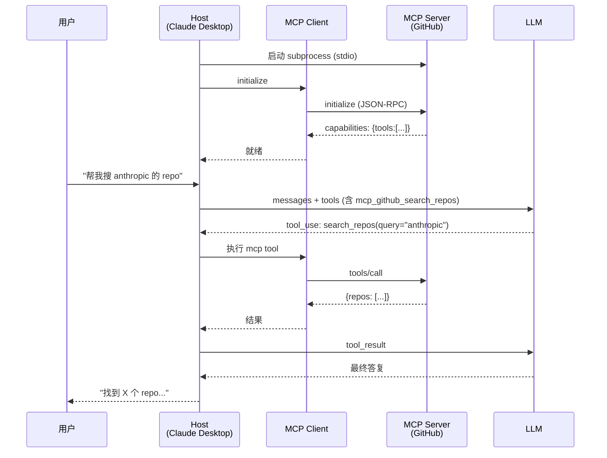

# MCP 协议(Model Context Protocol)

> **MCP 是 Anthropic 2024 年主推、2025-2026 快速成为业界标准的 Agent 工具协议**——目标是让 "LLM ↔ 工具" 之间的连接像 USB-C 一样标准化,任何 MCP-compatible 的 client 都能用任何 MCP server 提供的能力。
>
> 面试新热点(2026 年重点题),做 Agent 必须懂——本章讲透 **协议模型 / 三大原语(Resources/Tools/Prompts) / 传输层 / 官方 Server 生态 / 从零写一个 MCP Server**。

## 〇、核心提炼(5 段式)

### 核心机制(5 条必背)

1. **MCP = Model Context Protocol**——Anthropic 开源的**开放协议**,规范 LLM 应用如何连接工具/数据/上下文,类比"AI 的 USB-C"
2. **架构三角色**:**Host**(如 Claude Desktop/Cursor)+ **Client**(嵌在 Host 里)+ **Server**(暴露能力的进程)
3. **三大原语**:**Tools**(可执行动作)+ **Resources**(可读数据)+ **Prompts**(预置模板)——覆盖 agent 全部对外交互
4. **传输层两种**:**stdio**(本地 subprocess,Claude Desktop 用)+ **HTTP + SSE**(远程,streamable HTTP 新标准)
5. **JSON-RPC 2.0** 消息协议——请求/响应/通知三种消息,和 LSP(Language Server Protocol)同源思路

### 核心本质(必懂)

> MCP 的本质是 **"标准化 LLM 工具调用的接线协议"**——
>
> **在 MCP 之前**:
> - 每个 LLM 应用(Claude Desktop / Cursor / Windsurf)都自己实现工具集成
> - 每个工具(GitHub / Slack / Postgres)都要为不同 LLM 应用适配
> - **N × M 集成爆炸**——10 个应用 × 100 个工具 = 1000 个集成
>
> **有了 MCP**:
> - 任何 LLM 应用(Host)实现 MCP Client 一次,能用**所有** MCP Server
> - 任何工具(Server)实现一次,能被**所有** MCP 兼容应用用
> - **N + M 而不是 N × M**——降到 110 个集成
>
> **和 LangChain/OpenAI Plugin 的区别**:
> - LangChain 是**框架内 tool**(只在 LangChain Python 生态里)
> - OpenAI Plugin 是**OpenAI 专有**(2024 已废弃)
> - **MCP 是开放协议**(Anthropic 主推,微软/OpenAI/Google 已跟进支持)
>
> **MCP 不做的事**:
> - ❌ 不规范 LLM 怎么调用(那是 Tool Use API 的事)
> - ❌ 不规范 agent 架构(不是 LangChain 那种编排框架)
> - ❌ 不做认证(留给 Host 实现)
>
> **一句话**:MCP 只做**"应用层到工具层"的标准化协议**,不越位。

### 完整流程(面试必背)

```
1. Host(如 Claude Desktop)启动
   ↓
2. Host 读配置(mcp.json),启动配置的 MCP Server
   如:npx @modelcontextprotocol/server-github → 起一个 subprocess
   ↓
3. Host 通过 Client 发起 initialize(JSON-RPC over stdio)
   Server 回复能力清单:支持哪些 tools/resources/prompts
   ↓
4. Host 把 Server 提供的 tools 转换成 LLM Tool Use 格式,
   注入 system prompt / tools 数组
   ↓
5. 用户提问 → LLM 决定调 mcp_github_search_repos
   ↓
6. Host 的 Client 通过 JSON-RPC 调 Server 的 tools/call
   Server 执行 → 返回结果
   ↓
7. 结果作为 tool_result 回喂 LLM
   ↓
8. LLM 继续推理或输出最终答复
```



### 5 条核心机制 - 逐点讲透(见下面各节)

### 一句话总结

> MCP = **LLM 应用和工具之间的标准协议**;
> 三角色(Host/Client/Server)+ 三原语(Tools/Resources/Prompts)+ 两传输(stdio/HTTP)+ JSON-RPC 2.0;
> 把 N×M 集成爆炸降到 N+M,**Anthropic 主推,2025-2026 快速成为业界标准**——2026 面试 Agent 必问。

---

## 一、为什么需要 MCP(问题 → 解法)

### 1.1 MCP 之前的世界(2023-2024 初)

每个 LLM 应用都自己实现工具集成:

```
Claude Desktop → 自己写 GitHub 集成、Slack 集成、DB 集成...
Cursor        → 自己写一遍
Windsurf      → 自己写一遍
自研 agent    → 自己写一遍
```

每个工具方也要为不同应用做适配:

```
GitHub 官方 → 给 ChatGPT 做 plugin, 给 Claude 做...
```

**结果**:
- 集成成本爆炸(N × M)
- 每家实现质量参差不齐
- 用户在不同应用间无法复用工具

### 1.2 MCP 的解法

**开放协议 + 参考实现**:

```
Anthropic 定义协议(MCP spec)
   ↓
   官方 SDK: TypeScript / Python / Kotlin / C# / Java / Go(社区)
   ↓
   Server 生态: GitHub / Slack / Postgres / Filesystem / Puppeteer / ...
   ↓
   Client 生态: Claude Desktop / Claude Code / Cursor / Continue / Zed / ...
```

**结果**:
- 一个 Server 写完,所有 MCP 客户端都能用
- 一个 Client 实现,能用所有 MCP Server
- 集成成本从 O(N*M) 降到 O(N+M)

### 1.3 类比

```
USB 之前:每个外设都用专有接口(串口/PS2/PARALLEL...)
USB 之后:接口标准化,插上就能用

MCP 之前:每个 LLM 应用都自己实现工具集成
MCP 之后:接口标准化,配置一下就能用
```

> **一句话**:MCP 解决"LLM 应用 × 工具"的集成爆炸问题——**把 N×M 变 N+M**,让工具生态可以独立于 LLM 应用发展。

---

## 二、架构:Host / Client / Server 三角色

### 2.1 三角色定义

```
┌────────────────────────────────────────┐
│  Host(用户面对的应用)                   │
│  Claude Desktop / Claude Code /        │
│  Cursor / Continue / Zed / 自研        │
│                                        │
│  ┌──────────────────┐                  │
│  │  MCP Client 1   │ ← Host 里嵌的     │
│  └────────┬─────────┘                  │
│           │ JSON-RPC over stdio/HTTP   │
└───────────┼────────────────────────────┘
            │
            │(独立进程)
            ↓
┌──────────────────────────────────────┐
│  MCP Server 1(比如 GitHub)          │
│  暴露:                                │
│    - tools: create_issue, list_prs   │
│    - resources: repos, files         │
│    - prompts: code_review_template   │
└──────────────────────────────────────┘

一个 Host 可以连多个 Server:
Claude Desktop
  ├── Client 1 ← MCP Server GitHub
  ├── Client 2 ← MCP Server Postgres
  └── Client 3 ← MCP Server Filesystem
```

### 2.2 角色职责

| 角色 | 职责 | 举例 |
| --- | --- | --- |
| **Host** | 用户面对的应用,协调 LLM + Clients + UI | Claude Desktop, Claude Code |
| **Client** | Host 内部的连接器,维护和一个 Server 的通信 | Host SDK 里的 Client 类 |
| **Server** | 独立进程,暴露 tools/resources/prompts | 各种 MCP Server 实现 |

### 2.3 谁写谁?

```
Host 开发者:    应用厂商(Anthropic/Cursor/JetBrains 等)
Server 开发者:  工具方(GitHub/Slack/PG 官方 or 社区)
                普通开发者:公司内部工具、个人自动化

普通用户只是"配置"Server(粘贴 JSON),不写代码
```

### 2.4 Claude Desktop 配置示例

`~/Library/Application Support/Claude/claude_desktop_config.json`:

```json
{
  "mcpServers": {
    "github": {
      "command": "npx",
      "args": ["-y", "@modelcontextprotocol/server-github"],
      "env": {
        "GITHUB_PERSONAL_ACCESS_TOKEN": "ghp_xxx"
      }
    },
    "postgres": {
      "command": "npx",
      "args": ["-y", "@modelcontextprotocol/server-postgres",
               "postgresql://localhost/mydb"]
    },
    "filesystem": {
      "command": "npx",
      "args": ["-y", "@modelcontextprotocol/server-filesystem", "/Users/me/docs"]
    }
  }
}
```

启动 Claude Desktop → 三个 subprocess 起来 → 用户能问"帮我搜 GitHub 的 XXX repo""查 orders 表的今天订单""读 /docs/spec.md"。

> **一句话**:MCP 三角色 = **Host(用户应用)+ Client(嵌在 Host 里的连接器)+ Server(独立进程暴露能力)**;一个 Host 可连多个 Server,普通用户只配 JSON。

---

## 三、三大原语:Tools / Resources / Prompts

### 3.1 Tools(动作)

**定义**:LLM 可以调用的函数,**有副作用**(会改变状态)。

```
特征:
  - 由 LLM 主动调用(自动)
  - 可以有参数
  - 通常有副作用(写 DB / 发消息 / 修改文件)
  
类比:REST API 的 POST/PUT/DELETE
```

**示例**:

```json
{
  "name": "create_github_issue",
  "description": "在指定 repo 创建 issue",
  "inputSchema": {
    "type": "object",
    "properties": {
      "repo": {"type": "string"},
      "title": {"type": "string"},
      "body": {"type": "string"}
    },
    "required": ["repo", "title"]
  }
}
```

### 3.2 Resources(数据)

**定义**:LLM 可以读的**数据源**,无副作用。

```
特征:
  - 用 URI 唯一标识(scheme://path)
  - 只读(至少概念上)
  - 通常由用户或 Host 主动引用
  
类比:REST API 的 GET
```

**示例**:

```
file:///home/user/report.md
postgres://mydb/orders/schema
github://anthropic/anthropic-cookbook/README.md
custom://logs/2026-06-28
```

**Tools 和 Resources 的边界**:
- Tools 是**动作**(调用后有副作用)
- Resources 是**数据**(读取无副作用)
- 有些场景可以两种实现,选一个即可(通常 Resources 更明确)

### 3.3 Prompts(模板)

**定义**:预置的 prompt 模板,用户可以显式选择使用。

```
特征:
  - 用户主动选择("使用 code-review 模板")
  - 可以接受参数
  - 输出是 messages(直接塞进对话)

类比:操作系统的"打开方式"/ IDE 的 snippet
```

**示例**:

```json
{
  "name": "code-review",
  "description": "生成代码审查请求",
  "arguments": [
    {"name": "language", "description": "编程语言", "required": true},
    {"name": "code", "description": "要审查的代码", "required": true}
  ]
}
```

用户在 Claude Desktop 里点选 "code-review" → 弹参数输入框 → 生成对应 prompt 塞进对话。

### 3.4 三原语的使用者不同(关键区分)

```
Tools:      LLM 主动调用(agent 自主决策)
Resources:  用户或 Host 引用(用户"@"选择,或 Host 自动附上下文)
Prompts:    用户显式选择(点击/输入)
```

### 3.5 何时用哪个

```
LLM 需要主动做某事 → Tool
  例:创建 issue、发消息、执行 SQL

用户想让 LLM 参考某数据 → Resource
  例:"帮我看看这个报表"(附上 report.pdf 的 URI)

有固定套路的复杂 prompt → Prompt
  例:code review 模板、bug report 模板
```

> **一句话**:三原语按**"谁主动"**区分——**Tools 由 LLM 主动**(agent 决策)、**Resources 由用户/Host 引用**(数据源)、**Prompts 由用户显式选**(模板);多数场景 Server 主要暴露 Tools 就够。

---

## 四、传输层:stdio vs HTTP+SSE

### 4.1 stdio(本地 subprocess)

**特点**:
- Server 是 Host 的子进程
- 通信通过 **stdin / stdout**(JSON-RPC 消息一行一个)
- stderr 用于日志
- 无网络,无认证(继承本地权限)

**适用**:
- ✓ Claude Desktop 场景(用户桌面 app)
- ✓ 访问本地资源(文件系统 / 本地 DB)
- ✓ 需要用户凭证(SSH key / OAuth token 在本地)

**不适用**:
- ✗ 云端 SaaS agent
- ✗ 需要跨机器共享的 Server

### 4.2 HTTP + SSE(远程)

**旧版本**:HTTP POST(请求)+ SSE(服务端推事件)

**新版本(2025 spec)**:**Streamable HTTP**——用一个 endpoint 处理请求 + 流式响应,简化很多。

**适用**:
- ✓ 云端 agent 平台
- ✓ 多用户共享的 MCP Server
- ✓ 跨机器部署

**认证**:MCP 本身不定认证方式,由部署方选(OAuth / API Key / mTLS)。

### 4.3 选择建议(2026)

```
本地个人开发:      stdio(简单)
公司内部工具:      Streamable HTTP + 内网 IP + API Key
面向公众 SaaS:     Streamable HTTP + OAuth
```

> **一句话**:MCP 两种传输 = **stdio(本地 subprocess,Claude Desktop 用)+ HTTP+SSE / Streamable HTTP(远程,SaaS 用)**;2025 新 spec 推 Streamable HTTP,简化了双 endpoint 设计。

---

## 五、消息协议:JSON-RPC 2.0

### 5.1 消息格式

MCP 用**JSON-RPC 2.0**——和 **LSP(Language Server Protocol)同源思路**。

**Request**:

```json
{
  "jsonrpc": "2.0",
  "id": 1,
  "method": "tools/call",
  "params": {
    "name": "get_weather",
    "arguments": {"city": "北京"}
  }
}
```

**Response**:

```json
{
  "jsonrpc": "2.0",
  "id": 1,
  "result": {
    "content": [{"type": "text", "text": "晴 15℃"}]
  }
}
```

**Error**:

```json
{
  "jsonrpc": "2.0",
  "id": 1,
  "error": {
    "code": -32602,
    "message": "Invalid params",
    "data": {...}
  }
}
```

**Notification**(不需回复):

```json
{
  "jsonrpc": "2.0",
  "method": "notifications/tools/list_changed"
}
```

### 5.2 核心 methods

**初始化**:
```
initialize                Host → Server 建立连接,交换 capabilities
notifications/initialized Host → Server 确认就绪
```

**Tools**:
```
tools/list                列出所有工具
tools/call                调用工具
notifications/tools/list_changed  工具列表变了(Server 主动推)
```

**Resources**:
```
resources/list            列出资源
resources/read            读取资源
resources/subscribe       订阅资源变化
resources/unsubscribe     取消订阅
notifications/resources/updated  资源更新通知
```

**Prompts**:
```
prompts/list              列出 prompts
prompts/get               获取 prompt(带参数)
```

### 5.3 完整交互例

```json
// Host → Server: initialize
{"jsonrpc":"2.0","id":1,"method":"initialize","params":{"protocolVersion":"2024-11-05","capabilities":{}}}

// Server → Host: 能力清单
{"jsonrpc":"2.0","id":1,"result":{"protocolVersion":"2024-11-05","capabilities":{"tools":{},"resources":{}}}}

// Host → Server: 列出工具
{"jsonrpc":"2.0","id":2,"method":"tools/list"}

// Server → Host: 工具清单
{"jsonrpc":"2.0","id":2,"result":{"tools":[{"name":"get_weather","description":"...","inputSchema":{...}}]}}

// Host → Server: 调工具
{"jsonrpc":"2.0","id":3,"method":"tools/call","params":{"name":"get_weather","arguments":{"city":"北京"}}}

// Server → Host: 结果
{"jsonrpc":"2.0","id":3,"result":{"content":[{"type":"text","text":"晴 15℃"}]}}
```

---

## 六、官方 Server 生态(2026)

### 6.1 Anthropic 官方 Server(reference implementations)

| Server | 能力 |
| --- | --- |
| **filesystem** | 读写文件系统(受配置目录限制) |
| **github** | GitHub API(issue/PR/repo/文件) |
| **gitlab** | GitLab API |
| **google-drive** | Google Drive 文件访问 |
| **slack** | Slack 消息读写 |
| **postgres** | PostgreSQL 只读查询 + schema introspection |
| **sqlite** | SQLite 查询 |
| **puppeteer** | 浏览器自动化 |
| **brave-search** | Brave 搜索 API |
| **fetch** | HTTP GET 抓取网页 |
| **memory** | 知识图谱式长期记忆 |
| **sequentialthinking** | 让 LLM 结构化多步思考 |
| **everything** | 演示所有 MCP 能力(参考实现) |

### 6.2 社区 / 第三方(2026 主流)

```
数据库:MongoDB / MySQL / ClickHouse / Redis
API:Notion / Linear / Jira / ClickUp / Airtable / Stripe
云:AWS / GCP / Cloudflare / Vercel / Fly.io
浏览器:Playwright / Chromium
终端:iTerm / SSH
观测:Sentry / Datadog / Grafana
IDE:VSCode / JetBrains(通过插件)
```

### 6.3 商业化 Server

各家 SaaS 开始官方支持 MCP:
- Cloudflare(2025 官方发布 MCP Server)
- Stripe / Linear / Sentry(2025-2026 陆续跟进)

### 6.4 找 Server 的资源

```
官方 registry: github.com/modelcontextprotocol/servers
社区导航: mcp.so / mcpservers.org / smithery.ai
```

---

## 七、从零写一个 MCP Server(Python 示例)

### 7.1 安装 SDK

```bash
pip install mcp
```

### 7.2 最小可运行 Server

```python
# server.py
from mcp.server.fastmcp import FastMCP

mcp = FastMCP("weather")

@mcp.tool()
def get_weather(city: str) -> str:
    """查询指定城市的天气。
    
    Args:
        city: 城市中文名,如 '北京'
    """
    # 实际调用天气 API...
    return f"{city}: 晴 15℃"

@mcp.resource("weather://forecast/{city}")
def get_forecast(city: str) -> str:
    """获取未来 7 天预报"""
    return f"{city} 未来 7 天预报: ..."

@mcp.prompt()
def weather_report(city: str) -> str:
    """生成天气报告 prompt"""
    return f"请为 {city} 生成一份详细的天气播报,包括穿搭建议"

if __name__ == "__main__":
    mcp.run(transport="stdio")
```

### 7.3 在 Claude Desktop 里配置

`claude_desktop_config.json`:

```json
{
  "mcpServers": {
    "weather": {
      "command": "python",
      "args": ["/path/to/server.py"]
    }
  }
}
```

重启 Claude Desktop → 现在可以问"北京今天天气?" → Claude 会调你的 MCP Server。

### 7.4 Go MCP Server(社区实现)

```go
// 使用 github.com/mark3labs/mcp-go(社区主流实现)
package main

import (
    "context"
    "github.com/mark3labs/mcp-go/mcp"
    "github.com/mark3labs/mcp-go/server"
)

func main() {
    s := server.NewMCPServer("weather", "1.0.0")

    weatherTool := mcp.NewTool("get_weather",
        mcp.WithDescription("查询指定城市天气"),
        mcp.WithString("city", mcp.Required(), mcp.Description("中文城市名")),
    )

    s.AddTool(weatherTool, func(ctx context.Context, req mcp.CallToolRequest) (*mcp.CallToolResult, error) {
        city := req.Params.Arguments["city"].(string)
        // 查询天气...
        return mcp.NewToolResultText(city + ": 晴 15℃"), nil
    })

    server.ServeStdio(s)
}
```

### 7.5 调试 MCP Server

**MCP Inspector**(官方调试工具):

```bash
npx @modelcontextprotocol/inspector python server.py
```

打开浏览器 UI,可以手动列出/调用 tools,看 JSON-RPC 流量。**开发必用**。

### 7.6 写好 MCP Server 的原则

```
1. Tool description 要清晰(参考第 04 章 Schema 设计原则)
2. 错误返回详细信息(LLM 才能自纠错)
3. 危险操作在 Server 层加确认或权限校验
4. 长任务用流式响应(通过 notifications 推进度)
5. 官方 SDK 优先(TypeScript / Python 最完善)
```

---

## 八、MCP vs 其他方案

### 8.1 MCP vs LangChain Tool

| 维度 | MCP | LangChain Tool |
| --- | --- | --- |
| 定位 | 开放协议 | Python 框架内的抽象 |
| 语言 | 跨语言(TS/Py/Go/Java) | Python(主要) |
| 复用性 | 任何 MCP client 都能用 | LangChain 生态内 |
| 部署 | 独立进程 / HTTP 服务 | 应用内 |
| 生态 | 快速增长(2025-2026) | 成熟但封闭 |

### 8.2 MCP vs OpenAI Plugin

| 维度 | MCP | OpenAI Plugin |
| --- | --- | --- |
| 状态 | 活跃发展 | **已废弃**(2024) |
| 归属 | 开放 | OpenAI 专有 |
| 传输 | stdio / HTTP | HTTP 强制 |
| 认证 | 灵活 | OAuth 强制 |

### 8.3 MCP vs Tool Use API

```
Tool Use API:LLM 层的 tool 调用协议(定义 LLM 如何输出 tool_use)
MCP:        应用层的工具连接协议(定义 Host 如何连 Server)

两者互补:
  应用 <-MCP-> Tool Server
    ↓
  应用 <-Tool Use API-> LLM
```

一个具体流程:
- LLM 输出 tool_use → 应用收到
- 应用通过 MCP Client → Server 执行工具
- 结果 → 通过 Tool Use API 回喂给 LLM

### 8.4 什么时候用 MCP

**用 MCP**:
- ✓ 想让工具能被多个 Host(Claude Desktop / Cursor / 自研)复用
- ✓ 想接现成的官方 Server(GitHub / Slack / Postgres)
- ✓ 团队多个应用共用工具集

**不用 MCP,直接嵌 tool**:
- ✗ 单个应用内部,不需要跨应用复用
- ✗ 已经用 LangChain 深度绑定
- ✗ 快速原型阶段

> **一句话**:MCP 和 LangChain Tool / OpenAI Plugin **不冲突**——MCP 是**跨应用开放协议**,LangChain 是**框架内抽象**,OpenAI Plugin 已废;MCP 在 Tool Use API 之上一层,补 "应用-工具" 层的标准化。

---

## 九、生产化关注点

### 9.1 认证

```
stdio 传输:   继承本地权限(用户桌面场景足够)
HTTP 传输:    需要认证
  - API Key(简单)
  - OAuth 2.0(标准)
  - mTLS(内网)
```

### 9.2 权限最小化

```
MCP Server 应该只暴露必要能力
Filesystem Server 用 --allowed-directories 限制
GitHub Server 用最小 scope 的 token
```

### 9.3 观测

```
Server 侧记日志:
  - 每次 tool call 的 name/args(脱敏后)
  - 执行时长
  - 成功/失败
  - 调用来源(哪个 Host / user_id)

Host 侧记链路:
  - LLM → tool_use → MCP Client → Server 全链路 trace
  - 集成 LangSmith / LangFuse / OpenTelemetry
```

### 9.4 限流

```
Server 侧对每个 client 限流(防 LLM 循环烧下游)
Host 侧对每个用户限流
```

### 9.5 版本兼容

```
MCP protocolVersion 语义化(2024-11-05 / 2025-xx-xx)
initialize 时协商版本
Server 保持向后兼容一段时间
```

---

## 十、常见坑

```
坑 1:以为 MCP 是编排框架
  → MCP 只是连接协议,不做编排(那是 LangGraph/Eino 的事)

坑 2:MCP Server 里返回 500 行 JSON
  → LLM 处理效果差,和普通 Tool 一样要做摘要

坑 3:stdio Server 里 print 调试信息
  → 会污染 stdio 通信,必须 log 到 stderr

坑 4:Tool description 写得像 API 文档
  → MCP Tool description 是给 LLM 看的,要说"什么时候用"

坑 5:一个 Server 塞 50 个 tools
  → LLM 选工具困难,拆成多个 Server

坑 6:忘记做危险操作确认
  → Server 会直接执行,危险动作要 Host 层弹确认

坑 7:HTTP Server 没认证
  → 内网 MCP Server 也不能裸奔,至少 API Key

坑 8:不用官方 SDK 手撸 JSON-RPC
  → 边界 case 多(id 冲突/消息顺序/notification),踩坑没必要
```

## 十一、面试题速答

### Q1:什么是 MCP?解决什么问题?

```text
MCP = Model Context Protocol,Anthropic 2024 年开源的开放协议,
规范 LLM 应用如何连接工具、数据、上下文。

解决的问题:LLM 应用和工具集成爆炸(N × M)
  Claude Desktop / Cursor / 自研 agent 每家都自己实现 GitHub/Slack/DB 集成
  GitHub/Slack 也要为每家 LLM 应用适配

MCP 让集成变 N + M:
  Server 写一次,所有 MCP 兼容 Host 都能用
  Host 实现 Client 一次,能用所有 Server

类比"AI 的 USB-C"——接口标准化,插上就能用。
```

### Q2:MCP 的三大原语?

```text
Tools:     LLM 主动调用的动作,有副作用
           例:create_issue / send_email
Resources: LLM/用户读的数据源,无副作用,用 URI 唯一标识
           例:file:///docs/spec.md, postgres://db/orders
Prompts:   用户显式选择的模板
           例:code-review 模板 / bug-report 模板

按"谁主动"区分:
  Tools 由 LLM 主动(agent 决策)
  Resources 由用户/Host 引用(数据源)
  Prompts 由用户显式选(模板)
```

### Q3:MCP 传输层有哪些?

```text
stdio:  本地 subprocess,通过 stdin/stdout 通信
        Claude Desktop 场景主用
        无网络无认证,继承本地权限
HTTP + SSE:远程调用,已被 Streamable HTTP 简化
             云端 SaaS 场景用
             需要自己实现认证(OAuth/API Key)

消息协议都是 JSON-RPC 2.0,和 LSP 同源。
```

### Q4:MCP 和 LangChain Tool / OpenAI Plugin 区别?

```text
MCP:      跨语言开放协议,任何 Host 都能用任何 Server
LangChain Tool:  Python 框架内抽象,只在 LangChain 生态
OpenAI Plugin:    OpenAI 专有,2024 已废弃

MCP 定位在"应用-工具"层,和 LLM 层的 Tool Use API 互补,不冲突。
LangChain Tool 一般也可以 wrap 成 MCP Server 复用。
```

### Q5:什么时候该用 MCP,什么时候不用?

```text
用:
  - 想让工具能被多个 Host 复用(Claude Desktop / Cursor / 自研)
  - 想接现成的官方 Server(GitHub / Slack / Postgres)
  - 团队多个应用共用工具集

不用:
  - 单个应用内部,不需要跨应用复用
  - 已经深度绑定 LangChain
  - 快速原型阶段

面试加分点:知道 MCP 只是"连接协议",不是"编排框架"——
编排还是 LangGraph/Eino,MCP 补的是"应用-工具" 层。
```

## 十二、关联阅读

```
本目录:
- 04-tool-use-function-calling      Tool Use API(LLM 层)
- 05-agent-architectures            Agent 架构(编排层)
- 09-agent-frameworks               LangGraph / Eino(和 MCP 组合使用)

外部:
- MCP 官方: modelcontextprotocol.io
- MCP GitHub: github.com/modelcontextprotocol
- 官方 Servers: github.com/modelcontextprotocol/servers
- 社区导航: mcp.so / smithery.ai
- Python SDK: pip install mcp
- TypeScript SDK: npm install @modelcontextprotocol/sdk
- Go SDK(社区): github.com/mark3labs/mcp-go
```

> **一句话核心(全篇精炼)**:
> MCP = **LLM 应用和工具之间的开放连接协议**;
> 三角色(Host/Client/Server)+ 三原语(Tools/Resources/Prompts)+ 两传输(stdio/HTTP)+ JSON-RPC 2.0;
> 把 N×M 集成爆炸降到 N+M——**Anthropic 主推,2025-2026 快速成为业界标准**;
> 和 Tool Use API 互补(**MCP 补应用-工具层,Tool Use 是 LLM 层**),和 LangChain 不冲突(**MCP 是协议,LangChain 是框架**);
> 8 年后端做 Agent,MCP 是**2026 面试新热点**,必须能讲能写 Server。
