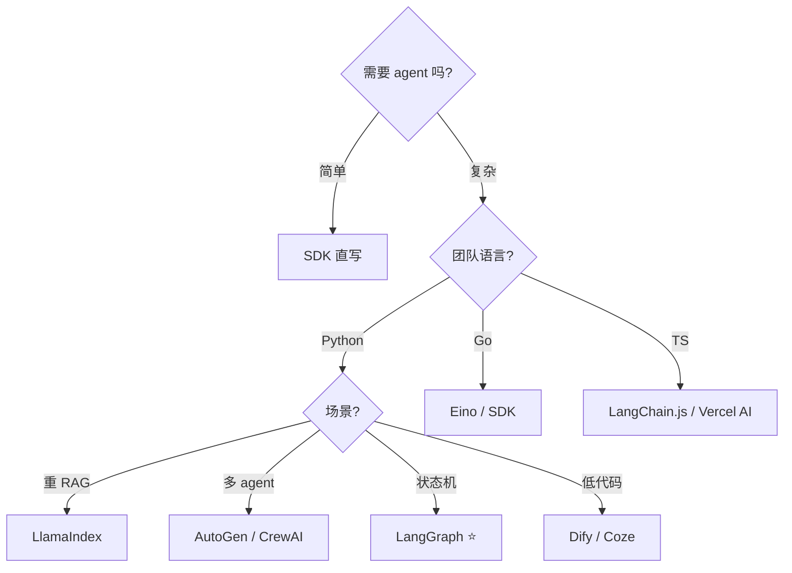

# Agent 框架选型:LangChain / LangGraph / LlamaIndex / AutoGen / CrewAI / Dify / Eino

> 2026 年 agent 框架**过剩**——LangChain 老牌全家桶、LangGraph 状态机、LlamaIndex RAG 王者、AutoGen 多 agent、CrewAI 角色化、Dify 低代码、Eino 是 Go 生态首选……**每家定位不同,选错了效率大打折扣**。
>
> 本章讲透 **7 大主流框架的定位 / 优劣 / 选型矩阵 / 何时不用框架** —— 8 年后端做 Agent 的框架决策一次讲清。
>
> 前置:[05-agent-architectures](05-agent-architectures.md)(理解 ReAct/Plan-Execute 才知道框架帮你解决什么)

## 〇、核心提炼(5 段式)

### 核心机制(6 条必背)

1. **框架不是必须的**——简单 agent 用 SDK 直写就够(Anthropic 官方也推荐能不用框架就不用)
2. **LangGraph = LangChain 团队主推的状态机架构**——**2026 Python 首选**,不再推荐纯 LangChain
3. **LlamaIndex 是 RAG 之王**——涉及重 RAG 场景优先
4. **AutoGen / CrewAI 是多 agent 领域**——ReAct 单 agent 用不上
5. **Eino 是 Go 生态首选**——字节开源,LangChain 的 Go 版
6. **Dify / Coze 是低代码平台**——业务 PM 参与 / 快速原型场景

### 核心本质(必懂)

> Agent 框架的本质是**"抽象一次,复用无数次"**——把 tool use 循环、memory 管理、多 agent 协作、RAG 编排这些**样板代码抽象成可组合的组件**。
>
> 但框架也有**代价**:
> - **过度抽象**——早期 LangChain 被诟病"改一个 prompt 要读三层源码"
> - **锁定**——迁移框架很痛,选错要还债
> - **调试难**——多层封装 + 隐式行为,出问题不好定位
> - **性能损耗**——框架层多一层 overhead
>
> **Anthropic 官方 Building Effective Agents 明确说**:"很多 agent 用直接 SDK 就能实现,不要过早引入框架"——**框架是工具不是目的**。
>
> **选型决策的核心问题**:
> - **你的 agent 复杂度是什么级别?**(简单 tool use / ReAct / 多 agent / 大规模编排)
> - **团队语言?**(Python / Go / TS / Java)
> - **业务场景?**(纯 chatbot / 重 RAG / 多 agent / 自动化)
> - **谁维护?**(工程师专属 / 业务 PM 也参与)

### 完整流程(选型决策树)

```
1. 需要 agent 吗?
   └── 单次调用能搞定 → 直接 SDK,不上框架
   └── 需要循环 / tool use / 复杂编排 → 继续

2. 团队语言?
   └── Python → LangGraph(单 agent 状态机)/ AutoGen(多 agent)
   └── Go → Eino / anthropic-sdk-go
   └── TypeScript → LangChain.js / Vercel AI SDK
   └── Java → LangChain4j / Spring AI

3. 场景权重?
   └── 重 RAG → LlamaIndex
   └── 多 agent 协作 → AutoGen / CrewAI
   └── 业务 PM 参与 → Dify / Coze
   └── 自研深度 → 只用 SDK + 少量库

4. 生产要求?
   └── 需要状态持久化 / 断点续跑 → LangGraph
   └── 需要人在环 / 审批 → LangGraph / 自研
   └── 需要评测追踪 → LangSmith / LangFuse
```



### 6 条核心机制 - 逐点讲透(见下面各节)

### 一句话总结

> Agent 框架 **不是必须的**——**简单场景 SDK 直写,复杂再上框架**;
> Python 首选 **LangGraph**,Go 首选 **Eino**,RAG 场景选 **LlamaIndex**,多 agent 选 **AutoGen/CrewAI**,低代码选 **Dify**;
> **框架是工具不是目的**——Anthropic 明确"能不用框架就不用",过度抽象是最大坑。

---

## 一、LangChain(老牌全家桶)

### 1.1 定位与历史

- **2022 年最早流行的 LLM 框架**,推动了"LLM 应用工程化"概念
- **2023 年爆火** → 但也被大量吐槽"过度抽象"
- **2024 年拆分**:LangChain 变基础库,主推 **LangGraph**(编排层)+ **LangSmith**(观测)
- **2026 现状**:仍是 Python 最全生态,但**新项目直接上 LangGraph 更好**

### 1.2 核心抽象

```python
from langchain_anthropic import ChatAnthropic
from langchain.chains import LLMChain
from langchain.prompts import PromptTemplate

llm = ChatAnthropic(model="claude-sonnet-4-6")
prompt = PromptTemplate.from_template("翻译成英文: {text}")
chain = prompt | llm  # LCEL(LangChain Expression Language)
result = chain.invoke({"text": "你好世界"})
```

**核心概念**:
- **Chain**:把 prompt / LLM / parser / tool 串起来
- **LCEL**:pipe 式组合语法
- **Memory**:内置多种 memory 类
- **Tool**:统一的 tool 抽象

### 1.3 优缺点

**优点**:
- 生态最广(集成几乎所有 LLM / 向量库 / 数据源)
- 组件多,能拼各种 pipeline
- 社区大,教程多

**缺点**:
- **过度抽象**——改一个 prompt 要读源码找哪层封装了
- 学习曲线陡,概念多(Chain / Agent / Runnable / RunnableSequence...)
- **性能有 overhead**(层层封装)
- 迁移成本高

### 1.4 何时用 LangChain 而不是 LangGraph

**基本不用**——LangGraph 是新的推荐路径。

但如果:
- ✓ 老项目已经在用
- ✓ 简单 chain(不涉及循环/分支/状态)
- ✓ 需要用它某个内置组件(如某个 vector store 集成)

> **一句话**:LangChain 是 agent 框架先驱,**但 2026 已让位给 LangGraph** —— 新项目直接上 LangGraph,老项目按需迁移。

---

## 二、LangGraph(2026 Python 首选)★

### 2.1 定位

**LangChain 团队 2024 主推**,把 agent 抽象成**状态机 / 有向图**——节点是函数,边是流转条件。

**核心思想**:
- Agent 本质是"状态在节点间流转"——**明示化建模最清晰**
- 支持循环(ReAct)/ 分支(条件路由)/ 并行(fan-out) / 人在环
- 状态持久化 → 断点续跑 / 长任务

### 2.2 核心代码

```python
from typing import TypedDict
from langgraph.graph import StateGraph, END
from langchain_anthropic import ChatAnthropic

class State(TypedDict):
    messages: list
    step_count: int

llm = ChatAnthropic(model="claude-sonnet-4-6")

def call_llm(state: State):
    resp = llm.invoke(state["messages"])
    return {"messages": state["messages"] + [resp], "step_count": state["step_count"] + 1}

def should_continue(state: State):
    if state["step_count"] > 10:
        return END
    last = state["messages"][-1]
    return "tools" if has_tool_call(last) else END

def call_tools(state: State):
    # 执行 tool_use...
    return {"messages": state["messages"] + [tool_result]}

# 建图
graph = StateGraph(State)
graph.add_node("llm", call_llm)
graph.add_node("tools", call_tools)
graph.set_entry_point("llm")
graph.add_conditional_edges("llm", should_continue, {"tools": "tools", END: END})
graph.add_edge("tools", "llm")

app = graph.compile()

# 运行
result = app.invoke({"messages": [{"role": "user", "content": "你好"}], "step_count": 0})
```

### 2.3 LangGraph 的核心概念

| 概念 | 说明 |
| --- | --- |
| **State** | 图的共享状态(TypedDict),节点读写 |
| **Node** | 函数,输入 state,输出 state 的 delta |
| **Edge** | 节点流转,有条件边(conditional) |
| **Checkpoint** | 状态持久化,支持断点续跑 |
| **Interrupt** | 人在环(human-in-the-loop) |
| **Subgraph** | 图嵌套,支持复杂结构 |

### 2.4 LangGraph 支持的模式

**Supervisor(主 agent + 多个 sub-agent)**:

```python
# supervisor 决策路由到哪个 sub-agent
def supervisor(state):
    prompt = f"根据当前状态,选择: researcher / coder / writer / END"
    choice = llm.invoke(...)
    return choice
```

**Human-in-the-loop(人工审批)**:

```python
graph.add_node("wait_for_approval", human_approval_node)
# checkpoint 在这里暂停,等外部输入
```

**Time Travel(时光回溯)**:

```python
# 保留每一步的 checkpoint,可以回退到任意步骤重试
```

### 2.5 LangGraph vs LangChain

| 维度 | LangChain | LangGraph |
| --- | --- | --- |
| 定位 | 组件库 | 编排框架 |
| 结构 | Chain(线性 pipe) | Graph(状态机) |
| 循环 | 不好表达 | 原生支持 |
| 状态持久化 | 无 | Checkpoint |
| 人在环 | 弱 | 一等公民 |
| 学习曲线 | 陡 | 中等 |
| **推荐度** | 老 | **新项目首选** |

### 2.6 LangGraph 的优缺点

**优点**:
- ✓ 状态机模型清晰,复杂 agent 好组织
- ✓ 内置断点续跑 / 人在环 / 时光回溯 / 并行
- ✓ 和 LangSmith 深度集成(观测强)
- ✓ 团队维护,更新快

**缺点**:
- 相比裸 SDK 仍有学习曲线
- 部分抽象仍较重(比如 State 强类型)
- Node 之间通过 State 通信,不像纯函数直观

> **一句话**:LangGraph = **agent 状态机框架**,LangChain 团队主推,**2026 Python 单/多 agent 首选**;循环 / 分支 / 断点续跑 / 人在环 / 并行都一等公民,和 LangSmith 观测无缝集成。

---

## 三、LlamaIndex(RAG 之王)

### 3.1 定位

**LlamaIndex 是 RAG 领域最深的框架**——如果你的 agent 主要是"基于文档回答问题",直接用它。

### 3.2 核心代码

```python
from llama_index.core import VectorStoreIndex, SimpleDirectoryReader

# 一行索引
documents = SimpleDirectoryReader("./docs").load_data()
index = VectorStoreIndex.from_documents(documents)

# 一行查询
query_engine = index.as_query_engine()
response = query_engine.query("什么是 K8s?")
print(response)  # 自动检索 + rerank + 组装 prompt + 调 LLM
```

**优点**:
- ✓ **RAG 抽象最深**(chunking / embedding / 检索 / rerank / 结果融合)
- ✓ 内置各种 index(Vector / Tree / Keyword / Graph)
- ✓ Agent 模块也在完善(ReAct / Function Agent)

**缺点**:
- 非 RAG 场景不如 LangGraph 灵活
- Agent 编排不如 LangGraph 强

### 3.3 何时用

```
✓ 主打 RAG(知识库问答 / 文档 chat)
✓ 需要各种高级 index(Tree Summarize / Sub-question)
✗ 复杂 agent 编排 → 用 LangGraph
```

> **一句话**:LlamaIndex 是 **RAG 之王**——需要重 RAG 场景优先;Agent 编排不如 LangGraph,两者可以组合(LangGraph 做编排,LlamaIndex 做 RAG 层)。

---

## 四、AutoGen(Microsoft 多 agent)

### 4.1 定位

**Microsoft 2023 年推出的多 agent 框架**——通过**多个 LLM agent 对话协作**完成任务。

### 4.2 核心思想

```
不是 "一个大 agent 拆任务",而是 "多个 agent 协作对话":
  - UserProxy:代表用户,可以执行代码
  - AssistantAgent:LLM 助手,给建议
  - GroupChat:多 agent 群聊
```

### 4.3 核心代码

```python
from autogen import AssistantAgent, UserProxyAgent, GroupChat, GroupChatManager

# 定义 agents
coder = AssistantAgent(name="Coder", llm_config={"model": "claude-sonnet-4-6"},
    system_message="你是资深 Python 工程师")
reviewer = AssistantAgent(name="Reviewer", llm_config={...},
    system_message="你是 code reviewer")
user_proxy = UserProxyAgent(name="User", code_execution_config={"use_docker": False})

# 群聊
groupchat = GroupChat(agents=[user_proxy, coder, reviewer], messages=[])
manager = GroupChatManager(groupchat=groupchat, llm_config={...})

user_proxy.initiate_chat(manager, message="写一个 Python 函数计算斐波那契")
```

Agent 们会自动对话:Coder 写 → Reviewer 评 → Coder 改 → User 验证 → 循环直到完成。

### 4.4 特点

**优点**:
- ✓ 多 agent 对话原生支持
- ✓ 内置代码执行(可以真跑 Python)
- ✓ 灵活的 human-in-the-loop
- ✓ 微软支持,长期维护

**缺点**:
- 相比 LangGraph 抽象层次较低
- 状态管理不如 LangGraph 明确
- 生态不如 LangChain 广

### 4.5 AutoGen 0.4(2024 底重构)

2024 底 AutoGen 大重构,新版本:
- 事件驱动架构
- 更好的分布式支持
- **AutoGen Studio**:低代码 UI

> **一句话**:AutoGen 是 Microsoft 的多 agent 框架,主打**多 agent 对话协作**;内置代码执行,适合"AI 团队"式任务(coder + reviewer + planner);不如 LangGraph 通用,专精多 agent。

---

## 五、CrewAI(角色化多 agent)

### 5.1 定位

**类似 AutoGen 但更"角色化"** —— 定义"角色 + 任务 + 团队",偏 demo/教育友好。

### 5.2 核心代码

```python
from crewai import Agent, Task, Crew

# 定义 agents(强调 role + goal + backstory)
researcher = Agent(
    role="资深研究员",
    goal="调研 AI Agent 领域最新进展",
    backstory="你是有 10 年经验的 AI 研究员...",
    llm=ChatAnthropic(...)
)
writer = Agent(
    role="技术作家",
    goal="把研究成果写成清晰文章",
    backstory="..."
)

# 定义任务
research_task = Task(
    description="调研 2026 年 agent 框架排名",
    agent=researcher
)
write_task = Task(
    description="根据调研写一篇 800 字博客",
    agent=writer,
    context=[research_task]  # 依赖 research_task 的输出
)

# 组建 Crew
crew = Crew(agents=[researcher, writer], tasks=[research_task, write_task])
result = crew.kickoff()
```

### 5.3 特点

**优点**:
- ✓ 概念直观(role + task + crew,像现实公司)
- ✓ 上手快,demo 友好
- ✓ 内置任务依赖 / 顺序执行

**缺点**:
- 抽象偏浅(生产项目容易撞天花板)
- 灵活性不如 LangGraph
- 主要适合"多 agent 完成一个流程",不适合复杂状态机

### 5.4 何时用

```
✓ 快速原型 / demo(role 概念好讲)
✓ "AI 团队"式任务(研究员 + 作家 + reviewer)
✗ 复杂状态管理 → LangGraph
✗ 单 agent → SDK
```

> **一句话**:CrewAI 是**角色化多 agent 框架**——用"角色 + 任务 + Crew"隐喻现实团队,上手快 demo 友好;适合原型和简单多 agent 流程,生产复杂场景不如 LangGraph。

---

## 六、Dify / Coze(低代码平台)

### 6.1 定位

**不是"框架"是"平台"** —— 通过 UI 拖拽配置 agent,不写代码或少写代码。

### 6.2 Dify

- 开源(有 SaaS 也有自部署)
- 可视化编辑器 + 内置 RAG + prompt 版本管理
- 支持 workflow / chatbot / agent 三种模式

### 6.3 Coze(字节)

- 主打小白友好
- 内置各种插件(搜索 / 图片 / 代码执行)
- 国内 SaaS 免费额度大

### 6.4 何时用

```
✓ 业务 PM / 运营参与 agent 配置
✓ 快速迭代原型
✓ 客服 / 简单 chatbot
✗ 深度定制(生产核心链路)
✗ 复杂多 agent
✗ 高度性能敏感(平台有 overhead)
```

### 6.5 常见组合

```
业务原型:                 Dify 拖出来
效果不够 / 需要深度定制:  抽出核心逻辑,用 LangGraph / Eino 重写
关键链路走代码,辅助流程留 Dify
```

> **一句话**:Dify / Coze 是**低代码 agent 平台**——业务 PM 参与场景首选,快速原型友好;深度定制和性能场景必须转代码。

---

## 七、Eino(Go 生态首选)★

### 7.1 定位

**字节跳动开源(2024)的 Go 版 LangChain**——**Go 团队做 agent 首选**。

- github.com/cloudwego/eino
- 由 CloudWeGo(字节开源基础库)团队维护
- 学习 LangChain / LangGraph 的抽象,适配 Go 语言

### 7.2 核心代码

```go
import (
    "github.com/cloudwego/eino/components/model"
    "github.com/cloudwego/eino/compose"
)

// 构建 chain
chain := compose.NewChain[map[string]any, string]().
    AppendPrompt(promptTpl).
    AppendChatModel(claudeModel).
    AppendParser(parser)

runnable, _ := chain.Compile(ctx)
result, _ := runnable.Invoke(ctx, map[string]any{"query": "你好"})
```

### 7.3 特点

**优点**:
- ✓ **Go 原生 first-class**(不是 SDK 简单封装)
- ✓ 类型安全(泛型)
- ✓ 性能好(Go 天生优势)
- ✓ 字节内部大规模使用,靠谱

**缺点**:
- 生态相对 Python 小(集成没那么全)
- 社区活跃度不如 LangChain
- 文档主要中文

### 7.4 Go Agent 三层选择

```
最轻:  anthropic-sdk-go(官方 SDK)
中间:  langchaingo(社区 LangChain Go 版,不官方)
最全:  Eino(字节,推荐)
```

### 7.5 何时用 Eino vs SDK

```
简单 agent(单 LLM + 少量 tool):
  anthropic-sdk-go + 手写循环 → 100 行搞定

复杂 agent(状态机 / 多分支 / RAG / 观测):
  Eino → 组件化 + 类型安全 + 生产就绪
```

> **一句话**:Eino = 字节开源的 **Go 版 LangChain**,**Go 团队做 agent 首选**;Anthropic-sdk-go 起手,复杂场景升 Eino,类型安全 + 性能好 + 字节内部靠谱。

---

## 八、其他框架简介

### 8.1 Vercel AI SDK(TypeScript)

- 前端场景首选(React / Next.js)
- 流式渲染友好
- Tool use / RAG 都支持

### 8.2 Semantic Kernel(Microsoft)

- .NET / Python / Java 支持
- 微软自家 agent 生态
- 企业级场景

### 8.3 Haystack(Deepset)

- RAG 老牌框架(2020 就有)
- Pipeline 抽象好
- 部分场景比 LlamaIndex 更专业

### 8.4 DSPy(Stanford)

- **不写 prompt,写 signature**(输入输出类型)
- 自动优化 prompt(有点像"prompt 的 gradient descent")
- 研究导向,生产使用有限

### 8.5 LangChain4j / Spring AI

- Java 生态选择
- Spring 集成方便

### 8.6 PocketFlow / Griptape / Instructor

- 各有特色的小众框架

---

## 九、选型决策矩阵

### 9.1 按团队语言

| 语言 | 首选 | 备选 |
| --- | --- | --- |
| **Python** | LangGraph(单/多 agent 主流) | LlamaIndex(重 RAG)/ AutoGen(多 agent) |
| **Go** | Eino | anthropic-sdk-go(简单) |
| **TypeScript** | Vercel AI SDK / LangChain.js | 无 |
| **Java** | LangChain4j / Spring AI | Semantic Kernel |
| **.NET** | Semantic Kernel | LangChain(通过 API) |

### 9.2 按场景

| 场景 | 首选 |
| --- | --- |
| 简单 chatbot | SDK 直写 |
| ReAct 单 agent | LangGraph(Py) / Eino(Go) |
| 重 RAG 知识库 | LlamaIndex |
| 多 agent 协作 | AutoGen / LangGraph Supervisor |
| 业务 PM 参与 | Dify / Coze |
| 前端 chatbot | Vercel AI SDK |
| 研究/prompt 优化 | DSPy |

### 9.3 按团队规模

| 规模 | 建议 |
| --- | --- |
| **1-2 人快速验证** | Dify / SDK 直写 |
| **3-10 人产品化** | LangGraph / Eino + LangSmith |
| **10+ 人大项目** | LangGraph + 自建观测 + 自定义抽象 |
| **平台化(多业务共用)** | 自研框架 + 参考 LangGraph |

---

## 十、何时**不用**框架

### 10.1 Anthropic 官方建议

*Building Effective Agents*(2024)明确:
> "很多 agent 用直接的 LLM API 就能实现,不要过早引入框架。"

### 10.2 直接用 SDK 更好的场景

```
1. 简单 tool use(< 5 个 tool,< 10 步循环)
2. 团队小 + 项目小(避免维护框架)
3. 高性能场景(减少 overhead)
4. 深度定制(框架反而束缚)
5. 学习阶段(先懂原理再用框架)
```

### 10.3 SDK 直写的核心模板(Python)

```python
from anthropic import Anthropic

client = Anthropic()
messages = []
tools = [...]

def run_agent(user_input, max_iter=10):
    messages.append({"role": "user", "content": user_input})
    for i in range(max_iter):
        resp = client.messages.create(
            model="claude-sonnet-4-6",
            max_tokens=1024,
            tools=tools,
            messages=messages
        )
        messages.append({"role": "assistant", "content": resp.content})
        if resp.stop_reason == "end_turn":
            return get_final_text(resp)
        if resp.stop_reason == "tool_use":
            tool_results = execute_tools(resp.content)
            messages.append({"role": "user", "content": tool_results})
    return "达到最大轮次"
```

**150 行 Python 就能实现 90% 单 agent 场景**——比引入 LangChain 简单得多。

> **一句话**:**框架不是必须的,能不用就不用**——Anthropic 官方也这么说;SDK 直写 150 行搞定简单 agent,复杂场景再上 LangGraph/Eino。

---

## 十一、迁移成本(选错怎么办)

### 11.1 框架迁移是痛的

```
LangChain → LangGraph:半重写(内部抽象变了)
LangGraph → Eino:全重写(语言不同)
Dify → 代码:全重写(平台完全不同)

选错 = 债
```

### 11.2 降低迁移风险

```
1. 核心逻辑抽象到独立层
   Prompt / Tool 定义 / 业务规则 → 不依赖框架

2. 框架只做编排(orchestration)
   编排层薄一些,便于换

3. 关键路径先 SDK 实现,验证效果再上框架

4. 早期评估:小 POC 用几个框架跑一遍
```

---

## 十二、常见坑

```
坑 1:小项目就上 LangChain / LangGraph
  → 150 行 SDK 能搞定的事,变成 3 个文件 + 学习曲线

坑 2:LangChain 从入门到放弃(概念多)
  → 直接学 LangGraph,LangChain 只当组件库

坑 3:LlamaIndex 用来做非 RAG agent
  → 用 LangGraph 更合适

坑 4:多 agent 场景硬用 LangGraph 单 graph
  → Supervisor 或 AutoGen 更适合

坑 5:选 Dify 做生产核心链路
  → 平台自由度限制,深度定制受限

坑 6:Go 团队硬用 langchaingo(社区版)
  → 用 Eino,字节维护更靠谱

坑 7:框架版本升级踩坑
  → LangChain / LangGraph 早期版本迭代激进,pin 版本

坑 8:不用 LangSmith / LangFuse 观测
  → agent 出问题不知道哪一步崩,盲改
```

## 十三、面试题速答

### Q1:LangGraph 和 LangChain 区别?

```text
LangChain 是老牌组件库(2022 出),抽象是 Chain(线性 pipe)
LangGraph 是 LangChain 团队 2024 主推,抽象是 Graph(状态机)

LangGraph 优势:
  - 循环 / 分支 / 并行 原生支持
  - 状态持久化(断点续跑)
  - 人在环(interrupt)
  - 时光回溯

2026 新项目直接上 LangGraph,LangChain 只当组件库用。
```

### Q2:Python 做 agent 选什么框架?

```text
按场景:
  单/多 agent 编排: LangGraph(2026 首选)
  重 RAG 知识库: LlamaIndex
  多 agent 对话协作: AutoGen(Microsoft)
  角色化 demo: CrewAI
  业务 PM 参与: Dify

简单场景直接 anthropic SDK 150 行搞定,不要过早上框架。
```

### Q3:Go 做 agent 用什么?

```text
Eino(字节开源)——LangChain 的 Go 版,类型安全 + 性能好。
简单场景 anthropic-sdk-go 起手,复杂场景升 Eino。

不推荐 langchaingo(社区非官方),Eino 有字节内部大规模使用背书。
```

### Q4:什么时候不用框架?

```text
Anthropic 官方 Building Effective Agents 明确说:
"很多 agent 用直接 LLM API 就能实现,不要过早引入框架"

不用框架的场景:
  1. 简单 tool use(< 5 tool,< 10 步)
  2. 小团队小项目
  3. 高性能场景(减 overhead)
  4. 深度定制
  5. 学习阶段

SDK 直写 150 行搞定 90% 单 agent。
```

### Q5:多 agent 用什么框架?

```text
三选:
  AutoGen: Microsoft,对话协作强,内置代码执行
  LangGraph Supervisor: 状态机自定义,灵活
  CrewAI: 角色化,demo/教育友好

生产项目推荐 LangGraph Supervisor(灵活 + 一致性 + 生态)
简单场景 CrewAI 快
"AI 团队" 式任务(coder+reviewer+planner) AutoGen 对话协作最自然
```

### Q6:选型时最重要的问题?

```text
不是"哪个框架最好",而是问自己:
  1. Agent 复杂度?(简单单 agent → SDK / 复杂多 agent → 框架)
  2. 团队语言?(Python/Go/TS 决定选哪家)
  3. 场景权重?(纯 chat/重 RAG/多 agent/低代码)
  4. 谁维护?(工程师专属还是 PM 参与)
  5. 迁移成本?(选错要还债,核心逻辑抽象到独立层)

面试加分点:知道"框架不是目的",能讲选型时的权衡。
```

## 十四、关联阅读

```
本目录:
- 04-tool-use-function-calling      Tool Use(框架帮你封装的核心)
- 05-agent-architectures            Agent 架构(理解框架帮你解决什么)
- 06-memory-and-context             Memory(框架都有 memory 抽象)
- 07-rag-engineering                RAG(LlamaIndex 主战场)
- 10-multi-agent-orchestration      多 agent 编排(AutoGen/CrewAI 场景)
- 12-production-engineering         生产化(LangSmith 观测)

外部:
- LangGraph: langchain-ai.github.io/langgraph
- LlamaIndex: llamaindex.ai
- AutoGen: microsoft.github.io/autogen
- CrewAI: crewai.com
- Eino: github.com/cloudwego/eino
- Dify: dify.ai
- Anthropic Building Effective Agents
```

> **一句话核心(全篇精炼)**:
> Agent 框架 = **"抽象一次复用无数次"的样板代码封装**;
> **Python 首选 LangGraph,Go 首选 Eino,RAG 选 LlamaIndex,多 agent 选 AutoGen/CrewAI,低代码选 Dify**;
> **框架不是必须的**——Anthropic 明确"能不用就不用",简单 agent SDK 150 行搞定;
> 选型看**团队语言 + agent 复杂度 + 场景权重 + 谁维护**,核心逻辑抽象到独立层降低迁移成本。
