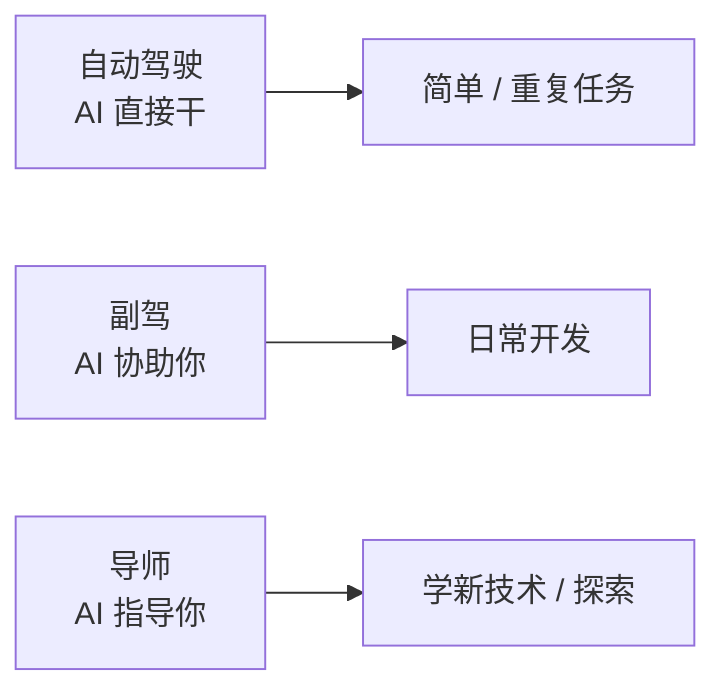

# AI 编码实战手册

> 程序员日常用 AI 的完整场景库：debug / 重构 / 测试 / Code Review / 文档 / 架构 / 性能 / 学新技术 / 项目改造
>
> 8 年工程师视角：不是"让 AI 替你写"，而是"用 AI 加速工程闭环"

---

## 一、心法：怎么和 AI 协作

### 1.1 三种使用模式



| 模式 | 你做什么 | AI 做什么 | 适合 |
| --- | --- | --- | --- |
| **自动驾驶** | 给目标 + 验收 | 多步骤完成 | 重复任务 / 标准化工作流 |
| **副驾** | 主导决策 | 加速实现 | 日常编码 |
| **导师** | 学习 | 解释 / 引导 | 新技术 / 探索 |

**8 年视角**：副驾 + 导师 为主，自动驾驶仅限可验证的任务。

### 1.2 黄金法则

```
✅ 始终验证（编译 / 测试 / 跑一遍）
✅ 给清晰任务边界
✅ 提供必要上下文
✅ 任务大就拆
✅ 出错让 AI 解释为什么（learning）
✅ 关键决策自己拍板

❌ 盲目信任（"AI 说的"不等于对的）
❌ 模糊指令（"帮我优化下"）
❌ 不读 AI 输出直接 commit
❌ 用 AI 替代思考
❌ 偷懒不验证
```

### 1.3 适合 / 不适合 AI

```
✅ 适合:
  - 样板代码（getter/setter / 错误处理 / 参数校验）
  - 测试用例生成
  - 代码翻译（Python → Go）
  - 重构（提取函数 / 重命名）
  - 文档生成
  - 简单 bug 修复
  - 学新框架 / 库
  - Code Review 初筛
  - SQL / 正则
  - 数据格式转换

❌ 不适合:
  - 业务核心逻辑（自己设计）
  - 安全相关（自己审）
  - 性能关键（自己测）
  - 复杂架构决策
  - 隐私 / 合规
  - 全新创新（AI 没见过）
```

---

## 二、调试 (Debug)

### 2.1 让 AI 帮你调试的标准流程

```
1. 给完整错误信息（不要省略）
2. 给相关代码片段（不要全文件）
3. 给复现步骤
4. 让 AI 提假设，不要直接给答案
5. 验证假设
6. 找到根因 + 修复
```

### 2.2 实战 Prompt：调试

```markdown
我遇到一个 bug，请帮我系统化调试，不要直接给答案。

## 错误信息
```
panic: runtime error: index out of range [3] with length 3
goroutine 1 [running]:
main.processItems(...)
        /app/main.go:42
main.main()
        /app/main.go:15
```

## 相关代码
```go
func processItems(items []Item) {
    for i := 0; i <= len(items); i++ {  // 第 42 行
        process(items[i])
    }
}
```

## 复现步骤
- items 长度 3
- 调用 processItems(items)
- panic

## 请按以下结构回复
1. **3 个最可能的原因**
2. **如何验证每个假设**
3. 等我验证后再给修复方案
```

### 2.3 进阶：用 Claude Code Debugging Skill

```
> /debugging
进入系统化调试模式

Claude:
1. 收集症状
2. 提出假设（多个）
3. 设计验证步骤
4. 让用户跑命令
5. 根据结果调整
6. 找到根因
7. 给修复方案 + 测试
```

### 2.4 线上故障排查

**让 AI 帮你写排查脚本**：
```
> "我线上服务 CPU 100%，写一个排查脚本：
   1. top 进程
   2. 用 perf top 看热点函数
   3. 取 pprof CPU profile 30s
   4. 用 go tool pprof 分析"

AI 输出 shell 脚本 → 你执行 → 把结果给 AI 分析
```

### 2.5 反模式

```
❌ 把错误丢给 AI 让它直接修
   → 经常修对了表象，根因不对

❌ 不给上下文
   "这段代码报错"（没贴代码）

❌ 完全信任 AI 的修改
   → 有时引入新 bug

✅ 让 AI 解释为什么这样修
✅ 跑测试验证
✅ 自己看一遍 diff
```

---

## 三、重构 (Refactor)

### 3.1 适合 AI 的重构

```
✅ 提取函数
✅ 重命名（变量 / 函数 / 类型）
✅ 简化嵌套（深 if-else → early return）
✅ 消除重复
✅ 改样板代码（getter/setter）
✅ 升级 API（旧 → 新）
✅ 翻译（Python → Go）
✅ 类型转换（int → int64）

⚠️ 谨慎:
  - 改架构（让 AI 出方案，自己拍板）
  - 改业务逻辑（必须自己审）
  - 改并发代码（容易出错）
```

### 3.2 实战 Prompt：提取函数

```markdown
请把以下代码中的逻辑提取成独立函数，要求：

## 代码
```go
func handle(req Request) Response {
    // 验证
    if req.UserID == "" { return errResp("user id required") }
    if req.Items == nil || len(req.Items) == 0 { return errResp("items required") }
    for _, item := range req.Items {
        if item.Quantity <= 0 { return errResp("invalid quantity") }
        if item.UnitPrice < 0 { return errResp("invalid price") }
    }

    // 计算
    var total int64
    for _, item := range req.Items {
        total += item.Quantity * item.UnitPrice
    }

    // ... 业务逻辑
}
```

## 要求
- 提取验证逻辑为 validateRequest(req)
- 提取计算逻辑为 calculateTotal(items)
- 保持原行为不变
- 函数 < 30 行
- 加单测
```

### 3.3 大型重构：分阶段

```
阶段 1: AI 给方案
  > "这个 service 太长了 800 行，给我 3 个重构方案，对比优劣"

阶段 2: 评审 + 决策
  你看方案，选一个 / 修改

阶段 3: AI 拆步骤
  > "按方案 A 拆解为可执行步骤，每步保持代码可运行"

阶段 4: 一步步执行
  > "执行步骤 1：提取 X 接口"
  > 跑测试 → commit
  > 执行步骤 2：...
```

### 3.4 重命名

```
> "把 OrderService 中的 db 字段改名为 repo，
   并更新所有引用 + 测试"

AI 用 Edit + LSP findReferences 精准修改。
```

### 3.5 升级 API

```
> "项目用了 deprecated 的 io/ioutil，
   全部迁移到 io 和 os"

AI 用 Grep 找所有引用 → 批量替换 → 测试。
```

---

## 四、测试 (Testing)

### 4.1 让 AI 写测试的几种用法

#### 用法 1：根据代码生成测试

```
> "给 user_service.go 的所有公开方法生成单元测试，
   要求:
   - Table-driven
   - 覆盖正常 + 边界 + 异常
   - Mock Repository
   - 用 testify"

AI 输出完整测试文件
你 review + 跑 → 发现 AI 漏的边界 → 补
```

#### 用法 2：根据规范生成测试（TDD）

```
> "实现一个 Calculator 类，需求：
   1. Add(a, b) 返回和
   2. Divide(a, b) 返回商，b=0 时返回 error
   3. Sqrt(a) 返回平方根，a<0 时返回 error

   先写测试，不要写实现"

AI 输出测试 → 你 review → 跑（红） → 让 AI 实现（绿） → 重构
```

#### 用法 3：根据 bug 写测试

```
> "我刚修了个 bug：当 items 为空时 panic。
   写一个测试覆盖这个场景"

AI 写最小复现测试 → 加入测试套件防退化
```

### 4.2 边界 / 异常案例

AI 容易漏的边界，让它显式列：

```
> "列出所有可能的边界 + 异常 case：
  - 空输入
  - nil 输入
  - 极大值 / 极小值
  - 负数
  - Unicode / emoji
  - 并发
  - 时区
  - 数据库连接失败
  - 网络超时
  ...

  然后给每个 case 写测试"
```

### 4.3 Mock 生成

```
> "为 OrderRepository 接口生成 gomock，
   命令:
   mockgen -source=...  -destination=mocks/...

   然后给 OrderService 写测试用 mock"
```

### 4.4 集成测试

```
> "用 testcontainers 给 OrderRepository 写集成测试，
   起真实 MySQL 容器"

AI 给完整代码（containers 启停 / migration / 测试）
```

### 4.5 反模式

```
❌ 接受 AI 写的测试不看
   → 测试写错（断言假阳性）也通过

❌ AI 测试覆盖率高但断言空
   "func TestX(t *testing.T) { Process(input) }"
   → 没 assert 任何东西

✅ Code Review 测试代码
✅ 检查覆盖率 + 断言质量
```

---

## 五、Code Review

### 5.1 让 AI 做初筛

```
> "review 这个 PR 的 diff，按以下维度：
   1. 正确性（边界 / 并发 / 异常）
   2. 性能（N+1 / 锁 / 内存）
   3. 安全（注入 / 权限）
   4. 可读性（命名 / 函数长度）
   5. 测试（覆盖 / 关键路径）

   按 [Must/Should/Could/Nit] 分级
   每条带：文件:行号 + 问题 + 建议"
```

### 5.2 用 Claude Code Subagent

```
> /review

或调 superpowers:code-reviewer subagent

→ 系统化 review + 团队规范对齐（CLAUDE.md）
```

### 5.3 特定关注点

```
> "重点 review 并发安全：
   - 是否有数据竞争
   - 锁粒度
   - goroutine 泄漏
   - channel 关闭"
```

```
> "重点 review SQL：
   - 是否有 SQL 注入
   - 索引使用
   - N+1 问题
   - 事务边界"
```

### 5.4 自动化集成

```
GitHub Action 集成 AI Review:
  - PR 创建 → 触发 AI review
  - 输出评论
  - 人工 review 时已经有 AI 初筛意见
```

工具：
- CodeRabbit
- Cursor 内置
- 自建（用 Claude API + GitHub Action）

### 5.5 反模式

```
❌ 把 AI review 当唯一意见
   → 漏关键问题

✅ AI review = 初筛
✅ 人工 review = 最终把关
```

---

## 六、文档生成

### 6.1 README

```
> "根据这个项目（go.mod + main.go + ...）生成 README，
   包括:
   - 项目简介
   - 功能列表
   - 快速开始
   - 架构图
   - 贡献指南"

AI 读关键文件 → 输出 README
```

### 6.2 API 文档

```
> "根据 handler/*.go 生成 OpenAPI 3.0 spec yaml"
```

或：
```
> "给 OrderService 的所有公开方法加 godoc 注释"
```

### 6.3 架构文档

```
> "根据这个项目结构画架构图（mermaid），
   并写一份 ARCHITECTURE.md，包括：
   - 整体架构
   - 关键流程时序图
   - 数据模型
   - 部署图"
```

### 6.4 ADR（Architecture Decision Record）

```
> "我们选了 MySQL 而非 TiDB，根据：
   - 数据量 1-3 亿
   - 团队熟 MySQL
   - 3 年内够用

   写一份标准 ADR 文档"
```

### 6.5 用户手册

```
> "根据 cmd/cli/main.go 的功能，
   写一份用户手册，含:
   - 命令一览
   - 每个命令的参数 + 例子
   - 常见用法
   - FAQ"
```

### 6.6 Changelog

```
> "根据最近 20 个 commit（git log），
   生成 CHANGELOG.md，按 Keep a Changelog 格式"
```

---

## 七、新技术学习

### 7.1 快速上手

```
> "我是 Go 后端 8 年，从未用过 Rust。
   给我一个 30 分钟速成：
   1. 核心概念（Ownership / Borrow / Lifetime）对比 Go
   2. Hello World + 简单例子
   3. 关键差异点
   4. 推荐学习路径"
```

### 7.2 让 AI 当你的老师

```
> "我想学 K8s Operator 开发，按以下方式教我：
   1. 你先讲核心概念
   2. 我提问你解答
   3. 给一个 toy example
   4. 我跑一遍
   5. 引导我做改造"
```

### 7.3 翻译你已知技术到新语言

```
> "我熟 Go，写一个 Echo HTTP 服务的标准代码。
   现在用 Rust + Axum 等价实现，逐行对比解释"
```

### 7.4 学习新框架

```
> "Kratos 框架的核心设计是什么？
   对比 Spring Boot：
   - DI / IoC
   - Middleware
   - Config
   - Logging"
```

---

## 八、SQL / 正则 / 配置

### 8.1 SQL

```
> "写 SQL 查询：
   - 表 orders(id, user_id, status, total, created_at)
   - 查询过去 7 天每天的订单数和总金额
   - 按状态 'paid' 过滤
   - 按天分组"

AI 给 SQL → 你跑 EXPLAIN 看索引使用。
```

```
> "这个 SQL 慢，给 EXPLAIN 输出，让 AI 优化"
```

### 8.2 正则

```
> "匹配 IPv4 地址（含可选端口）的正则"
> "匹配 Markdown 中的图片引用："
```

AI 给正则 + 解释 + 测试用例。

### 8.3 YAML / JSON 配置

```
> "写一个 K8s Deployment YAML：
   - 镜像 myapp:1.2
   - 3 副本
   - CPU 500m / Memory 512Mi
   - liveness/readiness probe
   - env vars 从 secret"
```

### 8.4 Dockerfile

```
> "为 Go 应用写 Dockerfile：
   - 多阶段构建（builder + runtime）
   - alpine 基础镜像
   - 非 root 用户
   - 健康检查"
```

---

## 九、性能优化

### 9.1 让 AI 分析瓶颈

```
> "这是 pprof CPU profile 输出（粘贴文本）
   找出 Top 3 热点 + 优化建议"
```

### 9.2 代码优化

```
> "这段代码每秒只能处理 1k QPS，目标 10k QPS。
   分析瓶颈 + 优化方案"
```

### 9.3 SQL 优化

```
> "EXPLAIN 输出（粘贴）
   分析执行计划 + 优化建议（加索引 / 改写 / 分表）"
```

### 9.4 缓存设计

```
> "用户信息查询 QPS 5w，TTL 怎么设？
   缓存击穿 / 穿透 / 雪崩 怎么防？"
```

### 9.5 并发优化

```
> "这个 worker 池每秒处理 100 task，怎么提升到 10000？
   - 当前代码（粘贴）
   - 给优化方案 + 实现"
```

---

## 十、架构设计

### 10.1 系统设计题

```
> "设计一个短链系统，用我给的需求：
   - 日均 1 亿次访问
   - 100 万次/天 新短链
   - 99.9% 可用性

   给我:
   1. 整体架构图
   2. 数据模型
   3. API 设计
   4. 关键技术选型
   5. 容量估算
   6. 难点 + 取舍"
```

### 10.2 比较方案

```
> "我们要选数据库:
   - 数据量 5 亿
   - 强一致性需求
   - 复杂查询多

   对比 MySQL 分库分表 vs TiDB vs OceanBase
   按团队能力 / 生态 / 运维 / 成本评估"
```

### 10.3 微服务拆分

```
> "我们的单体 ERP 系统准备拆微服务，
   现有功能：订单 / 库存 / 财务 / 用户 / 报表 ...
   按 DDD 限界上下文给拆分建议"
```

### 10.4 评审你的设计

```
> "我设计了 X 系统（粘贴架构图 + 关键代码）
   找出可能的问题 / 风险 / 改进点"
```

---

## 十一、项目改造

### 11.1 老项目重构

```
> "这是一个 Java 单体项目，
   想迁移到 Go 微服务，给迁移路线图：
   1. 评估现状
   2. 拆分边界（DDD）
   3. 渐进迁移步骤
   4. 风险与回滚
   5. 团队培训计划"
```

### 11.2 框架升级

```
> "项目用 Gin 1.x，想升级到 Gin 2.x。
   列出 breaking changes + 迁移指南"
```

### 11.3 添加新能力

```
> "现有项目没有可观测，给完整接入方案：
   - OpenTelemetry SDK
   - Prometheus 指标
   - Loki 日志
   - 完整代码 + 配置"
```

详见 [13-engineering/04-observability-integration.md](../13-engineering/04-observability-integration.md)。

### 11.4 数据迁移

```
> "MySQL 单库 → 分库分表（按 user_id Hash 8 库）
   设计迁移方案：
   - 双写期
   - 数据校验
   - 切流
   - 回滚预案
   - 时间表"
```

---

## 十二、AI 帮你管理项目

### 12.1 任务拆解

```
> "我要做 X 功能，需求文档（粘贴）
   拆解为可执行任务：
   - 每任务 < 1 天
   - 标依赖关系
   - 风险点"
```

### 12.2 风险评估

```
> "下周要发 X 重大变更，列风险：
   - 技术风险
   - 业务风险
   - 应急预案"
```

### 12.3 PR 描述

```
> "根据这个 git diff（粘贴），
   写 PR 描述：背景 / 方案 / 影响 / 测试 / 风险"
```

### 12.4 复盘文档

```
> "给一份故障复盘模板，
   按 STAR + 5 Whys 结构"
```

---

## 十三、AI Pair Programming

### 13.1 模式

```
你: 我想实现 X
AI: 我建议方案 A / B / C，对比...
你: 选 B，但加 Y 约束
AI: 好，先写框架代码
你: 看了，X 处理改成 Z 方式
AI: 改好了，建议加测试
你: ok，写测试
AI: 测试 1, 2, 3...
你: 1 过了，2 失败，看下
AI: 问题在 W，修复
...
```

### 13.2 像和资深同事结对

```
✅ 双方都质疑
✅ 相互 review
✅ 共同决策
✅ 边写边讨论
```

### 13.3 不要

```
❌ 全盘接受 AI 输出
❌ AI 说什么是什么（要思考）
❌ 不动手，全让 AI 写
```

**关键**：你是 driver，AI 是高级 navigator，**最终决策权在你**。

---

## 十四、典型工作流

### 14.1 一天的 AI 协作

```
9:00 看昨天 PR
  > "review 这些 PR 给我一个总结 + 重点关注"

10:00 开发新功能
  > "需求 X，先给我一个设计方案"
  → 评审 + 选定
  > "拆解步骤"
  → 一步步实现 + 测试

12:00 调试 bug
  > /debugging
  → 系统化排查 → 找到根因 → 修复

14:00 Code Review
  > "review 这个 PR" + 自己看
  → 写 review 评论

16:00 写文档
  > "根据这周的代码，更新 ARCHITECTURE.md"

18:00 计划明天
  > "明天要做 A B C，给我优先级建议"
```

### 14.2 复杂功能开发完整流程

```
1. 需求澄清
   > "我对需求 X 有疑问：[列疑问]，从用户角度分析每个疑问"

2. 设计
   > /brainstorming

3. 评审
   你 + 同事 + AI 三方 review

4. 实现
   > /writing-plans
   → 拆步骤
   → 一步步做

5. 测试
   > "为 X 写测试，覆盖边界"

6. 文档
   > "更新 README + ADR"

7. PR
   > "写 PR 描述"

8. 后续监控
   > Cron: "每天检查 X 功能的指标"
```

### 14.3 紧急故障处理

```
1. 收集症状
   > "线上 5xx 飙升，给排查 checklist"

2. 假设
   > "5xx 可能原因 + 验证方法"

3. 验证
   跑命令 → 把结果给 AI

4. 修复
   > "确认是 X 问题，给修复方案"

5. 验证
   测试 + 灰度

6. 复盘
   > "按 STAR + 5 Whys 写复盘"
```

---

## 十五、效率技巧

### 15.1 快捷键 / 别名

```bash
# .zshrc
alias cc='claude'                              # 启动 Claude Code
alias ai='claude --print'                      # 一次性问

# 快速生成 commit message
gitc() {
  msg=$(git diff --staged | claude --print "根据这个 diff 写中文 commit message")
  git commit -m "$msg"
}
```

### 15.2 Custom Slash Commands

```
.claude/commands/
├── review.md           # /review
├── docs.md             # /docs
└── refactor.md         # /refactor
```

`/review`：
```markdown
请 review 当前 git diff，按团队规范（CLAUDE.md），
分级反馈 [Must/Should/Could/Nit]，
带文件:行号 + 问题 + 建议
```

### 15.3 模板化 Prompt

```
~/.prompts/
├── debug.md
├── review.md
├── refactor.md
└── design.md

cat ~/.prompts/debug.md | claude
```

### 15.4 多 Agent 编排

```
Subagent 1: Explore 找代码
Subagent 2: Review 已有代码
Subagent 3: Design 新方案
主 Agent: 综合决策
```

---

## 十六、避坑

### 坑 1：盲目信任

```
❌ AI: "这个修改是安全的"
   你直接 commit
   → 上线后挂

✅ 自己看 diff + 跑测试 + 灰度
```

### 坑 2：模糊指令

```
❌ "优化这段代码"
   → AI 不知道优化方向

✅ "优化这段代码的性能：
   - 当前 P99 200ms
   - 目标 < 50ms
   - 不要改接口"
```

### 坑 3：上下文不足

```
❌ "改下这个函数"
   → AI 不知道整体架构

✅ "改这个函数，背景：
   - 项目用 DDD
   - 这个是应用层
   - 调用了 Repository 接口
   - ..."
```

### 坑 4：让 AI 决策业务

```
❌ "这个业务规则该是 A 还是 B？"
   → AI 不懂你的业务

✅ "我们业务是 X，规则可能是 A 或 B，
   各自利弊？"
   → 让 AI 列利弊 → 你决策
```

### 坑 5：忽视成本

```
❌ 每个简单任务都用 Opus
   → 月底账单爆炸

✅ 简单用 Haiku / Sonnet
✅ Subagent 默认 Haiku
✅ Prompt Caching
```

### 坑 6：AI 写的代码无人维护

```
❌ AI 生成大量代码 → 没人看懂
   → 改不动 → 重写

✅ 像自己写的代码一样 review
✅ 加注释 + 文档
✅ 写测试
```

### 坑 7：依赖单一 AI

```
❌ 一个模型卡了 / 限流 → 工作停摆

✅ 备用模型（Claude / GPT / Gemini 切换）
✅ 离线 fallback（本地小模型）
```

---

## 十七、面试 / 实战高频问

### Q1: 你日常怎么用 AI？

**答**（结构化）：
- 模式：副驾 + 导师为主
- 场景：debug / 重构 / 测试 / CR / 文档 / 学新东西
- 工具：Claude Code / Cursor / Copilot
- 验证：始终自己跑测试

### Q2: AI 帮你提升了多少效率？

**答**：
- 样板代码 5-10x
- 测试 3-5x
- 文档 5-10x
- Debug 略有提升（但需要验证）
- 创意任务 2-3x
- 整体 1.5-2x（不是 10x，要诚实）

### Q3: AI 会取代程序员吗？

**答**（套路化）：
- 短期不会（业务理解 / 设计 / 调试 / 协作仍需人）
- 长期会改变工作内容（少写样板代码，多设计 / 验证）
- 不会用 AI 的程序员会被会用 AI 的取代

### Q4: 怎么避免 AI 写出烂代码？

**答**：
- 给清晰任务 + 上下文
- 提供团队规范（CLAUDE.md）
- Code Review 必看
- 测试覆盖
- 重构

### Q5: AI 写的代码出 bug 责任谁的？

**答**：**你的**。AI 是工具，最终责任在使用者。

### Q6: 怎么让 AI 跨文件理解项目？

**答**：
- Claude Code 全仓库读取
- CLAUDE.md 项目背景
- Memory 跨会话
- Subagent Explore 大型搜索

### Q7: 调试时 AI 给的方案错怎么办？

**答**：
- 让 AI 解释为什么这么修
- 验证假设（不直接信）
- 给更多上下文
- 自己思考可能原因

### Q8: AI 适合学新技术吗？

**答**：
- 适合（速成 / 对比 / 答疑）
- 但要动手实践（不能只看 AI 讲）
- 经典书 / 官方文档不能完全替代

### Q9: 怎么沉淀 AI 工作流？

**答**：
- CLAUDE.md（项目）
- Skills（团队工作流）
- MCP（工具集成）
- Hooks（自动化）
- Memory（长期记忆）

### Q10: 团队推 AI 协作有阻力怎么办？

**答**：
- 自己先用熟（量化效果）
- 选试点项目（成功案例）
- 写规范（CLAUDE.md / Skills 共享）
- 定期分享（同事看到效果）
- 不强推（每人节奏不同）

---

## 十八、推荐阅读

```
工具:
  □ Claude Code 官方文档
  □ Cursor 官方文档
  □ Aider 文档

方法论:
  □ 《AI 辅助编程实践指南》
  □ Anthropic Engineering Blog
  □ Simon Willison's Weblog

社区:
  □ r/ClaudeAI
  □ r/cursor
  □ Hacker News AI 频道

实战:
  □ 自己折腾（最重要）
```

---

## 十九、面试 / 答辩加分点

- **AI 是工具，不是替代**，最终决策权在人
- **副驾 + 导师** 模式日常用，**自动驾驶** 仅限可验证任务
- 善用 **Claude Code Skills / Subagents / Hooks**
- 知道 **CLAUDE.md / Skills / MCP** 是团队级沉淀
- **始终验证**：编译 / 测试 / 跑一遍
- **任务边界 + 上下文 + 验收标准** 三件套
- 复杂任务 **分阶段**（设计 / 拆解 / 实现 / 测试 / 文档）
- **成本意识**：简单任务用小模型，Subagent 用 Haiku
- **错误处理**：AI 出错让它解释为什么（learning）
- AI 适合 **样板代码 / 测试 / 文档 / 学习**，不适合 **核心业务 / 安全 / 性能**
- 整体效率提升 **1.5-2x**（诚实数字，不夸张）
- **团队推广**：先做样板 → 出规范 → 试点 → 分享 → 不强推
