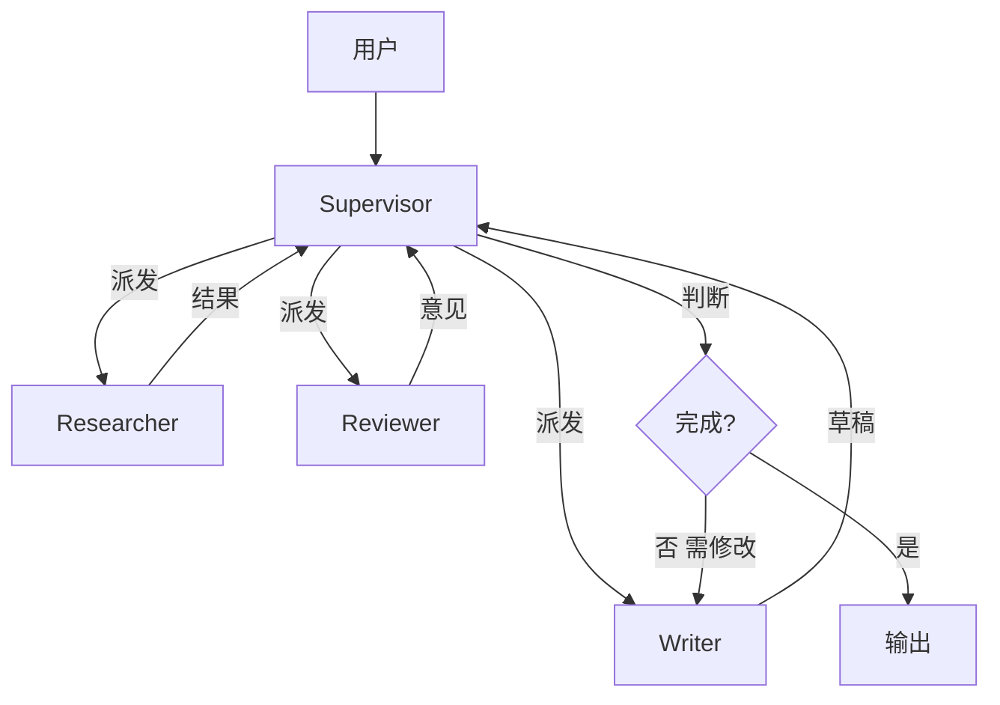

# Multi-Agent 编排(高阶架构)

> 多 agent 系统是 2026 年 agent 领域最热的方向——**多个 LLM agent 协作解决复杂问题**,像一个 AI 团队各司其职。但也是**最容易过度设计**的领域,90% 场景一个 agent 就够,盲上多 agent 反而降低效果 + 烧 token。
>
> 本章讲透 **4 大编排模式(Supervisor / Hierarchical / Swarm / GroupChat)+ 通信协议 + 任务分配 + 冲突解决 + 何时不该用多 agent** —— 8 年后端做 Agent 的高阶知识。
>
> 前置:[05-agent-architectures](05-agent-architectures.md)(单 agent 架构)/ [09-agent-frameworks](09-agent-frameworks.md)(框架选型)

## 〇、核心提炼(5 段式)

### 核心机制(6 条必背)

1. **多 agent 不是"更强",是"更并行/更专业化"**——一个大 agent 处理不了或太贵的场景才上
2. **4 大编排模式**:**Supervisor(主 agent + 派发)/ Hierarchical(团队+子团队)/ Swarm(同级协作)/ GroupChat(群聊)**
3. **通信 = 共享 state + 消息传递**——LangGraph 用 State,AutoGen 用消息,OpenAI Swarm 用 handoff
4. **任务分配三大策略**:**Router / Voting / Auction**
5. **冲突 = 死锁 + 幻觉传播 + 无限循环**——最难解决的三大痛点
6. **90% 场景不该用多 agent**——先问"一个 agent + 好 prompt + tools 能不能搞定"

### 核心本质(必懂)

> 多 agent 的本质是**"专业化分工 + 并行 + 独立视角"**——
>
> 什么时候多 agent 有价值:
> - **任务可以并行**:多个子任务无依赖,单 agent 串行浪费时间
> - **需要专业视角**:不同 agent 用不同 prompt / 模型 / 工具专精不同领域
> - **需要对抗验证**:一个 agent 生成 + 另一个 agent 独立评审(防串通性幻觉)
> - **单 agent 上下文放不下**:任务太长,拆给多个 agent 各管一段
> - **模拟社会/组织**:研究 / 游戏(Stanford 小镇)
>
> **多 agent 的代价**:
> - **成本 3-10x**(每个 agent 都要 LLM 调用)
> - **延迟**(串行 agent 之间等待)
> - **复杂度爆炸**(状态 / 消息 / 错误处理)
> - **一致性难保证**(agent 之间可能观点冲突)
> - **调试困难**(问题出在哪个 agent 不好定位)
>
> **Anthropic Building Effective Agents 核心观点**:
> > "**Add complexity only when needed**——先用 workflow 或单 agent,搞不定再上多 agent。"

### 完整流程(以 Supervisor 模式为例)

```
用户: "调研 K8s 1.32 新特性并写博客"
    ↓
【Supervisor】(用大模型,如 Sonnet)
分析任务 → 拆成 3 步 → 决定谁做
    ↓
【Router 派发】
Step 1: 调研 → Researcher agent
Step 2: 写作 → Writer agent
Step 3: 评审 → Reviewer agent
    ↓
【Researcher agent】(ReAct + 搜索 tool)
    输出研究结果 → 回到 Supervisor
    ↓
【Supervisor】继续派发
    Step 2: Writer agent
    ↓
【Writer agent】(用研究结果写博客)
    输出草稿 → 回到 Supervisor
    ↓
【Supervisor】
    Step 3: Reviewer agent
    ↓
【Reviewer agent】
    评审 → 返回意见
    ↓
【Supervisor】
    根据意见判断:结束 or 让 Writer 修改
    ↓
最终输出
```



### 6 条核心机制 - 逐点讲透(见下面各节)

### 一句话总结

> Multi-agent = **专业化分工 + 并行 + 独立视角**;
> 4 模式(**Supervisor / Hierarchical / Swarm / GroupChat**)+ 3 分配(**Router / Voting / Auction**)+ 3 痛(**死锁 / 幻觉传播 / 无限循环**);
> **90% 场景一个 agent 够,多 agent 是最后手段**——成本 3-10x + 复杂度爆炸,慎用。

---

## 一、什么时候用多 agent(vs 单 agent)

### 1.1 单 agent 已经够用的场景(绝大多数)

```
✓ 客服 / QA / 简单查询
✓ 单一职责的 workflow(翻译 / 分类 / 摘要)
✓ 步骤 < 20 的 ReAct 任务
✓ 上下文放得下的场景
```

### 1.2 多 agent 有价值的场景

**场景 1:并行子任务**

```
任务: "分析 5 个 URL 的内容,给出综述"
单 agent: 串行访问 5 个 URL,慢
多 agent: 5 个 sub-agent 并行,总耗时 max(单个)而非 sum
```

**场景 2:专业化分工**

```
Coding Agent 团队:
  Planner: Sonnet 拆任务(需要战略视野)
  Coder:   Sonnet 写代码
  Tester:  Haiku 跑测试 + 反馈
  Reviewer:Sonnet 代码审查(需要严格视角)

每个 agent 有不同 prompt + 不同 tools
```

**场景 3:对抗验证(防幻觉/防串通)**

```
一个 agent 生成回答
另一个 agent 用独立 prompt 评审
分歧时人工介入 / 投票决定
```

**场景 4:超长任务(单上下文放不下)**

```
写一本书(10 万字):
  Outline agent: 生成大纲
  Chapter agent 1-10: 各写一章
  Editor agent: 统一风格
```

**场景 5:模拟社会/组织**

```
Stanford Generative Agents(小镇):
  25 个 agent 各有 memory + 目标 + 关系
  模拟社交涌现
```

### 1.3 一个 agent 能搞定的时候不要上多 agent

**Anthropic 明确说**:
> 90% 情况下,加一个 tool、改进 prompt、加强 memory 比引入多 agent 便宜且有效得多。

**先自问**:
1. 单 agent 加个 tool 能不能搞定?
2. 拆成多个 workflow step 能不能搞定?
3. 用 CoT / Plan-and-Execute 单 agent 能不能搞定?

**都不行才考虑多 agent**。

> **一句话**:多 agent 是**并行 + 专业化 + 对抗验证 + 超长任务 + 模拟社会**的手段,**90% 场景一个 agent 够**——先加 tool 改 prompt,不行再上多 agent。

---

## 二、模式 1:Supervisor(主 agent + 派发)★ 最主流

### 2.1 结构

```
        用户
         ↓
    ┌─────────┐
    │Supervisor│  ← 大模型,负责决策派发给谁
    └────┬────┘
         │
    ┌────┼────┬─────┐
    ↓    ↓    ↓     ↓
  Sub-A Sub-B Sub-C ...  ← 各专精一件事
    │    │    │
    └────┴────┘
         ↓
    Supervisor 综合结果
```

### 2.2 关键设计

**Supervisor 职责**:
- 拆解任务
- 决定调用哪个 sub-agent(以及顺序)
- 综合 sub-agent 输出
- 判断是否任务完成

**Sub-agent 职责**:
- 专精一个领域(不需要"知道全局")
- 只回答 supervisor 的具体问题
- 输出结构化返回给 supervisor

### 2.3 LangGraph Supervisor 示例

```python
from langgraph.graph import StateGraph, END
from typing import Literal

class State(TypedDict):
    task: str
    messages: list
    next_agent: str
    results: dict

def supervisor(state: State) -> dict:
    prompt = f"""
    任务: {state['task']}
    已完成: {state['results']}
    请选择下一步:
    - researcher: 需要调研
    - writer: 需要写作
    - reviewer: 需要评审
    - END: 任务完成
    输出 JSON: {{"next": "..."}}
    """
    decision = llm.invoke(prompt)
    return {"next_agent": decision["next"]}

def route(state):
    return state["next_agent"]

def researcher(state):
    # 用 tool 检索资料
    result = research_agent(state["task"])
    return {"results": {**state["results"], "research": result}}

def writer(state):
    result = writer_agent(state["task"], state["results"]["research"])
    return {"results": {**state["results"], "draft": result}}

def reviewer(state):
    result = reviewer_agent(state["results"]["draft"])
    return {"results": {**state["results"], "review": result}}

graph = StateGraph(State)
graph.add_node("supervisor", supervisor)
graph.add_node("researcher", researcher)
graph.add_node("writer", writer)
graph.add_node("reviewer", reviewer)

graph.set_entry_point("supervisor")
graph.add_conditional_edges(
    "supervisor", route,
    {"researcher": "researcher", "writer": "writer", "reviewer": "reviewer", END: END}
)
graph.add_edge("researcher", "supervisor")
graph.add_edge("writer", "supervisor")
graph.add_edge("reviewer", "supervisor")

app = graph.compile()
result = app.invoke({"task": "...", "results": {}})
```

### 2.4 优缺点

**优点**:
- ✓ 清晰的控制流(supervisor 决策 → sub-agent 执行)
- ✓ Sub-agent 独立,易替换 / 扩展
- ✓ Supervisor 视角全局,不会走偏
- ✓ **生产最主流**(LangGraph / Anthropic 官方推荐)

**缺点**:
- Supervisor 是瓶颈(每次决策都要过它)
- 完全依赖 supervisor 判断力(选错 sub-agent 就完蛋)

### 2.5 适用

```
✓ 任务可以拆成明确的子任务(研究/写作/评审)
✓ Sub-agent 职责清晰
✓ 需要全局协调

生产项目多 agent 首选此模式
```

> **一句话**:Supervisor 模式 = **主 agent 决策派发 + sub-agent 各司其职**,**生产最主流**;Supervisor 视角全局,sub-agent 独立可替换,LangGraph 原生支持,Anthropic 官方推荐。

---

## 三、模式 2:Hierarchical(团队 + 子团队)

### 3.1 结构

```
             Top Supervisor
                 ↓
       ┌─────────┼─────────┐
       ↓         ↓         ↓
   Team A     Team B    Team C
   Supervisor Supervisor Supervisor
       ↓         ↓         ↓
   ┌───┴───┐  ┌──┴──┐   ┌──┴──┐
   ↓       ↓  ↓     ↓   ↓     ↓
  A1     A2  B1   B2  C1    C2
```

### 3.2 特点

- Supervisor 分层
- 顶层做战略决策,底层做具体执行
- 适合非常复杂的任务(比如运营一个 AI 公司)

### 3.3 实现

**LangGraph 的 subgraph 特性**:每个 Team 是一个独立的图,顶层 supervisor 把它们组合起来。

```python
# 底层 subgraph
research_team = build_research_team_graph()  # 内部有 Supervisor + Researchers

# 顶层
top_graph = StateGraph(...)
top_graph.add_node("research_team", research_team)  # 嵌入 subgraph
top_graph.add_node("writer_team", writer_team)
```

### 3.4 何时用

```
✓ 非常复杂的任务(需要 > 10 个 agent)
✓ 任务有明显的层级结构(公司 / 部门 / 团队)
✗ 简单任务上分层反而拖累
```

> **一句话**:Hierarchical = **Supervisor 分层**,顶层战略 + 底层执行;适合 > 10 个 agent 的超复杂任务,一般项目用 Supervisor 就够。

---

## 四、模式 3:Swarm(同级协作 / Handoff)

### 4.1 结构

```
Agent A ─────handoff─────> Agent B ─────handoff────> Agent C
   ↑                                                    │
   └────────────────handoff─────────────────────────────┘
        (没有中心 supervisor,agent 之间直接传递控制权)
```

### 4.2 核心机制:Handoff

**OpenAI Swarm(2024 底开源)** 主推此模式:

```python
from swarm import Agent

triage_agent = Agent(
    name="Triage",
    instructions="判断用户问题,转给对应专家",
    functions=[transfer_to_math, transfer_to_code]
)

math_agent = Agent(name="Math", instructions="数学专家")
code_agent = Agent(name="Code", instructions="代码专家")

def transfer_to_math(): return math_agent
def transfer_to_code(): return code_agent
```

用户输入 → Triage agent 判断 → 返回一个 agent 对象 → 系统切换到该 agent → 继续对话。

### 4.3 特点

**优点**:
- 无中心瓶颈
- Agent 之间平等
- 简单场景更轻量

**缺点**:
- 缺乏全局协调(容易失控)
- 循环 handoff 风险(A→B→C→A→...)
- 生产系统不太用(可控性差)

### 4.4 OpenAI Swarm 定位

Swarm 项目本身是**教育/参考实现**,OpenAI 自己不主推生产用。**Anthropic 之后推出的 subagents 也是类似概念**。

> **一句话**:Swarm = **agent 之间直接 handoff**,无中心 supervisor;简单场景轻量,但缺乏全局协调,生产用可控性差,更多是教育/研究场景。

---

## 五、模式 4:GroupChat(群聊)

### 5.1 结构

```
┌─────────────────────────┐
│      GroupChat 会话      │
│                         │
│  Agent A  Agent B       │
│    ↕        ↕           │
│  Agent C  Agent D       │
│    (共享消息历史)         │
└─────────────────────────┘
       ↑
    Manager 决定谁下一个说话
```

### 5.2 AutoGen 主推

```python
from autogen import AssistantAgent, GroupChat, GroupChatManager

planner = AssistantAgent("Planner", ...)
coder = AssistantAgent("Coder", ...)
tester = AssistantAgent("Tester", ...)
critic = AssistantAgent("Critic", ...)

groupchat = GroupChat(
    agents=[planner, coder, tester, critic],
    messages=[],
    max_round=20
)
manager = GroupChatManager(groupchat=groupchat, llm_config={...})
manager.initiate_chat(message="写一个网页爬虫")
```

### 5.3 speak selection(谁下一个说话)

- **round_robin**:轮流
- **random**:随机
- **manager**:LLM 决定
- **auto**:AutoGen 内置策略

### 5.4 特点

**优点**:
- ✓ 涌现式协作(可能出现意外的好方案)
- ✓ 适合"AI 团队讨论"式任务

**缺点**:
- 容易跑题 / 循环讨论
- 消息历史膨胀(每个 agent 都看全部)
- 成本高(每个 agent 每轮都可能被调用)

### 5.5 何时用

```
✓ "AI 团队"类任务(planner+coder+tester)
✓ 需要多视角讨论达成一致
✗ 简单任务(浪费)
✗ 需要严格控制流(用 Supervisor)
```

> **一句话**:GroupChat = **多 agent 群聊,manager 决定谁说**;AutoGen 主推,适合"AI 团队讨论"式任务,但容易跑题 + 成本高,生产项目慎用。

---

## 六、任务分配策略

### 6.1 策略 1:Router(路由)

**Supervisor 或 Router 直接决定谁做**:

```python
def route_to_agent(query):
    # LLM 判断 or 关键词规则
    if is_math(query): return math_agent
    if is_code(query): return code_agent
    return general_agent
```

**优点**:确定性,可控
**缺点**:路由错了直接完蛋

### 6.2 策略 2:Voting(投票)

**多个 agent 各自尝试 → 投票选最好**:

```python
results = []
for agent in [agent_a, agent_b, agent_c]:
    r = agent.solve(query)
    results.append(r)

# 投票
best = vote(results)  # LLM-as-judge 或多数决
```

**用途**:提升准确率(多个 agent 独立答,一致的更可信)
**代价**:N 倍成本

### 6.3 策略 3:Auction(拍卖)

**Agents 自报"我能做,自信度 X" → 选最自信的**:

```python
bids = []
for agent in agents:
    confidence = agent.self_evaluate(task)
    bids.append((agent, confidence))

winner = max(bids, key=lambda x: x[1])[0]
result = winner.solve(task)
```

**优点**:动态,agent 数量多时可扩展
**缺点**:agent 可能虚报自信

### 6.4 何时用哪个

```
简单场景: Router(规则/关键词)
需要高准确: Voting(N 倍成本换准确)
Agent 池大: Auction(自选,可扩展)
```

---

## 七、通信协议

### 7.1 三种通信方式

**方式 1:共享 state(LangGraph 主推)**

```python
class State(TypedDict):
    messages: list
    findings: dict
    todo: list

# 所有 agent 读写同一个 state
```

**优点**:清晰、易 debug
**缺点**:State 膨胀 / 需要仔细设计

**方式 2:消息传递(AutoGen 主推)**

```python
# agent 之间直接发消息,历史保留
agent_a.send("请分析这个", agent_b)
agent_b.reply("我的分析结果...", agent_a)
```

**优点**:符合直觉(像人对话)
**缺点**:消息历史膨胀

**方式 3:黑板(Blackboard)**

```
共享的中央数据结构,每个 agent 读写
类似于 shared memory + event bus
```

生产用得少,更多是研究模式。

### 7.2 消息 vs State 的选择

```
LangGraph 一律 state → 强类型,好 debug,推荐
AutoGen 消息为主 → 对话式,demo 直观
自研: 看场景选择
```

---

## 八、冲突解决(多 agent 头号痛点)

### 8.1 三大冲突

**冲突 1:死锁**

```
Agent A: "我要 B 的输出才能做"
Agent B: "我要 A 的输出才能做"
→ 互相等待
```

**解决**:
- 明确依赖顺序(Supervisor 拆任务时定)
- 设 max_iterations(硬中断)
- Fallback agent(无进展时接管)

**冲突 2:观点分歧**

```
Coder: "用方案 A"
Reviewer: "不,用方案 B"
Coder: "但 A 更快"
Reviewer: "B 更安全"
→ 循环争论
```

**解决**:
- 引入 Judge / Supervisor 仲裁
- 定义决策优先级(安全 > 性能 > 简洁)
- 设 max_round(超过就用 supervisor 决定)

**冲突 3:幻觉传播**

```
Agent A: "K8s 1.32 有 X 特性"(编的)
Agent B: 基于 A 的输出继续 → 幻觉放大
```

**解决**:
- Agent 之间引用来源(RAG + citations)
- 独立 Verifier agent 用不同 prompt 验证
- 关键事实必须 tool 验证(不能靠 agent 之间传话)

### 8.2 无限循环兜底

```python
MAX_TOTAL_STEPS = 30

step = 0
while step < MAX_TOTAL_STEPS:
    # 多 agent 循环
    if check_progress_stalled():
        break
    step += 1

if step == MAX_TOTAL_STEPS:
    return "达到最大步数,返回当前最佳结果"
```

### 8.3 检测卡住

```
判断"卡住":
  - N 轮内 state 没变化
  - 同一 agent 连续被调 M 次
  - 相同消息重复出现
  
应对:
  - Fallback 到人工
  - 简化任务重试
  - 返回部分结果
```

> **一句话**:多 agent 三大冲突 = **死锁 / 观点分歧 / 幻觉传播**;必须**明确依赖顺序 + 引入仲裁 + 设 max_iterations + 卡住检测**;这是生产多 agent 最难的部分。

---

## 九、生产实践的关键点

### 9.1 分层混合(生产首选)

**Anthropic Building Effective Agents 推荐**:

```
Layer 1: Router(Haiku)
  简单请求 → 直接答
  复杂请求 → 进入 agent 流程

Layer 2: Supervisor(Sonnet)Plan-and-Execute
  拆任务 + 分配给 sub-agent

Layer 3: Sub-agents(Sonnet / Haiku 混用)
  各专精一件事,内部 ReAct 循环

Layer 4: Verifier(Sonnet)Self-Refine / CoVe
  关键输出自审

Layer 5: Reflexion(离线)
  失败案例学习

监控:LangSmith / LangFuse 全链路
```

### 9.2 模型混用(省钱)

```
Supervisor: Sonnet(需要战略视野)
主执行 agent: Sonnet
辅助 agent(打标 / 分类 / 简单查询): Haiku
最终评审: Sonnet

不要全部用 Opus——单 agent 都能烧钱,多 agent 烧起来更狠
```

### 9.3 观测必做

```
每个 agent 记:
  - agent_id / step / input / output / tokens / duration
  - 传给哪个 agent / 从哪个 agent 来
  
全链路 trace:
  用户请求 → Supervisor → Sub-A → Sub-B → 结果
  能一眼看到哪一步慢 / 出错 / 走偏
```

**工具**:LangSmith / LangFuse / Helicone / OpenTelemetry

### 9.4 断点续跑

**长任务多 agent 中间失败**:
- LangGraph checkpoint 保存 state
- 从上次断点恢复
- 不重新烧钱

### 9.5 人在环(HITL)

**关键决策让人参与**:
- 计划批准(Supervisor 出计划 → 人审 → 再执行)
- 危险操作确认(删数据 / 发消息)
- 分歧仲裁(agent 观点不一致 → 人决定)

LangGraph 的 **interrupt** 原生支持:

```python
# 在关键 node 前设置 interrupt
graph.add_node("plan_review", plan_review_node)
# 图执行到这里会暂停,等外部 API 恢复
app = graph.compile(checkpointer=..., interrupt_before=["plan_review"])
```

---

## 十、经典多 agent 项目

### 10.1 AutoGen 官方示例

- **Coder + Tester + Reviewer 协作写代码**
- 用 GroupChat + code execution

### 10.2 CrewAI 官方示例

- **Research + Analysis + Writing 团队**
- 用角色化 crew

### 10.3 MetaGPT

- **模拟软件公司**:PM / Architect / Engineer / QA
- 输入需求 → 输出完整代码 + 文档

### 10.4 ChatDev

- **仿真软件公司**(和 MetaGPT 类似)
- Design + Coding + Testing + Documenting

### 10.5 Anthropic 官方多 agent 示例

- **research agent** + **critic agent**
- 生成 + 独立评审的经典组合

### 10.6 Devin(Cognition)

- 内部架构未完全公开,但明显多 agent
- Plan + Code + Debug + Test 分工

---

## 十一、常见坑

```
坑 1:简单任务硬上多 agent
  → 90% 场景一个 agent 够,多 agent 烧钱 + 复杂

坑 2:没有 supervisor / manager
  → Swarm 式 handoff 容易失控循环

坑 3:Sub-agent 都用 Opus
  → 成本爆炸,简单执行用 Haiku

坑 4:消息历史膨胀
  → GroupChat 每个 agent 都看全历史,20 轮后爆
  → Supervisor 拆解 + 每个 sub-agent 只看必要

坑 5:没有 max_iterations
  → 死锁 / 循环 / 幻觉传播都会烧无限 token
  → 每层都要设上限

坑 6:观点冲突无仲裁
  → 两个 agent 无限争论
  → Judge / Supervisor 必须能中断

坑 7:幻觉在 agent 间传播
  → A 编造 → B 基于 A 继续 → 幻觉放大
  → 关键事实必须 tool / RAG 验证,不靠 agent 之间传

坑 8:没有 trace,出问题瞎猜
  → LangSmith / LangFuse 一定接

坑 9:没有断点续跑,失败重新烧
  → LangGraph checkpoint 保存 state

坑 10:所有决策都 LLM,没有规则/人在环
  → 关键决策用规则或人审批
```

## 十二、面试题速答

### Q1:什么时候用多 agent?

```text
90% 场景不该用多 agent。先自问:
  1. 单 agent 加 tool 能不能搞定?
  2. 拆成 workflow step 能不能搞定?
  3. Plan-and-Execute 单 agent 能不能搞定?

都不行才考虑多 agent。适合场景:
  - 并行子任务(5 个 URL 分析)
  - 专业化分工(Coder + Tester + Reviewer)
  - 对抗验证(生成 + 独立评审)
  - 超长任务(单上下文放不下)
  - 模拟社会(研究/游戏)

代价: 成本 3-10x + 复杂度爆炸 + 一致性难保证
```

### Q2:多 agent 4 大模式?

```text
Supervisor(主流): 主 agent + 派发,全局协调
  → 生产项目首选(LangGraph 原生)

Hierarchical: Supervisor 分层
  → > 10 agent 超复杂任务

Swarm: 同级 handoff,无中心
  → 简单场景,可控性差,生产慎用

GroupChat: 多 agent 群聊,manager 定谁说
  → "AI 团队讨论"任务(AutoGen 主推)
```

### Q3:多 agent 通信怎么设计?

```text
三种方式:
  共享 State(LangGraph): 强类型,好 debug,推荐
  消息传递(AutoGen): 对话式,消息历史易膨胀
  黑板: 中央数据结构,研究用得多

关键:
  - State 需要精心设计(不能太大)
  - 消息历史膨胀要压缩
  - Sub-agent 只看必要信息,不看全部
```

### Q4:多 agent 冲突怎么解?

```text
三大冲突:
  死锁: 明确依赖顺序 + max_iterations + fallback
  观点分歧: 引入 Judge/Supervisor 仲裁,定义决策优先级
  幻觉传播: agent 引用来源,独立 Verifier 验证,关键事实 tool/RAG

必备兜底:
  max_iterations
  卡住检测(N 轮无进展就中断)
  Fallback 到人工

无限循环是多 agent 最容易踩的坑
```

### Q5:多 agent 生产实践的关键?

```text
1. 分层混合架构(Anthropic 推荐):
   Router → Supervisor → Sub-agents → Verifier

2. 模型混用省钱:
   Supervisor 用 Sonnet,辅助 agent 用 Haiku
   不要全部 Opus

3. 观测必做:
   LangSmith / LangFuse 全链路 trace
   出问题一眼看到哪一步

4. 断点续跑:
   LangGraph checkpoint,失败不用重新烧

5. 人在环(HITL):
   关键决策/危险操作/观点分歧 人审批
   LangGraph interrupt 原生支持
```

## 十三、关联阅读

```
本目录:
- 05-agent-architectures            单 agent 架构(Supervisor 里的 sub-agent 就是单 agent)
- 06-memory-and-context             Memory(多 agent 共享 state 的一部分)
- 08-mcp-protocol                   MCP(agent 都通过 MCP 用工具)
- 09-agent-frameworks               框架选型(LangGraph/AutoGen 就是为多 agent 设计)
- 11-evaluation-and-testing         评测(多 agent 评测更难,必须做)
- 12-production-engineering         生产化(观测 / 成本 / 安全)

外部:
- LangGraph Multi-Agent: langchain-ai.github.io/langgraph/tutorials/multi_agent
- AutoGen: microsoft.github.io/autogen
- CrewAI: crewai.com
- MetaGPT: github.com/geekan/MetaGPT
- OpenAI Swarm: github.com/openai/swarm
- Anthropic Building Effective Agents
- Generative Agents (Stanford 小镇): arxiv.org/abs/2304.03442
```

> **一句话核心(全篇精炼)**:
> Multi-agent = **专业化分工 + 并行 + 独立视角 + 超长任务**;
> **90% 场景不该用**——单 agent 加 tool 改 prompt 更便宜有效;
> 4 模式(**Supervisor / Hierarchical / Swarm / GroupChat**),生产首选 **Supervisor**(LangGraph 原生);
> **通信用 State,冲突靠 max_iterations + 仲裁 + 卡住检测,幻觉靠独立 Verifier**;
> 生产实践 = **分层混合 + 模型混用 + 观测 + 断点续跑 + 人在环** —— 单 agent 都能烧钱,多 agent 烧起来更狠,慎用。
