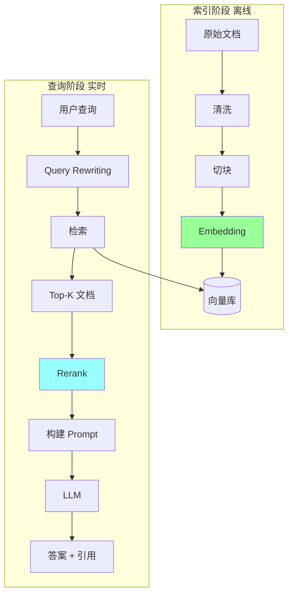
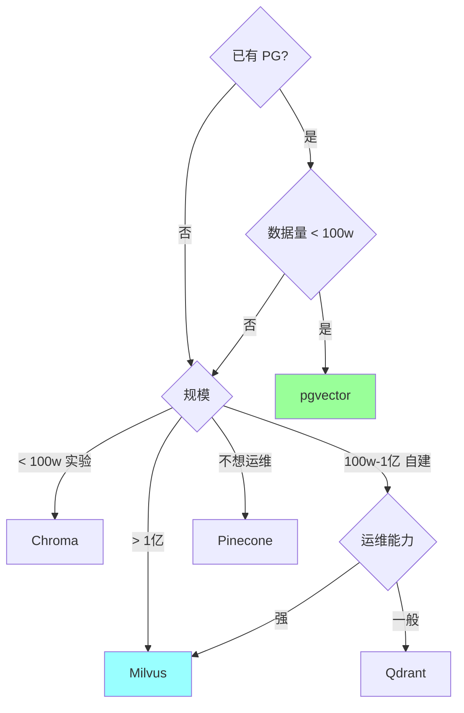
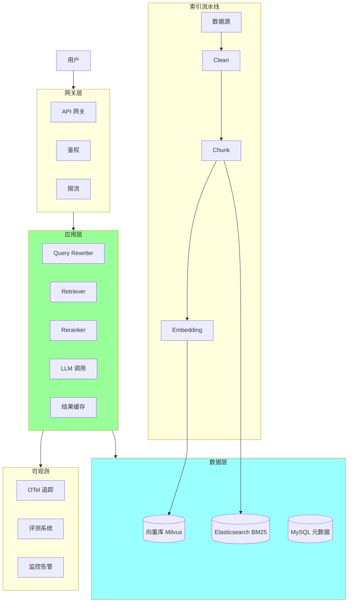

# RAG 工程化 + AI 应用栈

> RAG 完整工程化（chunking / embedding / 检索 / Rerank / 评测）+ 主流 AI 应用框架（LangChain / LlamaIndex / Dify / Coze / Go 生态）
>
> 后端工程师做 AI 应用的完整技术栈

---

# 一、RAG 工程化

## 1.1 为什么需要 RAG

```
LLM 的根本限制:
  - 知识截止日期（训练后的不知道）
  - 上下文窗口有限（200K 也塞不下大文档库）
  - 私有数据没见过
  - 容易幻觉

RAG 解决:
  - 实时数据（私有 / 最新）
  - 仅检索相关片段（节省 token）
  - 基于事实生成（减少幻觉）
  - 可追溯（citation）
```

## 1.2 RAG 完整架构



## 1.3 关键技术分解

```
1. 文档预处理（清洗 / 切块）
2. Embedding 模型选型
3. 向量库选型
4. 检索策略（向量 / 关键词 / 混合）
5. Rerank
6. Prompt 构建
7. LLM 生成
8. 引用 / 来源追溯
9. 评测体系
```

---

## 二、文档切块（Chunking）

切块策略**直接影响 RAG 质量**。

### 2.1 切块的目标

```
- 块够大：保留足够上下文
- 块够小：检索精准 + token 经济
- 不破坏语义：不要切到一句话中间
```

### 2.2 常见策略

| 策略 | 说明 | 适合 |
| --- | --- | --- |
| **固定长度** | 按 token / 字符切 | 简单文本 |
| **按句子** | 句号分隔 | 散文 / 文章 |
| **按段落** | 空行分隔 | 结构化文档 |
| **按章节** | Markdown # / ## | 技术文档 |
| **递归切分** | 多级 fallback | 通用最佳 |
| **语义切分** | LLM 判断断点 | 高质量但贵 |

### 2.3 推荐：递归切分

```python
# LangChain 风格
RecursiveCharacterTextSplitter(
    separators=["\n\n", "\n", "。", "！", "？", " ", ""],
    chunk_size=512,
    chunk_overlap=50
)

# 优先按 \n\n 切，不行按 \n，再不行按句号...
```

### 2.4 切块大小

```
通用:
  小: 128-256 token   精准但缺上下文
  中: 512-1024 token  ★ 推荐起点
  大: 2048+ token     上下文足但检索差

特定场景:
  代码: 整函数 / 整文件（用 AST 切）
  表格: 整表 + 标题
  对话: 一轮一块
```

### 2.5 Overlap（重叠）

```
chunk_size=512, overlap=50

块 1: token 0-512
块 2: token 462-974    ← 50 token 重叠
块 3: token 924-1436

避免边界信息丢失。
```

### 2.6 父子文档（高级）

```
切两套:
  父块: 大块（2000 token，含完整上下文）
  子块: 小块（256 token，精准检索）

检索: 用子块匹配
返回: 给 LLM 的是父块（保上下文）
```

适合：长文档 / 技术手册。

### 2.7 元数据

每个 chunk 必带元数据：

```python
{
    "chunk_id": "doc1_chunk5",
    "doc_id": "doc1",
    "doc_title": "Go 教程",
    "chapter": "Channel",
    "page": 42,
    "url": "https://...",
    "timestamp": "2026-05-08",
    "tags": ["go", "concurrency"]
}
```

用途：
- 引用（生成 citation）
- 过滤（按 tag / 时间 / 来源）
- 排序（按权重）

---

## 三、Embedding 模型

### 3.1 主流模型对比

| 模型 | 提供方 | 维度 | 中文 | 价格 | 备注 |
| --- | --- | --- | --- | --- | --- |
| **text-embedding-3-large** | OpenAI | 3072 | 强 | $0.13/M | 最强通用 |
| **text-embedding-3-small** | OpenAI | 1536 | 强 | $0.02/M | ★ 性价比 |
| **voyage-3** | Voyage AI | 1024 | 强 | $0.06/M | 高性能 |
| **Cohere embed v3** | Cohere | 1024 | 强 | $0.10/M | 多语言 |
| **bge-large-zh-v1.5** | BAAI（开源）| 1024 | **极强** | 自部署 | 中文最强开源 |
| **bge-m3** | BAAI（开源）| 1024 | 强 | 自部署 | 多语言 + 多功能 |
| **m3e-large** | 国产开源 | 1024 | 强 | 自部署 | 中文友好 |
| **Nomic Embed** | Nomic | 768 | 中 | 自部署 | 全开源 |
| **GTE-Qwen2** | 阿里 | 3584 | 极强 | 自部署 | 大尺寸 |

### 3.2 选型建议

```
快速起步: text-embedding-3-small
中文优先: bge-large-zh-v1.5（自部署）
预算紧: bge-m3 / m3e-large
极致质量: text-embedding-3-large 或 voyage-3
本地化 + 隐私: 自部署 bge / nomic
```

### 3.3 维度对查询性能

```
维度越大:
  - 表达能力强
  - 但向量库存储 + 检索成本高

实战:
  768-1024 维 = 平衡点
  > 2000 维 仅极致质量场景
```

### 3.4 Embedding API 示例

**OpenAI**：
```python
from openai import OpenAI
client = OpenAI()

resp = client.embeddings.create(
    model="text-embedding-3-small",
    input="要 embed 的文本",
    dimensions=512  # 可降维（小成本损失）
)
embedding = resp.data[0].embedding
```

**自部署 BGE**：
```python
from sentence_transformers import SentenceTransformer
model = SentenceTransformer('BAAI/bge-large-zh-v1.5')
emb = model.encode("文本", normalize_embeddings=True)
```

### 3.5 Embedding Cache

embedding 计算贵 + 内容不变 → **必须缓存**：

```python
def get_embedding(text):
    key = hashlib.md5(text.encode()).hexdigest()
    if cached := redis.get(f"emb:{key}"):
        return json.loads(cached)
    emb = model.encode(text)
    redis.set(f"emb:{key}", json.dumps(emb), ex=86400*30)  # 30 天
    return emb
```

---

## 四、向量库

### 4.1 主流向量库对比

| | Milvus | Qdrant | Pinecone | Weaviate | pgvector | Chroma |
| --- | --- | --- | --- | --- | --- | --- |
| **开源** | ✅ | ✅ | ❌ | ✅ | ✅ | ✅ |
| **性能** | 高 | 高 | 高 | 中 | 中 | 中 |
| **元数据过滤** | ✅ | ✅ | ✅ | ✅ | ✅（SQL） | ✅ |
| **混合检索** | 部分 | ✅ | 部分 | ✅ | ✅ | 部分 |
| **运维** | 复杂 | 简单 | 托管 | 中 | 简单 | 极简 |
| **代表用户** | 字节 | 跨境电商 | OpenAI Cookbook | 老牌 | 已用 PG | 实验/Demo |

### 4.2 选型决策



### 4.3 索引算法

| 算法 | 准确率 | 速度 | 内存 | 备注 |
| --- | --- | --- | --- | --- |
| **HNSW** | 高 | 快 | 大 | ★ 主流 |
| **IVF** | 中 | 快 | 小 | 大数据量 |
| **IVF-PQ** | 中 | 极快 | 极小 | 极致压缩 |
| **Flat** | 100% | 慢 | 大 | 小数据基准 |

**HNSW 主流**：分层导航小世界，平衡准确率和速度。

### 4.4 操作示例（pgvector）

```sql
-- 安装
CREATE EXTENSION vector;

-- 表
CREATE TABLE documents (
    id BIGSERIAL PRIMARY KEY,
    content TEXT,
    embedding VECTOR(1024),
    metadata JSONB
);

-- 索引（HNSW）
CREATE INDEX ON documents USING hnsw (embedding vector_cosine_ops);

-- 查询（余弦相似度）
SELECT id, content, 1 - (embedding <=> $1) AS similarity
FROM documents
WHERE metadata->>'tag' = 'go'   -- 元数据过滤
ORDER BY embedding <=> $1
LIMIT 10;
```

### 4.5 Milvus 操作

```python
from pymilvus import MilvusClient

client = MilvusClient("milvus.db")

# 创建集合
client.create_collection(
    collection_name="docs",
    dimension=1024,
    metric_type="COSINE",
)

# 插入
client.insert("docs", [
    {"id": 1, "vector": [...], "text": "...", "tag": "go"},
    ...
])

# 查询
results = client.search(
    collection_name="docs",
    data=[query_vector],
    limit=10,
    filter="tag == 'go'",
)
```

---

## 五、检索策略

### 5.1 三种检索

```
向量检索（Dense）:
  优: 语义相似（同义词 / 近义词）
  缺: 关键词召回差

关键词检索（Sparse / BM25）:
  优: 精确匹配（专有名词 / 代码）
  缺: 没语义

混合检索（推荐）:
  向量 + 关键词 → 取并集 → Rerank
  优: 兼顾语义 + 精确
```

### 5.2 BM25 检索

```python
# Elasticsearch / OpenSearch
from elasticsearch import Elasticsearch
es = Elasticsearch(...)

results = es.search(index="docs", body={
    "query": {"match": {"content": query}},
    "size": 10
})
```

### 5.3 混合检索（RRF Reciprocal Rank Fusion）

```python
# 各取 Top 20
vector_results = vector_search(query, k=20)
keyword_results = bm25_search(query, k=20)

# RRF 融合
def rrf(results_list, k=60):
    scores = {}
    for results in results_list:
        for rank, doc_id in enumerate(results):
            scores[doc_id] = scores.get(doc_id, 0) + 1.0 / (k + rank + 1)
    return sorted(scores.items(), key=lambda x: -x[1])

merged = rrf([vector_results, keyword_results])[:10]
```

### 5.4 Query Rewriting

直接用用户 query 检索效果差 → **改写**：

```python
# 用 LLM 改写
def rewrite_query(original):
    return llm.generate(f"""
    把用户查询改写为更适合检索的形式：
    - 提取关键词
    - 扩展同义词
    - 拆解为多个子查询

    原查询: {original}

    输出 JSON: {{"queries": [...]}}
    """)

queries = rewrite_query("怎么解决 Go 内存泄漏")
# → ["Go 内存泄漏排查", "Go pprof heap 分析", "goroutine 泄漏"]
```

### 5.5 HyDE（Hypothetical Document Embedding）

```
1. 让 LLM 假设一个答案文档（hypothetical）
2. embed 这个假设文档
3. 用它去检索

效果: 比直接 embed query 更好（query 和 doc 表达不同）
```

```python
def hyde_retrieve(query):
    hypo_doc = llm.generate(f"对'{query}'，写一个理想的答案文档（不需准确）")
    hypo_emb = embed(hypo_doc)
    return vector_search(hypo_emb, k=10)
```

---

## 六、Rerank

### 6.1 为什么需要 Rerank

```
向量检索 Top-10 ≠ 真正最相关 Top-10

向量相似度只是粗排，需要更精确的二次排序：
- 用更强模型（Cross-Encoder）
- 重新打分
- 取真正 Top-K
```

### 6.2 主流 Rerank 模型

| | Cohere Rerank | bge-reranker | jina-reranker |
| --- | --- | --- | --- |
| 提供方 | Cohere | BAAI | Jina AI |
| 商用 | API | 自部署 | API/自部署 |
| 中文 | 强 | **极强** | 强 |
| 价格 | $1/1000 | 免费 | 部分免费 |

### 6.3 Rerank 流程

```python
# 1. 向量检索 Top 50（粗排）
candidates = vector_search(query, k=50)

# 2. Cross-Encoder Rerank
from sentence_transformers import CrossEncoder
reranker = CrossEncoder('BAAI/bge-reranker-large')

pairs = [(query, doc.content) for doc in candidates]
scores = reranker.predict(pairs)

# 3. 排序取 Top 10
ranked = sorted(zip(candidates, scores), key=lambda x: -x[1])[:10]
```

### 6.4 效果

```
向量检索 Top 10 准确率 70%
+ Rerank Top 10 准确率 90%

代价: +50-100ms 延迟 + Rerank 成本
```

---

## 七、Prompt 构建

### 7.1 标准 RAG Prompt

```python
def build_rag_prompt(query, docs):
    context = "\n\n".join([
        f"[Doc {i+1}] (来源: {d.metadata['url']})\n{d.content}"
        for i, d in enumerate(docs)
    ])

    return f"""基于以下文档回答用户问题。

要求:
1. 仅基于文档回答，不要编造
2. 如果文档中没有相关信息，说"我不知道"
3. 引用来源（用 [Doc N] 标记）
4. 回答简洁专业

文档:
{context}

用户问题: {query}

回答:"""
```

### 7.2 引用格式

```
回答中加 [Doc 1] [Doc 2] 标记
最后列出来源:

来源:
[Doc 1] https://docs.example.com/go-channel
[Doc 2] https://my-blog.com/article-1
```

### 7.3 防幻觉指令

```
"如果文档中没有明确信息回答这个问题，请说：
'根据现有文档，我无法准确回答这个问题。'
不要基于训练知识推测。"
```

---

## 八、RAG 评测

### 8.1 评测维度

```
检索质量:
  - Recall@K（前 K 召回率）
  - Precision@K（前 K 精确率）
  - MRR（平均倒数排名）
  - NDCG（归一化折损累积增益）

生成质量:
  - 准确性（人工 / LLM-as-judge）
  - 引用正确率
  - 幻觉率
  - 简洁性
  - 相关性

端到端:
  - 用户满意度
  - 任务完成率
```

### 8.2 工具

| | 用途 |
| --- | --- |
| **Ragas** | RAG 专用评测框架 |
| **TruLens** | 可观测 + 评测 |
| **LangSmith** | 全链路追踪 + 评测 |
| **Promptfoo** | Prompt A/B |

### 8.3 Ragas 示例

```python
from ragas import evaluate
from ragas.metrics import (
    answer_relevancy,
    faithfulness,
    context_precision,
    context_recall,
)

results = evaluate(
    dataset,  # 测试集
    metrics=[
        answer_relevancy,    # 回答相关性
        faithfulness,        # 是否基于上下文（防幻觉）
        context_precision,   # 检索精确率
        context_recall,      # 检索召回率
    ],
)
```

### 8.4 测试集构造

```
- 业务真实问题（脱敏）
- 边界 case（hard cases）
- 对抗 case（攻击）
- 标注答案 + 来源

数据集大小: 100-500 条起步
```

---

## 九、RAG 优化技巧

### 9.1 提升召回

- 混合检索（向量 + BM25）
- Query Rewriting / 扩展
- HyDE
- 多 query 融合

### 9.2 提升精排

- Rerank（Cross-Encoder）
- 元数据过滤
- 业务规则加权

### 9.3 提升回答

- 更强 LLM
- 改进 Prompt
- Few-shot 示例
- CoT 推理

### 9.4 控制幻觉

- 严格 Prompt 指令
- Citation 强制
- 验证层（生成后校验）
- temperature 调低

### 9.5 性能优化

- Embedding 缓存
- 向量库索引（HNSW）
- 并发检索（向量 + BM25 同时跑）
- 流式输出

### 9.6 成本优化

- 小模型 + RAG > 大模型无 RAG
- Embedding 缓存
- 历史回答缓存
- Prompt Caching

---

# 十、AI 应用栈

## 10.1 主流框架对比

| | LangChain | LlamaIndex | LangGraph | Haystack | 直接 SDK |
| --- | --- | --- | --- | --- | --- |
| **定位** | 通用 LLM 应用 | RAG / 数据导向 | LangChain 上的状态机 | RAG / 搜索 | 完全自由 |
| **抽象** | 重 | 中 | 中 | 中 | 无 |
| **学习成本** | 高 | 中 | 高 | 中 | 低 |
| **灵活度** | 中 | 中 | 高 | 中 | 高 |
| **生态** | 最大 | RAG 强 | 增长中 | 老牌 | - |
| **适合** | 全套场景 | RAG 优先 | 复杂 Agent | 搜索 | 简单需求 |

### 10.2 LangChain

**优点**：
- 生态最完整（Tools / Agents / Memory / Chains）
- 大量内置组件
- 社区活跃

**缺点**：
- 抽象太重（业内吐槽）
- 调试黑盒
- 简单需求过度

**实战**：
```python
from langchain.chains import RetrievalQA
from langchain.llms import OpenAI

qa = RetrievalQA.from_chain_type(
    llm=OpenAI(),
    chain_type="stuff",
    retriever=vector_store.as_retriever()
)
result = qa.run("我的问题")
```

### 10.3 LlamaIndex

**优点**：
- RAG 场景首选
- 数据连接 / 索引 / 查询完整
- API 简单清晰

**实战**：
```python
from llama_index.core import VectorStoreIndex, SimpleDirectoryReader

documents = SimpleDirectoryReader("data/").load_data()
index = VectorStoreIndex.from_documents(documents)
query_engine = index.as_query_engine()
response = query_engine.query("我的问题")
```

### 10.4 LangGraph

**优点**：
- 复杂 Agent 流程
- 状态机 + 图建模
- 易调试（可视化）

**实战**：
```python
from langgraph.graph import StateGraph, END

workflow = StateGraph(AgentState)
workflow.add_node("agent", call_model)
workflow.add_node("tools", call_tool)
workflow.add_conditional_edges("agent", should_continue, {
    "continue": "tools",
    "end": END
})
workflow.add_edge("tools", "agent")
graph = workflow.compile()
```

### 10.5 直接 SDK

**适合简单场景**：

```python
from openai import OpenAI
client = OpenAI()

# 不到 100 行实现 RAG
docs = retrieve(query)
prompt = f"基于以下文档回答：\n{docs}\n问题：{query}"
response = client.chat.completions.create(
    model="gpt-4",
    messages=[{"role": "user", "content": prompt}]
)
```

业内大量人**反对过度框架化**，简单 RAG 直接 SDK 更清晰。

---

## 十一、国内主流：Dify / Coze

### 11.1 Dify

```
开源 LLMOps 平台
特点:
  - 可视化编排（拖拽）
  - 内置 RAG
  - 多模型支持（OpenAI / Claude / 国产）
  - API 一键暴露
  - 自部署友好

适合: 中小团队快速搭 AI 应用
```

### 11.2 Coze（扣子，字节）

```
特点:
  - 字节出品，模型生态强
  - Bot / Workflow / Plugin
  - 国内访问稳定
  - 个人 / 企业版
  - 集成飞书 / 抖音 / 微信生态

适合: 国内 C 端应用 / 企业内部 Bot
```

### 11.3 其他

- **百度千帆**：百度 LLMOps
- **阿里 PAI**：模型训练 + 推理 + 应用
- **腾讯混元 Studio**：混元生态
- **智谱 BigModel**：清华系
- **MoonShot Kimi**：Kimi 平台

---

## 十二、Go 生态做 AI 应用

### 12.1 Go SDK

```go
import "github.com/sashabaranov/go-openai"

client := openai.NewClient(apiKey)
resp, _ := client.CreateChatCompletion(
    context.Background(),
    openai.ChatCompletionRequest{
        Model: openai.GPT4,
        Messages: []openai.ChatCompletionMessage{
            {Role: "user", Content: "Hello"},
        },
    },
)
```

**Anthropic**：
```go
import "github.com/anthropics/anthropic-sdk-go"
```

### 12.2 Go RAG 完整示例

```go
import (
    "github.com/sashabaranov/go-openai"
    "github.com/pgvector/pgvector-go"
)

// 1. Embedding
func embed(text string) ([]float32, error) {
    resp, err := openaiClient.CreateEmbeddings(ctx, openai.EmbeddingRequest{
        Input: []string{text},
        Model: openai.SmallEmbedding3,
    })
    if err != nil { return nil, err }
    return resp.Data[0].Embedding, nil
}

// 2. 存储（pgvector）
func store(content string) error {
    emb, err := embed(content)
    if err != nil { return err }
    _, err = db.Exec(`
        INSERT INTO documents (content, embedding) VALUES ($1, $2)
    `, content, pgvector.NewVector(emb))
    return err
}

// 3. 检索
func retrieve(query string, k int) ([]string, error) {
    emb, _ := embed(query)
    rows, err := db.Query(`
        SELECT content FROM documents
        ORDER BY embedding <=> $1
        LIMIT $2
    `, pgvector.NewVector(emb), k)
    if err != nil { return nil, err }
    defer rows.Close()

    var results []string
    for rows.Next() {
        var c string
        rows.Scan(&c)
        results = append(results, c)
    }
    return results, nil
}

// 4. 生成
func answer(query string) (string, error) {
    docs, _ := retrieve(query, 5)
    prompt := fmt.Sprintf(`基于以下文档回答：
%s

问题：%s

回答：`, strings.Join(docs, "\n\n"), query)

    resp, err := openaiClient.CreateChatCompletion(ctx, openai.ChatCompletionRequest{
        Model: openai.GPT4,
        Messages: []openai.ChatCompletionMessage{
            {Role: "user", Content: prompt},
        },
    })
    return resp.Choices[0].Message.Content, err
}
```

### 12.3 Go 生态主要库

| 库 | 用途 |
| --- | --- |
| `go-openai` | OpenAI SDK |
| `anthropic-sdk-go` | Anthropic SDK |
| `pgvector-go` | pgvector |
| `langchaingo` | LangChain Go 版 |
| `eino` | 字节 LLM 应用框架 |
| `genkit-go` | Google AI Go SDK |

### 12.4 字节 Eino 框架

```
字节内部 LLM 应用框架
特点:
  - 受 LangChain 启发，Go 版本
  - 组件化（ChatModel / Retriever / Embedder）
  - Workflow 编排
  - 多模型支持
```

---

## 十三、生产级 RAG 架构



---

## 十四、避坑

### 坑 1：切块太大或太小

```
太大 → 检索不精准 + token 浪费
太小 → 缺上下文

修复: 512-1024 token + Overlap 50
```

### 坑 2：只用向量检索

```
代码 / 专有名词 / 数字精确匹配差

修复: 混合检索（向量 + BM25）
```

### 坑 3：不做 Rerank

```
向量 Top-10 ≠ 真 Top-10

修复: Cross-Encoder Rerank（+10-20% 准确率）
```

### 坑 4：Embedding 不缓存

```
每次重算 → 成本 + 延迟双高

修复: Redis / 本地缓存
```

### 坑 5：用户 query 直接检索

```
用户表达 ≠ 文档表达 → 召回差

修复: Query Rewriting / HyDE / 同义词扩展
```

### 坑 6：不做评测

```
凭感觉调 → 不知道是好是坏

修复: Ragas + 测试集 + A/B
```

### 坑 7：上下文塞满

```
塞 20 个文档 → "lost in the middle" + 成本爆

修复: 检索 Top-5 + Rerank Top-3 / 父子文档
```

### 坑 8：选错框架

```
简单 RAG 上 LangChain → 框架学习成本超过实现

修复: 简单需求直接 SDK / 复杂用 LangGraph
```

---

## 十五、面试 / 实战高频问

### Q1: RAG 完整流程？

**答**：
```
索引: 文档 → 清洗 → 切块 → Embedding → 向量库
查询: Query → 改写 → 检索（向量+BM25）→ Rerank → Prompt → LLM → 答案+引用
```

### Q2: 怎么做切块？

**答**：
- 递归切分（多级 fallback）
- 512-1024 token + Overlap 50
- 元数据必带

### Q3: Embedding 怎么选？

**答**：
- 中文：bge-large-zh / m3e
- 通用 API：text-embedding-3-small（性价比）
- 极致质量：text-embedding-3-large / voyage-3

### Q4: 向量库怎么选？

**答**：
- 已用 PG → pgvector
- 大规模 → Milvus
- 不想运维 → Pinecone
- 实验 → Chroma

### Q5: 为什么需要混合检索？

**答**：
- 向量擅长语义，BM25 擅长精确
- 代码 / 专有名词 / 数字 BM25 更准
- 混合后召回更全

### Q6: Rerank 是什么？

**答**：
- 二次排序（Cross-Encoder 更精准）
- 在向量 Top-50 中重排取真正 Top-10
- 提升准确率 10-20%

### Q7: LangChain 还推荐用吗？

**答**：
- 简单 RAG 直接 SDK 更清晰
- 复杂场景 LangGraph 更结构化
- 业内对 LangChain 抽象过重有争议

### Q8: 怎么评测 RAG？

**答**：
- 检索：Recall@K / Precision@K
- 生成：Faithfulness / Answer Relevancy
- 工具：Ragas / TruLens / LangSmith

### Q9: 怎么减少幻觉？

**答**：
- RAG 基于事实
- 严格 Prompt（没有就说不知道）
- Citation 强制
- temperature 调低
- 验证层

### Q10: 你做过的 RAG 项目？

**答**（结构化 STAR）：
- 场景 / 数据规模
- 技术选型理由
- 难点（切块 / 检索 / 幻觉）
- 评测指标
- 上线效果
- 改进方向

---

## 十六、推荐阅读

```
RAG:
  □ 《Retrieval-Augmented Generation》paper
  □ Pinecone / Cohere / Anthropic 官方 RAG 教程
  □ Ragas 文档

框架:
  □ LangChain / LlamaIndex 官方文档
  □ Eino（字节）/ langchaingo

国内:
  □ Dify / Coze 官方文档
  □ 阿里 PAI / 百度千帆 文档

进阶:
  □ "Lost in the Middle" paper
  □ "HyDE" paper
  □ "RAFT: Adapting LLM for RAG" paper
```

---

## 十七、面试 / 答辩加分点

- RAG 5 步：**索引 / 检索 / Rerank / 生成 / 评测**
- 切块 **512-1024 token + Overlap**
- **Embedding 中文用 bge / 通用用 text-embedding-3-small**
- 向量库选型：**pgvector 简单 / Milvus 大规模 / Pinecone 托管**
- **HNSW 索引** 主流（准确率 + 速度平衡）
- **混合检索（向量 + BM25 + RRF）** 是召回标配
- **Rerank** 提升准确率 10-20%
- **Query Rewriting / HyDE** 提升召回
- **父子文档**：子查询 + 父返回
- **Ragas** 评测 + LangSmith 追踪
- **简单 RAG 直接 SDK** 别上 LangChain
- **复杂 Agent 用 LangGraph**
- 国内：**Dify / Coze 可视化编排**
- Go 生态：**eino / langchaingo / 直接 SDK**
- 生产 RAG 必有：**多级缓存 + 评测 + 可观测 + 灰度**
