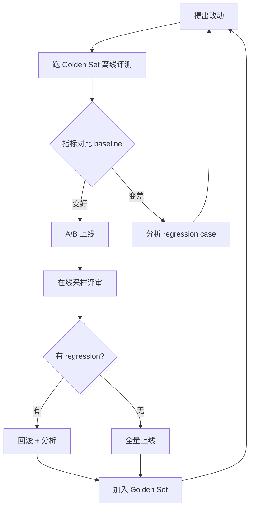

# Agent 评测(Evaluation & Testing)

> **"没评测的 agent 都是玩具"**——这是 Anthropic / OpenAI / LangChain 团队反复强调的话。Agent 输出是概率的、非确定的,**只有靠系统化评测才能知道"效果好没好、改动值不值、上线安不安"**。
>
> 本章讲透 **评测三维度 / Golden Set / LLM-as-Judge / Trajectory / 离线 vs 在线 / A/B / 主流框架** —— 面试重点,生产必备。
>
> 前置:[07-rag-engineering §八 评测](07-rag-engineering.md)(RAG 评测已铺垫)/ [05-agent-architectures](05-agent-architectures.md)

## 〇、核心提炼(5 段式)

### 核心机制(6 条必背)

1. **评测三维度**:**检索层(Recall/MRR)/ 生成层(Faithfulness/Relevance)/ 端到端(Task Success)**
2. **Golden Set 是评测基石**——人工标注 100-500 条 (query, 期望答案) 作为不变基准
3. **LLM-as-Judge 是主力工具**——用大模型当裁判,注意偏见 + 校准
4. **Trajectory 评测比结果更重要**——不只看最终答案,还看 agent 走的路径对不对
5. **离线 + 在线双轨**:**离线跑 Golden Set(每次改动)+ 在线采样人工审(生产)**
6. **A/B 测试是最终检验**——离线好不代表在线好,真实流量说了算

### 核心本质(必懂)

> 评测的本质是**"把不可衡量变得可衡量"**——LLM 输出的"好不好"是模糊感觉,评测的工作是**用数据把模糊变具体**:
>
> - **准确率是多少**?(而不是"感觉不错")
> - **改动带来 +2% 还是 -2%**?(而不是"应该变好了")
> - **哪些 case 变差了**?(而不是"整体感觉在改进")
> - **成本 / 延迟 / 满意度分布**?(而不是"用户还行")
>
> **评测的 4 个基本能力**:
> - **可重复**:相同输入相同结果(尽量控制 LLM 随机性)
> - **可对比**:改动前后能定量对比
> - **可定位**:失败 case 能找到根因
> - **可自动化**:CI/CD 集成,不靠人肉
>
> **为什么 agent 评测比传统 ML 难**:
> - 输出是自然语言,不是分类标签
> - 一个问题可能有多个正确答案
> - 需要评测中间路径(agent 怎么想的),不只是最终结果
> - **LLM-as-Judge 本身也可能错**(偏见 / 幻觉)

### 完整流程(评测闭环)

```
1. 建立 Golden Set(人工标注 100-500 条)
   ↓
2. 每次改动(prompt / model / retrieval / agent 逻辑):
   跑 Golden Set → 记录指标 → 对比 baseline
   ↓
3. Regression 分析:
   变差 case 人工看 → 找根因(改错了 / 边界 case / 数据偏差)
   ↓
4. 决定接受 or 回滚
   ↓
5. 上线后监控:
   采样 1-5% 请求 → LLM-as-Judge / 人工评审 → 发现在线 regression
   ↓
6. 定期扩充 Golden Set:
   在线发现的 bad case → 加入 golden set
   → 下次改动能检测到相似问题
```



### 6 条核心机制 - 逐点讲透(见下面各节)

### 一句话总结

> 评测 = **把模糊感觉变量化数据**;
> **Golden Set(基线)+ LLM-as-Judge(裁判)+ Trajectory(路径)+ A/B(在线)** 四位一体;
> 每次改动必须先离线评测再上线,**没数据的优化是拍脑袋**——面试问 "agent 效果怎么衡量" 答不出等于没上过生产。

---

## 一、为什么 Agent 必须评测

### 1.1 没有评测的痛(真实场景)

**场景 1:改了 prompt,不知道好没好**
```
产品:"新版本 prompt 效果怎么样?"
工程师:"感觉挺好..."
产品:"数据呢?"
工程师:"呃..."
```

**场景 2:上线后用户抱怨,不知道怎么定位**
```
用户:"回答不准"
工程师:"哪一次?"
用户:"忘了"
→ 没有 trace + 评测,盲改
```

**场景 3:换了模型省钱,不知道质量掉没掉**
```
从 Sonnet 换 Haiku,成本 -80%
但用户满意度掉了多少?
→ 不知道,可能省了钱赔了口碑
```

### 1.2 评测能回答的问题

- **绝对水平**:agent 的准确率 / 满意度 / 事实率是多少?
- **相对水平**:改动 A → B 是提升还是退步?哪些 case 变差?
- **成本效率**:多花的钱换来多少质量?
- **上线信心**:能不能上线?会不会翻车?
- **持续改进**:下一步优化哪个环节?

### 1.3 评测投入产出

**投入**:
- Golden Set 建设:1-2 人周初始 + 持续维护
- 评测工具接入:LangSmith / RAGAS 几天
- 每次改动的评测运行成本:$10-100(视 golden set 大小)

**产出**:
- 上线信心 → 加快迭代
- 定位失败 case → 精准优化
- 数据说话 → 减少扯皮
- 老板决策 → 有 ROI 依据

> **一句话**:评测不是 "有更好",是 **agent 上生产的入场券**;没评测的 agent 是玩具,改一版跟撞大运一样。

---

## 二、评测的三大维度

### 2.1 检索层(RAG 专属)

**指标**:
- **Recall@K**:top-K 里包含正确答案的比例
- **MRR (Mean Reciprocal Rank)**:正确答案排名倒数平均
- **NDCG@K**:考虑排序权重
- **Context Precision**:检索出的 doc 有多少真相关

**评测方法**:
- 人工标注 (query, 正确 doc_ids)
- 跑检索 → 对比

**详见** [07-rag-engineering §八 评测](07-rag-engineering.md)。

### 2.2 生成层(LLM 输出质量)

**指标**:
- **Faithfulness(忠实度)**:回答是否忠于给定文档,不幻觉
- **Answer Relevance(切题度)**:回答是否针对问题
- **Correctness(正确性)**:相对于 golden answer 的正确率
- **Coherence(连贯性)**:文本流畅性
- **Style / Format**:符合要求格式

**评测方法**:
- LLM-as-Judge(主力)
- 人工评审
- 规则(格式 / 长度 / 关键词)

### 2.3 端到端(Task Success)

**指标**:
- **Task Success Rate**:任务是否完成 → 二值 or 打分
- **Steps to Completion**:完成任务用了几步
- **Tool Call Count**:调用了多少工具
- **Cost per Task**:每次任务成本
- **Latency**:P50 / P99

**评测方法**:
- 有 ground truth 的任务(数学 / 代码 / 特定问答):判题脚本自动打分
- 无 ground truth 的开放任务:LLM-as-Judge / 人工

### 2.4 三维度关系

```
检索层坏 → 生成层没救(garbage in garbage out)
生成层坏 → 端到端坏
端到端坏 → 但可能是"agent 逻辑"而非检索/生成

调优顺序:检索 → 生成 → agent 逻辑
```

> **一句话**:评测三维度 = **检索(找对没有)/ 生成(说对没有)/ 端到端(完成任务没有)**;哪个环节出问题得分层排查,不能只看最终结果。

---

## 三、Golden Set(黄金基线)

### 3.1 什么是 Golden Set

**Golden Set** = 精心标注的评测数据集,是**改动前后对比的不变基准**。

```
每条 = (input, expected_output, metadata)

metadata: 类别 / 难度 / 边界 case 标签
```

### 3.2 建设方法

**Step 1:收集真实用户 query**
- 生产采样(带敏感数据脱敏)
- 内部测试问题
- 竞品/社区常见问题

**Step 2:人工标注**
- 期望答案 / 期望路径
- 分级:easy / medium / hard
- 标注边界 case(容易翻车的场景)

**Step 3:去重 + 覆盖度检查**
- 主题分布均衡(不全是 FAQ,也要有难题)
- 覆盖各类边界(空输入 / 恶意输入 / 超长输入)

### 3.3 Golden Set 的规模

| 规模 | 场景 |
| --- | --- |
| **50-100 条** | 早期原型,快速迭代 |
| **200-500 条** | 生产上线基础配置 |
| **1000-5000 条** | 成熟产品,细粒度评测 |
| **10000+** | 大规模平台,分层评测 |

**关键**:不是越多越好——**200 条精标 > 5000 条粗标**。

### 3.4 Golden Set 的分层

**按难度**:
- Easy(FAQ / 直接查询):基线保证
- Medium(需要推理):主力测试
- Hard(边界 / 多步骤):regression 检测

**按类型**:
- 事实性问题
- 推理问题
- 工具调用类
- 多轮对话
- 拒答类(该说不知道时)

### 3.5 持续扩充

```
上线后:
  在线发现的 bad case → 加入 Golden Set(去敏)
  →下次改动能检测到相似问题

原则:每个 regression 都变成 test case
```

### 3.6 Golden Set 的存储

```
简单场景: CSV / JSONL 存 git
复杂场景: LangSmith / Promptfoo / 内部平台
需要多人协作: 表格 / 平台(带审核流程)

标注工具:Argilla / Label Studio / 自建
```

> **一句话**:Golden Set 是评测基石——**200 条精标胜过 5000 条粗标**,按难度和类型分层,每次 regression 都要加进去,是持续投入的资产。

---

## 四、LLM-as-Judge(LLM 当裁判)

### 4.1 为什么用 LLM 评测

**人工评测**:
- 准 但慢 且贵
- 每次改动要重新过一遍成本高
- 不能规模化

**LLM-as-Judge**:
- 快 便宜 可自动化
- 一致性中等(比人差,比规则强)
- **现代 agent 评测的主力**

### 4.2 LLM-as-Judge 的两种模式

**模式 1:Reference-based(有标准答案)**

```python
prompt = f"""
问题: {question}
标准答案: {expected}
Agent 回答: {actual}

评价 agent 的回答是否正确,给出:
- score: 1-5 分
- reasoning: 理由
- verdict: correct / partial / incorrect
"""
```

**模式 2:Reference-free(无标准答案)**

```python
prompt = f"""
问题: {question}
Agent 回答: {actual}
参考文档: {retrieved_docs}

评价:
- Faithfulness: 回答是否忠于文档(1-5)
- Relevance: 是否切题(1-5)
- Completeness: 是否完整(1-5)
"""
```

### 4.3 主流 LLM-as-Judge 框架

**RAGAS**(RAG 场景):

```python
from ragas import evaluate
from ragas.metrics import faithfulness, answer_relevancy, context_precision

result = evaluate(
    dataset=eval_dataset,   # HuggingFace Dataset
    metrics=[faithfulness, answer_relevancy, context_precision]
)
print(result)  # {"faithfulness": 0.87, "answer_relevancy": 0.92, ...}
```

**DeepEval**:

```python
from deepeval import evaluate
from deepeval.metrics import GEval

metric = GEval(
    name="Correctness",
    criteria="答案是否符合标准",
    evaluation_params=["input", "actual_output", "expected_output"]
)

evaluate(test_cases=[...], metrics=[metric])
```

**LangSmith**:

```python
from langsmith.evaluation import evaluate

def correctness_evaluator(run, example):
    # 用 LLM 判断
    return {"score": llm_judge(run.outputs, example.outputs)}

evaluate(
    lambda inputs: my_agent.invoke(inputs),
    data="my-golden-set",
    evaluators=[correctness_evaluator]
)
```

### 4.4 LLM-as-Judge 的偏见(必知)

**主要偏见**:
1. **Position Bias**:一致偏向第一个 / 最后一个答案
2. **Length Bias**:偏向更长的答案
3. **Self-Preference**:同款模型评自己会偏袒
4. **Verbosity Bias**:偏向复杂词汇 / 更"专业"的表达
5. **Format Bias**:偏向格式漂亮的(Markdown / bullet points)

**缓解**:
- 用**不同厂家的模型**当 judge(Claude judge GPT / Gemini judge Claude)
- 随机化答案顺序(A/B 对比时)
- Judge 用**更强的模型**(Judge 用 Opus,generation 用 Sonnet)
- 校准:人工评一小部分,和 LLM 打分对齐

### 4.5 Judge 的 prompt 设计

```
❌ 差的 prompt:
"这个回答好不好?"

✓ 好的 prompt:
"评价 agent 回答的以下方面:
1. 事实正确性(是否有编造?)
2. 完整性(是否覆盖问题所有方面?)
3. 相关性(是否切题?)

按 1-5 打分,并给出简短理由。

问题: {question}
标准答案: {expected}
Agent 回答: {actual}

输出 JSON:
{{"correctness": N, "completeness": N, "relevance": N, "reasoning": "..."}}"
```

**关键**:
- 结构化输出(JSON Schema)
- 明确评分维度
- 要求 reasoning 减少幻觉打分

### 4.6 校准(Calibration)

**做法**:
- 人工评 50-100 条
- LLM 也评这批
- 对比:如果 kappa > 0.6(合理一致性),可以用 LLM 大规模;否则调 prompt

```python
from sklearn.metrics import cohen_kappa_score

human_scores = [...]
llm_scores = [...]
kappa = cohen_kappa_score(human_scores, llm_scores)
print(f"Kappa: {kappa}")  # 0.6+ 认为可用
```

> **一句话**:LLM-as-Judge 是评测主力——**RAGAS / DeepEval / LangSmith** 主流框架,但要防**5 大偏见**(position/length/self-pref/verbosity/format),用**不同厂家模型 + 更强模型 + 校准**缓解。

---

## 五、Trajectory 评测(agent 走的路径)

### 5.1 为什么要评 Trajectory

```
只评最终结果的问题:
  最终答案对,但走了 10 步,烧了 5x token
  → 结果好,过程差,长期成本失控
  
最终答案错,但走了 8 步差 1 步:
  → 只知道错,不知道哪一步错的
```

### 5.2 Trajectory 记录

```python
trajectory = [
    {"step": 1, "action": "call get_weather", "input": {"city": "北京"}, "output": "..."},
    {"step": 2, "action": "reasoning", "content": "..."},
    {"step": 3, "action": "call get_weather", "input": {"city": "北京"}, "output": "..."},  # 重复!
    ...
]
```

**记录字段**:
- Thought / reasoning 内容
- Tool call name + args
- Tool result
- 每步 token 消耗
- 每步耗时

### 5.3 Trajectory 评测维度

**正确性**:
- 关键步骤是否命中?(需要的 tool 是否调用了?)
- 参数是否合理?
- 有没有多余步骤?

**效率**:
- Step count(越少越好)
- Tool call count
- Total token / cost
- 是否有重复调用同一 tool(潜在死循环)

**逻辑性**:
- 步骤顺序合不合理?
- 有没有跳步 / 遗漏?

### 5.4 Trajectory 评测方法

**方法 1:结构化对比(有 golden trajectory)**

```python
golden = [{"action": "call A"}, {"action": "call B"}]
actual = [...]

# 对比是否命中关键 tool call
tool_match_rate = compute_tool_match(golden, actual)
```

**方法 2:LLM-as-Judge on trajectory**

```
prompt = f"""
任务: {task}
Agent 的执行路径:
{format_trajectory(trajectory)}

评价:
1. 步骤是否合理?
2. 有无多余步骤?
3. 有无遗漏?
输出 JSON
"""
```

### 5.5 常见 Trajectory 问题

| 问题 | 症状 | 解法 |
| --- | --- | --- |
| **重复调用** | 同 tool 同参数连续 3 次 | Prompt 加"不要重复"/ 应用层检测中断 |
| **绕圈** | A→B→A→B 循环 | max_iterations / 检测 loop |
| **步数爆炸** | 简单任务 20 步 | 简化 prompt / 换更强 model |
| **跳过关键步** | 该查数据没查直接回答 | Tool description 加强 / few-shot 示例 |
| **忘记原任务** | 中途偏题 | 定期复述目标 |

> **一句话**:Trajectory 评测**比结果更重要**——记录每步 thought/tool/result,评**正确性 + 效率 + 逻辑性**;发现重复调用 / 绕圈 / 步数爆炸这些"看结果发现不了"的问题,LangSmith / LangFuse 一定要接。

---

## 六、离线 vs 在线评测

### 6.1 离线评测

**特点**:
- 每次改动跑 Golden Set
- 快(几分钟到几小时)
- 便宜(几美金到几百)
- CI/CD 集成
- **是改动的准入门槛**

**流程**:
```
提 PR → 触发离线评测 → 指标对比 baseline
       → 变差 case 分析 → 决定合并 or 打回
```

### 6.2 在线评测

**特点**:
- 生产流量采样(1-5%)
- 用 LLM-as-Judge 或人工评审
- 实时反馈生产真实效果
- **是发现在线 regression 的手段**

**采样策略**:
- 全量采样成本太高
- 按用户 / 时间段采样
- 优先采样"低置信度" / "长对话" / "退出率高"的会话

### 6.3 双轨对比

| 维度 | 离线 | 在线 |
| --- | --- | --- |
| 数据 | Golden Set(固定) | 生产流量(变化) |
| 频率 | 每次改动 | 持续 |
| 反馈速度 | 快 | 慢 |
| 覆盖 | 精选场景 | 真实分布 |
| 用途 | 改动准入 | 发现 regression |

### 6.4 铁律

- ✓ 离线通过才能上线
- ✓ 上线后持续在线监控
- ✓ 在线发现的 bad case → 加入离线 Golden Set

---

## 七、A/B 测试(最终检验)

### 7.1 为什么需要 A/B

**离线评测的局限**:
- Golden Set 覆盖有限
- 无法测用户满意度 / 转化率
- 无法测长期效应(记忆积累 / 用户学习)

**A/B 测试给最真实的答案**:
- 真实流量
- 用户真实行为
- 业务指标(留存 / 转化 / 满意度)

### 7.2 Agent A/B 的挑战

传统 web A/B:改按钮颜色,一目了然。
Agent A/B:
- 输出是自然语言,难量化
- 用户行为(继续对话 / 退出 / 满意)才是真信号
- 需要更大流量(信号弱,噪音大)

### 7.3 A/B 指标设计

**直接指标**:
- Thumbs Up / Down 率
- 满意度调查(1-5 星)
- 继续对话率(用户是否再问)
- 任务完成率(可衡量的任务)

**间接指标**:
- 平均对话轮数
- 用户返回率(下次还来吗)
- 转化率(咨询 → 下单)

**成本指标**:
- 每次请求成本
- P99 延迟

### 7.4 A/B 实施

```python
# 简化版
def route(user_id):
    if hash(user_id) % 100 < 50:
        return old_agent
    else:
        return new_agent

# 记录:user_id / variant / 用户反馈 / 业务指标
# 跑够统计显著性(几万-几十万请求)
# 对比两组指标
```

**关键**:
- 用户级分桶(同一用户始终看同一版本,避免混乱)
- 跑够时长(几天到几周)
- 检验统计显著性(不是 A 高 1% 就 A 赢)

---

## 八、主流评测框架对比

| 框架 | 定位 | 特点 |
| --- | --- | --- |
| **RAGAS** | RAG 评测 | 三元组指标,主流 RAG 首选 |
| **DeepEval** | 全面评测 | Python 单元测试式,可 CI 集成 |
| **LangSmith** | LangChain 生态 | Trace + 评测 + 数据集,端到端 |
| **LangFuse** | 开源 LangSmith 替代 | 自部署,数据可控 |
| **Promptfoo** | Prompt 对比 | 便捷 A/B 多 model / 多 prompt |
| **TruLens** | RAG 三元组 | Faithfulness / Relevance / Groundedness |
| **Arize Phoenix** | 可观测 + 评测 | 开源 LLM ops |
| **Braintrust** | LLM ops | SaaS,评测 + trace |

### 8.1 选型建议

```
纯 RAG 评测:              RAGAS
LangChain / LangGraph 生态: LangSmith
自部署 / 数据不出:         LangFuse
Prompt 对比调优:           Promptfoo
Python 测试式:             DeepEval
```

### 8.2 组合使用

生产项目常见:
```
LangSmith(trace + 评测数据集)
+ RAGAS(RAG 部分深度评测)
+ 人工审(采样低置信度)
```

---

## 九、评测的常见坑

```
坑 1:没有 Golden Set,拍脑袋改
  → 每次改动跟撞大运一样
  → 200 条精标是基础配置

坑 2:Golden Set 只覆盖 happy path
  → 上线一堆边界 case 翻车
  → 必须包含 hard / edge case / 拒答类

坑 3:LLM-as-Judge 用同款模型
  → Self-preference bias
  → 用不同厂家模型 judge

坑 4:Judge 用小模型
  → 判不准,方差大
  → Judge 用 Opus / GPT-4,generation 用小的

坑 5:只看结果,不看 trajectory
  → 结果好但走了 20 步 → 长期成本失控
  → 必须 trace + trajectory 评测

坑 6:改一个环节评所有指标
  → 分不清哪里带来变化
  → 变量控制,一次改一个环节

坑 7:离线好就直接全量
  → 在线可能翻车
  → 必须 A/B 上量

坑 8:A/B 跑一天就下结论
  → 样本不够,不显著
  → 至少几万请求,几天到几周

坑 9:不做校准,盲信 LLM-as-Judge
  → LLM judge 的偏见可能系统性错
  → 人工评 50-100 条对齐 kappa

坑 10:在线发现 bad case 不入 golden set
  → 相同问题反复出现
  → 每个 regression 都要变 test
```

## 十、面试题速答

### Q1:Agent 怎么评测?

```text
三维度:
  1. 检索层: Recall@K / MRR / NDCG(RAG 场景)
  2. 生成层: Faithfulness / Relevance / Correctness
  3. 端到端: Task Success / Steps / Cost / Latency

三支柱:
  Golden Set(精标 200-500 条基线)
  LLM-as-Judge(RAGAS / DeepEval / LangSmith)
  A/B 测试(在线真实流量)

铁律: 离线通过才能上线,上线后持续采样评审,
      每个 regression 都要加入 golden set。
```

### Q2:LLM-as-Judge 有什么坑?

```text
5 大偏见:
  1. Position bias: 偏向第一个/最后一个
  2. Length bias: 偏向长答案
  3. Self-preference: 同款模型偏袒自己
  4. Verbosity: 偏向复杂词汇
  5. Format bias: 偏向 Markdown / bullet

缓解:
  - 用不同厂家模型 judge(Claude judge GPT)
  - 随机化答案顺序
  - Judge 用更强模型
  - 人工评 50-100 校准(kappa > 0.6 可用)

Prompt 设计: 结构化 JSON 输出 + 明确评分维度 + 要求 reasoning
```

### Q3:Trajectory 评测重要在哪?

```text
只评最终结果的问题:
  结果对但走了 20 步 → 长期成本失控
  结果错但不知道哪步错 → 无法定位

Trajectory 记录每步 thought/tool/args/result/token,
评估:
  - 正确性(关键 tool 命中?参数合理?)
  - 效率(step count / cost / 有无重复)
  - 逻辑性(顺序合理?有无遗漏?)

发现"看结果发现不了"的问题:
  重复调用同 tool → 死循环征兆
  步数爆炸 → prompt 有问题
  绕圈 → agent 逻辑漏洞

LangSmith / LangFuse 一定要接。
```

### Q4:Golden Set 怎么建?

```text
Step 1: 收集真实 query(生产采样脱敏 + 内部测试 + 竞品)
Step 2: 人工标注(期望答案 / 路径 / 难度分级 / 边界标签)
Step 3: 去重 + 覆盖度检查(主题均衡 / 包含 hard case)

规模:
  50-100 早期原型
  200-500 生产基础(甜蜜点)
  1000+ 成熟产品

关键:
  - 200 精标 > 5000 粗标
  - 分层(easy/medium/hard)
  - 包含 edge case + 拒答类
  - 持续扩充(每个 regression 都加入)
  - 版本化(git 存储 + 平台维护)
```

### Q5:离线 vs 在线评测,分别做什么?

```text
离线:
  数据: Golden Set(固定)
  频率: 每次改动
  用途: 改动准入门槛
  工具: LangSmith / RAGAS / DeepEval

在线:
  数据: 生产流量采样 1-5%
  频率: 持续
  用途: 发现在线 regression / 长期效应
  工具: LangSmith trace + LLM-as-Judge 或人工

A/B 测试:
  用户级分桶,直接指标(Thumbs Up / 满意度 / 完成率)
  + 业务指标(转化 / 留存)
  跑几天到几周,检验统计显著性

铁律: 离线过 → A/B 上量 → 全量。跳过任何一步都容易翻车。
```

## 十一、关联阅读

```
本目录:
- 05-agent-architectures            Trajectory 就是 agent 走过的架构循环
- 07-rag-engineering §八 评测        RAG 层评测详细
- 08-mcp-protocol                   MCP Server 也要评测
- 10-multi-agent-orchestration      多 agent 评测更难
- 12-production-engineering         观测 + 评测组合

外部:
- RAGAS: docs.ragas.io
- DeepEval: docs.confident-ai.com
- LangSmith: smith.langchain.com
- LangFuse: langfuse.com
- Promptfoo: promptfoo.dev
- TruLens: trulens.org
- Arize Phoenix: phoenix.arize.com
- Anthropic Evaluations: docs.anthropic.com/en/docs/build-with-claude/develop-tests
```

> **一句话核心(全篇精炼)**:
> 评测 = **把模糊感觉变量化数据**——没评测的 agent 是玩具;
> **三维度**(检索/生成/端到端)+ **四支柱**(Golden Set + LLM-as-Judge + Trajectory + A/B)+ **双轨**(离线+在线);
> **Golden Set 200 精标胜过 5000 粗标**,LLM-as-Judge 用**不同厂家 + 更强模型 + 校准**防偏见;
> **每个 regression 都要变 test case**——面试问 "agent 效果怎么衡量" 答不出等于没上过生产。
