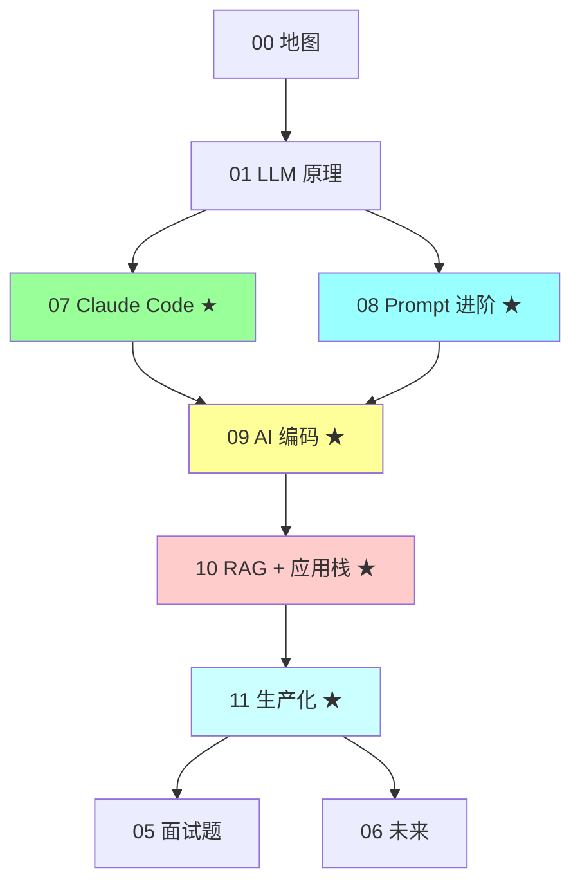

# AI

> 面向程序员和资深后端面试的 AI / Agent 笔记：LLM 原理、Coding Agent、Claude Code 实战、Prompt 进阶、RAG 工程化、AI 应用栈、生产化

## 分类导航

### 基础与原理

| 文件 | 内容 |
| --- | --- |
| [00-ai-map.md](00-ai-map.md) | AI / LLM / Agent 知识地图 |
| [01-llm-agent-principles.md](01-llm-agent-principles.md) | LLM 与 Agent 核心原理：Token、上下文、工具、记忆、规划 |

### 编程 Agent 与 Skills

| 文件 | 内容 |
| --- | --- |
| [02-coding-agent-comparison.md](02-coding-agent-comparison.md) | Claude Code / OpenAI Codex / Hermes Agent 对比 |
| [03-agent-skills-mcp.md](03-agent-skills-mcp.md) | Skills / MCP / AGENTS.md：可复用能力 |
| [04-developer-ai-workflow.md](04-developer-ai-workflow.md) | 程序员 AI 工作流：需求拆解 / 代码生成 / 评审 / 测试 |
| **[07-claude-code-mastery.md](07-claude-code-mastery.md) ★** | **Claude Code 完整能力图：Tools / Skills / MCP / Subagents / Settings / Hooks / Memory** |

### Prompt 与 RAG

| 文件 | 内容 |
| --- | --- |
| **[08-prompt-engineering-advanced.md](08-prompt-engineering-advanced.md) ★** | **Prompt 进阶：CoT / Few-shot / ReAct / Self-Consistency / ToT / Reflexion / Constitutional AI** |
| **[09-ai-coding-cookbook.md](09-ai-coding-cookbook.md) ★** | **AI 编码实战：debug / 重构 / 测试 / CR / 文档 / 架构 / 学新技术** |
| **[10-rag-and-app-stack.md](10-rag-and-app-stack.md) ★** | **RAG 工程化 + LangChain / LlamaIndex / Dify / Coze / Go 生态** |
| **[11-ai-production-engineering.md](11-ai-production-engineering.md) ★** | **AI 生产化：成本 / 可靠 / 可观测 / Guardrails / 安全 / Multi-Agent** |

### 面试与趋势

| 文件 | 内容 |
| --- | --- |
| [05-ai-interview-questions.md](05-ai-interview-questions.md) | AI 高频面试题 |
| [06-ai-future.md](06-ai-future.md) | AI 工程未来展望 |

## 学习路径



**推荐**：
1. 先看 **00 / 01**（地图 + 原理）
2. 重点学 **07 Claude Code**（当下最火）
3. 看 **08 Prompt 进阶**（所有 AI 应用基础）
4. 看 **09 AI 编码**（日常使用）
5. 做 AI 应用看 **10 RAG + 应用栈**
6. 生产落地看 **11 生产化**
7. 最后 **05 / 06**（面试 + 未来）

## 高频题速览

### LLM 原理
- Token / 上下文窗口 / Embedding 是什么？
- 为什么 LLM 会幻觉？
- RAG 解决什么问题？
- Function Calling / Tool Calling 本质？

### Claude Code
- Claude Code 8 大能力？（→ 07）
- Skills / MCP / Subagents 区别？（→ 07）
- Hooks 适合做什么？（→ 07）
- CLAUDE.md 怎么写？（→ 07）

### Prompt Engineering
- CoT 为什么有效？（→ 08）
- Self-Consistency vs ToT？（→ 08）
- ReAct 框架？（→ 08）
- Constitutional AI 是什么？（→ 08）

### AI 编码
- AI 适合 / 不适合什么任务？（→ 09）
- 怎么让 AI 不写烂代码？（→ 09）
- 团队怎么推 AI 协作？（→ 09）

### RAG
- RAG 完整流程？（→ 10）
- 切块 / Embedding / 向量库怎么选？（→ 10）
- 混合检索 / Rerank 为什么需要？（→ 10）
- LangChain 还推荐吗？（→ 10）

### 生产化
- LLM 应用怎么省钱？（→ 11）
- 怎么防 Prompt Injection？（→ 11）
- 怎么评测 LLM 应用？（→ 11）
- Multi-Agent 什么时候用？（→ 11）

## 答题原则

- 不把 AI 讲成玄学，讲清输入 / 上下文 / 工具 / 反馈 / 评估
- 不盲目吹 Agent，讲清适用场景 / 失败模式 / 安全边界
- 程序员使用 AI 的核心不是"让它替你写"，而是"在清晰约束下加速工程闭环"
- 高级答案体现：任务拆解 / 验证意识 / 上下文治理 / 知识沉淀 / 风险控制

## 与其他模块的关系

- **12-ai**（本模块）：AI / LLM 全景
- **13-engineering**（工程化）：可观测 / 测试等复用
- **07-microservice/07**：OpenTelemetry 基础
- **09-ddd**：AI 应用的业务建模

## 设计原则

- **图文并茂**，关键概念用 Mermaid
- **每篇独立可读**，高内聚优先于去重
- **Go 生态优先** + Python 通用
- **结合真实项目** 案例
- **面试题 + 加分点** 每篇必带

## 当下最热（按 2026 热度）

```
⭐⭐⭐⭐⭐ Claude Code（07）
⭐⭐⭐⭐⭐ Prompt 进阶（08）
⭐⭐⭐⭐⭐ AI 编码（09）
⭐⭐⭐⭐⭐ RAG 工程化（10）
⭐⭐⭐⭐⭐ AI 生产化（11）
⭐⭐⭐⭐  Multi-Agent（11）
⭐⭐⭐⭐  MCP（07）
⭐⭐⭐⭐  ReAct / Reflexion（08）
```
