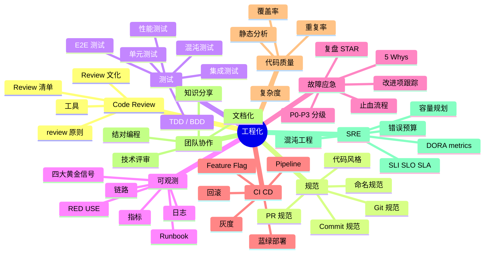
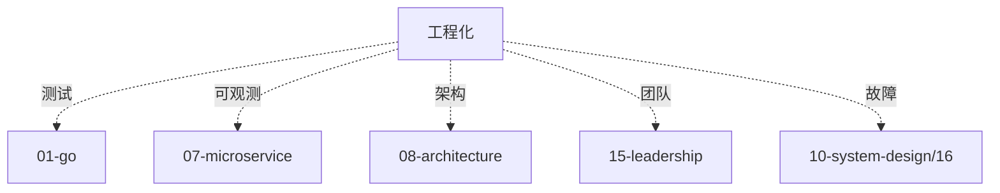

# 工程化知识地图

> 工程化是**资深后端的软实力**。Code Review / 规范 / 测试 / 可观测 / 故障应急，决定你能不能带好一个团队。
>
> 这份地图是 13-engineering 目录的总览：知识树 / 题型分类 / 学习路径 / 面试表达

---

## 一、整体知识树



---

## 二、后端视角的工程化

| 工程化能力 | 后端解决的问题 |
| --- | --- |
| Code Review | 质量守门 / 知识传递 |
| 代码规范 | 一致性 / 可维护 |
| 测试 | 回归保护 / 重构自由 |
| 可观测 | 问题发现 / 快速定位 |
| 故障应急 | 降低 MTTR / 减少损失 |
| CI/CD | 快速迭代 / 灰度回滚 |
| 静态分析 | 提前发现 bug |
| SRE | 稳定性量化 |
| Runbook | 新人快速上手 |

---

## 三、能力分层

```text
L1 概念
  Review 是什么、为什么、工具

L2 规范
  代码 / Git / Commit / PR 规范

L3 测试
  单元 / 集成 / E2E / 性能 / TDD

L4 可观测
  指标 / 日志 / 链路 / 黄金信号

L5 故障应急
  止血 / 分级 / 复盘 / 改进

L6 CI/CD
  Pipeline / 灰度 / 回滚 / Feature Flag

L7 SRE
  SLI/SLO/SLA / 错误预算 / DORA

L8 团队
  文档 / 分享 / 评审 / 传承
```


---

## 四、题型分类

### 4.1 基础题（P5）

```
□ Code Review 怎么做
□ 单元测试覆盖率多少
□ 日志级别
□ Git 规范
```

对应：[01](01-code-review.md) / [02](02-standards.md) / [03](03-testing-strategy.md)

### 4.2 中级题（P6）

```
□ Review 清单有什么
□ TDD 流程
□ 四大黄金信号
□ 故障应急流程
□ 灰度发布策略
```

对应：[01](01-code-review.md) / [03](03-testing-strategy.md) / [04](04-observability-integration.md) / [00](00-troubleshooting-runbook.md)

### 4.3 资深题（P7+）

```
□ SRE 体系完整落地
□ SLI/SLO 设定
□ 错误预算实战
□ 混沌工程实施
□ 全链路压测
□ DORA 4 key metrics
□ Runbook 自动化
□ Feature Flag 治理
```

对应：[03](03-testing-strategy.md) / [04](04-observability-integration.md) / [00](00-troubleshooting-runbook.md)

### 4.4 故障排查题（必考）

```
□ 讲一个你处理过的严重故障
□ 讲一个踩过的大坑
□ 团队最近一次复盘
□ 怎么降低 MTTR
```

对应：[00](00-troubleshooting-runbook.md) + [../10-system-design/16](../10-system-design/16-high-concurrency-scenarios.md)

---

## 五、目录文件全览

| # | 文件 | 重点 |
| --- | --- | --- |
| 00 | [故障应急 Runbook](00-troubleshooting-runbook.md) | P0-P3 / 止血 / 复盘 |
| 01 | [Code Review](01-code-review.md) | 清单 / 原则 / 文化 |
| 02 | [规范](02-standards.md) | 代码 / Git / Commit / PR |
| 03 | [测试策略](03-testing-strategy.md) | 单元 / 集成 / E2E / 混沌 |
| 04 | [可观测集成](04-observability-integration.md) | Prometheus / Jaeger / Loki |

---

## 六、系统设计中的角色

### 6.1 故障应急 = MTTR 核心

```
监控告警 → 快速定位 → 止血 → 根因 → 改进
```

### 6.2 CI/CD = 快速迭代

```
提交 → 静态检查 → 单测 → 集成 → 灰度 → 全量
每个环节都是质量关卡
```

### 6.3 SRE = 稳定性量化

```
SLI（指标）→ SLO（目标）→ 错误预算
超出预算 → 停止发布 → 修复
```

---

## 七、学习路径推荐

### 7.1 入门 → 资深（4 周）

```
Week 1: 规范 + Review
  01 + 02

Week 2: 测试
  03

Week 3: 可观测
  04

Week 4: 故障应急
  00
```

---

## 八、答题模板

### 8.1 故障复盘题（"讲一个严重故障"）

```
STAR + 5 Whys:

Situation（背景）:
  某日某时，线上服务 X 异常...

Task（任务）:
  作为负责人，需要快速恢复...

Action（行动）:
  1. 监控告警
  2. 止血（降级 / 限流 / 回滚）
  3. 分层定位
  4. 临时修复
  5. 全部恢复

Result（结果）:
  影响时长 / 用户数 / GMV 损失

5 Whys:
  Why 1: 为什么 X 挂
  Why 2: 为什么没发现
  Why 3: 为什么测试没覆盖
  ...

改进项:
  - 监控加强（owner / ddl）
  - 测试补充
  - 应急自动化
```

### 8.2 团队题（"怎么提升代码质量"）

```
4 层:
1. 规范（代码 / Git / Commit / PR）
2. Review（强制 + 清单 + 文化）
3. 测试（覆盖率 + TDD）
4. 可观测（监控 + 日志 + 链路）
```

### 8.3 SRE 题（"SLO 怎么定"）

```
3 步:
1. SLI: 指标（成功率 / 延迟 P99 / 可用性）
2. SLO: 99.9% 还是 99.99%（业务决定）
3. 错误预算: 1 - SLO = 允许故障时间
   - 0.1% = 一月 43 分钟
   - 超出预算 = 停止发布 / 修复稳定性
```

---

## 九、面试表达

```text
工程化 8 层：
- L1 概念（Review）
- L2 规范（代码 / Git）
- L3 测试（TDD / 覆盖率）
- L4 可观测（四大信号）
- L5 应急（STAR / 5 Whys）
- L6 CI/CD（灰度 / 回滚）
- L7 SRE（SLO / 错误预算）
- L8 团队（文档 / 传承）

工程化体现"技术管理"能力。
面试时讲具体案例 + 量化数据。
```

---

## 十、常见误区

### 误区 1：覆盖率越高越好

错。**关键路径 100%** + 其他 60-80% 足够。**边际成本递增**。

### 误区 2：Code Review 走形式

错。Review 要**强制 + 清单 + 责任到人**。

### 误区 3：上线就行

错。**上线 → 监控 → 复盘** 是完整闭环。

### 误区 4：监控越多越好

错。**关键指标**（四大黄金信号）最重要。过多告警导致疲劳。

### 误区 5：SLA 追求 100%

错。100% 不可能 + 成本指数级。**99.9% / 99.99%** 足够。

---

## 十一、与其他模块的关系



---

## 十二、面试加分点

- **STAR + 5 Whys** 故障复盘
- **P0-P3 分级** 响应机制
- **错误预算** 实战
- **DORA 4 key metrics**（部署频率 / MTTR / 变更失败率 / 交付周期）
- **混沌工程** + Chaos Mesh
- **Runbook** 自动化
- **Feature Flag** 治理
- **全链路压测**（影子表 / 生产）
- **蓝绿 / 金丝雀 / Ring** 发布
- **监控降噪**（告警分级 + 抑制）
- **SLO 错误预算**
- **MTBF / MTTR** 目标设定

---

## 十三、推荐阅读路径

```
入门:
  □ 《代码整洁之道》
  □ 13-engineering/01-02

进阶:
  □ 《SRE Google 运维解密》
  □ 《DevOps 实践指南》
  □ 13-engineering/03-04

资深:
  □ 《Accelerate》
  □ 《Seeking SRE》
  □ 13-engineering/00

实战:
  □ 主导一次故障复盘
  □ 落地 SLO + 错误预算
  □ 推动 Code Review 文化
```

---

## 十四、与 99-meta 的关联

```
故障案例: 10-system-design/16-high-concurrency-scenarios.md
跨主题:   99-meta/01-cross-topic-index.md
```
