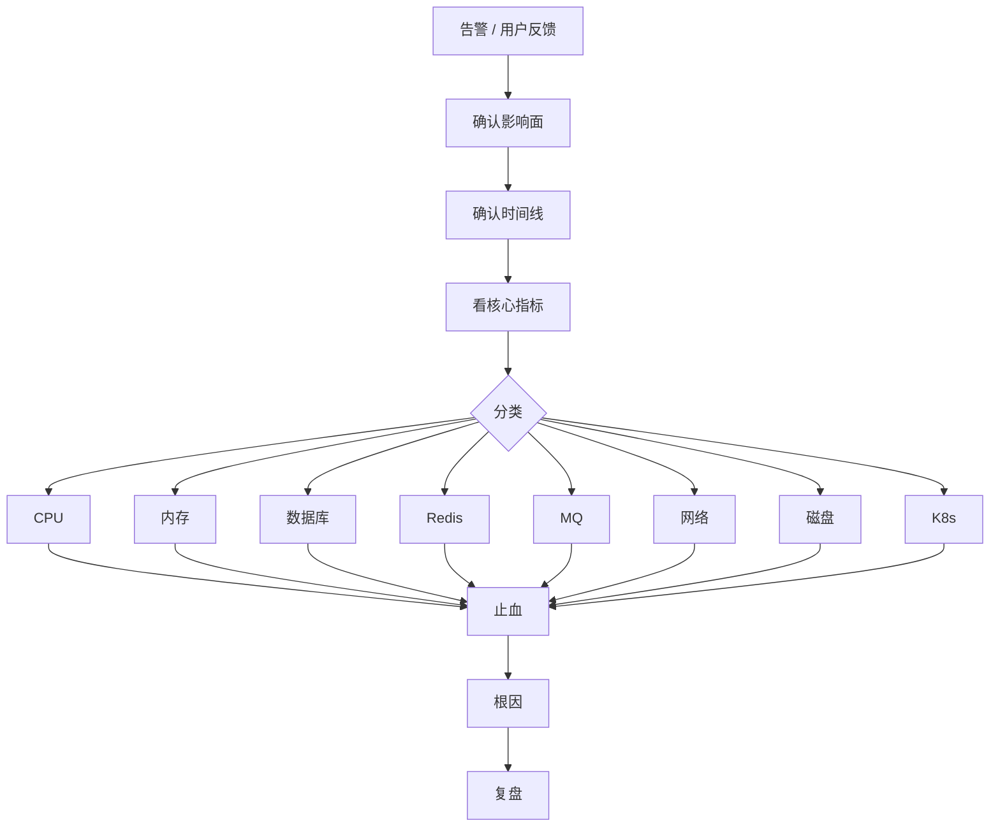

# 线上排查 Runbook 总表

> 这个文件是排障入口。先按现象定位方向，再跳到对应专题深入排查。

## 一、总流程



先问：

1. 是否刚发布、改配置、扩缩容、切流？
2. 是单实例、单机房、单接口，还是全局？
3. 是错误率升高，还是 P99 升高？
4. 是 CPU、内存、IO、网络、DB、Redis、MQ 哪一类？
5. 先止血需要限流、降级、回滚、扩容还是摘流？

## 二、高 CPU

快速命令：

```text
top
top -H -p <pid>
vmstat 1
pidstat -u -w 1
go tool pprof http://host/debug/pprof/profile
strace -c -p <pid>
perf top -p <pid>
```

判断：

- `user` 高：业务计算、序列化、正则、压缩。
- `system` 高：系统调用、锁、网络。
- `iowait` 高：磁盘或存储。
- load 高但 CPU 不高：IO 等待或任务排队。

深入：[02-os/15-cpu-memory-troubleshooting.md](../02-os/15-cpu-memory-troubleshooting.md)

## 三、高内存 / OOM

快速命令：

```text
free -h
ps aux --sort=-rss
pmap -x <pid>
cat /proc/<pid>/status
cat /proc/<pid>/smaps_rollup
dmesg | grep -i oom
go tool pprof http://host/debug/pprof/heap
```

判断：

- RSS 是否持续上涨。
- Go heap 是否等于 RSS。
- 是否 goroutine 泄漏。
- 是否 mmap/cgo/off-heap。
- 是否容器 memory limit 触发。

深入：[02-os/11-memory-oom.md](../02-os/11-memory-oom.md)

## 四、慢 SQL / 数据库异常

快速检查：

```text
慢查询日志
EXPLAIN
SHOW PROCESSLIST
连接池等待
主从延迟
锁等待 / 死锁日志
```

常见原因：

- 索引缺失。
- 回表和 filesort。
- 深分页。
- 大事务。
- MDL 锁。
- 连接池被慢 SQL 占满。

深入：

- [03-mysql/06-slow-sql-optimization.md](../03-mysql/06-slow-sql-optimization.md)
- [03-mysql/10-production-cases.md](../03-mysql/10-production-cases.md)
- [03-mysql/16-go-mysql-practice.md](../03-mysql/16-go-mysql-practice.md)

## 五、Redis 异常

快速命令：

```text
INFO memory
INFO stats
INFO commandstats
SLOWLOG GET 128
LATENCY DOCTOR
redis-cli --bigkeys
redis-cli --hotkeys
```

分类：

- 热 key：单分片 CPU 高。
- 大 key：RT 抖动、网络大、删除慢。
- 内存打满：淘汰、写失败。
- 慢查询：阻塞命令、大集合、Lua。
- fork/COW：RDB/AOF rewrite 抖动。

深入：[04-redis/09-production-cases.md](../04-redis/09-production-cases.md)

## 六、MQ 积压 / 丢失 / 重复

快速检查：

```text
topic lag
consumer group 状态
分区数和消费者数
消费失败率
重试和死信
下游 DB/RPC 耗时
rebalance 次数
```

判断：

- 消费者数超过分区数，继续扩容无效。
- 消费慢可能是下游慢，不是 MQ 慢。
- 重复消费是常态，消费者必须幂等。
- 丢失要从生产者、Broker、消费者、业务落库四段看。

深入：

- [05-message-queue/08-production-cases.md](../05-message-queue/08-production-cases.md)
- [05-message-queue/09-transaction-message-outbox.md](../05-message-queue/09-transaction-message-outbox.md)

## 七、接口偶发超时

快速命令：

```text
curl -w
dig
ss -antp
netstat -s
sar -n TCP,ETCP 1
tcpdump
trace
```

拆分链路：

- DNS。
- TCP connect。
- TLS。
- 服务端处理。
- 下游 RPC。
- 连接池等待。
- 网络重传。

深入：[02-os/17-network-troubleshooting.md](../02-os/17-network-troubleshooting.md)

## 八、磁盘问题

快速命令：

```text
df -h
df -i
du -sh *
lsof | grep deleted
iostat -x 1
iotop
pidstat -d 1
```

判断：

- 空间满。
- inode 满。
- deleted 文件未释放。
- await/util 高。
- fsync 慢。
- 日志写爆。

深入：[02-os/18-disk-io-troubleshooting.md](../02-os/18-disk-io-troubleshooting.md)

## 九、K8s 资源问题

快速命令：

```text
kubectl describe pod <pod>
kubectl logs <pod> --previous
kubectl top pod
kubectl get events --sort-by=.lastTimestamp
cat /sys/fs/cgroup/memory.current
cat /sys/fs/cgroup/cpu.stat
```

判断：

- OOMKilled。
- CPU throttling。
- liveness/readiness/startup probe。
- 节点资源不足。
- Pod 频繁重启。

深入：[02-os/19-container-k8s-resource.md](../02-os/19-container-k8s-resource.md)

## 十、跨系统典型问题

### 支付成功但订单未更新

排查：

- 支付回调是否收到。
- 回调幂等是否成功。
- DB 状态机是否更新。
- MQ 是否发送和消费。
- outbox 是否积压。
- 对账任务是否修复。

关联：

- [03-mysql/17-consistency-reconciliation.md](../03-mysql/17-consistency-reconciliation.md)
- [05-message-queue/09-transaction-message-outbox.md](../05-message-queue/09-transaction-message-outbox.md)

### 缓存和数据库不一致

排查：

- 写路径是否先 DB 后删缓存。
- 删除缓存是否失败。
- 是否有旧值回填。
- TTL 是否过长。
- binlog 删除是否积压。

关联：[04-redis/10-cache-consistency-design.md](../04-redis/10-cache-consistency-design.md)

### 搜索结果和详情页不一致

排查：

- MySQL 到 ES 同步是否延迟。
- MQ/binlog 是否积压。
- 删除和更新事件是否丢失。
- 查询是否读了旧索引。

关联：[10-system-design/11-search-system.md](../10-system-design/11-search-system.md)

## 十一、面试表达

```text
线上排查我会先确认影响面和时间线，再按 CPU、内存、DB、Redis、MQ、网络、磁盘和 K8s 分类收敛。
处理上先止血，比如限流、降级、扩容、摘流或回滚，再保留现场继续定位根因。
定位时我不会只看平均值，会看 P99、错误率、连接池等待、MQ lag、Redis slowlog、DB 慢查询、网络重传和系统资源。
最后必须形成复盘和防复发动作，包括监控、告警、压测、灰度、回滚、对账和补偿。
```

