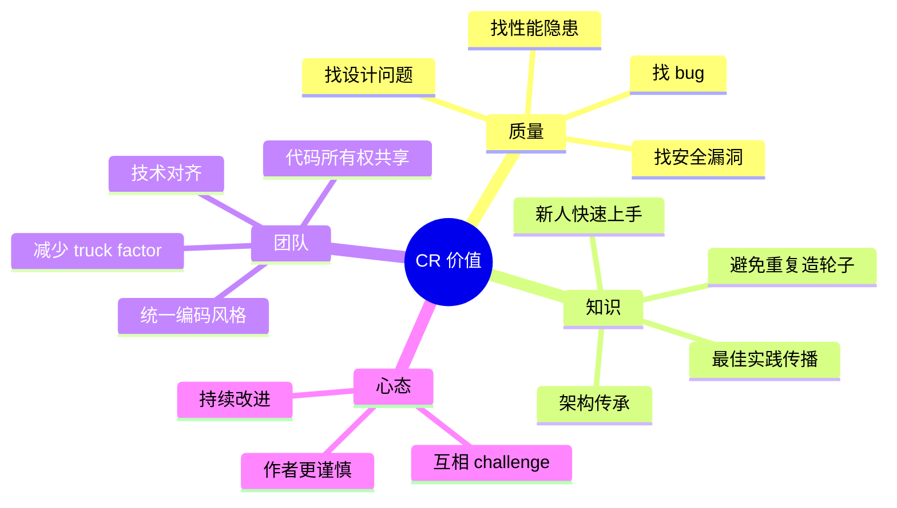
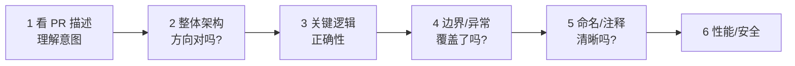

# 工程化 · Code Review

> CR 的价值 / 流程规范 / 完整 Checklist / 反模式 / 大厂实践

> 不只是"找 bug"，CR 是**知识传递 + 质量守门 + 团队对齐**的核心实践

## 一、Code Review 的价值

### 1.1 CR 不只是找 bug



**研究数据**：CR 能拦截 60-90% 的 bug（Cisco / Microsoft 研究）。

### 1.2 没有 CR 的代价

```
❌ Bug 流入生产 → 故障频发
❌ 代码风格各异 → 难维护
❌ 一人离职项目瘫痪（truck factor = 1）
❌ 新人没人教 → 上手慢
❌ 重复造轮子 → 团队效率低
❌ 安全漏洞漏过 → 出事故
```

### 1.3 CR ROI

```
单次 CR 成本: 30 分钟
单次 bug 上线代价:
  - 工作时间发现：1-4 小时
  - 半夜值班发现：5-10 小时 + 影响业务
  - 数据损坏：天级修复

→ ROI 极高，强制做
```

## 二、CR 流程

### 2.1 标准流程


### 2.2 提交前自检（作者）

```
□ 自己先 review 一遍（diff 自看）
□ 单测都跑过
□ Linter 通过
□ 提交信息清晰
□ PR ���述写好（背景/方案/测试）
□ 关联需求/Issue 链接
□ 截图（UI 改动）
□ 标注重点关注的代码
```

### 2.3 自动检查（CI）

CR 不该浪费在自动能发现的问题上：

```yaml
# .github/workflows/ci.yml
name: CI
jobs:
  lint:
    - golangci-lint run
  test:
    - go test ./... -race -cover
  vet:
    - go vet ./...
  security:
    - gosec ./...
```

**自动拦截**：
- 编译错误
- 测试失败
- Lint 警告
- 安全扫描
- 依赖漏洞
- 代码格式
- 覆盖率下降

人工 CR 只看**机器看不出**的问题。

### 2.4 人工 Review（reviewer）



**Review 顺序**：从大到小（架构 → 设计 → 实现 → 风格）。

### 2.5 反馈分级

```
[Must Fix] 必改: 阻塞合并
  - Bug
  - 安全漏洞
  - 性能严重问题
  - 违反核心规范

[Should Fix] 建议改: 强烈建议
  - 设计可改进
  - 命名不清
  - 缺少测试

[Could Fix] 可选: 不阻塞
  - 风格偏好
  - 小优化

[Nit] 吹毛求疵: 不阻塞，作者决定
  - 空格/缩进
  - 个人喜好
```

明确分级避免**为小事卡住合并**。

### 2.6 谁来 review

```
□ 至少 1 个同模块负责人
□ 大改动：架构师 + 同模块 + 跨模块
□ 涉及安全/性能：领域专家
□ 跨服务接口：双方代表
□ 资深开发的代码：再有一个资深
□ 新人代码：导师 + 同事
```

**结对 Review**：作者和 reviewer 一起对着屏幕过，效率高，适合复杂改动。

## 三、CR Checklist（完整版）

### 3.1 总体设计

```
□ 是否解决了 PR 描述中的问题？
□ 方案是不是最简单的？（YAGNI）
□ 是否过度设计/过度抽象？
□ 是否符合现有架构？
□ 是否影响其他模块？
□ 是否需要文档/RFC？
```

### 3.2 正确性

```
□ 逻辑是否正确？
□ 边界条件（0/null/空数组/最大值）
□ 错误路径处理
□ 异常情况下资源释放（defer）
□ 并发安全（race condition）
□ 事务/锁的使用
□ 幂等性（特别是 RPC/MQ）
□ 时区/时间处理
□ 浮点数比较
```

### 3.3 性能

```
□ 是否引入慢操作？
□ N+1 查询？
□ 不必要的循环嵌套？
□ 大对象传值（应该传指针）
□ 字符串拼接（应该用 builder）
□ 锁粒度太大
□ 内存泄漏（goroutine 泄漏）
□ 缓存策略
□ DB 索引
```

### 3.4 安全

```
□ SQL 注入（参数化查询）
□ XSS（输入校验/输出转义）
□ 敏感信息（密码/Token 不打日志）
□ 鉴权检查
□ 输入校验
□ 文件上传限制
□ 路径遍历
□ CSRF 防护
□ 第三方依赖漏洞
```

### 3.5 可读性

```
□ 命名清晰（变量/函数/包）
□ 函数长度（<50 行）
□ 函数职责单一（SRP）
□ 注释解释 why 而非 what
□ 魔法数字提取常量
□ 死代码删除
□ TODO/FIXME 有 issue 链接
□ 风格一致
```

### 3.6 测试

```
□ 是否有单测？
□ 关键路径覆盖？
□ 边界用例？
□ Mock 是否合理？
□ 测试是否独立可重复？
□ 测试名清晰？
□ 集成测试（如有）
```

### 3.7 可维护性

```
□ 模块边界清晰？
□ 依赖方向单向（不循环依赖）
□ 配置和代码分离
□ 易于扩展
□ 易于测试
□ 易于删除（不留下技术债）
```

### 3.8 文档

```
□ 公共 API 有注释/文档
□ README 是否更新
□ CHANGELOG 是否更新
□ 关键决策有 ADR
□ 变更影响有说明
```

## 四、Go 项目 CR 关注点

### 4.1 Go 特有问题

```go
// 1. defer 在循环里
// ❌
for _, f := range files {
    file, _ := os.Open(f)
    defer file.Close()  // 全部循环结束才关
}

// ✅
for _, f := range files {
    func() {
        file, _ := os.Open(f)
        defer file.Close()
        // 处理
    }()
}
```

```go
// 2. nil interface vs nil
// ❌
func doSomething() error {
    var err *MyError
    return err  // 返回的不是 nil！是 (*MyError)(nil)
}
if err := doSomething(); err != nil {  // 永远 true
    // ...
}

// ✅
func doSomething() error {
    return nil
}
```

```go
// 3. goroutine 泄漏
// ❌
go func() {
    for { select {} }  // 永远不退出
}()

// ✅
go func() {
    for {
        select {
        case <-ctx.Done():
            return
        case x := <-ch:
            handle(x)
        }
    }
}()
```

```go
// 4. map 并发读写
// ❌
m := map[string]int{}
go m["a"] = 1
go m["b"] = 2  // panic: concurrent map writes

// ✅ 用 sync.Map 或 mutex
var mu sync.Mutex
mu.Lock(); m["a"] = 1; mu.Unlock()
```

```go
// 5. 循环变量捕获（Go 1.22 前）
for _, v := range items {
    go func() { fmt.Println(v) }()  // Go 1.22 前都打印最后一个
}

// ✅ Go 1.22 前：
for _, v := range items {
    v := v
    go func() { fmt.Println(v) }()
}
```

### 4.2 Go 风格

```
□ 错误用 errors.Is/As 比较
□ 错误用 %w 包裹保留 chain
□ Context 作为第一参数
□ 接收者命名一致（同一类型）
□ 接口要小（< 5 个方法）
□ 接口在使用方定义，不在实现方
□ 命名用驼峰，不用下划线
□ 包名小写、单词、不复数
□ panic 只在初始化和不可恢复
□ 不要在库里 panic，返回 error
```

详见 [01-go-language/05-engineering/](../01-go-language/05-engineering/)。

### 4.3 Go 性能 CR

```go
// 字符串拼接
// ❌ 大量拼接
s := ""
for _, x := range items {
    s += x  // O(n²)
}

// ✅ 用 strings.Builder
var b strings.Builder
for _, x := range items {
    b.WriteString(x)
}
s := b.String()
```

```go
// 切片预分配
// ❌
result := []int{}
for i := 0; i < n; i++ {
    result = append(result, i)
}

// ✅ 已知大小预分配
result := make([]int, 0, n)
```

```go
// 大对象传指针
// ❌
type BigStruct struct { /* 1KB */ }
func process(b BigStruct) {}  // 每次拷贝 1KB

// ✅
func process(b *BigStruct) {}
```

## 五、PR 描述模板

```markdown
## 背景
为什么做这个改动？业务需求 / Bug 修复 / 重构？

## 方案
怎么做的？关键设计决策？

## 影响范围
- 影响哪些模块/接口？
- 是否破坏兼容性？
- DB schema 变更？
- 配置变更？

## 测试
- 单元测试覆盖了什么？
- 集成测试？
- 手动验证步骤？

## 风险
- 上线风险？
- 回滚方案？
- 是否需要灰度？

## Checklist
- [ ] 单测通过
- [ ] Lint 通过
- [ ] 文档更新
- [ ] 关联 Issue: #123
- [ ] CHANGELOG 更新
- [ ] 已自我 review

## 截图（如有 UI 改动）
```

**好的 PR 描述**：reviewer 看 30 秒就能进入状态。

## 六、CR 反模式

### 反模式 1：纯风格 CR

```
"这里空格应该 4 个不是 2 个"
"变量名应该叫 userId 不是 user_id"
```

**修复**：用 linter / formatter 自动处理，CR 看人能看出的问题。

### 反模式 2：橡皮图章

```
PR 提交 → 立即 LGTM → 没看
```

**修复**：
- 至少 30 分钟 review 一次
- 必须留具体反馈（不只是 LGTM）
- 大改动多人 review

### 反模式 3：CR 变战场

```
"你这写得真烂"
"我之前不是说过别这么写"
```

**修复**：
- 对事不对人
- 用问句而非命令（"为什么这么设计？"）
- 给建议要带原因
- 必要时口头沟通

### 反模式 4：CR 拖延

```
PR 挂了 1 周没人 review
作者切到其他事 → 上下文丢失 → 重新 review 成本大
```

**修复**：
- SLA：24 小时内 review
- PR 太大就拆
- 标 reviewer 主动找

### 反模式 5：PR 太大

```
1 个 PR 改 3000 行 → 没法 review
```

**修复**：
- PR < 500 行
- 按功能拆多个 PR
- 重构和功能分开

### 反模式 6：忽略 CI 失败

```
单测红 → "我本地能跑" → 强行合并
```

**修复**：CI 必须绿才能合并（branch protection）。

### 反模式 7：作者 vs reviewer 拉锯

```
反复修改 10 轮还在改风格
```

**修复**：
- 用 Must / Should / Could 分级
- Could 类不阻塞
- 实在卡住找第三人决断

### 反模式 8：盲目相信权威

```
资深说什么就是什么，不敢 challenge
```

**修复**：
- 资深也会错
- 鼓励技术辩论
- 用数据/原理说话

### 反模式 9：Review 范围过大

```
"我觉得整个模块都该重构"
```

**修复**：
- 当前 PR 范围内 review
- 重构提单独 PR
- 大方向问题写到长期 backlog

### 反模式 10：缺少测试也通过

```
"先合了，测试以后补"
→ 永远不补
```

**修复**：测试和实现一起进 PR。

## 七、大厂 CR 实践

### 7.1 Google

```
- 必须 LGTM + Approve（两个不同的人）
- LGTM = 看过没大问题
- Approve = 全权负责合并
- 大型 PR 拒绝（< 200 行最佳）
- 严格的 owner 文件（不同目录不同 owner 必须 review）
- Code Review 培训
```

### 7.2 Microsoft

```
- 大量自动化（CI 强约束）
- 多个 reviewer
- Pull Request 模板
- 强制结对（pair）review 大改动
```

### 7.3 字节

```
- gerrit / Phabricator
- 大改动必须架构组 review
- TLM (Tech Lead Manager) 主导
- CR 不通过不让发版
```

### 7.4 阿里

```
- 强制流程
- 主管审批 + 架构组审批（大改动）
- 风险评估
```

### 7.5 Netflix（极端例子）

```
- "Freedom & Responsibility"
- 不强制 CR，工程师自己负责
- 但生产事故责任自负
- 适合资深团队，不适合普通团队
```

## 八、CR 文化建设

### 8.1 团队规则

```
□ 24 小时内 review（紧急 < 4 小时）
□ PR < 500 行（大就拆）
□ 至少 1 个 reviewer
□ CI 必绿
□ 必须自我 review
□ PR 描述模板
□ 反馈分级（Must/Should/Could/Nit）
□ 对事不对人
```

### 8.2 工具

```
- GitLab MR / GitHub PR / Phabricator / Gerrit
- 自动 reviewer 分配（CODEOWNERS）
- 评论模板
- IDE 集成（Code Review 视图）
```

### 8.3 度量

```
- PR 平均 size
- PR review 时长
- PR 修改轮次
- Bug 拦截率
- CR 覆盖率
```

**度量是为了发现问题**，不是为了 KPI（避免刷数）。

### 8.4 新人融入

```
- 头几周强制 reviewer
- 资深带教
- CR 中传授最佳实践
- 鼓励新人提问
```

## 九、ddd_order_example CR 示例

### 9.1 一个糟糕的 PR

```diff
+ func (h *OrderHandler) CreateOrder(c *gin.Context) {
+     var req CreateOrderReq
+     c.BindJSON(&req)
+     order := &Order{
+         ID: uuid.New().String(),
+         CustomerID: req.CustomerID,
+         Status: "created",
+     }
+     db.Save(order)
+     c.JSON(200, order)
+ }
```

**reviewer 反馈**：

```
[Must]
- BindJSON 没检查错误
- 没做参数校验
- HTTP handler 直接调 DB，违反洋葱架构
- 用 magic string "created" 而非常量
- 没有日志
- 错误情况不处理

[Should]
- Status 应该用领域类型 OrderStatus
- 缺少 trace 透传
- 缺少 Metrics

[Could]
- 200 应该用 http.StatusOK
- 包导入顺序

[Nit]
- 函数末尾空行
```

### 9.2 改进后

```diff
+ func (h *OrderHandler) CreateOrder(w http.ResponseWriter, r *http.Request) {
+     ctx := r.Context()
+
+     var req dto.CreateOrderRequest
+     if err := json.NewDecoder(r.Body).Decode(&req); err != nil {
+         http.Error(w, "无效请求", http.StatusBadRequest)
+         return
+     }
+
+     items := req.ToDomain()
+     orderID, err := h.orderService.CreateOrder(ctx, req.CustomerID, items)
+     if err != nil {
+         h.logger.Error("create order failed",
+             zap.String("trace_id", trace.SpanFromContext(ctx).TraceID().String()),
+             zap.Error(err))
+         http.Error(w, "创建订单失败", http.StatusUnprocessableEntity)
+         return
+     }
+
+     w.Header().Set("Content-Type", "application/json")
+     w.WriteHeader(http.StatusCreated)
+     json.NewEncoder(w).Encode(map[string]string{"order_id": orderID})
+ }
```

## 十、面试高频题

**Q1：Code Review 的价值？**

- 拦截 bug（60-90%）
- 知识传递
- 团队对齐
- 代码所有权共享
- 持续改进

ROI 极高，强制做。

**Q2：CR 看什么？**

按顺序：架构 → 设计 → 正确性 → 边界异常 → 性能 → 安全 → 可读性 → 测试 → 文档。

**Q3：自动检查 vs 人工 Review？**

- 自动：编译/Lint/测试/格式/安全扫描
- 人工：架构/设计/逻辑/边界/可读性

**人工 CR 不要浪费在自动能发现的问题上**。

**Q4：CR 反馈怎么分级？**

- Must Fix（必改，阻塞）
- Should Fix（建议，强烈建议）
- Could Fix（可选）
- Nit（吹毛求疵，不阻塞）

避免为小事卡住合并。

**Q5：PR 应该多大？**

< 500 行最佳，> 1000 行就该拆。

大 PR 没法认真 review，作者也容易藏 bug。

**Q6：CR 反模式有哪些？**

- 纯风格 CR（用 linter）
- 橡皮图章
- CR 变战场（人身攻击）
- CR 拖延
- PR 太大
- 忽略 CI
- 反复拉锯
- 盲信权威
- 范围过大
- 缺测试通过

**Q7：Go CR 特别要看什么？**

- defer 在循环里
- nil interface 陷阱
- goroutine 泄漏
- map 并发读写
- 循环变量捕获
- 错误处理（errors.Is / %w）
- Context 透传
- 接口在使用方定义

**Q8：怎么写好的 PR 描述？**

模板：背景 / 方案 / 影响范围 / 测试 / 风险 / Checklist。

reviewer 30 秒进入状态。

**Q9：大厂 CR 实践？**

- Google：LGTM + Approve 双人，PR < 200 行
- 字节：架构组 review 大改动
- 阿里：主管 + 架构双审批

共性：**强制 + 自动化 + 多人**。

**Q10：怎么处理 CR 拉锯？**

- 用 Must/Should/Could 分级
- Could 不阻塞
- 实在卡住找第三人
- 异步评论 + 必要时口头沟通

CR 不是辩论赛，是协作。

## 十一、面试加分点

- CR = **质量 + 知识 + 团队 + 心态**，不只是找 bug
- **自动化拦截基础问题**，CR 看机器看不出的
- **反馈分级**（Must/Should/Could/Nit）避免拉锯
- **PR < 500 行**，大就拆
- **PR 描述模板**：背景/方案/影响/测试/风险
- **Go 特有坑**：defer 循环 / nil interface / goroutine 泄漏
- **24 小时 SLA**，避免上下文丢失
- **对事不对人**，用问句而非命令
- **CI 必绿**才能合（branch protection）
- 大厂 CR：**Google LGTM+Approve / 字节架构组 / 阿里主管+架构**
- **新人 CR 是教学场**，资深要主动带
- **CR 文化建设**比工具更重要
