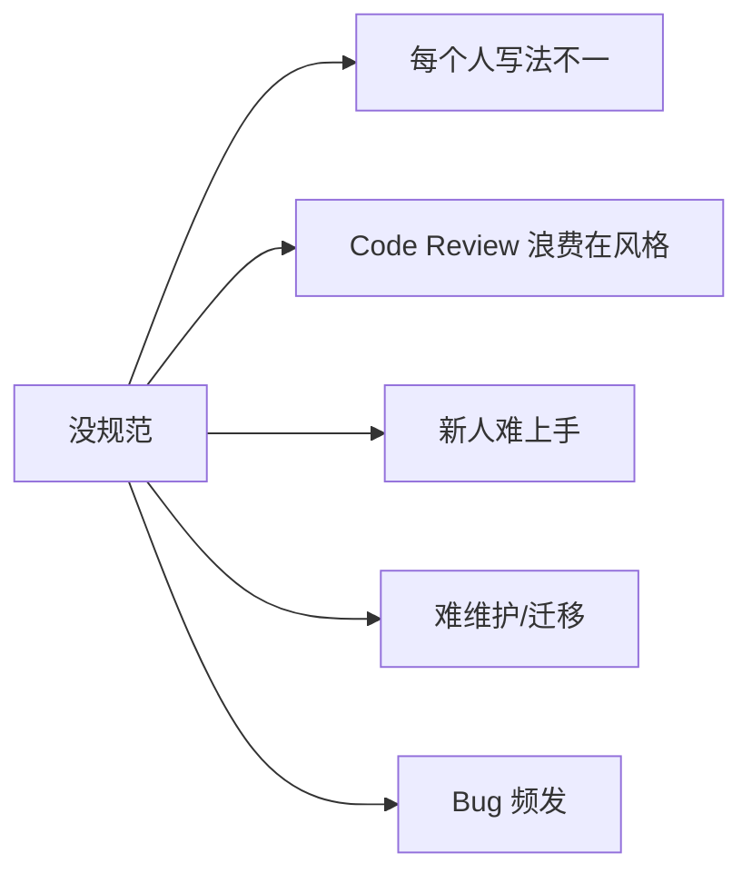
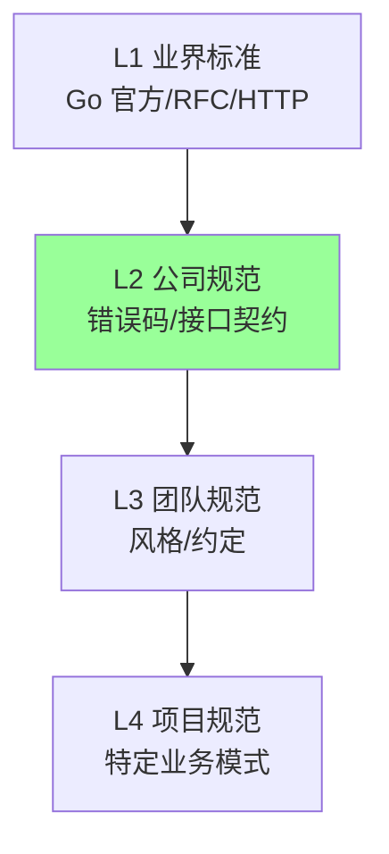
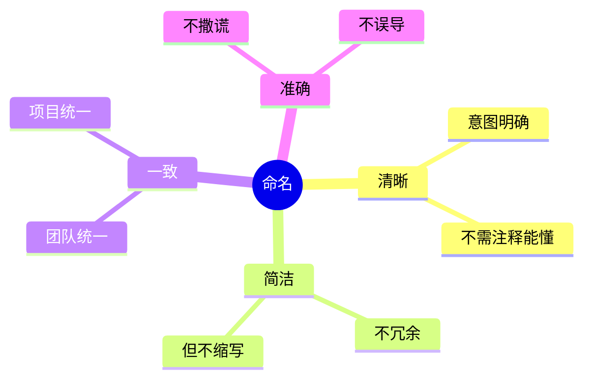
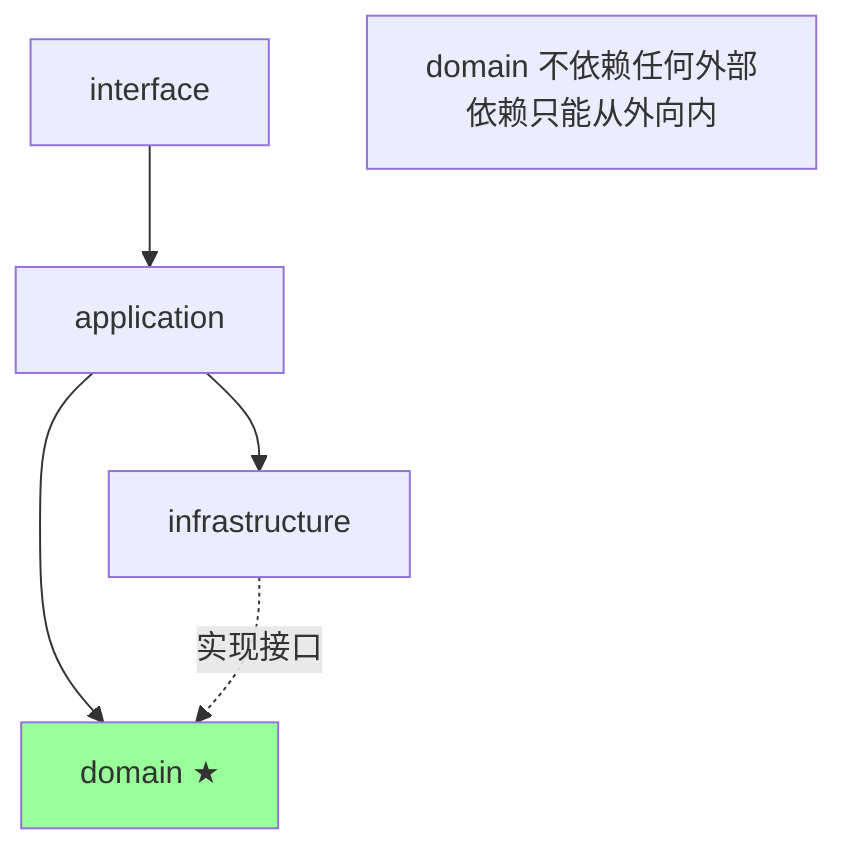
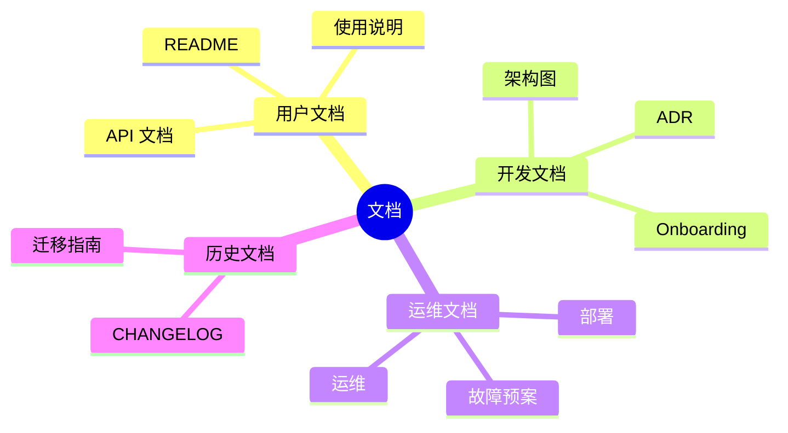

# 工程化 · 规范

> 编码规范 / 接口规范 / 错误码 / 命名 / 工程结构 / Go 实战

> 不重复 Go 语法细节，聚焦**团队级工程规范的方法论与决策**

## 一、为什么需要规范

### 1.1 没有规范的代价



### 1.2 规范的层次



**优先级**：业界标准 > 公司规范 > 团队规范 > 项目规范。

## 二、编码规范

### 2.1 总体原则

```
□ 一致性（团队同一风格）
□ 可读性（写给人看，不只给机器）
□ 简单（YAGNI / KISS）
□ 显式（不要隐藏行为）
□ 可测试
□ 高内聚低耦合
```

### 2.2 Go 编码规范要点

#### 命名

```go
// 包名: 小写、单词、不复数
package user        // ✅
package users       // ❌
package userService // ❌

// 变量: 驼峰
userID    // ✅
user_id   // ❌（Go 不用下划线）
UserID    // ✅ 公开
userId    // ✅ 但 ID 是缩略词应大写

// 常量: 驼峰（不强制大写）
const MaxRetries = 3   // ✅

// 接收者: 简短（1-2 字母）
func (s *OrderService) ...   // s 简短
func (orderService *OrderService) ...  // ❌ 太长

// 接口: 行为命名 + er
Reader / Writer / Closer    // ✅
UserManager                 // ❌（不是行为）
```

#### 常用缩略词

```
ID, URL, HTTP, API, JSON, XML, SQL, UUID

✅ userID, requestURL, httpClient, parseJSON
❌ userId, requestUrl, httpClient, parseJson
```

整个词组**全大写或全小写**：
```go
✅ URLPath、urlPath
❌ UrlPath、urlpath
```

#### 函数

```go
// ✅ 短函数（< 50 行），单一职责
func (s *OrderService) CreateOrder(ctx context.Context, req *CreateOrderRequest) (*Order, error) {
    if err := s.validate(req); err != nil {
        return nil, err
    }
    order := s.buildOrder(req)
    return order, s.repo.Save(ctx, order)
}

// ❌ 上帝函数（200 行）
func CreateOrderEverythingHere(...) { /* ... */ }
```

#### 错误处理

```go
// ✅ 立即处理，不忽略
result, err := doSomething()
if err != nil {
    return fmt.Errorf("do something: %w", err)
}

// ❌ 忽略错误
result, _ := doSomething()

// ✅ 错误包装链
errors.Is(err, ErrNotFound)
errors.As(err, &myErr)
```

#### Context

```go
// ✅ Context 第一参数
func GetUser(ctx context.Context, id string) (*User, error)

// ❌ Context 后置
func GetUser(id string, ctx context.Context) (*User, error)

// ❌ 用 context.Background() 替代传入
func GetUser(id string) (*User, error) {
    ctx := context.Background()  // 不能取消、不能透传
}
```

#### 接口设计

```go
// ✅ 小接口（< 5 方法）
type Reader interface {
    Read(p []byte) (int, error)
}

// ❌ 大接口
type UserService interface {
    Create() error
    Update() error
    Delete() error
    List() error
    GetByID() error
    GetByName() error
    GetByEmail() error
    // ... 20 个
}
```

**原则**：接受接口，返回结构体。

```go
// ✅ 接受接口
func Process(r Reader) {}

// ✅ 返回结构体
func NewClient() *Client { return &Client{...} }
```

#### 包结构

```go
// ✅ 接口定义在使用方
package order
type UserClient interface {  // order 用 user，接口在这里
    GetUser(id string) (*User, error)
}

// 实现在 user 包
package user
type Client struct{}
func (c *Client) GetUser(id string) (*User, error) { ... }
```

详见 01-go-language/05-engineering。

### 2.3 自动化工具

```yaml
# golangci-lint 配置
linters:
  enable:
    - errcheck      # 检查未处理错误
    - govet         # 标准检查
    - staticcheck   # 高级检查
    - gosec         # 安全
    - revive        # 风格
    - gofumpt       # 格式
    - goimports     # 导入排序
    - lll           # 行长度
    - dupl          # 重复代码
    - gocyclo       # 圈复杂度
```

强制 CI 接入。

## 三、接口规范

### 3.1 RESTful API 规范

#### URL 设计

```
✅ /api/v1/orders               # 资源用复数名词
✅ /api/v1/orders/{id}           # 资源标识
✅ /api/v1/orders/{id}/items     # 嵌套资源
✅ /api/v1/orders?status=paid    # 过滤用 query

❌ /api/v1/getOrder              # 不要动词
❌ /api/v1/order_list            # 不要下划线
❌ /api/v1/Orders                # URL 全小写
```

#### HTTP 方法

| 方法 | 用途 | 幂等 |
| --- | --- | --- |
| GET | 查询 | ✅ |
| POST | 创建 / 非幂等动作 | ❌ |
| PUT | 全量更新 | ✅ |
| PATCH | 部分更新 | ✅ |
| DELETE | 删除 | ✅ |

#### 状态码

```
2xx 成功
  200 OK              查询成功
  201 Created         创建成功
  204 No Content      删除成功

3xx 重定向
  301 Moved
  304 Not Modified

4xx 客户端错误
  400 Bad Request     参数错误
  401 Unauthorized    未认证
  403 Forbidden       无权限
  404 Not Found       资源不存在
  409 Conflict        状态冲突
  422 Unprocessable   业务错误
  429 Too Many        限流

5xx 服务端错误
  500 Internal        内部错误
  502 Bad Gateway     网关错误
  503 Unavailable     服务不可用
  504 Gateway Timeout
```

#### 响应格式（统一）

```json
{
  "code": 0,
  "message": "ok",
  "data": {
    "id": "123",
    "status": "paid"
  }
}
```

错误：
```json
{
  "code": 40001,
  "message": "订单不存在",
  "data": null,
  "trace_id": "abc123",
  "details": {
    "field": "order_id"
  }
}
```

### 3.2 RPC 规范

#### Protobuf 命名

```protobuf
// 包加版本号
package order.v1;

// 服务用 PascalCase
service OrderService {
  // 方法用 PascalCase
  rpc CreateOrder (CreateOrderRequest) returns (CreateOrderResponse);
}

// 消息用 PascalCase
message CreateOrderRequest {
  // 字段用 snake_case
  string customer_id = 1;
  repeated OrderItem items = 2;
}
```

#### 字段编号

```
□ 编号一旦分配不改不删
□ 删字段保留 reserved
□ 加字段用新编号
□ 1-15 编号占 1 字节（用于高频字段）
□ 16+ 占 2 字节
□ 不重用编号（兼容性灾难）
```

#### 类型选择

```
金额: int64 分（不要 float）
时间: int64 unix timestamp 或 google.protobuf.Timestamp
ID: string（雪花/UUID）/ int64
枚举: enum
```

详见 07-microservice/05-rpc-frameworks。

### 3.3 接口契约

```
□ 一接口一职责（不混合 CRUD）
□ 幂等性明确（重复调用结果一致）
□ 参数校验前置（边界返回 4xx）
□ 错误码语义清晰
□ 分页参数标准化（page + size 或 cursor）
□ 列表返回 total
□ 时间统一用 UTC
□ 金额单位统一（分）
□ 大字段可选返回（fields/include 参数）
```

## 四、错误码规范

### 4.1 错误码层次

```
错误码 = 系统码 + 模块码 + 具体码

例:
  10001  → 通用-系统错误
  20001  → 用户模块-用户不存在
  20002  → 用户模块-密码错误
  30001  → 订单模块-订单不存在
  30002  → 订单模块-订单状态异常
```

### 4.2 错误码设计原则

```
□ 业务错误码 != HTTP 状态码（4xx/5xx 还是要用）
□ 错误码内嵌业务语义
□ 错误码全公司唯一（避免重复）
□ 错误码文档化（错误码表）
□ 加 trace_id 便于排查
□ 用户可见信息和开发可见信息分开
```

### 4.3 错误码 vs 错误消息

```json
{
  "code": 40001,                          // 机器看：精确分类
  "message": "您输入的订单号不存在",      // 用户看：友好
  "trace_id": "abc",                      // 排查
  "internal_message": "Order id=xxx not found in DB", // 开发看（不返用户）
  "details": { "field": "order_id" }      // 结构化信息
}
```

### 4.4 Go 错误码实战

```go
// 定义业务错误
type BizError struct {
    Code    int
    Message string
    Cause   error
}

func (e *BizError) Error() string { return e.Message }
func (e *BizError) Unwrap() error { return e.Cause }

// 错误码常量
var (
    ErrOrderNotFound  = &BizError{Code: 30001, Message: "订单不存在"}
    ErrOrderStatusBad = &BizError{Code: 30002, Message: "订单状态异常"}
)

// 使用
if err == sql.ErrNoRows {
    return nil, ErrOrderNotFound
}

// 包装
return nil, fmt.Errorf("query order: %w", ErrOrderNotFound)

// 调用方判断
var bizErr *BizError
if errors.As(err, &bizErr) && bizErr.Code == 30001 {
    // 处理订单不存在
}
```

详见 01-go-language/01-syntax/error.md + 03-mysql/AGENTS.md。

## 五、命名规范

### 5.1 命名原则



### 5.2 经典命名问题

```go
// ❌ 含糊
data, info, item, value, temp, util, manager, processor

// ✅ 具体
order, customer, paymentInfo, productItem
```

```go
// ❌ 误导
list := map[string]Order{}  // 是 map 不是 list
isActive := 1                // 是 int 不是 bool

// ✅ 准确
orders := map[string]Order{}
orderCount := 1
isActive := true
```

```go
// ❌ 缩写（除了通用）
usr, ord, pwd, btn

// ✅ 全拼
user, order, password, button
```

### 5.3 团队术语表

通用语言（Ubiquitous Language）：业务专家、产品、开发都用同一套词汇。

```
术语表（Glossary）:
  customer (客户) ≠ user (用户)
  order (订单) ≠ purchase (购买)
  product (商品) ≠ sku (库存单元)

→ 代码命名严格对齐
```

详见 09-ddd/01-strategic-design。

### 5.4 数据库命名

```
表: snake_case 复数  → t_orders / t_users
字段: snake_case     → customer_id / created_at
索引: idx_<字段>     → idx_customer_id
唯一索引: uk_<字段>  → uk_email
外键: fk_<表>_<字段> → fk_order_customer
主键: id (BIGINT auto_increment) 或 业务主键
```

## 六、工程结构规范

### 6.1 Go 项目布局（Standard Go Project Layout）

```
project/
├── cmd/                    # 主入口
│   ├── api/main.go
│   └── worker/main.go
├── internal/               # 私有代码
│   ├── domain/             # 领域层
│   │   └── domain_order_core/
│   ├── application/        # 应用层
│   │   └── service/
│   ├── infrastructure/     # 基础设施
│   │   ├── repository/
│   │   ├── external/
│   │   └── di/
│   ├── interface/          # 接口层
│   │   ├── handler/
│   │   └── dto/
│   └── shared/             # 共享内核
├── pkg/                    # 可被其他项目导入
├── api/                    # API 定义（Proto / OpenAPI）
├── configs/                # 配置文件
├── docs/                   # 文档
├── scripts/                # 脚本
├── deployments/            # 部署相关（K8s/Docker）
├── test/                   # 集成测试
├── go.mod
├── go.sum
├── Makefile
├── README.md
└── .gitignore
```

详见 09-ddd/06-go-implementation。

### 6.2 包依赖方向



### 6.3 包命名

```
✅ 短、小写、单数、有意义
package order
package user
package payment

❌ 不规范
package orderManagement   # 太长
package Orders            # 大写
package utils             # 万能袋
package common            # 万能袋
```

### 6.4 internal 目录

```go
// internal 下的包只能被本项目导入
project/internal/order/   // 项目内可以
other-project/...         // 不能 import 上面的 internal

→ 强制封装
```

### 6.5 文件组织

```
✅ 按功能分文件
order/
  ├── entity.go       # 实体
  ├── repository.go   # 仓储接口
  ├── service.go      # 领域服务
  └── service_test.go # 测试

❌ 按类型分
order/
  ├── interfaces.go   # 所有接口
  ├── structs.go      # 所有 struct
  └── functions.go    # 所有函数
```

## 七、Git 规范

### 7.1 分支策略

```
GitFlow:
  main         # 稳定生产
  develop      # 开发主干
  feature/*    # 功能分支
  release/*    # 发布分支
  hotfix/*     # 紧急修复

GitHub Flow（简化）:
  main         # 唯一长期分支
  feature/*    # 短期，PR 合并即删
```

**实战**：互联网业务多用 GitHub Flow（快速迭代），传统行业用 GitFlow（严格发布）。

### 7.2 Commit 规范（Conventional Commits）

```
<type>(<scope>): <subject>

<body>

<footer>
```

**type**：
```
feat:     新功能
fix:      Bug 修复
docs:     文档
style:    格式（不影响代码运行）
refactor: 重构
perf:     性能
test:     测试
chore:    构建/工具
```

**示例**：
```
feat(order): 添加订单取消功能

实现取消订单的 API 接口，支持已创建/已支付状态的订单取消。
取消时同步释放库存。

Closes #123
```

### 7.3 PR/MR 规范

```
□ 标题清晰（同 commit 规范）
□ 描述完整（背景/方案/影响/测试）
□ 关联 Issue
□ 自我 Review
□ CI 绿
□ 至少 1 个 reviewer
□ 删除合并后的分支
```

## 八、文档规范

### 8.1 文档分类



### 8.2 README 模板

```markdown
# 项目名

简介（1-2 句话）

## 功能

- xxx
- xxx

## 快速开始

\`\`\`bash
git clone ...
make run
\`\`\`

## 架构

[架构图]

## 文档

- [API 文档](docs/api.md)
- [开发指南](docs/dev.md)
- [部署指南](docs/deploy.md)

## 联系

- 责任人: xxx
- 邮件: xxx@xxx
```

### 8.3 ADR（架构决策记录）

详见 08-architecture/06-decision-tradeoff。

每个重要决策一个 ADR：
- 背景
- 选项
- 决定
- 取舍
- 时间

## 九、ddd_order_example 规范实战

### 9.1 命名一致性

```go
// 包: domain_<bc>_core
domain/domain_order_core/
domain/domain_payment_core/
domain/domain_product_core/

// 类型: <Name>DO （Domain Object）
OrderDO, OrderItemDO, PaymentDO

// 服务: <Name>Service / <Name>DomainService
OrderService (application)
OrderDomainService (domain)

// Repository: <Name>Repository
OrderRepository (interface)
OrderRepositoryMySQL (impl)
```

### 9.2 错误码

```go
// internal/shared/errcode/codes.go
var (
    // 订单错误 30xxx
    ErrOrderNotFound     = NewBizError(30001, "订单不存在")
    ErrOrderStatusBad    = NewBizError(30002, "订单状态异常")
    ErrOrderItemEmpty    = NewBizError(30003, "订单商品不能为空")

    // 支付错误 40xxx
    ErrPaymentNotFound   = NewBizError(40001, "支付单不存在")
    ErrPaymentDuplicate  = NewBizError(40002, "支付重复")
)
```

### 9.3 接口契约

```protobuf
// api/order/v1/order.proto
syntax = "proto3";
package order.v1;
option go_package = "github.com/.../api/order/v1;orderv1";

service OrderService {
  rpc CreateOrder(CreateOrderRequest) returns (CreateOrderResponse);
}

message CreateOrderRequest {
  string customer_id = 1;
  repeated OrderItem items = 2;
}
```

## 十、典型反模式

### 反模式 1：万能 utils

```
package utils
  func DoSomething()
  func ParseDate()
  func CalculateTax()
  func SendEmail()
  ...
```

**修复**：按职责拆包（dateutil / taxutil / email）。

### 反模式 2：包之间循环依赖

```
order → payment → order
```

**修复**：抽出共享接口到第三个包，或事件解耦。

### 反模式 3：错误码重复

```
A 团队: 30001 = 订单不存在
B 团队: 30001 = 用户不存在
```

**修复**：全公司唯一错误码表 + 段管理。

### 反模式 4：接口和实现混一个包

```
package user
  type User interface {...}
  type userImpl struct {...}
```

**修复**：接口在使用方定义，实现独立包。

### 反模式 5：MagicNumber

```go
if status == 5 { ... }  // 5 是什么？
```

**修复**：常量化。
```go
const StatusPaid = 5
if status == StatusPaid { ... }
```

### 反模式 6：长函数

```go
func processOrder() {
    // 200 行
}
```

**修复**：拆短函数，每个 < 50 行。

### 反模式 7：commit 信息草率

```
"fix"
"update"
"123"
```

**修复**：Conventional Commits 规范。

### 反模式 8：忽略规范

```
"我们团队这样写没问题"
```

**修复**：自动化（linter）+ Code Review 双保险。

## 十一、面试高频题

**Q1：为什么需要规范？**

- 团队一致性
- Code Review 不浪费在风格
- 新人快速上手
- 易维护
- 减少 bug

ROI 极高。

**Q2：Go 的命名规范？**

- 包：小写、单数、有意义
- 变量：驼峰
- 缩略词全大写或全小写（URL/userID）
- 接收者：1-2 字母简短
- 接口：行为 + er
- 不用下划线

**Q3：错误码怎么设计？**

- 全公司唯一
- 分段（系统/模块/具体）
- 文档化
- 内嵌业务语义
- 区分用户可见/开发可见
- 带 trace_id

**Q4：RESTful API 设计要点？**

- 资源用复数名词
- 不用动词
- HTTP 方法语义
- 状态码语义
- 统一响应格式
- 分页/过滤标准化

**Q5：Protobuf 兼容性？**

- 字段编号一旦分配不改不删
- 删字段 reserved
- 加字段新编号
- 不重用编号
- 加版本号（v1/v2）

**Q6：接口在哪定义？**

**接受接口，返回结构体**。

接口在使用方定义（依赖反转），实现在独立包。

**Q7：Go 项目结构推荐？**

```
cmd/        # 入口
internal/   # 私有代码
pkg/        # 可导出
api/        # IDL 定义
configs/    # 配置
deployments/ # K8s/Docker
```

internal 强制封装。

**Q8：Commit 规范？**

Conventional Commits：`<type>(<scope>): <subject>`

type：feat / fix / docs / refactor / perf / test / chore。

**Q9：怎么避免万能 utils 包？**

按职责拆：dateutil / strutil / cryptoutil。

不允许 utils / common 这种万能袋。

**Q10：怎么强制规范执行？**

- 自动化（linter / formatter / git hooks）
- CI 集成（不通过不能合）
- Code Review
- 文档 + 培训

只靠人不靠自动化必失效。

## 十二、面试加分点

- 规范层次：**业界 > 公司 > 团队 > 项目**
- **自动化优先**（linter / formatter / CI）
- **强制 + Code Review** 双保险
- Go：**接受接口返回结构体** / 接口小（< 5 方法）/ 接口在使用方
- **错误码全公司唯一**，分段管理
- **接口契约**：URL/方法/状态码/响应格式 标准化
- **Protobuf 只加不删不改**（铁律）
- **包按职责拆**，不要万能 utils
- **依赖方向单向**（domain 不依赖 infra）
- **internal 强制封装**
- **Conventional Commits** 让 history 可读
- 大厂规范都建立在**业界标准 + 自动化 + 强制执行**之上
