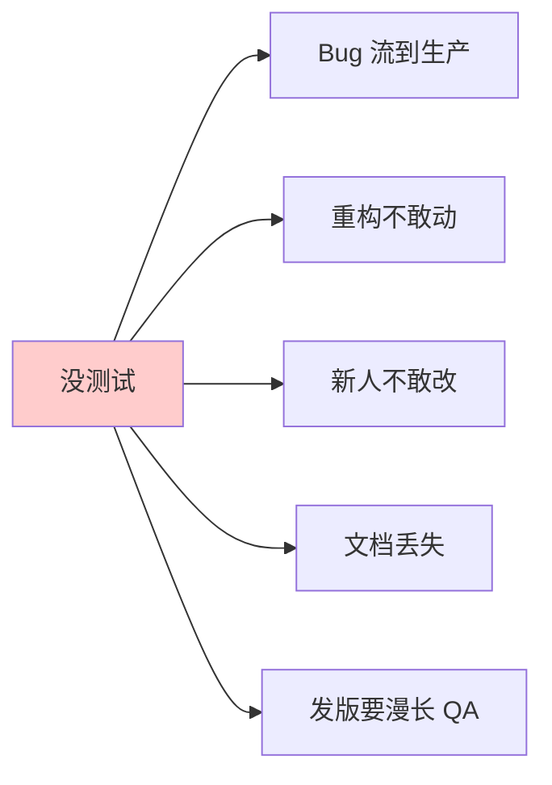
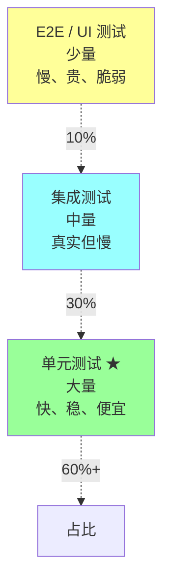
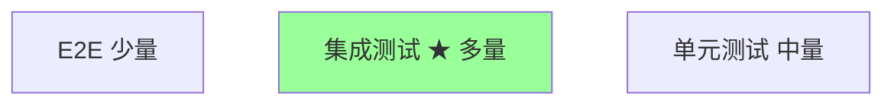
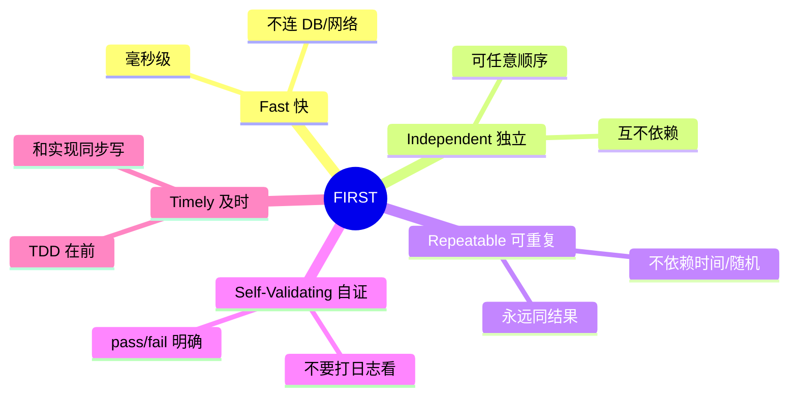
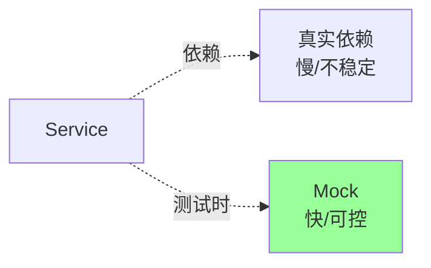
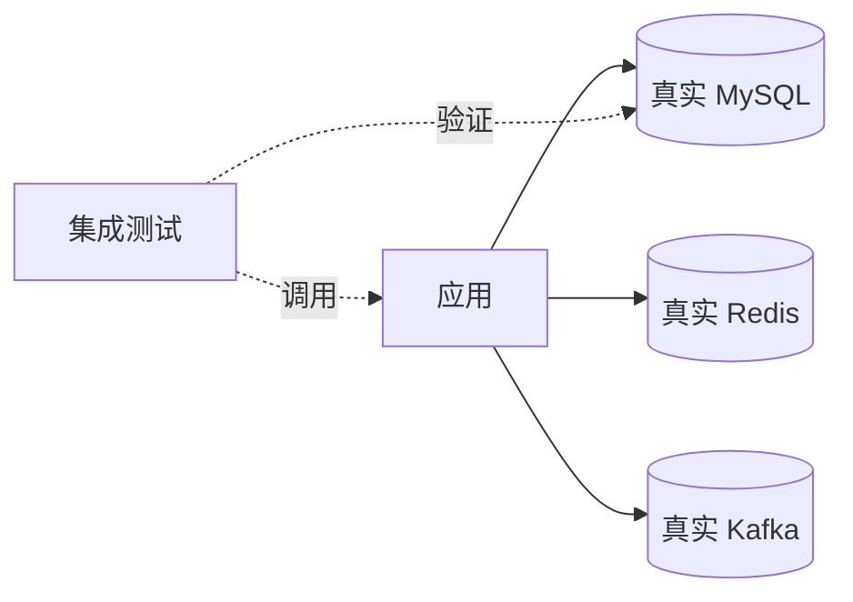
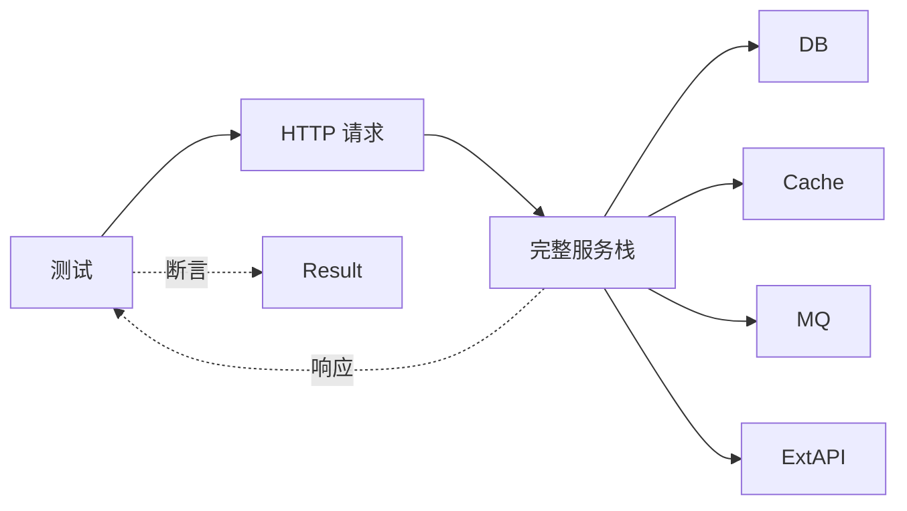
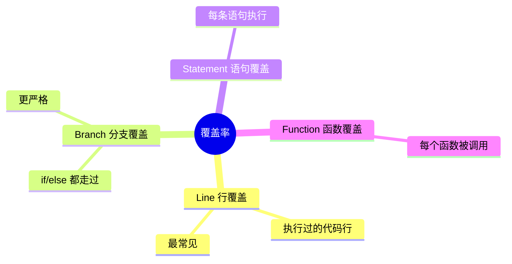
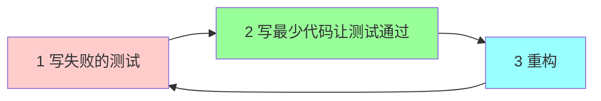

# 工程化 · 测试策略

> 测试金字塔 / 单元 / 集成 / E2E / Mock / Table-Driven / 覆盖率 / Go 实战

> 不重复 Go testing 包细节，聚焦**测试方法论 + 团队级策略**

## 一、为什么测试如此重要

### 1.1 没测试的代价



### 1.2 测试的真正价值

```
✅ 找 bug（最直观）
✅ 设计反馈（不好测的代码 = 设计不好）
✅ 重构信心（敢动）
✅ 活文档（看测试懂用法）
✅ 防退化
✅ 加速开发（短期慢，长期快）
```

### 1.3 测试不是奢侈品

```
"我们时间紧，先不写测试"
↓
"代码动了不敢上线"
↓
"出 bug 了找不到原因"
↓
"重构不敢做"
↓
"代码烂死了"
```

**短期省时间 = 长期还债**。

## 二、测试金字塔

### 2.1 经典三层



| 层级 | 占比 | 速度 | 代价 |
| --- | --- | --- | --- |
| 单元测试 | 60-70% | 毫秒 | 低 |
| 集成测试 | 20-30% | 秒 | 中 |
| E2E 测试 | 5-10% | 分钟 | 高 |

### 2.2 倒金字塔（反模式）

```
大量 E2E + 少量单元 → 慢、脆、维护爆炸
```

**修复**：转金字塔形态，把测试推到底层。

### 2.3 现代变体：钻石型



适合微服务（集成测试是核心）。

## 三、单元测试

### 3.1 单元测试是什么

> **测试一个最小单元（函数/方法）的行为，外部依赖用 mock**

```go
// 被测��象
func Add(a, b int) int { return a + b }

// 单元测试
func TestAdd(t *testing.T) {
    if got := Add(2, 3); got != 5 {
        t.Errorf("Add(2,3) = %d, want 5", got)
    }
}
```

### 3.2 写好单测的 FIRST 原则



### 3.3 测试结构（AAA）

```go
func TestCreateOrder_Success(t *testing.T) {
    // Arrange 准备
    repo := mocks.NewMockOrderRepository(ctrl)
    repo.EXPECT().Save(gomock.Any(), gomock.Any()).Return(nil)
    svc := NewOrderService(repo)
    items := []Item{{...}}

    // Act 执行
    orderID, err := svc.CreateOrder(ctx, "cust_1", items)

    // Assert 断言
    assert.NoError(t, err)
    assert.NotEmpty(t, orderID)
}
```

**AAA**：Arrange / Act / Assert。

### 3.4 命名规范

```go
// ✅ 表达清楚：场景_条件_预期
TestCreateOrder_Success
TestCreateOrder_InvalidItems_ReturnsError
TestCreateOrder_DBError_ReturnsError
TestPayOrder_AlreadyPaid_ReturnsError

// ❌ 太泛
TestOrder1
TestCreate
TestService
```

### 3.5 Table-Driven Tests（Go 标志性）

```go
func TestValidate(t *testing.T) {
    tests := []struct {
        name    string
        input   *Order
        wantErr bool
    }{
        {"valid", &Order{CustomerID: "1", Items: []Item{{...}}}, false},
        {"empty customer", &Order{CustomerID: "", Items: []Item{...}}, true},
        {"empty items", &Order{CustomerID: "1", Items: []Item{}}, true},
        {"nil order", nil, true},
    }
    for _, tt := range tests {
        t.Run(tt.name, func(t *testing.T) {
            err := tt.input.Validate()
            if (err != nil) != tt.wantErr {
                t.Errorf("Validate() error = %v, wantErr %v", err, tt.wantErr)
            }
        })
    }
}
```

**优点**：
- 一次定义多个场景
- 易扩展
- 可读性好
- 失败时定位精确（`go test -run TestValidate/valid`）

### 3.6 子测试

```go
t.Run("subtest name", func(t *testing.T) {
    // ...
})
```

支持：
- 独立运行
- 并行 `t.Parallel()`
- 跳过 `t.Skip()`

## 四、Mock 与依赖注入

### 4.1 为什么要 Mock

单测要快、独立、稳定 → 不能连真实 DB / 网络。



### 4.2 Go Mock 工具

| 工具 | 特点 |
| --- | --- |
| **gomock** | 官方推荐，需要接口 |
| **testify/mock** | 简单灵活 |
| **mockery** | gomock 的工具替代 |
| **mockgen** | 配合 gomock 生成 |

### 4.3 gomock 实战

```bash
# 1. 给接口生成 mock
mockgen -source=domain/order/repository.go -destination=mocks/order_repository_mock.go
```

```go
// 2. 在测试中用
func TestCreateOrder(t *testing.T) {
    ctrl := gomock.NewController(t)
    defer ctrl.Finish()

    mockRepo := mocks.NewMockOrderRepository(ctrl)
    mockRepo.EXPECT().
        Save(gomock.Any(), gomock.Any()).
        Return(nil).
        Times(1)

    svc := NewOrderService(mockRepo)
    _, err := svc.CreateOrder(ctx, "cust_1", []Item{{...}})
    assert.NoError(t, err)
}
```

详见 09-ddd/06-go-implementation。

### 4.4 Mock 最佳实践

```
□ 只 Mock 直接依赖
□ Mock 接口而非具体类型
□ 不要过度 Mock（Mock 链太深 = 设计有问题）
□ Mock 行为而非数据
□ 不要 Mock 你拥有的简单类型（直接构造对象）
□ 一个测试一种行为（避免 mock 太复杂）
```

### 4.5 Mock vs Stub vs Fake

```
Mock:  断言调用方式（called 1 time, with args ...）
Stub:  返回固定值（不关心调用）
Fake:  内存实现真实行为（如 InMemoryDB）
Spy:   记录调用 + 调用真实方法
```

**实战**：单测 Mock 居多，Fake 适合写 InMemoryRepo 替代真实 DB。

### 4.6 InMemoryFake 模式

```go
// 写一个内存版 Repository 替代 mock
type InMemoryOrderRepo struct {
    orders map[string]*Order
    mu     sync.Mutex
}

func (r *InMemoryOrderRepo) Save(ctx context.Context, o *Order) error {
    r.mu.Lock()
    defer r.mu.Unlock()
    r.orders[o.ID] = o
    return nil
}

func (r *InMemoryOrderRepo) FindByID(ctx context.Context, id string) (*Order, error) {
    r.mu.Lock()
    defer r.mu.Unlock()
    if o, ok := r.orders[id]; ok {
        return o, nil
    }
    return nil, ErrNotFound
}

// 测试用
func TestService(t *testing.T) {
    repo := &InMemoryOrderRepo{orders: map[string]*Order{}}
    svc := NewOrderService(repo)
    // ... 真实组合调用
}
```

**优点**：组合多层组件，比纯 Mock 更接近真实场景。

## 五、集成测试

### 5.1 什么是集成测试

> **测试多个组件协作**（应用 + DB / 应用 + 外部服务）



### 5.2 集成测试 vs 单元测试

| | 单元测试 | 集成测试 |
| --- | --- | --- |
| 测试对象 | 单个函数 | 多组件协作 |
| 依赖 | Mock | 真实 |
| 速度 | 毫秒 | 秒 |
| 稳定性 | 高 | 中（真实依赖） |
| 覆盖范围 | 内部逻辑 | 边界 / 集成 |

### 5.3 测试容器（Testcontainers）

```go
import "github.com/testcontainers/testcontainers-go"

func TestOrderRepo(t *testing.T) {
    ctx := context.Background()

    // 启动 MySQL 容器
    req := testcontainers.ContainerRequest{
        Image:        "mysql:8.0",
        ExposedPorts: []string{"3306/tcp"},
        Env: map[string]string{
            "MYSQL_ROOT_PASSWORD": "test",
            "MYSQL_DATABASE":      "test",
        },
        WaitingFor: wait.ForListeningPort("3306/tcp"),
    }
    container, _ := testcontainers.GenericContainer(ctx, testcontainers.GenericContainerRequest{
        ContainerRequest: req,
        Started:          true,
    })
    defer container.Terminate(ctx)

    // 连真实 DB
    host, _ := container.Host(ctx)
    port, _ := container.MappedPort(ctx, "3306")
    db, _ := sql.Open("mysql", fmt.Sprintf("root:test@tcp(%s:%s)/test", host, port.Port()))

    // 跑迁移
    runMigrations(db)

    // 真实测试
    repo := NewOrderRepo(db)
    err := repo.Save(ctx, &Order{...})
    assert.NoError(t, err)
}
```

**优点**：
- 真实数据库行为
- 测试和 CI 一致
- 容器启停自动

**代价**：
- 慢（启动几秒）
- 需要 Docker

### 5.4 集成测试的范围

```
□ Repository（DB 操作）
□ 外部 API 调用（mock 服务器）
□ 消息队列发送/消费
□ 缓存交互
□ 配置加载
□ 启动/停止流程
```

### 5.5 测试数据隔离

```go
// 每个测试独立 schema 或事务回滚
func TestSomething(t *testing.T) {
    tx, _ := db.Begin()
    defer tx.Rollback()

    // 用 tx 跑测试
    repo := NewRepoWithTx(tx)
    // ...
}
```

或者：
- 每个测试用唯一前缀（`t_orders_test_xxx`）
- 测试后清理
- 用容器，每次 fresh

## 六、E2E / 端到端测试

### 6.1 E2E 测试范围



**模拟真实用户**调用整个系统。

### 6.2 E2E 工具

| 类型 | 工具 |
| --- | --- |
| HTTP API | Postman / curl / Go 直接发 |
| Web UI | Selenium / Playwright / Cypress |
| Mobile | Appium / XCUITest |
| 性能 | JMeter / k6 / Locust |
| BDD | Cucumber / Gauge |

### 6.3 E2E 的挑战

```
□ 慢（启动整个系统）
□ 脆（任一组件挂全失败）
□ 调试难（链路长）
□ 维护成本高
```

**最佳实践**：
- 只覆盖**关键用户路径**（下单/支付/登录）
- 不依赖时间/顺序
- 失败可重试
- 独立运行环境（不依赖生产）

### 6.4 Smoke Test

```
最小集 E2E:
  - 服务能启动
  - 关键 API 200
  - DB 能连
  - 能登录
  - 能下单（基本流程）

部署后立即跑，10-30 秒，发现严重故障
```

## 七、覆盖率

### 7.1 覆盖率类型



### 7.2 Go 覆盖率

```bash
# 跑测试 + 生成覆盖率
go test ./... -coverprofile=coverage.out

# 生成报告
go tool cover -html=coverage.out -o coverage.html

# 命令行查看
go tool cover -func=coverage.out
```

### 7.3 合理的覆盖率目标

```
60% - 基础（核心功能覆盖）
70-80% - 良好（推荐）
90%+ - 优秀（核心服务）
100% - 反模式（追求测试覆盖率本身）
```

**警告**：
- **覆盖率不等于测试质量**（覆盖了但断言不严无意义）
- **追求 100% 是反模式**（最后 5% 成本极高且收益低）
- **关键路径必须 90%+**

### 7.4 哪些不需要测

```
□ 自动生成的代码（pb.go / mock）
□ 简单 getter/setter
□ main.go（用集成测试覆盖）
□ 第三方库的 thin wrapper
```

### 7.5 测试覆盖率门禁

```yaml
# CI 强制
- if [ $(go tool cover -func=coverage.out | grep total | awk '{print $3}' | tr -d '%') < 70 ]
  then exit 1
  fi
```

避免新代码下降覆盖率。

## 八、TDD（测试驱动开发）

### 8.1 三步骤



### 8.2 TDD 优劣

```
✅ 强迫好的设计（不好测 = 不好设计）
✅ 测试覆盖天然完整
✅ 重构有信心
✅ 文档化用法

❌ 学习曲线陡
❌ 短期慢
❌ 不适合探索性开发
```

**实战**：核心算法 / 关键业务逻辑用 TDD；UI / 集成不强求。

## 九、性能测试

### 9.1 Benchmark

```go
func BenchmarkAdd(b *testing.B) {
    for i := 0; i < b.N; i++ {
        Add(1, 2)
    }
}

// 跑:
// go test -bench=. -benchmem
```

输出：
```
BenchmarkAdd-8    1000000000    0.5 ns/op    0 B/op    0 allocs/op
```

### 9.2 压测工具

| 工具 | 适合 |
| --- | --- |
| wrk / wrk2 | HTTP |
| ghz | gRPC |
| JMeter | 综合 |
| k6 | 现代 |
| go-stress-testing | 简单 Go |

详见 08-architecture/05-capacity-planning。

## 十、Fuzz 测试

```go
func FuzzParse(f *testing.F) {
    f.Add("hello")
    f.Fuzz(func(t *testing.T, input string) {
        result, err := Parse(input)
        if err == nil && result == "" {
            t.Errorf("got empty result for %q", input)
        }
    })
}

// 跑:
// go test -fuzz=FuzzParse
```

**优点**：自动生成边界 / 异常输入，找出意想不到的 bug。

**适合**：解析器、校验函数、协议处理。

Go 1.18+ 内置。

## 十一、ddd_order_example 测试实战

### 11.1 单元测试（应用层）

```go
// internal/application/service/order_service_test.go
func TestOrderService_CreateOrder_Success(t *testing.T) {
    ctrl := gomock.NewController(t)
    defer ctrl.Finish()

    mockOrderRepo := mocks.NewMockOrderRepository(ctrl)
    mockProductService := mocks.NewMockProductService(ctrl)

    paymentDomainService := domain_payment_core.NewPaymentDomainService(mockPaymentRepo)
    paymentService := NewPaymentService(paymentDomainService, mockPaymentProxy)
    orderDomainService := domain_order_core.NewOrderDomainService(mockOrderRepo)
    service := NewOrderService(orderDomainService, paymentService, mockProductService)

    mockProductService.EXPECT().ValidateProduct(gomock.Any(), gomock.Any()).
        Return(&ValidateProductResponse{IsValid: true, Product: &Product{...}}, nil)
    mockOrderRepo.EXPECT().Save(gomock.Any(), gomock.Any()).Return(nil)

    orderID, err := service.CreateOrder(ctx, "cust_123", items)
    assert.NoError(t, err)
    assert.NotEmpty(t, orderID)
}
```

### 11.2 单元测试（领域层）

```go
// internal/domain/domain_order_core/entity_test.go
func TestOrder_Cancel(t *testing.T) {
    tests := []struct {
        name    string
        status  OrderStatus
        wantErr bool
    }{
        {"created can cancel", OrderStatusCreated, false},
        {"paid can cancel", OrderStatusPaid, false},
        {"shipped cannot", OrderStatusShipped, true},
        {"cancelled cannot", OrderStatusCancelled, true},
    }
    for _, tt := range tests {
        t.Run(tt.name, func(t *testing.T) {
            o := &OrderDO{Status: tt.status}
            err := o.Cancel()
            if (err != nil) != tt.wantErr {
                t.Errorf("Cancel() error = %v, wantErr %v", err, tt.wantErr)
            }
            if !tt.wantErr {
                assert.Equal(t, OrderStatusCancelled, o.Status)
            }
        })
    }
}
```

### 11.3 集成测试（仓储层）

```go
func TestOrderRepository_Save_Integration(t *testing.T) {
    if testing.Short() { t.Skip() }

    db := setupTestDB(t)  // 用 testcontainers
    defer cleanupDB(t, db)

    repo := NewOrderRepository(db)
    o := &OrderDO{ID: "test_1", CustomerID: "cust_1", Items: []OrderItemDO{...}}

    err := repo.Save(ctx, o)
    assert.NoError(t, err)

    found, err := repo.FindByID(ctx, "test_1")
    assert.NoError(t, err)
    assert.Equal(t, o.ID, found.ID)
}
```

### 11.4 测试覆盖

```
单元测试:
  domain: > 95%（核心业务规则）
  application: > 80%（用例编排）

集成测试:
  infrastructure/repository: 真实 DB 关键路径
  external API: mock server

E2E:
  HTTP API：下单 → 查询 → 支付 → 取消 全流程

性能:
  Benchmark 关键算法（如金额计算）
```

## 十二、典型反模式

### 反模式 1：测试连真实数据库

```
单测连 MySQL → 慢 + 不稳定 + 数据污染
```

**修复**：
- 单元测试 mock
- 集成测试用 testcontainers

### 反模式 2：测试依赖时间/随机

```go
// ❌
func TestNow(t *testing.T) {
    t1 := time.Now()
    // ...
    t2 := time.Now()
    assert.Equal(t, t1, t2)  // 偶发失败
}

// ✅ 时钟抽象
type Clock interface { Now() time.Time }
```

### 反模式 3：测试顺序依赖

```go
// ❌ 测试 1 创建数据，测试 2 用
func TestCreate(t *testing.T) { ... }
func TestRead(t *testing.T)   { /* 依赖 TestCreate */ }
```

**修复**：每个测试独立 setup。

### 反模式 4：Mock 链太深

```go
mockA.EXPECT().B().Return(mockB)
mockB.EXPECT().C().Return(mockC)
mockC.EXPECT().D().Return(...)
// 5 层 mock 嵌套
```

**修复**：
- 层级太深 = 设计有问题（Law of Demeter）
- 用 Fake 替代部分

### 反模式 5：追求 100% 覆盖率

```
为了覆盖率写无意义测试 → 测试本身没价值
```

**修复**：覆盖关键路径 + 高质量断言。

### 反模式 6：测试代码不当代码维护

```
测试写得乱 → 改业务时测试不跟着改 → 测试腐烂
```

**修复**：
- 测试也要 Code Review
- 测试用辅助函数减少重复
- 重构测试和重构代码同步

### 反模式 7：忽略偶发失败

```
"哦这个测试偶尔失败"→ 重试通过 → 真问题被掩盖
```

**修复**：
- 偶发失败必须修
- 找出根因（时序 / 资源 / 数据）

### 反模式 8：测试和实现耦合过深

```
测试用反射读私有字段 → 改实现就坏
```

**修复**：测试行为，不测实现。

## 十三、面试高频题

**Q1：测试金字塔是什么？**

```
E2E 5-10%
集成 20-30%
单元 60-70%
```

底层稳定快便宜，顶层慢贵脆。

倒金字塔（大量 E2E）是反模式。

**Q2：FIRST 原则？**

Fast / Independent / Repeatable / Self-Validating / Timely。

**Q3：单元测试 vs 集成测试？**

| | 单元 | 集成 |
| --- | --- | --- |
| 对象 | 单函数 | 多组件 |
| 依赖 | Mock | 真实 |
| 速度 | 毫秒 | 秒 |
| 适合 | 内部逻辑 | 边界 |

**Q4：Mock vs Stub vs Fake？**

- Mock：断言调用方式
- Stub：返回固定值
- Fake：内存简化实现
- Spy：记录调用 + 真实

**Q5：Table-Driven Tests 优势？**

- 一次定义多场景
- 易扩展
- 失败定位精确
- Go 标志性写法

**Q6：覆盖率多少合理？**

- 60% 基础
- 70-80% 良好（推荐）
- 90%+ 核心服务
- 100% 反模式

覆盖率不等于测试质量。

**Q7：怎么测连 DB 的代码？**

- 单元测试：Mock Repository
- 集成测试：Testcontainers 真实 MySQL
- 事务回滚 / 独立 schema 隔离

**Q8：TDD 怎么做？**

Red → Green → Refactor 循环：
1. 先写失败测试
2. 写最少代码通过
3. 重构

适合核心算法 / 关键业务。

**Q9：偶发失败的测试怎么处理？**

必须修。常见原因：
- 时序依赖
- 资源竞争
- 数据残留
- 顺序依赖

**Q10：什么不该测？**

- 自动生成代码
- 简单 getter/setter
- 第三方库
- main.go（用集成）

不要为覆盖率而测。

## 十四、面试加分点

- 测试金字塔：**单元多 / 集成中 / E2E 少**
- **FIRST 原则**：Fast/Independent/Repeatable/Self-Validating/Timely
- **AAA 结构**：Arrange/Act/Assert
- **Table-Driven** 是 Go 标志性测试写法
- **Mock 接口而非具体类型**，强迫 DI
- **Testcontainers** 让集成测试真实可重复
- **覆盖率不是目标**，关键路径质量 > 数字
- **TDD 适合核心算法**，不强求所有代码
- **偶发失败必须修**，不要重试掩盖
- **Fuzz 测试**找意想不到的边界 bug（Go 1.18+）
- **测试代码也要维护**，Code Review + 重构
- 测试 = **设计反馈 + 重构信心 + 活文档**
