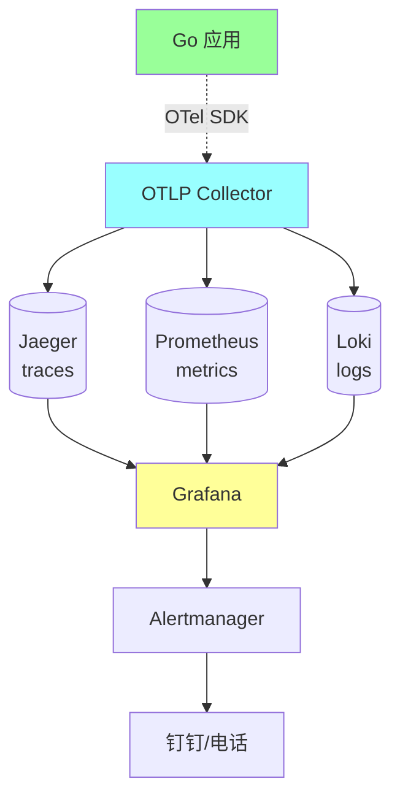

# 工程化 · 可观测性接入

> Go 项目从零接入 OpenTelemetry / Prometheus / Loki 全套 / 完整代码 / 配置 / 部署清单

> 原理见 07-microservice/07；本篇聚焦**实战接入步骤**

## 一、目标架构

### 1.1 完整可观测栈



### 1.2 接入清单

```
□ OpenTelemetry SDK（traces + metrics）
□ Prometheus client（业务指标）
□ Zap 结构化日志 + trace_id
□ HTTP/gRPC 中间件（自动埋点）
□ DB / Redis / MQ 客户端 instrumentation
□ Health/Ready 探针
□ pprof endpoint
□ 关键业务 metric
□ 告警规则
□ 大盘
```

## 二、Step 1：项目结构

### 2.1 Observability 包

```
internal/
└── infrastructure/
    └── observability/
        ├── tracer.go      # OTel tracer 初始化
        ├── meter.go       # OTel meter 初始化
        ├── logger.go      # Zap + trace_id
        ├── metrics.go     # 业务 metric 定义
        ├── http.go        # HTTP 中间件
        ├── grpc.go        # gRPC 拦截器
        └── shutdown.go    # 优雅关闭
```

### 2.2 依赖

```go
// go.mod
require (
    go.opentelemetry.io/otel v1.25.0
    go.opentelemetry.io/otel/sdk v1.25.0
    go.opentelemetry.io/otel/exporters/otlp/otlptrace/otlptracegrpc v1.25.0
    go.opentelemetry.io/otel/exporters/otlp/otlpmetric/otlpmetricgrpc v1.25.0
    go.opentelemetry.io/contrib/instrumentation/net/http/otelhttp v0.50.0
    go.opentelemetry.io/contrib/instrumentation/google.golang.org/grpc/otelgrpc v0.50.0
    github.com/prometheus/client_golang v1.19.0
    go.uber.org/zap v1.27.0
)
```

## 三、Step 2：Tracer 接入

### 3.1 初始化 Tracer

```go
// internal/infrastructure/observability/tracer.go
package observability

import (
    "context"
    "os"

    "go.opentelemetry.io/otel"
    "go.opentelemetry.io/otel/exporters/otlp/otlptrace/otlptracegrpc"
    "go.opentelemetry.io/otel/propagation"
    "go.opentelemetry.io/otel/sdk/resource"
    sdktrace "go.opentelemetry.io/otel/sdk/trace"
    semconv "go.opentelemetry.io/otel/semconv/v1.25.0"
)

func InitTracer(ctx context.Context, serviceName, otlpEndpoint string) (*sdktrace.TracerProvider, error) {
    // 1. 创建 OTLP exporter（推送到 Collector）
    exporter, err := otlptracegrpc.New(ctx,
        otlptracegrpc.WithEndpoint(otlpEndpoint),
        otlptracegrpc.WithInsecure(),
    )
    if err != nil {
        return nil, err
    }

    // 2. 资源信息（服务名、环境、版本）
    res, _ := resource.New(ctx,
        resource.WithAttributes(
            semconv.ServiceName(serviceName),
            semconv.ServiceVersion(os.Getenv("APP_VERSION")),
            semconv.DeploymentEnvironment(os.Getenv("APP_ENV")),
        ),
    )

    // 3. TracerProvider（带采样 + 批量导出）
    tp := sdktrace.NewTracerProvider(
        sdktrace.WithResource(res),
        sdktrace.WithBatcher(exporter),
        sdktrace.WithSampler(sdktrace.ParentBased(
            sdktrace.TraceIDRatioBased(0.1), // 10% 采样
        )),
    )

    // 4. 全局注册
    otel.SetTracerProvider(tp)
    otel.SetTextMapPropagator(propagation.NewCompositeTextMapPropagator(
        propagation.TraceContext{},
        propagation.Baggage{},
    ))

    return tp, nil
}
```

### 3.2 业务代码使用

```go
// internal/application/service/order_service.go
import "go.opentelemetry.io/otel"

var tracer = otel.Tracer("order-service")

func (s *OrderService) CreateOrder(ctx context.Context, customerID string, items []*OrderItemDO) (string, error) {
    ctx, span := tracer.Start(ctx, "OrderService.CreateOrder")
    defer span.End()

    span.SetAttributes(
        attribute.String("customer_id", customerID),
        attribute.Int("item_count", len(items)),
    )

    // 业务逻辑
    if err := validate(items); err != nil {
        span.RecordError(err)
        span.SetStatus(codes.Error, err.Error())
        return "", err
    }

    // 调下游会自动透传 trace_id
    if err := s.paymentService.CreatePayment(ctx, ...); err != nil {
        span.RecordError(err)
        return "", err
    }

    return orderID, nil
}
```

### 3.3 main 集成

```go
// cmd/api/main.go
func main() {
    ctx := context.Background()

    tp, err := observability.InitTracer(ctx, "order-service", "otel-collector:4317")
    if err != nil {
        log.Fatal(err)
    }
    defer tp.Shutdown(ctx)

    // ... 启动服务
}
```

## 四、Step 3：Metrics 接入

### 4.1 Prometheus 指标定义

```go
// internal/infrastructure/observability/metrics.go
package observability

import (
    "github.com/prometheus/client_golang/prometheus"
    "github.com/prometheus/client_golang/prometheus/promauto"
)

var (
    // HTTP 请求指标
    HTTPRequestsTotal = promauto.NewCounterVec(
        prometheus.CounterOpts{
            Name: "http_requests_total",
            Help: "HTTP 请求总数",
        },
        []string{"method", "path", "status"},
    )

    HTTPRequestDuration = promauto.NewHistogramVec(
        prometheus.HistogramOpts{
            Name:    "http_request_duration_seconds",
            Help:    "HTTP 请求延迟",
            Buckets: []float64{0.001, 0.01, 0.05, 0.1, 0.5, 1, 5, 10},
        },
        []string{"method", "path"},
    )

    // 业务指标
    OrderCreatedTotal = promauto.NewCounterVec(
        prometheus.CounterOpts{
            Name: "order_created_total",
            Help: "订单创建总数",
        },
        []string{"status"},
    )

    OrderAmountHistogram = promauto.NewHistogramVec(
        prometheus.HistogramOpts{
            Name:    "order_amount_cents",
            Help:    "订单金额分布",
            Buckets: []float64{1000, 10000, 100000, 1000000},
        },
        []string{},
    )

    // 资源指标
    DBConnectionsActive = promauto.NewGauge(
        prometheus.GaugeOpts{
            Name: "db_connections_active",
            Help: "DB 活跃连接数",
        },
    )
)
```

### 4.2 暴露 /metrics 端点

```go
// cmd/api/main.go
import "github.com/prometheus/client_golang/prometheus/promhttp"

mux.Handle("/metrics", promhttp.Handler())
```

### 4.3 业务代码采集

```go
// 应用服务
func (s *OrderService) CreateOrder(ctx context.Context, ...) (string, error) {
    orderID, err := s.create(...)
    status := "success"
    if err != nil {
        status = "fail"
    }
    observability.OrderCreatedTotal.WithLabelValues(status).Inc()
    if err == nil {
        observability.OrderAmountHistogram.WithLabelValues().Observe(float64(totalCents))
    }
    return orderID, err
}
```

## 五、Step 4：日志接入

### 5.1 Zap 配置

```go
// internal/infrastructure/observability/logger.go
package observability

import (
    "context"
    "go.opentelemetry.io/otel/trace"
    "go.uber.org/zap"
    "go.uber.org/zap/zapcore"
)

var globalLogger *zap.Logger

func InitLogger(env string) error {
    var cfg zap.Config
    if env == "prod" {
        cfg = zap.NewProductionConfig()
        cfg.EncoderConfig.TimeKey = "time"
        cfg.EncoderConfig.EncodeTime = zapcore.ISO8601TimeEncoder
    } else {
        cfg = zap.NewDevelopmentConfig()
    }

    // 输出到 stdout（Docker / K8s 收集）
    cfg.OutputPaths = []string{"stdout"}

    logger, err := cfg.Build(zap.AddCallerSkip(1))
    if err != nil {
        return err
    }
    globalLogger = logger
    return nil
}

// 从 ctx 自动加 trace_id / span_id
func L(ctx context.Context) *zap.Logger {
    span := trace.SpanFromContext(ctx)
    if !span.SpanContext().IsValid() {
        return globalLogger
    }
    return globalLogger.With(
        zap.String("trace_id", span.SpanContext().TraceID().String()),
        zap.String("span_id", span.SpanContext().SpanID().String()),
    )
}
```

### 5.2 业务使用

```go
import obs "internal/infrastructure/observability"

func (s *OrderService) CreateOrder(ctx context.Context, ...) error {
    obs.L(ctx).Info("create order",
        zap.String("customer_id", customerID),
        zap.Int("item_count", len(items)),
    )

    if err := doSomething(); err != nil {
        obs.L(ctx).Error("create order failed",
            zap.Error(err),
        )
        return err
    }
    return nil
}
```

输出（JSON 一行一条）：
```json
{
  "level": "info",
  "time": "2026-05-03T12:34:56Z",
  "msg": "create order",
  "service": "order-service",
  "trace_id": "abc123",
  "span_id": "def456",
  "customer_id": "cust_1",
  "item_count": 3
}
```

## 六、Step 5：HTTP 中间件

### 6.1 OTel HTTP 中间件（自动埋点）

```go
// internal/interface/http/middleware/observability.go
import (
    "go.opentelemetry.io/contrib/instrumentation/net/http/otelhttp"
    obs "internal/infrastructure/observability"
)

func ObservabilityMiddleware(handler http.Handler) http.Handler {
    // 1. OTel 自动 trace
    handler = otelhttp.NewHandler(handler, "http-server")

    // 2. 自定义 metric + 日志
    return http.HandlerFunc(func(w http.ResponseWriter, r *http.Request) {
        start := time.Now()
        wrapped := wrapResponseWriter(w)

        handler.ServeHTTP(wrapped, r)

        duration := time.Since(start)
        obs.HTTPRequestsTotal.WithLabelValues(
            r.Method, r.URL.Path, strconv.Itoa(wrapped.status),
        ).Inc()
        obs.HTTPRequestDuration.WithLabelValues(
            r.Method, r.URL.Path,
        ).Observe(duration.Seconds())

        obs.L(r.Context()).Info("http request",
            zap.String("method", r.Method),
            zap.String("path", r.URL.Path),
            zap.Int("status", wrapped.status),
            zap.Duration("duration", duration),
        )
    })
}

type responseWriter struct {
    http.ResponseWriter
    status int
}

func wrapResponseWriter(w http.ResponseWriter) *responseWriter {
    return &responseWriter{ResponseWriter: w, status: 200}
}

func (rw *responseWriter) WriteHeader(code int) {
    rw.status = code
    rw.ResponseWriter.WriteHeader(code)
}
```

### 6.2 注册

```go
// cmd/api/main.go
mux := http.NewServeMux()
mux.HandleFunc("/api/v1/orders", orderHandler.Create)

// 包装中间件
http.ListenAndServe(":8080",
    middleware.ObservabilityMiddleware(mux),
)
```

## 七、Step 6：gRPC 拦截器

### 7.1 服务端

```go
import "go.opentelemetry.io/contrib/instrumentation/google.golang.org/grpc/otelgrpc"

func newGRPCServer() *grpc.Server {
    return grpc.NewServer(
        grpc.ChainUnaryInterceptor(
            otelgrpc.UnaryServerInterceptor(),  // 自动 trace
            metricsInterceptor,                  // 自定义 metric
            loggingInterceptor,                  // 自定义日志
            recoveryInterceptor,                 // panic 恢复
        ),
    )
}

func metricsInterceptor(ctx context.Context, req interface{}, info *grpc.UnaryServerInfo, handler grpc.UnaryHandler) (interface{}, error) {
    start := time.Now()
    resp, err := handler(ctx, req)
    code := status.Code(err)

    obs.GRPCRequestsTotal.WithLabelValues(info.FullMethod, code.String()).Inc()
    obs.GRPCRequestDuration.WithLabelValues(info.FullMethod).Observe(time.Since(start).Seconds())
    return resp, err
}
```

### 7.2 客户端

```go
conn, _ := grpc.Dial(addr,
    grpc.WithUnaryInterceptor(otelgrpc.UnaryClientInterceptor()),
    grpc.WithChainUnaryInterceptor(
        clientMetricsInterceptor,
        clientLoggingInterceptor,
    ),
)
```

## 八、Step 7：DB / Redis / MQ 客户端

### 8.1 数据库（database/sql + GORM）

```go
import "go.nhat.io/otelsql"

// 包装 driver
db, _ := otelsql.Open("mysql", dsn,
    otelsql.WithAttributes(semconv.DBSystemMySQL),
)

// GORM
gormDB, _ := gorm.Open(mysql.New(mysql.Config{Conn: db}), &gorm.Config{})

// 现在所有 SQL 自动有 span
```

### 8.2 Redis（go-redis）

```go
import "github.com/redis/go-redis/extra/redisotel/v9"

rdb := redis.NewClient(&redis.Options{Addr: "redis:6379"})
if err := redisotel.InstrumentTracing(rdb); err != nil { panic(err) }
if err := redisotel.InstrumentMetrics(rdb); err != nil { panic(err) }
```

### 8.3 Kafka

```go
import "go.opentelemetry.io/contrib/instrumentation/github.com/Shopify/sarama/otelsarama"

config := sarama.NewConfig()
producer, _ := sarama.NewSyncProducer(addrs, config)
producer = otelsarama.WrapSyncProducer(config, producer)

// Consumer 也类似 wrap
```

效果：DB 查询 / Redis 命令 / MQ 收发都自动有 span，链路完整。

## 九、Step 8：健康检查与 pprof

### 9.1 Health / Ready

```go
mux.HandleFunc("/healthz", func(w http.ResponseWriter, r *http.Request) {
    // 进程活着就 OK
    w.WriteHeader(http.StatusOK)
    w.Write([]byte("ok"))
})

mux.HandleFunc("/ready", func(w http.ResponseWriter, r *http.Request) {
    // 依赖都 OK 才返 200
    if err := db.Ping(); err != nil {
        w.WriteHeader(http.StatusServiceUnavailable)
        return
    }
    if _, err := redis.Ping(ctx).Result(); err != nil {
        w.WriteHeader(http.StatusServiceUnavailable)
        return
    }
    w.WriteHeader(http.StatusOK)
})
```

K8s 配置：

```yaml
livenessProbe:
  httpGet: { path: /healthz, port: 8080 }
  initialDelaySeconds: 10
  periodSeconds: 10

readinessProbe:
  httpGet: { path: /ready, port: 8080 }
  initialDelaySeconds: 5
  periodSeconds: 5
```

### 9.2 pprof（性能调试）

```go
import _ "net/http/pprof"

// 内部端口（不要公网）
go func() {
    http.ListenAndServe("localhost:6060", nil)
}()
```

线上排查：
```bash
go tool pprof http://localhost:6060/debug/pprof/profile?seconds=30
go tool pprof http://localhost:6060/debug/pprof/heap
```

详见 01-go-language/06-performance。

## 十、Step 9：OTel Collector 部署

### 10.1 Collector 配置

```yaml
# otel-collector-config.yaml
receivers:
  otlp:
    protocols:
      grpc: { endpoint: 0.0.0.0:4317 }
      http: { endpoint: 0.0.0.0:4318 }

processors:
  batch:
    timeout: 10s
  memory_limiter:
    check_interval: 1s
    limit_percentage: 75
    spike_limit_percentage: 25
  resource:
    attributes:
      - key: env
        value: prod
        action: insert

exporters:
  otlp/jaeger:
    endpoint: jaeger:4317
    tls: { insecure: true }

  prometheus:
    endpoint: 0.0.0.0:9090

  loki:
    endpoint: http://loki:3100/loki/api/v1/push

service:
  pipelines:
    traces:
      receivers: [otlp]
      processors: [memory_limiter, batch, resource]
      exporters: [otlp/jaeger]

    metrics:
      receivers: [otlp]
      processors: [memory_limiter, batch]
      exporters: [prometheus]

    logs:
      receivers: [otlp]
      processors: [memory_limiter, batch]
      exporters: [loki]
```

### 10.2 K8s 部署

```yaml
apiVersion: apps/v1
kind: Deployment
metadata: { name: otel-collector }
spec:
  replicas: 2
  template:
    spec:
      containers:
      - name: collector
        image: otel/opentelemetry-collector-contrib:0.95.0
        args: ["--config=/etc/otel-collector-config.yaml"]
        ports:
        - containerPort: 4317
        - containerPort: 4318
        - containerPort: 9090
        volumeMounts:
        - name: config
          mountPath: /etc/otel-collector-config.yaml
          subPath: otel-collector-config.yaml
      volumes:
      - name: config
        configMap: { name: otel-collector-config }
---
apiVersion: v1
kind: Service
metadata: { name: otel-collector }
spec:
  selector: { app: otel-collector }
  ports:
  - { port: 4317, targetPort: 4317, name: otlp-grpc }
  - { port: 4318, targetPort: 4318, name: otlp-http }
  - { port: 9090, targetPort: 9090, name: prometheus }
```

## 十一、Step 10：Grafana 大盘

### 11.1 必备面板

```
四大黄金信号:
  □ QPS (Traffic)
  □ 错误率 (Errors)
  □ P50/P95/P99 延迟 (Latency)
  □ CPU/内存/连接 (Saturation)

业务面板:
  □ 订单创建数 / 取消数
  □ 各状态分布
  □ 订单金额分布
  □ 转化漏斗

依赖面板:
  □ DB 慢查询
  □ Redis 命中率
  □ MQ 消费延迟
  □ 下游 RPC 成功率
```

### 11.2 PromQL 速查

```promql
# QPS
sum(rate(http_requests_total[1m])) by (path)

# 错误率
sum(rate(http_requests_total{status=~"5.."}[1m]))
/ sum(rate(http_requests_total[1m]))

# P99
histogram_quantile(0.99,
  rate(http_request_duration_seconds_bucket[1m]))

# 业务指标
rate(order_created_total{status="success"}[5m])

# CPU
rate(process_cpu_seconds_total[1m]) * 100
```

### 11.3 关联面板

Grafana 支持点击 metric → 跳转到对应 trace（用 trace_id 关联）。

## 十二、Step 11：告警

### 12.1 Prometheus Alerting Rules

```yaml
# alerts.yaml
groups:
- name: order-service
  rules:
  - alert: HighErrorRate
    expr: |
      sum(rate(http_requests_total{status=~"5..", service="order"}[5m]))
      /
      sum(rate(http_requests_total{service="order"}[5m]))
      > 0.05
    for: 2m
    labels: { severity: P1 }
    annotations:
      summary: "订单服务错误率 > 5%"
      description: "{{ $value | humanizePercentage }} 错误率，5 分钟内"

  - alert: HighLatency
    expr: |
      histogram_quantile(0.99,
        rate(http_request_duration_seconds_bucket{service="order"}[5m]))
      > 1
    for: 5m
    labels: { severity: P2 }
    annotations:
      summary: "订单服务 P99 > 1s"

  - alert: DBConnectionExhaustion
    expr: db_connections_active > 80
    for: 1m
    labels: { severity: P1 }
    annotations:
      summary: "DB 连接接近上限"
```

### 12.2 Alertmanager 路由

```yaml
route:
  receiver: default
  routes:
  - match: { severity: P0 }
    receiver: phone-call  # 电话轰炸
  - match: { severity: P1 }
    receiver: dingtalk    # 钉钉
  - match: { severity: P2 }
    receiver: email

receivers:
- name: phone-call
  webhook_configs:
  - url: http://phone-alert/api/...

- name: dingtalk
  webhook_configs:
  - url: https://oapi.dingtalk.com/robot/send?access_token=...
```

## 十三、Step 12：优雅关闭

```go
// internal/infrastructure/observability/shutdown.go
func Shutdown(ctx context.Context, tp *sdktrace.TracerProvider, logger *zap.Logger) {
    // 1. 停止接收新请求
    // 2. 等待在途请求处理完
    // 3. flush trace / metrics
    if err := tp.Shutdown(ctx); err != nil {
        logger.Error("tracer shutdown failed", zap.Error(err))
    }
    // 4. flush logger
    logger.Sync()
}

// main 注册信号
func main() {
    sig := make(chan os.Signal, 1)
    signal.Notify(sig, syscall.SIGTERM, syscall.SIGINT)

    go runServer(...)

    <-sig
    ctx, cancel := context.WithTimeout(context.Background(), 30*time.Second)
    defer cancel()

    server.Shutdown(ctx)
    observability.Shutdown(ctx, tp, logger)
}
```

## 十四、ddd_order_example 完整接入示例

### 14.1 main.go

```go
func main() {
    ctx := context.Background()

    // 1. 配置
    cfg := config.Load()

    // 2. Observability
    if err := obs.InitLogger(cfg.Env); err != nil { panic(err) }
    tp, err := obs.InitTracer(ctx, "order-service", cfg.OTLPEndpoint)
    if err != nil { panic(err) }
    defer obs.Shutdown(ctx, tp, obs.Logger())

    // 3. 数据库（OTel 包装）
    db := initDB(cfg.MySQLDSN)

    // 4. 业务组件（DI）
    handler, _ := di.InitializeOrderHandler(db)

    // 5. HTTP server
    mux := http.NewServeMux()
    mux.Handle("/api/v1/orders", handler)
    mux.Handle("/metrics", promhttp.Handler())
    mux.HandleFunc("/healthz", obs.HealthHandler)
    mux.HandleFunc("/ready", obs.ReadyHandler(db))

    // 6. pprof（内网）
    go http.ListenAndServe("localhost:6060", nil)

    // 7. 主服务
    srv := &http.Server{
        Addr:    ":8080",
        Handler: middleware.ObservabilityMiddleware(mux),
    }

    // 8. 优雅关闭
    go func() {
        sig := make(chan os.Signal, 1)
        signal.Notify(sig, syscall.SIGTERM, syscall.SIGINT)
        <-sig
        ctx, cancel := context.WithTimeout(context.Background(), 30*time.Second)
        defer cancel()
        srv.Shutdown(ctx)
    }()

    obs.L(ctx).Info("server starting", zap.String("addr", ":8080"))
    if err := srv.ListenAndServe(); err != http.ErrServerClosed {
        obs.L(ctx).Fatal("server failed", zap.Error(err))
    }
}
```

### 14.2 业务代码无侵入

```go
// 业务代码不需要直接调 OTel/Prom，由中间件 + helper 提供
func (s *OrderService) CreateOrder(ctx context.Context, ...) (string, error) {
    // 自动有 trace（中间件已开 span）
    // 子 span 显式开（重要操作）
    ctx, span := tracer.Start(ctx, "OrderService.CreateOrder")
    defer span.End()

    obs.L(ctx).Info("create order", zap.String("customer_id", customerID))

    // ... 业务

    obs.OrderCreatedTotal.WithLabelValues("success").Inc()
    return orderID, nil
}
```

## 十五、Checklist 总览

```
应用代码:
  □ OTel SDK 初始化
  □ Prometheus 指标定义
  □ Zap 结构化日志 + trace_id
  □ HTTP/gRPC 中间件
  □ DB/Redis/MQ instrumentation
  □ 关键业务 metric
  □ /metrics /healthz /ready
  □ pprof（内网）
  □ 优雅关闭

部署:
  □ OTel Collector
  □ Jaeger / Tempo
  □ Prometheus + 持久化
  □ Loki + 持久化
  □ Grafana
  □ Alertmanager
  □ 钉钉/电话告警

文档:
  □ 大盘链接
  □ 告警规则文档
  □ Runbook（告警处理）
  □ Trace 排查指南
```

## 十六、典型坑

### 坑 1：trace_id 没透传

下游服务看不到完整链路。

**修复**：所有 RPC 加 OTel 拦截器；所有 HTTP 加 OTel 中间件。

### 坑 2：日志没带 trace_id

排查难。

**修复**：用 `obs.L(ctx)` 而不是 `globalLogger`。

### 坑 3：metric label 基数爆炸

```go
// ❌ 用 user_id 做 label
RequestTotal.WithLabelValues(userID).Inc()
// 1 亿用户 → 1 亿时序 → Prometheus 爆
```

**修复**：高基数维度（user_id / IP）不做 label。

### 坑 4：采样率太低

错误请求采样不到。

**修复**：错误请求 100% 采样 + 关键路径全采。

### 坑 5：日志写文件

容器重启日志丢。

**修复**：写 stdout，K8s/Docker 收集。

### 坑 6：pprof 公网暴露

黑客可看堆栈、内存数据。

**修复**：pprof 只监听 localhost。

### 坑 7：OTel Collector 单点

挂了所有 trace 丢。

**修复**：Collector 多副本 + LB。

### 坑 8：缺 ready 探针

K8s 立即把流量打到没准备好的实例。

**修复**：必须区分 healthz（进程活）vs ready（依赖好）。

## 十七、面试高频题

**Q1：怎么从零给 Go 项目接入可观测？**

```
1. 加依赖（otel/prometheus/zap）
2. 初始化 Tracer + Meter + Logger
3. HTTP/gRPC 加中间件
4. DB/Redis/MQ 加 instrumentation
5. 暴露 /metrics /healthz
6. 部署 Collector + Jaeger + Prometheus + Loki + Grafana
7. 配告警
```

**Q2：trace_id 怎么从 HTTP 透到 gRPC？**

OTel 自动通过 propagator：
- HTTP header `traceparent`
- gRPC metadata `traceparent`
- 中间件提取 + 注入

**Q3：日志怎么关联 trace_id？**

从 `context.Context` 取 `trace.SpanFromContext` → 提取 trace_id → 加到日志字段。

封装 helper：`obs.L(ctx).Info(...)`。

**Q4：Prometheus 指标 label 怎么设计？**

```
✅ 低基数: method / path / status_code / region
❌ 高基数: user_id / IP / order_id
```

label 基数不超过几千。

**Q5：哪些是必备的 metric？**

四大黄金信号：
- QPS / 错误率 / P99 延迟 / 资源饱和度

业务：
- 订单创建数、支付成功率等关键 KPI

**Q6：OTel Collector 的作用？**

- 统一接收（OTLP / Jaeger / Zipkin）
- 处理（采样 / 批量 / 加属性）
- 多后端导出（Jaeger / Prometheus / Loki）
- 解耦应用和后端

**Q7：怎么追查"用户报告慢"？**

1. 查 Grafana：哪个时段慢？哪个接口？
2. Trace：拿到 trace_id 看完整链路
3. 找最慢的 span（DB/RPC/外部）
4. 日志：定位到具体错误

Trace + Metrics + Logs 联动。

**Q8：采样率怎么设？**

- 普通：1-10%
- 关键路径：100%
- 错误请求：100%
- 高 QPS 服务：0.1-1%

ParentBased 采样 + 错误强制采。

**Q9：pprof 怎么用？**

```bash
go tool pprof http://localhost:6060/debug/pprof/profile?seconds=30
top10
list funcName
web
```

排查 CPU / 内存 / goroutine 泄漏。

**Q10：怎么优雅关闭？**

```
1. 收 SIGTERM
2. 停接受新请求（K8s ready 探针失败）
3. 等在途请求处理完（< timeout）
4. flush trace / metrics
5. 关 DB / Redis 连接
6. 退出
```

## 十八、面试加分点

- 完整可观测栈：**OTel + Jaeger + Prometheus + Loki + Grafana**
- **OTel SDK 自动透传 trace_id**（HTTP header + gRPC metadata）
- **结构化日志带 trace_id**，关联三支柱
- **DB/Redis/MQ 客户端 instrumentation** 让链路完整
- **label 基数控制**，不用高基数（user_id/IP）做 label
- **/healthz vs /ready 区分**，K8s 探针用对
- **采样**：错误 100% + 关键路径全采 + 其他 1-10%
- **pprof 只监听 localhost**，不公网暴露
- **OTel Collector 多副本** 高可用
- **优雅关闭**：信号处理 + flush + 资源释放
- 中间件 + helper 让业务**几乎无侵入**接入观测
- Trace + Metrics + Logs **联动追查**问题
