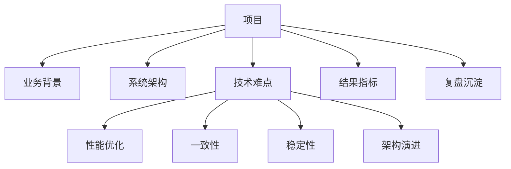

# 项目复盘地图

> 面试里的项目题，本质是在验证你是否真正做过复杂系统、是否处理过线上问题、是否能做取舍。

## 一、项目材料分层



每个项目至少准备：

- 业务目标。
- 系统规模。
- 核心链路。
- 你负责的模块。
- 2 个技术难点。
- 1 个线上问题。
- 量化结果。
- 后续改进。

## 二、项目分类

| 类型 | 面试关注点 |
| --- | --- |
| 交易类 | 一致性、幂等、对账、状态机、分库分表 |
| 内容类 | Feed、搜索、评论、计数、审核、缓存 |
| 实时类 | 长连接、推送、延迟、扇出、限流 |
| 数据类 | 离线任务、数据同步、对账、报表、OLAP |
| 基础设施类 | 网关、配置中心、监控告警、发布系统 |
| 性能优化类 | P99、CPU、内存、慢 SQL、缓存、压测 |

## 三、每个项目的 10 个问题

1. 项目解决什么业务问题？
2. 你负责哪一块？
3. 核心链路是什么？
4. 数据模型怎么设计？
5. 最大瓶颈在哪里？
6. 怎么保证一致性？
7. 怎么保证高可用？
8. 线上出过什么问题？
9. 优化后指标提升多少？
10. 如果重做，你会怎么改？

## 四、追问地图

```text
面试官问项目
  -> 问业务背景
  -> 问你的职责
  -> 问技术难点
  -> 问为什么这么设计
  -> 问线上事故
  -> 问指标结果
  -> 问扩展和改进
```

准备项目时，不要只背一个长故事，要准备多个切面：

- 1 分钟简介。
- 5 分钟技术难点。
- 10 分钟架构展开。
- 事故复盘版本。
- 指标优化版本。

## 五、面试表达

```text
这个项目的业务目标是解决什么问题，我主要负责其中哪条核心链路。
当时最大的技术挑战是某个瓶颈或一致性问题，我对比过几种方案，最后选择某个方案是因为它在复杂度、性能和可靠性之间更平衡。
上线后我们通过某些指标验证效果，比如 P99、错误率、吞吐、成本或人工效率。
后来也暴露过一些问题，我做了监控、降级、补偿或架构上的改进。
```

