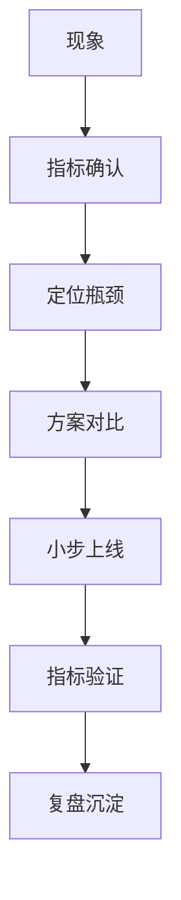

# 性能优化项目案例

> 性能优化要讲证据链：现象、定位、方案、验证。不要只说“加缓存”。

## 一、优化方法论



常用指标：

- QPS。
- P50/P95/P99。
- 错误率。
- CPU、内存、GC。
- DB 慢 SQL。
- Redis 命中率。
- MQ lag。
- 连接池等待。

## 二、案例 1：慢 SQL 优化

### 背景

订单列表查询随着数据量增长变慢，高峰期 P99 升高。

### 排查

- 慢查询日志发现列表 SQL 扫描行数高。
- EXPLAIN 发现未命中合适联合索引。
- 深分页导致回表和 filesort。

### 方案

- 按查询条件设计联合索引。
- 限制深分页，使用游标翻页。
- 历史订单冷热拆分。
- 复杂筛选同步到 ES。

### 结果表达

```text
上线后慢 SQL 数量明显下降，订单列表 P99 从 800ms 降到 120ms，DB CPU 峰值也下降。
```

## 三、案例 2：缓存命中率优化

### 背景

商品详情接口 QPS 高，DB 压力大。

### 排查

- Redis 命中率不稳定。
- 热点商品 key 过期后击穿 DB。
- 多个服务重复查相同配置。

### 方案

- 热点商品预热。
- 本地缓存 + Redis 多级缓存。
- TTL 加随机值。
- 逻辑过期异步重建。
- DB 查询限流。

### 取舍

- 接受短时间旧值。
- 核心价格和库存仍走强一致链路。

## 四、案例 3：高 CPU 优化

### 背景

某接口流量高峰 CPU 打满。

### 排查

- pprof 发现 JSON 序列化和大对象构造占比高。
- 返回字段过多。
- 重复构造相同响应。

### 方案

- 裁剪字段。
- 分页。
- 缓存热点响应。
- 减少重复序列化。

### 结果表达

```text
CPU 峰值下降，接口 P99 收敛，单实例可承载 QPS 提升。
```

## 五、案例 4：连接池打满

### 背景

接口偶发超时，但 CPU 不高。

### 排查

- database/sql 连接池等待升高。
- 慢 SQL 占用连接。
- 部分代码 Rows 未关闭。

### 方案

- 修复 Rows 关闭。
- 设置查询超时。
- 优化慢 SQL。
- 调整 MaxOpenConns / MaxIdleConns。
- 增加连接池监控。

### 面试表达

```text
这个问题不是 CPU 瓶颈，而是慢 SQL 占住连接池导致请求排队。
我先通过连接池等待指标和慢查询定位，再修复资源释放、加超时、优化 SQL，并把连接池指标接入监控。
```

## 六、常见追问

- 为什么不用缓存解决所有问题？
- 怎么证明不是网络问题？
- 指标是怎么采集的？
- 有没有压测验证？
- 优化后有没有副作用？
- 如果流量扩大 10 倍怎么办？

## 七、面试表达

```text
性能优化我会先明确指标和瓶颈，不会凭感觉改。
定位上会结合 trace、慢 SQL、pprof、连接池指标和系统指标。
方案上优先做低风险改动，比如索引、分页、缓存、限流和超时；复杂架构改造放在确认瓶颈后。
上线后必须用 P99、错误率、CPU、DB 压力等指标验证。
```

