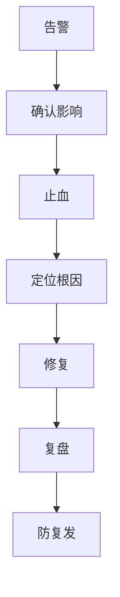

# 线上事故复盘故事

> 事故复盘要讲得专业：先止血，再定位，最后治理。不要把事故讲成甩锅或流水账。

## 一、事故复盘模板

```text
背景：
现象：
影响：
时间线：
止血动作：
根因：
长期治理：
复盘沉淀：
```



## 二、案例 1：慢 SQL 拖垮连接池

### 现象

- 接口大量超时。
- 应用 CPU 不高。
- DB 连接池等待升高。
- 慢查询数量增加。

### 止血

- 限流问题接口。
- 临时回滚可疑发布。
- 杀掉异常慢查询。
- 降级非核心查询。

### 根因

新查询条件没有合适索引，导致高峰期慢 SQL 占满连接池。

### 长期治理

- SQL 上线前 EXPLAIN。
- 慢查询告警。
- 连接池等待指标。
- 查询超时。
- 分页和索引规范。

## 三、案例 2：Redis 热 key 导致接口抖动

### 现象

- 某个 Redis 分片 CPU 高。
- 商品详情接口 P99 升高。
- 集群整体资源不高。

### 止血

- 热点 key 本地缓存。
- 临时延长 TTL。
- 降级部分非核心字段。

### 根因

大促热点商品被所有请求读取，单 key 打爆单分片。

### 长期治理

- 热点识别。
- key 拆分。
- 活动前预热。
- 本地缓存。
- 热点接口限流。

## 四、案例 3：消息积压导致状态延迟

### 现象

- 用户支付成功，但订单状态长时间未更新。
- MQ lag 持续增长。
- 消费者错误率升高。

### 止血

- 暂停异常消息。
- 扩容消费者。
- 降级非核心消费逻辑。
- 手动补偿关键订单。

### 根因

某类消息消费调用下游超时，重试放大，拖慢整个消费组。

### 长期治理

- 消费端幂等。
- 超时和熔断。
- 死信队列。
- 消息分类隔离。
- 消费 lag 告警。
- 对账补偿。

## 五、案例 4：发布引发配置错误

### 现象

- 新版本发布后错误率升高。
- 某个依赖地址配置错误。
- 部分实例异常。

### 止血

- 立即回滚。
- 摘除异常实例。
- 恢复旧配置。

### 根因

配置缺少环境校验，灰度期间没有覆盖该接口。

### 长期治理

- 配置校验。
- 灰度验证清单。
- 自动回滚。
- 配置变更审计。
- 核心接口冒烟测试。

## 六、面试表达

```text
线上事故我会先讲影响面和止血动作，而不是一上来讲根因。
比如某次接口超时，我们先限流和回滚恢复服务，然后通过连接池等待、慢 SQL 和 trace 定位到新 SQL 没有命中索引。
长期治理上补了慢 SQL 审核、连接池监控、查询超时和灰度验证。
这样的复盘重点是恢复能力和防复发，而不是只讲某个 bug。
```

