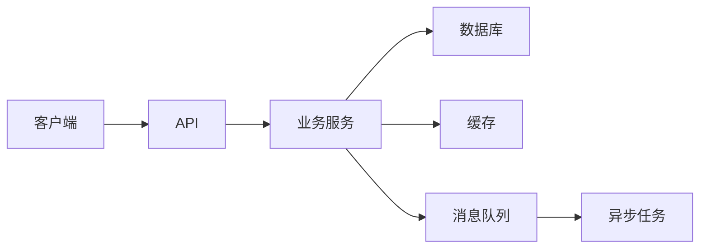

# 项目复盘模板

> 复制这份模板，填成自己的项目材料。目标是面试时能讲 1 分钟、5 分钟和 15 分钟三个版本。

## 一、项目基础信息

```text
项目名称：
业务背景：
目标用户：
业务规模：
我的角色：
负责模块：
项目周期：
```

## 二、1 分钟介绍

```text
这个项目是做【业务目标】，主要解决【核心问题】。
我负责【模块/链路】，当时规模大概是【QPS/订单量/数据量/用户量】。
技术上最关键的是【难点 1】和【难点 2】。
最后我们通过【方案】把【指标】从【A】优化到【B】，并通过【监控/降级/补偿】保证线上稳定。
```

## 三、核心链路

```text
入口：
核心服务：
数据库：
缓存：
MQ：
下游依赖：
结果输出：
```

画图：



## 四、技术难点 1

```text
问题现象：
影响范围：
为什么不能简单解决：
候选方案：
最终方案：
架构取舍：
上线过程：
结果指标：
遗留问题：
```

## 五、技术难点 2

```text
问题现象：
影响范围：
为什么不能简单解决：
候选方案：
最终方案：
架构取舍：
上线过程：
结果指标：
遗留问题：
```

## 六、线上事故或故障

```text
事故背景：
用户影响：
发现方式：
止血动作：
排查路径：
根因：
修复方案：
长期治理：
复盘沉淀：
```

## 七、指标结果

至少准备 3 个指标：

```text
性能指标：
稳定性指标：
成本指标：
效率指标：
业务指标：
```

示例：

```text
P99 从 800ms 降到 120ms
慢 SQL 数量下降 80%
MQ 积压从 300 万降到 0
人工处理从 2 小时降到 10 分钟
```

## 八、常见追问准备

```text
为什么选这个方案？
有没有替代方案？
如果流量扩大 10 倍怎么办？
如果 Redis / MQ / MySQL 挂了怎么办？
如何保证数据一致性？
如何监控和告警？
有没有压测？
上线后出过什么问题？
如果重做会怎么改？
```

## 九、5 分钟版本

```text
1. 业务背景和规模
2. 我的职责
3. 核心架构
4. 技术难点
5. 方案取舍
6. 上线结果
7. 复盘改进
```

## 十、面试表达

```text
这个项目我不会只讲用了哪些技术，而会围绕业务目标、技术难点、架构取舍和结果指标来讲。
如果面试官追问细节，我会展开具体链路，比如一致性、性能优化、缓存设计、MQ 可靠性或线上事故处理。
我也会主动讲不足和后续改进，因为真实项目一定有边界和取舍。
```

