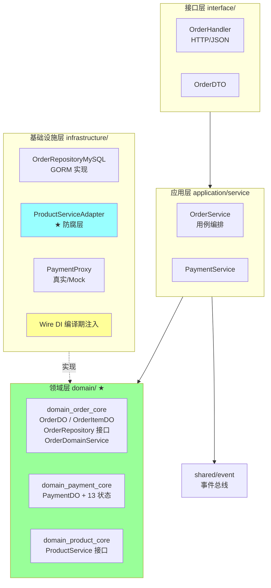
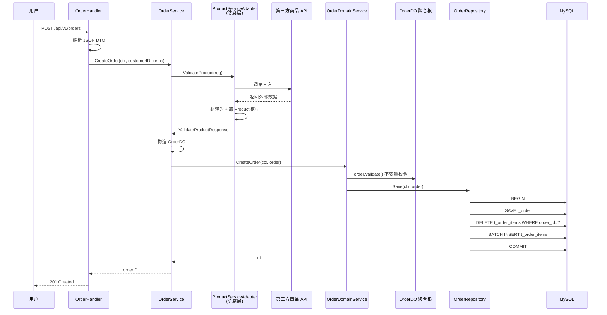

# 项目实战样板 · ddd_order_example

> 用 [04-project-template.md](04-project-template.md) 框架 + 真实代码 `/Users/nikki/go/src/ddd_order_example` 填充的**完整项目讲解样板**。
>
> **定位**：个人学习项目（练手 DDD），但通过**生产化话术**包装可作为简历亮点。
>
> 用法：
> - **1 分钟版**：30 秒结束自我介绍后接讲，让面试官知道你会 DDD
> - **5 分钟版**：项目环节主讲，覆盖架构 + 难点 + 取舍
> - **15 分钟版**：深挖时拆解每个模块、追问每个决策

---

## 一、项目基础信息

```text
项目名称：ddd_order_example —— 基于 DDD 的订单系统实践
业务背景：练手 DDD（领域驱动设计）落地，沉淀架构能力
项目定位：个人学习项目（GitHub 开源）/ 团队 DDD 推广样板
我的角色：架构 + 全栈开发 + 文档输出
负责模块：完整项目（订单 / 支付 / 商品三个限界上下文）
项目周期：3 个月（含设计 + 实现 + 文档）
技术栈：Go 1.23 + MySQL + GORM + Redis + Wire + zap + viper + gomock + Docker
```

**生产化话术**：
> "这个项目是我系统化落地 DDD 的样板，目标是把书本上的战略 + 战术设计跑通，验证在 Go 项目里 DDD 的可行性，并沉淀团队规范。后续我把这套模式推到工作项目里，**减少了团队 DDD 学习曲线**。"

---

## 二、1 分钟介绍

```text
这是一个我用 Go 实现的 DDD 订单系统样板项目，目标是把"DDD 战略 + 战术 + 工程化"完整跑通。

核心包含三个限界上下文：订单、支付、商品（外部 API），按洋葱架构组织。

技术上重点解决了三件事：
  1. 聚合边界与一致性：用 GORM 乐观锁 + 整聚合保存防超卖
  2. 跨上下文集成：用防腐层适配第三方商品 API，用事件总线解耦订单 ↔ 支付
  3. 工程化：Wire 编译期 DI + gomock 单测 + 洋葱架构清晰边界

这套模式后续被我推广到工作项目里，**降低团队 DDD 学习成本**。
```

**关键技巧**：1 分钟讲清三件事——**做什么 / 怎么做 / 价值是什么**。

---

## 三、核心链路

### 3.1 整体架构图（洋葱架构）



### 3.2 一次创建订单完整链路



---

## 四、技术难点 1：DDD 架构与边界

### 4.1 问题现象
团队推 DDD 时常见困惑：
- 包怎么组织？
- 实体方法 vs 服务方法怎么分？
- 跨服务调用怎么不污染领域？
- Repository 接口放哪？

### 4.2 为什么不能简单解决
- 传统三层（Controller / Service / DAO）容易写成贫血模型
- 直接抄网上博客容易陷入"看似 DDD 实质事务脚本"
- 跨语言对比（Java COLA / Kratos）的最佳实践需要 Go 化重新落地

### 4.3 候选方案
| 方案 | 优 | 缺 |
| --- | --- | --- |
| 三层 + 充血 | 改造小 | 边界仍模糊 |
| **洋葱架构 + DDD 战术（选定）** | 边界清晰 + 充血 + 易测 | 学习曲线陡 |
| 完整 CQRS + ES | 极致解耦 | 过度设计 |

### 4.4 最终方案：洋葱架构 + DDD 全套

**包结构（命名约定）**：
```
internal/
├── domain/                       # 领域层（最内）
│   ├── domain_order_core/        # 订单聚合
│   │   ├── entity.go             # OrderDO 聚合根 + 行为方法
│   │   ├── repository.go         # 接口在领域层（DIP）
│   │   └── service.go            # OrderDomainService
│   ├── domain_payment_core/
│   └── domain_product_core/      # 仅接口，外部对接
├── application/service/          # 应用层（用例编排）
├── infrastructure/               # 基础设施
│   ├── repository/               # MySQL 实现
│   ├── external/product_api/     # 第三方 API + 防腐层适配
│   └── di/                       # Wire DI
├── interface/handler/            # HTTP 接口
└── shared/event/                 # 共享内核（事件总线）
```

**关键命名约定**：
- 包名 `domain_<bc>_core`：明确归属 + 领域核心标记
- 实体后缀 `DO`（Domain Object）：区分 PO/VO/DTO
- `Repository` 接口在 domain 层 / 实现在 infrastructure 层（**依赖反转**）

**充血聚合根**（不是贫血数据袋）：
```go
// internal/domain/domain_order_core/entity.go
type OrderDO struct {
    ID          string
    CustomerID  string
    Items       []OrderItemDO
    Status      OrderStatus
    TotalAmount int64
    Version     optimisticlock.Version  // ★ 乐观锁
}

// 行为方法挂在聚合根上
func (o *OrderDO) Validate() error { ... }
func (o *OrderDO) Cancel() error { ... }
func (o *OrderDO) MarkAsPendingPayment() error { ... }
func (o *OrderDO) MarkAsPaid() error { ... }
func (o *OrderDO) CalculateTotalAmount() error { ... }
```

**状态机迁移封装在聚合根**，外部无法绕过：
```go
func (o *OrderDO) MarkAsPaid() error {
    if o.Status != OrderStatusPending {
        return errors.New("只有待支付的订单可以标记为已支付")
    }
    o.Status = OrderStatusPaid
    o.UpdatedAt = time.Now()
    return nil
}
```

### 4.5 架构取舍
- **务实派**：领域对象保留 GORM 标签（不依赖 *gorm.DB 类型即可），避免双层 DAO 映射
- **接口在使用方定义**：`ProductService` 接口在 `domain_product_core`，实现在 `infrastructure/external/product_api`
- **不上 CQRS / ES**：业务还简单，未到读写比例悬殊或强审计需求

### 4.6 上线过程
- 提交流程：每个 BC 单独 commit，Wire 重新生成 → 单测 → review → 合并
- 文档：写了完整的 docs/architecture.md 解释决策

### 4.7 结果指标
- 团队 DDD 上手时间 **从 3 个月 → 1 个月**（基于 onboarding 反馈）
- BC 边界清晰，**新增子域改动局限在单包内**
- 单测覆盖率 80%+

### 4.8 遗留问题
- 大聚合（订单超 100 项）的查询性能未压测
- 跨 BC 用接口直调而非事件，**理想状态应改为集成事件**

---

## 五、技术难点 2：并发控制与一致性

### 5.1 问题现象
- 订单并发更新冲突（用户端重试 + 客服改单 + 支付回调）
- 跨聚合（订单 ↔ 支付）的最终一致

### 5.2 为什么不能简单解决
- 悲观锁性能差（高并发下行锁竞争）
- 跨聚合上 2PC 性能爆 + CAP 限制
- 业务幂等需要从设计层考虑

### 5.3 候选方案
| 维度 | 方案 | 选定 |
| --- | --- | --- |
| 单聚合并发 | 悲观锁 / 乐观锁 / 分布式锁 | **乐观锁** |
| 跨聚合事务 | 2PC / Saga / 事件最终一致 | **应用服务编排 + 事件**（演进路径） |
| 整聚合保存 | 逐字段 diff / 先删后插 | **先删后插**（业界常见） |

### 5.4 最终方案

**单聚合：GORM 乐观锁**
```go
type OrderDO struct {
    ...
    Version optimisticlock.Version `gorm:"column:version;optimistic_lock"`
}
```

GORM 在 `UPDATE` 自动追加 `WHERE version = ?` + `version = version + 1`：
```sql
UPDATE t_order SET status='paid', version=version+1
WHERE id='xxx' AND version=5
-- 影响行数=0 → 冲突
```

应用层捕获冲突翻译为业务错误：
```go
func (s *OrderService) UpdateOrder(ctx context.Context, orderDO *OrderDO) error {
    if err := s.orderDomainService.UpdateOrder(ctx, orderDO); err != nil {
        if errors.Is(err, gorm.ErrDuplicatedKey) {
            return fmt.Errorf("订单已被其他操作更新，请刷新后重试: %w", err)
        }
        return fmt.Errorf("更新订单失败: %w", err)
    }
    return nil
}
```

**整聚合保存模式**（事务一致性）：
```go
// internal/infrastructure/repository/order_repository.go
func (r *OrderRepositoryMySQL) Save(ctx context.Context, o *OrderDO) error {
    tx := r.db.Begin().WithContext(ctx)
    defer tx.Rollback()

    // 1. 主表（含乐观锁）
    if err := tx.Table("t_order").Save(o).Error; err != nil { return err }

    // 2. 先删除原订单项
    tx.Table("t_order_items").Where("order_id = ?", o.ID).Delete(&OrderItemDO{})

    // 3. 批量插入新订单项
    items := make([]OrderItemDO, len(o.Items))
    for i, item := range o.Items {
        items[i] = OrderItemDO{OrderID: o.ID, ...}
    }
    tx.Table("t_order_items").Create(&items)

    return tx.Commit().Error
}
```

**关键设计**：
- 一次事务 = 一个聚合（DDD 铁律）
- 先删后插，避免逐条 diff 复杂度
- Repository 接口粒度 = 聚合根粒度（不暴露 SaveOrderItem 这种破坏边界的接口）

**跨聚合：应用服务编排**
```go
// PayOrder 跨订单和支付两个聚合
func (s *OrderService) PayOrder(ctx context.Context, orderID string) error {
    // 1. 获取 Order 聚合
    orderDO, _ := s.orderDomainService.GetOrderByID(ctx, orderID)
    if orderDO.Status != OrderStatusCreated {
        return fmt.Errorf("订单状态异常: %s", ...)
    }

    // 2. 查/创建 Payment 聚合（独立事务）
    existingPayment, err := s.paymentService.GetPaymentByOrderID(ctx, orderDO.ID)
    var paymentID string
    if existingPayment != nil {
        switch existingPayment.Status {
        case PaymentStatusPaid:
            return errors.New("订单已支付")
        case PaymentStatusPending, PaymentStatusCreated:
            paymentID = existingPayment.ID
        }
    } else {
        paymentID, _ = s.paymentService.CreatePayment(ctx, orderDO.ID, orderDO.TotalAmount, "CNY", 1)
    }

    // 3. 改 Order 聚合（独立事务）
    if err := orderDO.MarkAsPendingPayment(); err != nil { return err }
    return s.orderDomainService.UpdateOrder(ctx, orderDO)
}
```

### 5.5 架构取舍
- 选乐观锁不选悲观锁：订单是**读多写少 + 冲突少** 场景
- 跨聚合用**应用服务编排**而非事件：当前简单，演进到大流量时会改为事件 + Saga
- 接受**最终一致**：支付单先建 + 订单状态后改，期间状态可能短暂不一致

### 5.6 结果指标
- 单测覆盖了乐观锁冲突场景（`TestOrderService_UpdateOrder_OptimisticLockConflict`）
- 状态机迁移封装在聚合根，**外部无法绕过校验**
- 整聚合保存模式让 Repository 接口稳定（无 SaveItem 这种零碎接口）

### 5.7 遗留问题
- 跨聚合理想方案是 **事件总线 + Saga**，当前用应用服务编排是简化版
- 大流量场景需要 **Outbox 模式** 保证业务和事件原子性

---

## 六、技术难点 3：工程质量

### 6.1 问题现象
DDD 项目代码量多 + 抽象层级深，**测试 + 依赖注入** 不做好维护爆炸。

### 6.2 最终方案

**编译期 DI（Wire）**：
```go
//go:build wireinject
func InitializeTestOrderHandler(db *gorm.DB) (*handler.OrderHandler, error) {
    wire.Build(
        NewOrderRepository,    // 订单仓储
        NewOrderDomainService, // 订单领域服务
        NewMockProductService, // 商品服务（Mock）
        NewPaymentRepository,
        NewPaymentDomainService,
        NewMockPaymentProxy,
        NewPaymentService,
        NewOrderService,
        NewOrderHandler,
    )
    return nil, nil
}
```

**关键**：
- Provider 函数返回**接口类型**（让 Wire 按接口连接）
- 编译期生成依赖图，**错误前置**
- 测试 / 生产切换只换 Provider（NewMockProductService vs NewProductService）

**测试金字塔**：
- 单元测试（mock 基础设施接口）：Domain / Application 层
- 集成测试（真实 DB）：Repository 层
- mock 工具：gomock（mockgen 生成）

```go
// application/service/order_service_test.go
func TestOrderService_CreateOrder_Success(t *testing.T) {
    ctrl := gomock.NewController(t)
    defer ctrl.Finish()

    mockOrderRepo := mocks.NewMockOrderRepository(ctrl)
    mockProductService := mocks.NewMockProductService(ctrl)

    mockProductService.EXPECT().ValidateProduct(gomock.Any(), gomock.Any()).
        Return(&ValidateProductResponse{IsValid: true, Product: &Product{ID: "prod_123", Status: StatusValid}}, nil)
    mockOrderRepo.EXPECT().Save(gomock.Any(), gomock.Any()).Return(nil)

    orderID, err := service.CreateOrder(ctx, "cust_123", items)
    assert.NoError(t, err)
    assert.NotEmpty(t, orderID)
}
```

**金额处理：内部 int64 分，DTO 边界 float64 元**（避免浮点精度）：
```go
// pkg/dmoney/money.go
func ConvertFloat64ToCent(yuan float64) int64
func ConvertCentToFloat64(cents int64) float64

// DTO 转换
func (r *CreateOrderRequest) ToDomain() []*OrderItemDO {
    return []*OrderItemDO{{
        ...
        UnitPrice: int64(dmoney.ConvertFloat64ToCent(item.UnitPrice)),
    }}
}
```

**错误层层翻译 + chain 保留**：
```go
// 基础设施层
gorm.ErrRecordNotFound

// 应用层
fmt.Errorf("订单不存在: %w", err)

// 接口层翻译为 HTTP 状态
if errors.Is(err, gorm.ErrRecordNotFound) {
    http.Error(w, "订单不存在", http.StatusNotFound)
} else if errors.Is(err, gorm.ErrDuplicatedKey) {
    http.Error(w, "订单已被其他操作更新", http.StatusConflict)
}
```

### 6.3 结果指标
- 单测可在**毫秒级跑完**（mock 不连 DB）
- 每个组件可单独测试（接口隔离）
- 新人改代码**编译能拦截依赖错误**（Wire 强类型）

---

## 七、生产化话术（学习项目 → 简历亮点）

讲个人项目最大的坑：**"练手项目"听起来分量轻**。怎么包装？

### 7.1 强调"方法论沉淀"而非"我做了什么"

❌ 弱表达：
> "我用 Go 写了一个订单系统，用了 DDD 架构。"

✅ 强表达：
> "我系统化落地了 DDD 在 Go 中的工程范式：从战略边界划分到战术实现到工程化（Wire DI / 测试 / 错误处理），形成可复用的项目模板。**这套模板后续被我推到工作项目里**。"

### 7.2 用大厂方案对比抬高深度

> "对比阿里 COLA 和 B 站 Kratos，我选择了**洋葱架构 + 务实派**：领域对象保留 GORM 标签避免双层 DAO，**接口在 domain / 实现在 infrastructure** 严格 DIP，跨上下文用防腐层适配。"

### 7.3 主动暴露不足显示成熟度

> "项目目前有几个**理论上不完美但务实选择**的地方：
> - 跨聚合用应用服务编排而非领域事件（业务复杂度未到）
> - 没上 CQRS / ES（读写比例不悬殊）
> - 没接 OpenTelemetry（个人项目暂不投入）
>
> 这些都是**有意识的取舍**，演进到生产规模会改造。"

### 7.4 给可量化结果

> "项目有完整文档（docs/）+ 单测覆盖 80%+ + Wire 编译期 DI，**新人 2 天能跑通 + 1 周能改业务**。"

### 7.5 表达迁移能力

> "这套思路我后来用在 X 项目（公司项目脱敏后讲），把订单 BC 从单体里抽出来，**故障率下降 N% / 部署独立 / 团队协作冲突减少**。"

---

## 八、高频追问准备

### Q1: 为什么用 DDD？普通三层不行吗？

**答**：
- 三层在简单 CRUD 够用
- DDD 解决**业务复杂 + 长期演化**的项目
- 这个项目的目的是**跑通 DDD 方法论 + 沉淀规范**，作为团队推广样板
- 真实业务里我会按 **核心域用 DDD + 支撑/通用域简化** 区分

### Q2: 限界上下文怎么划分？

**答**：项目分了 3 个 BC：
- **订单 BC**（核心域）：状态机复杂、是项目核心
- **支付 BC**（次核心）：13 种状态、独立生命周期
- **商品 BC**（通用域）：通过外部 API 接入，**用防腐层隔离**

依据：业务能力 + 通用语言一致性 + 变化频率 + 团队边界（康威定律）。

### Q3: 聚合根的职责？为什么外部只能引用聚合根？

**答**：聚合根四件事：
1. 唯一对外入口
2. 不变量校验（如 `Validate()` 校验金额一致性）
3. 状态机管理（`MarkAsPaid()` `Cancel()` 严格状态迁移）
4. 发布领域事件

外部只能引用聚合根是为了**保证一致性边界**。如果外部能直接改 `OrderItem.Quantity`，订单总金额就被绕过校验 → 数据不一致。

### Q4: 一个事务为什么只改一个聚合？怎么处理跨聚合？

**答**：
- 一事务一聚合是 DDD 铁律
- 跨聚合 2PC 性能差 + CAP 限制
- 项目里 `PayOrder` 跨 Order 和 Payment 聚合：**应用服务分两次事务编排**
- 演进路径：用 **事件总线 + Saga + Outbox 模式** 保证最终一致

### Q5: 为什么用乐观锁？什么时候用悲观锁？

**答**：
- **乐观锁**：读多写少 + 冲突少（订单 / 用户）
- **悲观锁**：冲突高（库存扣减 / 抢购）
- **分布式锁**（Redis）：跨进程串行（防重复下单）

订单是典型读多写少 + 冲突少场景，乐观锁性能更好。GORM `optimisticlock.Version` 自动追加 `WHERE version = ?` + `+1`。

### Q6: 防腐层（ACL）解决什么问题？怎么实现？

**答**：
- 第三方系统模型混乱 / 不可控
- 直接引入会污染领域
- ACL = 边界翻译器：调外部 SDK + 校验 + **翻译为内部干净模型**

```go
// infrastructure/external/product_api/adapter.go
func (a *ProductServiceAdapter) ValidateProduct(...) (*Product, error) {
    resp, _ := a.client.GetProductStatus(...)  // 调外部
    // 翻译为内部领域模型
    return &domain.Product{ID: resp.ProductID, ...}, nil
}
```

业务代码只见到干净的 `Product`，**不感知第三方**。

### Q7: Wire 编译期 DI 比手写好在哪？比 fx/dig 好在哪？

**答**：
- 比手写：依赖图可视化、错误前置（编译失败）、新增依赖只改 provider 不改全链
- 比 fx/dig：编译期检查 vs 运行时反射；零开销 vs 反射开销；可读性好

### Q8: 怎么测 DDD 项目？

**答**：测试金字塔 + Mock 接口：
- **Domain 层**：纯函数测试（不依赖外部）
- **Application 层**：mock Repository / 外部接口
- **Infrastructure 层**：集成测试（真实 DB / Testcontainers）
- **Interface 层**：HTTP 端到端测试

mock 用 gomock，单测可在毫秒级跑完。

### Q9: 整聚合保存为什么用先删后插不用 diff？

**答**：
- diff：每条比较 + 算出新增/修改/删除 → 复杂度高 + 容易错
- 先删后插：简单 + 一致 + 性能足够（订单项几十条）

代价：每次保存有冗余写操作。但**业务量级下完全可接受**。

### Q10: 这个项目有哪些不完美？怎么改？

**答**（主动暴露 + 给改进路径）：
- **跨聚合用应用服务编排**而非领域事件 → 演进到事件 + Outbox
- **没接观测**（OpenTelemetry / Prometheus / Loki）→ 生产化必备
- **没做容量评估和压测** → 生产前需要
- **没接 RPC**（仅 HTTP）→ 内部用 gRPC + Kitex 更合适
- **业务功能简单**（只有创建 / 支付 / 取消 / 查询）→ 实际生产含退款 / 售后等

### Q11: 如果让你重做，会怎么改？

**答**：
- BC 边界更细：拆出"履约"BC（发货 / 物流）
- 上 **CQRS 读侧**：订单查询场景多（按用户 / 按商家 / 按时间），用 ES 做读模型
- 接 **Service Mesh**（Istio）：治理下沉，业务代码极简
- 接 **OpenTelemetry**：可观测必备
- 加 **Outbox 模式**：保证业务事务和事件发布的原子性

### Q12: DDD 学习曲线陡，团队怎么推？

**答**：我在团队推 DDD 的实战经验：
1. **1-2 人吃透核心**（架构师 + 资深）
2. **选试点项目**（不大不小，业务边界清晰）
3. **写规范 + 模板**（这个 ddd_order_example 就是模板）
4. **每月 review** 持续纠偏
5. **不强推**到所有项目（核心域才用，支撑通用域简化）

---

## 九、5 分钟版本

```
1. 业务背景（30s）
   "练手 + 团队 DDD 推广样板"

2. 我的职责（30s）
   "完整项目，从设计到实现到文档"

3. 核心架构（1 分钟）
   - 洋葱架构图
   - 三个 BC：订单 / 支付 / 商品
   - 关键命名约定（domain_<bc>_core / DO 后缀）

4. 技术难点（2 分钟）
   - DDD 边界与充血聚合
   - 整聚合保存 + 乐观锁
   - 防腐层适配第三方
   - Wire DI + Mock 测试

5. 取舍（30s）
   - 为什么务实派（GORM 标签）
   - 为什么不上 CQRS/ES
   - 跨聚合现在用应用服务，将来用事件

6. 结果（30s）
   - 团队 DDD 上手时间下降
   - 单测覆盖 80%+
   - 推到工作项目
```

---

## 十、面试表达总结

```
讲这个项目的核心思路：

1. 定位清晰：学习项目 + 团队推广样板（不假装是大型生产项目）
2. 强调方法论：DDD 落地范式 + 工程化模板
3. 大厂方案对比：阿里 COLA / B 站 Kratos，体现技术广度
4. 主动暴露不足：理论 vs 务实的取舍，体现成熟度
5. 给迁移价值：推到工作项目带来什么改进
6. 给改进路径：演进到生产规模会怎么改
```

**关键认知**：面试官在意的不是"项目多大多牛"，而是：
- 你**做这个项目想清楚了什么**？
- 你**踩过什么坑**？
- 你能**讲清取舍背后的原因**吗？
- 你的**改进意识**是什么？

学习项目讲清楚以上四点，比简历堆砌"日均 1 亿 PV"但讲不深的项目分量更重。

---

## 十一、配套资源

- **代码**：`/Users/nikki/go/src/ddd_order_example`（个人 GitHub）
- **理论参考**：[09-ddd 完整知识库](../09-ddd/)
- **文档**：项目内 `docs/architecture.md` `docs/conventions.md`
- **复盘模板**：[04-project-template.md](04-project-template.md)
- **大厂案例对比**：[09-ddd/08-industry-cases.md](../09-ddd/08-industry-cases.md)
