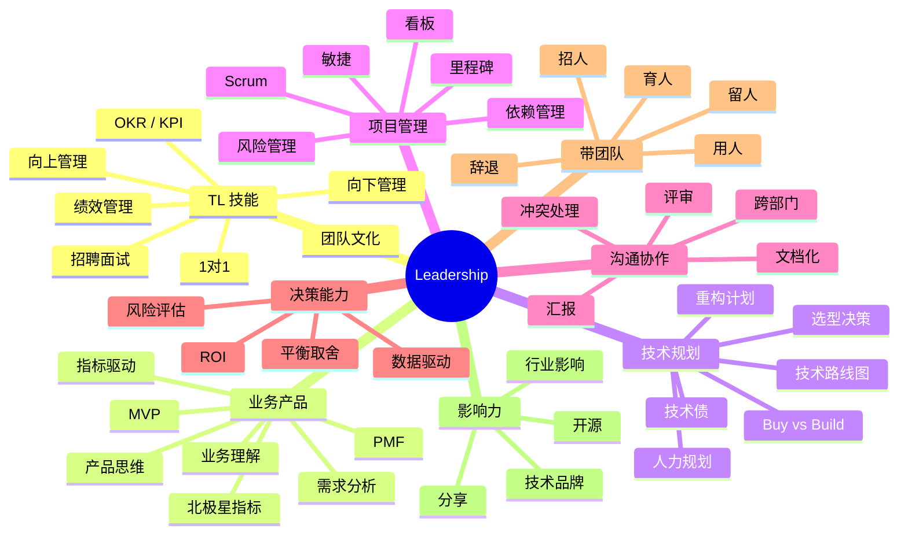
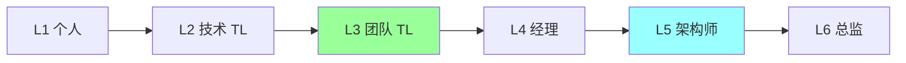
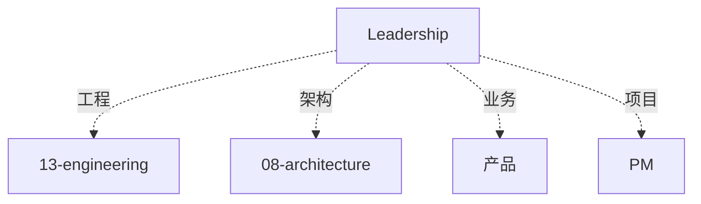

# Leadership 知识地图

> 资深 / 架构 / TL 岗位必考：**业务理解 + 技术规划 + 团队管理**。不是只看你会写代码。
>
> 这份地图是 15-leadership 目录的总览：知识树 / 题型分类 / 学习路径 / 面试表达

---

## 一、整体知识树



---

## 二、后端视角的 Leadership

| Leadership 能力 | 对应场景 |
| --- | --- |
| 1 对 1 | 了解下属 / 及时发现问题 |
| OKR | 对齐目标 / 激发自主 |
| 绩效 | 公平评价 / 激励成长 |
| 技术规划 | 3-12 月技术路线 |
| 招聘 | 团队扩张 / 文化塑造 |
| 跨部门 | 协同落地 / 消除孤岛 |
| 向上管理 | 争资源 / 传目标 |
| 向下管理 | 定标准 / 给反馈 |
| 决策 | 取舍 / ROI / 风险 |
| 辞退 | 艰难但必要 |

---

## 三、能力分层

```text
L1 个人贡献
  写好代码 / 完成任务

L2 技术 Leader（Tech Lead）
  技术决策 / 代码评审 / 技术指导 / 小团队（3-5 人）

L3 团队 Leader（Team Lead）
  团队管理 / 招聘 / 绩效 / 1v1 / 10-20 人

L4 技术经理（Engineering Manager）
  多团队 / 跨部门 / 技术规划 / 30+ 人

L5 架构师
  技术战略 / 跨团队架构 / 技术品牌

L6 总监 / VP
  组织架构 / 业务战略 / 100+ 人
```



---

## 四、题型分类

### 4.1 TL 基础题（P6+）

```
□ 怎么管理团队？
□ 怎么做 1 对 1
□ 怎么招人？
□ OKR 怎么做
□ 团队有人摸鱼怎么办
```

对应：[01](01-tech-lead-skills.md)

### 4.2 业务产品题（P7+）

```
□ 怎么理解业务
□ 怎么跟产品 PK
□ 技术驱动 vs 业务驱动
□ 怎么量化技术价值
□ 北极星指标
```

对应：[02](02-business-product-thinking.md)

### 4.3 技术规划题（P7-P8）

```
□ 团队技术规划怎么做
□ 技术债怎么还
□ 重构怎么推
□ 选型怎么决策
□ 人力怎么规划
□ 怎么讲技术故事
```

对应：[03](03-tech-strategy-planning.md)

### 4.4 高阶题（P8+）

```
□ 怎么做跨部门协同
□ 怎么带 50+ 人
□ 怎么做技术战略
□ 怎么处理团队冲突
□ 怎么辞退
```

对应：全部 + 实战经验

### 4.5 行为题（必考）

```
□ 讲一个你带团队的例子
□ 讲一次你主导的技术决策
□ 讲一次你说服别人的经历
□ 讲一次失败的经历
□ 讲你最骄傲的事
```

对应：全部 + STAR 答题

---

## 五、目录文件全览

| # | 文件 | 重点 |
| --- | --- | --- |
| 01 | [TL 技能](01-tech-lead-skills.md) | 1 对 1 / OKR / 招聘 / 绩效 / 文化 |
| 02 | [业务产品思维](02-business-product-thinking.md) | 业务理解 / 产品 / MVP / 指标 |
| 03 | [技术战略规划](03-tech-strategy-planning.md) | 技术路线 / 技术债 / 重构 / 选型 |

---

## 六、答题框架

### 6.1 STAR 框架（行为题必用）

```
Situation（背景）: 当时什么情况
Task（任务）: 我的职责是什么
Action（行动）: 我做了什么（重点，70%篇幅）
Result（结果）: 量化结果 + 影响
```

### 6.2 CAR 框架（简版）

```
Context → Action → Result
```

### 6.3 SCQA 框架（讲故事）

```
Situation（情景）
Complication（冲突）
Question（问题）
Answer（答案）
```

### 6.4 5 Whys（根因分析）

```
问题 → Why 1 → Why 2 → Why 3 → Why 4 → Why 5 = 根因
```

---

## 七、典型题 + 答题模板

### 7.1 "怎么管理团队"（必考）

```
4 个维度:
1. 目标: OKR 对齐 / 拆解到人
2. 执行: 敏捷 / Scrum / 每日站会
3. 成长: 1v1 / mentoring / 技术分享
4. 文化: 开放 / 创新 / 责任 / 合作

举例:
  - 我带 X 人团队，做 Y 业务
  - 遇到 Z 挑战，用 W 方法解决
  - 结果：业绩/效率/稳定性提升 X%
```

### 7.2 "讲一个你主导的技术决策"

```
STAR:
  S: 业务 XX 面临 YY 性能瓶颈
  T: 我作为架构师，主导选型
  A:
    - 评估 3 种方案（A/B/C）
    - 数据对比（性能/成本/团队）
    - POC 验证
    - 组织评审
    - 推动落地
  R: 性能提升 5x / 成本降低 30% / 团队成长
```

### 7.3 "讲一个失败的经历"

```
不要讲技术 bug（太小）。
讲判断失误:
  - 错估了复杂度
  - 选型错误
  - 团队管理失败

STAR:
  S: 做 X 项目
  T: 负责 Y
  A: 犯了 Z 错误
  R:
    - 损失（时间 / 成本）
    - 反思（3 点教训）
    - 改进（后续做对）
```

### 7.4 "怎么处理团队冲突"

```
步骤:
1. 先听（两边分别 1v1）
2. 找共同目标
3. 定规则（技术决策走评审）
4. 跟进结果
5. 长期: 改流程

举例: 两个 team member 争执技术方案
  → 不偏袒，数据说话
  → 组织评审会
  → 定下决策
  → 事后复盘
```

### 7.5 "怎么推动技术债还债"

```
4 步:
1. 量化（多少技术债 / 影响多大）
2. 讲故事（关联业务损失 / 效率损失）
3. 做计划（分阶段 / 不影响业务）
4. 拿资源（老板 + PM）

关键: 把技术语言翻译成业务语言
  "这个重构能降低故障率 50% = 少损失 100w/年"
```

### 7.6 "怎么做技术规划"

```
1. 看业务（未来 6-12 月业务目标）
2. 看现状（团队现状 + 技术现状）
3. 看行业（同行 / 技术趋势）
4. 定目标（3-5 个主线）
5. 定里程碑（季度级）
6. 定资源（人力 / 预算）
7. 跟踪调整
```

### 7.7 "为什么要招这个人"

```
考察维度:
1. 技术（硬实力）
2. 潜力（学习 / 成长）
3. 文化（匹配度）
4. 协作（团队合作）

面试技巧:
  - 行为题 STAR
  - 深挖 Action
  - 看反思能力
  - 问"最骄傲 / 最失败"
```

### 7.8 "怎么辞退"

```
流程:
1. 先给机会（PIP / 1v1 / 反馈）
2. 明确问题 + 改进方向
3. 定期 check-in
4. 无法改善 → 坦诚沟通
5. 人事配合 + 合法合规

原则:
  - 不伤人格
  - 给体面
  - 对团队负责
```

---

## 八、业务理解（P7+ 必备）

### 8.1 技术怎么理解业务

```
3 层:
1. 做什么: 产品功能
2. 为什么: 业务价值 / 用户需求
3. 卖给谁: 用户画像 / 场景

问题清单:
  - 业务指标是什么（GMV / DAU / 留存）
  - 瓶颈在哪（技术 / 产品 / 运营）
  - 未来 6 月目标
  - 和竞对差距
```

### 8.2 技术 vs 业务的平衡

```
PK 产品:
  ❌ "这个做不了"
  ✅ "做可以，但要 X 代价，短期有 Y 风险，长期要 Z 改造"

平衡:
  - 短期业务 + 长期架构
  - 速度 + 质量
  - 投入 + 回报
```

---

## 九、技术战略（P8+ 必备）

### 9.1 怎么做技术路线图

```
输入:
  - 业务目标
  - 技术现状
  - 行业趋势
  - 团队能力

输出:
  - 3 年愿景
  - 1 年目标
  - 季度里程碑
  - 技术投入

跟踪:
  - 季度复盘
  - 调整优先级
```

### 9.2 技术债管理

```
分类:
  L1: 阻塞业务（立即还）
  L2: 影响效率（季度内还）
  L3: 历史遗留（有机会再还）

还债策略:
  - 新需求捎带
  - 专项立项
  - 重构节奏化
```

---

## 十、常见误区

### 误区 1：管理 = 甩手不写代码

错。TL 仍要**保持技术判断力**，20-30% 精力写关键代码。

### 误区 2：对人好就是好 Leader

错。好 Leader **敢于批评 + 辞退**，对事负责。

### 误区 3：技术强 = 管理强

错。**管理是独立技能**。要主动学习 + 实践。

### 误区 4：OKR 等于 KPI

错。**OKR 重对齐 + 挑战**，KPI 重考核。不要用 OKR 打绩效。

### 误区 5：只关注业务

错。**技术驱动**也很重要。技术债不还会反噬。

---

## 十一、面试加分点

- **STAR + 量化** 讲故事
- **带团队规模 + 业务复杂度 + 业务结果**
- **技术决策案例**（选型 / 架构 / 重构）
- **失败经历 + 反思**（不要藏）
- **跨部门协同**（产品 / 运营 / 法务）
- **技术品牌**（开源 / 演讲 / 公众号）
- **向上管理**（争资源 / 传目标）
- **业务理解**（指标 / 用户 / 场景）
- **人才观**（招育用留）
- **北极星指标** 知道一点
- **技术债管理**
- **OKR 落地** 实战

---

## 十二、推荐阅读路径

```
入门:
  □ 《技术之外》
  □ 15-leadership/01

进阶:
  □ 《The Manager's Path》
  □ 《High Output Management》
  □ 《关键对话》
  □ 15-leadership/02-03

资深:
  □ 《Staff Engineer》
  □ 《Engineering Management for the Rest of Us》
  □ 《原则》Ray Dalio

实战:
  □ 带一个 3-5 人小团队
  □ 主导一次技术决策
  □ 做一次跨部门协同
  □ 面试 10+ 候选人
```

---

## 十三、与其他模块的关系



---

## 十四、面试题库（40 题）

```
团队管理类:
□ 怎么管理 10 人团队
□ 怎么做 1 对 1
□ 怎么给绩效
□ 怎么开会
□ 怎么处理冲突
□ 怎么辞退

招聘类:
□ 怎么招人
□ 面试看什么
□ 怎么判断候选人
□ 怎么防止错过人才

规划类:
□ 技术规划怎么做
□ 技术债怎么还
□ 选型怎么决策
□ Buy vs Build

业务类:
□ 怎么理解业务
□ 怎么跟产品 PK
□ 怎么量化技术价值
□ 北极星指标

跨部门类:
□ 怎么跨部门协同
□ 怎么汇报
□ 怎么争资源
□ 怎么讲技术故事

文化类:
□ 怎么建设文化
□ 怎么做分享
□ 怎么激励团队
□ 怎么留人

行为题类:
□ 最骄傲的事
□ 最失败的事
□ 最难的决策
□ 最难的项目
□ 最难相处的人

危机类:
□ 重大故障怎么处理
□ 团队士气低怎么办
□ 核心员工离职
□ 业务方向变了

自我类:
□ 为什么想做 TL
□ 未来 3 年规划
□ 你的缺点是什么
□ 你的优势是什么
```

---

## 十五、与 99-meta 的关联

```
项目案例: 14-projects
业务理解: 10-system-design
```
