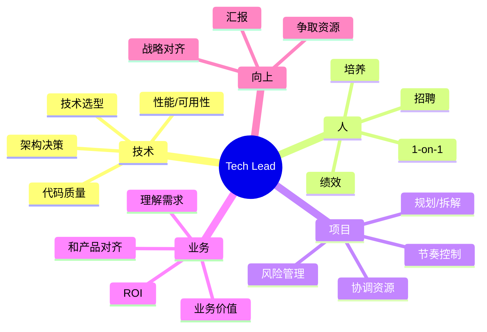
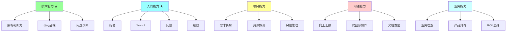
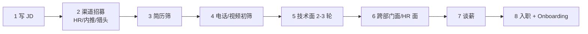
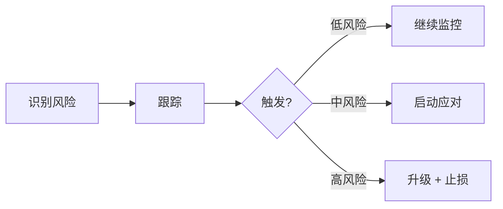
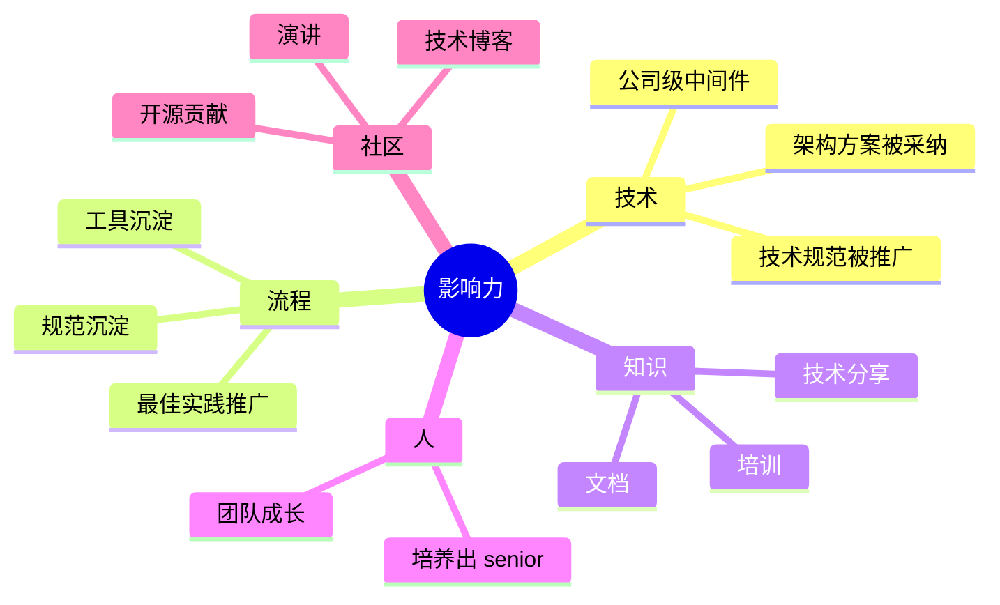

# Tech Lead 能力建设

> 8 年→准 P7/TL 跃迁的核心能力图谱：角色定位 / 招聘 / 1-on-1 / 项目管理 / 跨团队协作 / 技术评审 / 团队赋能 / 影响力 / 反模式
>
> 混合导向：日常实战 + 晋升答辩 + 面试 + 大厂对比

---

## 一、TL 是什么？不是什么？

### 1.1 TL 角色定位

**Tech Lead = 技术负责人 + 团队负责人 + 业务对齐者**。



### 1.2 不同公司的 TL 定义

| 公司 | 名称 | 是否管人 |
| --- | --- | --- |
| Google | Tech Lead (TL) | 不直接管（有 Manager） |
| Google | TLM | 既是 TL 也是 Manager（管 5-10 人） |
| 字节 | 技术负责人 | 通常管 5-15 人 |
| 阿里 | TL（一线主管）| 管 5-10 人 |
| 美团 | 技术 Owner | 模块负责，可能不管人 |
| 腾讯 | 组长 | 管 5-10 人 |

**关键差异**：
- **纯 TL**（不管人）：技术决策 + 项目推进，绩效由 Manager 给
- **TLM**（管人）：技术 + 人事一肩挑，**8 年→P7 升迁路径多走这条**

### 1.3 TL vs Senior IC vs Manager

| | Senior IC | TL | Manager |
| --- | --- | --- | --- |
| 主要交付 | 高质量代码 | 技术方案+落地 | 团队产出 |
| 影响范围 | 模块 | 服务 / 项目 | 团队 / 跨团队 |
| 评估指标 | 代码 / 设计 | 项目成功 + 团队成长 | 团队产出 + 人才发展 |
| 写代码 | 80%+ | 30-50% | < 20% |
| 开会 | 少 | 多（设计 / 评审 / 跨团队） | 大量（1-on-1 / 跨团队 / 向上） |

**8 年常见路径**：
- Senior IC → TL（不管人，专家路线）→ Staff Eng（架构师）
- Senior IC → TLM → Manager（管理路线）

**关键认知**：TL 不是"代码写得好"的人，而是**让团队整体产出更高的人**。

---

## 二、TL 核心能力图谱



**能力优先级（8 年→TL 必备）**：
1. 技术能力（基础门槛，不能弱）
2. **人的能力**（最核心差距，多数 IC 转 TL 死在这）
3. 项目能力（可学）
4. 沟通能力（持续锻炼）
5. 业务能力（决定能走多远）

---

## 三、招聘

### 3.1 为什么 TL 必须懂招聘

> **招聘是 TL 最重要的事，没有之一**（80% 的 TL 共识）

理由：
- 团队产出 = 团队成员的乘积，**招错一个拖团队半年**
- 招聘节省的时间 << 培训差人花的时间
- 招到 1 个 senior > 招 3 个 junior 拼凑

### 3.2 招聘流程（TL 主导）



**TL 在哪几步深度参与**：
- 写 JD（关键词 / 必备 / 加分项）
- 简历筛（每天看 5-10 份）
- 技术面（每周 3-5 场）
- 决策（综合面试官意见）
- Onboarding 计划

### 3.3 写好 JD 的关键

```
✅ 好 JD:
- 业务背景一句话
- 你做什么（具体）
- 你能学到什么
- 必备技能 5-7 条（不要太多）
- 加分项 3-5 条
- 团队介绍 + 文化

❌ 差 JD:
- 抄业内通用模板
- 必备技能 20 条（看了就劝退）
- 不写业务背景（只写技能要求）
- 不提团队（候选人选不出感情）
```

### 3.4 面试评估维度

```
□ 技术深度（专业领域 + 原理）
□ 技术广度（多领域涉猎）
□ 工程素养（测试 / CR / 文档）
□ 业务理解（之前项目业务背景能讲清）
□ 沟通表达（思路清晰 / 听懂问题）
□ 学习能力（新技术怎么学）
□ 抗压（压力面 / 故障应对）
□ 文化匹配（价值观 / 工作方式）
```

**关键技巧**：用 **STAR 行为面试**（情景-任务-行动-结果）评估软实力。

### 3.5 招聘反模式

| 反模式 | 危害 |
| --- | --- |
| **凑人数招** | 拖累团队多年 |
| **只看简历好不好** | 实际能力可能差 |
| **不做 reference check** | 招到坑货 |
| **看技能不看潜力** | 招到瓶颈人 |
| **不说明缺点** | 入职后预期落差 |
| **谈薪太狠** | 给低 offer 留不住人 |

**铁律**：**Hire slow, fire fast**（招慢点，开除快点）。宁可空缺也不招错。

---

## 四、1-on-1

### 4.1 什么是 1-on-1

**1-on-1 = TL 和团队成员一对一定期沟通**。

频率：
- 通常 **1-2 周一次**
- 每次 30-60 分钟
- 雷打不动（除非紧急）

**目的**（核心是被沟通方的视角）：
- 听他说（不是 TL 说）
- 理解他的状态、困难、想法
- 给反馈（持续小反馈优于年度大反馈）
- 帮他成长 / 解决障碍

### 4.2 1-on-1 怎么开

**议程（固定结构）**：
```
1. 最近怎么样？（生活 + 工作状态）
2. 工作进展 / 阻塞
3. 反馈给他（持续校准）
4. 他的反馈给我
5. 长期发展（每 1-2 月深聊一次）
6. AOB / 自由话题
```

**TL 必须做的**：
- 准备话题（不要空场）
- 听 70% 说 30%
- 记录 + 跟进上次议题
- 不打断不批判
- 关注情绪（看出问题主动问）

### 4.3 1-on-1 反模式

```
❌ 状态汇报会（应该 daily / weekly）
❌ TL 一个人讲（变成训话）
❌ 临时取消（信任下降）
❌ 大家都在的会议室开（隐私感差）
❌ 不记录（下次忘了）
❌ 只问工作不问人（情感账户耗尽）
```

### 4.4 关键问题清单

**长期问题**（每月深聊）：
- 你工作中最让你兴奋的是什么？
- 最让你沮丧的是什么？
- 6 个月后你想成为什么样？
- 我能怎么帮你成长？
- 团队哪里可以改进？

**短期问题**（每次问）：
- 这周最大的进展？
- 哪里被卡住？
- 我能帮什么忙？
- 对最近团队/项目有什么想法？

### 4.5 给反馈的技巧

**SBI 模型**（Situation-Behavior-Impact）：
```
Situation: 上周架构评审会上...
Behavior: 你直接打断了 X 的发言，说他方案有问题...
Impact: X 后来跟我反馈感觉不被尊重，可能影响他主动表达...
```

**比"你这样不对"具体 10 倍**。

**正向反馈也要给**（很多 TL 只给负面）：
- 看到好的及时表扬
- 公开表扬（团队会）+ 私下表扬（1-on-1）
- 具体（不要泛泛"你很棒"）

---

## 五、项目管理

### 5.1 TL 的项目管理 ≠ 甘特图

TL 项目管理重点：
- **拆解**（大需求 → 可执行任务）
- **估算**（合理工时 + 风险 buffer）
- **协调**（跨团队 / 资源 / 优先级）
- **风险管理**（识别 + 应对 + 升级）
- **节奏控制**（避免赶死线 / 避免拖延）

### 5.2 需求拆解（最常考）

**MECE 原则**：相互独立、完全穷尽。

```
大需求: 订单系统重构
  ↓ 拆解
1. 数据模型重构
2. 接口重构
3. 分库分表迁移
4. 灰度发布
5. 监控告警
6. 文档培训

每个子任务再拆到 1-3 天可完成的任务
```

**估算技巧**：
- 让做事的人估（不是 TL 拍脑袋）
- 估时 + 加 1.5x buffer（实际经验）
- 不确定的任务先 spike（探索）2-3 天再估

### 5.3 风险管理

**3 层应对**：



**典型风险**：
- 关键人 sick / 离职
- 上下游接口延期
- 性能不达标
- 数据迁移出错
- 安全漏洞

**风险登记表**（TL 必备）：
```
| 风险 | 概率 | 影响 | 应对 | Owner | 状态 |
|------|------|------|------|-------|------|
```

### 5.4 节奏控制

**避免两极**：
- 死线压力大 → 加班赶 → 质量降 → bug 多 → 上线推迟
- 太宽松 → 拖延 → 项目失控

**最佳实践**：
- 每周 demo / review
- 关键里程碑插旗
- 持续小步交付
- 灰度发布

### 5.5 项目管理反模式

```
❌ 全部拍 TL 一个人（独裁）
❌ 不做估算（凭感觉）
❌ 不识别风险（出事才发现）
❌ 死线压死（赶工 + 质量差）
❌ 不沟通进度（出事爆雷）
❌ 不复盘（重复犯错）
```

---

## 六、跨团队协作

### 6.1 8 年的跨团队场景

```
- 上下游对接（API / 数据 / 协议）
- 共享中间件（Redis / Kafka / 注册中心）
- 跨业务联动（新功能涉及 N 个业务方）
- 治理改造（公司级 DDD / Mesh / 监控接入）
- 故障协作（线上事故跨多服务）
```

### 6.2 协作的核心：先建立信任

**信任建立**：
- 准时（开会 / 交付 / 回应）
- 靠谱（说到做到 / 困难提前说）
- 共赢（不只为自己 / 帮别人成功）
- 透明（不藏信息 / 不甩锅）

**信任坏掉的代价**：
- 别人不愿意配合
- 资源争取不到
- 项目推不动

### 6.3 协作的关键技巧

**接口契约先行**：
```
跨团队协作:
  1. 先对齐契约（API / 字段 / SLA）
  2. 各自按契约开发
  3. 联调阶段冒烟
  4. 上线灰度

避免:
  - 边做边讨论接口
  - 默认对方按你期望的做
  - 不给文档让人猜
```

**RACI 矩阵**（明确角色）：
- **R**esponsible（执行）
- **A**ccountable（负责，最终问责）
- **C**onsulted（咨询）
- **I**nformed（知会）

### 6.4 跨团队冲突怎么解

```
1. 明确分歧点（不是吵姿势，是吵观点）
2. 用数据说话（不要情绪）
3. 找共同目标（业务价值）
4. 实在不行升级（向上找共同 manager）
5. 复盘改进（防再次发生）
```

### 6.5 跨团队反模式

```
❌ 凡事先吵（破坏信任）
❌ 抢功 / 甩锅
❌ 不主动同步进度
❌ 没契约就开发
❌ 出事推下游
❌ 不参加跨团队会议
```

---

## 七、技术评审

### 7.1 TL 主导的评审类型

```
- 架构评审（大型方案）
- 设计评审（中型功能）
- 代码评审（PR）
- 上线评审（变更安全）
- 故障复盘（事后）
```

### 7.2 评审的核心目的

不是"挑刺"，而是：
- 集思广益（避免盲点）
- 知识共享（团队对齐）
- 决策记录（ADR）
- 风险识别（提前发现）

### 7.3 主持评审的要点

**会前**：
- 提前发材料（不要让人看 PPT 现场理解）
- 明确议程 + 时间
- 邀请合适的人（不要太多 / 不要遗漏关键人）

**会中**：
- 限时（每个议题 15-30 分钟）
- 控场（避免发散 / 避免单人独霸）
- 引导质疑（"还有没有遗漏的风险？"）
- 记录决策（不要会后忘了）

**会后**：
- 输出 ADR（决策记录）
- 跟进行动项
- 公开评审结论

### 7.4 评审 Checklist

```
□ 业务价值清晰
□ 技术方案合理
□ 性能 / 可用性 / 扩展性考虑
□ 安全性
□ 兼容性 / 灰度方案
□ 监控 / 告警
□ 回滚方案
□ 文档完备
□ 风险识别
□ 资源依赖明确
```

---

## 八、团队赋能

### 8.1 TL 的产出 = 团队产出

> "你不再是一个英雄，你的工作是制造更多英雄。"

**赋能手段**：
- 技术分享（每周 / 每两周）
- Onboarding（新人快速上手）
- 内部培训（新技术 / 业务知识）
- 文档建设（架构图 / Runbook）
- Code Review 教学
- Pair Programming
- 给挑战性任务（拉伸成长）

### 8.2 培养的关键

**因人施策**：
- Junior：手把手 + 小任务 + 高频反馈
- Mid：任务包 + 引导思考 + 中频反馈
- Senior：复杂项目 + 自主性 + 低频反馈

**给机会，不抢功**：
- 让团队成员上台分享（不是 TL 独占）
- 让团队成员对外汇报（不是 TL 代讲）
- 让团队成员主导项目（TL 退到顾问）

### 8.3 留人

**Senior 离职原因 TOP 5**：
1. 没成长（同质工作太多）
2. 不被认可（给完工作没反馈）
3. 跟同事 / 老板不合
4. 钱不够
5. 看不到未来

TL 能影响前三个：
- 提供有挑战的工作
- 给充分的认可（公开 + 私下）
- 营造好的氛围

### 8.4 反模式

```
❌ 把成员当螺丝钉（只分配任务）
❌ 不给成长机会
❌ 抢成员的功（不公平）
❌ 不解决人际矛盾
❌ Senior 离职反应迟钝
```

---

## 九、影响力建设

### 9.1 影响力 = TL 升迁的硬通货

晋升 P7/P8 的核心评估：**影响力**。

不是只看你做了什么，而是：
- 你影响了多少人？
- 你产出的东西被多少人/项目用？
- 你推动了什么改变？

### 9.2 影响力来源



### 9.3 怎么放大影响力

**对内**：
- 写好的设计文档（被多团队引用）
- 主动做技术分享（部门 / 公司级）
- 提案治理改造（推全公司）
- 培养出能独当一面的 senior

**对外**：
- 技术博客（公司公众号 / 个人博客）
- 大会演讲（QCon / GOPS / GIAC）
- 开源贡献（GitHub / 公司开源项目）
- 社区活跃（知乎 / 掘金 / Twitter）

### 9.4 影响力的评估

晋升答辩时，**讲影响力的角度**：
- 影响范围（个人 / 团队 / 部门 / 公司 / 业内）
- 量化指标（节省人天 / 提升效率 N% / 减少故障 N 起）
- 持续性（一次性还是长期沉淀）
- 复用性（被多少项目使用）

---

## 十、向上管理

### 10.1 不是拍马屁，是双赢

向上管理的目的：
- 让上级了解你的工作（给对的反馈）
- 让上级理解你的需求（争取资源）
- 让你了解上级的优先级（对齐方向）

**核心**：上级也是人，有他的压力 / KPI / 决策依据，TL 要让自己**好用**。

### 10.2 怎么做

**主动汇报**：
- 周报 / 月报（重要进展 + 风险 + 需要支持）
- 1-on-1（和老板）
- 重大事件实时同步（不让老板从别人那听到）

**清晰表达**：
- 结论先行（不要绕弯）
- 量化（"节省 50% 时间"而不是"快很多"）
- 给方案不只给问题

**理解老板的视角**：
- 他向上要交代什么？
- 他被什么 KPI 压？
- 他的关注点是什么？

### 10.3 向上反模式

```
❌ 不汇报（老板不知道你做什么）
❌ 报喜不报忧（出事爆雷）
❌ 只甩问题不给方案
❌ 越级（绕过老板找他老板）
❌ 拒绝合理批评（玻璃心）
```

---

## 十一、TL 反模式（自检清单）

### 反模式 1：还在写 80% 代码

```
TL 自己冲在最前面写代码 → 团队成员被边缘化 → 不成长 → 离职
```

**修复**：30-50% 写代码，剩下时间放在团队 / 项目 / 沟通。

### 反模式 2：技术决策独裁

```
所有方案 TL 拍板，团队执行 → 没参与感 + 没成长
```

**修复**：让团队成员主导设计，TL 引导 + 决策。

### 反模式 3：报喜不报忧

```
项目有风险不告知老板 → 出事爆大雷 → 信任崩
```

**修复**：风险尽早升级，宁可被骂也别藏。

### 反模式 4：成员冲突视而不见

```
团队两个核心成员吵架 / 冷战 → TL 装看不见 → 团队气氛崩
```

**修复**：及时调解 / 调岗 / 升级。

### 反模式 5：不招人或招错人

```
团队空缺 6 个月不招 → 大家累死 → 离职
或者
凑数招人 → 拖累团队
```

**修复**：Hire slow, fire fast。**宁缺勿滥**。

### 反模式 6：不给反馈

```
团队成员做完事不知道做得好不好 → 自我怀疑 / 重复犯错
```

**修复**：1-on-1 必给反馈，SBI 模型。

### 反模式 7：会议太多

```
TL 一天 8 个会 → 没时间思考 / 团队也被卷入会海
```

**修复**：拒绝低价值会议 / 限时 / 异步沟通替代部分会议。

### 反模式 8：技术上吃老本

```
TL 不学新东西 → 技术判断力下降 → 决策落后
```

**修复**：每周保留 N 小时学习 / 跟踪行业新趋势 / 动手做 demo。

### 反模式 9：不写文档

```
"等忙完了再写" → 永远不写 → 团队没沉淀
```

**修复**：边做边写 / 决策记 ADR / 故障必有复盘文档。

### 反模式 10：不做 1-on-1

```
"团队都熟了不需要 1-on-1" → 慢慢失去对人的感知 → 离职惊讶
```

**修复**：1-on-1 是 TL 最重要的活动之一，雷打不动。

---

## 十二、晋升答辩 / 大厂面试常考

### Q1: 你做 TL 这段时间最大的成长是什么？

**框架**：
- 之前是什么状态（更多个人贡献）
- 转 TL 后遇到什么挑战（人 / 项目 / 跨团队）
- 学到什么（具体能力 / 思维方式）
- 现在能驾驭什么之前不能的事（量化）

**避坑**：不要只讲"沟通能力提升了"这种空话。

### Q2: 你怎么招聘？

**框架**：
- 招聘漏斗（JD → 简历 → 电话 → 技术面 → 决策）
- 自己面过多少候选人 / 招到几个
- 技术面看什么（深度 + 广度 + 工程素养）
- 决策原则（Hire slow, fire fast）

### Q3: 你怎么做 1-on-1？

**框架**：
- 频率 / 时长 / 议程
- 关键问题
- 怎么给反馈（SBI）
- 处理过什么棘手情况

### Q4: 你带过最大的项目？

**框架**：
- 项目背景 / 业务价值
- 你的角色 / 团队规模
- 难点 / 风险 / 应对
- 结果（量化指标）
- 复盘 / 沉淀

### Q5: 团队成员闹矛盾你怎么处理？

**框架**：
- 不能装看不见
- 1-on-1 分别听
- 找根因（业务分歧 / 风格冲突 / 利益）
- 调解 / 调岗 / 升级
- 给反馈防再次发生

### Q6: 跨团队协作出冲突怎么解？

**框架**：
- 明确分歧点
- 用数据 / 业务价值说话
- 找共同 manager
- 复盘改进

### Q7: 团队 senior 要离职你怎么办？

**框架**：
- 先理解原因（不是只谈钱）
- 评估能否挽留 / 调整工作
- 必要时升级（找老板 / HR）
- 不能挽留就好聚好散 / 学到经验
- 提前布局（防关键人风险）

### Q8: 你怎么平衡技术和管理？

**框架**：
- 比例（如 30% 技术 / 70% 管理）
- 保持技术深度（参与关键设计 / Code Review）
- 不放弃技术判断力（看趋势 / 做 demo）
- 用技术影响力放大管理效果

### Q9: 你最自豪的影响力是什么？

**框架**（必备答辩题）：
- 影响范围（个人 → 团队 → 部门 → 公司 → 业内）
- 具体做了什么
- 量化结果（节省 N 人天 / 提升 N% / 复用到 N 个项目）
- 长期价值

### Q10: 你和老板有过分歧怎么处理？

**框架**：
- 先理解老板的视角和压力
- 用数据 / 业务价值表达自己观点
- 不行就接受决定（执行到位）
- 复盘改进沟通方式

---

## 十三、大厂 P 级对比

### 字节 / 阿里 / 腾讯 P6/P7/P8 大致映射

```
8 年工作经验通常对标:
  字节: 2-1 ~ 2-2 (高级 / 资深，部分到 3-1 专家)
  阿里: P6+ ~ P7
  腾讯: T2.3 ~ T3.1
  美团: 资深开发 ~ 高级技术专家
  Google: L4 ~ L5
```

### P6 vs P7 核心差异

| | P6 高级 | P7 资深 / TL |
| --- | --- | --- |
| 影响范围 | 模块 / 单服务 | 跨服务 / 子系统 / 团队 |
| 技术深度 | 1 个领域专家 | 1-2 个领域专家 + 多领域涉猎 |
| 项目主导 | 子项目 | 跨团队大项目 |
| 团队 | 个人贡献 | 带 5-10 人团队 / 影响 20+ 人 |
| 决策 | 局部技术决策 | 系统级 / 团队级决策 |
| 输出 | 高质量代码 | 架构 / 规范 / 流程 / 人 |

### 各厂 TL 名称

| 公司 | 名称 | 是否管人 |
| --- | --- | --- |
| 字节 | TL / 技术负责人 | 通常管 5-15 人 |
| 阿里 | TL / 一线主管 | 管 5-10 人 |
| 美团 | 技术 Owner | 模块级，可能不管人 |
| 腾讯 | 组长 | 管 5-10 人 |
| 网易 | 组长 / Tech Lead | 管 5-10 人 |
| Google | TL（不管人） / TLM（管人） | 看类型 |

---

## 十四、TL 学习资源

```
书籍:
  □ 《极客与团队》(Team Geek) - Brian W. Fitzpatrick
  □ 《卓有成效的工程师》- Edmond Lau
  □ 《硅谷工程师面试指南》(The Manager's Path) - Camille Fournier
  □ 《重新定义团队》- Laszlo Bock (Google)
  □ 《重新定义公司》- Eric Schmidt
  □ 《关键对话》- Kerry Patterson
  □ 《刻意练习》- Anders Ericsson
  □ 《非暴力沟通》- Marshall Rosenberg

播客 / 视频:
  □ Lenny's Podcast (产品 / 工程 leadership)
  □ Engineering Daily
  □ Stripe Press

实践:
  □ 在内部找 mentor
  □ 加入工程师社区（如 GIAC / QCon 演讲者圈子）
  □ 定期写复盘
  □ 主动承担跨团队项目
```

---

## 十五、TL 自检 Checklist

每月自检一次：

```
团队层面:
  □ 团队成员都有清晰的目标
  □ 每个人都做 1-on-1（最近 2 周）
  □ Senior 没有离职信号
  □ Junior 有成长（独立完成的事在变多）
  □ 团队气氛 OK（没人冷战 / 抱怨）
  □ 招聘有进展（如果有空缺）

项目层面:
  □ 关键项目按时推进
  □ 风险有识别 + 应对
  □ 跨团队协作顺畅
  □ 上线有灰度 + 监控
  □ 故障有复盘

技术层面:
  □ 关键架构决策有 ADR
  □ 团队代码质量在提升
  □ 技术债有清单
  □ 自己技术判断力没退步

向上 / 跨团队:
  □ 老板了解我的工作
  □ 跨团队信任良好
  □ 没有 surprise（重要事不让老板从别处听到）

个人:
  □ 有学习时间
  □ 没有 burnout
  □ 影响力在扩大
```

---

## 十六、面试 / 答辩加分点

- **TL 的核心是让团队整体产出更高**，不是自己冲在最前面
- **招聘是 TL 最重要的事**（Hire slow, fire fast）
- **1-on-1 是 TL 最重要的工具**（雷打不动）
- **影响力 = 晋升 P7/P8 的硬通货**（不是只看你做了什么）
- **向上管理不是拍马屁**，是让上级好理解你 + 你好理解上级
- **跨团队协作先建信任**，比技术能力更重要
- **TL ≠ 技术最强的人**，是让团队最强的人
- **30-50% 写代码** 是健康的 TL 比例
- **技术决策权下放**，让团队成员主导
- **风险尽早升级**，不要藏到爆雷
- **持续小反馈 > 年度大反馈**（SBI 模型）
- **不同 senior 用不同方式管**（因人施策）
- 8 年→TL 转型最大的难点是 **从个人贡献者思维转为团队思维**
