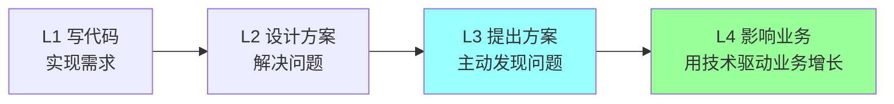
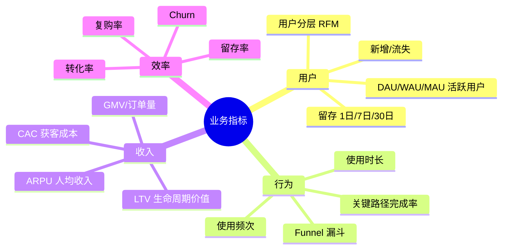
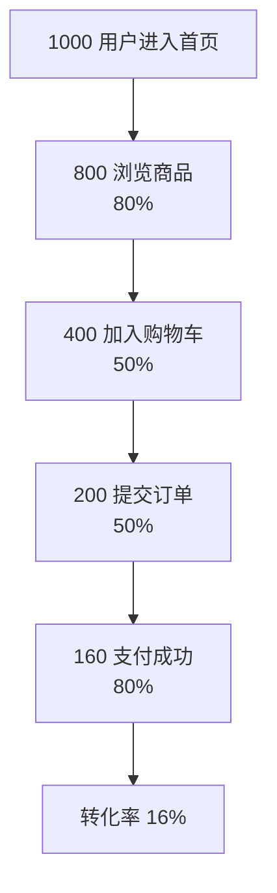
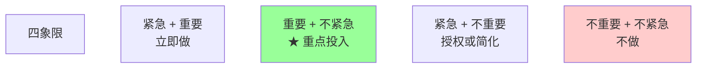
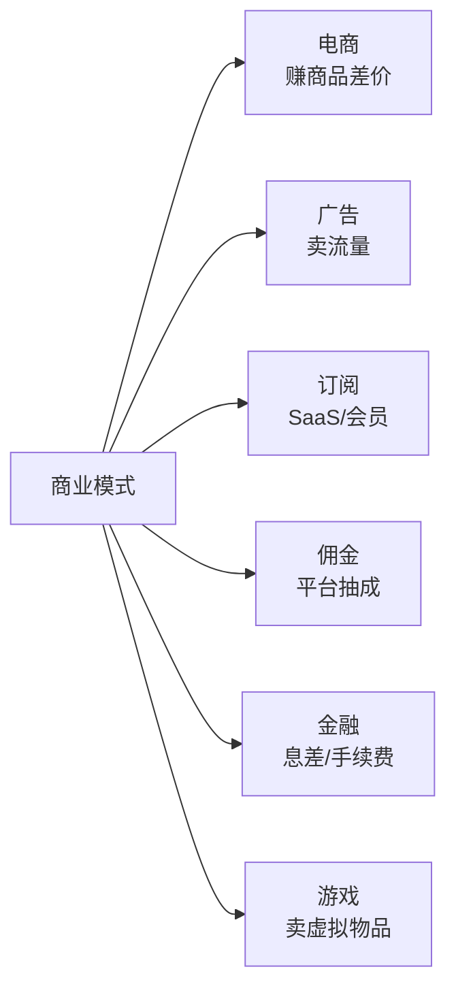
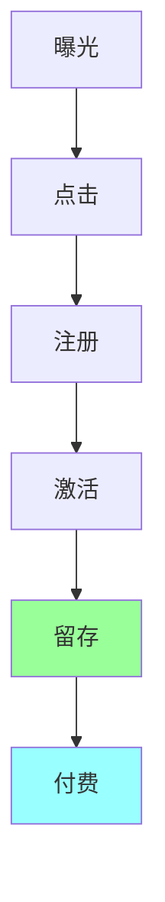
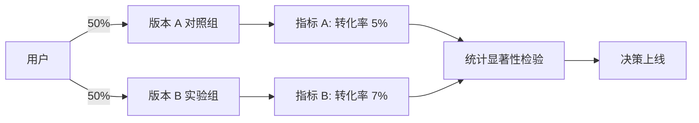

# 业务与产品思维

> 8 年 → TL/P7 必备的业务能力：业务指标 / ROI / 用户视角 / 产品对齐 / 商业逻辑 / 数据驱动
>
> 这是技术人最容易忽视、却最影响晋升的能力维度

---

## 一、为什么技术人要懂业务

### 1.1 资深面试 / 晋升的关键追问

```
"你做这个功能的业务价值是什么？"
"这个项目带来了多少 GMV / DAU 提升？"
"你们的核心业务指标是什么？"
"如果让你重做，业务上会怎么改？"
```

很多 8 年技术人答不上来 → **这就是天花板**。

### 1.2 业务理解决定职业上限



| 等级 | 视角 | 对标 |
| --- | --- | --- |
| L1 写代码 | 实现 | P5-P6 |
| L2 设计方案 | 系统 | P6-P7 |
| L3 主动发现问题 | 业务 + 技术 | P7-P8 |
| L4 驱动业务增长 | 战略 | P8+ |

**8 年→P7 的关键跨越**：从"实现需求"到"理解 / 质疑 / 优化需求"。

### 1.3 不懂业务的代价

```
□ 做了无用的功能（产品给什么做什么）
□ 优化了不重要的指标（自嗨）
□ 和产品永远在对抗（不理解他们的目标）
□ 看不出技术债的轻重缓急（不知道哪个影响业务）
□ 答辩讲不清价值（只讲技术深度，没业务影响）
□ 没法 push back 不合理需求（被产品牵着走）
```

---

## 二、业务指标基础

### 2.1 不同业务的核心指标

每种业务都有自己的"北极星指标"：

| 业务 | 核心指标 |
| --- | --- |
| **电商** | GMV / 转化率 / 复购率 / 客单价 / ROAS |
| **内容/社交** | DAU / MAU / 时长 / 留存 / ARPU |
| **直播** | 同时在线数 / 打赏 GMV / 主播留存 |
| **游戏** | DAU / 付费率 / ARPU / LTV / 7 日留存 |
| **SaaS** | MRR / ARR / NPS / 续费率 / Churn |
| **广告** | CTR / CPM / eCPM / 填充率 / 用户体验 |
| **金融** | 资产规模 / 不良率 / 用户活跃 / 风控通过率 |
| **OTA** | 订单量 / 客单价 / 复购 / 用户满意度 |
| **教育** | 完课率 / 续课率 / NPS / CAC |

**TL 必备**：你能不能脱口而出**自己业务的核心 5 个指标 + 当前数值 + 趋势**？

### 2.2 通用指标体系



### 2.3 必懂的指标公式

```
ROI = 收益 / 成本
ROAS = 广告收入 / 广告花费
LTV = ARPU × 平均生命周期
CAC = 获客总成本 / 新增用户数
LTV/CAC > 3 是健康
ARPU = 总收入 / 用户数
ARPPU = 总收入 / 付费用户数（更精准）
DAU = 每日活跃用户数
MAU = 每月活跃用户数
DAU/MAU = 用户黏性（> 50% 黏性高）
留存率 = 第 N 日仍活跃用户 / 第 0 日新增
转化率 = 完成目标用户 / 进入用户
Churn = 流失用户 / 总用户
```

### 2.4 漏斗分析（最常用）



**TL 必须能定位漏斗瓶颈**：
- 首页 → 浏览：缺爆款？分类不清？
- 浏览 → 加购：商品质量？价格？
- 加购 → 提交：购物车太复杂？地址不全？
- 提交 → 支付：支付失败率高？

技术能解决的：性能 / 体验 / 错误率。
不能解决的：商品质量 / 价格 / 营销。

---

## 三、ROI 思维

### 3.1 技术决策必须算 ROI

> **资源永远是稀缺的，做 A 就不能做 B，TL 必须算账。**

**ROI 公式**：
```
ROI = (收益 - 成本) / 成本

收益:
  - 业务收益（GMV / 用户 / 留存）
  - 效率收益（节省人天 / 降低错误率）
  - 风险收益（避免事故 / 合规）

成本:
  - 人天（开发 / 测试 / 运维）
  - 资源（服务器 / 带宽 / 第三方）
  - 机会成本（不做其他事）
  - 风险成本（出错代价）
```

### 3.2 优先级矩阵



**TL 大部分时间应在 Q2**：架构演进 / 团队培养 / 技术规划。

### 3.3 ROI 计算实例

**例 1：要不要做 Redis 缓存改造？**

```
成本:
  开发 30 人天
  运维 5 人天/季度
  Redis 集群 5w/年

收益:
  P99 从 500ms → 100ms
  → 用户停留时长 +5%
  → DAU 转化率 +2%
  → 预估 GMV +500w/年

ROI: (500w - 5w 运维) / (35*1000 + 5w 服务器) ≈ 50x

结论: 强 ROI，立即做
```

**例 2：要不要做 Mesh 改造？**

```
成本:
  改造 6 个月 + 5 人专项
  Sidecar 资源 +20%（10w/月 = 120w/年）
  团队学习曲线

收益:
  治理统一（节省每服务 5 人天）
  多语言无差别
  → 长期价值，但当前业务难量化

结论:
  如果服务 < 50：不做（杀鸡用牛刀）
  如果服务 > 100：做（长期价值大）
  当前 30 个：暂不做，先准备
```

### 3.4 ROI 的常见误区

```
❌ 只看技术好坏不看 ROI
❌ 只看短期收益不看长期
❌ 不算机会成本（做这个不能做那个）
❌ 收益拍脑袋（不验证）
❌ 成本算不全（漏机会成本 / 维护成本）
```

### 3.5 用 ROI 推动跨团队

向产品 / 老板要资源时：
```
❌ "我想做 X 改造"
✅ "做 X 改造投入 N 人天，预计带来 Y 业务收益，ROI 是 M。
    不做的风险：Z（性能拖累 / 故障频发 / 团队 burnout）"
```

老板更愿意为**清晰 ROI** 买单。

---

## 四、用户视角

### 4.1 技术人最容易缺的视角

技术人思维：
- 这个 API 性能多好
- 这个架构多优雅
- 这个代码多干净

用户思维：
- 我打开 App 多久能加载
- 我下单出错怎么办
- 我找不到入口

**两套思维都需要**，但**用户视角往往是 TL 的盲区**。

### 4.2 培养用户视角的方法

```
1. 自己用产品（每天）
2. 看用户反馈（App Store / 客服 / 社群）
3. 看用户行为数据（埋点 / 漏斗）
4. 听用户访谈（产品调研）
5. 关注用户增长 / 流失原因
```

### 4.3 用户分层（RFM 模型）

```
R (Recency)    最近一次活跃时间
F (Frequency)  活跃频次
M (Monetary)   消费金额

8 个分群:
  重要价值客户 (R 近 + F 高 + M 高)
  重要保持客户 (R 近 + F 低 + M 高)
  重要发展客户 (R 远 + F 高 + M 高)
  ...
  流失客户 (R 远 + F 低 + M 低)
```

不同分层用不同策略：
- 重要价值客户：维护 / 高端服务
- 流失客户：召回 / 优惠

技术上：能不能在系统层面支持分层？打标 / 分发 / 推送。

### 4.4 关键技术指标 → 用户体感

| 技术指标 | 用户体感 | 影响 |
| --- | --- | --- |
| P99 < 1s | 流畅 | 高满意度 |
| P99 1-3s | 可接受 | 轻微不满 |
| P99 3-10s | 慢 | 流失 |
| P99 > 10s | 卡死 | 大量流失 |
| 错误率 < 0.1% | 几乎无感 | OK |
| 错误率 0.1-1% | 偶尔遇错 | 部分流失 |
| 错误率 > 1% | 频繁出错 | 大量流失 |
| 启动时间 > 3s | App 慢 | 卸载 |

**技术指标 = 业务指标的间接影响**，TL 要能讲清这个映射。

---

## 五、和产品对齐

### 5.1 技术 vs 产品的天然冲突

```
产品视角:
  - 用户要什么 → 做什么
  - 上线越快越好
  - 差不多能用就上线
  - 一个功能用一阵就改

技术视角:
  - 长期可维护
  - 架构合理
  - 代码质量
  - 测试 / 监控完备
```

**冲突常态化**，关键是**双赢**而非"打败对方"。

### 5.2 怎么和产品对齐

**第一步：理解产品的视角**
- 他被什么 KPI 压？
- 他的优先级是什么？
- 他的客户（业务方 / 老板）想要什么？

**第二步：用产品听得懂的语言沟通**
- ❌ "这个改造要重构基础架构"
- ✅ "这个改造能让首屏加载快 50%，预计提升转化率 2%"

**第三步：协商 + 妥协**
- 产品要的功能：能做
- 技术要的质量：留时间
- 双方各退一步

### 5.3 push back 不合理需求

8 年 TL 必备能力：**学会说"不"**。

不合理需求的特征：
- ROI 极低（成本高 / 收益小）
- 和长期方向冲突
- 时间不合理（要赶完成度差的版本）
- 影响其他更重要的事

**怎么 push back**：
```
1. 理解需求背后的真实目标
   "你为什么要做这个？想达到什么效果？"

2. 提供替代方案
   "我理解你的目标，A 方案要 30 人天，但有 B 方案 10 人天能达到 70% 效果。"

3. 用数据说话
   "如果做 X，会推迟 Y 关键项目 2 周，影响 Z 业务指标。"

4. 升级到老板
   实在不行让你的老板和产品的老板对齐优先级
```

### 5.4 主动给产品建议

P7/P8 不是被动接需求，而是**主动给产品建议**：

```
观察数据 → 发现问题 → 提改进方案 → 推动产品采纳

例子:
  "我看了支付成功率数据，发现银联通道在某些机型成功率只有 80%，
   建议加重试 + 切到备用通道，预计能提升整体成功率 3%。"
```

这种主动性是 P7→P8 的关键。

---

## 六、商业逻辑基础

### 6.1 互联网商业模式（必懂）



每种模式的关键指标和优化方向不同：
- 电商：GMV / 客单价 / 复购
- 广告：CTR / 用户时长 / 填充率
- 订阅：续费率 / Churn / NPS
- 游戏：付费率 / ARPU / LTV
- 金融：资产规模 / 不良率

### 6.2 单位经济（Unit Economics）

```
你赚的每一个用户:
  收入 (LTV) - 成本 (CAC + 服务成本) > 0

健康的指标:
  LTV / CAC > 3
  Payback Period < 12 个月
```

如果 LTV < CAC：每个用户都在亏，融资烧钱模式（Uber 早期 / 共享单车）。

技术能影响 CAC（获客成本）和 LTV（用户价值）：
- CAC：搜索/推荐算法、增长技术
- LTV：留存（性能 / 体验）、ARPU（推荐 / 付费转化）

### 6.3 流量漏斗与转化



每一步的优化方向不同。技术人要知道你的工作影响哪一步。

### 6.4 业务节奏：增长期 vs 成熟期

```
增长期（用户/收入快速增长）:
  - 优先速度（功能上线快）
  - 容忍技术债（先抢市场）
  - 业务驱动技术

成熟期（业务稳定）:
  - 优先质量（重构 / 治理）
  - 还技术债
  - 提升效率
```

不同阶段，技术决策完全不同。**TL 要懂当前公司在哪个阶段**。

---

## 七、数据驱动

### 7.1 数据驱动 vs 经验驱动

```
经验驱动: "我感觉 A 好"
数据驱动: "数据显示 A 比 B 转化率高 5%"
```

**8 年 TL 必备**：所有重要决策都要有数据支撑。

### 7.2 必懂的数据基础设施

| 层级 | 工具 | 作用 |
| --- | --- | --- |
| 埋点 | SDK（前端 / 服务端） | 记录用户行为 |
| 数据采集 | Kafka / Logstash | 收集 |
| 数据仓库 | Hive / ClickHouse / Doris | 存储 |
| 计算 | Spark / Flink | 离线 / 实时 |
| BI / 报表 | Tableau / Superset / 内部 BI | 可视化 |
| A/B 测试 | 自研 / Optimizely / GrowthBook | 实验 |

技术人不一定都用，但**必须懂这套体系**。

### 7.3 A/B 测试

**核心**：不靠拍脑袋，**用实验验证**。



**TL 必懂**：
- 怎么设计 A/B（流量分配 / 时间窗口 / 显著性）
- 怎么读结果（统计显著 vs 业务显著）
- 怎么避免污染（同一用户不能跨组）

### 7.4 数据驱动的反模式

```
❌ "数据不重要，我感觉对就行"
❌ "数据也是片面的"（变成不行动的借口）
❌ 选择性看数据（只看支持自己的）
❌ A/B 没显著就硬上
❌ 不懂数据细节直接看 BI 报表
```

---

## 八、典型场景：TL 怎么用业务思维

### 场景 1：性能优化项目立项

❌ 弱表达：
> "现在系统慢，要优化。"

✅ 强表达：
> "P99 延迟 800ms，根据用户行为数据，每多 100ms 延迟流失 1.5% 用户。
> 优化到 200ms 预计带来 DAU +4.5%，按当前 ARPU 算月收入 +15w。
> 投入 30 人天，2 个月回本。"

### 场景 2：技术债清理

❌ 弱表达：
> "代码太烂了要重构。"

✅ 强表达：
> "当前订单服务每月有 5 起线上故障，平均每次影响 30min 业务停顿，
> 估算月损失 50w GMV。重构投入 60 人天，预计降低故障频率 80%，
> 月减损 40w。3 个月回本。"

### 场景 3：新技术引入

❌ 弱表达：
> "我们要上 Service Mesh。"

✅ 强表达：
> "当前 30 个微服务，治理 SDK 已经 3 套（Java/Go/Python），
> 维护成本每年 100w，且业务跟升 SDK 拖慢迭代。
> Mesh 改造 6 个月，落地后省 SDK 维护 + 治理统一，
> 预计 1 年回本。建议 Q3 启动，先 PoC 2 个核心服务。"

### 场景 4：人手不够要求扩招

❌ 弱表达：
> "团队太忙了，要招人。"

✅ 强表达：
> "当前团队 5 人，并行 3 个核心项目，单人压力 1.5 倍。
> 已有 2 个项目延期 1 个月，估算业务损失 30w。
> 建议招 2 个 senior，3 个月内能补齐缺口，全年扭转损失 + 加速另外 2 个项目。"

### 场景 5：拒绝产品需求

❌ 弱表达：
> "这个做不了。"

✅ 强表达：
> "理解你想提升 X 转化率。这个方案需要 30 人天，
> 但根据数据，瓶颈不在这里（漏斗显示是 Y 步骤流失最高），
> 投入 30 人天到 Y 优化预计提升 5%，比 X 方案的 1% 更有效。
> 建议优先做 Y。"

---

## 九、业务能力速成 Checklist

### 短期（2-4 周）

```
□ 列出公司的 5 个核心业务指标 + 当前数值 + 趋势
□ 看懂内部 BI 报表
□ 听一次产品 / 运营的周会
□ 自己当一周用户（每天用产品）
□ 看 100 条用户反馈
□ 算一次自己负责模块的 ROI
```

### 中期（1-3 个月）

```
□ 学一门数据分析（SQL + Python pandas）
□ 跑一次 A/B 测试（小项目）
□ 主动给产品提一个建议
□ 写一份业务分析报告
□ 参加业务培训 / 行业会议
```

### 长期（持续）

```
□ 关注行业新闻 / 竞品动向
□ 阅读经典商业书籍
□ 和产品 / 运营 / BD 建立信任关系
□ 主动承担跨技术 + 业务的项目
□ 培养"先想业务再想技术"的反射
```

---

## 十、晋升答辩 / 面试常考

### Q1: 你们核心业务指标是什么？

**框架**：
- 公司业务模式
- 北极星指标 + 5 个核心指标
- 当前数值 + 趋势
- 你的工作怎么影响哪个指标

### Q2: 你做的项目带来了什么业务价值？

**框架**：
- 量化（GMV / DAU / 留存提升 N%）
- 因果链（你的工作 → 技术指标 → 用户体感 → 业务指标）
- 数据来源（A/B 测试 / 上线前后对比 / 漏斗分析）

**避坑**：不要只讲技术指标（"P99 降了 80%"），要给业务影响。

### Q3: 怎么和产品争取技术债项目？

**框架**：
- 用 ROI 表达
- 量化技术债的代价（故障 / 人天 / 业务影响）
- 给清晰投入产出
- 必要时升级到老板

### Q4: 你怎么判断一个需求要不要做？

**框架**：
- 业务价值（指标提升）
- 投入成本（人天 / 资源 / 机会成本）
- 战略契合（和团队方向一致）
- 风险（失败影响）

不是所有需求都要做，**会说"不"**是 TL 的核心能力。

### Q5: 你最近发现什么业务问题？怎么解？

**框架**（最考察主动性）：
- 你怎么发现的（不是产品告诉你）
- 数据支撑
- 提出的方案
- 推动了什么

**避坑**：不要只讲技术问题（"线上挂了我修了"），要讲**业务问题**。

### Q6: 你怎么平衡技术质量和业务速度？

**框架**：
- 不同阶段不同策略（增长期速度 / 成熟期质量）
- 关键路径必须保质量
- 非关键允许技术债
- 定期还债

### Q7: 公司业务方向你怎么看？

**框架**（很多人答不上来 → 暴露不懂业务）：
- 行业趋势
- 公司当前阶段
- 主要竞争对手
- 关键挑战

每个 8 年技术人都应该能聊 5 分钟自己公司的业务。

### Q8: 你做过最大的业务影响是什么？

**框架**：
- 业务背景
- 你做了什么（具体）
- 量化结果
- 影响范围 + 持续性

**避坑**：不要泛泛"我做了个高并发系统"，要讲**业务影响**。

---

## 十一、推荐阅读

```
书籍:
  □ 《精益数据分析》(Lean Analytics)
  □ 《数据驱动》- DJ Patil
  □ 《增长黑客》(Growth Hacker)
  □ 《用户体验要素》- Jesse James Garrett
  □ 《浪潮之巅》- 吴军
  □ 《商业模式新生代》(Business Model Generation)

报告:
  □ 各大咨询公司行业报告（艾瑞 / 易观 / QuestMobile）
  □ 公司财报（看上市公司同行）
  □ 投行研报

公众号 / 博客:
  □ 三节课
  □ 人人都是产品经理
  □ 行业垂直公众号
```

---

## 十二、面试 / 答辩加分点

- **业务理解决定职业上限**，不是技术深度
- 8 年→P7 的关键跨越：**从"实现需求"到"理解/质疑/优化需求"**
- TL 必备：**脱口而出业务核心 5 个指标 + 数值 + 趋势**
- **所有重要决策算 ROI**（收益 / 成本）
- **技术指标 → 用户体感 → 业务指标** 的因果链能讲清
- **会说"不"**比能做更难，push back 不合理需求
- **主动给产品建议**是 P7→P8 的关键
- **数据驱动 > 经验驱动**，用 A/B 测试验证
- 不同业务阶段（增长 / 成熟）技术策略完全不同
- 答辩讲项目要讲**业务影响**，不只技术深度
- 每天**自己用产品** + 看用户反馈 是培养业务感的捷径
- 单位经济（**LTV/CAC > 3**）是商业健康的核心
